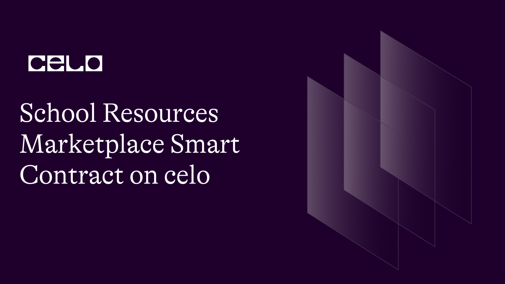

## INTRODUCTION

In this tutorial, you will learn how to create a decentralized marketplace on the Celo blockchain using Solidity programming language. Specifically, we will create a School Resources Marketplace where students can buy and sell educational resources such as books, lecture notes, and other educational materials. We will use the ERC-20 token standard to facilitate the exchange of value and the IPFS protocol to store the resources. This tutorial assumes basic knowledge of Solidity and blockchain technology. By the end of this tutorial, you will have a fully functional decentralized marketplace that can be used by students to exchange educational resources in a secure and decentralized manner.

## REQUIREMENT

To take this tutorial, you will need:

- Access to a code editor or text editor such as Remix.

- A reliable internet browser and internet connection.

## PREREQUISITE

- Basic knowledge of Javascript.

- Understand how Blockchain works.

- Have a basic knowledge of solidity.

Let's now start the process of writing our smart contract.

To begin, we need to create a new file in Remix called `schoolResources.sol`. You can learn how to create a new file on Remix by following this link. [(here)](https://remix-ide.readthedocs.io/en/latest/file_explorer.html#:~:text=Creating%20new%20files,-There%20are%202&text=The%20first%20is%20to%20click,will%20open%20in%20the%20Editor.).

Once you have created a new file, you can start writing your smart contract by declaring various statements.

```solidity
// SPDX-License-Identifier: MIT

pragma solidity >=0.7.0 <0.9.0;
```

The line `SPDX-License-Identifier: MIT` is an identifier for the license of the code, in this case, the `MIT License`. [The SPDX (Software Package Data Exchange)](https://spdx.dev/) identifier is a standardized way to identify open-source licenses.

Subsequently, we incorporate the interface for our ERC20 token.

```solidity
interface IERC20Token {
    function transfer(address, uint256) external returns (bool);

    function approve(address, uint256) external returns (bool);

    function transferFrom(
        address,
        address,
        uint256
    ) external returns (bool);

    function totalSupply() external view returns (uint256);

    function balanceOf(address) external view returns (uint256);

    function allowance(address, address) external view returns (uint256);

    event Transfer(address indexed from, address indexed to, uint256 value);
    event Approval(
        address indexed owner,
        address indexed spender,
        uint256 value
    );
}
```

In this session, we are defining an interface for an ERC20 token by creating a set of rules that a smart contract must follow if it wants to interact with an ERC20 token.

The `transfer` function enables us to transfer tokens from one address to another. The approve function allows us to grant an address the permission to spend tokens on our behalf. The transferFrom function permits an approved address to transfer tokens on behalf of the token owner.

The `totalSupply` function lets us know the total supply of the token. The balanceOf function returns the token balance of a particular address. The allowance function returns the amount of tokens approved by the token owner to be spent by the spender.

Additionally, we have included two events: `Transfer` and `Approval`. The Transfer event is emitted when tokens are transferred from one address to another, while the Approval event is emitted when a token owner approves an address to spend tokens on their behalf.

By implementing this interface in our ERC20 token contract, we can ensure that it is compatible with other smart contracts and services that use the ERC20 standard.

Next, We initiate the contract by giving it a name and defining our struct.

```solidity
contract SchoolResourcesMarketplace {
    uint256 private resourcesLength = 0;
    address private cUsdTokenAddress =
        0x874069Fa1Eb16D44d622F2e0Ca25eeA172369bC1;

    // fee to pay for downloading a resource
    uint256 public downloadFee = 1 ether;

    struct Resource {
        address payable owner;
        string title;
        string description;
        string url;
        uint256 price;
        bool isOnSale;
    }
```

In this session, we are defining a Solidity smart contract named `SchoolResourcesMarketplace`. The contract includes a private variable `resourcesLength`, which is initialized to `zero`. The resourcesLength variable will be used to keep track of the total number of resources in the marketplace.

The `cUsdTokenAddress` is a private variable that represents the address of a token contract. The cUsdTokenAddress variable is initialized with a default value of `0x874069Fa1Eb16D44d622F2e0Ca25eeA172369bC1`, which is the address of a testnet token contract.

The `downloadFee` is a public variable that represents the fee that users will pay to download a resource. The default value of downloadFee is set to 1 ether.

The Resource struct is defined within the contract, which contains several variables. The owner variable is of type address payable and represents the owner of the resource. The `title`, `description`, and `url` variables are of type string and contain information about the resource. The `price` variable is of type `uint256` and represents the price of the resource in cUSD. The `isOnSale` variable is of type bool and indicates whether the resource is currently available for purchase in the marketplace.

By defining the Resource struct, we are creating a template for the resources that will be listed on the marketplace. This will make it easier to manage and display resources on the marketplace.

Additionally, we add our mapping and modifiers.

```solidity
mapping(uint256 => Resource) private resources;
    // keeps track of resource's id that exist
    mapping(uint256 => bool) exists;

    /// @dev modifier to check if resource exist
    modifier exist(uint256 _index) {
        require(exists[_index], "Query of non existent resource");
        _;
    }

    /// @dev modifier to check if caller is resource owner
    modifier onlyResourceOwner(uint256 _index) {
        require(
            msg.sender == resources[_index].owner,
            "Only owner can perform this operation"
        );
        _;
    }

    /// @dev modifier to check if caller is a valid customer
    modifier onlyValidCustomer(uint256 _index) {
        require(
            resources[_index].owner != msg.sender,
            "You can't buy your own resource"
        );
        _;
    }

    /// @dev modifer to check if _price is valid
    modifier checkPrice(uint256 _price) {
        require(_price > 0, "Price needs to be at least one wei");
        _;
    }
```

In this session, we are defining several modifiers that will be used throughout the `SchoolResourcesMarketplace` contract.

The first mapping, `mapping(uint256 => Resource) private resources;`, creates a mapping between resource IDs and their corresponding resource data. This mapping will be used to keep track of all the resources on the marketplace.

The second mapping, `mapping(uint256 => bool) exists;`, creates a mapping between resource IDs and a boolean value indicating whether the resource exists or not.

The first modifier, `modifier exist(uint256 _index)`, checks whether a resource with the given ID exists in the resources mapping. If the resource does not exist, the modifier will trigger a require statement with an error message.

The second modifier, `modifier onlyResourceOwner(uint256 _index)`, checks whether the caller of the function is the owner of the resource with the given ID. If the caller is not the owner, the modifier will trigger a require statement with an error message.

The third modifier, `modifier onlyValidCustomer(uint256 _index)`, checks whether the caller of the function is not the owner of the resource with the given ID. If the caller is the owner, the modifier will trigger a require statement with an error message.

The fourth modifier, `modifier checkPrice(uint256 _price)`, checks whether the price of a resource is valid. If the price is zero or negative, the modifier will trigger a require statement with an error message.

By using these modifiers throughout the contract, we can ensure that certain conditions are met before executing specific functions. These modifiers help to make the contract more secure and prevent unauthorized actions.

To add more functionality to our smart contract, we'll define some functions. The first one we're adding is called `addResource`.

```solidity
function addResource(
        string calldata _title,
        string calldata _description,
        string calldata _url,
        uint256 _price
    ) external checkPrice(_price) {
        require(bytes(_title).length > 0, "Empty title");
        require(bytes(_description).length > 0, "Empty description");
        require(bytes(_url).length > 0, "Empty url");
        resources[resourcesLength] = Resource(
            payable(msg.sender),
            _title,
            _description,
            _url,
            _price,
            true // onSale initialised as true
        );
        exists[resourcesLength] = true;
        resourcesLength++;
    }
```

This function, called `addResource`, allows a user to add a new resource to the marketplace by providing a `title`, `description`, `URL`, and `price`. It first checks that the price is greater than `zero` using the `checkPrice` modifier. It also checks that the title, description, and URL are not empty strings.

If all the requirements are met, a new Resource struct is created and added to the resources mapping at the current resourcesLength index. The exists mapping is also updated to mark the resource as existing. Finally, the `resourcesLength` variable is incremented to prepare for the next resource to be added.

Next, we add the `buyResource` function.

```solidity
 function buyResource(uint256 _index)
        external
        payable
        exist(_index)
        onlyValidCustomer(_index)
    {
        address owner = resources[_index].owner;
        resources[_index].owner = payable(msg.sender);
        resources[_index].isOnSale = false;
        require(
            IERC20Token(cUsdTokenAddress).transferFrom(
                msg.sender,
                owner,
                resources[_index].price
            ),
            "Transfer failed."
        );
}
```

The `buyResource` function allows a user to purchase a resource from the marketplace by providing the index of the desired resource. The function first checks that the resource exists using the exist modifier and that the caller is a valid customer using the `onlyValidCustomer` modifier.

If both of these checks pass, the function gets the address of the current owner of the resource and updates the `owner` and `isOnSale` properties of the resource to reflect the new ownership. The function then calls the `transferFrom` function of the cUSD token contract to transfer the required funds from the buyer to the seller.

If the transfer is successful, the function completes successfully. Otherwise, it reverts with an error message.

Adiitionally, we will be adding the `cancelSale` and the `updatePrice` function.

```solidity
function cancelSale(uint256 _index)
external
exist(_index)
onlyResourceOwner(_index)
{
resources[_index].isOnSale = false;
}

/// @dev updates the price of a resource with _index
function updatePrice(uint256 _index, uint256 _price)
    external
    exist(_index)
    onlyResourceOwner(_index)
    checkPrice(_price)
{
    resources[_index].price = _price;
}
```

The `cancelSale` function cancels the sale of a resource with the given index by setting its `isOnSale` boolean value to false. This function can only be called by the `owner` of the resource.

The `updatePrice` function updates the price of a resource with the given index to a new price `_price`. This function can only be called by the owner of the resource, and the new price must be greater than `zero`.

Up next is the `getResourcesLength()` and the `getResourceDetails(uint256 _index)` function.

```solidity
function getResourcesLength() external view returns (uint256) {
    return resourcesLength;
}

/// @dev returns the details of a resource with _index
function getResourceDetails(uint256 _index)
    external
    view
    exist(_index)
    returns (
        address owner,
        string memory title,
        string memory description,
        string memory url,
        uint256 price,
        bool isOnSale
    )
{
```

In addition to the functions that modify the state of the smart contract, we also have some view functions that allow us to retrieve data from the contract. The first view function is `getResourcesLength()`, which returns the total number of resources in the marketplace.

We also have the `getResourceDetails(uint256 _index)` function, which takes an index as a parameter and returns the details of the resource at that index. We use the exist modifier to ensure that the requested resource actually exists before returning its details. The function returns a tuple of values including the resource `owner`, `title`, `description`, `URL`, `price`, and whether the resource is on `sale` or `not`.

Finally, we add the `downloadResource` function.

```solidity
function downloadResource(uint256 _index) external payable exist(_index) {
    require(
        resources[_index].isOnSale,
        "Resource not available for download"
    );
    require(
        msg.value >= downloadFee,
        "Insufficient funds to download resource"
    );
    resources[_index].owner.transfer(msg.value);
}

}
```

The last function we added is the `downloadResource` function. This function allows a user to download a resource by paying the set downloadFee. When the function is called, it first checks if the resource is available for download by checking the `isOnSale` variable. If it's not available, it reverts with an error message.

Next, the function checks if the user has sent enough funds to cover the `downloadFee`. If the funds are not enough, the function reverts with an error message.

If the user has sent enough funds, the function sends the downloadFee to the resource owner's address using the transfer function.

Below is the full code for the tutorial

```solidity
// SPDX-License-Identifier: MIT

pragma solidity >=0.7.0 <0.9.0;

interface IERC20Token {
    function transfer(address, uint256) external returns (bool);

    function approve(address, uint256) external returns (bool);

    function transferFrom(
        address,
        address,
        uint256
    ) external returns (bool);

    function totalSupply() external view returns (uint256);

    function balanceOf(address) external view returns (uint256);

    function allowance(address, address) external view returns (uint256);

    event Transfer(address indexed from, address indexed to, uint256 value);
    event Approval(
        address indexed owner,
        address indexed spender,
        uint256 value
    );
}

contract SchoolResourcesMarketplace {
    uint256 private resourcesLength = 0;
    address private cUsdTokenAddress =
        0x874069Fa1Eb16D44d622F2e0Ca25eeA172369bC1;

    // fee to pay for downloading a resource
    uint256 public downloadFee = 1 ether;

    struct Resource {
        address payable owner;
        string title;
        string description;
        string url;
        uint256 price;
        bool isOnSale;
    }

    mapping(uint256 => Resource) private resources;
    // keeps track of resource's id that exist
    mapping(uint256 => bool) exists;

    /// @dev modifier to check if resource exist
    modifier exist(uint256 _index) {
        require(exists[_index], "Query of non existent resource");
        _;
    }

    /// @dev modifier to check if caller is resource owner
    modifier onlyResourceOwner(uint256 _index) {
        require(
            msg.sender == resources[_index].owner,
            "Only owner can perform this operation"
        );
        _;
    }

    /// @dev modifier to check if caller is a valid customer
    modifier onlyValidCustomer(uint256 _index) {
        require(
            resources[_index].owner != msg.sender,
            "You can't buy your own resource"
        );
        _;
    }

    /// @dev modifer to check if _price is valid
    modifier checkPrice(uint256 _price) {
        require(_price > 0, "Price needs to be at least one wei");
        _;
    }

    /// @dev adds a resource on the marketplace
    function addResource(
        string calldata _title,
        string calldata _description,
        string calldata _url,
        uint256 _price
    ) external checkPrice(_price) {
        require(bytes(_title).length > 0, "Empty title");
        require(bytes(_description).length > 0, "Empty description");
        require(bytes(_url).length > 0, "Empty url");
        resources[resourcesLength] = Resource(
            payable(msg.sender),
            _title,
            _description,
            _url,
            _price,
            true // onSale initialised as true
        );
        exists[resourcesLength] = true;
        resourcesLength++;
    }

    /// @dev buys a resource with _index
    function buyResource(uint256 _index)
        external
        payable
        exist(_index)
        onlyValidCustomer(_index)
    {
        address owner = resources[_index].owner;
        resources[_index].owner = payable(msg.sender);
        resources[_index].isOnSale = false;
        require(
            IERC20Token(cUsdTokenAddress).transferFrom(
                msg.sender,
                owner,
                resources[_index].price
            ),
            "Transfer failed."
        );
}
function cancelSale(uint256 _index)
external
exist(_index)
onlyResourceOwner(_index)
{
resources[_index].isOnSale = false;
}

/// @dev updates the price of a resource with _index
function updatePrice(uint256 _index, uint256 _price)
    external
    exist(_index)
    onlyResourceOwner(_index)
    checkPrice(_price)
{
    resources[_index].price = _price;
}

/// @dev returns the number of resources added on the marketplace
function getResourcesLength() external view returns (uint256) {
    return resourcesLength;
}

/// @dev returns the details of a resource with _index
function getResourceDetails(uint256 _index)
    external
    view
    exist(_index)
    returns (
        address owner,
        string memory title,
        string memory description,
        string memory url,
        uint256 price,
        bool isOnSale
    )
{
    Resource memory resource = resources[_index];
    owner = resource.owner;
    title = resource.title;
    description = resource.description;
    url = resource.url;
    price = resource.price;
    isOnSale = resource.isOnSale;
}

/// @dev downloads a resource with _index
function downloadResource(uint256 _index) external payable exist(_index) {
    require(
        resources[_index].isOnSale,
        "Resource not available for download"
    );
    require(
        msg.value >= downloadFee,
        "Insufficient funds to download resource"
    );
    resources[_index].owner.transfer(msg.value);
}

}
```

[Github repo](https://github.com/Ikanji201/school-resource-marketplace)

## CONTRACT DEPLOYMENT

To deploy the School Resources Marketplace smart contract on the Celo blockchain, there are a few things you'll need to have in place beforehand.

CeloExtensionWallet: Download and install the Celo Extension Wallet from the Google Chrome store, create a wallet, and securely store your key phrase. [Click here to intall the celo extension wallet](https://chrome.google.com/webstore/detail/celoextensionwallet/kkilomkmpmkbdnfelcpgckmpcaemjcdh?hl=en)

Celo Faucet: Fund your wallet by copying your wallet address and pasting it into the Celo Faucet, then confirm. [Click here to access celo faucet](https://faucet.celo.org/)

Celo Remix Plugin: Open Remix and create a new Solidity file, paste the schoolResource contract code into the file, and ensure the Solidity compiler is set to version 0.8.7 or later. [Click here to access to access the remix ide](https://remix.ethereum.org/)

Compile the contract by clicking the `Compile schoolResource.sol` button in the Solidity Compiler tab in Remix.

In the `Deploy & Run Transactions` tab, select the Celo network from the dropdown menu, connect your wallet to Remix by clicking `Connect to wallet`, and select `schoolResources` from the `Contract` dropdown menu.

Click the `Deploy` button, confirm the transaction in your wallet, and wait for the transaction to be confirmed on the Celo blockchain.

Once the transaction is confirmed, the `schoolResource` contract will be deployed on the Celo blockchain and you can interact with it using Remix.

## CONCLUSION

Congratulations on your achievement! You have successfully created a smart contract for school resources on the Celo blockchain. Well done and great job! 🎉

## NEXT STEP

I hope that you found this tutorial informative and that you were able to learn a lot from it. If you're interested in continuing your education, I've provided some helpful links below that you may find useful to explore further:

[The official Celo documentation:](https://docs.celo.org/)

[Solidity By Example, a website with code examples for learning Solidity:](https://solidity-by-example.org/)

[OpenZeppelin Contracts, a library of secure, tested smart contract code:](https://www.openzeppelin.com/contracts/)

[Solidity documentation for version 0.8.17:](https://docs.soliditylang.org/en/v0.8.17/)

I hope these resources prove to be useful to you!

## About the author

I'm David Ikanji, a web3 developer residing in Nigeria, and I have a strong passion for working with blockchain technology.

## References

- [Source Code](https://github.com/Ikanji201/school-resource-marketplace)
