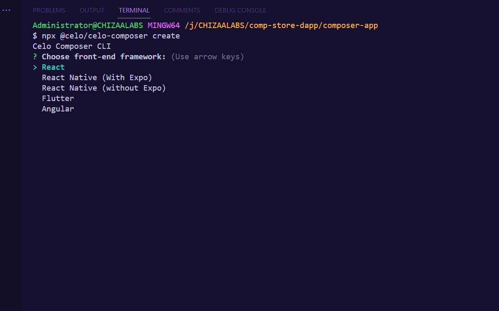
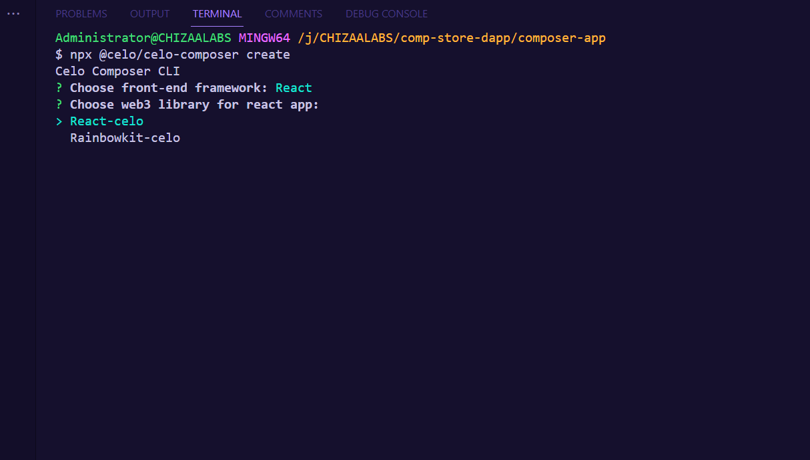
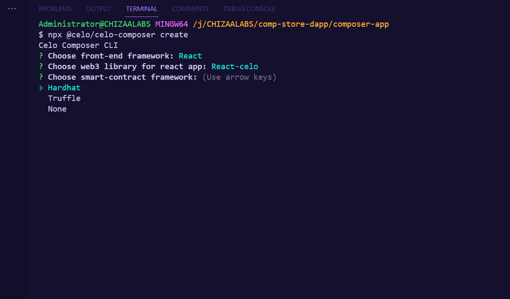
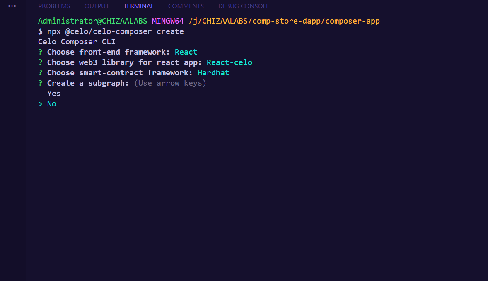
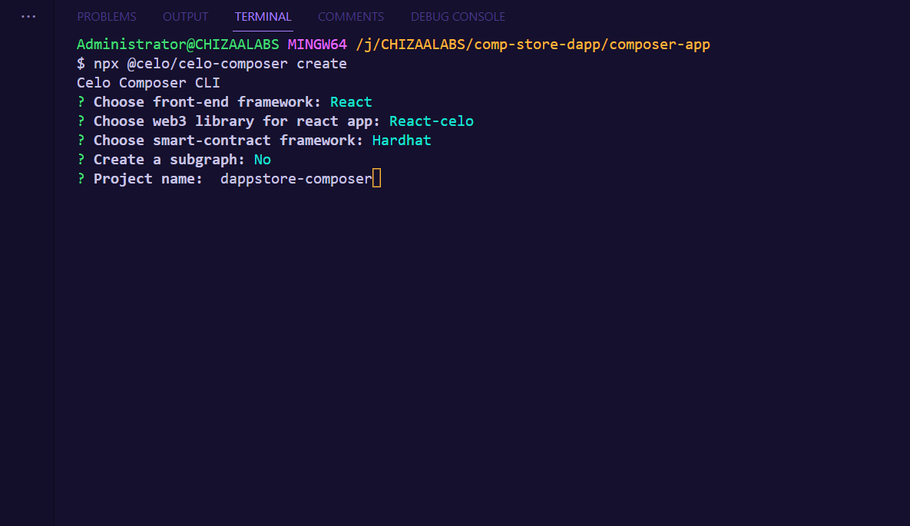

## Introduction

In this tutorial, you will learn how to how to build a computer retail store using celo composer.

## Prerequisites​

To start building, you’ll need a basic understanding of web development, Node (v16), yarn, and Git.

- [Node (v16)](https://nodejs.org/en/), [NVM](https://github.com/nvm-sh/nvm)
- [Yarn](https://classic.yarnpkg.com/en/)
- [Git](https://git-scm.com/)

## Celo Composer

The easiest way to get started with Celo Composer is using `@celo/celo-composer`
. This CLI tool enables you to quickly start building dApps on Celo for multiple frameworks including React, React Native (w/o Expo), Flutter, and Angular. You can create the dApp using the default Composer templates provided by Celo. In our case, we will work with react, specifically NextJS. The stack included in celo composer:

- [NextJS](https://nextjs.org/) - React framework
- [Typescript](https://www.typescriptlang.org/)
- [React Celo](https://github.com/celo-org/react-celo)
- [TailwindCSS](https://tailwindcss.com/) for styling
- [Hardhat](https://hardhat.org/) Smart contract development environment


## Getting Started

1. Bootstrap the application using this Celo Composer command.

```bash
npx @celo/celo-composer create
```

2. Select **React** framework(NextJS)



3. Select **react-celo** as the web3 library



4. Select **hardhat** for the smart contract framework.



5. Select **No** for subgraph



6. Give a name to your project and you are done.




cd into your app then install the dependencies required in the project. In the root directory, run

```bash
yarn

//or

npm install
```

---
