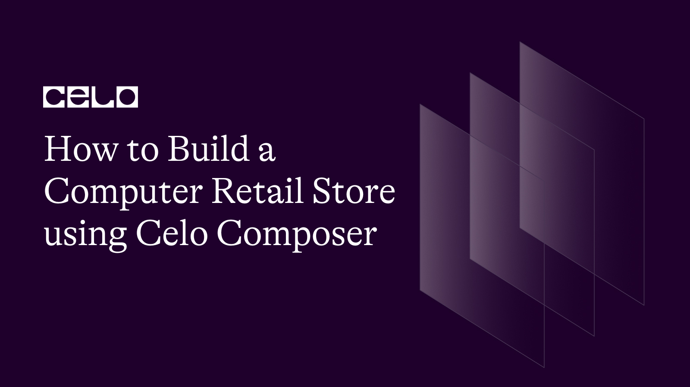

## Introduction

In this tutorial, you will learn how to how to build a computer retail store using celo composer.

## Prerequisites​

To start building, you’ll need a basic understanding of web development, Node (v16), yarn, and Git.

- [Node (v16)](https://nodejs.org/en/), [NVM](https://github.com/nvm-sh/nvm)
- [Yarn](https://classic.yarnpkg.com/en/)
- [Git](https://git-scm.com/)

## Celo Composer

The easiest way to get started with Celo Composer is using `@celo/celo-composer`
. This CLI tool enables you to quickly start building dApps on Celo for multiple frameworks including React, React Native (w/o Expo), Flutter, and Angular. You can create the dApp using the default Composer templates provided by Celo. In our case, we will work with react, specifically NextJS. The stack included in celo composer:

- [NextJS](https://nextjs.org/) - React framework
- [Typescript](https://www.typescriptlang.org/)
- [React Celo](https://github.com/celo-org/react-celo)
- [TailwindCSS](https://tailwindcss.com/) for styling
- [Hardhat](https://hardhat.org/) Smart contract development environment
- [Solidity](https://docs.soliditylang.org/en/v0.8.17/structure-of-a-contract.html#enum-types) Smart Contract Language


## Getting Started

1. Bootstrap the application using this Celo Composer command.

```bash
npx @celo/celo-composer create
```

2. Select **React** framework(NextJS)


3. Select **react-celo** as the web3 library


4. Select **hardhat** for the smart contract framework.


5. Select **No** for subgraph


6. Give a name to your project and you are done.


cd into your app then install the dependencies required in the project. In the root directory, run

```bash
yarn

//or

npm install
```

---


## Creating our Smart Contract

First, we are going to build our smart contract and with this, you will be required to have a bit of knowledge of Solidity. To learn more about solidity contracts and the structures of a contract you can check out [this link](https://docs.soliditylang.org/en/v0.8.17/structure-of-a-contract.html).


In the hardhat directory, navigate to contracts and create a new file then name it `computerMarketplace.sol`. Delete the other boilerplate files.

The completed code Should look like this.

```solidity

// SPDX-License-Identifier: MIT

pragma solidity >=0.7.0 <0.9.0;

interface IERC20Token {
    function transfer(address, uint256) external returns (bool);

    function approve(address, uint256) external returns (bool);

    function transferFrom(address, address, uint256) external returns (bool);

    function totalSupply() external view returns (uint256);

    function balanceOf(address) external view returns (uint256);

    function allowance(address, address) external view returns (uint256);

    event Transfer(address indexed from, address indexed to, uint256 value);
    event Approval(
        address indexed owner,
        address indexed spender,
        uint256 value
    );
}

contract ComputerMarketplace {
    uint internal productsLength = 0;
   
    address internal celoTokenAddress =
        0xF194afDf50B03e69Bd7D057c1Aa9e10c9954E4C9;

    struct Product {
        address payable owner;
        string computer_title;
        string image_url;
        string computer_specs;
        string store_location;
        uint price;
        uint sold;
    }

    mapping(uint => Product) internal products;

    mapping(address => uint) internal productsByUser;

    uint internal maxProductsPerUser = 10;

    function setMaxProductsPerUser(uint _maxProductsPerUser) public {
        require(
            _maxProductsPerUser > 0,
            "Maximum products per user must be greater than 0"
        );
        maxProductsPerUser = _maxProductsPerUser;
    }

    function writeProduct(
        string memory _computer_title,
        string memory _image_url,
        string memory _computer_specs,
        string memory _store_location,
        uint _price
    ) public {
        require(
            productsByUser[msg.sender] < maxProductsPerUser,
            "Maximum products per user reached"
        );

        uint _sold = 0;
        products[productsLength] = Product(
            payable(msg.sender),
            _computer_title,
            _image_url,
            _computer_specs,
            _store_location,
            _price,
            _sold
        );

        productsLength++;
        productsByUser[msg.sender]++;
    }

    function readProduct(
        uint _index
    )
        public
        view
        returns (
            address payable,
            string memory,
            string memory,
            string memory,
            string memory,
            uint,
            uint
        )
    {
        return (
            products[_index].owner,
            products[_index].computer_title,
            products[_index].image_url,
            products[_index].computer_specs,
            products[_index].store_location,
            products[_index].price,
            products[_index].sold
        );
    }

    function buyProduct(uint _index) public payable {
        require(
            IERC20Token(celoTokenAddress).transferFrom(
                msg.sender,
                products[_index].owner,
                products[_index].price
            ),
            "Transfer failed."
        );
        products[_index].sold++;
    }

    function deleteProduct(uint _index) public {
        require(_index < productsLength, "Product index out of range");

        // Make sure that the caller is the owner of the product
        require(
            products[_index].owner == msg.sender,
            "Only the owner can delete their products"
        );

        // Delete the product at the specified index
        for (uint i = _index; i < productsLength - 1; i++) {
            products[i] = products[i + 1];
        }
        delete products[productsLength - 1];
        productsLength--;

        // Update the product count for the owner
        productsByUser[msg.sender]--;
    }

    function getProductsByUser(
        address _user
    ) public view returns (Product[] memory) {
        uint count = 0;
        for (uint i = 0; i < productsLength; i++) {
            if (products[i].owner == _user) {
                count++;
            }
        }

        Product[] memory ownedProducts = new Product[](count);
        uint j = 0;
        for (uint i = 0; i < productsLength; i++) {
            if (products[i].owner == _user) {
                ownedProducts[j] = products[i];
                j++;
            }
        }

        return ownedProducts;
    }

    function getProductsLength() public view returns (uint) {
        return (productsLength);
    }
}
```

---

## Smart Contract breakdown

First, we declared our license and the solidity version.

```solidity
// SPDX-License-Identifier: MIT
pragma solidity ^0.8.0;
```

## Define an ERC20 Token Contract

The ERC-20 introduces a standard for Fungible Tokens, in other words, they have a property that makes each Token be exactly the same (in type and value) as another Token. For example, an ERC-20 Token acts just like the ETH, meaning that 1 Token is and will always be equal to all the other Tokens.

```solidity
interface IERC20Token {
    function transfer(address, uint256) external returns (bool);

    function approve(address, uint256) external returns (bool);

    function transferFrom(address, address, uint256) external returns (bool);

    function totalSupply() external view returns (uint256);

    function balanceOf(address) external view returns (uint256);

    function allowance(address, address) external view returns (uint256);

    event Transfer(address indexed from, address indexed to, uint256 value);
    event Approval(
        address indexed owner,
        address indexed spender,
        uint256 value
    );
}
```

The code represents an [interface](https://www.alchemy.com/overviews/solidity-interface) which is used to interact with other contracts. They define a set of functions and events that a contract must implement to be considered compatible with other contracts that use the interface.

The interface defines six functions that ERC-20 tokens must have:

- **transfer:** allows the owner of the token to send a specified amount of tokens to another address.

- **approve:** allows the owner of the token to give permission to another address to transfer a specified amount of tokens on their behalf.

- **transferFrom:** allows an address that has been approved to transfer a specified amount of tokens on behalf of the owner of the token.

- **totalSupply:** returns the total number of tokens in circulation.

- **balanceOf:** returns the balance of tokens owned by a specific address.

- **allowance:** returns the amount of tokens that an address has been approved to spend on behalf of another address.

The interface also defines two events:

- **Transfer:** emitted when tokens are transferred from one address to another.

- **Approval:** emitted when an address is approved to spend a certain amount of tokens on behalf of another address.


And then we define our smart contract `ComputerMarketplace`.

```solidity
contract ComputerMarketplace {
    // Contract code goes here
}
```

Contracts in Solidity are similar to classes in object-oriented languages. 

## Variables, structs and Mappings
We will now define some variables, structs and mappings that will be used by our contract.

```solidity
    uint internal productsLength = 0;
   
    address internal celoTokenAddress =
        0xF194afDf50B03e69Bd7D057c1Aa9e10c9954E4C9;

    struct Product {
        address payable owner;
        string computer_title;
        string image_url;
        string computer_specs;
        string store_location;
        uint price;
        uint sold;
    }

    mapping(uint => Product) internal products;

    mapping(address => uint) internal productsByUser;


```

- **uint internal productsLength**: declares a variable productsLength with an initial value of 0. It is marked as internal, which means that it can only be accessed from within the contract or contracts that inherit from it.

- **address internal celoTokenAddress**: declares a variable for the celo network native currency which is used to pay for products in our marketplace.

- **Product**: a struct that defines properties of the marketplace. The fields are: 
 - `owner`:  address of the user who owns the product. It is declared as address payable to allow it to receive payments from the buyer.
- `computer_title`: name of the product.
- `image_url`: URL of the product's image.
- `computer_specs`: specifications of the product.
- `store_location`: physical location of the store selling the product.
- `price`: price of the product in CELO tokens.
- `sold`: number of units of the product that have been sold so far.


- **products**: mapping that stores each product by its index
- **productsByUser**: mapping that keeps track of how many products each user has added.
- **maxProductsPerUser:** determines the maximum number of products that a user can write in the ComputerMarketplace contract. By default, it is set to 10 to prevents a user from spamming the platform.


## Functions

```solidity

   function setMaxProductsPerUser(uint _maxProductsPerUser) public {
        require(
            _maxProductsPerUser > 0,
            "Maximum products per user must be greater than 0"
        );
        maxProductsPerUser = _maxProductsPerUser;
    }

```

`setMaxProductsPerUser` function allows the contract owner to change the maximum number of products a user can create. It takes an unsigned integer _maxProductsPerUser as an argument and sets the maxProductsPerUser variable to the value of the argument. However, the _maxProductsPerUser argument must be greater than 0, and if it is not, the function will fail and return an error message.

```solidity

 function writeProduct(
        string memory _computer_title,
        string memory _image_url,
        string memory _computer_specs,
        string memory _store_location,
        uint _price
    ) public {
        require(
            productsByUser[msg.sender] < maxProductsPerUser,
            "Maximum products per user reached"
        );

        uint _sold = 0;
        products[productsLength] = Product(
            payable(msg.sender),
            _computer_title,
            _image_url,
            _computer_specs,
            _store_location,
            _price,
            _sold
        );

        productsLength++;
        productsByUser[msg.sender]++;
    }
```

`writeProduct` function allows a user to add a new product to the marketplace. The function first checks whether the user has already added the maximum number of products allowed per user (which is set to 10 by default). If the user has not reached the maximum, a new Product struct is created with the provided parameters, and `_sold` is set to 0 since the product has not yet been sold.

The new product is then added to the products mapping at the `productsLength index`, where `productsLength` is the current number of products in the marketplace. The `owner` of the product is set to the address of the user who called the function, and `productsLength` is incremented. Finally, the `productsByUser` mapping for the user who called the function is incremented, to keep track of the number of products that user has added to the marketplace.

```solidity

 function readProduct(
        uint _index
    )
        public
        view
        returns (
            address payable,
            string memory,
            string memory,
            string memory,
            string memory,
            uint,
            uint
        )
    {
        return (
            products[_index].owner,
            products[_index].computer_title,
            products[_index].image_url,
            products[_index].computer_specs,
            products[_index].store_location,
            products[_index].price,
            products[_index].sold
        );
    }

```

`readProduct` function that takes an index as an argument and returns a tuple of data about the product at that index in the products array.

```solidity
  function buyProduct(uint _index) public payable {
        require(
            IERC20Token(celoTokenAddress).transferFrom(
                msg.sender,
                products[_index].owner,
                products[_index].price
            ),
            "Transfer failed."
        );
        products[_index].sold++;
    }


```
`buyProduct` function is used to buy a product from the marketplace. It takes an argument `_index` which is the `index` of the product in the products array that the buyer wants to purchase. The function requires that the buyer sends an amount of CELO tokens that is equal to the price of the product.

The function then uses the `transferFrom` function of the `IERC20Token` interface to transfer the specified amount of CELO tokens from the `buyer's address` to the `owner's address`. If the transfer is successful, the function updates the `sold` variable of the product by incrementing it by 1. 

```solidity

   function deleteProduct(uint _index) public {
        require(_index < productsLength, "Product index out of range");

        // Make sure that the caller is the owner of the product
        require(
            products[_index].owner == msg.sender,
            "Only the owner can delete their products"
        );

        // Delete the product at the specified index
        for (uint i = _index; i < productsLength - 1; i++) {
            products[i] = products[i + 1];
        }
        delete products[productsLength - 1];
        productsLength--;

        // Update the product count for the owner
        productsByUser[msg.sender]--;
    }
```

`deleteProduct` function allows a product owner to delete one of their products from the marketplace. The function takes an input parameter `_index` which represents the `index` of the product in the products array that the owner wants to delete.

The function first checks that the input `index` is within the range of valid indexes for the products array. It then checks that the caller of the function is the `owner` of the product they want to delete.

If both conditions are satisfied, the function proceeds to delete the product at the specified index. To do this, it shifts all products after the specified index one position to the left, effectively overwriting the product at the index being deleted. Finally, it deletes the last element of the array (which is now a duplicate of the product at the second-to-last index) and decrements the `productsLength` variable to reflect the new length of the products array.

The function also decrements the `productsByUser` mapping for the product `owner` to ensure that their product count is up to date.


```solidity
function getProductsByUser(
        address _user
    ) public view returns (Product[] memory) {
        uint count = 0;
        for (uint i = 0; i < productsLength; i++) {
            if (products[i].owner == _user) {
                count++;
            }
        }

        Product[] memory ownedProducts = new Product[](count);
        uint j = 0;
        for (uint i = 0; i < productsLength; i++) {
            if (products[i].owner == _user) {
                ownedProducts[j] = products[i];
                j++;
            }
        }

        return ownedProducts;
    }
```

`getProductsByUser` takes an address `_user` as input and returns an array of products that belong to the given user. It loops through all the products and counts the number of products owned by the user. Then it creates a new array `ownedProducts` with the same length as the number of products owned by the user. Finally, it loops through all the products again and adds each product owned by the user to the `ownedProducts` array. It then returns the `ownedProducts` array.

## Deploying the smart contract

We will be deploying our smart contract on alfajores testne.

Inside hardhat folder, create a .env file to store the required private keys from your wallet to deploy the contract.

```
MNEMONIC=""
PRIVATE_KEY=""


```

To deploy our smart contract successfully, navigate to the scripts directory, delete the boilerplate files and create a new file named deploy.js.

```javascript

const { ethers } = require("hardhat");

async function main() {
  // Load the marketplace contract artifacts
  const computerMarketplaceFactory = await ethers.getContractFactory(
    "ComputerMarketplace"
  );

  // Deploy the contract
  const computerMarketplaceContract = await computerMarketplaceFactory.deploy();

  // Wait for deployment to finish
  await computerMarketplaceContract.deployed();

  // Log the address of the new contract
  console.log("Computer Marketplace deployed to:", computerMarketplaceContract.address);
}

main()
  .then(() => process.exit(0))
  .catch((error) => {
    console.error(error);
    process.exit(1);
  });

```

The code deploys the smart contract called `ComputerMarketplace` using the Hardhat framework. 
First, import the ethers object from the Hardhat library. Define `main()` function that  loads the contract factory using the `getContractFactory()` method provided by the ethers object. 
After that, it deploys the contract using the `deploy()` method of the contract factory. It assigns the deployed contract instance to the `computerMarketplaceContract` constant.

Finally, the `main()` function is executed and if it runs successfully, the script exits with a code of 0. If an error is encountered, it logs the error to the console and exits with a code of 1

Open up your terminal. Ensure you are in the hardhat folder then run this script:

```
npx hardhat run scripts/deploy.js --network alfajores
```

Your solidity code will successfully be compiled and the contract address is generated after deployment. Save the address in a different file since we will be using the same address to interact with the contract in our frontend.

An artifacts folder is created which contains important files related to the contract, including the ABI files. ABI stands for Application Binary Interface, and it specifies the methods and properties that can be accessed externally by other contracts or applications. The ABI file is essentially a JSON representation of the contract's interface, including the function signatures and input/output parameters. Other applications or contracts can use the ABI file to interact with the deployed contract and execute its functions. Therefore, the ABI file serves as a crucial component in enabling interoperability between different smart contracts and decentralized applications with EVM compatible blockchains.


## Building the UI and React Logic


## Next Steps

I hope you learned a lot from this tutorial. Here are some relevant links that would aid your learning further.

- [Celo Docs](https://docs.celo.org/)
- [Solidity Docs](https://docs.soliditylang.org/en/v0.8.17/)
- [EthersJS](https://docs.ethers.org/v5/)
- [NextJS](https://nextjs.org/)
