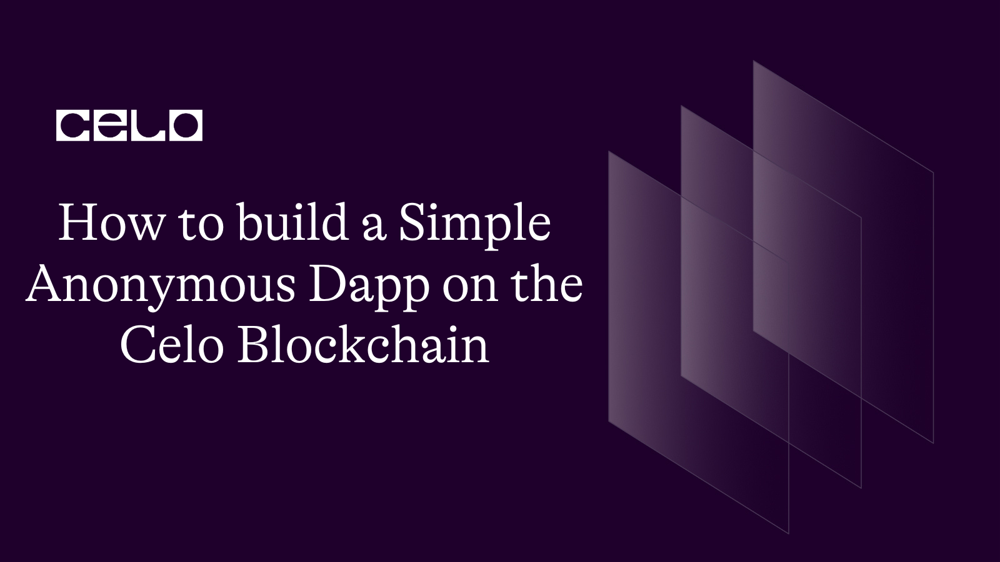

## Introduction

Celo is a blockchain platform that focuses on enabling financial access for everyone, regardless of their location or socio-economic background. Its technology is built with mobile-first in mind and provides a fast, secure, and low-cost blockchain infrastructure for developers to build their dApps.

This guide aims to make the process of building a dapp more accessible and less intimidating for those who are new to blockchain development or are looking to explore new technologies by providing developers with a clear and concise overview of the steps required to create an anonymous decentralized application (dapp) on the celo blockchain

## Prerequisites

Building this dapp, you would need:

- Solid understanding of Javascript
- Basic grasp of solidity

## Requirements

- VSCode or any other editor
- A terminal
- Remix
- React
- Celo Extension Wallet

## Getting Started 😉

Clone the github repository [here](https://github.com/dahnny/tell-secrets) to follow along.
This is the structure you should see in your code editor.

```bash
├── node_modules
├── public
├── src
│   ├── components
│   ├── contracts
│   │    ├── ierc.abi.json
│   │    ├── secrets.abi.json
│   │    ├── secrets.sol
├── App.css
├── App.js
├── App.test.js
├── index.css
├── index.js
├── logo.svg
├── reportWebVitals.js
├── setupTests.js
├── .env
├── .gitignore
├── package-lock.json
├── package.json
└── README.md
```

Run `npm install` in your terminal to install all dependencies needed to make the dapp work properly.

## Smart Contract Development

To start this segment, we will use Remix, a web-based Integrated Development Environment (IDE) that enables developers to write, test, and deploy smart contracts on the Celo blockchain.

The first step is to create a new workspace and then a new file, which we will name `secrets.sol`. As we begin coding the smart contract, we will include a statement on the first line that specifies the license under which the code is being released.

```solidity
// SPDX-License-Identifier: MIT

pragma solidity >=0.7.0 <0.9.0;
```

The comment specifies the license under which the code is being released. In this case, the license is the MIT License, which is a popular open-source license that allows anyone to use, copy, modify, merge, publish, distribute, sublicense, and/or sell the code with very few restrictions.

The second line is a "pragma" statement, which is an instruction to the Solidity compiler about how to handle the code. In this case, it tells the compiler to use a version of Solidity that is greater than or equal to 0.7.0, but less than 0.9.0. This ensures that the code will only compile with a compatible version of Solidity, which helps to prevent any potential compatibility issues.

Next up, provide an interface for a contract that conforms to the ERC20 token standard, which is a widely used standard for implementing tokens on the Ethereum blockchain.

```solidity
interface IERC20Token {
  function transfer(address, uint256) external returns (bool);
  function approve(address, uint256) external returns (bool);
  function transferFrom(address, address, uint256) external returns (bool);
  function totalSupply() external view returns (uint256);
  function balanceOf(address) external view returns (uint256);
  function allowance(address, address) external view returns (uint256);

  event Transfer(address indexed from, address indexed to, uint256 value);
  event Approval(address indexed owner, address indexed spender, uint256 value);
}
```

The interface includes six function declarations, which are used to interact with the token contract:

`transfer`: Sends tokens from the caller's address to the specified address.
`approve`: Allows the specified address to spend a certain amount of tokens from the caller's address.
`transferFrom`: Transfers tokens from one address to another, as allowed by an approved spender.
`totalSupply`: Returns the total number of tokens in circulation.
`balanceOf`: Returns the token balance of a specified address.
`allowance`: Returns the amount of tokens that an owner has allowed a spender to transfer.
The interface also includes two events, `Transfer` and `Approval`, which are emitted when a transfer or an approval occurs, respectively. These events can be used by external applications to track the movement of tokens within the token contract.

Next, we create a contract named `Secrets` that includes a struct named `Secret`.

```solidity
contract Secrets{
    address internal cUsdTokenAddress = 0x874069Fa1Eb16D44d622F2e0Ca25eeA172369bC1;

    struct Secret{
        address payable owner;
        string secretText;
        uint likes;
        uint dislikes;
    }
```

The `Secret` struct has four fields:

`owner` - an address type variable that is marked as `payable`. This suggests that it is intended to hold an Ethereum address that is capable of receiving Ether payments.

`secretText` - a string variable that will hold the text of the secret.

`likes` - an unsigned integer variable that will store the number of likes received by the secret.

`dislikes` - an unsigned integer variable that will store the number of dislikes received by the secret.

In addition, the contract includes a variable named `cUsdTokenAddress` that is marked as `internal`. This suggests that it is intended to be used within the contract but not outside of it. The variable is assigned a specific Ethereum address, which is likely the address of a specific smart contract that the Secrets contract will interact with.

It is worth noting that this code snippet only defines the structure of the Secrets contract, and does not include any functions or methods for interacting with it.

Next up, we declare two variables, `secrets` and `secretLength`, and defines the former as an internal mapping from unsigned integers to a custom data type called `Secret`.

```solidity
mapping(uint => Secret) internal secrets;
uint secretLength = 0;
```

A mapping is a key-value data structure, similar to a dictionary or a hash table, where each key is unique and associated with a value. In this case, the keys are unsigned integers, and the values are of type `Secret`.

The second line initializes the `secretLength` variable to zero. This variable can be used to keep track of the number of items in the `secrets` mapping.

Next, you create a function to add your secrets.

```solidity
    function addSecret(
        string memory _text
    )public{
        Secret storage secret = secrets[secretLength];
        secret.owner = payable(msg.sender);
        secret.secretText = _text;
        secret.likes = 0;
        secret.dislikes = 0;
        secretLength++;
    }
```

Inside the function, the first line creates a storage reference to the `Secret` struct associated with the current `secretLength` index in the `secrets` mapping. The `storage` keyword means that the reference points to a location in storage rather than memory.

The next four lines set the fields of the `secret` struct. `secret.owner` is set to the address of the person who called the function (`msg.sender`), which is converted to a `payable` address in order to receive payments. `secret.secretText` is set to the `_text` argument passed to the function. `secret.likes` and `secret.dislikes` are both set to zero.

The secretLength variable is then incremented, which means the next call to addSecret will create a new Secret struct at the next index in the secrets mapping.

Up next, you would create a function that would gift that secret to another address. Which basically means it would transfer the ownership of that secret to another address.

```solidity
   function giftOwner(
        uint amount,
        uint _index
    )public{
    require(
        IERC20Token(cUsdTokenAddress).transferFrom(
                msg.sender,
                secrets[_index].owner,
                amount
            ),
            "Transaction could not be performed"
        );
    }
```

The function takes two input parameters: `amount` and `_index`, both of which are uint (unsigned integer) data types.

The purpose of the function is to transfer a specified amount of cUSD from the person who called the function (represented by `msg.sender`) to the owner of a secret stored in the `secrets` array at the specified index (represented by `secrets[_index].owner`).

Following this, you would then create the like and dislike function. This would allow people to express their approval or disapproval of secrets by sending a small amount of cUSD to the owner of the secret.

```solidity
 function likeSecret(uint _index) public {
        require(
        IERC20Token(cUsdTokenAddress).transferFrom(
                msg.sender,
                secrets[_index].owner,
                100000000000000000
            ),
            "Transaction could not be performed"
        );
        secrets[_index].likes++;
    }
    function dislikeSecret(uint _index) public {
        require(
        IERC20Token(cUsdTokenAddress).transferFrom(
                msg.sender,
                secrets[_index].owner,
                100000000000000000
            ),
            "Transaction could not be performed"
        );
        secrets[_index].dislikes++;
    }
```

The `likeSecret` function takes an input parameter called `_index`, which is used to identify a secret stored in an array called secrets. The function first checks that the person calling the function has approved the transfer of a certain amount of 1cUSD to be sent from their wallet to the owner of the secret. If the transfer is approved, the function will increase the number of likes associated with the secret.

The `dislikeSecret` function is similar to `likeSecret`, but instead of increasing the number of likes, it increases the number of dislikes for a particular secret. It also checks that the person calling the function has approved the transfer of the same amount of cUSD to the owner of the secret.

Finally, you would create the `getSecrets` function and the `getSecretsLength` to view the details of a specific secret stored and also get the total number of secrets currently stored in the contract.

```solidity
    function getSecret(uint _index) public view returns(
        address payable,
        string memory,
        uint,
        uint256
    ){
        Secret storage secret  = secrets[_index];
        return (
            secret.owner,
            secret.secretText,
            secret.likes,
            secret.dislikes
        );
    }

function getSecretLength() public view returns (uint) {
        return (secretLength);
    }
```

The `getSecret` function takes an input parameter called `_index` which is an integer value. It returns four values as output - an address, a string, and two integers.

The function finds the secret stored in the `secrets` variable at the index specified by the `_index` parameter. It then returns the values of four properties of the secret, which are the owner's address, the text of the secret, and the number of likes and dislikes the secret has received.

The second function is called `getSecretLength` and it takes no input parameters. It returns a single integer value which is the length of the `secrets` state variable, indicating how many secrets are currently stored in the contract.

- **Here is How Complete `secrets.sol` Looks like:-**

```solidity
// SPDX-License-Identifier: MIT

pragma solidity >=0.7.0 <0.9.0;

interface IERC20Token {
  function transfer(address, uint256) external returns (bool);
  function approve(address, uint256) external returns (bool);
  function transferFrom(address, address, uint256) external returns (bool);
  function totalSupply() external view returns (uint256);
  function balanceOf(address) external view returns (uint256);
  function allowance(address, address) external view returns (uint256);

  event Transfer(address indexed from, address indexed to, uint256 value);
  event Approval(address indexed owner, address indexed spender, uint256 value);
}

contract Secrets{
    address internal cUsdTokenAddress = 0x874069Fa1Eb16D44d622F2e0Ca25eeA172369bC1;

    struct Secret{
        address payable owner;
        string secretText;
        uint likes;
        uint dislikes;
    }

    mapping(uint => Secret) internal secrets;
    uint secretLength = 0;

    function addSecret(
        string memory _text
    )public{
        Secret storage secret = secrets[secretLength];
        secret.owner = payable(msg.sender);
        secret.secretText = _text;
        secret.likes = 0;
        secret.dislikes = 0;
        secretLength++;
    }

    function giftOwner(
        uint amount,
        uint _index
    )public{
        require(
          IERC20Token(cUsdTokenAddress).transferFrom(
                msg.sender,
                secrets[_index].owner,
                amount
            ),
            "Transaction could not be performed"
        );
    }

    function getSecret(uint _index) public view returns(
        address payable,
        string memory,
        uint,
        uint256
    ){
        Secret storage secret  = secrets[_index];
        return (
            secret.owner,
            secret.secretText,
            secret.likes,
            secret.dislikes
        );
    }

    function likeSecret(uint _index) public {
        require(
          IERC20Token(cUsdTokenAddress).transferFrom(
                msg.sender,
                secrets[_index].owner,
                100000000000000000
            ),
            "Transaction could not be performed"
        );
        secrets[_index].likes++;
    }
    function dislikeSecret(uint _index) public {
        require(
          IERC20Token(cUsdTokenAddress).transferFrom(
                msg.sender,
                secrets[_index].owner,
                100000000000000000
            ),
            "Transaction could not be performed"
        );
        secrets[_index].dislikes++;
    }

    function getSecretLength() public view returns (uint) {
        return (secretLength);
    }

}
```

## Deploying your smart contract

Firstly, you need to obtain the [CeloExtensionWallet](<(https://chrome.google.com/webstore/detail/celoextensionwallet/kkilomkmpmkbdnfelcpgckmpcaemjcdh?hl=en)>). Once you have installed it, you must create a new wallet and be sure to securely store the corresponding key phrase to avoid any irretrievable loss of your assets.

After installing and configuring your wallet, you must proceed to fund it using the [ Celo Faucet](https://celo.org/developers/faucet). This requires copying the address of your wallet, following the link to the Celo Faucet, pasting the copied address into the appropriate text field, and then confirming the transaction.

Next, you will need to access Remix, a smart contract development environment, and download and activate the Celo plugin from the plugin manager. Once activated, you must connect your Celo wallet to Remix and deploy your contract to the Celo blockchain.

## Developing the Frontend

Well done so far. For the final section, we would be integrating our contract into a full stack dapp using react.

From the cloned repository, download all necessary files and folders from the public folder

### App.js

For this project, you would write all react code in one file, the App.js file to avoid complexity and to keep things simple.

For the first section, you would need to import some important files to enable adequate functionality.

```js
import "./App.css";
import { useState, useCallback, useEffect } from "react";

import secret from "./contracts/secrets.abi.json";
import ierc from "./contracts/ierc.abi.json";
import Web3 from "web3";
import { newKitFromWeb3 } from "@celo/contractkit";
import BigNumber from "bignumber.js";

const ERC20_DECIMALS = 18;

const contractAddress = "0xC92Fe8ED9eE9e9f2b789911428fe0B088602b165";
const cUSDContractAddress = "0x874069Fa1Eb16D44d622F2e0Ca25eeA172369bC1";
```

The first line imports the CSS styles from a file named `App.css`. This file contains custom styles for the application.
Next, you would import `useState`, `useEffect` and `useCallback` functions from the react library.
We would then import `web3` a JavaScript library that provides a way to interact with Ethereum and Celo blockchains.
Next up on our import list is `newKitFromWeb3` a function from the `@celo/contractkit` library that creates a ContractKit instance used to interact with smart contracts on the Celo blockchain.
The following line sets a constant `ERC20_DECIMALS` to a value of 18. This value represents the number of decimal places used by most ERC20 tokens, which is the standard for tokens on Ethereum and Celo blockchains.

Moving forward, you would define the `App` component. It defines several state variables using the `useState` hook, including `contract`, `address`, `kit`, `cUSDBalance`, `secrets`, `text`, and `amount`.

```js
function App() {
  const [contract, setcontract] = useState(null);
  const [address, setAddress] = useState(null);
  const [kit, setKit] = useState(null);
  const [cUSDBalance, setcUSDBalance] = useState(0);
  const [secrets, setSecrets] = useState([]);
  const [text, setText] = useState("");
  const [amount, setAmount] = useState("")

  const connectToWallet = async () => {
    if (window.celo) {
      try {
        await window.celo.enable();
        const web3 = new Web3(window.celo);
        let kit = newKitFromWeb3(web3);

        const accounts = await kit.web3.eth.getAccounts();
        const user_address = accounts[0];

        kit.defaultAccount = user_address;

        await setAddress(user_address);
        await setKit(kit);
      } catch (error) {
        console.log(error);
      }
    } else {
      console.log("Error Occurred");
    }
  };

  const getBalance = useCallback(async () => {
    try {
      const balance = await kit.getTotalBalance(address);
      const USDBalance = balance.cUSD.shiftedBy(-ERC20_DECIMALS).toFixed(2);

      const contract = new kit.web3.eth.Contract(secret, contractAddress);
      setcontract(contract);
      setcUSDBalance(USDBalance);
    } catch (error) {
      console.log(error);
    }
  }, [address, kit]);

  const getSecrets = useCallback(async () => {
    const secretLength = await contract.methods
      .getSecretLength()
      .call();
    const secrets = [];

    for (let index = 0; index < secretLength; index++) {
      let _secret = new Promise(async (resolve, reject) => {
        let secret = await contract.methods
          .getSecret(index)
          .call();

        resolve({
          index: index,
          owner: secret[0],
          secretText: secret[1],
          likes: secret[2],
          dislikes: secret[3],
        });
      });
      secrets.push(_secret);
    }

    const _secrets = await Promise.all(secrets);
    setSecrets(_secrets);
  }, [contract]);
```

You would also create a function called `connectToWallet` that uses the Celo wallet to connect to the user's account and sets the `address` and `kit` state variables.

The `getBalance` function uses the `kit` and `address` variables to retrieve the user's balance in cUSD (Celo's stablecoin) and sets the "contract" and `cUSDBalance` state variables.

The `getSecrets` function uses the `contract` variable to retrieve a list of secrets and their associated metadata from the smart contract, and sets the "secrets" state variable.

The `useCallback` hook is used to memorize these functions so that they don't get recreated on every render, improving performance.

Up next, you would create functions for adding, gifting, liking and disliking a secret.

```js
const submitForm = async (e) => {
  e.preventDefault();
  if (!text) return;
  try {
    await contract.methods.addSecret(text).send({ from: address });
    getSecrets();
  } catch (error) {
    console.log(error);
  }
};

const giftAmount = async (index, _amount) => {
  if (!_amount) return;
  try {
    const cUSDContract = new kit.web3.eth.Contract(ierc, cUSDContractAddress);
    const amount = new BigNumber(_amount).shiftedBy(ERC20_DECIMALS).toString();
    await cUSDContract.methods
      .approve(contractAddress, amount)
      .send({ from: address });
    await contract.methods.giftOwner(amount, index).send({ from: address });
    getSecrets();
    getBalance();
  } catch (error) {
    console.log(error);
  }
};

const likeSecret = async (index) => {
  try {
    const cUSDContract = new kit.web3.eth.Contract(ierc, cUSDContractAddress);
    const amount = new BigNumber(1).shiftedBy(ERC20_DECIMALS).toString();
    await cUSDContract.methods
      .approve(contractAddress, amount)
      .send({ from: address });
    await contract.methods.likeSecret(index).send({ from: address });
    getSecrets();
    getBalance();
  } catch (error) {
    console.log(error);
  }
};

const dislikeSecret = async (index) => {
  try {
    const cUSDContract = new kit.web3.eth.Contract(ierc, cUSDContractAddress);
    const amount = new BigNumber(1).shiftedBy(ERC20_DECIMALS).toString();
    await cUSDContract.methods
      .approve(contractAddress, amount)
      .send({ from: address });
    await contract.methods.dislikeSecret(index).send({ from: address });
    getSecrets();
    getBalance();
  } catch (error) {
    console.log(error);
  }
};
```

The first function, `submitForm`, is triggered when a form is submitted. It adds a new secret to the smart contract using the `text` state variable and updates the list of secrets by calling the `getSecrets` function.

The second function, `giftAmount`, is triggered when a user gifts cUSD to a secret owner. It approves the smart contract to spend the specified amount of cUSD on the user's behalf, and then calls the `giftOwner` function on the smart contract, passing in the amount of cUSD and the index of the secret owner. It updates the list of secrets and the user's cUSD balance by calling the "getSecrets" and `getBalance` functions.

The third function, `likeSecret`, is triggered when a user likes a secret. It approves the smart contract to spend 1 cUSD on the user's behalf, and then calls the `likeSecret` function on the smart contract, passing in the index of the secret. It updates the list of secrets and the user's cUSD balance by calling the `getSecrets` and `getBalance` functions.

The fourth function, `dislikeSecret`, is triggered when a user dislikes a secret. It works similarly to the `likeSecret` function, but instead calls the `dislikeSecret` function on the smart contract.

After this, you would use the `useEffect` hook to some specific functions as the application starts.

```js
useEffect(() => {
  connectToWallet();
}, []);

useEffect(() => {
  if (kit && address) {
    getBalance();
  }
}, [kit, address, getBalance]);

useEffect(() => {
  if (contract) {
    getSecrets();
  }
}, [contract, getSecrets]);
```

The first `useEffect` hook is used to connect to the wallet.
The second `useEffect` hook is used to get the account balance if the wallet is connected and the user's address is available.
The third `useEffect` hook is used to get some secrets from a contract if the contract is available.

The next phase of the code is basically the html section and is fairly understandable. So just copy the code as is.

```js
 return (
    <div>
      {/* ======= Header ======= */}
      <header id="header" className="fixed-top d-flex align-items-center">
        <div className="container d-flex justify-content-between">
          <div className="logo">
            <h1><a href="/">Secrets</a></h1>
            {/* Uncomment below if you prefer to use an image logo */}
            {/* <a href="index.html"></a>*/}
          </div>
          <nav id="navbar" className="navbar">
            <ul>
              <li><a className="nav-link scrollto active" href="#hero">Home</a></li>
              <li><a className="nav-link scrollto" href="#contact">Balance: {cUSDBalance} cUSD</a></li>
            </ul>
            <i className="bi bi-list mobile-nav-toggle" />
          </nav>{/* .navbar */}
        </div>
      </header>{/* End Header */}
      {/* ======= Hero Section ======= */}
      <section id="hero" className="d-flex flex-column justify-content-center align-items-center">
        <div className="container text-center text-md-left" data-aos="fade-up">
          <h1>Welcome to Secrets</h1>
          <h2>Tell your story and earn from it</h2>
          <a href="#contact " className="btn-get-started scrollto">Get Started</a>
        </div>
      </section>{/* End Hero */}
      <main id="main">
        {/* ======= Steps Section ======= */}
        <section id="steps" className="steps section-bg">
          <div className="container">
            <div className="row no-gutters">
              {secrets.map(secret => <div className="col-lg-4 col-md-6 content-item" data-aos="fade-in">
                <span>{secret.index}</span>
                <p>{secret.secretText}</p>
                <br />
                <div className='d-flex justify-content-between'>
                <div>
                <i onClick={()=>likeSecret(secret.index)} class="bi bi-hand-thumbs-up"></i>{secret.likes}
                </div>
                  <div><i onClick={()=>dislikeSecret(secret.index)} class="bi bi-hand-thumbs-down"></i>{secret.dislikes}</div>

                </div>
                <div className="form-group mt-3">
                  <input type="text" className="form-control" name="amount" id="amount" placeholder="Amount" onChange={(e) => setAmount(e.target.value)} required />
                </div>
                <button className='btn btn-success' onClick={() => giftAmount(secret.index, amount)}>Gift</button>

              </div>)}
            </div>
          </div>
        </section>{/* End Steps Section */}

        {/* ======= Contact Section ======= */}
        <section id="contact" className="contact">
          <div className="container">
            <div className="section-title" data-aos="fade-up">
              <h2>Add Your Secret </h2>
              <p>Add your secret to the pool</p>
            </div>
            <div className="row mt-5 justify-content-center" data-aos="fade-up">
              <div className="col-lg-10">
                <form onSubmit={submitForm} role="form" className="php-email-form">
                  <div className="form-group mt-3">
                    <textarea className="form-control" onChange={(e) => setText(e.target.value)} name="message" rows={5} placeholder="Secrets..." required defaultValue={""} />
                  </div>
                  <div className="text-center"><button type="submit">Start Here</button></div>
                </form>
              </div>
            </div>
          </div>
        </section>{/* End Contact Section */}
      </main>{/* End #main */}
    </div>

  );
}

export default App;
```

## Conclusion

Well done on successfully creating a full-stack dapp using Solidity and React on the Celo smart contract! Congratulations on your achievement! 🎉

## Next steps

You could take it a step further and follow my published tutorials on more intermediate topics. You could also add more functions to your smart contract and implement them in the frontend

## About the Author

Daniel Ogbuti is a web3 developer with a passion for teaching as well as learning. I would love to connect on Twitter @daniel_ogbuti and linkedin @ Daniel Ogbuti

See you soon!
