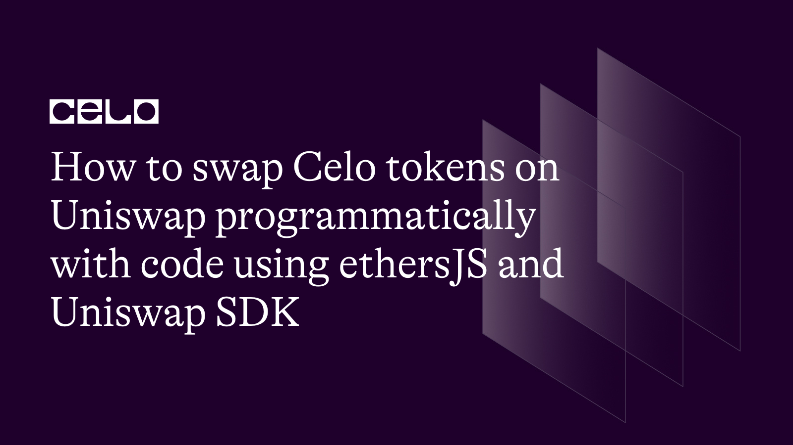

## Introduction

In this tutorial, we'll show you how to build an automated token swapper using ethersJS and the Uniswap V3, which enables us to execute trades programmatically with JavaScript. By following our step-by-step guide, you'll be able to create a seamless and secure user experience that leverages the power of the Celo network and Uniswap. Let's get started!

## Prerequisites

Before diving into this tutorial, it is recommended that you have the following:

1. Basic knowledge of blockchain technology and decentralized finance (DeFi) concepts and how Uniswap works.
2. Familiarity with JavaScript and Node.js
3. A basic understanding of web3 libraries and the Ethereum network
4. Experience with Git and the command line interface (CLI)

## Requirements

To follow along with this tutorial, you will need:

1. A code editor, such as Visual Studio Code, Atom, or Sublime Text
2. Node.js (version 14 or later) and npm (Node Package Manager) installed on your machine
3. Access to a Celo wallet and some testnet CELO tokens for testing purposes. You can create a Celo wallet on the Alfajores testnet using Celo Wallet or MetaMask.
4. Basic knowledge of the Celo blockchain network and the Uniswap exchange
   Familiarity with JavaScript and Node.js
5. A basic understanding of ethers JS
6. It is important to ensure that your environment meets these requirements before starting the tutorial to ensure a smooth and hassle-free experience.
7. RPC node provider to connect to Celo network. You can use [Infura](https://app.infura.io/)

## Setting up the tutorial

Before we start the tutorial, we need to set up our development environment and connect to the Celo network. Follow the steps below to get started:

You can clone the starter code for this tutorial from GitHub into a local directory on your machine.

In your terminal:

```bash
git clone https://github.com/JovanMwesigwa/uniswap-tokens-programmatically
```

In your terminal install all the necessary project dependencies using

```bash
yarn
```

Or

```bash
npm install
```

You'll need to set up all Celo wallet accounts if you haven't already, create a Celo wallet on the Alfajores testnet using Celo Wallet or MetaMask. Once you have created your wallet, you can request testnet CELO and cUSD tokens from the Celo faucet here

Create a new file in the root path of the project and name it `.env`. This will contain all the necessary sensitive project variables.

To get a Celo Alfajores URL endpoint, you need to sign up for an account with Infura here and create new API keys.

Once you’ve created new API keys for the app, Infura will provide you with links to the Celo mainnet and Alfajores testnet for your app which look like this `https://ropsten.infura.io/v3/your_project_id`

Replace `your_project_id` with the one Infura gives you.

Get the `WALLET_ADDRESS` and `WALLET_SECRET` from your Meta Mask wallet or Celo Wallet.

```env
INFURA_URL_TESTNET=https://celo-alfajores.infura.io/v3/your_project_id
WALLET_ADDRESS=ADD_YOUR_WALLET_ADDRESS
WALLET_SECRET=ADD_YOUR_PRIVATE_KEY_HERE

```

Replace your `project_id` with the ID from the one Infura gave you.

Once you have completed these steps, you should be ready to start building the project.

### Exploring the structure

Once the installation is done, you should have a project scaffold that looks similar to the one below.


Inside the `/lib` folder, we have a file named `constants.js`.

The `constants.js` contains constant values that we will use throughout the application.

At the top, `Token` and `SupportedChainId` are imported from the `@uniswap/sdk-core package`, which we installed in the previous section. These are used to create instances of the Token class, which represents ERC20 tokens, and specify the Celo network we will be using.

```bash
const { Token, SupportedChainId } = require('@uniswap/sdk-core')
```

The `swapRouterAddress` which is the address of the Uniswap V3 router contract on the Celo network will also be used to implement the token swaps. This contract is responsible for executing trades between ERC20 tokens.

`uniswapV3FactoryAddress` is the address of the Uniswap V3 factory contract on the Celo network. This contract is responsible for creating new instances of the Uniswap V3 pool contract. These are imported into the file too.

```bash
const swapRouterAddress = '0x5615CDAb10dc425a742d643d949a7F474C01abc4'
const uniswapV3FactoryAddress = '0xAfE208a311B21f13EF87E33A90049fC17A7acDEc'
```

`TokenFrom` and `TokenTo` are objects that represent the tokens we will be swapping. Each object contains the token name, symbol, decimals, and address on the Celo network. As shown in the code.

```js
const TokenFrom = {
  name: "Celo",
  symbol: "CELO",
  decimals: 18,
  address: "0xF194afDf50B03e69Bd7D057c1Aa9e10c9954E4C9",
};

const TokenTo = {
  name: "Celo Dollar",
  symbol: "cUSD",
  decimals: 18,
  address: "0x874069Fa1Eb16D44d622F2e0Ca25eeA172369bC1",
};
```

You can find the Token addresses on their specific networks defined above from the Celo documentation [here](https://docs.celo.org/token-addresses)

Instances `CELO_TOKEN` and `CELO_DOLLAR` are instances of the Token class created using the `TokenFrom` and `TokenTo` objects respectively. These will be used to fetch information about the tokens and execute trades.

```js
const CELO_TOKEN = new Token(
  SupportedChainId.CELO_ALFAJORES,
  TokenFrom.address,
  TokenFrom.decimals,
  TokenFrom.symbol,
  TokenFrom.name
);

const CELO_DOLLAR = new Token(
  SupportedChainId.CELO_ALFAJORES,
  TokenTo.address,
  TokenTo.decimals,
  TokenTo.symbol,
  TokenTo.name
);
```

The `Token` class is part of the `@uniswap/sdk-core` package from the Uniswap core package. It represents ERC20 tokens and allows us to fetch information about the tokens, such as their name, symbol, and decimals, as well as their current price and liquidity.

In the `CELO_TOKEN` and `CELO_DOLLAR` objects, we create a new instance of the Token class by passing in several parameters:

1. `SupportedChainId.CELO_ALFAJORES` This specifies the Celo network we will be using. In this case, we are using the Alfajores testnet.

2. `TokenFrom.address` This is the address of the CELO token on the Celo network.

3. `TokenFrom.decimals` This specifies the number of decimal places that the token uses.

4. `TokenFrom.symbol` This is the symbol used to represent the token.

5. `TokenFrom.name` This is the name of the token.

Full `constants.js` code:

```js
const { Token, SupportedChainId } = require("@uniswap/sdk-core");

const swapRouterAddress = "0x5615CDAb10dc425a742d643d949a7F474C01abc4";
const uniswapV3FactoryAddress = "0xAfE208a311B21f13EF87E33A90049fC17A7acDEc";

const TokenFrom = {
  name: "Celo",
  symbol: "CELO",
  decimals: 18,
  address: "0xF194afDf50B03e69Bd7D057c1Aa9e10c9954E4C9",
};

const TokenTo = {
  name: "Celo Dollar",
  symbol: "cUSD",
  decimals: 18,
  address: "0x874069Fa1Eb16D44d622F2e0Ca25eeA172369bC1",
};

const CELO_TOKEN = new Token(
  SupportedChainId.CELO_ALFAJORES,
  TokenFrom.address,
  TokenFrom.decimals,
  TokenFrom.symbol,
  TokenFrom.name
);

const CELO_DOLLAR = new Token(
  SupportedChainId.CELO_ALFAJORES,
  TokenTo.address,
  TokenTo.decimals,
  TokenTo.symbol,
  TokenTo.name
);

module.exports = {
  swapRouterAddress,
  uniswapV3FactoryAddress,
  CELO_TOKEN,
  CELO_DOLLAR,
  TokenFrom,
  TokenTo,
};
```

### Setting up configurations

The `config.js` is a configuration file used to set up the swap parameters for the token exchange. It uses the `CELO_DOLLAR` and `CELO_TOKEN` constants that we defined earlier in `constants.js`.

The `Config` object sets up the swap parameters by specifying the input and output tokens, the input amount, and the pool fee. In this case, we're swapping 1000 cUSD for the CELO token with a medium pool fee.

```js
// Configuration template
const Config = {
  tokens: {
    in: CELO_DOLLAR,
    amountIn: 1000,
    out: CELO_TOKEN,
    poolFee: FeeAmount.MEDIUM,
  },
};
```

### Defining helper configs

The `helper.js` file contains a set of functions that will be used throughout our Dapp to perform various tasks related to interacting with the Celo blockchain and the Uniswap V3 protocol.

The `getPoolImmutables` function takes a `poolContract` as an input parameter, which represents a Uniswap V3 liquidity pool. It then retrieves the immutables of the pool, which includes the two tokens the pool trades, as well as the pool's fee. These immutables are returned in an object.

```js
exports.getPoolImmutables = async (poolContract) => {
  const [token0, token1, fee] = await Promise.all([
    poolContract.token0(),
    poolContract.token1(),
    poolContract.fee(),
  ]);

  const immutables = {
    token0: token0,
    token1: token1,
    fee: fee,
  };
  return immutables;
};
```

The `getPoolAddress` function calculates the address of the Uniswap V3 liquidity pool that will be used to swap the two tokens. It takes the factory address of the Uniswap V3 protocol, the input token (`CELO_DOLLAR` in our case), the output token (`CELO_TOKEN` in our case), and the pool fee (`MEDIUM` in our case) as input parameters. It then uses these parameters to calculate the pool address and returns it.

```js
exports.getPoolAddress = async () => {
  const poolAddress = computePoolAddress({
    factoryAddress: uniswapV3FactoryAddress,
    tokenA: Config.tokens.in,
    tokenB: Config.tokens.out,
    fee: Config.tokens.poolFee,
  });
  return poolAddress;
};
```

`getWalletBalances` takes a provider and an address as input parameters. The provider represents the blockchain network we are connected to, and the address is the address of the user whose wallet balances we want to retrieve. The function then retrieves the wallet balances of the user for both tokens (`CELO` and `cUSD`) and logs them to the console.

```js
exports.getWalletBalances = async (provider, address) => {
  // Find the balance of the CELO token
  const CeloContract = new ethers.Contract(
    TokenFrom.address,
    ERC20ABI,
    provider
  );

  // Find the balance of cUSD token
  const CeloDolarContract = new ethers.Contract(
    TokenTo.address,
    ERC20ABI,
    provider
  );

  const celoBalance = await CeloContract.balanceOf(address);

  const cUsdBalance = await CeloDolarContract.balanceOf(address);

  console.log("Balances: ");
  console.log("CELO: ", celoBalance.toString());
  console.log("cUSD: ", cUsdBalance.toString());
};
```

### Main trade functionality

Inside the `uniswapTrade.js` file, we import ethers for interacting with the network. We also import the ABIs for the Uniswap v3 pool and swap router contracts.

```js
const { ethers } = require("ethers");

const {
  abi: IUniswapV3PoolABI,
} = require("@uniswap/v3-core/artifacts/contracts/interfaces/IUniswapV3Pool.sol/IUniswapV3Pool.json");

const {
  abi: SwapRouterABI,
} = require("@uniswap/v3-periphery/artifacts/contracts/interfaces/ISwapRouter.sol/ISwapRouter.json");

const {
  getPoolImmutables,
  getPoolAddress,
  getWalletBalances,
} = require("./helpers");

const { swapRouterAddress, TokenFrom } = require("./lib/constants");

const ERC20ABI = require("./abi.json");
```

We then define three environment variables, `INFURA_URL_TESTNET`, `WALLET_ADDRESS`, and `WALLET_SECRET`, that is used to connect to the Celo Alfajores network and authenticate with the wallet.

```js
const INFURA_URL_TESTNET = process.env.INFURA_URL_TESTNET;
const WALLET_ADDRESS = process.env.WALLET_ADDRESS;
const WALLET_SECRET = process.env.WALLET_SECRET;
```

Next, we define the provider variable, which is used to connect to the Celo Alfajores network.

```js
const provider = new ethers.providers.JsonRpcProvider(INFURA_URL_TESTNET); // Celo Alfajores
```

The main function is the entry point of the script that handles the actual swapping of tokens on Uniswap. It takes an input amount and swaps it for another token using Uniswap's router contract.

```js
async function main(inputAmount) {
  const amountIn = ethers.utils.parseUnits(inputAmount.toString(), 18);

  const poolContract = new ethers.Contract(
    getPoolAddress(),
    IUniswapV3PoolABI,
    provider
  );

  const immutables = await getPoolImmutables(poolContract);

  const wallet = new ethers.Wallet(WALLET_SECRET);
  const connectedWallet = wallet.connect(provider);

  const swapRouterContract = new ethers.Contract(
    swapRouterAddress,
    SwapRouterABI,
    provider
  );

  await approveTransfer(amountIn, connectedWallet);

  const params = {
    tokenIn: immutables.token1,
    tokenOut: immutables.token0,
    fee: immutables.fee,
    recipient: WALLET_ADDRESS,
    deadline: Math.floor(Date.now() / 1000) + 60 * 10,
    amountIn: amountIn,
    amountOutMinimum: 0,
    sqrtPriceLimitX96: 0,
  };

  console.log("Wallet balances before:");
  await getWalletBalances(provider, WALLET_ADDRESS);

  console.log("====================================");

  const transaction = swapRouterContract
    .connect(connectedWallet)
    .exactInputSingle(params, {
      gasLimit: ethers.utils.hexlify(1000000),
    })
    .then(async (transaction) => {
      console.log("Wallet balances After:");
      await getWalletBalances(provider, WALLET_ADDRESS);

      console.log("====================================");

      console.log(transaction);
    })
    .catch((err) => {
      console.log("Failed send transaction", err);
    });
}
```

First, the function parses the input amount into the smallest unit of the token (wei).

This is done using the `ethers.utils.parseUnits()` function, which takes the input amount and the number of decimal places in the token. In this case, we're using 18 decimal places for the input token.

Next, the function initializes a contract instance for the Uniswap pool using the `ethers.Contract()` constructor. It passes in the pool address, the ABI for the pool contract (`IUniswapV3PoolABI`), and the provider object.

The `getPoolImmutables()` function is then called with the pool contract instance to get the immutable properties of the pool. This includes the addresses of the two tokens in the pool and the fee charged by the pool.

A wallet instance is created using the `ethers.Wallet()` constructor with the private key of the wallet passed in as `WALLET_SECRET`. This private key is stored in the `.env` file and loaded using the `dotenv` library.

The wallet instance is then connected to the provider using the `connect()` method, creating a connected wallet instance.

This will create a connected signer that can send signed transactional objects to the network.

Another contract instance is created for the Uniswap router using the `ethers.Contract()` constructor, passing in the router address, the ABI for the router contract (`SwapRouterABI`), and the provider object.

The `approveTransfer()` function is called with the input amount and connected wallet instance to approve the transfer of tokens to the router contract.

A `params` object is created with the necessary parameters for the swap transaction, including the token addresses, fee, recipient address, deadline, input amount, and minimum output amount.

The `getWalletBalances()` function is called to log the wallet balances before the swap.

### Testing

Before we run the script, let's first note the current balance of the user's wallet before we make a swap transaction.

Am using Meta Mask, but you can use any wallet of your choice.

Note that I've added some test CELO tokens to the user, and added cUSD into the assets column of the wallet.


We're going the try and swap 0.001 CELO for cUSD as we specified in the script.

In your terminal, run the trade script using

```bash
node uniswapTrade.js
```

Output:


As you can see the transaction was successfully approved and the swap went through.

Let's take a look at the Meta Mask wallet balance


The user now has some Celo Dollar tokens swapped to their wallet.

## Conclusion

We've learned how to use the Uniswap V3 SDK and Swap Router to execute a trade on the Celo blockchain. By leveraging the power of smart contracts and the Uniswap V3 protocol, we were able to efficiently trade ERC-20 tokens in a decentralized and trustless manner. Armed with this knowledge, you should be well-equipped to start building your own Uniswap V3 trading strategies and dApps.

## Next Steps

Now that you're done with the tutorial, here are some next steps you could take:

1. Learn more about Celo's other DeFi projects: In addition to Uniswap, Celo also has several other exciting DeFi projects, like Moola Market, and Ubeswap Check out their documentation.

2. Join the Celo community: Celo has a vibrant and growing community of developers and enthusiasts. Join the Celo Discord channel, attend community events, and follow Celo on Twitter to stay up-to-date on the latest developments.

3. Experiment with Celo more by building on the network

## About the Author

Created by Jovan Mwesigwa B, Blockchain, Solidity developer

Reach out:
- Twitter: [@unreal_joova](http://twitter.com/unreal_joova)
- Github: [JovanMwesigwa](https://github.com/JovanMwesigwa)
- Linkedin: [JovanMwesigwa](https://www.linkedin.com/in/jovan-mwesigwa/)

## References​

- [Uniswap Docs](https://docs.uniswap.org/sdk/v3/overview) | Uniswap VS SDK Docs
- [Project code](https://github.com/JovanMwesigwa/uniswap-tokens-programmatically) | Github
