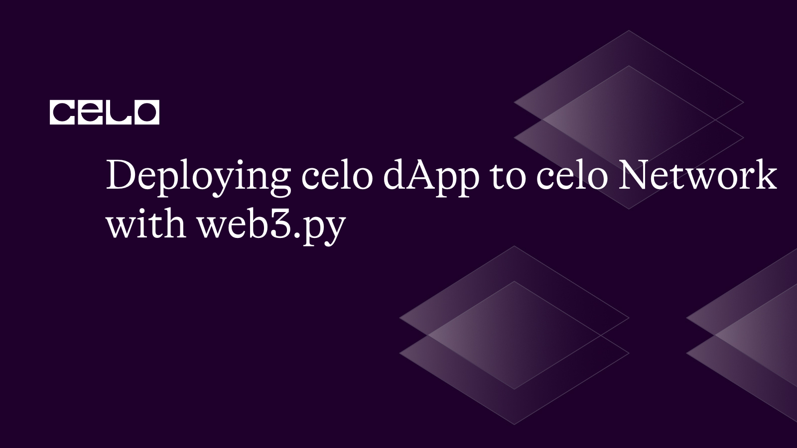

##  Introduction
Web3.py is a powerful Python library that enables developers to interact with the Celo blockchain network and deploy decentralized applications (dApps) on the platform. In this tutorial, we will walk through the process of deploying a Celo dApp to the Celo network using web3.py. Here are the steps we’ll follow

1. Installing the web3.py library
2. up web3 connection to Celo network
3. Create a contract instance
4. Estimate the gas cost for deploying the contract
5. Build, Sign and Send the transaction
6. Wait for the transaction
7. Get the deployed contract address
8. Create a concise contract instance
9. Example function call on the deployed contract


##  Prerequisites
1. Fundamental understanding of programming principles
2. Knowledge of deploying and hosting applications
3. Familiarity with blockchain technology

##  Requirements
1. Web3.py (Python library that allow you to interact with the blockchain)
2. Python IDE (To run the code)
3. Celo Network (To interact with the celo blockchain using web3.py, you need to connect to a celo network)

## Step1: Installing web3.py library
To install **web3.py**, you can run the following code in your terminal or command prompt or any Python IDE. I am using google colab here

```py
	pip install web3
```

##  Step2: Set up web3 connection to Celo network

Here's an example code for setting up a web3 connection to the Celo network using **web3.py**:

```py
	 #First import the necessary library
	 from web3 import Web3, HTTPProvider   
         w3 = Web3(Web3.HTTPProvider('https://forno.celo.org'))
```

This code creates a Web3 object using the HTTP provider for the Celo network's forno service at https://forno.celo.org.

##  Step3: Create a contract instance
To interact with a smart contract on the Celo blockchain using **web3.py**, you need to create a contract instance from the contract ABI and bytecode.

```py
MyContract = w3.eth.contract(abi=ABI, bytecode=bytecode)
```

Replace the ABI and bytecode fields with your contract bytecode and ABI. You can follow these steps to get your ABI.
Go to [the celo explorer page](https://explorer.celo.org)
Type the name or the address of the contract in the search bar and click on the search icon.
Once the contract is displayed, click on the "ABI" tab to see the contract's ABI
You can then copy the ABI and use it in your code

Note that not all contracts have their ABI available on the Explorer website, in which case you may need to obtain the ABI from another source, such as the contract developer or community.

## Step4: Estimate the gas cost for deploying the contract
Here's an example code for estimating the gas cost for deploying a contract in Celo using **web3.py**:

``` py
gas_estimate = w3.eth.estimate_gas({'from': address, 'data': bytecode})
```

We use the **estimate_gas** function of the **web3.py** eth module to estimate the amount of gas required to deploy the contract. The function takes a dictionary with the from address and the contract data (bytecode) as arguments. The gas estimate is then stored in the gas_estimate variable for use in the contract deployment transaction.
Replace the address and bytecode with your contract address and bytecode respectively

##  Step5: Build, Sign and Send the transaction
### Build Transaction
Here's a code for building the transaction to deploy the contract:

```py
tx = {
 'from': address,
 'gas': gas_estimate,
 'gasPrice': Web3.to_wei('10', 'gwei'), 
'nonce': w3.eth.get_transaction_count(address),
 'data': bytecode 
}
```

###  Sign Transaction

```py
#Next is to sign the transaction, here’s the code:
signed_tx = w3.eth.account.sign_transaction(tx, private_key)
```

### Send Transaction
Here's an example line for sending the signed transaction:
```py
tx_hash = w3.eth.send_raw_transaction(signed_tx.rawTransaction)
```
This line sends the raw transaction to the network and returns the transaction hash.

## Step6: Wait for the transaction
The next step is to wait for the transaction to be mined, we’ll do that with the following code:

```py
tx_receipt = w3.eth.wait_for_transaction_receipt(tx_hash)
```

where **tx_hash** is the hash of the transaction you just sent.

This code will wait for the transaction with the given **tx_hash** to be mined and return a TransactionReceipt object that contains information about the transaction, such as the block number and gas used.

## Step7: Get the deployed contract address
To get the deployed contract address after the transaction has been mined, you can use the following line:

```py
contract_address = tx_receipt.contract_address
```

## Step8: Create a concise contract instance
Here's an example line for creating a concise contract instance in **web3.py**:

```py
MyContract = concise_contract(w3.eth.contract(address=contract_address, abi=abi))
```

Here, **w3** is the instance of the **web3.py** library, contract_address is the address of the deployed contract on the Celo network, and abi is the ABI (Application Binary Interface) of the contract. Do not forget you can always get your ABI with the step described in step 3 above

## Step9: Example function call on the deployed contract
Here's the code for calling a function on the deployed contract:

```py
result = MyContract.my_function() 
print(result)
```

In this line, **MyContract** is the concise contract instance we created earlier, **my_function** is the name of the function we want to call. You can then use the result variable to get the output of the function.

Here is the [link](https://github.com/yusuf1990/DeployCelo) to the repository

## Conclusion
 In this tutorial, we have explained the process of deploying a Celo dApp to the Celo network using web3py. By following the examples provided, you should be able to deploy Celo dapp to Celo network with web3py

## About the Author

Jimoh Yusuf is a web3 developer and a data scientist with a passion of learning. I will be glad to connect with people who share have same ambition as me on Twitter handle @YusufJi30148537


