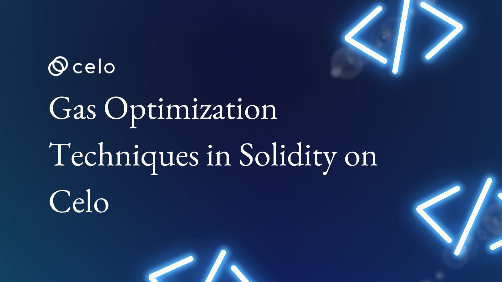

## Introduction

Optimizing smart contract performance is an essential aspect of blockchain development. Solidity, the most popular programming language for creating smart contracts on the Ethereum platform, provides several techniques to help improve the efficiency of your contracts. In this article, we'll go over some of these techniques and how you can use them to improve the performance of your Solidity code. We'll discuss how to save gas, avoid unnecessary computations, and improve contract readability.

## What is Solidity?

Solidity is an object-oriented programming language used to implement smart contracts on various blockchain platforms, most notably Ethereum. Christian Reitwiessner, Alex Beregszaszi, and several former Ethereum core contributors created it. Solidity programs run on the Ethereum Virtual Machine.

Solidity can be run on Remix, a web browser-based IDE that allows you to write, deploy and run Solidity smart contracts.

A Solidity contract is a collection of code (its functions) and data (its state) stored at a specific address on the Ethereum blockchain. Developers can use Solidity to create contracts for voting, crowdfunding, blind auctions, multi-signature wallets, and other purposes.

## What is Gas and Gas Optimization in Solidity ?

We need to understand Gas fully before we can optimize its usage in any way. We will first look at it from a high-level view and then go deeper into it.

## High-level Overview of Gas in Solidity and Ethereum

Solidity gas optimization is the process of making your Solidity smart code less expensive to execute. Gas is the unit of measurement for the amount of computational effort required to carry out specific operations on the Ethereum network.

Each Ethereum transaction requires computational resources, so each transaction requires a fee. The fee for completing an Ethereum transaction is known as gas.

When you compile a smart contract in Solidity, it is converted into a series of "operation codes," also known as opcodes. Each opcode is assigned a fixed amount of gas, representing the computing work required to complete that specific operation.

Opcodes and bytecodes are similar; however, bytecodes are represented by hexadecimal integers. The Ethereum Virtual Machine, also known as the EVM, is software that executes smart contracts and sits on top of the Ethereum node and network layers.

Optimization aims to reduce the number of operations required to run a smart contract. Optimized smart contracts not only save gas but also protect against malicious misuse.

## Technical View of Gas in Solidity

Gas (Ethereum) is the internal pricing (metering system) for running a contract or, more broadly, any Ethereum transaction. Gas is a unit of measurement for the amount of computational effort required to carry out Ethereum operations. The greater the computation and storage required to complete a transaction, the greater the amount of gas required to perform and complete that transaction. Measuring the amount of Gas needed for each operation. For example, different amounts of Gas are required for addition (3 Gas), multiplication (5 Gas), storage operations (200-20,000 Gas), and stack operations (2-3 Gas).

Ethereum runs its smart contracts on the Ethereum Virtual Machine (EVM) using Solidity, and each line of code executed in Solidity requires a specific amount of Gas. Miners on the Ethereum network who perform the computational work required to execute transactions are compensated with gas. The goal of implementing the Gas system to complete Ethereum transactions is to incentivize miners to perform computations. Gas and Ethereum collaborate to complete a peer-to-peer proof-of-work system in which miners mine blocks and earn block rewards by becoming temporary dictators of their mined blocks on the blockchain.

The fee paid to miners equals the amount of gas used multiplied by the current gas price. The default Gas price is 0.02uETH (micro ether) per Gas, but the user can specify a different price. If the user sets a higher fee (price per Gas), the reward for miners increases, likely increasing the speed at which transactions with higher fees are processed. Users can pay more for faster transaction completion times on Ethereum using this Gas price system.

## EIP 1559: Ethereum's Fee Market

Ethereum Improvement Proposal (EIP) 1559 is one of the most eagerly anticipated code changes in the "London" upgrade. EIP 1559's core goal is to make transaction fees less volatile and more predictable.

According to Christine Kim of CoinDesk, EIP 1559 replaces "Ethereum's auction-style fee market with an algorithm that automatically sets the gas price." According to Kim's report, the proposal serves four important purposes: counterbalancing ether's increasing supply, preventing economic abstraction of Ethereum (ETH, -0.22%), reducing fee volatility, and increasing fee market efficiency.

EIP 1559 will impact all Ethereum network stakeholders to some extent. The network's users will now have access to a new fee market, which will alter how their transactions are prioritized and add predictability to transaction fees.

EIP 1559 will also increase block size variance, which means that during high network congestion, block sizes can fluctuate up to two times the maximum current limit. This flexibility in the amount of transaction data that can fit in a block is intended to improve fee market efficiency and alleviate some of the pain points caused by Ethereum's limited transaction throughput or how fast the network can process transactions.

Let us make an analogy. Assume you're going on a road trip. You must first complete the following steps:

- You go to the gas station and tell them how much gas you want in your car.
  You fill up your gas tank in your car.
- You pay the gas station whatever you owe them for the gas.
  Driving the car is the operation you want to carry out, similar to carrying out a smart contract function. The gas, well, it's gas. Your miner is the gas station. The money you gave them is for miner fees.

All Ethereum operations that users wish to carry out must provide gas for the following:

- To cover its data, AKA intrinsic gas
- To cover its entire computation
  Now that we've covered the fundamentals, you might be asking yourself the question “Why do we have this Gas System ?”

## Why do we have this Gas system?

The answer is simple - incentivization

Ethereum, like any proof-of-work peer-to-peer system, is heavily reliant on the hash rate of its miners. The higher the hash rate, the more secure and fast the system.

To attract more miners, they must make the system as profitable and appealing to the miners as possible. Miners in Ethereum can earn money in one of two ways:

- By mining blocks and being rewarded for it
- By becoming temporary dictators of their mined blocks
  The miners are in charge of placing transactions within their blocks. They must use their computational power to validate smart contracts to do so. The gas system allows them to charge a fee for this service.

This fee is known as the miner's, and it incentivizes miners to participate actively in the ecosystem.

Let’s dig into it !

## Solidity Gas Optimization Techniques

## Use Mappings instead of Arrays

In Solidity; there are two data types for describing data lists: arrays and maps. Their syntax and structure are quite different, allowing each to serve a distinct purpose. Maps are less expensive than arrays because they are packable and iterable.

In Solidity, for example, creating an array of cars might look like this:

```solidity
string cars[];
cars = ["ford", "audi", "chevrolet"];
```

Let’s see how to create a mapping for cars:

```solidity
mapping(uint => string) public cars
```

You will specify the data type for the key (uint) and the value when you use the mapping keyword (string). The constructor function can then be used to add some data.

```solidity
constructor() public {
        cars[101] = "Ford";
        cars[102] = "Audi";
        cars[103] = "Chevrolet";
    }
}
```

To conserve gas, it is recommended to use mappings to manage lists of data, unless iteration is required or data types can be packed. This is advantageous for both memory and storage.

To control an ordered list, an integer index can be used as a key in a mapping. Another advantage of mappings is that they allow you to access any value without iterating through an array, which would otherwise be required.

## Enable the Solidity Compiler Optimizer

The Solidity compiler optimizer works to simplify complex expressions, reducing code size and execution costs through inline operations, deployment costs, and function call costs.

The Solidity optimizer is best suited for inline operations. Even though inlining functions can result in significantly larger code, it is commonly used because it allows for additional simplifications.

The compiler optimizer also impacts the deployment and function call costs of your smart contracts.

For example, deployment costs decrease as the number of "runs" decreases—the frequency with which each opcode is executed over the course of a contract. The impact on function call costs, on the other hand, grows with the number of runs. This is because code optimized for more runs costs more to deploy and less after deployment.

In the examples below, runs are set at 200 and 10,000:

```solidity

module.exports = {
  solidity: {
    version: "0.8.9",
    settings: {
      optimizer: {
        enabled: false,
        runs: 200,
      },
    },
  },
};
```

Increasing runs to 10,000 and set the default value to true:

```solidity
module.exports = {
  solidity: {
    version: "0.8.9",
    settings: {
      optimizer: {
        enabled: true,
        runs: 10000,
      },
    },
  },
};
```

## Minimize On-Chain Data

Because on-chain data is limited to what can be created natively within a blockchain network (e.g., state, account addresses, balances, and so on), you can reduce unnecessary operations and complex computations by storing fewer data in storage variables, batching operations, and avoiding looping.

The fewer data stored in storage variables, the less gas is required. Keep all data off-chain and only save the critical information of the smart contract on-chain. By integrating off-chain data into a blockchain network, developers can create more complex applications such as prediction markets, stablecoins, and parametric insurance.

Using events to store data is a popular but ill-advised method for gas optimization because, while storing data in events is less expensive than variables, the data in events cannot be accessed by other smart contracts on-chain.

### Batching Operations

Instead of requiring the same method several times with different values, batching operations allow developers to batch actions by passing dynamically sized arrays that can execute the same functionality in a single transaction.

Consider the following scenario: a user wishes to invoke getData() with five distinct inputs. The user would only need to pay the transaction's fixed gas cost and the gas for the msg.sender check once in the streamlined form.

```solidity
function batchSend(Call[] memory _calls) public payable {
       for(uint256 i = 0; i < _calls.length; i++) {
           (bool _success, bytes memory _data) = _calls[i].recipient.call{gas: _calls[i].gas, value: _calls[i].value}(_calls[i].data);
           if (!_success) {

               assembly { revert(add(0x20, _data), mload(_data)) }
           }
       }
   }
```

### Looping

Avoid looping through long arrays; not only will it consume a lot of gas, but it may even prevent your contract from being carried out if gas prices rise too much.

Rather than looping through an array until you find the key you need, use mappings, hash tables that allow you to retrieve any value using its key in a single action.
This is because each iteration of a loop requires a specific amount of gas to execute, and if your loop has a large number of iterations, the total gas cost can quickly add up. This can be a problem because the Ethereum blockchain has a gas limit per block, which means your contract will not be able to execute if it consumes too much gas.

To avoid this, try to use as few loops as possible in your contract code. Instead of loops, other techniques can be used to perform the same operations in a more gas-efficient manner. For example, in Solidity, you can use the mapping data type to store and retrieve data, which is more efficient than iterating over an array of data using a loop.

```solidity
pragma solidity ^0.5.0;
contract MyContract {
    // Define a mapping to store data
    mapping(uint256 => string) public data;
    // Store data in the mapping
    function setData(uint256 id, string memory message) public {
        data[id] = message;}
    // Retrieve data from the mapping
    function getData(uint256 id) public view returns (string memory) {
        return data[id];
    }}
```

The data mapping is used to store and retrieve data in this example. The setData function stores a message in the mapping, with a unique ID serving as the key. The getData function retrieves the message from the mapping using the same ID as the key. This may be more efficient than iterating over an array of data and searching for the message in a loop.

You can reduce the gas cost of your contract and make it more efficient by avoiding loops and using data structures such as mapping. This is especially useful if your contract performs operations that necessitate the processing of a large amount of data.

## Use Indexed Events

Events are used to notify users when something happens on the blockchain because smart contracts cannot hear events on their own because contract data is stored in the States trie and event data is stored in the Transaction Receipts trie.

Events in Solidity are a quick way to accelerate the development of external systems that work in tandem with smart contracts. All information in the blockchain is public, and any activity can be detected by closely examining the transactions.

Using indexed events is one way to reduce the gas cost of a contract in Solidity. Solidity events allow external contracts and applications to listen for specific occurrences in your contract. Events are non-indexed by default, meaning the entire event data is stored on the blockchain. This can be expensive in terms of gas because storing large amounts of data on the blockchain can be costly.

You can use indexed events to reduce the gas cost of your contract. Indexed events allow you to specify which event arguments should be indexed, which means they should be stored in a separate data structure that can be queried easily. External contracts and applications can use this feature to search for specific event occurrences without having to traverse the entire event data.

```solidity
pragma solidity ^0.5.0;

contract MyContract {
    // Define the event with indexed arguments
    event MyEvent(uint256 indexed id, string message);

    // Trigger the event and include indexed arguments
    function doSomething(uint256 id, string memory message) public {
        emit MyEvent(id, message);
    }
}
```

The MyEvent event in this example has two arguments: id and message. The id argument is marked as indexed, which means it will be saved in a separate data structure that can be queried easily. External contracts and applications can use the id argument to search for specific occurrences of the MyEvent event without having to traverse the entire event data.

You can reduce the gas cost of your contract and make it more efficient by using indexed events. This is especially helpful if your contract generates a large amount of event data that must be stored on the blockchain.

## Store Data in calldata Instead of Memory for Certain Function Parameters

Storing data in calldata instead of memory for certain function parameters can be a useful optimization technique in Solidity.

Calldata is a special storage area in the Ethereum Virtual Machine (EVM) that is used to pass function arguments from the caller to the contract. When a function is called, the arguments are copied from the caller's memory into calldata, and then from calldata into the contract's memory.

Using calldata instead of memory for function arguments can save gas because data in calldata is not copied when it is passed to the contract, whereas data in memory is copied. This means that if a contract has a function that takes a large amount of data as an argument, using calldata can save gas by reducing the amount of data that needs to be copied.

To use calldata instead of memory for function arguments, the arguments must be marked with the calldata keyword in the function signature. For example, consider the following contract:

```solidity
contract Example {
  function foo(uint[] memory data) public {
    //Do something with the data...
  }
}
```

In this contract, the foo function takes an array of uint values as an argument. Because the array is marked with the memory keyword, it will be copied from the caller's memory into the contract's memory when the function is called. This can be inefficient if the array is large.

To optimize this function, we can use the calldata keyword instead of memory:

```solidity
contract Example {
  function foo(uint[] calldata data) public {
    // Do something with the data...
  }
}
```

Now when the foo function is called, the array will not be copied from the caller's memory into the contract's memory. Instead, it will remain in calldata, where it can be accessed directly. This can save gas because it reduces the amount of data that needs to be copied.

It's important to note that using calldata has some limitations. Data in calldata is read-only, so it cannot be modified by the contract. In addition, calldata can only be accessed within the scope of the function in which it is declared, so it cannot be passed to other functions or stored in contract storage. Therefore, using calldata should only be considered for function arguments that do not need to be modified or stored by the contract.

In summary, using calldata instead of memory for certain function arguments can be a useful optimization technique in Solidity. It can save gas by reducing the amount of data that needs to be copied when a function is called. However, it is important to understand the limitations of calldata and only use it when appropriate.

## Use Immutable and Constant

Optimizing gas consumption in Solidity can be important for improving the performance and efficiency of Ethereum contracts. One way to reduce gas usage is by using the immutable and constant keywords to declare variables and functions that do not modify the contract state.

The immutable keyword is used to declare variables that are constant and cannot be modified after they are initialized. For example

```solidity
contract Example {
  immutable uint256 constantValue = 42;

  function getConstantValue() public view immutable returns (uint256) {
    return constantValue;
  }
}
```

In this contract, the constantValue variable is declared as immutable, which means it cannot be modified after it is initialized with the value 42. The getConstantValue function is also marked as immutable, which means it cannot modify contract state. Because both the variable and the function are immutable, they can be accessed more efficiently and with less gas than if they were not marked as such.

The constant keyword is similar to immutable, but it is used to declare functions that do not modify the contract state. For example

```solidity
contract Example {
  uint256 value = 42;

  function getValue() public view constant returns (uint256) {
    return value;
  }
}
```

In this contract, the getValue function is declared as constant, which means it cannot modify the contract state. This means that the function can be called more efficiently and with less gas than if it were not marked as constant.

Using immutable and constant keywords can help reduce gas usage by allowing the Ethereum Virtual Machine (EVM) to optimize the execution of certain contract parts. However, it's important to understand the limitations of these keywords and only use them when appropriate. For example, using immutable on a variable that needs to be modified by the contract will result in a compile-time error, and using constant on a function that modifies the contract state will also result in an error.

In summary, using the immutable and constant keywords in Solidity can be a useful optimization technique for reducing gas usage. These keywords can help the EVM optimize the execution of certain contract parts, improving performance and efficiency. However, it's important to understand their limitations and use them appropriately.

## Use the External Visibility Modifier

One way to reduce gas usage is by using the external visibility modifier to declare functions that are only intended to be called by other contracts.

In Solidity, the visibility of a function determines who can call it and how it can be accessed. By default, functions are public, which means they can be called by anyone and are accessible from outside the contract. However, this can lead to unnecessary gas usage because every time a public function is called, the Ethereum Virtual Machine (EVM) must verify that the caller has the appropriate permissions.

The external visibility modifier can be used to declare functions that are only intended to be called by other contracts. For example

```solidity
contract Example {
  function foo() external {
    // Do something...
  }
}
```

In this contract, the foo function is declared as external, which means it can only be called by other contracts. This means the EVM does not need to verify the caller's permissions when the function is called, which can save gas.

It's important to note that using the external modifier has some limitations. Functions marked as external cannot be called from within the contract itself, so they can only be used for inter-contract communication. In addition, external functions cannot access the contract's storage, so they can only perform read-only operations on the contract state. Therefore, using the external modifier should only be considered for functions that are intended to be called by other contracts and do not need to modify the contract state.

In summary, using the external visibility modifier in Solidity can be a useful optimization technique for reducing gas usage. It allows the EVM to skip the permission check when a function is called, improving performance and efficiency. However, it's important to understand the limitations of the external modifier and only use it when appropriate.

## Free Up Unused Storage

In Solidity, every contract has a storage area where it can store data that is persistent across function calls. This data is stored in the contract's storage, which is a special area of memory in the Ethereum Virtual Machine (EVM). However, storage is a limited resource, and using too much of it can lead to increased gas usage and reduced performance.

To optimize gas usage, it's important to free up storage that is no longer needed by the contract. This can be done by deleting data that is no longer needed or by replacing it with smaller data structures. For example, consider the following contract:

```solidity
contract Example {
  mapping(uint => uint) data;

  function addData(uint key, uint value) public {
    data[key] = value;
  }

  function deleteData(uint key) public {
    delete data[key];
  }
}
```

In this contract, the data mapping is used to store key-value pairs. When a new key-value pair is added to the mapping, it is stored in the contract's storage. However, when a key-value pair is deleted from the mapping, the corresponding storage slot is not automatically freed up. This means that over time, the contract's storage can become cluttered with unused data, which can lead to increased gas usage.

To optimize this contract, we can free up unused storage slots by deleting them explicitly. This can be done by using the delete keyword in combination with the storage keyword, like so:

```solidity
contract Example {
  mapping(uint => uint) data;

  function addData(uint key, uint value) public {
    data[key] = value;
  }

  function deleteData(uint key) public {
    delete data[key];
    delete storage[key];
  }
}
```

Now, when a key-value pair is deleted from the data mapping, the corresponding storage slot is also explicitly deleted, freeing up the storage for use by other parts of the contract. This can help optimize gas usage by reducing the amount of unused data in the contract's storage.

In summary, freeing up storage that is no longer needed by a Solidity contract can be an effective optimization technique for reducing gas usage. By explicitly deleting unused data from the contract's storage, it's possible to reduce the amount of storage being used and improve the performance and efficiency of the contract. However, it's important to understand the limitations of storage and use it carefully to avoid running out of space

## Packing Your Variables

One way to reduce gas usage is by packing your variables, which can help reduce the amount of storage space used by the contract.

In Solidity, variables are stored in the contract's storage, which is a special area of memory in the Ethereum Virtual Machine (EVM). However, storage is a limited resource, and using too much of it can lead to increased gas usage and reduced performance.

To optimize gas usage, it's important to minimize the amount of storage space used by the contract. One way to do this is by packing multiple variables into a single storage slot, using data structures such as structs and arrays. For example, consider the following contract:

```solidity
contract Example {
  uint x;
  uint y;
  uint z;

  function setXYZ(uint _x, uint _y, uint _z) public {
    x = _x;
    y = _y;
    z = _z;
  }
}
```

In this contract, the x, y, and z variables are stored in separate storage slots, which means they each use a separate storage location. This can be inefficient, as it uses more storage space than is necessary.

To optimize this contract, we can pack the x, y, and z variables into a single storage slot, using a struct or an array, like so:

```solidity
contract Example {
  struct XYZ {
    uint x;
    uint y;
    uint z;
  }

  XYZ data;

  function setXYZ(uint _x, uint _y, uint _z) public {
    data.x = _x;
    data.y = _y;
    data.z = _z;
  }
}
```

Now, the x, y, and z variables are packed into a single storage slot, using the XYZ struct. This means that they all share the same storage location, which reduces the amount of storage space used by the contract.

In summary, packing your variables in Solidity can be an effective optimization technique for reducing gas usage. By using data structures such as structs and arrays, it's possible to pack multiple variables into a single storage slot, which can help minimize the amount of storage space used by the contract. This can improve the performance and efficiency of the contract, as well as reduce gas usage.

## Using int8 can lead to an increase in Gas Costs

One way to reduce gas usage is by avoiding the use of the uint8 data type, which can lead to increased gas usage compared to other data types.

In Solidity, the uint8 data type represents an unsigned 8-bit integer, which can hold values in the range of 0 to 255. However, using uint8 can be inefficient, as it requires more gas to store and manipulate compared to other data types, such as uint or uint256.

To optimize gas usage, it's important to choose the most efficient data type for your contract's variables and data structures. For example, consider the following contract:

```solidity
contract Example {
  uint8 x;

  function setX(uint8 _x) public {
    x = _x;
  }
}
```

In this contract, the x variable is of type uint8, which means it uses an 8-bit storage slot. This can be inefficient, as it requires more gas to store and manipulate compared to other data types.

To optimize this contract, we can replace the uint8 data type with a more efficient data type, such as uint or uint256, like so:

```solidity
contract Example {
  uint x;

  function setX(uint _x) public {
    x = _x;
  }
}
```

Now, the x variable is of type uint, which means it uses a 256-bit storage slot. This is more efficient, as it requires less gas to store and manipulate compared to uint8.

In summary, avoiding the use of the uint8 data type in Solidity can be an effective optimization technique for reducing gas usage. By choosing more efficient data types, such as uint or uint256, it's possible to minimize the amount of gas required to store and manipulate variables and data structures. This can improve the performance and efficiency of the contract, as well as reduce gas usage.

## Conclusion

In conclusion, optimizing gas usage in Solidity is an important consideration for improving the performance and efficiency of Ethereum contracts. In this article, we discussed ways to optimize gas in Solidity, including using the right modifiers, not using the uint8 data type, packing your variables, and more. By following these best practices, it's possible to reduce gas usage and improve the performance and efficiency of your Solidity contracts.

## Author

[Oyeniyi Abiola Peace](https://twitter.com/_iamoracle) is a seasoned software and blockchain developer. With a degree in Telecommunication Science from the University of Ilorin and over five years experience in JavaScript, Python, PHP, and Solidity, he is no stranger to the tech industry. Peace currently works as the CTO at DFMLab and is a Community Moderator at Celo Blockchain. When he's not coding or teaching, he loves to read and spend time with family and friends.
