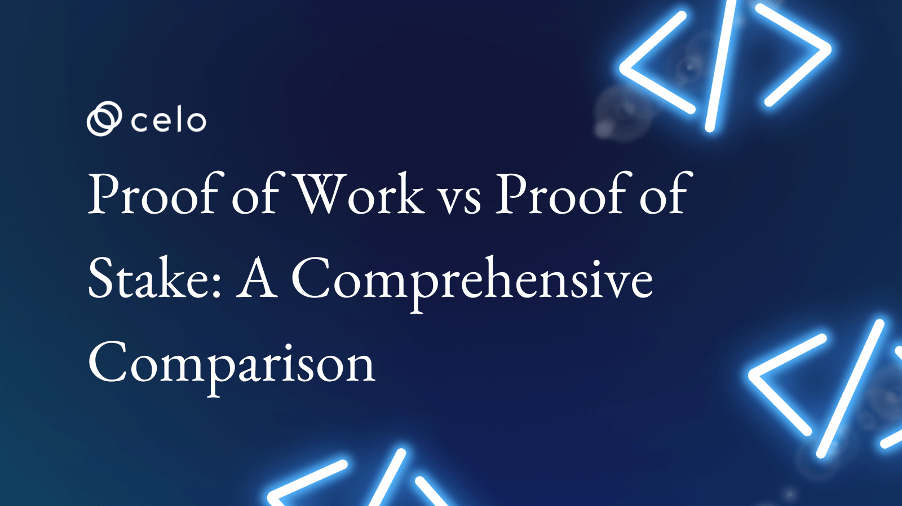

## Introduction

In this article, we will provide a comprehensive comparison of proof of work and proof of stake, highlighting the key differences between the two algorithms and discussing their respective advantages and disadvantages. We will also examine the potential future developments of these algorithms and consider their potential use cases in various blockchain applications.

## Importance of Consensus Algorithms in Blockchain Technology

Consensus algorithms are an essential component of blockchain technology because they help ensure the integrity, security, and reliability of the blockchain network. These algorithms help to prevent double spending, malicious attacks, and other forms of tampering or fraud. Some of the key benefits of consensus algorithms in blockchain technology include:

- **Ensuring the Integrity of the Blockchain**

Consensus algorithms help to ensure that the data on the blockchain is accurate, consistent, and cannot be tampered with. This is critical for maintaining the trust and reliability of the blockchain.

- **Enhancing Security**

Consensus algorithms help to secure the blockchain by requiring multiple parties to agree on the validity of transactions before they are added to the blockchain. This makes it difficult for attackers to alter or manipulate the data on the blockchain.

- **Improving Scalability**

Consensus algorithms can help to improve the scalability of a blockchain by allowing transactions to be processed and verified more quickly and efficiently. This is especially important for large, decentralized networks that need to handle a high volume of transactions.

- **Facilitating Decentralization**

Consensus algorithms help to ensure that no single party has complete control over the blockchain. This helps to promote decentralization and ensures that the blockchain is not controlled by a single entity.

- **Promoting Trust**

Consensus algorithms help to build trust among participants in the blockchain network, as they provide a transparent and secure way to verify and validate transactions. This helps to foster a sense of confidence and security among users of the blockchain.

# Proof of Work

Proof of work (PoW) is a consensus algorithm that is used by many blockchain networks, including the original and most well-known cryptocurrency, Bitcoin. PoW requires participating nodes (also called "miners") to solve a complex mathematical puzzle to validate transactions and create new blocks on the blockchain. The process of solving these puzzles is known as "mining."

To mine a block, miners must find a solution to the puzzle that meets certain predetermined criteria. This process involves using powerful computer hardware to perform a large number of calculations in a process called "hashing." When a miner successfully finds a solution to the puzzle, they can add a new block to the blockchain and receive a reward in the form of cryptocurrency.

PoW is designed to be resource-intensive and time-consuming so it is not easy for a single miner or group of miners to dominate the process. Instead, it requires a decentralized network of miners to work together to validate transactions and create new blocks. This helps to ensure the security and integrity of the blockchain, as it is very difficult for a single entity to manipulate or alter the data on the blockchain.

One of the key benefits of PoW is that it is a proven and well-established consensus algorithm that has been used successfully for many years. It has a strong track record of security and reliability, and it is resistant to tampering and other forms of fraud. However, PoW also has some downsides, including the fact that it is resource-intensive and requires a significant amount of energy to power the mining process. Some blockchain networks have sought to address these issues by implementing alternative consensus algorithms that are less resource-intensive and more energy-efficient.

## How Does It Works?

In a Proof of Work (PoW) consensus algorithm, miners are required to perform a certain amount of work to validate transactions and create new blocks on the blockchain. This work typically involves solving complex mathematical puzzles, which require the use of powerful computer hardware to perform a large number of calculations.

The process of solving these puzzles is known as "mining." Miners use their computer hardware to perform a series of calculations, called "hashing," in an attempt to find a solution to the puzzle that meets certain predetermined criteria. When a miner finds a solution, they can add a new block to the blockchain and receive a reward in the form of cryptocurrency.

The difficulty of the puzzles is carefully calibrated so that it takes a certain amount of time, on average, for miners to find a solution. This helps to ensure that the process of mining new blocks is not too easy or too difficult and that it is decentralized. If the puzzles were too easy, a single miner or group of miners could dominate the process and create most of the new blocks, which would undermine the security and integrity of the blockchain. On the other hand, if the puzzles were too difficult, it would take too long for new blocks to be created, and the blockchain would not be able to process transactions on time.

To participate in the mining process, miners must compete with one another to find a solution to the puzzle. The first miner to find a solution can add the new block to the blockchain and receive the reward. This creates an incentive for miners to compete with one another and contribute their computing power to the network.

## Advantages of Proof of Work

- **Security**

PoW is a secure and reliable consensus algorithm that has been used successfully for many years. It is resistant to tampering and other forms of fraud, and it helps to ensure the integrity and security of the blockchain.

- **Decentralization**

PoW requires a decentralized network of miners to work together to validate transactions and create new blocks. This helps to prevent any single miner or group of miners from dominating the process and ensures that the blockchain is not controlled by a single entity.

- **Energy Efficiency**

PoW algorithms are designed to be resource-intensive and time-consuming, which helps to ensure that they are decentralized and secure. However, this can also make them energy-intensive, as miners need to use a lot of electricity to power their computer hardware.

- **Incentives for Miners**

PoW provides an incentive for miners to contribute their computing power to the network. When a miner successfully solves a puzzle and adds a new block to the blockchain, they receive a reward in the form of cryptocurrency. This helps to encourage miners to participate in the mining process and contribute to the security of the blockchain.
Widely-adopted
PoW is a well-established and widely adopted consensus algorithm, and it is used by many of the most well-known blockchain networks, including Bitcoin. This means that it has a strong track record of security and reliability.

## Disadvantages of Proof of Work

- **Resource-intensive**

PoW algorithms are designed to be resource-intensive and time-consuming, which can make them expensive and energy-intensive to operate. This can make it difficult for smaller, less well-funded miners to compete with larger, better-equipped miners.

- **Energy Consumption**

As mentioned above, PoW algorithms can be energy-intensive, as they require a lot of electricity to power the mining process. This can be a concern for those who are concerned about the environmental impact of cryptocurrency mining.

- **Centralization**

Since PoW algorithms are resource-intensive, they can be more expensive and difficult for smaller miners to participate in. This can lead to a degree of centralization, with a few large miners dominating the mining process. This can undermine the decentralization and security of the blockchain.

- **Scalability**

PoW algorithms can be slower and less efficient than some alternative consensus algorithms, which can make it difficult for the blockchain to scale and handle a large volume of transactions.

- **Risk of 51% Attacks**

If a single miner or group of miners controls more than 50% of the mining power on a PoW blockchain, they could potentially launch a 51% attack, which could allow them to alter the data on the blockchain or reverse transactions. While this is a rare occurrence, it is a potential risk to PoW algorithms.

# Proof of Stake

Proof of Stake (PoS) is a consensus algorithm that is used to validate transactions and achieve distributed consensus in a blockchain network. It is an alternative to the more widely known Proof of Work (PoW) algorithm, which is used by networks such as Bitcoin and Ethereum.

In a PoS system, the validation of transactions and the creation of new blocks are not done by miners using powerful computers to solve complex mathematical problems, but rather by users who hold a stake in the network. These users, known as "validators," are chosen to create new blocks based on their stake, or the amount of cryptocurrency they hold in the network.

One of the main benefits of PoS is that it is much more energy efficient than PoW, as it does not require the use of expensive and power-hungry hardware to solve complex mathematical problems. This makes it an attractive option for blockchain networks that are looking to reduce their energy consumption and carbon footprint.

Another advantage of PoS is that it is more decentralized than PoW, as it does not rely on the use of powerful computers to validate transactions. This means that anyone with a stake in the network can become a validator, regardless of their computing power.

However, PoS also has its limitations. For example, it can be vulnerable to attacks from users with a large stake in the network, who may be able to influence the validation of transactions in their favor. There are also concerns about the centralization of PoS networks, as the concentration of stake in the hands of a few large holders could give them disproportionate influence over the network.

Despite these limitations, PoS has gained widespread adoption in the blockchain industry and is used by several major networks, including Cosmos, Tezos, and Ethereum 2.0. It is likely to continue to play a significant role in the development of decentralized networks in the future.

## How It Works?

In a Proof of Stake (PoS) system, the process of validating transactions and creating new blocks is known as "staking." Validators, or "stakers," are chosen to create new blocks based on their stake, or the amount of cryptocurrency they hold in the network.

When a new block is ready to be added to the blockchain, the PoS algorithm selects a validator to create the block using a randomized process that is based on their stake in the network. This process is known as "slot assignment."

Once a validator has been selected to create a new block, they must validate the transactions in the block to ensure that they are all valid. If the transactions are valid, the validator can then add the block to the blockchain and receive a reward for their efforts.

One important aspect of PoS is the concept of "bonding," which is the process of locking up a certain amount of cryptocurrency as a stake in the network. This bonding process helps to ensure that validators are incentivized to act in the best interests of the network, as they stand to lose their stake if they act maliciously or try to cheat the system.

There are also mechanisms in place to help prevent malicious behavior in PoS systems, such as "slashing," which is the process of penalizing validators who act in ways that are detrimental to the network. This could include attempting to double spend, creating invalid blocks, or failing to follow the rules of the network.

Overall, the PoS consensus algorithm is designed to be energy efficient, decentralized, and secure, making it a popular choice for many blockchain networks. It is likely to continue to evolve and be refined as the blockchain industry grows and develops.

## Advantages of Proof of Stake

- **Energy Efficiency**

PoS algorithms do not require miners to perform resource-intensive computations to validate transactions and create new blocks, which means they are less energy-intensive compared to proof-of-work (PoW) algorithms. This makes PoS more environmentally friendly and sustainable in the long term.

- **Greater Decentralization**

In a PoS system, anyone with a stake in the network can participate in the validation process, which means that the network is less centralized and more resistant to attacks and censorship.

- **Faster Transaction Processing**

PoS algorithms generally allow for faster transaction processing and block creation compared to PoW, which can make them more suitable for networks with high transaction volumes.

- **Increased Security**

PoS algorithms rely on a system of stakes and rewards to incentivize network participants to act honestly and maintain the integrity of the network. This can make PoS more resistant to malicious attacks and increases overall security.

- **Lower Entry Barriers**

Because PoS algorithms do not require specialized mining hardware or a lot of energy, they can be more accessible to a wider range of participants, which can help to increase decentralization and foster a more diverse and resilient network.

## Disadvantages of Proof of Stake

- **Dependence on Stake**

In PoS systems, the amount of stake a validator has is directly proportional to their likelihood of being chosen to produce the next block. This can create a dependency on stake, and those with more stake may have a disproportionate influence on the network.

- **Lack of Miner Diversity**

In PoW systems, miners are incentivized to participate in the network with the potential to earn block rewards. In PoS systems, there are often fewer rewards available because validators are chosen based on their stake rather than their computational power. This can lead to a lack of miner diversity and potentially less decentralization.

- **Complexity**

Implementing a PoS system can be more complex than a PoW system because it requires a way to determine the stake of each validator and choose the next block producer based on that stake.

- **Lack of Security**

PoS systems rely on the assumption that validators act honestly and follow the protocol. If a validator becomes malicious or is hacked, it can compromise the security of the network.

- **Vulnerability to Attacks**

PoS systems may be more vulnerable to certain types of attacks, such as a "nothing at stake" attack, in which validators have no penalty for validating multiple competing chains. This can lead to network instability.

- **Limited Scalability**

PoS systems may be less scalable than PoW systems because they often require more communication between nodes to reach a consensus. This can limit the overall transaction throughput of the network.

# Comparison of Proof of Work and Proof of Stake

- **Consensus Mechanism**

PoW relies on miners solving computational puzzles, also known as "hashing," to produce new blocks and reach a consensus on the state of the blockchain. This process is known as "mining." In contrast, PoS involves choosing the next block producer (validator) based on their stake in the network. Validators are selected in a deterministic way, often using a randomized selection process, and they are responsible for validating transactions and adding them to the blockchain.

- **Energy Consumption**

PoW algorithms, such as Bitcoin's, consume a significant amount of energy due to the computational power needed to solve the puzzles. This energy consumption is necessary to secure the network and prevent double-spending. In contrast, PoS algorithms do not require miners to perform energy-intensive computations, which makes them more energy efficient.

- **Security**

PoW relies on the assumption that it is computationally infeasible for a single miner to produce a majority of the blocks, which helps to secure the network. In contrast, PoS relies on the assumption that validators have a financial incentive to act honestly and follow the protocol. Validators are chosen based on their stake in the network, and they stand to lose their stake if they act maliciously. This can potentially increase the security of the network.

- **Centralization**

PoW systems can potentially be more centralized because mining power is often concentrated among a few large mining pools. These mining pools can have a disproportionate influence on the network because they control a significant portion of the mining power. In contrast, PoS systems may be more decentralized because anyone with a stake in the network can potentially become a validator. This can lead to a more distributed network with no single point of failure.

- **Transaction Processing Speed**

PoW systems may have slower transaction processing speeds because miners must perform computations to produce new blocks. This can lead to longer confirmation times for transactions. In contrast, PoS systems may have faster transaction processing speeds because they do not require miners to perform computations. This can potentially increase the overall throughput of the network.

- **Rewards**

In PoW systems, miners are incentivized to participate in the network through block rewards, which are paid out in the native cryptocurrency of the network. These rewards help to secure the network and incentivize miners to contribute their computational power. In PoS systems, validators may receive a portion of transaction fees as a reward for their work validating transactions and adding them to the blockchain.

- **Barrier to Entry**

In PoW systems, miners need specialized hardware, such as ASICs (application-specific integrated circuits), to compete for block rewards. These specialized devices can be expensive and may require a significant upfront investment. In contrast, anyone with a stake in a PoS system can potentially become a validator, which can lower the barriers to entry for participating in the network.

- **Complexity**

Implementing a PoW system may be simpler because it only requires miners to perform computational work. In contrast, implementing a PoS system can be more complex because it requires a way to determine the stake of each validator and choose the next block producer based on that stake. This can involve the use of complex algorithms and data structures.

- **Vulnerability to Attacks (continued)**

In contrast, PoS systems may be more vulnerable to certain attacks, such as a "nothing at stake" attack, in which validators have no penalty for validating multiple competing chains. This can lead to network instability and can potentially compromise the security of the network.

- **Scalability**

PoW systems may be more scalable because they do not require as much communication between nodes to reach a consensus. This can allow for higher transaction throughput and faster confirmation times. In contrast, PoS systems may be less scalable because they often require more communication between nodes to reach a consensus. This can lead to slower confirmation times and lower overall transaction throughput.

## Potential Future Developments

Proof of work (PoW) and proof of stake (PoS) are two different methods that have been developed to achieve distributed consensus in a decentralized network. In a PoW system, miners compete to solve a computationally difficult problem, and the first miner to solve the problem gets to add a new block to the blockchain and receives a reward for their work. In a PoS system, the creator of a new block is chosen based on their stake in the network, rather than their ability to solve a computational problem.

One potential future development for PoW algorithms is the use of more specialized hardware, such as application-specific integrated circuits (ASICs), to improve mining efficiency. However, the use of ASICs can lead to the centralization of the mining process, as only those with access to expensive ASICs can compete effectively. To address this issue, some PoW cryptocurrencies, such as Ethereum, are considering moving to a proof of work algorithm that is resistant to ASICs, known as a "memory-hard" algorithm.

Another potential development for PoW is the use of renewable energy sources to power the mining process. Currently, a significant portion of the energy used for PoW mining comes from fossil fuels, which has led to concerns about the environmental impact of cryptocurrency mining. Using renewable energy sources could help to address this issue and make cryptocurrency mining more sustainable.

As for PoS, one potential future development is the use of "delegated" proof of stake, in which a group of "validators" is responsible for creating new blocks on the blockchain. Validators are chosen based on their stake in the network and their reputation, and they are responsible for ensuring the integrity of the network. This approach can potentially offer faster transaction times and lower energy consumption compared to PoW.

Another potential development for PoS is the use of "adaptive" proof of stake, in which the probability of a validator being chosen to create a new block is based on both their stake and their activity on the network. This can incentivize validators to actively participate in the network and contribute to its security.

It is worth noting that both PoW and PoS algorithms are constantly evolving, and it is difficult to predict exactly what future developments will occur. However, both algorithms will likely continue to be refined and improved to make decentralized networks more efficient, secure, and sustainable.

# Conclusion

Proof of Work (PoW) and Proof of Stake (PoS) are two algorithms that are used to secure and validate transactions on a blockchain network. PoW is the most widely used algorithm, and it relies on miners solving complex mathematical problems to validate transactions and add new blocks to the chain. PoS, on the other hand, relies on users holding a certain amount of the cryptocurrency to "stake" their tokens and validate transactions.

People need to understand these algorithms because they play a crucial role in the security and integrity of blockchain networks. PoW and PoS serve as mechanisms to prevent malicious actors from tampering with the network, as it requires a significant amount of resources to solve mathematical problems or hold a large number of tokens. Understanding these algorithms can also help individuals make informed decisions about which cryptocurrency to invest in, as different networks may use different consensus mechanisms.

Overall, PoW and PoS are important concepts for people to understand to fully grasp the inner workings of blockchain technology and the security measures that are in place to protect it.

## Author

[Oyeniyi Abiola Peace](https://twitter.com/_iamoracle) is a seasoned software and blockchain developer. With a degree in Telecommunication Science from the University of Ilorin and over five years experience in JavaScript, Python, PHP, and Solidity, he is no stranger to the tech industry. Peace currently works as the CTO at DFMLab and is a Community Moderator at Celo Blockchain. When he's not coding or teaching, he loves to read and spend time with family and friends.
