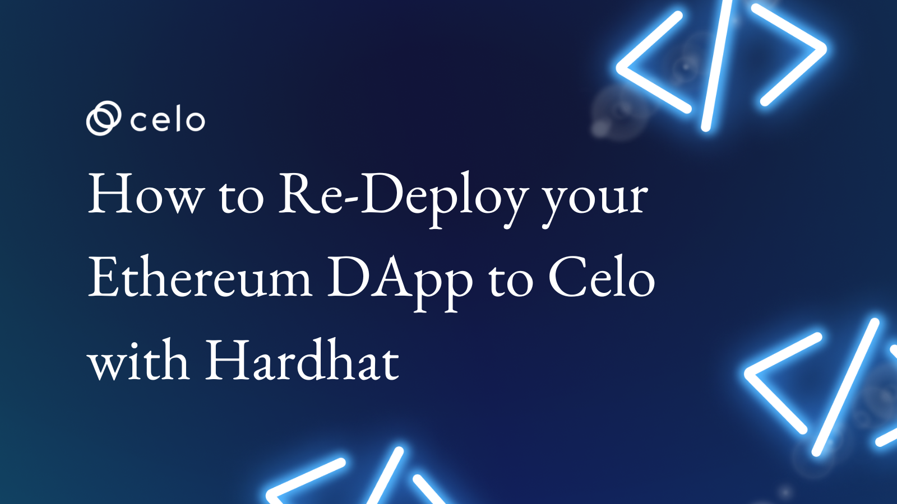

## Introduction

If you're looking to take advantage of the scalability and security of the Celo blockchain, you may be wondering how to redeploy your existing Ethereum DApp to Celo. Re-deploying your DApp to Celo can open up numerous opportunities, allowing you to tap into the growing Celo user base and take advantage of its unique features.

In this article, you will discuss how you can use Hardhat to redeploy your Ethereum DApp to Celo. We'll cover the Hardhat configuration needed to connect to Celo, the differences between deploying to Ethereum and Celo, and any other considerations you should keep in mind when re-deploying your DApp to Celo.

This tutorial will walk you through the process, using a simple solidity CRUD application. By the end of this article, you'll have a better understanding of how to get started with re-deploying your Ethereum DApp to Celo using Hardhat.

## Getting Started

To redeploy your dApp on the Celo blockchain, you will need a sample application to follow along with this tutorial. Run the command `git clone https://github.com/Julius170/Redeploying-on-Celo`.

The sample above dApp is deployed to an Ethereum Testnet Goerli. Once you have your dApp ready locally, you can begin redeploying to Celo mainnet or alfajores by first connecting to the Celo blockchain. Which will require changes in your hardhat.config.js file.

## Connecting to Celo

Connecting to Celo is a powerful way to access the Celo Protocol, an open-source platform that enables anyone to create and manage digital assets on the blockchain. Celo is designed to make it easy to send, receive, and store digital assets on a secure, decentralized platform. It provides users with a wide range of features, such as being able to send payments in any currency and being able to access decentralized applications. With the help of Celo, users can easily connect to the blockchain, allowing them to transact and manage digital assets with ease. In this article, we will discuss how to communicate with Celo and the various features available.

To begin redeployment, the first step is connecting your smart contract’s codebase to the Celo blockchain, and to do that, you’ll need to change the code in your `hardhat.config.js` file.

Copy the code below and paste it inside the `hardhat,config.js` in the main folder of your smart contract codebase file to replace the code in your file:

```javascript
require("@nomiclabs/hardhat-waffle");
require("dotenv").config({ path: ".env" });
require("hardhat-deploy");
 
// You need to export an object to set up your config
// Go to https://hardhat.org/config/ to learn more
 
// Prints the Celo accounts associated with the mnemonic in .env
task("accounts", "Prints the list of accounts", async (taskArgs, hre) => {
  const accounts = await hre.ethers.getSigners();
 
  for (const account of accounts) {
    console.log(account.address);
  }
});
 
/**
 * @type import('hardhat/config').HardhatUserConfig
 */
module.exports = {
  defaultNetwork: "alfajores",
  networks: {
    localhost: {
      url: "http://127.0.0.1:7545",
    },
    alfajores: {
      gasPrice: 200000000000,
      gas: 41000000000,
      // gasLimit: 40000000,
      url: "https://alfajores-forno.celo-testnet.org",
      accounts: {
        mnemonic: process.env.MNEMONIC,
        path: "m/44'/52752'/0'/0",
      },
      chainId: 44787,
    },
    celo: {
      url: "https://forno.celo.org",
      accounts: {
        mnemonic: process.env.MNEMONIC,
        path: "m/44'/52752'/0'/0",
      },
      chainId: 42220,
    },
  },
  solidity: "0.8.10",
};
 

```

Head over to your already created `.env` file and create a variable name `MNEMONIC`. And head over to your preferred wallet to copy your `Mnemonic` key or your recovery phrase. Paste the phrase as the value to the `Mnemonic` variable.

## Redeploying your dApp

Before redeploying, you can recompile your contract by running the command `npx hardhat compile` to ensure your Dapp’s contract code is intact.

Finally, to deploy your dApp, run the command `npx hardhat run scripts/deploy.js --network alffajores`, and if you want to deploy to the Celo mainnet. Run the command `npx hardhat run scripts/sample-script.js --network celo` instead.

And Viola…
In just a few steps you have successfully deployed your Dapp’s, contract code working live on the Celo blockchain.

## Reasons to Redeploy on Celo

Redeploying your dApp on Celo is a great way to take advantage of the many benefits that the Celo platform has to offer. With its secure, fast, and cost-effective infrastructure, Celo provides developers with an ideal environment for deploying their applications.

Here are a few reasons, amongst a lot of others, why you should consider redeploying your dApp on Celo:

1. Scalability: Celo offers high scalability, allowing for faster and more efficient transactions. This makes it ideal for Dapps which require a large number of transactions to be processed quickly.

2. Security: Celo is built on a secure and reliable blockchain platform, making it a safe and secure platform for users.

3. Interoperability: Celo is designed to be interoperable with other blockchains, allowing for easy integration of different applications and services.

4. Decentralization: Celo is a decentralized platform, meaning that any single entity does not control it. This ensures that users have full control over their funds and data.

5. Privacy: Celo offers users the ability to keep their data and transactions private, allowing them to remain anonymous while using the platform.

6. Accessibility: Celo is designed to be accessible to everyone, regardless of their technical knowledge or experience. This makes it easy for anyone to use the platform.

## Conclusion

In conclusion, redeploying your dApp on Celo is a great way to take advantage of the platform's features and benefits. With its low transaction fees, fast transaction times, and secure infrastructure.
Celo provides an ideal environment for deploying and running decentralized applications. The platform's open-source nature and community-driven development make it an attractive option for developers looking to create and deploy their Dapps.

## Next Step

Are you Interested in building, and deploying your Dapps on the Celo blockchain?
Here are some resources you can start working on:

- [Redeploying your dApp on Celo using truffle](https://learn.figment.io/tutorials/redeploy-ethereum-dapps-on-celo),
- [Creating a Crowdfunding contract on Celo](https://www.celosage.com/a-developers-guide-into-building-defi-and-nft-smart-contracts-on-celo/),
- [A Coffee Android app on Celo](https://www.celosage.com/buyme-a-coffee-android-app-using-the-celo-java-sdk/),
- [Build a Donation dApp on Celo](https://www.celosage.com/build-a-donation-dapp-on-celo-to-award-your-favorite-content-creator/),

## About the Author

Mayowa Julius Ogungbola - A Software Engineer and Technical Writer who is always open to working on new ideas. I enjoy working on [GitHub](https://github.com/Julius170/), and you could also find out what I tweet about and connect with me on [LinkedIn](https://www.linkedin.com/in/julius-ogungbola-a71810229/).

## References

Here is a [link](https://github.com/Julius170/Redeploying-on-Celo) to the complete tutorial sample code on my GitHub, Leave a ⭐ on the repository if you find it helpful.
