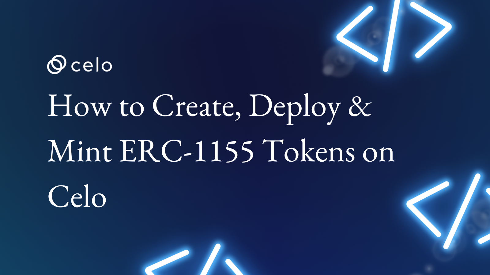

## Introduction

Creating, deploying, and minting ERC-1155 tokens on Celo is an important process that is essential for the success of any token-based project. This article will provide a comprehensive guide on how to use the ERC-1155 token standard using Hardhat on Celo, a blockchain platform that supports smart contract development and asset tokenization.

Through this guide, users will learn how to create a token, deploy it on the blockchain, and mint it so that it can be used for a variety of purposes. Additionally, users will also become familiar with the various tools available to them on the Celo platform.

With a better understanding of the process and tools available, users will be able to create their tokens and take advantage of the features that the ERC-1155 token standard has to offer.

Celo is a decentralized platform that enables fast, secure, and low-cost transactions using stablecoins. It provides an easy-to-use interface and tools for developers to build and deploy decentralized applications (Dapps).  In this article, we will discuss the steps necessary for creating, deploying, and minting ERC-1155 tokens on Celo.

## Prerequisites

Before diving into creating, deploying, and minting ERC-1155 tokens on Celo, it is important to understand the prerequisites for the process. This includes having a basic understanding of the following.

* **Hardhat**: this is an Ethereum development environment that allows developers to compile, deploy and test smart contracts. It provides a suite of tools that make building decentralized applications on the blockchain easier than ever.

* **Solidity** : this is an object-oriented programming language used to create smart contracts. It is designed to target the Ethereum Virtual Machine (EVM) and provides a wide range of features, including inheritance, libraries, and user-defined types.

* **OpenZeppelin**: is an open-source framework for developing and deploying secure smart contracts on Ethereum and other blockchains. It provides a set of tools and libraries that make it easier to write secure and reliable smart contracts.

* **Node Package Manager**: Additionally, it is important to have familiarity with the Node Package Manager (`npm`). `npm` is a package manager for JavaScript and is used for installing, uninstalling, and managing package dependencies in a project.

# Understanding the ERC1155 Token Standard

The ERC-1155 tokens are a new type of token that allows users to easily manage multiple types of tokens in one place, making them ideal for use in various projects.

ERC1155, or the Ethereum Request for Comments 1155, is an Ethereum-based token standard, designed to be versatile, allowing users to perform a variety of different actions with them. Transactions include minting, burning, and transferring tokens between users. This is different from the traditional ERC20 and ERC721 tokens, which are limited in functionality.

The main advantage of ERC1155 tokens is their versatility. For example, a user could mint a token representing an asset, and then use it to create a marketplace for trading the asset.
This is something that would not be possible with other token standards. Additionally, ERC1155 is also more efficient than other token standards, as it allows for multiple token transfers to take place in a single transaction, reducing the amount of gas used.

Furthermore, ERC1155 tokens are also more secure than other token standards. This is because the ERC1155 standard incorporates several security measures, including check-sum protection and hashing. The ERC1155 standard also supports multi-sign transactions, which require multiple users to sign off on a transaction to ensure that it is valid.

In conclusion, the ERC1155 is a versatile, secure, and efficient token standard that provides users with a range of features and capabilities. Its versatility makes it a perfect choice for creating and trading assets, while its security measures protect users from fraudulent activities. It is without a doubt one of the most advanced token standards on the market and is quickly becoming the go-to choice for developers.

# Using the ERC1155 Token Standard

The ERC1155 is a token standard on Ethereum that enables the minting, transferring, and burning of multiple types of digital assets securely and efficiently. This makes it an attractive choice for creating digital assets and tokens on the Blockchain.

The primary use of ERC1155 is to create fungible and non-fungible tokens, such as cryptocurrencies, which are interchangeable, meaning one unit is identical to another. Non-fungible tokens, like collectibles and gaming assets, are unique and therefore the value of each token is determined by its rarity and other characteristics.

By using ERC1155, both types of tokens can be created within the same contract. This makes it easier to create digital assets and manage them more efficiently.

In addition, ERC1155 also supports the creation of atomic swaps, which enable the exchange of multiple types of tokens without requiring a third-party intermediary. This is useful for creating decentralized marketplaces, allowing users to exchange tokens directly with each other.

The ERC1155 are also relatively important in the following areas in the web3 space:

1. Non-Fungible Token (NFT) Marketplace: The ERC1155 token standard enables the creation of a marketplace for non-fungible tokens (NFTs). This allows users to tokenize digital assets such as art, music, videos, and gaming items and buy, sell, and trade them in a secure, trustless environment. This can be done directly or through smart contracts.

2. Decentralized Autonomous Organizations (DAOs): The ERC1155 token standard can be used to create decentralized autonomous organizations (DAOs) that can be used to govern the use of a particular token or project. This allows token holders to have a say in the direction of the project, and vote on important decisions.

3. Gaming Platforms: The ERC1155 token standard can be used to create gaming platforms where users can purchase, trade, and use in-game items and assets. This allows users to partake in decentralized gaming experiences and create a secure environment for trading game items.

4. Tokenized Assets: The ERC1155 token standard can be used to tokenize real-world assets such as art, collectibles, gold, and other tangible items. This allows users to invest in these assets and trade them in a secure, trustless environment.

# Setting up Hardhat

Before getting started with minting your contract, You’ll need to set up hardhat as your Ethereum Development Environment. In the next couple of steps, you will be setting up a Hardhat work environment using `npm` or you're preferred, Package Manager.  

1. Create a workspace directory in your preferred code editor.

2. Go to the terminal of your work environment and run the command `npm init -y`. This will initialize the package manager and create a `package.json` file in preparation before installing hardhat.

3. Next, run the command  `npm install hardhat @nomiclabs/hardhat-waffle @nomicfoundation/hardhat-toolbox @openzeppelin/contracts @nomiclabs/hardhat-waffle`. also, run the command `npm i hardhat-deploy dotenv` on your terminal to install all the required dependencies you'll need for this tutorial.

4. Next, run the command `npx hardhat` to fire up your hardhat development environment. You will be prompted to choose the language you'll be working with.

5. Click enter three times to enable the option `Create a Javascript Project`. and to verify the project location. You will notice a new folder structure on your code editor’s file explorer.

6. Rename the file in your contract folder to `MyToken.sol`, and delete the code inside the file.

7. Copy the code below and replace it with the code inside your `hardhat.config.js` script in the main directory with this;

```javascript
require("@nomiclabs/hardhat-waffle");
require("dotenv").config({ path: ".env" });
require("hardhat-deploy");
 
// You need to export an object to set up your config
// Go to https://hardhat.org/config/ to learn more
 
// Prints the Celo accounts associated with the mnemonic in .env
task("accounts", "Prints the list of accounts", async (taskArgs, hre) => {
  const accounts = await hre.ethers.getSigners();
 
  for (const account of accounts) {
    console.log(account.address);
  }
});
 
/**
 * @type import('hardhat/config').HardhatUserConfig
 */
module.exports = {
  defaultNetwork: "alfajores",
  networks: {
    localhost: {
      url: "http://127.0.0.1:7545",
    },
    alfajores: {
      gasPrice: 1500000000,
      gas: 4100000,
      url: "https://alfajores-forno.celo-testnet.org",
      accounts: {
        mnemonic: process.env.MNEMONIC,
        path: "m/44'/52752'/0'/0",
      },
      //chainId: 44787
    },
    celo: {
      url: "https://forno.celo.org",
      accounts: {
        mnemonic: process.env.MNEMONIC,
        path: "m/44'/52752'/0'/0",
      },
      chainId: 42220,
    },
  },
  solidity: "0.8.10",
};
 
```

8. Now that you have successfully installed and Setup up your hardhat development environment. next you can get started with creating your ERC1155 smart contract.

# Creating an ERC1155 Token Standard Contract

Creating a smart contract on Celo is a straightforward process. It is the first and most important step when minting your own ERC1155 Non-Fungible Token (NFT) on the Celo network.

Although you won't need to create the contract from scratch while importing the standard contract from the remote openzeppelin contract.
The code for an ERC1155 token using the openzepppelin smart contract looks like the below:

```solidity
// SPDX-License-Identifier: MIT
// OpenZeppelin Contracts (last updated v4.8.0) (token/ERC1155/ERC1155.sol)

pragma solidity ^0.8.0;

import "./IERC1155.sol";
import "./IERC1155Receiver.sol";
import "./extensions/IERC1155MetadataURI.sol";
import "../../utils/Address.sol";
import "../../utils/Context.sol";
import "../../utils/introspection/ERC165.sol";


contract ERC1155 is Context, ERC165, IERC1155, IERC1155MetadataURI {
    using Address for address;

    // Mapping from token ID to account balances
    mapping(uint256 => mapping(address => uint256)) private _balances;

    // Mapping from account to operator approvals
    mapping(address => mapping(address => bool)) private _operatorApprovals;

    // Used as the URI for all token types by relying on ID substitution, e.g. https://token-cdn-domain/{id}.json
    string private _uri;

        constructor(string memory uri_) {
        _setURI(uri_);
    }

      function supportsInterface(bytes4 interfaceId) public view virtual override(ERC165, IERC165) returns (bool) {
        return
            interfaceId == type(IERC1155).interfaceId ||
            interfaceId == type(IERC1155MetadataURI).interfaceId ||
            super.supportsInterface(interfaceId);
    }

       function uri(uint256) public view virtual override returns (string memory) {
        return _uri;
    }

      function balanceOf(address account, uint256 id) public view virtual override returns (uint256) {
        require(account != address(0), "ERC1155: address zero is not a valid owner");
        return _balances[id][account];
    }

       function balanceOfBatch(
        address[] memory accounts,
        uint256[] memory ids
    ) public view virtual override returns (uint256[] memory) {
        require(accounts.length == ids.length, "ERC1155: accounts and ids length mismatch");

        uint256[] memory batchBalances = new uint256[](accounts.length);

        for (uint256 i = 0; i < accounts.length; ++i) {
            batchBalances[i] = balanceOf(accounts[i], ids[i]);
        }

        return batchBalances;
    }

      function setApprovalForAll(address operator, bool approved) public virtual override {
        _setApprovalForAll(_msgSender(), operator, approved);
    }

      function isApprovedForAll(address account, address operator) public view virtual override returns (bool) {
        return _operatorApprovals[account][operator];
    }

    
    function safeTransferFrom(
        address from,
        address to,
        uint256 id,
        uint256 amount,
        bytes memory data
    ) public virtual override {
        require(
            from == _msgSender() || isApprovedForAll(from, _msgSender()),
            "ERC1155: caller is not token owner or approved"
        );
        _safeTransferFrom(from, to, id, amount, data);
    }

   
    function safeBatchTransferFrom(
        address from,
        address to,
        uint256[] memory ids,
        uint256[] memory amounts,
        bytes memory data
    ) public virtual override {
        require(
            from == _msgSender() || isApprovedForAll(from, _msgSender()),
            "ERC1155: caller is not token owner or approved"
        );
        _safeBatchTransferFrom(from, to, ids, amounts, data);
    }

       function _safeTransferFrom(
        address from,
        address to,
        uint256 id,
        uint256 amount,
        bytes memory data
    ) internal virtual {
        require(to != address(0), "ERC1155: transfer to the zero address");

        address operator = _msgSender();
        uint256[] memory ids = _asSingletonArray(id);
        uint256[] memory amounts = _asSingletonArray(amount);

        _beforeTokenTransfer(operator, from, to, ids, amounts, data);

        uint256 fromBalance = _balances[id][from];
        require(fromBalance >= amount, "ERC1155: insufficient balance for transfer");
        unchecked {
            _balances[id][from] = fromBalance - amount;
        }
        _balances[id][to] += amount;

        emit TransferSingle(operator, from, to, id, amount);

        _afterTokenTransfer(operator, from, to, ids, amounts, data);

        _doSafeTransferAcceptanceCheck(operator, from, to, id, amount, data);
    }

  
    function _safeBatchTransferFrom(
        address from,
        address to,
        uint256[] memory ids,
        uint256[] memory amounts,
        bytes memory data
    ) internal virtual {
        require(ids.length == amounts.length, "ERC1155: ids and amounts length mismatch");
        require(to != address(0), "ERC1155: transfer to the zero address");

        address operator = _msgSender();

        _beforeTokenTransfer(operator, from, to, ids, amounts, data);

        for (uint256 i = 0; i < ids.length; ++i) {
            uint256 id = ids[i];
            uint256 amount = amounts[i];

            uint256 fromBalance = _balances[id][from];
            require(fromBalance >= amount, "ERC1155: insufficient balance for transfer");
            unchecked {
                _balances[id][from] = fromBalance - amount;
            }
            _balances[id][to] += amount;
        }

        emit TransferBatch(operator, from, to, ids, amounts);

        _afterTokenTransfer(operator, from, to, ids, amounts, data);

        _doSafeBatchTransferAcceptanceCheck(operator, from, to, ids, amounts, data);
    }

  
    function _setURI(string memory newuri) internal virtual {
        _uri = newuri;
    }

       function _mint(address to, uint256 id, uint256 amount, bytes memory data) internal virtual {
        require(to != address(0), "ERC1155: mint to the zero address");

        address operator = _msgSender();
        uint256[] memory ids = _asSingletonArray(id);
        uint256[] memory amounts = _asSingletonArray(amount);

        _beforeTokenTransfer(operator, address(0), to, ids, amounts, data);

        _balances[id][to] += amount;
        emit TransferSingle(operator, address(0), to, id, amount);

        _afterTokenTransfer(operator, address(0), to, ids, amounts, data);

        _doSafeTransferAcceptanceCheck(operator, address(0), to, id, amount, data);
    }

       function _mintBatch(
        address to,
        uint256[] memory ids,
        uint256[] memory amounts,
        bytes memory data
    ) internal virtual {
        require(to != address(0), "ERC1155: mint to the zero address");
        require(ids.length == amounts.length, "ERC1155: ids and amounts length mismatch");

        address operator = _msgSender();

        _beforeTokenTransfer(operator, address(0), to, ids, amounts, data);

        for (uint256 i = 0; i < ids.length; i++) {
            _balances[ids[i]][to] += amounts[i];
        }

        emit TransferBatch(operator, address(0), to, ids, amounts);

        _afterTokenTransfer(operator, address(0), to, ids, amounts, data);

        _doSafeBatchTransferAcceptanceCheck(operator, address(0), to, ids, amounts, data);
    }

       function _burn(address from, uint256 id, uint256 amount) internal virtual {
        require(from != address(0), "ERC1155: burn from the zero address");

        address operator = _msgSender();
        uint256[] memory ids = _asSingletonArray(id);
        uint256[] memory amounts = _asSingletonArray(amount);

        _beforeTokenTransfer(operator, from, address(0), ids, amounts, "");

        uint256 fromBalance = _balances[id][from];
        require(fromBalance >= amount, "ERC1155: burn amount exceeds balance");
        unchecked {
            _balances[id][from] = fromBalance - amount;
        }

        emit TransferSingle(operator, from, address(0), id, amount);

        _afterTokenTransfer(operator, from, address(0), ids, amounts, "");
    }

       function _burnBatch(address from, uint256[] memory ids, uint256[] memory amounts) internal virtual {
        require(from != address(0), "ERC1155: burn from the zero address");
        require(ids.length == amounts.length, "ERC1155: ids and amounts length mismatch");

        address operator = _msgSender();

        _beforeTokenTransfer(operator, from, address(0), ids, amounts, "");

        for (uint256 i = 0; i < ids.length; i++) {
            uint256 id = ids[i];
            uint256 amount = amounts[i];

            uint256 fromBalance = _balances[id][from];
            require(fromBalance >= amount, "ERC1155: burn amount exceeds balance");
            unchecked {
                _balances[id][from] = fromBalance - amount;
            }
        }

        emit TransferBatch(operator, from, address(0), ids, amounts);

        _afterTokenTransfer(operator, from, address(0), ids, amounts, "");
    }

   
    function _setApprovalForAll(address owner, address operator, bool approved) internal virtual {
        require(owner != operator, "ERC1155: setting approval status for self");
        _operatorApprovals[owner][operator] = approved;
        emit ApprovalForAll(owner, operator, approved);
    }

    
    function _beforeTokenTransfer(
        address operator,
        address from,
        address to,
        uint256[] memory ids,
        uint256[] memory amounts,
        bytes memory data
    ) internal virtual {}

        function _afterTokenTransfer(
        address operator,
        address from,
        address to,
        uint256[] memory ids,
        uint256[] memory amounts,
        bytes memory data
    ) internal virtual {}

    function _doSafeTransferAcceptanceCheck(
        address operator,
        address from,
        address to,
        uint256 id,
        uint256 amount,
        bytes memory data
    ) private {
        if (to.isContract()) {
            try IERC1155Receiver(to).onERC1155Received(operator, from, id, amount, data) returns (bytes4 response) {
                if (response != IERC1155Receiver.onERC1155Received.selector) {
                    revert("ERC1155: ERC1155Receiver rejected tokens");
                }
            } catch Error(string memory reason) {
                revert(reason);
            } catch {
                revert("ERC1155: transfer to non-ERC1155Receiver implementer");
            }
        }
    }

    function _doSafeBatchTransferAcceptanceCheck(
        address operator,
        address from,
        address to,
        uint256[] memory ids,
        uint256[] memory amounts,
        bytes memory data
    ) private {
        if (to.isContract()) {
            try IERC1155Receiver(to).onERC1155BatchReceived(operator, from, ids, amounts, data) returns (
                bytes4 response
            ) {
                if (response != IERC1155Receiver.onERC1155BatchReceived.selector) {
                    revert("ERC1155: ERC1155Receiver rejected tokens");
                }
            } catch Error(string memory reason) {
                revert(reason);
            } catch {
                revert("ERC1155: transfer to non-ERC1155Receiver implementer");
            }
        }
    }

    function _asSingletonArray(uint256 element) private pure returns (uint256[] memory) {
        uint256[] memory array = new uint256[](1);
        array[0] = element;

        return array;
    }
}
```

***Note: Do not copy the code above into your contract file since you can import it directly from openzeppelin instead***.

* This code below is a Solidity contract for an ERC1155 token, that allows for fractional ownership of a digital asset. The code defines two constants, `PHENZIC000` and `PHENZIC001`, with each representing a type of token. It also includes a `constructor`, which is called when the contract is deployed.
* In this constructor, the sender is given `200` `PHENZIC000` tokens and `100` `PHENZIC001` tokens.
* Finally, the code includes a function, `uri()`, which returns a URI string for a given token ID. This URI string can be used to access the token's associated digital asset.

```solidity
// SPDX-License-Identifier: MIT
pragma solidity ^0.8.0;
 
import "@openzeppelin/contracts/token/ERC1155/ERC1155.sol";
import "@openzeppelin/contracts/utils/Strings.sol";
 
contract MyToken is ERC1155 {
    uint256  constant PHENZIC000 = 0;
    uint256  constant PHENZIC001 = 1;
 
    constructor() public ERC1155("https://bafybeiaqqz4unoubpu2oz2rsgowh3irdqnpcqjoyspzwrepnrwql7rgvy4.ipfs.nftstorage.link/"){
        _mint(msg.sender, PHENZIC000, 200, "");
        _mint(msg.sender, PHENZIC001, 100, "");
    }
 
    function uri(uint256 _tokenId) override public pure returns (string memory) {
        return string(abi.encodePacked("https://bafybeiaqqz4unoubpu2oz2rsgowh3irdqnpcqjoyspzwrepnrwql7rgvy4.ipfs.nftstorage.link/PHENZIC00",Strings.toString(_tokenId),".jpeg")
        );
    }
}
```

Copy and paste the code above into your `MyToken` contract file.

Using the smart contract above your, Your NFT will have all the required functionalities of an ERC1155 token standard.
Next, you will learn how to deploy the ERC115 token, and how to deploy and mint to the Celo blockchain.

# Deploying and Minting the Token Contract

In the next few steps, you will be using Hardhat’s built-in CLI to deploy your ERC115 Token.

1. First, create a new file and name the file `.env` and create a variable name `MNEMONIC`

2. Now login to your preferred wallet extension on your browser to get your wallet `MNEMONIC`, and copy the entire phrase.

***Note: Your wallet MNEMONICS is the same as the key phrase given to you when you initially signed up for an account on your wallet, Its usually ranges from 12 to 18 random words for verifying your ownership like a passphrase***.

3. Paste the `MNEMONIC` phrase as the value for the variable `MNEMONIC` inside your `.env` file.

***Note: Your `MNEMONICS` should be kept secret and secure (Not public) at all points. DO NOT REVEAL this phrase at all times. No quotes should be added***.

4. Next, Head over to the `deploy.js` script in your `scripts` folder and copy the deploy script below to replace the existing code in the `deploy` script.

```javascript
const hre = require("hardhat");
 
const main = async () => {
  const MyToken = await hre.ethers.getContractFactory("MyToken");
  const Token = await MyToken.deploy();
 
  await Token.deployed();
 
  console.log("The MyToken contract was deployed to: ", Token.address);
};
 
const runMain = async () => {
  try {
    await main();
    process.exit(0);
  } catch (error) {
    console.error(error);
    process.exit(1);
  }
};
 
runMain();
 
```

5. Now run the command `npx hardhat compile` and your contract should be compiled without any error, with the result like the image below:


***Note: If your statement returns `compiles 3 solidity files successfully`, you’re still on track***.

6. Finally, run the command `npx hardhat deploy scripts/deploy.js`, and a successful execution should return a result similar to the image below:


***Note: Copy the contract address returned and save it, you will need it to interact with your deployed contract later***.

7. Since the `_mint` function is called inside your constructor function with the required inputs, receive’s `address`, token `symbol`, `amount`, and the `description`. On deployment the two ERC1155 token contracts `PHENZIC000` AND `PHENZIC001` are minted automatically.

# Interacting with deployed ERC1155 Token

To verify that your token has been minted and is available on the celo blockchain, you can call any function, like transferring, your token or checking your token balance.

In the next few steps, you will learn how to interact with your token live on the Celo blockchain using the Hardhat console:

* To begin interacting with your token contract on the Celo blockchain, run the command `npx hardhat console`. You should notice a prompt-like arrow `>` to input any statement.
* Now copy and paste the line of code `const MyToken = await ethers.getContractFactory("MyToken")`, and click enter to get the contract factory and assign it to the variable `MyToken`.
* Next copy and paste the line `const token = await MyToken.attach("0x8B34A555B17dCeA818C4C69b19f4A4145413B2f3")`, and click enter.

After running the above codes on the hardhat console, you should have a similar response to the image below:


***Note: you should use the address of your deployed contract, the same address that was returned when you deployed the contract***.

a. First, to call the `uri` function you will need to pass in the index of any token, and it will return the URL to the token on IPSF.
Run the line `await token.uri(0)` or `await token.uri(1)`, and click enter. The result should be similar to the image below.


b. To check the balance of any of the tokens enter the lines of code `await token.balanceOf("0x9A11d5a704038BF7735dCE5Bbc71621da7052395", 0)`, for the first token or `await token.balanceOf("0x9A11d5a704038BF7735dCE5Bbc71621da7052395", 1)`, for the second token. And you should have a similar result to the image below.


***Note: you should pass in the address of the account you used to sign and deploy the contract, which is also the owner of the contract, and the token address, the `msg.sender` address***.

c. To send your tokens to any wallet address you can call the `safeTransferFrom` function, and pass in the following input. `from` address, `to` address, the `token_id` of the token you want to send, the `amount` you want to send and for the data put in the value `0x00`. For example `await token.safeTransferFrom("0x9A11d5a704038BF7735dCE5Bbc71621da7052395","0x8056c7C6B8a3a81bc4CbAf317973ce7f9Cbc747F",0,50,0x00)`. Or `await token.safeTransferFrom("0x9A11d5a704038BF7735dCE5Bbc71621da7052395","0x8056c7C6B8a3a81bc4CbAf317973ce7f9Cbc747F",1,50,"0x00")`

d. You can check the remaining balance of the token and you’ll notice the reduction in the token amount. Run the command `await token.balanceOf("0x9A11d5a704038BF7735dCE5Bbc71621da7052395", 0)` or `await token.balanceOf("0x9A11d5a704038BF7735dCE5Bbc71621da7052395", 0`. You should have a result similar to the image below with the remaining balance after subtracting the amount you sent.

## Conclusion​

In conclusion, creating, deploying, and minting ERC-1155 tokens on Celo using Hardhat is a relatively simple process.
With just a few steps, you can quickly create your unique tokens and use them to power your projects. The process is easy to follow, and the Hardhat frameworks make it easy to use.

By leveraging the power of the Ethereum blockchain, you can create and deploy your tokens with minimal effort. And with the help of Hardhat, you can easily create and deploy your tokens on the Celo network. This can open up a whole new world of opportunities for you as a developer to create your projects and monetize your efforts.

## About the Author

Mayowa Julius Ogungbola

is a Software Engineer and Technical writer always open to working on new ideas. I enjoy working on [GitHub](https://github.com/Julius170/) and you could also find out what I tweet about and connect with me on [LinkedIn](https://www.linkedin.com/in/julius-ogungbola-a71810229/).

## Next Steps​

Here are some other NFT-related tutorial articles you might be interested in:

* [How to Build an NFT Collection on Celo](https://www.celosage.com/how-to-quickly-build-an-nft-collection-on-celo/)
* [How to Deploy an ERC721 Smart Contract using Tatum API](https://www.celosage.com/how-to-deploy-an-erc721-smart-contract-using-the-tatum-api/)
* [How to Mint your ERC1155 token on Celo](https://www.celosage.com/how-to-mint-your-own-erc1155-nft-on-celo/)
* [How to redeploy your Ethereum Dapp on Celo with hardhat](https://www.celosage.com/how-to-re-deploy-your-ethereum-dapp-to-celo-with-hardhat/)

## References

Here are links to some video tutorials you might be interested in following along with while reading this tutorial:

* [Uploading your NFTs to IPFS](https://www.youtube.com/watch?v=_8c9FJ7W-jE)
* [Publishing your Minted NFTs on Opensea](https://www.youtube.com/watch?v=J4p1sdo3Rz4&t=749s)
* [Minting your ERC1155 contract on Remix](https://www.youtube.com/results?search_query=how+to+mint+an+ERC1155+token+standard+on+remix)
* [Build and deploy smart contracts using hardhat](https://www.youtube.com/watch?v=GBc3lBrXEBo)
* [How to deploy an ERC1155 contract](https://www.youtube.com/watch?v=OQRByaENqOA)
