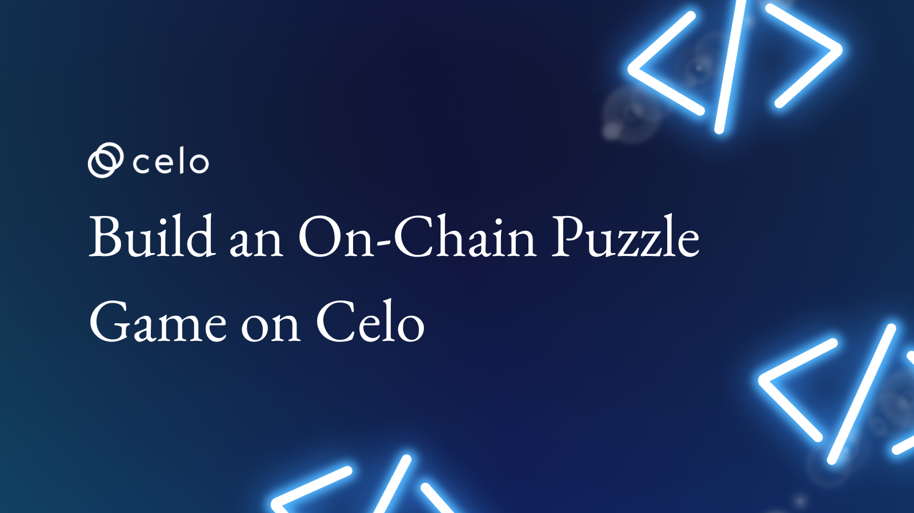
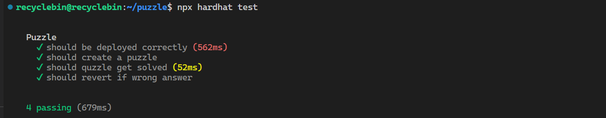
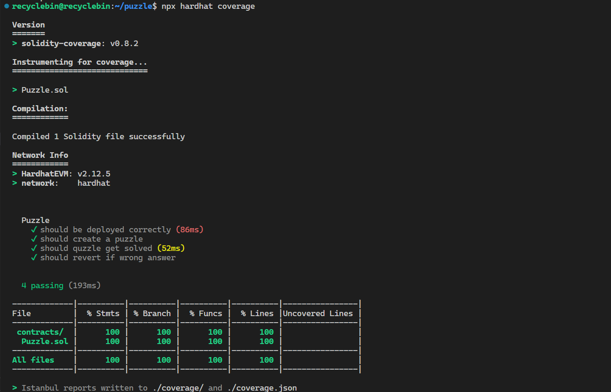

## Introduction

In this tutorial, we will be building a puzzle game where the solution to each game will be hashed and stored on the blockchain. This tutorial is designed to teach you about Solidity development, testing, and deployment, as well as how hashing works. Let's get started!

## Prerequisites

To follow this tutorial, it is recommended that you have a basic understanding of Solidity and JavaScript. If you are already familiar with the Hardhat, that will be helpful, but if not, don't worry—we will cover a few things about Hardhat in this tutorial as well. Having some familiarity with these technologies will make it easier for you to understand and follow along with the tutorial, but even if you are new to Solidity and JavaScript, you should still be able to follow along and learn a lot from this tutorial.

## Requirements

To follow this tutorial, you will need to have the latest version of Node.js installed on your machine.  In this tutorial, we will be using Node.js to run and test our Solidity code, so it is important that you have it installed on your machine. To check if you have installed Node.js installed on your machine, you can run following command in terminal:

```jsx
node -v
```

If you don't have Node.js installed, you can download it from the [official website](https://nodejs.org/) and follow the instructions provided there to install it on your machine. Once you have Node.js installed, you will be ready to follow along with this tutorial.

## How the Puzzle Game Works

In our puzzle game, there will be two types of people: creators and players. Creators will be responsible for creating puzzles, while players will try to solve the puzzles that have been created. When a creator creates a puzzle, they will provide a question or hint for the puzzle, as well as the hashed answer, which will be stored on-chain. To hash the answer, the creator will use a hashing function on their own machine, and then push the hashed answer to the smart contract. When a player wants to solve a puzzle, they can submit their guess to the smart contract, which will then hash the guess and compare it to the stored hashed answer for that puzzle. If the hashes match, the player's guess is correct, and they have successfully solved the puzzle.

## Understanding Hashing and Its Role in the Puzzle Game

Hashing is a process of generating a fixed-size output (called a hash or hash value) from a variable-size input (such as a message or a file). The input data is processed through a mathematical algorithm (called a hash function) that produces a unique, fixed-size output. The output of a hash function is often referred to as a "digest" or a "fingerprint" of the input data, as it is unique to that specific input and can be used to identify it.

In our puzzle game, we will be using hashing to store the solutions to the puzzles on the blockchain. When a creator creates a puzzle, they will provide the question or hint for the puzzle, as well as the answer. The answer will be hashed using a function called `keccak256` and the resulting hash will be stored on the blockchain along with the question or hint.

When a player wants to solve the puzzle, they can submit their guess to the smart contract, which will then hash the guess and compare it to the hashed answer stored on the blockchain. If the hashes match, the player's guess is correct and they have successfully solved the puzzle.

Hashing is useful in this context because it allows us to store the solution to the puzzle on the blockchain in a secure and tamper-proof way. Since the hash function is deterministic and collision-resistant, it is very difficult for an attacker to forge or manipulate the solution without being detected. This ensures that the puzzle game is fair and transparent for all players.

## Setting Up the Hardhat Project

To set up a new Hardhat project for this tutorial, you will need to create a folder called "Puzzle" and open it in a code editor such as Visual Studio Code. Once you have the folder open, you can use the terminal to run the following command:

```bash
npx hardhat .
```

This command will set up a new hardhat project in the current directory (the "." indicates the current directory). It will create the necessary files and directories for your project, such as a `package.json` file and a `contracts` directory for storing your Solidity code.

To check the test coverage of our smart contract, we will install the `solidity-coverage` plugin. To install the plugin, run the following command in the terminal:

```bash
npm install --save-dev solidity-coverage
```

To use the `solidity-coverage` plugin, we will need to modify the `hardhat.config.js` file by adding the following line:

```jsx
require('solidity-covergae')
```

Once the hardhat project has been set up, you will need to remove all the files from the `contracts` and `test` directories. Then, you can create a new Solidity file called `Puzzle.sol` in the `contracts` directory, and a new test file called `puzzle.test.js` in the `test` directory. These files will be used to develop and test your puzzle game smart contract. After creating these files, you should be ready to start coding your smart contract.

## Writing the Puzzle Game Smart Contract

To begin writing the smart contract for the puzzle game, we will open `Puzzle.sol` and write our code in it. First, we will specify the license under which the code is released and the version of Solidity that the code is compatible with using the "pragma" directive. Then, we will define an empty smart contract called `Puzzle`, where we will implement all of the functions for our game.

```solidity
// SPDX-License-Identifier: MIT
pragma solidity ^0.8.17;

contract Puzzle {

}
```

In order to store all of the details of each puzzle in the smart contract, we will create a mapping called `puzzles` that will store all of the puzzles. To store the details of a puzzle, we will use a struct called `puzzle` that contains three fields: `clue`, `answer`, and `solved`. The `puzzles` mapping will have a key of type `uint256` that represents the index of a puzzle, and a value of type `puzzle` that represents the details of the puzzle. We will use a variable called `puzzleCounter` to track the index of each new puzzle that is added to the `puzzles` mapping. This allows us to efficiently store and retrieve the details of each puzzle in the smart contract.

```solidity
    struct puzzle {
        bytes32 clue;
        bytes32 answer;
        bool solved;
    }

    mapping(uint256 => puzzle) public puzzles;

    uint256 public puzzleCounter;
```

In order to keep track of important events in the puzzle game, we will define two events in our contract: `newPuzzle` and `solved`. The `newPuzzle` event will be emitted whenever a new puzzle is created, and it will contain the address of the creator and the index of the new puzzle as arguments. The `solved` event will be emitted whenever a puzzle is solved, and it will contain the address of the solver and the index of the solved puzzle as arguments. These events can be used to trigger external actions or to provide information about the state of the game to interested parties.

```solidity
    event newPuzzle( address creator, uint256 index);
    event solved( address solver, uint256 index);
```

To create a new puzzle, we will write a function called `createPuzzle` with `public` visibility. The function will take two arguments: `clue` and `answer`, both of which are of type `bytes32`. The `clue` argument will represent the clue for the puzzle, and the `answer` argument will represent the hashed answer for the puzzle.

Inside the function, we will access the `puzzles` mapping using the current value of `puzzleCounter` as the key, and assign it a new puzzle using the `puzzle` struct, passing in the clue and answer arguments from the function parameters and setting the solved status to `false` to indicate that the puzzle has not yet been solved.

After creating the puzzle, we will emit the `newPuzzle` event, passing in the address of the creator and the index of the new puzzle as arguments. Finally, we will increment the `puzzleCounter` variable to keep track of the number of puzzles that have been created and to use it as the index for the next puzzle.

```solidity
    function createPuzzle(bytes32 clue, bytes32 answer) public  {
        puzzles[puzzleCounter] = puzzle(clue, answer, false);
        emit newPuzzle(msg.sender, puzzleCounter);

        puzzleCounter++;
    }
```

In order to allow players to solve a particular puzzle, we will write a function called `solvePuzzle` with `public` visibility. The function will take two arguments: `index` and `guess`, where `index` is of type `uint256` and represents the index of the puzzle, and `guess` is of type `string` with a storage location of `calldata` and represents the guess submitted by the player.

Inside the function, we will create a variable called `_puzzle` of type `puzzle` with a storage location of `storage`, and assign it the value of the puzzle at the given `index` in the `puzzles` mapping. We will use the `require` function to check if the puzzle has already been solved by checking if the `solved` flag is `false`. If the puzzle has already been solved, the function will throw an error with the message `ALREADY_SOLVED`.

To check if the submitted answer is the same as the stored answer, we will first pass the `guess` argument to the `abi.encodePacked` function to format it. We will then use the `keccak256` function to hash the output of the `abi.encodePacked` function. This way, we can compare the hashed guess with the stored answer. If the hashed guess is the same as the stored answer, we will set the `solved` flag to `true`, emit the `solved` event with the address of the solver and the index of the puzzle as arguments, and return the string `RIGHT_ANSWER`. If the hashed guess is not the same as the stored answer, we will simply return the string `WRONG_ANSWER`.

```solidity
    function solvePuzzle(
        uint256 index,
        string calldata guess
    ) public returns (string memory) {
        puzzle storage _puzzle = puzzles[index];

        require(_puzzle.solved != true, "ALREADY_SOLVED");

        if (_puzzle.answer == keccak256(abi.encodePacked(guess))) {
            _puzzle.solved = true;
            emit solved(msg.sender, index);
            return "RIGHT_ANSWER";
        } else {
            return "WRONG_ANSWER";
        }
    }
```

## Testing the Puzzle Smart Contract

To test the smart contract, we need to import certain functions and libraries that will allow us to interact with the contract and perform various checks. At the top of the file `puzzle.test.js`, we can start by importing the following:

1. **`loadFixture`** from **`@nomicfoundation/hardhat-network-helpers`**: This function allows us to easily load and deploy our contract during the testing process.
2. **`expect`** from **`chai`**: This function provides a way to make assertions about the contract's behavior and state.
3. **`utils`** from **`ethers`**: This library provides utility functions for working with Ethereum data types, such as converting between hexadecimal and string values.
4. **`ethers`** from **`hardhat`**: This library provides functions for interacting with the contract and the Ethereum network during the testing process.

After importing these libraries and functions, we can begin writing our test cases.

```jsx
const {
    loadFixture
} = require("@nomicfoundation/hardhat-network-helpers");
const { expect } = require("chai");
const { utils } = require("ethers");
const { ethers } = require("hardhat");
```

To set up the tests for the Puzzle contract using Hardhat, we will first create a describe block with the name "Puzzle" and define a function called `contractFixture` within it. The `contractFixture` function will be responsible for setting up the test environment and returning the necessary objects to the test cases.

Within the `contractFixture` function, we will use the `ethers` object from the `hardhat` package to get the signer accounts and the contract factory for the `Puzzle` contract.

Next, we will use the contract factory to deploy an instance of the `Puzzle` contract and wait for it to be deployed. Finally, we will return an object containing the signer accounts and the deployed contract instance to the test cases.

```jsx
describe('Puzzle', () => {
    async function contractFixture() {
        const accounts = await ethers.getSigners();

        const PUZZLE = await ethers.getContractFactory("Puzzle");
        const puzzle = await PUZZLE.deploy();
        await puzzle.deployed();

        return { accounts, puzzle };
    }
    //--------------- All tests will go below this ------------------------------

    //------------------End of the tests ----------------------------------------

})
```

To test the smart contract in hardhat, we will create a describe block called "Puzzle" and inside it, we will use the **`it`** function to define individual tests. Each test will start by calling the **`loadFixture`**
 function from the **`@nomic-foundation/hardhat-network-helpers`** library. This function will setup the contract and accounts for the test. We can then use the returned object to interact with the contract and make assertions about the expected behavior. To make assertions, we will use the **`expect`**
 function from the **`chai`** library. After setting up the conditions for the test, we will check if we get the expected output by calling various methods on the contract and making assertions about their return values or emitted events.

For our first test, we will verify that the contract was deployed correctly by checking if the **`puzzleCounter`** variable has been initialized to 0.

```jsx
    it("should be deployed correctly", async () => {
        const { puzzle } = await loadFixture(contractFixture);

        expect(await puzzle.puzzleCounter()).to.be.equal(0);
    })
```

In the second test, we will check the functionality of the **`createPuzzle`** function. To do this, we will create a new puzzle and check if the **`newPuzzle`** event is emitted and the **`puzzleCounter`** increases by 1. We will also check if the values for the puzzle are correctly stored in the **`puzzles`** mapping.

```jsx
    it("should create a puzzle", async () => {
        const { accounts, puzzle } = await loadFixture(contractFixture);

        const answer = ethers.utils.id("sun");
        const clue = ethers.utils.formatBytes32String("I wake up everyone, who am I")

        expect(await puzzle.createPuzzle(clue, answer)).to.emit(puzzle, "newPuzzle").withArgs(`${accounts[0].address}`, 0)
        expect(await puzzle.puzzleCounter()).to.be.equal(1);

        const _puzzle = await puzzle.puzzles(0);

        expect(_puzzle.clue).to.be.equal(clue);
        expect(_puzzle.solved).to.be.false;
    })
```

The third test will test the functionality of the `solvePuzzle` function. This test will verify that the `solved` event is emitted with the correct arguments and that the `solved` flag for the puzzle is set to `true` after it is solved.

```jsx
    it("should quzzle get solved", async () => {
        const { accounts, puzzle } = await loadFixture(contractFixture);

        const answer = ethers.utils.id("sun");
        const clue = ethers.utils.formatBytes32String("I wake up everyone, who am I")

        await puzzle.createPuzzle(clue, answer);

        const result = await puzzle.solvePuzzle(0, 'sun');
        expect(result).to.be.emit(puzzle, "solved").withArgs(`${accounts[0].address}`, 0);

        const _puzzle = await puzzle.puzzles(0);

        expect(_puzzle.solved).to.be.true;
        await expect(puzzle.solvePuzzle(0, 'sun')).to.be.revertedWith("ALREADY_SOLVED");
    })
```

The last test will check that the `solvePuzzle` function correctly reverts when an incorrect answer is submitted.

```jsx
    it("should revert if wrong answer", async () => {
        const { puzzle } = await loadFixture(contractFixture);

        const answer = ethers.utils.id("sun");
        const clue = ethers.utils.formatBytes32String("I wake up everyone, who am I")

        await puzzle.createPuzzle(clue, answer);

        expect(await puzzle.solvePuzzle(0, 'dogs')).to.be.revertedWith('WRONG_ANSWER');
    })
```

To run the tests in hardhat, you have run the following command in the terminal to run the tests:

```bash
npx hardhat test
```

The test results should be displayed in the terminal should look similar to following:



## Coverage of Smart Contract Tests

To check the coverage of our smart contract using the `solidity-coverage` plugin, run following command in terminal:

```jsx
npx hardhat coverage
```

You should see report line this in the terminal:



This command will run all of the tests in your project and generate a coverage report that shows which lines of code were covered by the tests. The report will also be saved in the **`coverage`** folder of your project and can be viewed by opening the **`index.html`** file in a web browser.

## Conclusion

In this tutorial, we learned about hashing and how it can be used in smart contracts. We implemented this concept using the `keccak256` function in our puzzle smart contract. We then wrote tests to ensure that the contract was functioning correctly. Overall, this tutorial provided a great introduction to hashing and its practical application in Solidity.

## Next Steps

In this tutorial, we not only learned about the concept of hashing in general, but we also implemented it using the `keccak256` function in our puzzle game smart contract. However, there are other ways to implement hashing in smart contracts, such as using the `sha256` function or creating a custom hashing function. It would be interesting to explore these other options and compare their benefits and drawbacks.

Additionally, although we have tested our puzzle game contract and achieved 100% test coverage, there may be other tests that could be added to further improve the robustness of our tests. Some ideas could include testing edge cases, such as trying to solve a puzzle with a very long or very short answer, or testing the contract's behavior when there are a large number of puzzles in the mapping. By adding these additional tests, we can increase our confidence in the contract's correctness and ensure that it is working as expected.

## About the Author

Nikhil Bhintade is the author of the article. Nikhil is currently working as a product manager/technical writer and is actively seeking new opportunities in this field. He enjoys writing about cutting-edge technology and the things he is learning. You can see his most recent work on [GitHub](https://github.com/nikbhintade). You can also connect with Nikhil on [Linkedin](https://linkedin.com/in/nikbhintade). If you have any questions or ideas, feel free to send Nikhil a message on LinkedIn.

## References

You can find all the code for this tutorial on the provided link. Additionally, you can learn more about the concept of hashing and the specific function of keccak256 on the provided resources.

Puzzle Game Project: [Project Repo](https://github.com/nikbhintade/puzzle-celo)

Hashing: [What is Hashing Algorithm & How Does It Work?](https://aboutssl.org/what-is-hashing-algorithm-how-does-it-work/)

Keccak256 Algorithm: [Hashing Functions In Solidity Using Keccak256](https://medium.com/0xcode/hashing-functions-in-solidity-using-keccak256-70779ea55bb0)
