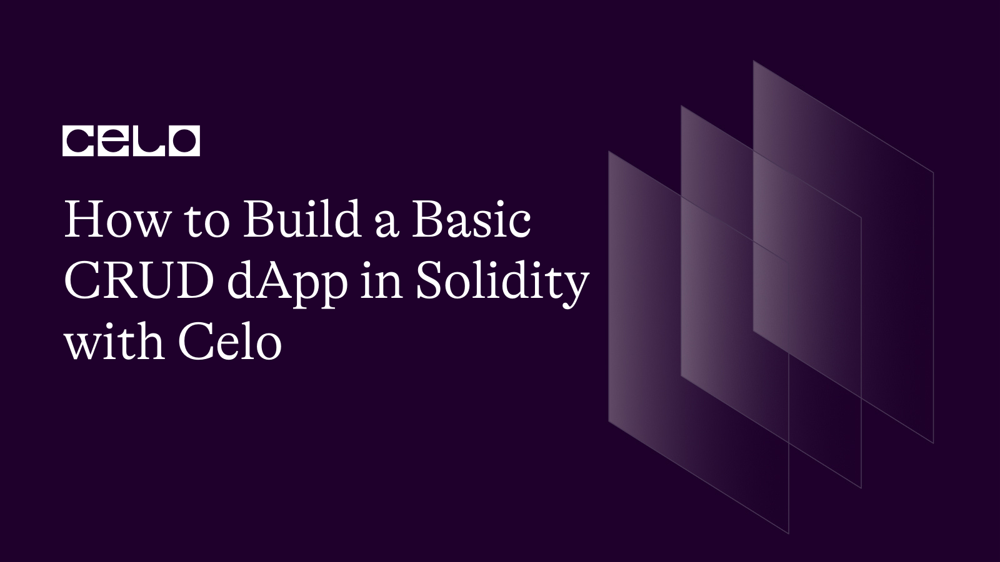

## Introduction

Ever pondered the process of developing a blockchain application? With Ethereum Virtual Machine (EVM), smart contracts are the foundation. This post will teach you how to create a basic Create, Read, Update and Delete (CRUD) smart contract and test it with the Truffle framework. Our smart contract will carry out the crucial create, read, update, and delete (CRUD) actions. We'll concentrate on Solidity-based smart contracts.

## Prerequisites

The following software and packages are required for this tutorial:

• Node.js and the npm package manager. To verify that they are installed, we use the commands node -v && npm -v. We can also install them from here.

• We can also use Yarn, another package manager.

• A smart-contract compiler and an Ethereum blockchain
Web3.js is a JavaScript communication library.

## What is a smart contract?

A smart contract is simply a code that controls some digital assets. It's like a traditional contract, which defines rules for transferring assets and penalties. The best part is that it automatically performs these transfers and penalties based on pre-programmed conditions, eliminating the need for an intermediary.

Smart contracts allow for trusted transactions and agreements to be carried out between disparate, anonymous parties without the need for a centralized authority, legal system, or external enforcement mechanism.

Developers can use smart contracts to create a wide range of decentralized apps and tokens. They're used in everything from new financial tools to logistics and gaming experiences, and they're stored on a blockchain just like any other cryptocurrency transaction. Once a smart-contract app is added to the blockchain, it cannot be changed or reversed.

## What is Solidity?

Solidity is one of the most well-known programming languages for creating smart contracts on Ethereum. It is intended for the creation of smart contracts. It has a syntax similar to javascript. Solidity allows you to create contracts for voting, crowdfunding, blind auctions, and multi-signature wallets.

## Creating Smart Contracts

To begin creating smart contracts, we must first create a project directory in which all Solidity files will be stored. Create one with the name crud-app and navigate to it in the terminal with `cd crud-app.`

Our project is currently empty. We'll need some boilerplate code to work with it. For example, if we want to build the UI in React, we must first install React.

Truffle already offers some packages known as boxes. These packages include Truffle, Ganache, React, Web3, and Redux frameworks, as well as one for Vue.js developers. They work together to complete the entire application development process, from client UI to blockchain smart contracts.

This article will make use of Truffle's React box

Installing React Box

Run the following command to install the React box:

`$ yarn truffle unbox react`

Web3.js, React, Ganache CLI, Truffle, and Ethereum will be installed.

This tutorial will not concentrate on React or a browser-based UI. Instead, we'll create the smart contracts and manage them solely through the terminal.

The client is a React project folder where we can design the application's user interface. The compiled smart contracts in JSON format are kept in a folder called `client/src/contracts`. When we compile our smart contracts, these files are generated. They include the ABI, bytecode, and other data.

```json
[
  {
    "inputs": [],
    "name": "last_completed_migration",
    "outputs": [
      {
        "internalType": "uint256",
        "name": "",
        "type": "uint256"
      }
    ],
    "stateMutability": "view",
    "type": "function",
    "constant": true
  },
  {
    "inputs": [],
    "name": "owner",
    "outputs": [
      {
        "internalType": "address",
        "name": "",
        "type": "address"
      }
    ],
    "stateMutability": "view",
    "type": "function",
    "constant": true
  },
  {
    "inputs": [
      {
        "internalType": "uint256",
        "name": "completed",
        "type": "uint256"
      }
    ],
    "name": "setCompleted",
    "outputs": [],
    "stateMutability": "nonpayable",
    "type": "function"
  }
]
```

As previously stated, client/src/contracts is configured to hold compiled code. The development network is configured to use port 8545. This is the port on which Ganache is running on this computer.

If you look at the top where we installed Ganache, you'll notice that it was using the port 7545, but this one is using 8545 because 7545 is already in use by our installed Ganache. If you change this port to 7545, Truffle will use the Ganache and accounts we installed rather than the one provided by the box. I'll keep it at 8545.

## Building a smart contract with CRUD operations

It's now time to write some code. We will perform CRUD operations as well as manage a number of technologies.

Our application will display a list of various technologies. The technologies can be added, updated, and deleted.

If you've previously created apps, we'll use a method you're probably familiar with:
Create an array to hold the names of technologies
Create a function to push a new value to the array
Create a function to change the value at a given index
Create a function to delete a value
Create a function to return the array

Alright! Let’s jump into solidity

Make a new file called Techs.sol in the contracts directory. We'll begin the file by stating the license and Solidity version that we support:

```solidity
//SPDX-License-Identifier: MIT

pragma solidity >=0.4.22 <0.9.0;
```

Next, declare the contract scope in which we will write all of the code:

```solidity

// SPDX-License-Identifier: MIT

pragma solidity >=0.4.22 <0.9.0;

contract Techs {}
```

Create an array to hold the tech stacks:

```solidity
// SPDX-License-Identifier: MIT

pragma solidity >=0.4.22 <0.9.0;

contract Techs{
  string [] myTechs;
}
```

This is a string array with a private modifier, which means it cannot be accessed outside of the contract; thus, we cannot directly change the value.

Next, Create a function to add a new value:

In the code snippet below, we defined a function called addTech, which takes a string as a parameter, techName. This is made public so that the UI or terminal can use it. We simply push the value to the array in the function body.

Update the value:

```solidity
// SPDX-License-Identifier: MIT
pragma solidity >=0.4.22 <0.9.0;

contract Techs{
    string [] myTechs;

    function addTech(string memory techName) public {
        myTechs.push(techName);
    }

  function updateTech(uint techIndex, string memory newTechName) public returns (bool) {
      if(myTechs.length > techIndex){
          myTechs[techIndex] = newTechName;
          return true;
      }
      return false;
  }
}

```

The updateTech function takes two arguments, techIndex and newTechName, and returns a boolean value. It works as follows: if the index is outside the bounds of the array, it returns false. Otherwise, it replaces the array's value with a new provided fruit name at the specified index and returns true.

Next up is to create the delete function:

```solidity
// SPDX-License-Identifier: MIT
pragma solidity >=0.4.22 <0.9.0;

contract Techs{
    string [] myTechs;

    function addTech(string memory techName) public {
      myTechs.push(techName);
  }

  function updateTech(uint techIndex, string memory newTechName) public returns (bool) {
      if(myTechs.length > techIndex){
          myTechs[techIndex] = newTechName;
          return true;
      }
      return false;
  }

  function deleteTech(uint techIndex) public returns (bool) {
      if(myTechs.length > techIndex){
          for(uint i=techIndex; i < myTechs.length-1; i++){
              myTechs[i] = myTechs[i+1];
          }
          myTechs.pop();
          return true;
      }
      return false;
  }
}
```

The index out-of-bounds condition is checked here, and the array is updated by replacing the value with the next value from the provided index. The value of the provided index will be lost in this manner. Finally, we extract the last value and return true.

The last step is to return the array. To read all the values of the array:

```solidity
// SPDX-License-Identifier: MIT

pragma solidity >=0.4.22 <0.9.0;

contract Techs{
    string [] myTechs;

    function addTech(string memory techName) public {
      myTechs.push(techName);
  }

  function updateTech(uint techIndex, string memory newTechName) public returns (bool) {
      if(myTechs.length > techIndex){
          myTechs[techIndex] = newTechName;
          return true;
      }
      return false;
  }

  function deleteTech(uint techIndex) public returns (bool) {
      if(myTechs.length > techIndex){
          for(uint i=techIndex; i < myTechs.length-1; i++){
              myTechs[i] = myTechs[i+1];
          }

          myTechs.pop();
          return true;
      }
      return false;
  }

  function getTechs() public view returns (string[] memory) {
      return myTechs;
  }
}
```

## Compiling smart contracts using Truffle

Now that we've finished coding our smart contract, we'll use Truffle to compile it. But first, we need to make a migration file to tell Truffle that we want to move this to the chain.

If we look in the migration folder, we'll find the following JavaScript file:

Because each file begins with a number, our second file will begin with 2, and so on. The code is almost standard. It is: 1_initial_migrations

```javascript
const Migrations = artifacts.require("Migrations");

module.exports = function (deployer) {
  deployer.deploy(Migrations);
};
```

Let’s add our migration file, 2_tech_contracts:

```javascript
const TechStack = artifacts.require("./Techs.sol");

module.exports = function (deployer) {
  deployer.deploy(TechStack);
};
```

We're all set to compile and migrate our techns' contracts. Go to the terminal and type the following commands:
`> truffle develop`

This command launches the truffle console. It will also display data such as the chain network, accounts, Mnemonic, and so on.

Ganache comes with ten accounts by default. They will be unique to you. Please do not use any of these private keys on the live chain because they are visible to all visitors to this article, implying that these accounts can be accessed by anyone.

Now let’s compile the contracts using the command:

`> compile`

We can check in build/contracts to see if a Techs.json file was created.

Using the following command, we can add the compiled file to the chain:

`> migrate`

This will migrate all three smart contracts to the chain

Finally, our application has been added to the Ethereum blockchain. We spent 0.001778438 ETH on gas fees, with the money coming from the first account. It always takes the first account by default. We can now perform a variety of operations.

### Getting a List of Technologies

Web3.js can be used to react and write various values. Let's start by storing our contract instance in a variable:
`let instance = await Techs.deployed()`

Because everything in the blockchain is asynchronous and returns a promise, we're using await.

Use this instance to retrieve the array:

```bash
> let techs = instance.getTechs()
undefined
> techs
[]
```

Because our techs array is currently empty, this will return an empty array.

### Adding a Technology to the list

Let’s add a few technologies

```bash
> let result = await instance.addTech("JavaScript")
undefined
```

The transaction will be held as a result. This operation adds a value to the array, changing the data. Therefore, it is recorded as a transaction. Remember that all read operations are free, but any operation that results in a change to the blockchain incurs a gas fee.

Now, we can read the array again to see what's inside. Let's add a few more technologies to the mix:

```javascript
await instance.addTech("React");
await instance.addTech("Nextjs");
await instance.addTech("Web3.js");
await instance.addTech("Solidity");
```

Keep in mind that all of these operations will cost you Ether. You can avoid the fee by including a function in your contract that accepts multiple fruit values at once.

### Updating a Technology name

The above image shows that "React.js'' was misspelled as "React." Let's fix it with the updateTech() function. It will accept the index as well as the new value. The index value is one.

`> await instance.updateTech(1, "React.js")`

Let’s check the array again, the spelling is successfully fixed.

### Deleting a Technology name

The last operation is to delete a value:
`> await instance.deleteTech(5)`

Read the array, the “svelte” item has been deleted from the list

# Conclusion

Creating smart contracts and deploying them on the blockchain is both entertaining and powerful. It provides a fresh perspective on traditional programming. Using these techniques, you can create a variety of applications such as online voting, digital banks, wallets, auctions, and so on.

With the understanding of how to implement CRUD features with solidity, there’s a lot you can build and do with it. Get creative and build something amazing!

## Author

[Oyeniyi Abiola Peace](https://twitter.com/_iamoracle) is a seasoned software and blockchain developer. With a degree in Telecommunication Science from the University of Ilorin and over five years experience in JavaScript, Python, PHP, and Solidity, he is no stranger to the tech industry. Peace currently works as the CTO at DFMLab and is a Community Moderator at Celo Blockchain. When he's not coding or teaching, he loves to read and spend time with family and friends.
