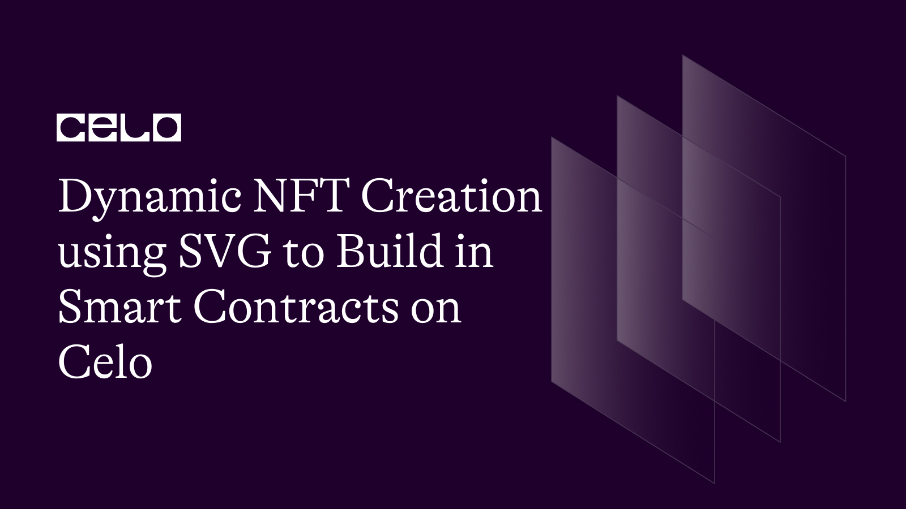
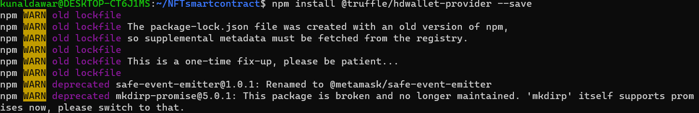
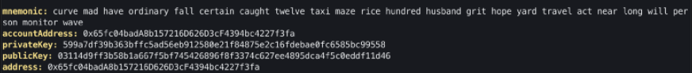
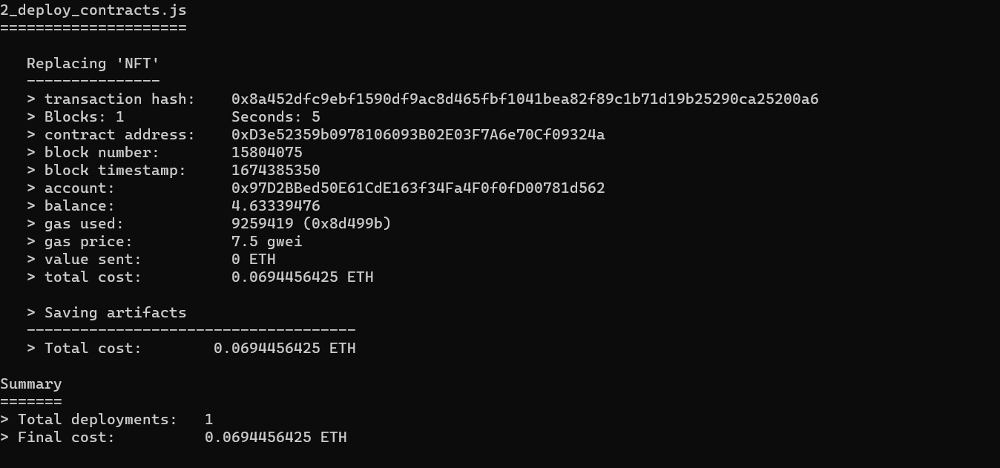
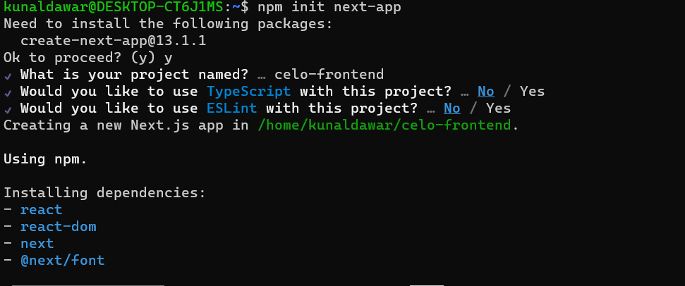
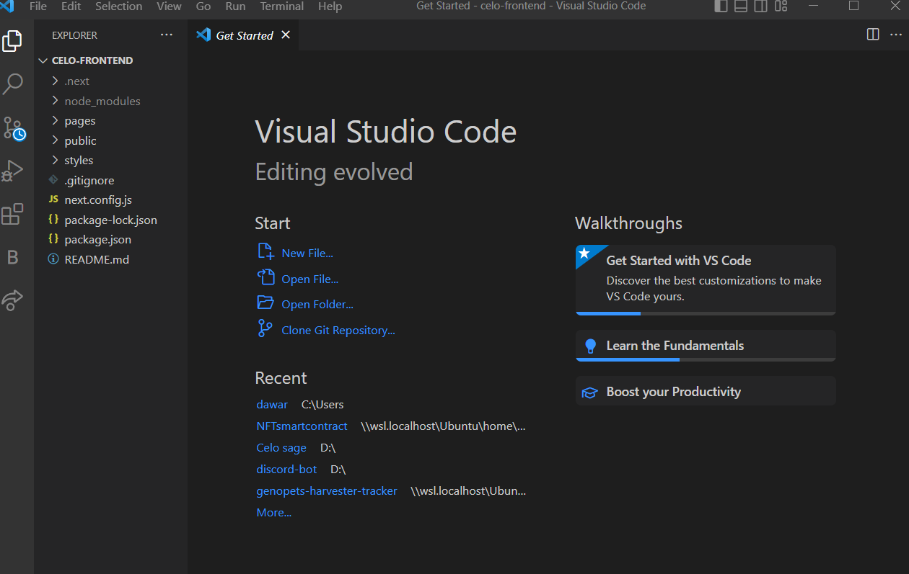
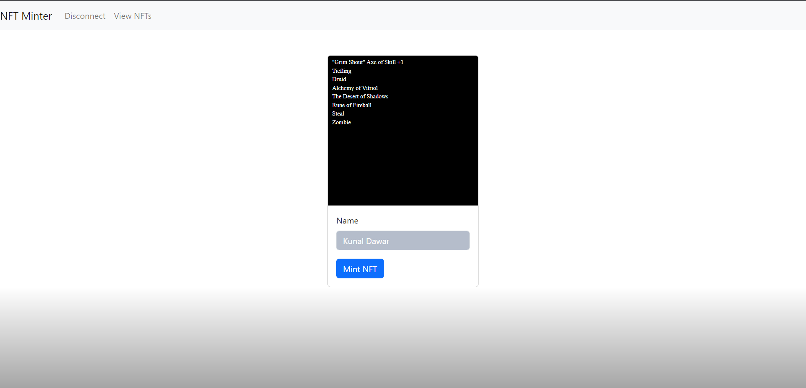
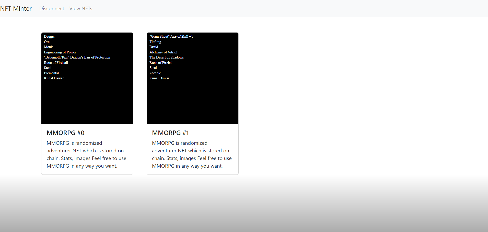

## 🌱 Introduction

Welcome to our tutorial on dynamic NFT creation using SVG on the Celo platform! In this tutorial, we will guide you through the process of deploying a smart contract that can receive information and create dynamic NFTs based on that information. We'll show you how to use SVG to create highly customizable and visually appealing NFTs that can be used for a variety of purposes, such as art, collectibles, or even as proof of ownership or authenticity. 

Whether you're a developer looking to get started with NFTs on the Celo platform or simply interested in learning more about dynamic NFT creation, this tutorial will provide valuable insights and guidance. Follow our step-by-step guide and you'll have all the tools you need to deploy your own dynamic NFT smart contract on Celo. 

Celo is a decentralized platform that enables fast, secure, and scalable transactions on a global scale. It is built on top of the Ethereum blockchain and is designed to be easily accessible to developers and users alike.

Let's get started!

## 🗈 Prerequisites

- A computer with an internet connection. You will need a computer with a stable internet connection to follow along with this guide.

- Basic knowledge of programming. While we will provide step-by-step instructions, it will be helpful to have some basic knowledge of programming languages such as JavaScript and Solidity.

- Node.js and npm installed. You will need to have Node.js and npm (the package manager for Node.js) installed on your computer. You can check if you have them installed by running the following commands in your terminal:

```bash
node -v
npm -v
```

- A code editor. You will need a code editor to write and edit your code. Some popular options include Visual Studio Code and Atom.
- A Metamask account. You will need a Metamask account to interact with the Celo blockchain from your web browser. If you don't already have one, you can create one by installing the Metamask extension for Chrome or Firefox.

## ⚠️ Requirements

- Truffle: a development environment, testing framework, and asset pipeline for Ethereum
- Node.js: a JavaScript runtime that allows you to run JavaScript on the command line
- Yarn: a package manager for JavaScript
- next: Next.js is a framework for building server-rendered or statically-exported React applications.
- CeloCli - The celocli lets you interact with the Celo Protocol smart contracts.

## What are NFTs?

Non-fungible tokens (NFTs) are digital assets that represent ownership of a unique item or concept. They are stored on a blockchain and cannot be exchanged for something else of equal value, like traditional currencies. NFTs are often used to represent digital art, collectibles, and other unique items and are bought and sold in online marketplaces. Their value is determined by their rarity and perceived value to collectors. NFTs provide a way to prove ownership and authenticity of digital assets and allow for the creation of scarcity in the digital world, which can increase the value of certain items. They are created using smart contracts on a blockchain platform, such as Ethereum, and are often represented as ERC-721 tokens.

## What are Dynamic NFTs?

Dynamic NFTs, also known as Non-Fungible Tokens, are unique digital assets that are stored on a blockchain. Unlike traditional NFTs, which are static and unchanging, dynamic NFTs can be updated and modified after they have been created. These updates can include changes to the NFT's visual appearance or underlying data, and can be triggered by events on the blockchain or by interactions with the NFT's smart contract. Dynamic NFTs can be used for a variety of purposes, such as digital art, collectibles, or even as proof of ownership or authenticity for physical assets. They offer more flexibility and functionality than traditional NFTs and open up new possibilities for creators and users alike.

**_ Let's start building the future together! _**

## Steps to set up the truffle project and its configs

1. Install Node.js by following the instructions on the [official website](https://nodejs.org/en/download/).

2. Install Yarn by running the following command:

```bash
npm install -g yarn
```

3. Install Truffle by running the following command:

```bash
yarn global add truffle
```

4. Install HDWalletProvider by running the following command:

```bash
npm install @truffle/hdwallet-provider --save

```



5. Install Celo Command Line Interface also install dotenv

```bash
npm install -g @celo/celocli
npm install dotenv
// dotenv will help us to load .env file as environment variables

```

6. Create a new Truffle project by running the following command:

```bash
mkdir NFTsmartcontract
cd NFTsmartcontract
truffle init
```

:::tip
Learn more: If you are new to Truffle check out the [Truffle docs](https://www.trufflesuite.com/docs).
:::

This will create a new directory with the following structure:

```text
NFTsmartcontract/
├── contracts/
│ └── Migrations.sol
├── migrations/
│ └── 1_initial_migration.js
├── test/
├── truffle-config.js
└── truffle.js
```

7. Navigate to the `truffle-config.js` file in your project directory and Replace the following configuration for the Celo testnet:

```js
const HDWalletProvider = require("@truffle/hdwallet-provider");
require("dotenv").config();
module.exports = {
  contracts_directory: "./contracts",
  contracts_build_directory: "./truffle_abis",
  migrations_directory: "./migrations",
  networks: {
    local: {
      host: "127.0.0.1",
      port: 7545,
      network_id: "*",
    },
    alfajores: {
      provider: function () {
        return new HDWalletProvider(
          process.env.PRIVATE_KEY,
          "https://alfajores-forno.celo-testnet.org"
        );
      },
      network_id: 44787,
      gas: 20000000, //make sure this gas allocation isn't over 20M, which is the max
    },
    celo: {
      provider: function () {
        return new HDWalletProvider(
          process.env.PRIVATE_KEY,
          "https://forno.celo.org"
        );
      },
      network_id: 42220,
      gas: 20000000, //make sure this gas allocation isn't over 20M, which is the max
    },
  },
  mocha: {
    // timeout: 100000
  },
  compilers: {
    solc: {
      version: "0.8.9", // Fetch exact version from solc-bin (default: truffle's version)
      docker: false, // Use "0.5.1" you've installed locally with docker (default: false)
      settings: {
        // See the solidity docs for advice about optimization and evmVersion
        optimizer: {
          enabled: false,
          runs: 200,
        },
        evmVersion: "istanbul",
      },
    },
  },
};
```

8. Create A Celo Account using Celo Cli

```bash
celocli account:new
```



9. Create a .env File in the root directory and add `PRIVATE_KEY` that we got from Celocli Command or You can use `PRIVATE_KEY` from Metamask.

```text
PRIVATE_KEY="62dda1a6a6ee2dasdasdsadasdassdas1e2200095661a1b1e9dsadsdsdsadasasd"
```

10. Create `.gitignore` file

It is important to hide your mnemonic and other important files while developing applications. When using Git or GitHub, you can populate a `.gitignore` file with the code below to ensure you don’t accidentally publish these files.

```text
# dependencies
/node_modules

# Mac users
.DS_Store

#hidden files
.env
```

**_ Now we are done with setting up truffle _**

## Steps for creating ERC721 Dynamic NFT Smart Contract and Truffle Migration File

1. Create a `NFT.sol` file in `contracts/` folder.

2. Add the following code to it.

```solidity
// SPDX-License-Identifier: MIT
pragma solidity ^0.8.9;

import "@openzeppelin/contracts/token/ERC721/ERC721.sol";
import "@openzeppelin/contracts/token/ERC721/extensions/ERC721URIStorage.sol";
import "@openzeppelin/contracts/access/Ownable.sol";
import "@openzeppelin/contracts/utils/Counters.sol";

contract NFT is ERC721, ERC721URIStorage, Ownable {
    using Counters for Counters.Counter;
    string[] races = [    "Human",    "Elf",    "Dwarf",    "Orc",    "Goblin",    "Dragonborn",    "Halfling",    "Tiefling",    "Gnome",    "Half-Elf"];

    string[] classes = [    "Warrior",    "Paladin",    "Hunter",    "Rogue",    "Mage",    "Warlock",    "Druid",    "Shaman",    "Cleric",    "Monk"];

    string[] weapons = [    "Sword",    "Axe",    "Mace",    "Dagger",    "Bow",    "Staff",    "Wand",    "Hammer",    "Polearm",    "Crossbow"];

    string[] professions = [    "Blacksmithing",    "Alchemy",    "Herbalism",    "Enchanting",    "Engineering",    "Jewelcrafting",    "Skinning",    "Mining",    "Tailoring",    "Leatherworking"];

    string[] zones = [    "King's Forest",    "Dragon's Lair",    "The Darklands",    "Frostbite Mountains",    "The Desert of Shadows",    "The Lost City",    "The Enchanted Forest",    "The Undercity",    "The Shadowlands",    "The Uncharted Wilds"];

    string[] items = [    "Health Potion",    "Mana Potion",    "Stamina Elixir",    "Rune of Teleportation",    "Goblin Rocket Fuel",    "Elixir of Giant Growth",    "Scarab of Protection",    "Rune of Fireball",    "Potion of Invisibility",    "Ring of Ice Resistance"];

    string[] enemies = [    "Skeleton",    "Zombie",    "Goblin",    "Orc",    "Troll",    "Dragon",    "Demon",    "Elemental",    "Undead",    "Vampire"];

    string[] questTypes = [    "Kill",    "Collect",    "Escort",    "Rescue",    "Deliver",    "Investigate",    "Sabotage",    "Assassinate",    "Steal",    "Protect"];

    string[] skills = [    "Lockpicking",    "Pickpocketing",    "Sneak",    "Stealth",    "Tracking",    "Fishing",    "Cooking",    "First Aid",    "Survival",    "Swimming"];

    string[] titles = [    "Knight",    "Baron",    "Duke",    "Prince",    "King",    "Emperor",    "Warlord",    "Dragonborn",    "Champion",    "Legend"];

     string[] private suffixes = [
        "of Power",
        "of Giants",
        "of Titans",
        "of Skill",
        "of Perfection",
        "of Brilliance",
        "of Enlightenment",
        "of Protection",
        "of Anger",
        "of Rage",
        "of Fury",
        "of Vitriol",
        "of the Fox",
        "of Detection",
        "of Reflection",
        "of the Twins"
    ];
     string[] private nameSuffixes = [
        "Bane",
        "Root",
        "Bite",
        "Song",
        "Roar",
        "Grasp",
        "Instrument",
        "Glow",
        "Bender",
        "Shadow",
        "Whisper",
        "Shout",
        "Growl",
        "Tear",
        "Peak",
        "Form",
        "Sun",
        "Moon"
    ];
     string[] private namePrefixes = [
        "Agony", "Apocalypse", "Armageddon", "Beast", "Behemoth", "Blight", "Blood", "Bramble", 
        "Brimstone", "Brood", "Carrion", "Cataclysm", "Chimeric", "Corpse", "Corruption", "Damnation", 
        "Death", "Demon", "Dire", "Dragon", "Dread", "Doom", "Dusk", "Eagle", "Empyrean", "Fate", "Foe", 
        "Gale", "Ghoul", "Gloom", "Glyph", "Golem", "Grim", "Hate", "Havoc", "Honour", "Horror", "Hypnotic", 
        "Kraken", "Loath", "Maelstrom", "Mind", "Miracle", "Morbid", "Oblivion", "Onslaught", "Pain", 
        "Pandemonium", "Phoenix", "Plague", "Rage", "Rapture", "Rune", "Skull", "Sol", "Soul", "Sorrow", 
        "Spirit", "Storm", "Tempest", "Torment", "Vengeance", "Victory", "Viper", "Vortex", "Woe", "Wrath",
        "Light's", "Shimmering"  
    ];
    Counters.Counter private _tokenIdCounter;
    constructor() ERC721("DYNAMICNFT", "CELO") {}

    function safeMint(string memory name) public {
        uint256 tokenId = _tokenIdCounter.current();
        _tokenIdCounter.increment();
        _safeMint(msg.sender, tokenId);
        _setTokenURI(tokenId, NFTgenerate(tokenId,name));
    }

    // The following functions are overrides required by Solidity.

    function _burn(uint256 tokenId) internal override(ERC721, ERC721URIStorage) {
        super._burn(tokenId);
    }

    function tokenURI(uint256 tokenId)
        public
        view
        override(ERC721, ERC721URIStorage)
        returns (string memory)
    {
        return super.tokenURI(tokenId);
    }

    function random(string memory input) internal pure returns (uint256) {
        return uint256(keccak256(abi.encodePacked(input)));
    }
    
    function getRace(uint256 tokenId) public view returns (string memory) {
        return pluck(tokenId, "RACE", races);
    }
    
    function getClass(uint256 tokenId) public view returns (string memory) {
        return pluck(tokenId, "CLASS", classes);
    }
    
    function getWeapon(uint256 tokenId) public view returns (string memory) {
        return pluck(tokenId, "WEAPON", weapons);
    }
    
    function getProfession(uint256 tokenId) public view returns (string memory) {
        return pluck(tokenId, "PROFESSION", professions);
    }

    function getZone(uint256 tokenId) public view returns (string memory) {
        return pluck(tokenId, "ZONE", zones);
    }
    
    function getItem(uint256 tokenId) public view returns (string memory) {
        return pluck(tokenId, "ITEM", items);
    }
    
    function getQuest(uint256 tokenId) public view returns (string memory) {
        return pluck(tokenId, "QUEST", questTypes);
    }
    
    function getEnemy(uint256 tokenId) public view returns (string memory) {
        return pluck(tokenId, "ENEMY", enemies);
    }

    function pluck(uint256 tokenId, string memory keyPrefix, string[] memory sourceArray) internal view returns (string memory) {
        uint256 rand = random(string(abi.encodePacked(keyPrefix, toString(tokenId))));
        string memory output = sourceArray[rand % sourceArray.length];
        uint256 greatness = rand % 21;
        if (greatness > 14) {
            output = string(abi.encodePacked(output, " ", suffixes[rand % suffixes.length]));
        }
        if (greatness >= 19) {
            string[2] memory name;
            name[0] = namePrefixes[rand % namePrefixes.length];
            name[1] = nameSuffixes[rand % nameSuffixes.length];
            if (greatness == 19) {
                output = string(abi.encodePacked('"', name[0], ' ', name[1], '" ', output));
            } else {
                output = string(abi.encodePacked('"', name[0], ' ', name[1], '" ', output, " +1"));
            }
        }
        return output;
    }
    function NFTgenerate(uint256 tokenId,string memory name) internal view returns (string memory) {
        string[19] memory parts;
        parts[0] = '<svg xmlns="http://www.w3.org/2000/svg" preserveAspectRatio="xMinYMin meet" viewBox="0 0 350 350"><style>.base { fill: white; font-family: serif; font-size: 14px; }</style><rect width="100%" height="100%" fill="black" /><text x="10" y="20" class="base">';

        parts[1] = getWeapon(tokenId);

        parts[2] = '</text><text x="10" y="40" class="base">';

        parts[3] = getRace(tokenId);

        parts[4] = '</text><text x="10" y="60" class="base">';

        parts[5] = getClass(tokenId);

        parts[6] = '</text><text x="10" y="80" class="base">';

        parts[7] = getProfession(tokenId);

        parts[8] = '</text><text x="10" y="100" class="base">';

        parts[9] = getZone(tokenId);

        parts[10] = '</text><text x="10" y="120" class="base">';

        parts[11] = getItem(tokenId);

        parts[12] = '</text><text x="10" y="140" class="base">';

        parts[13] = getQuest(tokenId);

        parts[14] = '</text><text x="10" y="160" class="base">';

        parts[15] = getEnemy(tokenId);

        parts[16] = '</text><text x="10" y="180" class="base">';

        parts[17] = name;

        parts[18] = '</text></svg>';

        string memory output = string(abi.encodePacked(parts[0], parts[1], parts[2], parts[3], parts[4], parts[5], parts[6], parts[7], parts[8]));
        output = string(abi.encodePacked(output, parts[9], parts[10], parts[11], parts[12], parts[13], parts[14], parts[15], parts[16]));
        output = string(abi.encodePacked(output, parts[17], parts[18]));

        string memory json = Base64.encode(bytes(string(abi.encodePacked('{"name": "MMORPG #', toString(tokenId), '", "description": "MMORPG is randomized adventurer NFT which is stored on chain. Stats, images Feel free to use MMORPG in any way you want.", "image": "data:image/svg+xml;base64,', Base64.encode(bytes(output)), '"}'))));
        output = string(abi.encodePacked('data:application/json;base64,', json));

        return output;
    }
    function toString(uint256 value) internal pure returns (string memory) {
    // Inspired by OraclizeAPI's implementation - MIT license
    // https://github.com/oraclize/ethereum-api/blob/b42146b063c7d6ee1358846c198246239e9360e8/oraclizeAPI_0.4.25.sol

        if (value == 0) {
            return "0";
        }
        uint256 temp = value;
        uint256 digits;
        while (temp != 0) {
            digits++;
            temp /= 10;
        }
        bytes memory buffer = new bytes(digits);
        while (value != 0) {
            digits -= 1;
            buffer[digits] = bytes1(uint8(48 + uint256(value % 10)));
            value /= 10;
        }
        return string(buffer);
    }
}
/// [MIT License]
/// @title Base64
/// @notice Provides a function for encoding some bytes in base64
/// @author Brecht Devos <brecht@loopring.org>
    library Base64 {
    bytes internal constant TABLE = "ABCDEFGHIJKLMNOPQRSTUVWXYZabcdefghijklmnopqrstuvwxyz0123456789+/";

        /// @notice Encodes some bytes to the base64 representation
        function encode(bytes memory data) internal pure returns (string memory) {
            uint256 len = data.length;
            if (len == 0) return "";

            // multiply by 4/3 rounded up
            uint256 encodedLen = 4 * ((len + 2) / 3);

            // Add some extra buffer at the end
            bytes memory result = new bytes(encodedLen + 32);

            bytes memory table = TABLE;

            assembly {
                let tablePtr := add(table, 1)
                let resultPtr := add(result, 32)

                for {
                    let i := 0
                } lt(i, len) {

                } {
                    i := add(i, 3)
                    let input := and(mload(add(data, i)), 0xffffff)

                    let out := mload(add(tablePtr, and(shr(18, input), 0x3F)))
                    out := shl(8, out)
                    out := add(out, and(mload(add(tablePtr, and(shr(12, input), 0x3F))), 0xFF))
                    out := shl(8, out)
                    out := add(out, and(mload(add(tablePtr, and(shr(6, input), 0x3F))), 0xFF))
                    out := shl(8, out)
                    out := add(out, and(mload(add(tablePtr, and(input, 0x3F))), 0xFF))
                    out := shl(224, out)

                    mstore(resultPtr, out)

                    resultPtr := add(resultPtr, 4)
                }

                switch mod(len, 3)
                case 1 {
                    mstore(sub(resultPtr, 2), shl(240, 0x3d3d))
                }
                case 2 {
                    mstore(sub(resultPtr, 1), shl(248, 0x3d))
                }

                mstore(result, encodedLen)
            }

            return string(result);
        }
    }
```
**The smart contract defines several functions that are used to create dynamic NFTs. Here is a breakdown of the functions and their purpose:**

- The function random(string memory input) is an internal pure function that takes in a string input and returns a random uint256 value. It does this by taking the input, converting it to packed ABI format, and then using the keccak256 hashing function to generate a random value.

- The function getRace(uint256 tokenId) is a public view function that takes in a tokenId and returns the race associated with that tokenId. It does this by calling the internal pluck(uint256 tokenId, string memory keyPrefix, string[] memory sourceArray) function and passing in the tokenId, the string "RACE", and the "races" array.

- The function pluck(uint256 tokenId, string memory keyPrefix, string[] memory sourceArray) is an internal view function that takes in a tokenId, a key prefix, and a source array and returns a string. It does this by first generating a random value using the random(string memory input) function, passing in a concatenation of the key prefix and tokenId. Then it uses this random value to select an element from the source array, and calculate greatness value. If the greatness is greater than 14, it will append a suffix from suffixes array. If the greatness is greater than 19, it will append name prefixes and suffixes which are randomly selected from namePrefixes and nameSuffixes array.

- The function NFTgenerate(uint256 tokenId,string memory name) is an internal view function that takes in a tokenId and a name, and returns an SVG string representation of the NFT. The function generates several parts of the SVG by calling various getter function like getRace, getClass, getWeapon etc. with tokenId. All parts are concatenated and returned as SVG string.

- The function toString(uint256 value) is an internal pure function that converts an unsigned integer value to its string representation. It does this by first checking if the input value is zero, and if so, it returns the string "0". If the input value is not zero, it initializes a variable called digits to zero, and then iterates through the input value, incrementing the digits variable by one for each digit in the input value. It then creates a new byte array called buffer with the number of elements equal to the number of digits in the input value. It then iterates through the input value again, this time converting each digit to its corresponding ASCII character and storing it in the buffer array, starting from the least significant digit. Finally, it converts the buffer array to a string and returns it.

- The library Base64 contains one function named encode which takes a byte array data as input and returns a string containing the Base64 encoded version of the input data. The function first calculates the length of the input data, and exits early if the data is empty. Next, it calculates the length of the encoded data by multiplying the length of the input data by 4/3 and rounding up. Then it creates a new byte array result with extra buffer space at the end.It uses assembly code to loop through the input data array and encode 3 bytes at a time into 4 bytes of base64 encoded data by accessing the TABLE constant, which contains the Base64 encoding table. Finally it handles the padding for the last byte or two, if the input data length is not divisible by 3, and returns the encoded data as a string.

:::tip
Use the [OpenZeppelin Wizard](https://wizard.openzeppelin.com/) to easily create, deploy, and interact with smart contracts using the OpenZeppelin library.
:::

3. Install openzeppelin Library by running this command in the root folder.

```bash
npm install @openzeppelin/contracts
```

4. Create a 2_deploy_contracts.js File in the migrations folder and follow the code.

```js
const NFT = artifacts.require("NFT");
module.exports = function(deployer) {
  deployer.deploy(NFT);
};
```

**_ Now we are done creating NFT.sol And its Migration Config, next we gonna deploy it on Celo testnet Blockchain _**

## Steps to deploy Smart Contract

1. We need Faucet For deploying smart contracts on Celo Blockchain. Use [Celo Testnet Faucet](https://celo.org/developers/faucet) to get faucet money input your address which we got from celocli.

2. Now we Gonna Compile the Smart Contract and Check if there are any problems with it.

```
truffle compile
```

3. After successful Compilation We Now gonna deploy it on Celo Testnet

```
//Truffle migrate compiles AND migrates your contract. In the future, you can run truffle migrate to complete both steps but run only if you are deploying it on a Local server.

truffle migrate
// use truffle deploy --network network name to deploy on celo testnet
truffle deploy --network alfajores
//We can use other Chain as well by adding them in truffle-config.js

```



4. After We Got our Smart Contract Address we can check it on Celo Blockchain explorer using [Block Explorer](https://explorer.celo.org/alfajores).

**_ ヾ(´⌣`)ノ Hurray we Deployed our ERC721 Dynamic NFT Smart Contract Make Sure to Save the Smart Contract Address in a File We Gonna use it in Our Frontend. As For Our Smart Contract we have deployed is [smart contract](https://explorer.celo.org/alfajores/address/0xD3e52359b0978106093B02E03F7A6e70Cf09324a) _**

## Frontend using NextJS

### Steps

1. Set up a Next.js project:

Install Next.js and create a new Next.js project by running the following commands:

```bash
npm init next-app
cd next-app
npm run dev
```



2. Install Ethers.js:

Ethers.js is a JavaScript library that allows you to interact with the Ethereum blockchain. To install it, run the following command in your terminal:

```bash
npm install ethers
```

3. Install React-Bootstrap

```bash
npm install react-bootstrap bootstrap
```



4. Now we have installed react-bootstrap we need to add its CSS to the `\_app.js` file.

```bash
import 'bootstrap/dist/css/bootstrap.min.css';

```

5. Now We have our libraries which we gonna use. Now let's edit our `pages/index.js` file

```js
import React from "react";
import { ethers } from "ethers";
import contractAbi from "./abi/NFT.json";
import {
  Button,
  Card,
  Container,
  Nav,
  Navbar,
  Form,
  Spinner,
} from "react-bootstrap";

const contractAddress = "0xD3e52359b0978106093B02E03F7A6e70Cf09324a"; // Replace with your contract address
function App() {
  const [walletAddress, setWalletAddress] = React.useState(null);
  const [firstName, setFirstName] = React.useState("");
  const [spinner, setSpinner] = React.useState(false);

  const connectToWallet = async () => {
    try {
      await window.ethereum.enable();
      const accounts = await window.ethereum.request({
        method: "eth_requestAccounts",
      });
      setWalletAddress(accounts[0]);
    } catch (error) {
      console.error(error);
    }
  };

  const mintNFT = async () => {
    try {
      const provider = new ethers.providers.Web3Provider(window.ethereum);
      const signer = provider.getSigner();
      const contract = new ethers.Contract(
        contractAddress,
        contractAbi.abi,
        signer
      );
      if (firstName.length > 0) {
        setSpinner(true);
        await contract.safeMint(firstName, { from: walletAddress });
        setSpinner(false);
      } else {
        alert("Enter Name");
      }
    } catch (error) {
      console.error(error);
    }
  };

  const disconnectFromWallet = async () => {
    try {
      await window.ethereum.request({
        method: "eth_requestAccounts",
        accounts: [],
      });
      setWalletAddress(null);
    } catch (error) {
      console.error(error);
    }
  };
  React.useEffect(() => {
    const checkWalletConnection = async () => {
      if (window.ethereum.isConnected()) {
        const accounts = await window.ethereum.request({
          method: "eth_requestAccounts",
        });
        setWalletAddress(accounts[0]);
      } else {
        console.log("Wallet not connected");
      }
    };
    checkWalletConnection();
  }, []);
  return (
    <div style={{ backgroundColor: "white" }}>
      <Navbar bg="light" expand="lg">
        <Navbar.Brand href="/">NFT Minter</Navbar.Brand>
        <Navbar.Toggle aria-controls="basic-navbar-nav" />
        <Navbar.Collapse id="basic-navbar-nav">
          <Nav className="ml-auto">
            {!walletAddress ? (
              <>
                <Nav.Link href="#" onClick={connectToWallet}>
                  Connect
                </Nav.Link>
              </>
            ) : (
              <>
                <Nav.Link href="#" onClick={disconnectFromWallet}>
                  Disconnect
                </Nav.Link>
              </>
            )}
            <Nav.Link href="viewnft">View NFTs</Nav.Link>
          </Nav>
        </Navbar.Collapse>
      </Navbar>
      <Container>
        <Card style={{ width: "18rem" }} className="mx-auto mt-5">
          <Card.Img
            variant="top"
            src={`data:image/svg+xml;base64,PHN2ZyB4bWxucz0iaHR0cDovL3d3dy53My5vcmcvMjAwMC9zdmciIHByZXNlcnZlQXNwZWN0UmF0aW89InhNaW5ZTWluIG1lZXQiIHZpZXdCb3g9IjAgMCAzNTAgMzUwIj48c3R5bGU+LmJhc2UgeyBmaWxsOiB3aGl0ZTsgZm9udC1mYW1pbHk6IHNlcmlmOyBmb250LXNpemU6IDE0cHg7IH08L3N0eWxlPjxyZWN0IHdpZHRoPSIxMDAlIiBoZWlnaHQ9IjEwMCUiIGZpbGw9ImJsYWNrIiAvPjx0ZXh0IHg9IjEwIiB5PSIyMCIgY2xhc3M9ImJhc2UiPiJHcmltIFNob3V0IiBBeGUgb2YgU2tpbGwgKzE8L3RleHQ+PHRleHQgeD0iMTAiIHk9IjQwIiBjbGFzcz0iYmFzZSI+VGllZmxpbmc8L3RleHQ+PHRleHQgeD0iMTAiIHk9IjYwIiBjbGFzcz0iYmFzZSI+RHJ1aWQ8L3RleHQ+PHRleHQgeD0iMTAiIHk9IjgwIiBjbGFzcz0iYmFzZSI+QWxjaGVteSBvZiBWaXRyaW9sPC90ZXh0Pjx0ZXh0IHg9IjEwIiB5PSIxMDAiIGNsYXNzPSJiYXNlIj5UaGUgRGVzZXJ0IG9mIFNoYWRvd3M8L3RleHQ+PHRleHQgeD0iMTAiIHk9IjEyMCIgY2xhc3M9ImJhc2UiPlJ1bmUgb2YgRmlyZWJhbGw8L3RleHQ+PHRleHQgeD0iMTAiIHk9IjE0MCIgY2xhc3M9ImJhc2UiPlN0ZWFsPC90ZXh0Pjx0ZXh0IHg9IjEwIiB5PSIxNjAiIGNsYXNzPSJiYXNlIj5ab21iaWU8L3RleHQ+PC9zdmc+`}
          />
          <Card.Body>
            <Form>
              <Form.Group className="mb-3" controlId="name">
                <Form.Label>Name</Form.Label>
                <Form.Control
                  type="name"
                  placeholder="Enter Name"
                  value={firstName}
                  onChange={(e) => setFirstName(e.target.value)}
                />
              </Form.Group>
              {walletAddress && (
                <>
                  {spinner === false ? (
                    <Button variant="primary" onClick={mintNFT}>
                      Mint NFT
                    </Button>
                  ) : (
                    <Button variant="primary" disabled>
                      <Spinner
                        as="span"
                        animation="grow"
                        size="sm"
                        role="status"
                        aria-hidden="true"
                      />
                      Loading...
                    </Button>
                  )}
                </>
              )}
            </Form>
          </Card.Body>
        </Card>
      </Container>
    </div>
  );
}

export default App;
```

6. We need to copy the Abi Json file from our smart contract folder truffle_abis/NFT.json and Create a new folder in our pages folder named ABI and paste it over there.

7. Now we can run Our Command to Test it out.

```bash
npm run dev
```



**_ ヾ(´⌣`)ノ Hurray We are done with our frontend Mint Function. _**

## Let's Complete Our Tutorial With View NFT

### Steps To Create View NFT's Page

1. Create a new file in pages with the name `viewnft.js`

2. Install `axios` in the project to fetch data from IPFS JSON link.

```bash
npm install axios
```

3. Let's import all the files which we needed

```js
import React from "react";
import { ethers } from "ethers";
import contractAbi from "./abi/NFT.json";
import {
  Card,
  Container,
  Nav,
  Navbar,
  Row,
  Col,
} from "react-bootstrap";
import axios from "axios";
```

4. After importing all files we gonna create functions to fetch all user nfts.

```js
async function listTokensOfOwner() {
    const provider = new ethers.providers.Web3Provider(window.ethereum)

    const contract = new ethers.Contract(contractAddress, contractAbi.abi, provider);
    //we are using logs to fetch users nft
    const sentLogs = await contract.queryFilter(
      contract.filters.Transfer(walletAddress, null),
    );
    const receivedLogs = await contract.queryFilter(
      contract.filters.Transfer(null, walletAddress),
    );

    const logs = sentLogs.concat(receivedLogs)
      .sort(
        (a, b) =>
          a.blockNumber - b.blockNumber ||
          a.transactionIndex - b.TransactionIndex,
      );

    const owned = new Set();

    for (const log of logs) {
      const { from, to, tokenId } = log.args;

      if (addressEqual(to, walletAddress)) {
        owned.add(tokenId.toString());
      } else if (addressEqual(from, walletAddress)) {
        owned.delete(tokenId.toString());
      }
    }

    const uri = [];
    for (const own of owned) {
        const tokenuri = await tokenUri(own);
        const response = await axios.get(tokenuri);

        uri.push(response.data)
    }
    setuserNFT(uri);
};
async function tokenUri(id){
  //this function is to fetch tokenUri from smart contract
    const provider = new ethers.providers.Web3Provider(window.ethereum)
    const contract = new ethers.Contract(contractAddress, contractAbi.abi, provider);
    const url =await contract.tokenURI(id);
    return url.toString()
}
function addressEqual(a, b) {
  //this functoin is for checking the address match because sometime metamask and our input wallet addresses are in different Cases.
  return a.toLowerCase() === b.toLowerCase();
}
```

5. Let's look at our Complete `viewnft.js`` How it looks.

```js
import React from "react";
import { ethers } from "ethers";
import contractAbi from "./abi/NFT.json";
import {
  Card,
  Container,
  Nav,
  Navbar,
  Row,
  Col,
} from "react-bootstrap";
import axios from "axios";

const contractAddress = "0xD3e52359b0978106093B02E03F7A6e70Cf09324a"; // Replace with your contract address
function App() {
  const [walletAddress, setWalletAddress] = React.useState(null);
  const [userNFt, setuserNFT] = React.useState(null);
  const connectToWallet = async () => {
    try {
      await window.ethereum.enable();
      const accounts = await window.ethereum.request({
        method: "eth_requestAccounts",
      });
      setWalletAddress(accounts[0]);
    } catch (error) {
      console.error(error);
    }
  };

  const disconnectFromWallet = async () => {
    try {
      await window.ethereum.request({
        method: "eth_requestAccounts",
        accounts: [],
      });
      setWalletAddress(null);
      console.log("Wallet disconnected");
    } catch (error) {
      console.error(error);
    }
  };
  React.useEffect(() => {
    const checkWalletConnection = async () => {
      if (window.ethereum.isConnected()) {
        const accounts = await window.ethereum.request({
          method: "eth_requestAccounts",
        });
        setWalletAddress(accounts[0]);
      } else {
        console.log("Wallet not connected");
      }
    };
    checkWalletConnection();
    if (walletAddress) {
      listTokensOfOwner();
    }
  }, [walletAddress]);
  async function listTokensOfOwner() {
    const provider = new ethers.providers.Web3Provider(window.ethereum);

    const contract = new ethers.Contract(
      contractAddress,
      contractAbi.abi,
      provider
    );

    const sentLogs = await contract.queryFilter(
      contract.filters.Transfer(walletAddress, null)
    );
    const receivedLogs = await contract.queryFilter(
      contract.filters.Transfer(null, walletAddress)
    );

    const logs = sentLogs
      .concat(receivedLogs)
      .sort(
        (a, b) =>
          a.blockNumber - b.blockNumber ||
          a.transactionIndex - b.TransactionIndex
      );

    const owned = new Set();

    for (const log of logs) {
      const { from, to, tokenId } = log.args;

      if (addressEqual(to, walletAddress)) {
        owned.add(tokenId.toString());
      } else if (addressEqual(from, walletAddress)) {
        owned.delete(tokenId.toString());
      }
    }

    const uri = [];
    for (const own of owned) {
      const tokenuri = await tokenUri(own);
      const response = await axios.get(tokenuri);

      uri.push(response.data);
    }
    setuserNFT(uri);
  }
  async function tokenUri(id) {
    const provider = new ethers.providers.Web3Provider(window.ethereum);

    const contract = new ethers.Contract(
      contractAddress,
      contractAbi.abi,
      provider
    );
    const url = await contract.tokenURI(id);
    return url.toString();
  }
  function addressEqual(a, b) {
    return a.toLowerCase() === b.toLowerCase();
  }
  return (
    <div style={{ backgroundColor: "white" }}>
      <Navbar bg="light" expand="lg">
        <Navbar.Brand href="/">NFT Minter</Navbar.Brand>
        <Navbar.Toggle aria-controls="basic-navbar-nav" />
        <Navbar.Collapse id="basic-navbar-nav">
          <Nav className="ml-auto">
            {!walletAddress ? (
              <>
                <Nav.Link href="#" onClick={connectToWallet}>
                  Connect
                </Nav.Link>
              </>
            ) : (
              <>
                <Nav.Link href="#" onClick={disconnectFromWallet}>
                  Disconnect
                </Nav.Link>
              </>
            )}
            <Nav.Link href="/viewnft">View NFTs</Nav.Link>
          </Nav>
        </Navbar.Collapse>
      </Navbar>
      <Container>
        {walletAddress && (
          <>
            <Row xs={1} md={4} className="g-4">
              {userNFt &&
                userNFt.map((item, i) => {
                  return (
                    <Col>
                      <Card style={{ width: "18rem" }} className="mx-auto mt-5">
                        <Card.Img variant="top" src={item.image} />
                        <Card.Body>
                          <Card.Title>{item.name}</Card.Title>
                          <Card.Text>{item.description}</Card.Text>
                        </Card.Body>
                      </Card>
                    </Col>
                  );
                })}
            </Row>
          </>
        )}
      </Container>
    </div>
  );
}

export default App;
```

6. Now we again gonna run `npm run dev` to start our application locally.



**_ 🥳🥳🥳 Congratulations! 🥳🥳🥳 You have successfully deployed your ERC721 Dynamic NFT on the Celo blockchain. _**

# Conclusion

In conclusion, this tutorial has provided an in-depth look at how to create dynamic NFTs using SVG and deploying them on the Celo platform. By using SVG, we can create highly customizable and visually appealing NFTs for a variety of purposes such as art, collectibles, or even proof of ownership or authenticity. Whether you are a developer looking to get started with NFTs on Celo or simply interested in learning more about dynamic NFT creation, this tutorial has provided valuable insights and guidance. With the step-by-step guide provided, you now have the tools to deploy your own dynamic NFT smart contract on the Celo platform.

# About Author

Hi! My name is Kunal Dawar and I am a Full Stack web2/web3 Developer. I have participated in numerous hackathons and have been fortunate enough to win many of them.

One thing that I am truly passionate about is creating things that are reliable and don't break easily. I believe that creating high-quality products is important not only for the users but also for the overall growth and success of a business.

In my free time, I enjoy learning about new technologies and staying up-to-date with the latest trends in the field. I also love to share my knowledge with others and mentor those who are interested in pursuing a career in web development.
