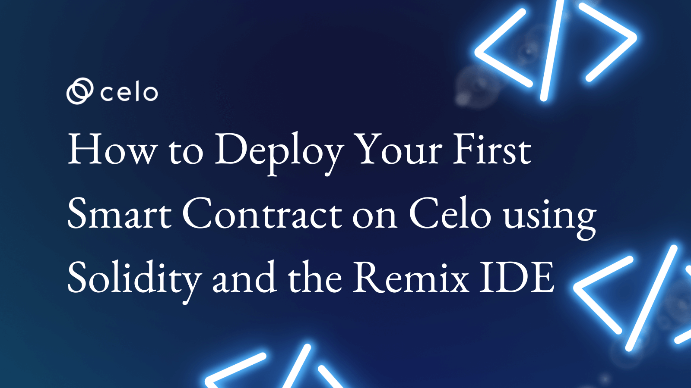

## Introdução

Bem-vindo ao nosso tutorial sobre Solidity e como criar o seu primeiro smart contract usando a IDE Remix. Solidity é a linguagem de programação principalmente utilizada para escrever smart contracts commpatíveis com a EVM (Máquina virtual Ethereum) como é o caso da Celo. Neste tutorial, você aprenderá os conceitos básicos de Solidity e como usar a IDE Remix para criar e testar seu primeiro smart contract. Acompanhe-nos nesta jornada para aprender como criar seus próprios contratos inteligentes e se tornar um desenvolvedor blockchain habilitado.

Neste video mostraremos como você pode realizar um deploy do smart contract na rede **Alfajores (rede de teste)** da Celo, e também como realizar uma recarga utilizando a **Faucet**.

## Pré-requisitos

Para este tutorial não é necessário conhecimento prévio. As ferramentas utilizadas serão:

- Remix: [Remix](https://remix.ethereum.org/) é uma Integrated Development Environment (IDE) para desenvolvimento de smart contracts na blockchain Ethereum. Ele fornece uma plataforma fácil de usar para escrever, testar e depurar smart contracts escritos na linguagem Solidity. Além disso, a IDE Remix também fornece ferramentas para simular e executar smart contracts em diferentes ambientes de rede, incluindo a rede principal Celo e redes de teste. Ele é uma ferramenta popular entre desenvolvedores de smart contracts, pois oferece recursos avançados para facilitar o desenvolvimento e teste de contratos inteligentes.
- Faucet: [Faucet](https://celo.org/developers/faucet) é utilizada para adicionar fundos a sua conta de teste na rede Alfajores
- Alfajores: É a rede de teste da Celo que utilizaremos para demonstração a implantação de um contrato inteligente e também realizar transações dos ativos

## Requisitos

- Criar duas contas na MetaMask na rede Alfajores Celo.

## Tutorial

Confira no video como criar o seu primeiro smart contract em Celo usando a IDE Remix.

[Click here to watch the video](https://youtu.be/JU8V7lQykj0)

## Conclusão

Parabéns! Você concluiu o tutorial e aprendeu como criar o seu primeiro smart contract em Celo usando a IDE Remix.🎉 .

## Próximos passos

Como próximos passos sugiro a você consultar o treinamento seguinte focado em Como Criar contratos Factory em Celo.

## Sobre o Autor

Eu sou um empreendedor serial, founder da Guizo Studios e sempre disponível para ajudar o ecossistema Celo.

[LinkedIn](https://www.linkedin.com/in/ewertonlopes/)
