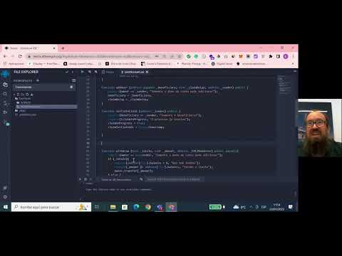

# Introdução

No geral, os contratos factory são uma ferramenta útil para os desenvolvedores criarem e gerenciarem várias instâncias de contratos inteligentes de maneira mais eficiente e simplificada, fornecendo um bloco de construção para a criação de aplicativos descentralizados complexos no ecossistema Web3.

Ele permite a implantação de muitos contratos semelhantes com uma única transação, reduzindo o custo e a complexidade da implantação de vários contratos individualmente. A palavra-chave "new" é um elemento-chave no padrão de fábrica no Solidity e desempenha um papel significativo na implantação e gerenciamento de contratos Factory.

Neste video mostraremos como você pode realizar um deploy re um smart contract utilizando Factory na rede **Alfajores (rede de teste)** da Celo.

# Pré-requisitos

Para este tutorial não é necessário conhecimento prévio. As ferramentas utilizadas serão:

- Remix: [Remix](https://remix.ethereum.org/) é uma Integrated Development Environment (IDE) para desenvolvimento de smart contracts na blockchain Ethereum. Ele fornece uma plataforma fácil de usar para escrever, testar e depurar smart contracts escritos na linguagem Solidity. Além disso, a IDE Remix também fornece ferramentas para simular e executar smart contracts em diferentes ambientes de rede, incluindo a rede principal Ethereum e redes de teste. Ele é uma ferramenta popular entre desenvolvedores de smart contracts, pois oferece recursos avançados para facilitar o desenvolvimento e teste de contratos inteligentes.
- Faucet: [Faucet](https://faucet.celo.org) é utilizada para adicionar fundos a sua conta de teste na rede Alfajores.
- Alfajores: É a rede de teste da Celo que utilizaremos para demonstração a implantação de um contrato inteligente e também realizar transações dos ativos.

## Requisitos

- Criar duas contas na MetaMask usando a rede Alfajores da Celo

## Tutorial

Confira no video como construir e realizar deploy de contratos Factory no blockchain Celo.

## Conclusão

Parabéns! Você concluiu o tutorial e agora sabe como criar um contracto Factory no blockchain da Celo 🎉 .

## Próximos passos

Como próximos passos sugiro a você consultar outros [videos](https://docs.celo.org/tutorials?tags=video).

Além disso, convido você a ver nossos próximos conteúdos em português.

## Sobre o Autor

Eu sou um empreendedor serial, founder da Guizo Studios e sempre disponível para ajudar o ecossistema Celo.

[LinkedIn](https://www.linkedin.com/in/ewertonlopes/)
