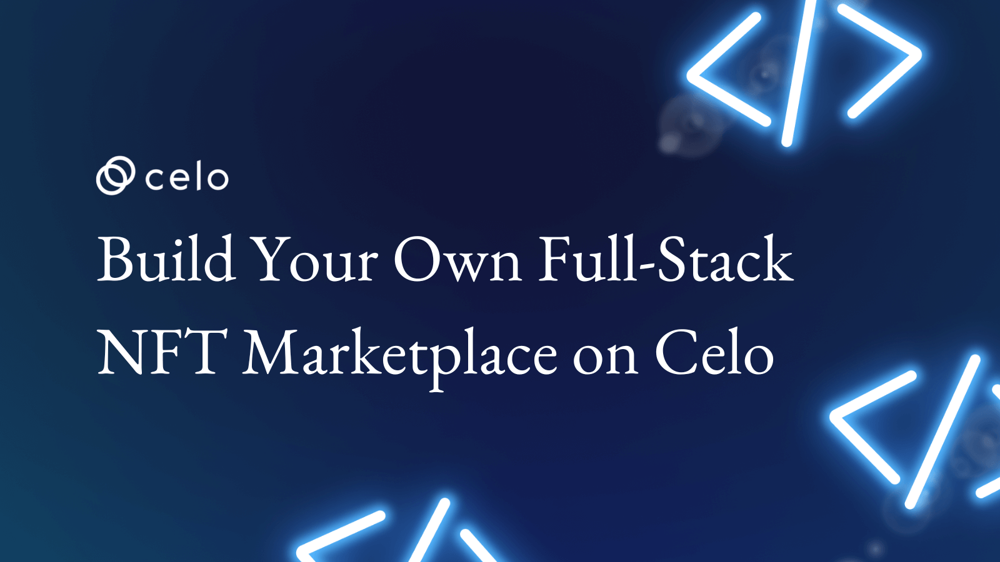

## Introduction

NFTs or Non-Fungible Tokens have a lot of unique benefits to the blockchain ecosystem. One of those benefits is the ability to create and trade digital items or a representation of a physical item. In this tutorial, you’ll learn how to create a simple decentralized application for Buying and selling vintage items as  NFTs on the Celo Blockchain. Hopefully one day you will use this knowledge to create the next open sea 🙂.

Here’s a demo [link](https://aquamarine-unicorn-2f3217.netlify.app/) of what you’ll be creating.

## Prerequisites

To fully follow up with these tutorials, you should have a basic understanding of the following technologies.

Solidity, smart-contract and blockchain concepts.
Hardhat.
React.
Basic web Development.

## Requirements

- Solidity.
- OpenZeppelin.
- Hardhat.
- React.
- Bootstrap.
- IPFS.
- NodeJS 12.0.1 upwards installed.
- MetaMask.

## Installation

Click on [this](https://github.com/4undRaiser/VintageNFTMarketplace) repo from your github.

- Clone the repo to your computer.
- open the project from from vscode.
- Run `npm install` command to install all the dependencies required to run the app locally.

## Folder structure

```text
├── build
├── contracts
├── node_modules
├── public
├── scripts
│   └── deploy.js
├── src
│   ├── components
│   │   ├── minter
│   │   │    ├── nfts
│   │   │    │    ├── Add.js
│   │   │    │    ├── Card.js
│   │   │    │    └── index.js
│   │   │    └── Cover.js
│   │   ├── ui
│   │   │    ├── Identicon.js
│   │   │    ├── Loader.js
│   │   │    └── Notifications.js
│   │   │
│   │   └── Wallet.js
│   ├── contracts
│   │    ├── MyNFT-address.json
│   │    ├── MyNFT.json
│   │    ├── NFTMarketplace-address.json
│   │    └── NFTMarketplace.json
│   ├── hooks
│   │    ├── index.js
│   │    ├── useBalance.js
│   │    ├── useContract.js
│   │    ├── useMarketplaceContract.js
│   │    └── useMinterContract.js
│   └── utils
│   │    ├── constants.js
│   │    ├── index.js
│   │    └── minter.js
├── App.css
├── App.js
├── App.test.js
├── index.css
├── index.js
├── logo.svg
├── reportWebVitals.js
├── setupTests.js
├── .env
├── .gitignore
├── hardhat.config.js
├── package-lock.json
├── package.json
└── README.md
```

## SmartContract

In this chapter, we’ll be creating two separate smart contracts for our decentralized application. You can use either remix, visual studio or hardhat to write the smart contract.

First, we’ll create a smart contract for minting nfts and next we’ll create another one for the marketplace.
Splitting smart-contract this way is considered best practice in the solidity community.

## NFT Minter

The NFT Minter Contract will look like this.

```solidity
pragma solidity ^0.8.9;

import "@openzeppelin/contracts/token/ERC721/ERC721.sol";
import "@openzeppelin/contracts/token/ERC721/extensions/ERC721Enumerable.sol";
import "@openzeppelin/contracts/token/ERC721/extensions/ERC721URIStorage.sol";
import "@openzeppelin/contracts/token/ERC721/extensions/ERC721Burnable.sol";
import "@openzeppelin/contracts/access/Ownable.sol";
import "@openzeppelin/contracts/utils/Counters.sol";

contract MyNFT is ERC721, ERC721Enumerable, ERC721URIStorage, ERC721Burnable, Ownable {
    using Counters for Counters.Counter;

    Counters.Counter private _tokenIdCounter;

    constructor() ERC721("VintageItem", "VNFT") {}

   

    function createNFT(string memory uri) public returns(uint) {
         _tokenIdCounter.increment();
        uint256 tokenId = _tokenIdCounter.current();
        _safeMint(msg.sender, tokenId);
        _setTokenURI(tokenId, uri);
         return(tokenId);
    }

    // The following functions are overrides required by Solidity.

    function _beforeTokenTransfer(address from, address to, uint256 tokenId, uint256 batchSize)
        internal
        override(ERC721, ERC721Enumerable)
    {
        super._beforeTokenTransfer(from, to, tokenId, batchSize);
    }

    function _burn(uint256 tokenId) internal override(ERC721, ERC721URIStorage) {
        super._burn(tokenId);
    }

    function tokenURI(uint256 tokenId)
        public
        view
        override(ERC721, ERC721URIStorage)
        returns (string memory)
    {
        return super.tokenURI(tokenId);
    }

    function supportsInterface(bytes4 interfaceId)
        public
        view
        override(ERC721, ERC721Enumerable)
        returns (bool)
    {
        return super.supportsInterface(interfaceId);
    }
}
```

## Breakdown

The first step is to import all the necessary OpenZeppelin contracts.

```solidity
import "@openzeppelin/contracts/token/ERC721/ERC721.sol";
import "@openzeppelin/contracts/token/ERC721/extensions/ERC721Enumerable.sol";
import "@openzeppelin/contracts/token/ERC721/extensions/ERC721URIStorage.sol";
import "@openzeppelin/contracts/token/ERC721/extensions/ERC721Burnable.sol";
import "@openzeppelin/contracts/access/Ownable.sol";
import "@openzeppelin/contracts/utils/Counters.sol";

```

These contracts provide functionality for creating ERC721 tokens, as well as additional functionality for enumeration, URI storage, Burnable, Ownable, and Counters. OpenZeppelin is an open-source secure framework for building smart contracts. To learn more about open zeppelin smart contracts, [click here](https://docs.openzeppelin.com/contracts/4.x/).
We’ll be using the ERC721 Token standard.

Next, we’ll inherit all the imported open zeppelin contracts and create our constructors and variables.

```solidity
contract MyNFT is ERC721, ERC721Enumerable, ERC721URIStorage, ERC721Burnable, Ownable {
    
    using Counters for Counters.Counter;

    Counters.Counter private _tokenIdCounter;

    constructor() ERC721("VintageItem", "VNFT") {}
}
```

In the First line, we inherited all the open zeppelin contracts. Next, we declare the _tokenIdCounter variable using the inherited features from the Counters open zeppelin secured contracts which will be incremented every time an NFT is minted.
Finally, we declared our constructor for the ERC721 token with the name and Symbol of our token.

Next, we’ll create the main function for minting NFTs.

```solidity
 function createNFT(string memory uri) public returns(uint) {
         _tokenIdCounter.increment();
        uint256 tokenId = _tokenIdCounter.current();
        _safeMint(msg.sender, tokenId);
        _setTokenURI(tokenId, uri);
         return(tokenId);
    }
```

The `createNFT` function takes a string `uri` as an argument. In our case, the `uri` will be the `ipfs` link hosting the nft metadata. More on `IPFS` Later.
Next, we create the `tokenId` variable and assign it the current value of our `_tokenIdCounter` variable after which we increment the `_tokenIdCounter`.

Next, call the  `_safeMint` function that we inherited from the Openzeppelin ERC721 contract and assign the `msg.sender` and the `tokenId` as the argument since we are building an open marketplace where everyone can mint their NFTs for free.
Finally, call the `_setTokenURI` function which is inherited from open zeppelin `erc721uristorage`, and return the `tokenId`.

The rest of the functions are overrides that are required by solidity.

### Marketplace Contract

This is how the Completed Marketplace Contract will look like

```solidity
// SPDX-License-Identifier: MIT
pragma solidity ^0.8.9;

import "@openzeppelin/contracts/utils/Counters.sol";
import "@openzeppelin/contracts/token/ERC721/ERC721.sol";


contract NFTMarketplace {
    using Counters for Counters.Counter;
    
    Counters.Counter private numOfListing;

struct NFTListing {  
  ERC721 nft;
  uint tokenId;
  uint price;
  address seller;
  bool forSale;
}
  
 
  mapping(uint256 => NFTListing) public listings;
   
   modifier onlyNftOwner(uint _Id) {
        require(msg.sender == listings[_Id].seller);
        _;
    }


  
// this function will list an artifact into the marketplace
  function listNFT(ERC721 _nft,  uint256 _tokenId, uint256 _price) external {
    require(_price > 0, "NFTMarket: price must be greater than 0");
    numOfListing.increment();
    listings[numOfListing.current()] = NFTListing(
       _nft,
       _tokenId,
       _price,
       payable(msg.sender), 
       false
       );
  }


// this function will cancel the listing. it also has checks to make sure only the owner of the listing can cancel the listing from the market place
function sell(uint256 _Id) external onlyNftOwner(_Id){
     NFTListing storage listing = listings[_Id];
     require(listing.seller == msg.sender, "Only the nft owner can sell nft");
     require(listing.forSale == false);
     listing.nft.transferFrom(msg.sender, address(this), _Id);
     listing.forSale = true;
  }


  function cancel(uint _Id) external onlyNftOwner(_Id){
     NFTListing storage listing = listings[_Id];
     require(listing.seller == msg.sender);
     require(listing.forSale == true);
     listing.nft.transferFrom(address(this), msg.sender, _Id);
     listing.forSale = false;
  }


// this function will facilitate the purchasing of a listing
  function buyNFT(uint _Id) external payable {
        NFTListing storage listing = listings[_Id];
        require(_Id > 0 && _Id <= numOfListing.current(), "item doesn't exist");
        require(msg.value >= listing.price,"not enough balance for this transaction");
        require(listing.forSale != false, "item is not for sell");
        require(listing.seller != msg.sender, "You cannot buy your own nft");
        payable(listing.seller).transfer(listing.price);
        listing.nft.transferFrom(address(this), msg.sender, listing.tokenId);
        listing.seller = msg.sender;
        listing.forSale = false;
    }

// this function will get the listings in the market place
    function getNFTListing(uint _Id) public view returns (NFTListing memory) {
        return listings[_Id];
    }

    
    // get list of items
    function getListinglength() public view returns (uint) {
        return numOfListing.current();
    }   
}
```

### Breakdown

First we import all the necessary contracts from openzeppelin.

```solidity
import "@openzeppelin/contracts/utils/Counters.sol";
import "@openzeppelin/contracts/token/ERC721/ERC721.sol";
```

This time we’ll also be using just two contracts from openzeppelin, `Counters` and `ERC721`.

Let’s start building up our contract.

```solidity
contract NFTMarketplace {

  using Counters for Counters.Counter;  
  Counters.Counter private numOfListing;

  struct NFTListing {  
    ERC721 nft;
    uint tokenId;
    uint price;
    address seller;
    bool forSale;
}
  
  mapping(uint256 => NFTListing) public listings;

   
  modifier onlyNftOwner(uint _Id) {
        require(msg.sender == listings[_Id].seller);
        _;
    }
}
```

First, we create our contract and name it  `NFTMarketplace`. Then we declare a variable `numOfListing` this variable will keep track of the number of nfts that have been listed in our marketplace.

Next, create a struct `NFTListing` that will hold the properties of our NFT listing such as the NFT address, tokenId, price, seller, and a bool forSale to control the selling and buying of our NFT.

We need a mapping that will store our listings so create mapping called `listings` and pass in a uint as the key and our struct `NFTListing` will be the value.

And finally, for this section, add in a modifier with uint parameter `_Id` and then add a `require` statement to make sure the owner(seller) is the one making the request.

Next, let's move to the functions and see how they work.

```solidity
 function listNFT(ERC721 _nft,  uint256 _tokenId, uint256 _price) external {
    require(_price > 0, "NFTMarket: price must be greater than 0");
    numOfListing.increment();
    listings[numOfListing.current()] = NFTListing(
       _nft,
       _tokenId,
       _price,
       payable(msg.sender), 
       false
       );
  }
```

Let’s work on our first function.

Declare a function called `listNFT` with a couple of parameters such as An `ERC721` standard NFT `address _nft`, a `uint tokenId`, and a `uint price`. Let's also make the function `external`.

Add a `require` statement to make sure the `price` argument is greater than 0.
Next, increment the `numOfListing` variable. So that our first Key will be one. Remember we are using the increment function we inherited from the Counters contract in open zeppelin.

Finally, assign all the arguments to our current listing using the current value of the `numOfListing` variable which we can do using the `current()` function thanks to openzeppelin. Note we are setting the `forSale` value to false for now.

Let’s do the sell function next.

```solidity
function sell(uint256 _Id) external onlyNftOwner(_Id){
     NFTListing storage listing = listings[_Id];
     require(listing.seller == msg.sender, "Only the nft owner can sell nft");
     require(listing.forSale == false);
     listing.nft.transferFrom(msg.sender, address(this), _Id);
     listing.forSale = true;
  }
```

Create a function and name it to `sell`, this time, we'll be using the `modifier` we created earlier because we want only the owner of the listing to be able to call the function. Note the function should have one uint parameter `_Id`.

Inside the function create an instance of the listing using the `_id` from the function argument as the key so that we can access the properties of the listing. Next, add a `require` statement to check if the value of the `forSale` property is false.

Finally, transfer the nft from the owner to the marketplace using the `transferFrom` function and set the value of the `forSale` variable to true so that the Nft will now be available for sale.

Next the `cancelSale` function.

```solidity
function cancel(uint _Id) external onlyNftOwner(_Id){
     NFTListing storage listing = listings[_Id];
     require(listing.seller == msg.sender);
     require(listing.forSale == true);
     listing.nft.transferFrom(address(this), msg.sender, _Id);
     listing.forSale = false;
  }
```

Create a function called `cancelSale` with a `uint` parameter, make it external, and add the `onlyNftOwner modifier` we created earlier.

Next, create an instance of the listing using the `uint Id` argument of the function just like we did with the `sell` function. Add a `require` statement to make sure the value of the `forSale` property is true.

Finally, transfer the Nft back to the owner and set the `forSale` value to false.

Let’s look at the buy Function.

```solidity
 function buyNFT(uint _Id) external payable {
        NFTListing storage listing = listings[_Id];
        require(_Id > 0 && _Id <= numOfListing.current(), "item doesn't exist");
        require(msg.value >= listing.price,"not enough balance for this transaction");
        require(listing.forSale != false, "item is not for sell");
        require(listing.seller != msg.sender, "You cannot buy your own nft");
        payable(listing.seller).transfer(listing.price);
        listing.nft.transferFrom(address(this), msg.sender, listing.tokenId);
        listing.seller = msg.sender;
        listing.forSale = false;
    }
```

Create a Function with the name `buyNFT` with a `uint` parameter `_Id`. Make it `external` and `payable`.

Create an instance of the `listing` using the `uint` from the parameter.
This time, you’ll be adding four `require` statements. First check to make sure the listing actually exists, then check to make sure the `msg.value` is greater or equal to the price of the listing. Next, make sure that the listing is actually for sale and add a final check to make sure the owner of the listing is not trying to buy their own NFT.

Next, transfer the `msg.value` to the buyer and transfer the NFT from the seller to the buyer using the `transferFrom` method.

Finally set the new value of the `seller` to the buyer and set the `forSale` value of the Listing to false.

Finally, let’s look at two last functions.

```solidity
 function getNFTListing(uint _Id) public view returns (NFTListing memory) {
        return listings[_Id];
    }

    function getListinglength() public view returns (uint) {
        return numOfListing.current();
    }
```

Create a public view function called `getNFTListing` which takes a `uint _Id` parameter and returns a Listing with the `uint` argument as the key.

Also, Create a public view function called `getListingLength` with no input parameters and it should only return the current value of the `numOfListing` variable.

That’s it For the smart contract. Next, we’ll be looking at the front end.

## Front end

### Stack

We’ll use the following stack for this section.

Hardhat
Web3.Storage
useContractKit
IPFS

### Setup

Clone the full project from [this Repository](https://github.com/4undRaiser/VintageNFTMarketplace) to follow up with this section.

Here is an example of the env file

```.env
MNEMONIC=""
REACT_APP_STORAGE_API_KEY=""
```

### Deployment

We’ll use hardhat to deploy our smart-contracts to the celo blockchain.

```javascript
require("@nomiclabs/hardhat-waffle");
require("dotenv").config({ path: ".env" });

// This is a sample Hardhat task. To learn how to create your own go to
// https://hardhat.org/guides/create-task.html
task("accounts", "Prints the list of accounts", async (taskArgs, hre) => {
  const accounts = await hre.ethers.getSigners();

  for (const account of accounts) {
    console.log(account.address);
  }
});

const getEnv = (variable, optional = false) => {
  if (!process.env[variable]) {
    if (optional) {
      console.warn(
        `[@env]: Environmental variable for ${variable} is not supplied.`
      );
    } else {
      throw new Error(
        `You must create an environment variable for ${variable}`
      );
    }
  }

  return process.env[variable]?.replace(/\\n/gm, "\n");
};

// Your mnemomic key
const MNEMONIC = getEnv("MNEMONIC");

// You need to export an object to set up your config
// Go to https://hardhat.org/config/ to learn more

/**
 * @type import('hardhat/config').HardhatUserConfig
 */
module.exports = {
  solidity: "0.8.9",
  networks: {
    alfajores: {
      url: "https://alfajores-forno.celo-testnet.org",
      accounts: {
        mnemonic: process.env.MNEMONIC,
        path: "m/44'/52752'/0'/0",
      },
      chainId: 44787,
    },
  },
};
```

Configure your hardhat.config file to look like this to enable hardhat to deploy the smart contracts to the celo blockchain.

Next let's create a script to deploy the smart contracts.

```javascript
const hre = require("hardhat");

async function main() {
  const NFTMarketplace = await hre.ethers.getContractFactory("NFTMarketplace");
  const marketplace = await NFTMarketplace.deploy();

  await marketplace.deployed();

  console.log("NFTMarketplace deployed to:", marketplace.address);
  storemarketplaceData(marketplace);

  const MyNFT = await hre.ethers.getContractFactory("MyNFT");
  const myNFT = await MyNFT.deploy();

  await myNFT.deployed();

  console.log("MyNFT deployed to:", myNFT.address);
  storeContractData(myNFT);
}

function storeContractData(contract) {
  const fs = require("fs");
  const contractsDir = __dirname + "/../src/contracts";

  if (!fs.existsSync(contractsDir)) {
    fs.mkdirSync(contractsDir);
  }

  fs.writeFileSync(
    contractsDir + "/MyNFT-address.json",
    JSON.stringify({ MyNFT: contract.address }, undefined, 2)
  );

  const MyNFTArtifact = artifacts.readArtifactSync("MyNFT");

  fs.writeFileSync(
    contractsDir + "/MyNFT.json",
    JSON.stringify(MyNFTArtifact, null, 2)
  );
}

function storemarketplaceData(contract) {
  const fs = require("fs");
  const contractsDir = __dirname + "/../src/contracts";

  if (!fs.existsSync(contractsDir)) {
    fs.mkdirSync(contractsDir);
  }

  fs.writeFileSync(
    contractsDir + "/NFTMarketplace-address.json",
    JSON.stringify({ NFTMarketplace: contract.address }, undefined, 2)
  );

  const MyNFTArtifact = artifacts.readArtifactSync("NFTMarketplace");

  fs.writeFileSync(
    contractsDir + "/NFTMarketplace.json",
    JSON.stringify(MyNFTArtifact, null, 2)
  );
}

main()
  .then(() => process.exit(0))
  .catch((error) => {
    console.error(error);
    process.exit(1);
  });
```

The Script Above will deploy both of the smart contracts and create a contract folder for the ABI and contract address for both the marketplace contract and the NFT minter contract.

Deploy the smart contracts to the celo block-chain by running this command

`npx hardhat run scripts/deploy.js --network alfajores`

You should see something like this in the terminal

`NFTMarketplace deployed to: 0xBD3FCDD45E917d6572ff4F7989073afb244004ee`
`MyNFT deployed to: 0x49F39D9531B826826EDc7066161F20570105AFb1`

Now Let’s look at the index.js file in the root of the project.

```javascript
import React from "react";
import ReactDOM from "react-dom";
import {
  ContractKitProvider,
  Alfajores,
  NetworkNames,
} from "@celo-tools/use-contractkit";
import App from "./App";
import reportWebVitals from "./reportWebVitals";
import "bootstrap-icons/font/bootstrap-icons.css";
import "bootstrap/dist/css/bootstrap.min.css";
import "@celo-tools/use-contractkit/lib/styles.css";
import "react-toastify/dist/ReactToastify.min.css";

ReactDOM.render(
  <React.StrictMode>
    <ContractKitProvider
      networks={[Alfajores]}
      network={{
        name: NetworkNames.Alfajores,
        rpcUrl: "https://alfajores-forno.celo-testnet.org",
        graphQl: "https://alfajores-blockscout.celo-testnet.org/graphiql",
        explorer: "https://alfajores-blockscout.celo-testnet.org",
        chainId: 44787,
      }}
      dapp={{
        name: "Vintage NFT Marketplace",
        description: "A React Daap for  Vintage items",
      }}
    >
      <App />
    </ContractKitProvider>
  </React.StrictMode>,
  document.getElementById("root")
);

// If you want to start measuring performance in your app, pass a function
// to log results (for example: reportWebVitals(console.log))
// or send to an analytics endpoint. Learn more: https://bit.ly/CRA-vitals
reportWebVitals();
```

In the Index.js we made some necessary imports like the ContractKitProvider, Alfajores, and NetworkNames from the use-contract kit.

Next, we wrapped our ContractKitProvider around the app Component to enable our app to connect to the celo test network.

[Click here](https://docs.celo.org/developer/contractkit) to learn more about ContractKit

### Hooks

In our hooks folder, we have three files, `useBalance`, `useContract`, `useMarketplaceContract`, and `useMinterContract`.

For the useBalance.js file,

```javascript
import { useState, useEffect, useCallback } from "react";
import { useContractKit } from "@celo-tools/use-contractkit";

export const useBalance = () => {
  const { address, kit } = useContractKit();
  const [balance, setBalance] = useState(0);

  const getBalance = useCallback(async () => {
    // fetch a connected wallet token balance
    const value = await kit.getTotalBalance(address);
    setBalance(value);
  }, [address, kit]);

  useEffect(() => {
    if (address) getBalance();
  }, [address, getBalance]);

  return {
    balance,
    getBalance,
  };
};
```

The `useBalance.js` file uses the `useBalance` custom hook which is used to get the balance of an account that is connected to the dapp.

For the `useContract.js` file

```javascript
import { useState, useEffect, useCallback } from "react";
import { useContractKit } from "@celo-tools/use-contractkit";

export const useContract = (abi, contractAddress) => {
  const { getConnectedKit, address } = useContractKit();
  const [contract, setContract] = useState(null);

  const getContract = useCallback(async () => {
    const kit = await getConnectedKit();

    // get a contract interface to interact with
    setContract(new kit.web3.eth.Contract(abi, contractAddress));
  }, [getConnectedKit, abi, contractAddress]);

  useEffect(() => {
    if (address) getContract();
  }, [address, getContract]);

  return contract;
};
```

The `useContract.js` file uses the `useContract` custom hook which is used to get an instance of a smart contract.

For the `useMarketplace` Contract and the `useMinterContract`.

```javascript
import { useContract } from "./useContract";
import NFTMarketplaceAbi from "../contracts/NFTMarketplace.json";
import NFTMarketplace from "../contracts/NFTMarketplace-address.json";

export const useMarketplaceContract = () =>
  useContract(NFTMarketplaceAbi.abi, NFTMarketplace.NFTMarketplace);
```

```javascript
import { useContract } from "./useContract";
import MyNFTAbi from "../contracts/MyNFT.json";
import MyNFTContractAddress from "../contracts/MyNFT-address.json";

export const useMinterContract = () =>
  useContract(MyNFTAbi.abi, MyNFTContractAddress.MyNFT);

```

Both files import the ABI and contract address from the JSON files that we generated when we run the deploy scripts which are then used to create and export an instance of their smart contracts.

Inside the utils folder open the minter file, it should look like this.

```javascript
import axios from "axios";
import MyNFTContractAddress from "../contracts/MyNFT-address.json";
import NFTMarketplaceContractAddress from "../contracts/NFTMarketplace-address.json";
import { BigNumber, ethers } from "ethers";
import { Web3Storage } from "web3.storage/dist/bundle.esm.min.js";

const getAccessToken = () => {
  return process.env.REACT_APP_STORAGE_API_KEY;
};
const makeStorageClient = () => {
  return new Web3Storage({ token: getAccessToken() });
};

const upload = (file) => {
  const client = makeStorageClient();
  const file_cid = client.put(file);
  return file_cid;
};

const makeFileObjects = (file, file_name) => {
  const blob = new Blob([JSON.stringify(file)], { type: "application/json" });
  const files = [new File([blob], `${file_name}.json`)];

  return files;
};

// mint an NFT
export const createNft = async (
  minterContract,
  marketplaceContract,
  performActions,
  { name, price, description, ipfsImage, ownerAddress }
) => {
  await performActions(async (kit) => {
    if (!name || !description || !ipfsImage) return;
    const { defaultAccount } = kit;

    // convert NFT metadata to JSON format
    const data = JSON.stringify({
      name,
      description,
      image: ipfsImage,
      owner: defaultAccount,
    });

    try {
      // save NFT metadata to IPFS
      const files = makeFileObjects(data, name);
      const file_cid = await upload(files);

      // IPFS url for uploaded metadata
      const url = `https://${file_cid}.ipfs.w3s.link/${name}.json`;

      // mint the NFT and save the IPFS url to the blockchain
      let transaction = await minterContract.methods
        .createNFT(url)
        .send({ from: defaultAccount });

      let tokenCount = BigNumber.from(
        transaction.events.Transfer.returnValues.tokenId
      );

      const NFTprice = ethers.utils.parseUnits(String(price), "ether");
      console.log(NFTprice);

      await minterContract.methods
        .approve(NFTMarketplaceContractAddress.NFTMarketplace, tokenCount)
        .send({ from: kit.defaultAccount });

      await marketplaceContract.methods
        .listNFT(MyNFTContractAddress.MyNFT, tokenCount, NFTprice)
        .send({ from: defaultAccount });

      return transaction;
    } catch (error) {
      console.log("Error uploading file: ", error);
    }
  });
};

// function to upload a file to IPFS
export const uploadToIpfs = async (e) => {
  const image = e.target.files;
  const image_name = image[0].name;

  if (!image) return;
  // Pack files into a CAR and send to web3.storage
  const cid = await upload(image); // Promise<CIDString>
  const image_url = `https://${cid}.ipfs.w3s.link/${image_name}`;

  return image_url;
};

// fetch all NFTs on the smart contract
export const getNfts = async (minterContract, marketplaceContract) => {
  try {
    const nfts = [];
    const nftsLength = await marketplaceContract.methods
      .getListinglength()
      .call();
    // contract starts minting from index 1
    for (let i = 1; i <= Number(nftsLength); i++) {
      const nft = new Promise(async (resolve) => {
        const listing = await marketplaceContract.methods
          .getNFTListing(i)
          .call();
        const res = await minterContract.methods.tokenURI(i).call();
        const meta = await fetchNftMeta(res);
        resolve({
          index: i,
          nft: listing.nft,
          tokenId: listing.tokenId,
          price: listing.price,
          seller: listing.seller,
          forSale: listing.forSale,
          owner: meta.owner,
          name: meta.name,
          image: meta.image,
          description: meta.description,
        });
      });
      nfts.push(nft);
    }
    return Promise.all(nfts);
  } catch (e) {
    console.log({ e });
  }
};

// get the metedata for an NFT from IPFS
export const fetchNftMeta = async (ipfsUrl) => {
  try {
    if (!ipfsUrl) return null;
    const meta = await axios.get(ipfsUrl);
    const data = JSON.parse(meta.data);
    return data;
  } catch (e) {
    console.log({ e });
  }
};

// get the owner address of an NFT
export const fetchNftOwner = async (minterContract, index) => {
  try {
    return await minterContract.methods.ownerOf(index).call();
  } catch (e) {
    console.log({ e });
  }
};

// get the address that deployed the NFT contract
export const fetchNftContractOwner = async (minterContract) => {
  try {
    let owner = await minterContract.methods.owner().call();
    return owner;
  } catch (e) {
    console.log({ e });
  }
};

export const buyNFT = async (marketplaceContract, performActions, tokenId) => {
  try {
    await performActions(async (kit) => {
      try {
        console.log(marketplaceContract, tokenId);
        const { defaultAccount } = kit;
        const listing = await marketplaceContract.methods
          .getNFTListing(tokenId)
          .call();
        await marketplaceContract.methods
          .buyNFT(tokenId)
          .send({ from: defaultAccount, value: listing.price });
      } catch (error) {
        console.log({ error });
      }
    });
  } catch (error) {
    console.log(error);
  }
};

export const sell = async (marketplaceContract, performActions, tokenId) => {
  try {
    await performActions(async (kit) => {
      try {
        const { defaultAccount } = kit;
        await marketplaceContract.methods
          .sell(tokenId)
          .send({ from: defaultAccount });
      } catch (error) {
        console.log({ error });
      }
    });
  } catch (error) {
    console.log(error);
  }
};

export const cancel = async (marketplaceContract, performActions, tokenId) => {
  try {
    await performActions(async (kit) => {
      try {
        const { defaultAccount } = kit;
        await marketplaceContract.methods
          .cancel(tokenId)
          .send({ from: defaultAccount });
      } catch (error) {
        console.log({ error });
      }
    });
  } catch (error) {
    console.log(error);
  }
};

```

Now lets break down some components

```javascript
import axios from "axios";
import MyNFTContractAddress from "../contracts/MyNFT-address.json";
import NFTMarketplaceContractAddress from "../contracts/NFTMarketplace-address.json";
import { BigNumber, ethers } from "ethers";
import { Web3Storage } from "web3.storage/dist/bundle.esm.min.js";
```

First, we imported the necessary files from their packages including the contract address for our NFTminter and NFTMarketplace address.

Now let’s setup Web3.storage for storing our NFT metadata

```javascript
const getAccessToken = () => {
  return process.env.REACT_APP_STORAGE_API_KEY;
};
const makeStorageClient = () => {
  return new Web3Storage({ token: getAccessToken() });
};

const upload = (file) => {
  const client = makeStorageClient();
  const file_cid = client.put(file);
  return file_cid;
};

const makeFileObjects = (file, file_name) => {
  const blob = new Blob([JSON.stringify(file)], { type: "application/json" });
  const files = [new File([blob], `${file_name}.json`)];

  return files;
};
```

First, we retrieve the API key of web3.storage from our env file. [Click here](https://web3.storage/login/) to register and get your API key from web3.storage.

Next, we create a client object from the web3storage package. Then we create a function for uploading the file and another function for creating the file objects.

There you have it. You can now fully interact with your smart contract by simply making contract calls on your smart contracts.

## Next Steps

I hope you learned a lot from this tutorial. Here are some relevant links that would aid your learning further.

- <https://docs.celo.org/>
- <https://solidity-by-example.org/>
- <https://www.openzeppelin.com/contracts>
- <https://docs.soliditylang.org/en/v0.8.17/>

## About the author

I'm Jonathan Iheme, A full stack block-chain Developer from nigeria Rounding up my computer science degree.

## References

- <https://web3.storage/docs/>
- <https://docs.celo.org/developer/contractkit/>
- <https://docs.celo.org/>
- <https://dacade.org/communities/celo/courses/celo-201/learning-modules/30a4b854-6722-488f-937f-c26591b89f2e>

Thank You!!
