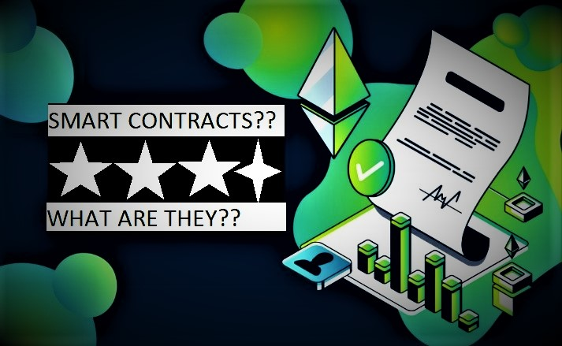
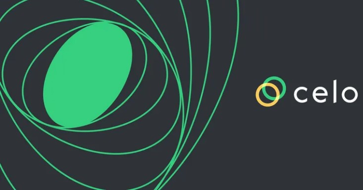
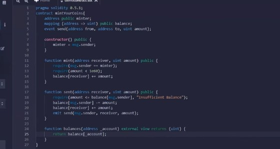

## CREATING SMART CONTRACTS FOR LIQUIDITY FARMING


Liquidity and smart contracts are essential parts of any financial system, liquidity describes how quickly financial assets can be converted into cash, while smart contracts represent decentralized financial agreements in the form of a computer program stored on the blockchain. The global adoption of blockchain technology has created and fueled the development of various prospective blockchain projects. Celo with one of such projects has created an Ethereum-compatible decentralized payment framework for easy access to financial instruments. 

### WHAT ARE SMART CONTRACTS?

Smart Contracts are decentralized agreements created between parties involved in any form of financial transaction, such as trading, investing, borrowing, and lending protocols, which will be the focus of this article. The application of Smart Contracts has however expanded to being implemented in health care, the transformation of corporate structures, and gaming applications.



Smart Contracts are simply computer programs written in the form of code and stored on a blockchain-based platform that run or trigger when certain existing conditions outlined in the program are met. Smart Contracts are used to automate the execution of a specific agreement so that all parties involved can be certain of the outcome instantly without the intervention of any user or intermediary, thus decentralizing. 

### WHAT IS LIQUIDITY FARMING?

Liquidity Farming enables crypto holders to stake their coins by depositing them into a lending protocol via a decentralized app, which is a digital application that runs on a blockchain network frequently built on the Ethereum platform, which is used for a variety of purposes, primarily finance and gaming.

Liquidity Farming involves depositing digital assets into a POOL with other crypto holders, these funds are then used to carry out smart contracts such as crypto lending, and crypto conversion, basically for faster transactions on the blockchain. Users who stake their assets or contribute to the liquidity pools are called LIQUIDITY PROVIDERS. People often interchange this with yield farming; they both describe a form of staking.

### WHAT IS A LIQUIDITY POOL?

A liquidity pool, simply put, is a bank for cryptocurrency. They play an important role in decentralized finance, and blockchain projects aiming to create an environment to support decentralization must be connected to a liquidity pool for survival. Liquidity pools are designed and secured by smart contracts per the specific requirement of the pool hence all exchanges happen automatically and the values of assets contained in the pool are constantly updated according to an automated protocol called AMM (AUTOMATED MARKET MAKERS)

Do note that this article does not serve as investment advice and it will be focused on the following key aspects;

Describing Smart Contracts that allow for liquidity farming    
Explaining the technical side of developing Smart Contracts that enable liquidity farming.
REMIX IDE

The Remix IDE is an important tool for developing Smart Contracts. It allows for a simple deployment process on any blockchain of your choice. Remix IDE is a no-setup tool with a Graphics based operating system interface. It is used by most developers, and it is going to be where you create and deploy your smart contracts going forward.

## SMART CONTRACTS THAT ALLOW FOR LIQUIDITY FARMING.



As earlier described, Smart Contracts are decentralized financial agreements outlined in a block of code. In contrast to the traditional buyers and sellers in the centralized financial market, where one party could easily betray the terms of an agreement, Smart Contract are designed such that they possess the ability to hold financial assets within a POOL, once the terms of the agreement in the contract have been met and verified, the contract is executed without authorization from any intermediary. Smart Contracts work by eliminating centralized financial intermediaries, thereby allowing participants to interact directly with one another. Users who engage in liquidity farming lend their assets by adding them to a smart contract.

Most Smart Contracts are written in Solidity which is one of the most commonly used programming languages for blockchain development, particularly for writing Smart Contracts designed to run on the Ethereum blockchain. 

A block of code written in Solidity is contained in contracts that reside at a specific address on the Ethereum blockchain.

Some other popular programming languages for writing Smart Contracts include WebAssembly, Rust, JavaScript, Vyper, and Yul.

Anyone can code Smart Contracts and install them on the network they were specifically designed for, all you need to do is learn how to code in a smart contract language.

So far, we have extensively covered the concept of Smart Contracts and their importance in Liquidity Farming. 

The rest of the tutorial is going to walk us through the technical side of building a Smart Contract that allows for Liquidity Farming using Solidity. 

### HOW DO SMART CONTRACTS WORK FOR LIQUIDITY FARMING?

Smart Contracts work by following simple if/when...then phrases encoded into blocks of code on a blockchain. These statements are going to describe the terms of an agreement regarding Liquidity Farming and assets held in a Liquidity Pool. An important attribute of these statements is that they are specific and objective. 

A network of computers executes these actions when the outlined statement is met. These actions could include releasing assets to the appropriate parties involved in a transaction, opening or closing orders at a predetermined price, sending messages and notifications, auctioning assets, or issuing a token. 

The blockchain is updated whenever a transaction is completed, which means the transactions cannot be altered, and only those who have been granted access to the results can see them.

Within a Smart Contract, there can be as many stipulations and precondition terms as required to reassure participants that the task will be completed satisfactorily. In cases where there could be possible exceptions to the rules overseeing the contract, a framework for resolving disputes is defined and the contract is developed. 

Before a Smart Contract can be executed on certain blockchains, usually Ethereum-compatible chains, it requires the payment of a transaction or gas fee for the contract to be deployed on the chain. The more transaction steps to be executed by the Smart Contract, the more transaction fee needed to execute the contract.

### THINGS TO NOTE WHILE DEVELOPING SMART CONTRACTS FOR LIQUIDITY FARMING:  

Knowledge of the appropriate programming language for the specific blockchain on which the contract is going to be deployed is required. Smart Contracts for Liquidity Farming are designed to automatically execute three types of transactions according to the agreement between the parties involved. 

1) Assemble and hold assets
1) Ensuring the payment of interest on assets after a certain period 
1) Imposing financial penalties if preconditional terms are not satisfied

A function is created for each of these listed items such that “when” a user contributes to the pool by staking their coins, they receive certain amounts highlighted in the code without external authorization, it is purely based on the agreement between the parties involved in the transaction. 

an “if” phrase to execute a true or false operation and branch out accordingly to satisfy the terms describing the type of asset being contributed to the pool. 

Smart Contracts are designed to be executed at any point in the future “when” the terms of an agreement have been met.



The picture above shows a design for a smart contract on the Remix IDE. 

### AN ILLUSTRATION; 

The following section describes an example of how to create a smart contract that allows for liquidity farming on the Ethereum blockchain using the Solidity programming language. 

This specific contract is for a liquidity farming mechanism, which allows users (referred to as "farmers") to deposit a stable coin (like USDC) and earn rewards for providing liquidity to a trading pair on a decentralized exchange.
The contract has several functions that allow farmers to deposit and withdraw their stablecoins, as well as create and remove liquidity pools. It also keeps track of the portfolio of each user, and which pools each user has created. The contract is designed so that only the owner of the contract can add or remove other users, and only users(farmers) can deposit and withdraw stable coins or create pools.
In simple terms, this code creates a way for users to earn rewards by providing liquidity to trading pairs on a decentralized exchange using a stable coin, with all the action being monitored by the smart contracts.


```solidity

enum Status {
  
  Success,
  
  Failure

}

interface StableCoin {
  
  function approve(address spender, uint value) public returns (Status);

  function transferFrom(address from, address to, uint value) public returns (Status);

  function transfer(address to, uint value) public returns (Status);

  function balanceOf(address owner) public view returns (uint);

}

mapping (address => uint) public farmers;

address public owner;

StableCoin public stableCoin;

constructor() public {

 owner = msg.sender;

}

function deposit() public payable {
  
  require(msg.value > 0, "Cannot deposit zero or negative value.");

  require(stableCoin.transfer(address(this), msg.value), "Transfer failed.");

  farmers[msg.sender] += msg.value;

}

function withdraw(uint value) public {

  require(value > 0, "Cannot withdraw zero or negative value.");

  require(farmers[msg.sender] >= value, "Insufficient balance.");

  require(stableCoin.transfer(msg.sender, value), "Transfer failed.");

  farmers[msg.sender] -= value;

}

function addFarmer(address farmer) public {

  require(msg.sender == owner, "Only the owner can add farmers.");

  require(farmer != address(0), "Invalid address.");

  farmers[farmer] = 0;

}

function removeFarmer(address farmer) public {
  
  require(msg.sender == owner, "Only the owner can remove farmers.");

  require(farmer != address(0), "Invalid address.");

  farmers[farmer] = 0;

}

function checkBalance(address farmer) public view returns (uint) {
  
  return farmers[farmer];

}

function setStableCoin(address \_stableCoin) public {
  
  require(msg.sender == owner, "Only the owner can set the stable coin.");
  
  require(\_stableCoin != address(0), "Invalid address.");
  
  stableCoin = StableCoin(\_stableCoin);
  
  require(stableCoin.approve(address(this), uint(-1)), "Approval failed.");
}

```

- As discussed in the previous section, a smart contract can be as simple as moving funds from one wallet to another or even more complex or advanced.


## Conclusion

Congratulations on coming this far in this tutorial, where we discussed certain terminologies in decentralized financial systems, including Liquidity, Liquidity Pools, Decentralized Apps, Liquidity Farming, and Smart Contracts, we also described the concept of smart contracts and the major role they will play in the future of blockchain technology. 

We have also covered the technical side of creating smart contracts that allow for liquidity farming. We have established that there are three main types of transactions these contracts are designed to execute and the requirements on how to create them. 

Going forward, it is important to familiarize yourself with the fundamentals of the required programming language and widen your horizons in this space. Smart Contracts could be as simple as moving assets from one wallet to another or the distribution of tokens to a user account, or they could be even more complex. Complex smart contracts contain more transaction steps, and it requires a certain level of technical know-how to create and deploy them. 

The two illustrations given in the closing section are relatively basic examples that, if applied in production, will require thorough testing and multiple security audits.

## About the Author

ADEWALE EMMANUEL 

is a crypto enthusiast and a Web 3.0 content creator. He is devoted to the mission of helping organizations with potential blockchain projects create educational content to attract and interest people in prospective decentralized financial infrastructures.

Connect with him on [Twitter through the link](https://twitter.com/Walemaths___?t=28jbNdJ5hBxGMRdS1JzXUQ&s=09)

## References​

Click here to find a demo tutorial video on [how to create a Smart Contract to be deployed on the Ethereum chain.](https://www.youtube.com/watch?v=nalMdCI_pv8&ab_channel=Simplilearn)  

