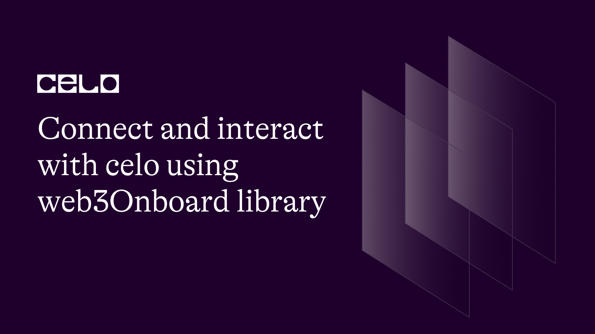
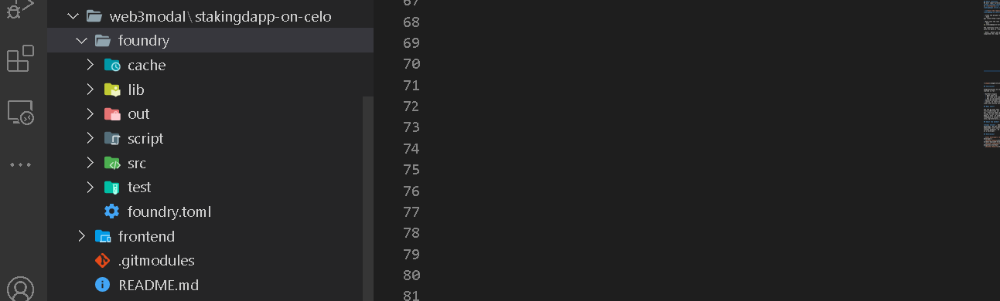
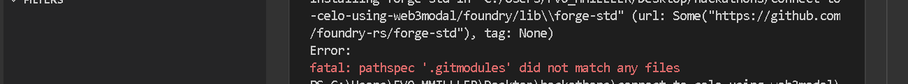
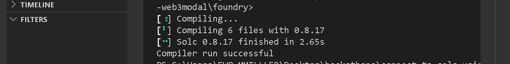
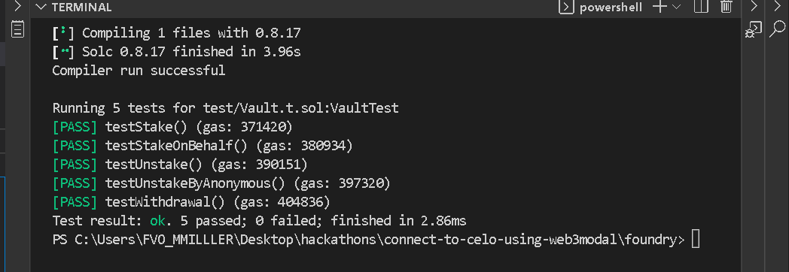
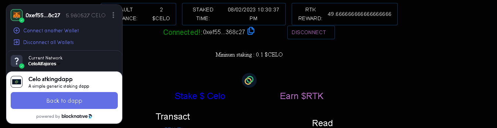

## Introduction

An essential feature of a blockchain-powered application is the ability to read and write to the blockchain. Unlike web2 databases, blockchains as immutable databases require agents that interface with them and the frontend. Such agents are called web3Provider. There are couple of them such as etherjs, web3js, web3Modal and so on.

## Prerequisites​

This tutorial will walk you through comprehensive guidelines and steps for connecting to the Celo blockchain  using web3Modal. Getting the most out of this cook requires that you are at the imtermediate level in the following skill sets:

- Solidity development
- Javascript
- Knowledge of typescript may be helpful
- Learn how to use foundry for smart contract development. Please refer to **[this artile](https://docs.celo.org/blog/tutorials/build-a-generic-staking-dapp-using-foundry-and-nextjs)** for complete tutorial.

## Requirements​

Before you proceed, be sure to have the following tools installed:

- For an editor. I recommend VSCode.
- NodeJs version >=14.0.0. I use version 18.12.1
- [Install foundry](https://docs.celo.org/blog/tutorials/build-a-generic-staking-dapp-using-foundry-and-nextjs).

**What we are building**

A simple generic staking dApp that enables $Celo holders commit their asset to the vault to earn the platform token - $RTK.
The dApp will be in two parts.

1. Smart contracts
2. Frontend

**Smart contracts**

We will import previous contracts that was used **[here](https://github.com/bobeu/stakingdapp-on-celo)**, deployed to Celo Alfajores. You can find the demo **[here](https://stakingdapp2.vercel.com)**.

- **[Visit the repository](https://github.com/bobeu/stakingdapp-on-celo)**.

- Clone the project.

```bash
git clone https://github.com/bobeu/stakingdapp-on-celo.git
```

- Navigate into the root folder.

```bash
cd stakingdapp-on-celo
```

The contracts files reside in the folder named 'foundry' with its path as 'stakingdapp-on-celo/foundry/src'.

> Note:  Before you proceed further, be sure to have completed the steps for setting up foundry **[here](https://docs.celo.org/blog/tutorials/build-a-generic-staking-dapp-using-foundry-and-nextjs)**.

On successful installation, your file structure should look like this:



- Remove everything under 'foundry/lib' folder. Then navigate into the foundry directory.

```bash
cd foundry
```

Run the command to install the forge standard library.

```bash
forge install --no-commit https://github.com/foundry-rs/forge-std

```

**Install Openzeppelin library**

```bash
forge install --no-commit https://github.com/OpenZeppelin/openzeppelin-contracts
```

>Note: You may experience an error depicted in the image below while running the aforelisted commands. Ignore it for now.



- Let's extend (without altering the initial behavior) the 'Vault' contract by adding a new feature that allows an account to stake or deposit to the vault on behalf of another account. The stake and earnings will be recorded in favor of the preset address. For now, only the account that was staked for can unstake for themselves.
Two files will be altered. 'IVault.sol' and 'Vault.sol'.

- Find **src/interfaces/IVault.sol** file and paste the code below the last function. This is simply a function declaration/interface for interacting with the main function that will be implemented in the 'Vault' contract.

```js
function stakeOnBehalf(address who) external returns(bool);
```

_src/interfaces/IVault.sol_


**src/Vault.sol**

In this file, we need to make a few twists to avoid function redundancy. Since we want to add a new 'stake' function that allows an account to stake on behalf of another, that sounds like we need another function that registers deposit in the vault. It would be better if we could reuse the content of existing `stake` function rather than repeating same set of code. The stake function has obvious similarities with just a difference. Make the following adjustment in the `Vault.sol` file.

- Create a new function named "_stake()" with visibilty set to private and return type is boolean. It should accept two arguments:
  - An address.
  - A Value of type 'uint256'.

```js
// > ...
  ///@dev deposit $Celo to vault
  function _stake(address who, uint value) private returns(bool){
    // code here
  }
// > ...
```

- Transfer the contents of existing _stake()_ function to the newly-created _stake(address who, uint value)_ function. Thereafter, replace wherever _msg.sender_ appears with _who_, and _msg.value_ with _value_.

```js
// > ...
  ///@dev deposit $Celo to vault
  function stake() public payable override returns(bool) {
    
  }
// > ...
```

```js
// > ...
  ///@dev deposit $Celo to vault
  function _stake(address who, uint value) private returns(bool){
    address alc;
    Staker memory stk = _getStakeProfile(who);
    if(value < minimumStaking) revert ZeroValue(value);
    alc = stk.account;
    if(alc == address(0)) {
      alc = address(new Account(token));
    }

    if(stk.celoAmount > 0) {
      _unstake(alc, stk.celoAmount, stk.depositTime);
    }
    vault[who] = Staker(_now(), value, alc);
    stakers ++;
    emit Staked(value);

    return true;
  }
// > ...
```

- The existing _stake_ function should be empty by now. To make the function retain previous behavior, replace the function with the code below.

```js
// > ...
  ///@dev deposit $Celo to vault
  function stake() public payable override returns(bool) {
      return _stake(msg.sender, msg.value);
  }
// > ...
```

- Create another function named _stakeOnBehalf()_ with an address parameter. If Bob wants to stake on behalf of Alice, they only need to give Alice's address and specify the amount on the frontend as msg.value. We then call the _stake()_ and supply the address and amount as arguments.

```js
  ///@dev Stake on behalf of @param who Account to stake for
  function stakeOnBehalf(address who) public payable override returns(bool){
    require(msg.sender != who, "please use designated function");
    return _stake(who, msg.value);
  }
```

With the new twists, we achieve compatibility with previous version. Now we have a new version of the Vault contract.

**Compiling the contracts**

```bash
forge build
```

_Compile successful_



**Testing**

Before running the test command, we need to write test for a new feature we just introduced in the Vault contract. With the current state of the test file in `foundry/test/Vault.t.sol`, there is only one interactive account - _VaultTest_. This account will act as the account staking on behalf of other account. For the other account, we will create a separate contract to represent account that is staked for. Just above the existing contract, paste the following code.

```js
contract AnonymousStaker is Test {
  Vault public vaultContract;
  RewardToken public token;
  uint stakeAmt = 1e20 wei;

  constructor(Vault _vault, RewardToken _token) {
    if(address(_vault) == address(0)) revert("Vault is zero address");
    vaultContract = _vault;
    token = _token;
  }

  function confirmStake(uint depositTime) public {
    IVault.Staker memory stk = vaultContract.getStakeProfile();
    assertEq(stk.depositTime, depositTime);
    assertEq(stk.celoAmount, stakeAmt);
    if(stk.account == address(0)) revert ("Zero address");
    assertEq(token.balanceOf(stk.account), 0);
  }
  
  function unstake() public {
    require(vaultContract.unstake(), "Failed");
    IVault.Staker memory stk = vaultContract.getStakeProfile();
    require(stk.account != address(0), "Zero alc");
    require(token.balanceOf(stk.account) == 1e15, "Zero token reward");
    assertEq(stk.celoAmount, 0);

  }
}
```

> Note : Since the above account is not responsible for performing the staking task, we will not have a function for it. But 'unstake' is initiated from it.

We then add two new functions in the main tester account - _VaultTest.sol_ to test the new feature.

```js
> ...
function testStakeOnBehalf() public {
    uint depositTime = block.timestamp;
    (bool doneStaking) = vault.stakeOnBehalf{value: stakeAmt}(address(anstk));
    assertEq(doneStaking, true);
    anstk.confirmStake(depositTime);
  }

  function testUnstake() public {
    uint initbal = address(this).balance;
    require(vault.stake{value: stakeAmt}(), "Staking failed");
    assertEq(address(this).balance, initbal - stakeAmt);
    require(vault.unstake(), "Failed");
    IVault.Staker memory stk = vault.getStakeProfile();
    require(stk.account != address(0), "Zero alc");
    require(token.balanceOf(stk.account) == 1e15, "Zero token reward");
    assertEq(stk.celoAmount, 0);
  }
// > ...
```

Now, run the command, and the test should pass as expected.

```bash
forge test
```



## Frontend

We will edit and twist the previous project to give us what we want.
Navigate back to project directory we previously clone **[here](https://github.com/bobeu/stakingdapp-on-celo.git)** and again into 'frontend' until you're in the root folder - `stakingdapp-on-celo/frontend`.

**Install dependencies**

```bash
yarn install
```

Our focus is to have a simple user interface that can interact with our contracts. The current backend uses pure 'etherjs' and the injected browser wallet - **Metamask** as the only provider to interact with the Celo blockchain. Since this tutorial aims to show how to use web3Onboard instead, we will go through the following steps.

**What is web3Onboard**

It is a single web3 provider for almost all ethereum-compatible wallets. That is, bringing mutiple web3 providers to a single spot. Web3Modal helps web3 developers to easily onboard users to decentralized applications, switching between blockchain networks, unified wallets interface,  a conveinient interface for watching balances, switch between networks, disconnect wallets, notification support, and so on.

Having a single provider in your dapp could amount to a single point of failure if the provider experience a downtime. One of the benefits of web3Onboard is to provider a smooth web3 experience while interacting with a blockchain-based application. It supports varieties of wallets such as Gnosis safe, Brave wallet, Tally and so on, with 'Metamask' as the default injected wallet. An interesting part is that each of the supported wallets i.e providers can be installed as a standalone package/plugin for web3Onboard. However, you are free to implement whichever wallet (s) fit your need. For this tutorial, we will implement three (3) providers: Metamask, WalletConnect and Coinbase wallet, and each of them will provide us similar functionalities especially interacting with the Celo testnet blockchain.

>Note : If you're not using blockchain provider such as Moralis,  you either use web3js or etherjs. But I have chosen etherjs for its lightweight capability. Although, in some cases, I prefer using web3js utils to its competitor.

**Installation**

Install Web3Onboard along with 3 provider packages:

- Coinbase Wallet SDK
- WalletConnect SDK, and
- Injected Wallet SDK

Run:

```bash
yarn add "@web3-onboard/coinbase" "@web3-onboard/core" "@web3-onboard/injected-wallets" "@web3-onboard/react" "@web3-onboard/walletconnect"
```

Create a new folder under 'frontend/components/apis' named 'web3Onboard'. Then a file - 'setup.ts'.

```bash
mkdir frontend/components/apis/web3Onboard
touch frontend/components/apis/web3Onboard/setup.ts
```

**setUp.tx**

To get the full experience, you might want to install coinbase and Metamask browser extensions if you don't already have them.

1. Add coinbase **[wallet extension](https://chrome.google.com/webstore/detail/coinbase-wallet-extension/hnfanknocfeofbddgcijnmhnfnkdnaad?hl=en)**

2. Add **[Metamask](https://chrome.google.com/webstore/detail/metamask/nkbihfbeogaeaoehlefnkodbefgpgknn)**

- Import the required modules.

```ts
import { init } from "@web3-onboard/react";
import injectedModule from "@web3-onboard/injected-wallets";
import coinbaseWallet from "@web3-onboard/coinbase";
import walletConnectModule from "@web3-onboard/walletconnect";
import { ChainParams } from "@/interfaces";
import { ethers } from "ethers";
```

- Activate the sdks and fetch the API key. To get your API key, Go to your **[blocknative dashboard](https://explorer.blocknative.com)**. Using the key gives us access to more features.

```ts
>...
const API_KEY = process.env.BLOCKNATIVE_API_KEY
const injected = injectedModule();
const coinbase = coinbaseWallet();
const walletconnect = walletConnectModule();
```

- Set up requires that we intialize with a list of network or chain that the web3Onboard with connect our dapp to. In this case, we only want Alfajores. The expected data type for the chain Id is `string`. Alfajores' chainId is `44787`. Let's quickly create a utility that can help us convert it to a hexadecimals value in string format using etherJs 'hexlify'function.

```ts
> ...
// Converts chain id in number mode to hex value
export function hexlify(chainid: number) {
  return ethers.utils.hexValue(chainid);
}
```

- Set up the network list.

```ts
> ...
const ALFAJORES: ChainParams = {
  key: 1,
  icon: '/celologopng.png',
  chainIdStr: hexlify(44787),
  chainName: "CeloAlfajores",
  rpcUrls: ["https://alfajores-forno.celo-testnet.org"],
  nativeCurrency: { name: "CELO", decimals: 18, symbol: "CELO" },
  blockExplorerUrls: ["https://explorer.celo.org"],
  iconUrls: [""]
};

const CHAINS = [
  {
    id: ALFAJORES.chainIdStr,
    token: ALFAJORES.nativeCurrency.name,
    label: ALFAJORES.chainName,
    rpcUrl: ALFAJORES.rpcUrls[0],
  }
]
```

- We initialize and web3Onboard instance. We need it inside `pages/index.tsx`

>Note: `celologopng.png` resides in the public folder.

```ts
export const web3Onboard = init({
  wallets: [injected, coinbase, walletconnect],
  chains: [...CHAINS],
  apiKey: API_KEY,
  appMetadata: {
    name: "Celo stkingdapp",
    icon: "celologopng.png",
    logo: "celologopng.png",
    description: "A simple generic staking dapp",
    recommendedInjectedWallets:[
      {name: 'Coinbase', url: "https://wallet.coinbase.com"},
      {name: 'Metamask', url: "https://metamask.io"}
    ],
  },
  accountCenter: {
    desktop: {
      position: 'topLeft',
      enabled: true,
      minimal: false
    },
    mobile: {
      enabled: true,
      minimal: false,
      position: 'topRight'
    }
  },
  notify: {
    position: "bottomRight",
    transactionHandler: transaction => {
      console.log({ transaction })
      if (transaction.eventCode === 'txPool') {
        return {
          autoDismiss: 0,
          onClick: () =>
            window.open(`${ALFAJORES.blockExplorerUrls[0]}/tx/${transaction.hash}`)
        }
      }
    }
  },
});
```

The above code is a typical web3Onboard setup. We created a new instance of the package using `init()` imported from `@web3-onboard/react`. The instance is initialized when the application is mounted. This is necessary so we can use a few hooks provided by "@web3-onboard/react" anywhere in our application.

The `init()` method initializes and maintain a separate state for our dapp which we can subscribe to. It then construct a new object containing utility APIs we need to onboard users and do other tasks.

> Note: Log the instance to the console to examine the contents. It gives an overview of what to do with the feedback.

**pages/index.tsx - (changes)**

- Import required modules

```ts
import LandingPage from "../components/LandingPage";
import { useConnectWallet, useSetChain, useWallets } from "@web3-onboard/react";
import { web3Onboard } from "@/components/apis/web3Onboard/setup";
```

- Inside the 'Home' component, we import the `useConnectWallet` hook from the `@web3-onboard/react` library. Through array destructuring, we extracted `connect` and `disconnect` functions to authenticate and log them out of the dApp.

```ts
export default function Home() {
  const [isUserAuthenticated, setAuthentication] = React.useState<boolean>(false);

  const [, connect, , disconnect] = useConnectWallet();

  return <>{!isUserAuthenticated ? <LandingPage isUserAuthenticated={isUserAuthenticated} handleConnect={handleConnect} /> : <App logout={logout} reconnect={connect} />}</>;
}
```

- Create a function to properly ask for permission to connect to user's wallet. Place it inside the component. If the step is successful, only then can we display the app to the user. Users are presented with three wallet options. We could make the dApp to remember user's last connected wallet or connect to a specific wallet. Visit the **[official documentation](https://www.npmjs.com/packages/@web3-onboard/core)** to learn more about.

```ts
//>...
  async function handleConnect() {
    if (isUserAuthenticated) return;
    try {
      await web3Onboard?.connectWallet().then(walletStates => {
        if (walletStates.length) {
          setAuthentication(true);
        }
      });
    } catch (error) {
      console.log("Connect Error", error);
    }
  }
```


- Create a logout function that signs user out of the dapp when they explicitly call it. Their wallets are not completely logged out. The library provides us with an interface that does a few things like:
  - Disconnect all user's wallets from the dapp.
  - Connect another wallet.
  - Display information about the dapp to users.
  - Display Celo balances.
  - Display wallet address.
  - Copy address.
  - Display current connected chain/network.
  - Switch between available networks

```ts
// >...
  async function logout() {
    if (!isUserAuthenticated) throw new Error("User not authenticated");
    await disconnect().then(() => {
      setAuthentication(false);
    });
  }
```



Your `pages/index.tsx` should look like this.

```ts
import React from "react";
import App from "../components/App";
import LandingPage from "../components/LandingPage";
import { useConnectWallet, useSetChain, useWallets } from "@web3-onboard/react";
import { web3Onboard } from "@/components/apis/web3Onboard/setup";

export default function Home() {
  const [isUserAuthenticated, setAuthentication] = React.useState<boolean>(false);

  const [, connect, , disconnect] = useConnectWallet();

  async function handleConnect() {
    if (isUserAuthenticated) return;
    try {
      await web3Onboard?.connectWallet().then(walletStates => {
        if (walletStates.length) {
          setAuthentication(true);
        }
      });
    } catch (error) {
      console.log("Connect Error", error);
    }
  }

  async function logout() {
    if (!isUserAuthenticated) throw new Error("User not authenticated");
    await disconnect().then(() => {
      setAuthentication(false);
    });
  }

  return <>{!isUserAuthenticated ? <LandingPage isUserAuthenticated={isUserAuthenticated} handleConnect={handleConnect} /> : <App logout={logout} reconnect={connect} />}</>;
}
```

**components/ConnectButton.tsx**

Make a new file name `ConnectButton.tsx` inside `components` folder. We are simply separating the 'Button' component as against what we currently have in `components/LandingPage.tsx`.

Since we already initialized web3Onboard, we can use any of the `@web3-onboard/react` hook anywhere in the application. Since connecting users' wallet is done via an asynchronous function, the 'connecting' property returned by the 'useConnectWallet' hook helps us deactivate the connectButton when the connection has been invoked but not yet ready so users don't continiously click the button.

```ts
import React from "react";
import { Button, Typography } from "@mui/material";
import { ConnectButtonProp } from "../interfaces";
import { useConnectWallet } from "@web3-onboard/react";
import { green } from "@mui/material/colors";

function ConnectButton(props: ConnectButtonProp) {
  const [{ connecting }, ] = useConnectWallet();

  const { connect } = props;

  return (
    <Button 
      disabled={connecting} 
      sx={{
        width: '50%',
        height: '120px',
        border: '0.1em solid purple',
        color: green[400],
        borderRadius: '6px',
        textAnchor: 'start',
      }} 
      variant="text" onClick={async() => await connect() }
      className='connectButton'
    >
      <Typography variant={"h6"} >Connect Wallet</Typography>
    </Button>
  );
}

export default ConnectButton;
```

**components/LandingPage.tsx**

Import the ConnectButton into the `LandingPage.tsx` and the new code should look thus:

```ts
import React, { useState} from "react";
import Typography from "@mui/material/Typography";
import Container from "@mui/material/Container";
import { PageProps } from "@/interfaces";
import { green, purple } from "@mui/material/colors";
import Footer from "./Footer";
import Link from "@mui/material/Link";
import Stack from "@mui/material/Stack";
import ConnectButton from "./ConnectButton";

export default function LandingPage(props: PageProps) {
  const { handleConnect } = props;

  return (
    <React.Fragment>
      <Container maxWidth='md'>
        <div className="topDiv">
          <Stack className="divHeader" textAlign={"revert-layer"} >
            <Typography component={"main"} variant="h2">Celo StakeVerse V2</Typography>
            <Typography component={"main"} variant="h3">Stake Celo to earn RTK Token</Typography>
            <Typography component={"main"} variant="h5">Made by <span>
              <Link color="inherit" href="https://github.com/bobeu" style={{color: green[600]}}>
                Isaac Jesse 
              </Link> a.k.a Bobelr | Bobeu</span>
            </Typography>
            <Link color="inherit" href="https://github.com/bobeu/stakingdapp-on-celo" style={{color: purple[700]}}>
              Source code
            </Link>
          </Stack>
          <div className="divHeader"></div>
          <div className="lowerDiv">
            <ConnectButton connect={handleConnect} />
          </div>
        </div>
      </Container>
      <Footer sx={{ mt: 8, mb: 4 }} />
    </React.Fragment>
  );
}
```

**components/App.tsx** -

- Lastly, modify the `components/App.tsx` file to reflect our changes. The following are the important changes I have made to the file.

- We call the 'useWallets' hook to get the currently connectedWallet.
- `handleAccountChange` updated the account address when `stakeOnBehalf` is invoked. The function requires an address as argument hence 'handleAccountChange'.
- Modify the `displayContractFunctions` function to display `stakeOnBehalf` contract function from the ABI.
- We extract the provider from the current connected wallet.
- Add a new `stake` function to avoid code redundancy in the switch statement.
- Modify the first case in the switch statement.
- Add a new case to the switch statement to handle `stakeOnBehalf` when it is called.
- Add a new `TextField` component to take 'account' address from user.

```ts
import React, { useMemo, Key } from "react";
import Avatar from "@mui/material/Avatar";
import Button from "@mui/material/Button";
import TextField from "@mui/material/TextField";
import Box from "@mui/material/Box";
import AppBar from "@mui/material/AppBar";
import Toolbar from "@mui/material/Toolbar";
import Typography from "@mui/material/Typography";
import Container from "@mui/material/Container";
import Footer from "../components/Footer";
import { notification } from "antd";
import getContractData from "../components/apis/contractdata";
import { Address } from "./Address";
import { AppProps, MockProfile, NotificationProps, TransactionResultProp } from "../interfaces";
import { blue, purple } from "@mui/material/colors";
import sendtransaction from "./apis";
import { ethers } from "ethers";
import BigNumber from "bignumber.js";
import { Spinner } from "./Spinner";
import Web3 from "web3";
import Image from "next/image";
import { useWallets } from '@web3-onboard/react';

const boxStyle = {
  profile_style: {
    display: 'flex',
    justifyContent: 'center',
    gap: 2,
    alignItems: 'center',
    width: 'fit-content',
  },
  topButton: {
    color: 'whitesmoke',
    width: 'fit-content',
    // background: purple[300],
    // color: green[500]
  }
}

const ZERO_ACCOUNT = `0x${'0'.repeat(40)}`;

function getTimeFromEpoch(onchainUnixTime:BigNumber) {
  const toNumber = onchainUnixTime? onchainUnixTime.toNumber() : 0;
  var newDate = new Date(toNumber * 1000);
  return `${newDate.toLocaleDateString("en-GB")} ${newDate.toLocaleTimeString("en-US")}`;
}

export default function App(props: AppProps) {
  const [functionName, setFunctionName] = React.useState<string>("stake");
  const [amountToStake, setAmountToStake] = React.useState<number>(0);
  const [tokenRewardBalance, setReward] = React.useState<any>(BigNumber('0.00'));
  const [response, setResponse] = React.useState<any>(MockProfile);
  const [loading, setLoading] = React.useState<boolean>(false);
  const [accountFor, setAccount] = React.useState<string>('');

  const connectedWallets = useWallets();
  const account = connectedWallets.length? connectedWallets[0].accounts[0].address : ZERO_ACCOUNT;
  const provider = connectedWallets[0]?.provider;
  const { vaultAbi } = getContractData();
  const { logout, reconnect } = props;

  const handleAmountChange = (e: React.ChangeEvent<HTMLTextAreaElement | HTMLInputElement>) => {
    e.preventDefault();
    setAmountToStake(Number(e.target.value));
  };

  const handleAccountChange = (e: React.ChangeEvent<HTMLTextAreaElement | HTMLInputElement>) => {
    e.preventDefault();
    setAccount(e.target.value);
  };

  const cancelLoading = () => setLoading(false);

  React.useEffect(() => {
    const abortProcess = new AbortController();
    async function getTokenBalance() {
      if(account && provider) {
        const res :TransactionResultProp = await sendtransaction({
          account: account, 
          functionName: 'balance', 
          cancelLoading: cancelLoading,
          provider: provider
        });
        setReward(res.read);
      }
    }

    getTokenBalance();
    return () => abortProcess.abort();
  }, [response, account]);

  const handleContractFunction = (x: string) => setFunctionName(x);

  const displayContractFunctions = useMemo(() => {
    let filt: any;
    if (!vaultAbi) return [];
    filt = vaultAbi.filter(method => method["type"] === "function");
    return filt.filter((method: { name: string }) => method.name === "stake" || method.name === "unstake" || method.name === "stakeOnBehalf");
  }, [vaultAbi]);

  const displayedViewFunctions = useMemo(() => {
    let filtered: any;
    if (!vaultAbi) return [];
    filtered = vaultAbi.filter(method => method["type"] === "function");
    return filtered.filter((method: { name: string }) => method.name === "getStakeProfile" || method.name === "withdraw");
  }, [vaultAbi]);

  const openNotification = (props: NotificationProps) => {
    const { message, description } = props;

    notification.open({
      placement: "bottomRight",
      message,
      description,
      onClick: () => {
        console.log(`Notification Clicked!`);
      }
    });
  };

  async function stake(address?: string): Promise<TransactionResultProp> {
    if (amountToStake === 0) {
      const msg = "Please enter amount of Celo to stake in wei";
      cancelLoading();
      alert(msg);
      throw new Error(msg);
    }
    if(!provider) alert('Wallet not ready');
    const amtInBigNumber = BigNumber(amountToStake);
    const value = ethers.utils.hexValue(ethers.utils.parseUnits(amtInBigNumber.toString()));
    return await sendtransaction({ 
      value: value, 
      functionName: functionName, 
      cancelLoading: cancelLoading,
      who: address,
      provider: provider
    });
  }

  const handleSubmit = async (event: React.FormEvent<HTMLFormElement>) => {
    event.preventDefault();
    let result: TransactionResultProp;
    setLoading(true);

    switch (functionName) {
      case 'stake':
        result = await stake();
        break;

      case 'stakeOnBehalf':
        if(!accountFor) return null;
        result = await stake(accountFor);
        break;

      case "unstake":
        result = await sendtransaction({
          functionName: functionName,
          cancelLoading: cancelLoading,
          provider: provider
        });
        break;

      case 'getStakeProfile':
        result = await sendtransaction({
          functionName: functionName,
          cancelLoading: cancelLoading,
          provider: provider
        });
        break;

      default:
        result = await sendtransaction({
          functionName: "withdraw",
          cancelLoading: cancelLoading,
          provider: provider
        });
        break;
    }
    if(result?.view === false) {
      openNotification({message: `Transaction completed with hash:`, description: result?.receipt.transactionHash});
    } else {
      setResponse(result?.read);
    }
  };

  return (
    <React.Fragment>
      <Container maxWidth='md' component={'main'}>
        <AppBar position="static" sx={{background:'none'}}>
          <Toolbar sx={boxStyle.profile_style}>
            {/* <Box sx={boxStyle.profile_style}> */}
              <Button variant="outlined" style={boxStyle.topButton} startIcon='Vault Balance:' endIcon={`${response?.account ? Web3.utils.fromWei(response?.celoAmount?.toString()) : 0} ${' $Celo'}`} />
              <Button variant="outlined" style={boxStyle.topButton} startIcon='Staked time:' endIcon={getTimeFromEpoch(response?.depositTime)} />
              <Button variant="outlined" style={boxStyle.topButton} startIcon='RTK Reward:' >{Web3.utils.fromWei(tokenRewardBalance.toString())}</Button>
            {/* </Box> */}
          </Toolbar>
        </AppBar>
      </Container>
      <Container maxWidth='sm' component={'main'} sx={{placeItems: 'center'}}>
        <Box sx={{
          display: 'flex',
          justifyContent: 'space-around',
          alignItems: 'center'
        }}>
          <Typography variant="h6" component="div" sx={{ display: 'flex', justifyContent: 'space-around', alignItems:'center'}}>
            <span style={{color: 'green'}}>Connected!:</span> <Address account={account} size={6} copyable={true} display />
          </Typography>
          <Button 
            sx={{
              color: account !== ZERO_ACCOUNT? purple[300] : 'white'
            }}
            startIcon={
              account !== ZERO_ACCOUNT? 'Disconnect' : 'Reconnect'
            } 
            variant='outlined' 
            onClick={
              async() => {
                if(connectedWallets.length) {
                  await logout();
                } else {
                  await reconnect();
                }
              }
            } 
          />
        </Box>
        <Box
          sx={{
            marginTop: 8,
            display: "grid",
            // flexDirection: "column",
            alignItems: "center"
          }}
        >
          <div className="marquee">
            <p className='inner' > Mininum staking : 0.1 $CELO </p>
          </div>
          <div style={{display: 'flex', justifyContent: 'center'}}>
            <Avatar sx={{ m: 1,}}>
              <Image src='/celologopng.png' width={100} height={40} alt='celoLogo'/>
            </Avatar>
          </div>
          <Typography component="h1" variant="h5" sx={{display: 'flex',justifyContent: 'space-around'}}>
            <span style={{color: 'blue'}}>Stake $ Celo</span> <span style={{color: purple[300]}}> Earn $RTK</span>
          </Typography>
          <Box component="form" onSubmit={handleSubmit} noValidate sx={{ mt: 1 }}>
            <Box
              sx={{
                marginTop: 2,
                display: "flex",
                justifyContent: "space-between",
                alignItems: "center"
              }}
            >
              <div className="funcDiv">
                <Typography variant="h5">Transact</Typography>
                {displayContractFunctions.map((item: any, id: Key) => (
                  <Button
                    sx={{
                      "&:hover": {
                        color: "whitesmoke",
                        width: "fit-content",
                        border: `0.1em solid ${purple[900]}`
                      }
                    }}
                    onClick={() => handleContractFunction(item.name)}
                    key={id}
                    variant={"text"}
                  >
                    {item?.name}
                  </Button>
                ))}
              </div>
              <div className="funcDiv">
                <Typography variant="h5">Read</Typography>
                {displayedViewFunctions.map((item: any, id: Key) => (
                  <Button
                    sx={{
                      "&:hover": {
                        color: "whitesmoke",
                        width: "fit-content",
                        border: `0.1em solid ${purple[900]}`
                      }
                    }}
                    onClick={() => handleContractFunction(item?.name)}
                    key={id}
                    variant={"text"}
                  >
                    {item?.name}
                  </Button>
                ))}
              </div>
            </Box>
            {(functionName === "stake" || functionName === "stakeOnBehalf") && <TextField margin="normal" required fullWidth id="text" label="Amount to stake" name="amount" autoComplete="amount" type={"number"} autoFocus sx={{ border: `0.1em solid ${blue[900]}`, borderRadius: "5px" }} style={{ color: "whitesmoke" }} onChange={(e) => handleAmountChange(e)} />}
            {functionName === "stakeOnBehalf" && <TextField margin="normal" required fullWidth id="text" label="Account to stake for" name="amount" autoComplete="account" type={"text"} autoFocus sx={{ border: `0.1em solid ${blue[900]}`, borderRadius: "5px" }} style={{ color: "whitesmoke" }} onChange={(e) => handleAccountChange(e)} />}
            <Button
              type="submit"
              fullWidth
              variant="contained"
              sx={{
                mt: 3,
                mb: 2,
                height: '100px',
                fontWeight: "bold",
                display: 'flex',
                justifyContent: 'center',
                alignItems: 'center',
                background: purple[300]
              }}
            >
              { loading? <span>Trxn in Progress ... <Spinner color={"white"} /></span> : functionName }
            </Button>
          </Box>
        </Box>
      </Container>
      <Footer sx={{ mt: 8, mb: 4 }} />
    </React.Fragment>
  );
}
```

**components/api/contractdata.ts**

Update this file with the latest contract addresses from the last deployment we made.

```ts
import vault from "../../../foundry/out/Vault.sol/Vault.json";
import token from "../../../foundry/out/RewardToken.sol/RewardToken.json";

export default function getContractData() {
  return {
    vaultAbi: vault.abi,
    tokenAbi: token.abi,
    vaultAddr: "0x89330624480dE7Fc2e651233B022B85a1F998de7", //<===
    tokenAddr: "0xefA906f63ea950318d8d5Af13ae2E5D2aC221Fe4" //<===
  }
}
```

**components/api/index.ts - (changes)**

- Import required modules/files. Replace all imports in the current 'api/index.ts' file with ones below.

> Note: Web3Onboard returns Ethereum's EIP1193 compatible provider which we will wrap in etherjs's to get the web3 provider we need to broadcast transaction to Celo's testnet.

```bash
import getContractData from "./contractdata"; 
import { InstanceProps, OptionProps, Profile, transactionResult } from "@/interfaces";
import { ethers, Contract, ContractReceipt } from "ethers";
import { EIP1193Provider } from "@web3-onboard/core";
```

- Create a function that accepts any valid external provider and return a valid web3 provider.

```ts
// Return ether's web3 provider
function wrappedProvider(provider: EIP1193Provider) {
  if (!provider) alert('Provider not ready');
  return new ethers.providers.Web3Provider(provider, 'any');
}
```

- The next function returns contract instances with provider and signer capabilities. A contract instance with provider property present can only allow us read from the blockchain but not to send transaction capable of modifying the state of the blockchain while an instance with signer capability can read from the blockchain and modify it through valid transaction.

> Note: Contract instance with provider property is enough to read from the blockchain.

```ts
// get contract instances
function contractInstances(props: InstanceProps) {
  const { tokenAbi, vaultAbi, tokenAddr,vaultAddr, provider } = props;
  if(!provider) alert('Provider not ready');
  const vault_ins = new Contract(vaultAddr, vaultAbi, wrappedProvider(provider).getSigner());
  const vault_ins_noSigner = new Contract(vaultAddr, vaultAbi, wrappedProvider(provider));
  const token_ins = new Contract(tokenAddr, tokenAbi, wrappedProvider(provider).getSigner());
  const token_ins_noSigner = new Contract(tokenAddr, tokenAbi, wrappedProvider(provider));

  return { vault_ins, token_ins, vault_ins_noSigner, token_ins_noSigner }
}
```

- The next function accepts an object as argument with a property - 'functioname' of type `string`. We use a switch statement that run the desired function based on the truth established between each of the cases and the functionName. Simply put, each of the cases in the switch statement runs if the entry macthes the functionName.

> Note: We wait for at least two block confirmation before updating the user about their transaction status.

```ts
async function sendtransaction(options: OptionProps) {
  const { provider, cancelLoading, functionName, value, account, who } = options;
  const { vaultAbi, tokenAbi, vaultAddr, tokenAddr } = getContractData();
  const { vault_ins, token_ins_noSigner } = contractInstances({
    vaultAbi,
    tokenAbi,
    vaultAddr,
    tokenAddr,
    provider
  })

  let result = transactionResult;
  try {
    switch (functionName) {
      case 'stake':
        const txn = await vault_ins.stake({value: value });
        // const txn = await vault_ins.setToken(tokenAddr);
        await txn?.wait(2).then((rec: ContractReceipt) => {
          result.receipt = rec;
          result.view = false;
          if(cancelLoading) cancelLoading();
        });
        break;

      case 'stakeOnBehalf':
        const txn_1 = await vault_ins.stakeOnBehalf(who, {value: value });
        await txn_1?.wait(2).then((rec: ContractReceipt) => {
          result.receipt = rec;
          result.view = false;
          if(cancelLoading) cancelLoading();
        });
        break;
      
      case 'unstake':
        const txn2 = await vault_ins.unstake();
        await txn2?.wait(2).then((rec: ContractReceipt) => {
          result.receipt = rec;
          result.view = false;
          if(cancelLoading) cancelLoading();
        });
        break;

      case 'withdraw':
        const txn3 = await vault_ins.withdraw();
        await txn3?.wait(2).then((rec: ContractReceipt) => {
          result.receipt = rec;
          result.view = false;
          if(cancelLoading) cancelLoading();
        });
        break;

      case 'getStakeProfile':
        await vault_ins.getStakeProfile().then((res: Profile) => {
          result.read = res;
          result.view = true;
          if(cancelLoading) cancelLoading();
        });
        break;

      case 'balance':
        await token_ins_noSigner.balanceOf(account).then((res: ethers.BigNumber) => {
          result.read = res;
          result.view = true;
          if(cancelLoading) cancelLoading();
        });
      break;

      default:
        break;
      }
      
    } catch (error: any) {
      if(cancelLoading) cancelLoading();
      if(error){
        if(error.data?.code === -32000) alert("Please fund your wallet with test Celo from https://faucet.celo.org");
      }
    }
  return result;
};

export default sendtransaction;
```

## Conclusion​

Thumbs up for seeing it to the end. So far, we have learned:

- Writing, compiling, deploying and testing smart contracts using foundry.
- How to install and set up web3Onboard library.
- How to build a simple frontend and connect the backend.
- Manage your dApp using web3Onboard.

## What next?

​
You can edit the code to your taste. At this point, you should be able to launch your own project as Celo developer. If you are confused anywhere in the tutorial, I left a link to the full source code at the _references_ section. Go over it as many times as you can. In no time, you will get a good grasp. Celo is EVM-compatible blockchain. You can leverage the various web3 tools to build your dream application. Get started with **[Celo documentation](https://docs.celo.org/tutorials)**

## About the Author​

**Isaac Jesse** , aka _Bobelr_ is a smart contract/Web3 developer. He has been in the field since 2018, worked as an ambassador with several projects like Algorand and so on as content producer. He has also contributed to Web3 projects as a developer.

## References​

- [Celo developers resources](https://docs.celo.org/developer/)
- [Web3Onbaord doc](https://onboard.blocknative.com)
- [Official doc](https://www.npmjs.com/packages/@web3-onboard/core)
- [Source code](https://github.com/bobeu/connect-to-celo-using-web3onboard-library)
- [Demo](https://connect-to-celo-using-web3onboard-library.vercel.app/)
