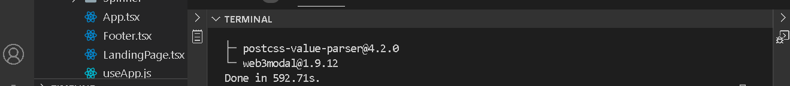

# Introduction

An essential feature of a blockchain-powered application is the ability to read and write to the blockchain. Unlike web2 databases, blockchains as immutable databases require agents that interface with them and the frontend. Such agents are called web3Provider. There are couple of them such as etherjs, web3js, web3Modal and so on.

# Prerequisites​
In this tutorial, I will walk you through comprehensive guidelines and steps for connecting to the Celo blockchain  using web3Modal. Getting the most out of this cook requires that you are at the imtermediate level in the following skill sets:

- Solidity development
- Javascript
- Knowledge of typescript may be helpful
- Learn how to use foundry for smart contract development. Please refer to **[this artile]()** for complete tutorial.

# Requirements​

Before you proceed, be sure to have the following tools installed:

- For an editor. I recommend VSCode.
- NodeJs version >=14.0.0. I use version 18.12.1
- [Install foundry]().

## What we are building
A staking dApp that enables $Celo holders to commit their asset in our vault to earn more in platform token - $RTK.
Our application will be in three parts.

1. Smart contracts
2. Backend
3. Frontend

## Smart contracts
We will import previous contracts that was used **[here](https://github.com/bobeu/stakingdapp-on-celo)**, deployed to **[Alfajores]()** and the demo **[here](https://stakingdapp2.vercel.com)**.

- **[Visit the repository](https://github.com/bobeu/stakingdapp-on-celo)**.

- Clone the project on your machine.
```bash
git clone https://github.com/bobeu/stakingdapp-on-celo.git
```
- Move into the root folder.
```bash
cd stakingdapp-on-celo
```
The contracts files reside in the folder named 'foundry' with its path as 'stakingdapp-on-celo/foundry/src'.

> Note:  Before you proceed further, be sure to have completed the steps for setting up foundry **[here]()**.

On successful installation, your file structure should look like this:


- Remove everything under 'foundry/lib' folder. Then navigate into the foudry directory.

```bash
cd foundry
```
Run the command to install the forge standard library.

```bash
forge install --no-commit https://github.com/foundry-rs/forge-std

```
**Install Openzeppelin library**

```bash
forge install --no-commit https://github.com/OpenZeppelin/openzeppelin-contracts

```

>Note: You may experience an error depicted in the image below while running the aforelisted commands. Ignore it for now.


- We will extend (without altering the intended behavior) the 'Vault' contract by adding a new feature that allows an account to stake or deposit to the vault on behalf of another account. The stake and earnings will be recorded in favor of the preset account. For now, only the account that was staked for can unstake for themselves.
There are two files to be altered. 'IVault.sol' and 'Vault.sol'.

- Find **src/interfaces/IVault.sol** file and paste the code below the last function. This is simply a function declaration/interface for interacting with the main function that will be implemented in the 'Vault' contract. 

```bash
function stakeOnBehalf(address who) external returns(bool);
```
_src/interfaces/IVault.sol_


**src/Vault.sol**
In this file, we need to make a few twists to avoid function redundancy. Since we want to add a new 'stake' function that allows an account to stake on behalf of another, that sounds like we need another function that registers deposit in the vault. It would make some senses if we could reuse the content of an existing 'stake' function rather than repeating same set of code. The existing stake function has obvious similarities with just a difference. Make the following adjustment in the 'Vault.sol' file.

- Create a new function named "_stake()" with visibilty set to private and return type is boolean. It should accept two arguments:
  - An address.
  - A Value of type 'uint256'. 

```bash
> ...
  ///@dev deposit $Celo to vault
  function _stake(address who, uint value) private returns(bool){
    // code here
  }
> ...

```

- Transfer the contents of existing 'stake()' function to the newly-created '_stake(address who, uint value)' function. Thereafter, replace wherever 'msg.sender' appears with 'who', and 'msg.value' with 'value'.

```bash
> ...

  ///@dev deposit $Celo to vault
  function stake() public payable override returns(bool) {
    
  }
> ...

```

```bash
> ...
  ///@dev deposit $Celo to vault
  function _stake(address who, uint value) private returns(bool){
    address alc;
    Staker memory stk = _getStakeProfile(who);
    if(value < minimumStaking) revert ZeroValue(value);
    alc = stk.account;
    if(alc == address(0)) {
      alc = address(new Account(token));
    }

    if(stk.celoAmount > 0) {
      _unstake(alc, stk.celoAmount, stk.depositTime);
    }
    vault[who] = Staker(_now(), value, alc);
    stakers ++;
    emit Staked(value);

    return true;
  }
> ...

```

- The existing 'stake' function should be empty by now. To make the function retain previous behavior, replace the function with the code below.

```bash
> ...
  ///@dev deposit $Celo to vault
  function stake() public payable override returns(bool) {
      return _stake(msg.sender, msg.value);
  }
> ...
```
- Create another function named 'stakeOnBehalf()' with an address parameter. If Bob wants to stake on behalf of Alice, they only need to give Alice's address and specify the amount on the frontend as msg.value. We then call the '_stake()' and supply the address and amount as arguments.

```bash
  ///@dev Stake on behalf of @param who Account to stake for
  function stakeOnBehalf(address who) public payable override returns(bool){
    require(msg.sender != who, "please use designated function");
    return _stake(who, msg.value);
  }
```

With the new twists, we achieve compatibility with previous version, and we have new version of the Vault contract.

## Compiling the contracts

```bash
forge build
```
_Compile successful_


## Testing

Before running the test command, we need to write test for a new feature we just introduced in the Vault contract. With the current state of the test file in 'foundry/test/Vault.t.sol', there is only one interactive account - _VaultTest_. This account will act as the account staking on behalf of another account. For the other account, we will create a separate contract to represent account that is staked for. Just above the existing contract, paste the following code.

```bash
contract AnonymousStaker is Test {
  Vault public vaultContract;
  RewardToken public token;
  uint stakeAmt = 1e20 wei;

  constructor(Vault _vault, RewardToken _token) {
    if(address(_vault) == address(0)) revert("Vault is zero address");
    vaultContract = _vault;
    token = _token;
  }

  function confirmStake(uint depositTime) public {
    IVault.Staker memory stk = vaultContract.getStakeProfile();
    assertEq(stk.depositTime, depositTime);
    assertEq(stk.celoAmount, stakeAmt);
    if(stk.account == address(0)) revert ("Zero address");
    assertEq(token.balanceOf(stk.account), 0);
  }
  
  function unstake() public {
    require(vaultContract.unstake(), "Failed");
    IVault.Staker memory stk = vaultContract.getStakeProfile();
    require(stk.account != address(0), "Zero alc");
    require(token.balanceOf(stk.account) == 1e15, "Zero token reward");
    assertEq(stk.celoAmount, 0);

  }
}
```
> Note : Since the above account is not responsible for performing the staking task, we will not have a function for it. But 'unstake' is initiated from it.

We then add two new functions in the main tester account - _VaultTest.sol_ to test the new feature.

```bash
> ...
function testStakeOnBehalf() public {
    uint depositTime = block.timestamp;
    (bool doneStaking) = vault.stakeOnBehalf{value: stakeAmt}(address(anstk));
    assertEq(doneStaking, true);
    anstk.confirmStake(depositTime);
  }

  function testUnstake() public {
    uint initbal = address(this).balance;
    require(vault.stake{value: stakeAmt}(), "Staking failed");
    assertEq(address(this).balance, initbal - stakeAmt);
    require(vault.unstake(), "Failed");
    IVault.Staker memory stk = vault.getStakeProfile();
    require(stk.account != address(0), "Zero alc");
    require(token.balanceOf(stk.account) == 1e15, "Zero token reward");
    assertEq(stk.celoAmount, 0);
  }
> ...

```

Now, run the command, and the test should pass as expected.

```bash
forge test
```


## Frontend

Navigate back to project directory we previously clone **[here](https://github.com/bobeu/stakingdapp-on-celo.git)** and again into 'frontend' until you're in the root folder - _stakingdapp-on-celo/frontend_.

**Install dependencies**

```bash
yarn install
```
Our focus is more on the backend than the UI. The current backend uses pure 'etherjs' and the 'injected metamask' object as the only provider to interact with the Celo blockchain. Since this tutorial aims to show how to use web3Modal instead, we will go through the following steps.

**What is web3Modal**
It is a single web3 provider for almost all ethereum-compatible wallets. That is, bringing mutiple web3 providers to a single spot. Web3Modal eases the work of web3 developers by easily authenticating users directly from their wallets to decentralized applications, switching between blockchain networks, and so on.

Having a single provider in your dapp could amount to a single point of failure if the provider experience a downtime. One of the benefits of web3Modal is to provider a smooth web3 experience while interacting with a blockchain-based application. It supports varieties of wallets such as Gnosis safe, Brave wallet, Tally and so on, with 'Metamask' as the default injected wallet. An interesting part is that each of wallets i.e providers can be installed as a standalone package/plugin for web3Modal. However, this indicates you are free to implement whichever wallet (s) fit your need. For this tutorial, we will implement three (3) providers: Metamask, WalletConnect and Coinbase wallet, and each of them will provide us similar functionalities especially interacting with the Celo testnet blockchain.

>Note : If you're not using blockchain provider such as Moralis,  you either use web3js or etherjs. But I have chosen etherjs for its lightweight capability.Although, in some cases, I prefer using web3js utils to that of etherjs.

**Installation**
There are two instances in which you can use web3Modal.

1. Standalone
Using web3Modal in standalone mode gives a very lightweight of the library but does not offer some features like handling: injected/extension wallets, Ethereum providers etc. You will need to manage all of these by yourself if you're taking the standalone path.

2. Use with wagmi
Wagmi is a popular react library for working with Ethereum-based application. It makes it easier performing tasks with caching and persistence such as authenicating user to your dapp via their wallet, request and display wallet balances, ENS, interact with smart contracts and many more.


```bash
yarn add web3modal
```
Create a new folder under 'frontend/components/apis' named 'web3Modal'. Then a file - 'setup.ts'.

```bash
mkdir frontend/components/apis/web3Modal
touch frontend/components/apis/web3Modal/setup.ts
```
**Installation success**



The 'web3modal' library has a constructor (Web3Modal) for creating a new instance of the Web3Modal class which we will import from the library inside 'setup.ts'. It returns an object of the following class of apis:

>Note : Knowing the return type of a function or constructor will help you maximize its use.

```bash
class Web3Modal {
  connect(): Promise<any>;
  toggleModal(): Promise<void>;
  connectTo(id: string): Promise<any>;
  cachedProvider: string;
  off(event: string, callback?: SimpleFunction): void;
  setCachedProvider(): void;
  on(event: string, callback: SimpleFunction): SimpleFunction;
  updateTheme(theme: string | ThemeColors): Promise<void>;
  clearCachedProvider(): void;
}
```

```bash

```


## Conclusion​

Congratulations on completing this tutorial. What we have learned so far:

- Hardhat plugins
  - What they are.
  - How they work under the hood.
  - How we can manipulate them to achieve desired results.
- Advanced hardhat configuration using plugins with examples.
- Lastly, we learn how to harmonize deployment to write clear and concise tests.

## What next?​

You can go over this tutorial as many times as you can to fully understand all of the concepts we have discussed so far. Practice makes perfect. Make some time to try out new things on your own and you will be able to deploy your own dApp on Celo. If you’re looking for related tutorials, I recommend to browse through _[the Celo blog](https://docs.celo.org/tutorials)_;

## About the Author​

**Isaac Jesse** , aka _Bobelr_ is a smart contract/Web3 developer. He has been in the field since 2018, worked as an ambassador with several projects like Algorand and so on as content producer. He has also contributed to Web3 projects as a developer.

## References​

- [Celo developers resources](https://docs.celo.org/developer/)
- [Hardhat deploy](https://www.npmjs.com/package/hardhat-deploy#3-hardhat-test)
- [Hardhat typechain](https://www.npmjs.com/package/@typechain/hardhat)
- [Hardhat Website](https://hardhat.org)


<!-- **Installation**
Wagmi uses etherjs as a peer dependency, so it be installed alongside wagmi. But since ethers is part of the packages we already installed, we only need to fetch wagmi core and web3Modal. The core library gives us almost everything we need to build with wagmi.

```bash
yarn add @web3modal/ethereum @web3modal/react wagmi
```

**Configuration**
The library is highly configurable to fit your needs. The following are a few points to bear in mind.

- If your application uses Typescript, you don't have to worry about type safety with regards to using Wagmi as it offers type support and infer them using **[Solidity ABI Type](https://docs.soliditylang.org/en/v0.8.15/abi-spec.html#json)** and the **[Ethereum EIP-712](https://eips.ethereum.org/EIPS/eip-712)**.

- For Wagmi type to work correctly, it requires Typescript version of at least v4.7.4. We have v4.9.4 installed.

- For things to work as expected and correctly, 'tsconfig.json' must be in strict mode.

```bash
{
 "compilerOptions": {
 "strict": true
 }
}

```

To use Wagmi, we will take the following steps: 

- One part we need to configure first is the "chains". Wagmi supports a good number of chains in which 'Celo mainnet' and 'Alfajores' are featured. Since there are couple of supported chains, we need to tell Wagmi which of them we want to connect to. In this case 'Alfajores'. 'Wagmi/core library has a function called 'configureChains' that returns to us a list of connectd chains, provider and a webSocket provider. We have to supply an array of chains we want to connect to, and that of providers.

Supported chains can be imported from the '@wagmi/core/chains' then parse to the constructor.

```bash
import { configureChains } from '@wagmi/core'
import { publicProvider } from '@wagmi/core/providers/public'
import { celoAlfajores } from '@wagmi/core/chains'

const { chains, provider } = configureChains(
 [celoAlfajores],
 [publicProvider()],
);

```
Since this is a development enviroment, its okay to use only a public provider but in production, you should consider adding alternative provider (s) such as 'Alchemy' or 'Infura' to avoid rate limiting.

- Create an instance of the Wagmi client. Import the 'createClient' function from the '@wagmi/core'. We will parse the provider we got from 'configureChains and set autoConnect to true.

- Set the 'connectors' options to a new instance of the 'InjectedConnector' imported from '@wagmi/core/connectors/injected'. The constructor accepts an optional objects with optional members: 
  - chains : Array of chains we got from 'configureChains'.
  - options: Optional configuration options.

```bash
import { configureChains, createClient } from '@wagmi/core';
import { publicProvider } from '@wagmi/core/providers/public';
import { celoAlfajores } from '@wagmi/core/chains';
import { InjectedConnector } from '@wagmi/core/connectors/injected';

const { chains, provider, webSocketProvider } = configureChains(
 [celoAlfajores],
 [publicProvider()],
);

const client = createClient({
 autoConnect: true,
 connectors: [new InjectedConnector({ chains })],
 provider,
});

```


yarn add '@coinbase/wallet-sdk
yarn add @walletconnect/web3wallet -->