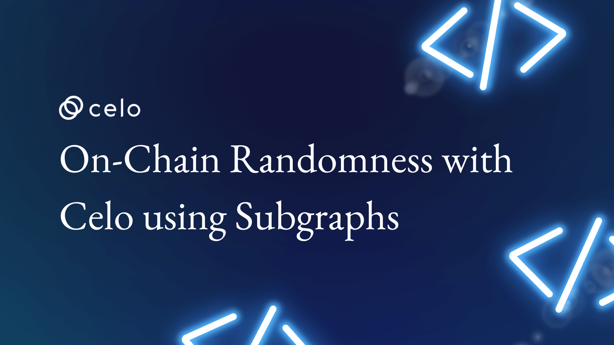

## Introduction

In this tutorial, we will explore how subgraphs and randomness work in the Celo blockchain. This tutorial will cover the use of subgraph technology to monitor blockchain activity and how to integrate random elements into your blockchain application. By the end of this lesson, you'll have a foundational understanding of how subgraphs and randomness can enhance your blockchain application and make it more engaging.

## Prerequisites

This tutorial assumes prior knowledge of Hardhat and the Solidity programming language. Its content will focus on practical examples and implementation details rather than introductory explanations. If you are not familiar with these tools, we recommend that you first learn about them before starting this tutorial to fully benefit from its content.

## Requirements

- [Node.js](https://nodejs.org/en/download/) v14.17.6 LTS or higher
- [Hardhat](https://hardhat.org/getting-started/#overview)
- [OpenZeppelin](https://docs.openzeppelin.com/contracts/4.x/)

## Step 1: Understanding Celo Randomness & Subgraphs

### Celo Randomness

Celo's Randomness protocol generates decentralized and transparent random values using a trustless approach. It aggregates random numbers from multiple nodes using a tamper-proof Verifiable Random Function (VRF) for high security, unpredictability, and fairness. Other security and fairness features include a threshold signature scheme and a commit-reveal scheme. The protocol is ideal for various applications, including lotteries, games, and other applications requiring trustworthy randomness. if you want to learn more about Celo Randomness, you can read the [documentation](https://docs.celo.org/protocol/randomness) here.

### Subgraphs

The Subgraph protocol is a tool for developers to query data from decentralized networks like Ethereum and IPFS. It enables the creation and publication of public APIs called subgraphs, which index data from decentralized networks for easy accessibility by other developers.Using the Subgraph protocol, developers can create and deploy subgraphs that index data from smart contracts on Ethereum or files on IPFS. These subgraphs can be shared publicly for others to query using GraphQL, a powerful API query language. You can learn more about Subgraphs [documentation](https://thegraph.com/docs/en/cookbook/quick-start/) here.

## Step 2: Project Setup

Open a terminal and run the following command to create a new project named LotteryClub and initialize it as a Node.js project.

```bash
mkdir LotteryClub

cd LotteryClub

npm init -y
```

Next, install the Hardhat development environment and the OpenZeppelin smart contract libraries by running the following commands:

```bash
npm install --save-dev hardhat

npm install dotenv @openzeppelin/contracts --save
```

After the installation is complete, run the following command to initialize the Hardhat project:

```bash
npx hardhat
```

You will be prompted to select options for your project. Choose 'Create a JavaScript project.' The outcome will look like this:

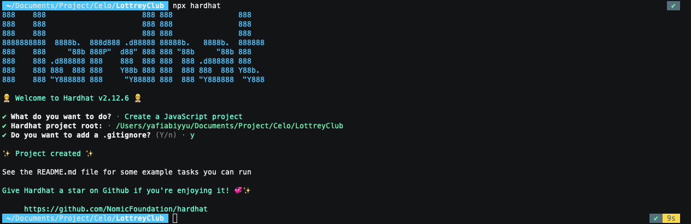

Afterwards, edit the hardhat.config.js file to add the Celo Network and include a mnemonic for deploying the contract. The hardhat.config.js file should appear as follows:

```javascript
require("@nomicfoundation/hardhat-toolbox");
require("dotenv").config({ path: ".env" });

/** @type import('hardhat/config').HardhatUserConfig */
module.exports = {
  solidity: {
    version: "0.8.15",
    settings: {
      optimizer: {
        enabled: true,
        runs: 2000,
      },
    },
  },
  networks: {
    alfajores: {
      url: process.env.RPC_URL,
      chainId: 44787,
      accounts: {
        mnemonic: process.env.MNEMONIC,
        path: "m/44'/60'/0'/0",
      },
    },
  },
};
```

## Step 3: Writing the Smart Contract

Before creating a contract, it's crucial to determine the goals and features of the lottery application. This tutorial will guide you through building a simple lottery app that enables users to create their own lottery clubs with a variety of prizes to choose from, including real coins (Celo), stablecoins (cUSD, cEUR, etc.), and NFTs.

To ensure the integrity of the winner selection process, we will utilize the Celo Randomness Protocol. This protocol allows us to generate truly random and verifiable numbers for all parties involved.

To build this lottery application, we will create three contracts:

- `LotteryClubFactory`

  This contract will serve two purposes: creating new lottery clubs and storing the addresses of all lottery clubs created by users.

- `LotteryClubToken`

  This contract is a unique lottery club that offers real coins (Celo), stablecoins (cUSD, cEUR, etc.), and other ERC20 tokens as prizes.

- `LotteryClubNFT`

  This contract is a lottery club that utilizes NFTs as prizes.

### Celo Randomness Contract

To generate truly random numbers, we will use the `Celo Randomness Contract`. To interact with this contract, we require an interface contract. To create an interface contract, first, we need to create a folder named `interface` inside the `contracts` folder. Next, we need to create a file named `IRandom.sol` inside the `interface` folder. Finally, we can add the following code to the `IRandom.sol` file:

```solidity
// SPDX-License-Identifier: MIT
pragma solidity 0.8.15;

interface IRandom {
    function random() external view returns (bytes32);
}
```

### LotteryClubToken Contract

In the next step, we will create a lottery club that offers real coins (Celo), stablecoins (cUSD, cEUR, etc.), and ERC20 tokens as prizes. To begin, create a file named `LotteryClubToken.sol` inside the `contracts` folder, and then add the following code to it:

```solidity
// SPDX-License-Identifier: MIT
pragma solidity 0.8.15;

import "@openzeppelin/contracts/token/ERC20/IERC20.sol";
import "@openzeppelin/contracts/utils/math/SafeMath.sol";
import "./interface/IRandom.sol";

contract LotteryClubToken {
    using SafeMath for uint256;

    string public name;
    uint256 public reward;
    uint256 public deposit;
    uint256 public membersLimit;
    uint256 private _managerFee;
    uint256 private constant FEE_PERCENT = 2;

    address public rewardAddress;
    address public winer;
    address public manager;
    address public factory;
    address[] private _membersCounters;

    bool public lotteryStatus = false;

    IRandom private constant RANDOMNESS_ADDRESS =
        IRandom(0xdd318EEF001BB0867Cd5c134496D6cF5Aa32311F);

    mapping(address => uint256) private _userDeposit;

    modifier onlyManager() {
        require(
            msg.sender == manager,
            "LotteryClubToken: Only manager can call this function"
        );
        _;
    }

    event RewardUpdate(
        uint256 reward_,
        uint256 deposit_,
        uint256 membersLimit_,
        address club
    );

    event Winer(address indexed winer_, address club);

    constructor() {
        factory = msg.sender;
        winer = address(0);
    }

    function initialize(
        string calldata name_,
        uint256 reward_,
        uint256 deposit_,
        uint256 membersLimit_,
        uint256 managerFee_,
        address rewardAddress_,
        address manager_
    ) external {
        require(
            msg.sender == factory,
            "LotteryClubToken: Only factory can call this function"
        );
        name = name_;
        reward = reward_;
        deposit = deposit_;
        membersLimit = membersLimit_;
        _managerFee = managerFee_;
        rewardAddress = rewardAddress_;
        manager = manager_;
    }

    function setDeposit(uint256 deposit_) external onlyManager {
        require(!lotteryStatus, "LotteryClubToken: Lottery is running");
        require(
            deposit_ > 0,
            "LotteryClubToken: Deposit must be greater than 0"
        );
        deposit = deposit_;
        _updateReward();
    }

    function setMembersLimit(uint256 membersLimit_) external onlyManager {
        require(!lotteryStatus, "LotteryClubToken: Lottery is running");
        require(
            membersLimit_ > 0,
            "LotteryClubToken: Members limit must be greater than 0"
        );
        membersLimit = membersLimit_;
        _updateReward();
    }

    function claimFee() external onlyManager {
        require(!lotteryStatus, "LotteryClubToken: Lottery is running");
        require(
            _managerFee > 0,
            "LotteryClubToken: Manager fee is 0"
        );
        uint256 _feeAmount = _managerFee;
        _managerFee = 0;
        IERC20(rewardAddress).transfer(manager, _feeAmount);
    }

    function start() external onlyManager {
        require(!lotteryStatus, "LotteryClubToken: Lottery is running");
        lotteryStatus = true;
        _reset();
    }

    function draw() external onlyManager {
        require(lotteryStatus, "LotteryClubToken: Lottery is not running");
        require(
            _membersCounters.length >= membersLimit,
            "LotteryClubToken: Not enough members"
        );
        require(IERC20(rewardAddress).balanceOf(address(this)) >= reward, "LotteryClubToken: Not enough reward");
        lotteryStatus = false;
        winer = _membersCounters[_getRandomNumber() % _membersCounters.length];
        IERC20(rewardAddress).transfer(winer, reward);
        emit Winer(winer, address(this));
    }

    function register() external {
        require(lotteryStatus, "LotteryClubToken: Lottery is not running");
        require(
            _membersCounters.length < membersLimit,
            "LotteryClubToken: Members limit reached"
        );
        require(
            _userDeposit[msg.sender] == 0,
            "LotteryClubToken: You are already registered"
        );
        IERC20(rewardAddress).transferFrom(msg.sender, address(this), deposit);
        _userDeposit[msg.sender] = deposit;
        _membersCounters.push(msg.sender);
    }

    function _updateReward() private {
        uint256 baseReward = deposit.mul(membersLimit);
        _managerFee = baseReward.mul(FEE_PERCENT).div(100);
        reward = baseReward.sub(_managerFee);
        emit RewardUpdate(reward, deposit, membersLimit, address(this));
    }

    function _reset() private {
        winer = address(0);
        for (uint256 i = 0; i < _membersCounters.length; i++) {
            _userDeposit[_membersCounters[i]] = 0;
        }
        _membersCounters = new address[](0);
    }

    function _getRandomNumber() private view returns (uint256) {
        return uint256(RANDOMNESS_ADDRESS.random());
    }
}
```

The code above represents the main code of the `LotteryClubToken` contract. We will provide a detailed explanation of its contents.

First, we need to define the license and solidity version we will use and import some libraries that we will require. The libraries we will use include `SafeMath` to perform mathematical operations and prevent overflow and underflow, `IRandom` to retrieve random values from the `Celo Randomness contract`, and `IERC20` to interact with the tokens we will use as rewards.

```solidity
// SPDX-License-Identifier: MIT
pragma solidity 0.8.15;

import "@openzeppelin/contracts/token/ERC20/IERC20.sol";
import "@openzeppelin/contracts/utils/math/SafeMath.sol";
import "./interface/IRandom.sol";

contract LotteryClubToken {
    // Code goes here
}
```

In the next step, we will define several variables that we will use in our contract. We will use the `SafeMath` library to perform math operations and prevent overflow and underflow. These variables include:

- name: to store the name of the club

- `reward`: to store the amount of reward to be given
- `deposit`: to store the amount of deposit that must be paid by members
- `membersLimit`: to save the number of members needed to participate in the lottery
- `_managerFee`: to save the amount of fees that will be given to the manager
- `FEE_PERCENT`: to save the percentage of fees that will be given to the manager
- `rewardAddress`: to save the address of the token that will be used as a reward
- `winner`: to store the address of the winning member
- `manager`: to store the address of the club manager
- `factory`: to store the address of the factory that will be used to create a club
- `_membersCounters`: to store the address of registered members
  lotteryStatus: to save the status of the lottery
- `RANDOMNESS_ADDRESS`: to save the address from the IRandom contract which will be used to generate a random number
- `_userDeposit`: to store the deposit amount paid by the member.

```solidity
using SafeMath for uint256;

string public name;
uint256 public reward;
uint256 public deposit;
uint256 public membersLimit;
uint256 private _managerFee;
uint256 private constant FEE_PERCENT = 2;

address public rewardAddress;
address public winer;
address public manager;
address public factory;
address[] private _membersCounters;

bool public lotteryStatus = false;

IRandom private constant RANDOMNESS_ADDRESS =
    IRandom(0xdd318EEF001BB0867Cd5c134496D6cF5Aa32311F);

mapping(address => uint256) private _userDeposit;
```

Next we will define the modifier we will use. We will use the `onlyManager` modifier to limit the functionality to only the manager of the club.

```solidity
modifier onlyManager() {
    require(
        msg.sender == manager,
        "LotteryClubToken: Only manager can call this function"
    );
    _;
}
```

"Next, we will define the events that we will use. We will use the `RewardUpdate` event as a log of reward changes, and `Winner` as a log of winning members.

```solidity
event RewardUpdate(
    uint256 reward_,
    uint256 deposit_,
    uint256 membersLimit_,
    address club
);

event Winer(address indexed winer_, address club);
```

Next, let's discuss some of the functions included in the `LotteryClubToken` contract. The first is the `constructor` function, which will be executed the first time we create a club. We also have the `initialize` function, which will be executed when we create a club and can only be run by the factory. The `initialize` function accepts several parameters, such as `name_` to store the name of the club, `reward_` to store the number of rewards to be given, `deposit_` to store the deposit amount that must be paid by members, `membersLimit_` to store the number of members needed to conduct the lottery, `rewardAddress_` to store the address of the token to be used as a reward, and `manager_` to store the address of the club's manager.

```solidity
constructor() {
    factory = msg.sender;
    winer = address(0);
}

function initialize(
    string calldata name_,
    uint256 reward_,
    uint256 deposit_,
    uint256 membersLimit_,
    uint256 managerFee_,
    address rewardAddress_,
    address manager_
) external {
    require(
        msg.sender == factory,
        "LotteryClubToken: Only factory can call this function"
    );
    name = name_;
    reward = reward_;
    deposit = deposit_;
    membersLimit = membersLimit_;
    _managerFee = managerFee_;
    rewardAddress = rewardAddress_;
    manager = manager_;
}
```

Next, we have the `setDeposit` and `setMembersLimit` functions which will allow changing the value of `deposit` and `membersLimit`, respectively. The `setDeposit` function takes the `deposit_` parameter to store the value of the new `deposit`, while the `setMembersLimit` function takes the `membersLimit_` parameter to store the new `membersLimit` value. These two functions are accessible only by the club's manager, and when `lotteryStatus` is `false`.

```solidity
function setDeposit(uint256 deposit_) external onlyManager {
    require(!lotteryStatus, "LotteryClubToken: Lottery is running");
    require(
        deposit_ > 0,
        "LotteryClubToken: Deposit must be greater than 0"
    );
    deposit = deposit_;
    _updateReward();
}
```

```solidity
function setMembersLimit(uint256 membersLimit_) external onlyManager {
    require(!lotteryStatus, "LotteryClubToken: Lottery is running");
    require(
        membersLimit_ > 0,
        "LotteryClubToken: Members limit must be greater than 0"
    );
    membersLimit = membersLimit_;
    _updateReward();
}
```

The `claimFee` function allows the club manager to withdraw the fees that have been collected. This function can only be accessed by the manager of the club. The fees are collected from the members' deposits and are calculated as a percentage of the total deposits. The percentage is set by the `_managerFee` variable

```solidity
function claimFee() external onlyManager {
    require(!lotteryStatus, "LotteryClubToken: Lottery is running");
    require(
        _managerFee > 0,
        "LotteryClubToken: Manager fee is 0"
    );
    uint256 _feeAmount = _managerFee;
    _managerFee = 0;
    IERC20(rewardAddress).transfer(manager, _feeAmount);
}
```

Next are the `start` and `draw` functions which will be used to start and end the lottery. The `start` function will start the lottery and can only be accessed by the manager of the club. The `draw` function will end the lottery and can only be accessed by the manager of the club.

```solidity
function start() external onlyManager {
    require(!lotteryStatus, "LotteryClubToken: Lottery is running");
    lotteryStatus = true;
    _reset();
}
```

```solidity
function draw() external onlyManager {
    require(lotteryStatus, "LotteryClubToken: Lottery is not running");
    require(
        _membersCounters.length >= membersLimit,
        "LotteryClubToken: Not enough members"
    );
    require(IERC20(rewardAddress).balanceOf(address(this)) >= reward, "LotteryClubToken: Not enough reward");
    lotteryStatus = false;
    winer = _membersCounters[_getRandomNumber() % _membersCounters.length];
    IERC20(rewardAddress).transfer(winer, reward);
    emit Winer(winer, address(this));
}
```

Next is the `register` function which will be used by prospective members to register into the club. This function can only be accessed when `lotteryStatus` is `true` and also when the number of members has not reached `membersLimit`.

```solidity
function register() external {
    require(lotteryStatus, "LotteryClubToken: Lottery is not running");
    require(
        _membersCounters.length < membersLimit,
        "LotteryClubToken: Members limit reached"
    );
    require(
        _userDeposit[msg.sender] == 0,
        "LotteryClubToken: You are already registered"
    );
    IERC20(rewardAddress).transferFrom(msg.sender, address(this), deposit);
    _userDeposit[msg.sender] = deposit;
    _membersCounters.push(msg.sender);
}
```

Next we will discuss the private functions contained in the `LotteryClubToken` contract. The first is the `_updateReward` function which will be used to update the value of `reward` and also `_managerFee` when the value of `deposit` and `membersLimit` changes.

```solidity
function _updateReward() private {
    uint256 baseReward = deposit.mul(membersLimit);
    _managerFee = baseReward.mul(FEE_PERCENT).div(100);
    reward = baseReward.sub(_managerFee);
    emit RewardUpdate(reward, deposit, membersLimit, address(this));
}
```

Next is the `_reset` function which will be used to reset the values of several variables when the lottery starts.

```solidity
function _reset() private {
    winer = address(0);
    for (uint256 i = 0; i < _membersCounters.length; i++) {
        _userDeposit[_membersCounters[i]] = 0;
    }
    _membersCounters = new address[](0);
}
```

The last one is the `_getRandomNumber` function which will be used to generate random numbers which will be used to determine the winner of the lottery. This random number is obtained by calling the `random` function in the `Celo Randomness` contract.

```solidity
function _getRandomNumber() private view returns (uint256) {
    return uint256(RANDOMNESS_ADDRESS.random());
}
```

### LotteryClubNFT Contract

Next, create a new file named `LotteryClubNFT.sol` in the `contracts` folder. This contract will use the NFT as a prize from the lottery. The structure of this contract is almost the same as the `LotteryClubToken` contract we discussed earlier. To keep things short, we'll jump right into some of the changes we need to make. Following is the structure of the `LotteryClubNFT` contract.

```solidity
// SPDX-License-Identifier: MIT
pragma solidity 0.8.15;

import "@openzeppelin/contracts/token/ERC721/IERC721.sol";
import "./interface/IRandom.sol";

contract LotteryClubNFT {
    string public name;
    uint256 public reward;
    uint256 public deposit;
    uint256 public membersLimit;

    address public rewardAddress;
    address public winer;
    address public manager;
    address public factory;
    address[] private _membersCounters;

    bool public lotteryStatus = false;

    IRandom private constant RANDOMNESS_ADDRESS =
        IRandom(0xdd318EEF001BB0867Cd5c134496D6cF5Aa32311F);

    mapping(address => uint256) private _userDeposit;

    modifier onlyManager() {
        require(
            msg.sender == manager,
            "LotteryClubToken: Only manager can call this function"
        );
        _;
    }

    event RewardUpdate(address indexed rewardAddress_, uint256 reward_, address club_);
    event LimitAndDepoUpdate(uint256 update_, string name_, address club_);
    event Winer(address indexed winer_, address club_);

    constructor() {
        factory = msg.sender;
        winer = address(0);
    }

    function initialize(
        string calldata _name,
        uint256 _deposit,
        uint256 _membersLimit,
        address _manager
    ) external {
        require(
            msg.sender == factory,
            "LotteryClubNFT: Only factory can call this function"
        );
        name = _name;
        deposit = _deposit;
        membersLimit = _membersLimit;
        manager = _manager;
    }

    function setMembersLimit(uint256 _membersLimit) external onlyManager {
        require(!lotteryStatus, "LotteryClubNFT: Lottery is already started");
        require(
            _membersLimit > 0,
            "LotteryClubNFT: Members limit must be greater than 0"
        );
        membersLimit = _membersLimit;
        emit LimitAndDepoUpdate(_membersLimit, "membersLimit", address(this));
    }

    function setDeposit(uint256 _deposit) external onlyManager {
        require(!lotteryStatus, "LotteryClubNFT: Lottery is already started");
        require(_deposit > 0, "LotteryClubNFT: Deposit must be greater than 0");
        deposit = _deposit;
        emit LimitAndDepoUpdate(_deposit, "deposit", address(this));
    }

    function claimFee() external onlyManager {
        require(!lotteryStatus, "LotteryClubNFT: Lottery is already started");
        require(address(this).balance > 0, "LotteryClubNFT: No balance");
        (bool status, ) = msg.sender.call{value: address(this).balance}("");
        require(status, "LotteryClubNFT: Transfer failed");
    }

    function start(address _rewardAddress, uint256 _tokenId) external onlyManager {
        require(_rewardAddress != address(0), "LotteryClubNFT: Reward address is zero");
        require(!lotteryStatus, "LotteryClubNFT: Lottery is already started");
        require(rewardAddress == address(0), "LotteryClubNFT: Reward already set");
        IERC721(_rewardAddress).transferFrom(msg.sender, address(this), _tokenId);
        rewardAddress = _rewardAddress;
        reward = _tokenId;
        lotteryStatus = true;
        emit RewardUpdate(_rewardAddress, _tokenId, address(this));
    }

    function draw() external onlyManager {
        require(lotteryStatus, "LotteryClubNFT: Lottery is not started");
        require(
            _membersCounters.length >= membersLimit,
            "LotteryClubNFT: Not enough members"
        );
        lotteryStatus = false;
        winer = _membersCounters[_getRandomNumber() % _membersCounters.length];
        _userDeposit[winer] = 0;
        IERC721(rewardAddress).transferFrom(address(this), winer, reward);
        _batchTransfer();
        emit Winer(winer, address(this));
    }

    function register() external payable {
        require(lotteryStatus, "LotteryClubNFT: Lottery is not started");
        require(
            msg.value == deposit,
            "LotteryClubNFT: Deposit amount is not correct"
        );
        require(
            _membersCounters.length < membersLimit,
            "LotteryClubNFT: Members limit reached"
        );
        require(
            _userDeposit[msg.sender] == 0,
            "LotteryClubNFT: You are already registered"
        );
        _userDeposit[msg.sender] = msg.value;
        _membersCounters.push(msg.sender);
    }

    function _batchTransfer() private {
        for (uint256 i = 0; i < _membersCounters.length; i++) {
            if (_userDeposit[_membersCounters[i]] > 0) {
                (bool status, ) = _membersCounters[i].call{
                    value: _userDeposit[_membersCounters[i]]
                }("");
                require(status);
            }
        }
    }

    function _reset() private {
        winer = address(0);
        for (uint256 i = 0; i < _membersCounters.length; i++) {
            _userDeposit[_membersCounters[i]] = 0;
        }
        _membersCounters = new address[](0);
    }

    function _getRandomNumber() private view returns (uint256) {
        return uint256(RANDOMNESS_ADDRESS.random());
    }
}
```

First we will change the `IERC20` library to `IERC721` because we will use the NFT as a prize from the lottery.

```solidity
// SPDX-License-Identifier: MIT
pragma solidity 0.8.15;

import "@openzeppelin/contracts/token/ERC721/IERC721.sol";
import "./interface/IRandom.sol";
```

Next we will make changes to existing events. In this contract there is a `RewardUpdate` event which will log when the reward has been set when the lottery starts, and there is a `LimitAndDepoUpdate` event which will log when the deposit and member limits change.

```solidity
event RewardUpdate(address indexed rewardAddress_, uint256 reward_, address club_);
event LimitAndDepoUpdate(uint256 update_, string name_, address club_);
event Winer(address indexed winer_, address club_);
```

Next we make changes to the parameters required by the `initialize` function

```solidity
function initialize(
    string calldata _name,
    uint256 _deposit,
    uint256 _membersLimit,
    address _manager
) external {
    require(
        msg.sender == factory,
        "LotteryClubNFT: Only factory can call this function"
    );
    name = _name;
    deposit = _deposit;
    membersLimit = _membersLimit;
    manager = _manager;
}
```

The `start` function will also undergo changes, because we will use the NFT as a reward, so we need to change the `start` function so that it can accept the NFT parameter to be used as a reward. We will add the `_rewardAddress` and `_tokenId` parameters to the `start function ` and change the `start` function to something like the following.

```solidity
function start(address _rewardAddress, uint256 _tokenId) external onlyManager {
    require(_rewardAddress != address(0), "LotteryClubNFT: Reward address is zero");
    require(!lotteryStatus, "LotteryClubNFT: Lottery is already started");
    require(rewardAddress == address(0), "LotteryClubNFT: Reward already set");
    IERC721(_rewardAddress).transferFrom(msg.sender, address(this), _tokenId);
    rewardAddress = _rewardAddress;
    reward = _tokenId;
    lotteryStatus = true;
    emit RewardUpdate(_rewardAddress, _tokenId, address(this));
}
```

Lastly, we will add the `_batchTransfer` function which will send back the deposit that was deposited by the non-winning member to each member.

```solidity
function _batchTransfer() private {
    for (uint256 i = 0; i < _membersCounters.length; i++) {
        if (_userDeposit[_membersCounters[i]] > 0) {
            (bool status, ) = _membersCounters[i].call{
                value: _userDeposit[_membersCounters[i]]
            }("");
            require(status);
        }
    }
}
```

### LotteryClubFactory Contract

The last contract we will create is the `LotteryClubFactory` which will be used to create the `LotteryClubNFT` and `LotteryClubToken` contracts. Previously, we created an interface contract from the two contracts we previously created. We will create the `ILotteryClubNFT` and `ILotteryClubToken` interfaces which will be used to access the `initialize` function in the `LotteryClubNFT` and `LotteryClubToken` contracts.

Create `IlotteryClubNFT.sol` and `IlotteryClubToken.sol` files in the `contracts/interface` folder and fill them with the following code.

```solidity
// SPDX-License-Identifier: MIT
pragma solidity 0.8.15;

interface ILotteryClubNFT {
    function initialize(
        string calldata name_,
        uint256 deposit_,
        uint256 membersLimit_,
        address manager_
    ) external;
}
```

```solidity
// SPDX-License-Identifier: MIT
pragma solidity 0.8.15;

interface ILotteryClubToken {
    function initialize(
        string calldata name_,
        uint256 reward_,
        uint256 deposit_,
        uint256 membersLimit_,
        uint256 managerFee,
        address rewardAddress_,
        address manager_
    ) external;
}
```

After creating the interfaces for our two previously created contracts, our next step is to develop the `LotteryClubFactory` contract. This contract will serve as the tool to generate both the `LotteryClubNFT` and `LotteryClubToken` contracts. To begin, navigate to the `contracts` folder and create a new file named `LotteryClubFactory.sol`. Fill this file with the following code:

```solidity
// SPDX-License-Identifier: MIT
pragma solidity 0.8.15;

import "@openzeppelin/contracts/utils/math/SafeMath.sol";
import "./LotteryClubToken.sol";
import "./LotteryClubNFT.sol";
import "./interface/ILotteryClubToken.sol";
import "./interface/ILotteryClubNFT.sol";

contract LotteryClubFactory {
    using SafeMath for uint256;

    bytes32 public constant TOKEN_TYPEHASH =
        0x96706879d29c248edfb2a2563a8a9d571c49634c0f82013e6f5a7cde739d35d4;
    bytes32 public constant NFT_TYPEHASH =
        0x9c4138cd0a1311e4748f70d0fe3dc55f0f5f75e0f20db731225cbc3b8914016a;

    mapping(address => bool) private _clubStatus;

    event NewClub(
        address indexed club,
        string name,
        uint256 deposit,
        uint256 membersLimit,
        uint256 reward,
        address rewardAddress,
        address manager,
        bytes32 typeHash
    );

    function clubToken(
        string calldata name_,
        uint256 deposit_,
        uint256 membersLimit_,
        address rewardAddress_
    ) external {
        require(
            deposit_ > 0,
            "LotteryClubFactory: Deposit must be greater than 0"
        );
        require(
            membersLimit_ > 0,
            "LotteryClubFactory: Members limit must be greater than 0"
        );
        require(
            rewardAddress_ != address(0),
            "LotteryClubFactory: Reward address must be not zero address"
        );
        (uint256 reward_, uint256 managerFee_) = _calculateFee(
            deposit_,
            membersLimit_
        );
        bytes32 salt = keccak256(
            abi.encodePacked(
                name_,
                deposit_,
                membersLimit_,
                reward_,
                rewardAddress_,
                msg.sender
            )
        );
        require(
            !_checkAddress(salt),
            "LotteryClubFactory: Club already exists"
        );
        LotteryClubToken club = (new LotteryClubToken){salt: salt}();
        ILotteryClubToken(address(club)).initialize(
            name_,
            reward_,
            deposit_,
            membersLimit_,
            managerFee_,
            rewardAddress_,
            msg.sender
        );
        _clubStatus[address(club)] = true;
        emit NewClub(
            address(club),
            name_,
            deposit_,
            membersLimit_,
            reward_,
            rewardAddress_,
            msg.sender,
            TOKEN_TYPEHASH
        );
    }

    function clubNFT(
        string calldata _name,
        uint256 _deposit,
        uint256 _membersLimit
    ) external {
        require(
            _deposit > 0,
            "LotteryClubFactory: Deposit must be greater than 0"
        );
        require(
            _membersLimit > 0,
            "LotteryClubFactory: Members limit must be greater than 0"
        );
        bytes32 salt = keccak256(
            abi.encodePacked(_name, _deposit, _membersLimit, msg.sender)
        );
        require(
            !_checkAddress(salt),
            "LotteryClubFactory: Club already exists"
        );
        LotteryClubNFT club = (new LotteryClubNFT){salt: salt}();
        ILotteryClubNFT(address(club)).initialize(
            _name,
            _deposit,
            _membersLimit,
            msg.sender
        );
        _clubStatus[address(club)] = true;
        emit NewClub(
            address(club),
            _name,
            _deposit,
            _membersLimit,
            0,
            address(0),
            msg.sender,
            NFT_TYPEHASH
        );
    }

    function _calculateFee(uint256 deposit_, uint256 membersLimit_)
        private
        pure
        returns (uint256 reward_, uint256 managerFee_)
    {
        uint256 baseReward = deposit_.mul(membersLimit_);
        managerFee_ = baseReward.mul(2).div(100);
        reward_ = baseReward.sub(managerFee_);
    }

    function _checkAddress(bytes32 salt_) private view returns (bool) {
        address predictAddress = address(
            uint160(
                uint256(
                    keccak256(
                        abi.encodePacked(
                            bytes1(0xff),
                            address(this),
                            salt_,
                            keccak256(
                                abi.encodePacked(
                                    type(LotteryClubToken).creationCode
                                )
                            )
                        )
                    )
                )
            )
        );
        return _clubStatus[predictAddress];
    }
}
```

Let's go through the steps for the above code.

To begin, we must define the license and solidity version we will use, as well as import any necessary libraries and interfaces, as we did in the previous two contracts.

```solidity
// SPDX-License-Identifier: MIT
pragma solidity 0.8.15;

import "@openzeppelin/contracts/utils/math/SafeMath.sol";
import "./LotteryClubToken.sol";
import "./LotteryClubNFT.sol";
import "./interface/ILotteryClubToken.sol";
import "./interface/ILotteryClubNFT.sol";

contract LotteryClubFactory {
    // Code goes here...
}
```

Next, we will define the variables that we will use. The `TOKEN_TYPEHASH` and `NFT_TYPEHASH` variables will indicate whether the contract created is a `LotteryClubToken` or `LotteryClubNFT` contract, respectively. The `_clubStatus` variable will indicate whether an address has been used to create a contract or not.

```solidity
using SafeMath for uint256;

bytes32 public constant TOKEN_TYPEHASH =
    0x96706879d29c248edfb2a2563a8a9d571c49634c0f82013e6f5a7cde739d35d4;
bytes32 public constant NFT_TYPEHASH =
    0x9c4138cd0a1311e4748f70d0fe3dc55f0f5f75e0f20db731225cbc3b8914016a;

mapping(address => bool) private _clubStatus;
```

Next we will define an event i.e. `NewClub` this event to log when a new contract is created.

```solidity
event NewClub(
    address indexed club,
    string name,
    uint256 deposit,
    uint256 membersLimit,
    uint256 reward,
    address rewardAddress,
    address manager,
    bytes32 typeHash
);
```

In the next section, we will discuss the two main functions of the `factory` contract, namely `clubToken` and `clubNFT`. The `clubToken` function is used to create a `LotteryClubToken` contract, while the `clubNFT` function is used to create a `LotteryClubNFT` contract.

```solidity
function clubToken(
    string calldata name_,
    uint256 deposit_,
    uint256 membersLimit_,
    address rewardAddress_
) external {
    require(
        deposit_ > 0,
        "LotteryClubFactory: Deposit must be greater than 0"
    );
    require(
        membersLimit_ > 0,
        "LotteryClubFactory: Members limit must be greater than 0"
    );
    require(
        rewardAddress_ != address(0),
        "LotteryClubFactory: Reward address must be not zero address"
    );
    (uint256 reward_, uint256 managerFee_) = _calculateFee(
        deposit_,
        membersLimit_
    );
    bytes32 salt = keccak256(
        abi.encodePacked(
            name_,
            deposit_,
            membersLimit_,
            reward_,
            rewardAddress_,
            msg.sender
        )
    );
    require(
        !_checkAddress(salt),
        "LotteryClubFactory: Club already exists"
    );
    LotteryClubToken club = (new LotteryClubToken){salt: salt}();
    ILotteryClubToken(address(club)).initialize(
        name_,
        reward_,
        deposit_,
        membersLimit_,
        managerFee_,
        rewardAddress_,
        msg.sender
    );
    _clubStatus[address(club)] = true;
    emit NewClub(
        address(club),
        name_,
        deposit_,
        membersLimit_,
        reward_,
        rewardAddress_,
        msg.sender,
        TOKEN_TYPEHASH
    );
}
```

```solidity
function clubNFT(
    string calldata _name,
    uint256 _deposit,
    uint256 _membersLimit
) external {
    require(
        _deposit > 0,
        "LotteryClubFactory: Deposit must be greater than 0"
    );
    require(
        _membersLimit > 0,
        "LotteryClubFactory: Members limit must be greater than 0"
    );
    bytes32 salt = keccak256(
        abi.encodePacked(_name, _deposit, _membersLimit, msg.sender)
    );
    require(
        !_checkAddress(salt),
        "LotteryClubFactory: Club already exists"
    );
    LotteryClubNFT club = (new LotteryClubNFT){salt: salt}();
    ILotteryClubNFT(address(club)).initialize(
        _name,
        _deposit,
        _membersLimit,
        msg.sender
    );
    _clubStatus[address(club)] = true;
    emit NewClub(
        address(club),
        _name,
        _deposit,
        _membersLimit,
        0,
        address(0),
        msg.sender,
        NFT_TYPEHASH
    );
}
```

Finally, we will make the function private. Within `LotteryClubFactory`, there exist two private functions: `_calculateFee` and `_checkAddress`. The `_calculateFee` function calculates the reward and manager fee that the manager receives when creating a `LotteryClubToken` contract. Meanwhile, the `_checkAddress` function verifies if an address has been previously used to create a contract.

```solidity
function _calculateFee(uint256 deposit_, uint256 membersLimit_)
    private
    pure
    returns (uint256 reward_, uint256 managerFee_)
{
    uint256 baseReward = deposit_.mul(membersLimit_);
    managerFee_ = baseReward.mul(2).div(100);
    reward_ = baseReward.sub(managerFee_);
}
```

```solidity
function _checkAddress(bytes32 salt_) private view returns (bool) {
    address predictAddress = address(
        uint160(
            uint256(
                keccak256(
                    abi.encodePacked(
                        bytes1(0xff),
                        address(this),
                        salt_,
                        keccak256(
                            abi.encodePacked(
                                type(LotteryClubToken).creationCode
                            )
                        )
                    )
                )
            )
        )
    );
    return _clubStatus[predictAddress];
}
```

## Deploying the Smart Contract

After we finish creating the contracts we need, then we need to prepare a script to deploy the contracts. In this tutorial, `LotteryClubToken` and `LotteryClubNFT` contracts can only be deployed by `LotteryClubFactory` contracts, for that we only need to create a script to deploy for `LotteryClubFactory`. Create a new file named `deploy.js` in the `scripts` folder and fill it with the following code.

```javascript
const hre = require("hardhat");

async function main() {
  console.log("Deploy Contract");

  const contract = await hre.ethers.getContractFactory("LotteryClubFactory");
  const factory = await contract.deploy();
  await factory.deployed();

  const contracts = await hre.ethers.getContractFactory("NFT");
  const nft = await contracts.deploy();
  await nft.deployed();
  console.clear();

  console.log("Factory Address : ", factory.address);
  console.log("NFT Address     : ", nft.address);
}

main().catch((error) => {
  console.error(error);
  process.exitCode = 1;
});
```

Next we need to execute the `deploy.js` file by running the following command.

```bash
npx hardhat run scripts/deploy.js --network alfajores
```

If the deployment process is successful, the following output will appear.

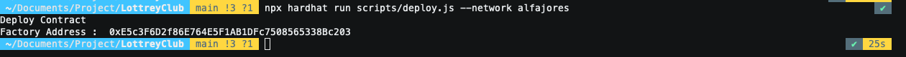

Save the `LotteryClubFactory` address we got from the output above, we will need it for simulating and verifying contracts.

### Simulation

After deploying the `LotteryClubFactory` contract, we will simulate and obtain the temporary contract addresses of `LotteryClubToken` and `LotteryClubNFT` for later verification. To conduct the simulation, we need to request `ERC20` Token and `ERC721` Token for simulation materials.

#### Request Faucet

For Faucets, you can claim from the following links [Faucet Token](https://explorer.celo.org/alfajores/address/0xF9Cf36eeC7fbc1e71E9192D5c0B846009bf32D2E/contracts#address-tabs) and [Faucet NFT](https://explorer.celo.org/alfajores/address/0x7637A3a2B6dd071BdB55403475e609f93448D508). For the steps, you can follow the tutorial below.

1. Open one of the Faucet links above

2. Select the `Write Contract` page tab

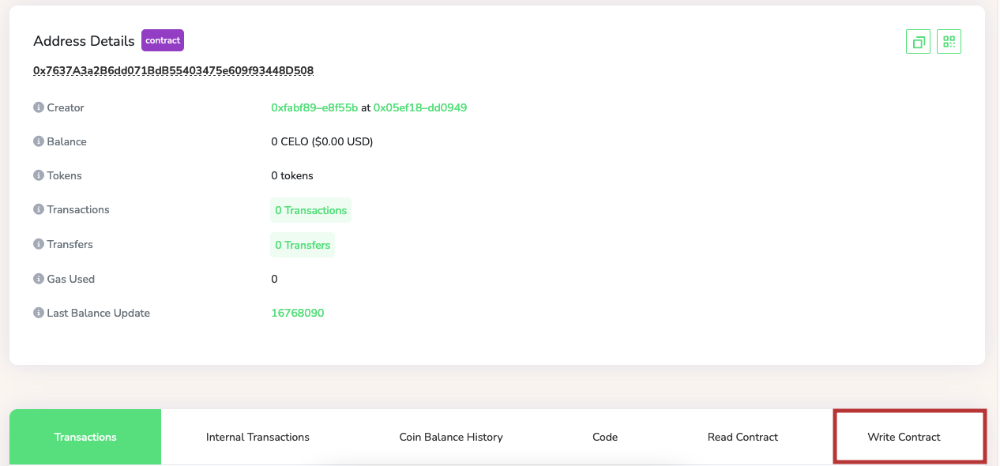

3. Click the 'Connect Wallet' button and select the wallet that will be used to claim the faucet then when connected click the 'faucet' button

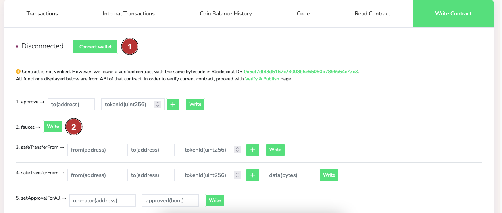

#### LotteryClubToken Simulation

To perform a simulation for the `Lottery Club Token` contract create a new file named `simulation_token.js` in the `scripts` folder and fill it with the following code.

```javascript
const hre = require("hardhat");

async function setup(token) {
  console.log("Setting up...");
  const accounts = await hre.ethers.getSigners();
  const amount = hre.ethers.utils.parseEther("2");
  console.clear();

  for (let i = 1; i <= 9; i++) {
    console.log("Transfer to: ", accounts[i].address);
    const tx = await token
      .connect(accounts[0])
      .transfer(accounts[i].address, amount);
    await tx.wait();
  }

  return accounts;
}

async function simulation(accountList, token, factory) {
  console.log("Start simulation");
  manager = accountList[1];
  deposit = hre.ethers.utils.parseEther("0.5");
  console.clear();

  console.log("Create new club");
  const txCreate = await factory
    .connect(manager)
    .clubToken("Final Test Token", deposit, 8, token.address);
  const receiptCreate = await txCreate.wait();
  const clubAddress = receiptCreate.events[0].args[0];
  const club = await hre.ethers.getContractAt("LotteryClubToken", clubAddress);
  console.clear();

  console.log("Start and register members");
  const txStart = await club.connect(manager).start();
  await txStart.wait();

  for (let i = 2; i <= 9; i++) {
    console.log("Member register: ", accountList[i].address);
    const txApprove = await token
      .connect(accountList[i])
      .approve(club.address, deposit);
    await txApprove.wait();

    const txRegister = await club.connect(accountList[i]).register();
    await txRegister.wait();
  }
  console.clear();

  console.log("Draw lottery");
  const txDraw = await club.connect(manager).draw();
  const receiptDraw = await txDraw.wait();
  const winner = receiptDraw.events[1].args[0];
  console.clear();

  console.log("Manager claim fee");
  const txClaimFee = await club.connect(manager).claimFee();
  await txClaimFee.wait();
  console.clear();

  console.log("Manager update members limit & deposit");
  const txSetDeposit = await club
    .connect(manager)
    .setDeposit(hre.ethers.utils.parseEther("0.1"));
  await txSetDeposit.wait();

  const txSetLimit = await club.connect(manager).setMembersLimit(5);
  await txSetLimit.wait();
  console.clear();

  console.log("======================================");
  console.log("Factory Address:     ", factory.address);
  console.log("Manager Address:     ", manager.address);
  console.log("Club Address   :     ", club.address);
  console.log("Winer Address  :     ", winner);
  console.log("======================================");
}

async function main() {
  const token = await hre.ethers.getContractAt(
    "Token",
    "0x51bf797e97615Be16BD886454f2cCAbc1A93726e"
  );
  const factory = await hre.ethers.getContractAt(
    "LotteryClubFactory",
    "<FACTORY_ADDRESS>"
  );
  const accountList = await setup(token);
  await simulation(accountList, token, factory);
}

main().catch((error) => {
  console.error(error);
  process.exitCode = 1;
});
```

The code above simulates the `LotteryClubToken` contract by transferring tokens to multiple accounts. We create a club named `Final Test Token` and `deposit` 0.5 tokens into it. Next, we register eight club members and conduct a raffle to determine a winner. Before running the simulation, we need to replace <FACTORY_ADDRESS> with the `LotteryClubFactory` address obtained from the previous deployment process.

Finally, we execute the simulation_token.js file by running the following command.

```bash
npx hardhat run scripts/simulation_token.js --network alfajores
```

If the simulation process is successful, the following output will appear.

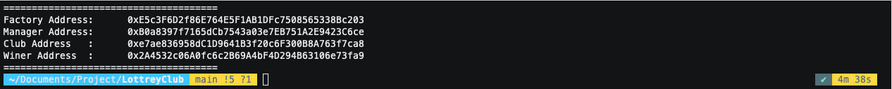

From the output above we can see the `Lottery Club Token` address that we need to verify. Save this address to use in the verification process.

#### LotteryClubNFT Simulation

To simulate for the `Lottery Club NFT` contract create a new file named `simulation_nft.js` in the `scripts` folder and fill it with the following code.

```javascript
const hre = require("hardhat");

async function setup(){
    console.log("Setting up account");
    const accountList = await hre.ethers.getSigners();
    for(let i = 1; i <= 9; i++) {
        console.log("Transfer to : ", accountList[i].address);
        let tx = {
            to: accountList[i].address,
            value: hre.ethers.utils.parseEther("2")
        }
        let txTransfer = await accountList[0].sendTransaction(tx);
        await txTransfer.wait();
    }
    console.clear();
    return accountList
}

async function simulation(accountList, nft, factory) {
    console.log("Start simulation");
    const manager = accountList[1];
    const deposit = hre.ethers.utils.parseEther("1");
    console.clear();

    console.log("Create new club");
    const txFaucet = await nft.connect(manager).faucet();
    await txFaucet.wait();
    const tokenId = <TOKEN_ID>

    const txCreate = await factory.connect(manager).clubNFT(
        "Finals Test",
        deposit,
        8
    );
    const receiptCreate = await txCreate.wait();
    const clubAddress = receiptCreate.events[0].args[0];
    const club = await hre.ethers.getContractAt("LotteryClubNFT", clubAddress);
    console.clear();

    console.log("Start lottery and register members");
    const txApprove = await nft.connect(manager).approve(club.address, tokenId);
    await txApprove.wait();

    const txStart = await club.connect(manager).start(nft.address, tokenId);
    await txStart.wait();

    for(let i = 2; i <= 9; i++) {
        console.log("Member register: ", accountList[i].address);
        const txRegister = await club.connect(accountList[i]).register({value:deposit});
        await txRegister.wait();
    }
    console.clear();

    console.log("Draw lottery")
    const txDraw = await club.connect(manager).draw();
    const receiptDraw = await txDraw.wait();
    const winner = receiptDraw.events[1].args[1];
    console.clear();

    console.log("Manager claim fee");;
    const txClaimFee = await club.connect(manager).claimFee();
    await txClaimFee.wait();
    console.clear();

    console.log("Update member limit & deposit");
    const txMembersLimit = await club.connect(manager).setMembersLimit(6);
    await txMembersLimit.wait();

    const txDeposit = await club.connect(manager).setDeposit(hre.ethers.utils.parseEther("0.5"));
    await txDeposit.wait();
    console.clear();

    console.log("======================================");
    console.log("Factory Address:     ", factory.address);
    console.log("Manager Address:     ", manager.address);
    console.log("Club Address   :     ", club.address);
    console.log("Winer Address  :     ", winner);
    console.log("======================================");
}

async function main(){
    nft = await hre.ethers.getContractAt("NFT", "0x1F8dC9a3091BC976c151eeEf4424927360579b14");
    factory = await hre.ethers.getContractAt("LotteryClubFactory", "<FACTORY_ADDRESS>");
    const accountList = await setup();
    await simulation(accountList, nft, factory);
}

main().catch((error) => {
    console.error(error);
    process.exitCode = 1;
})
```

The code above simulates the LotteryClubNFT contract by transferring tokens to multiple accounts. Then, we create a club named Final Test NFT and deposit 1 token. After that, we register 8 club members and conduct a raffle to determine a winner. Before running the simulation, we must replace <FACTORY_ADDRESS> with the LotteryClubFactory address obtained from the previous deployment process and <TOKEN_ID> with the ID of the token received earlier through the faucet process.

Next we need to execute the `simulation_nft.js` file by running the following command.

```bash
npx hardhat run scripts/simulation_nft.js --network alfajores
```

If the simulation process is successful, the following output will appear.

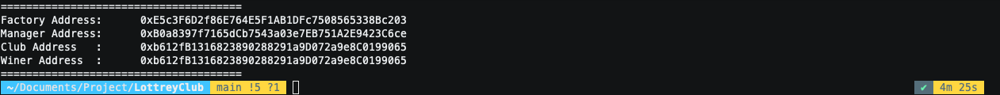

After reviewing the output above, we can identify the address for the `Lottery Club NFT` that requires verification. Kindly save this address to be used during the verification process.

### Contract Verification

We will now proceed with verifying the contract we have created. This verification process will facilitate debugging of the contract and enable seamless integration with subgraphs.

1. Open [source](https://source.dev) and click the `Verify Contract` button as shown below.


2. To verify the data, we will need the `metadata.json` file which can be found in the `/artifacts/build-info` folder. Simply drag and drop the file onto the verification page, as demonstrated below.

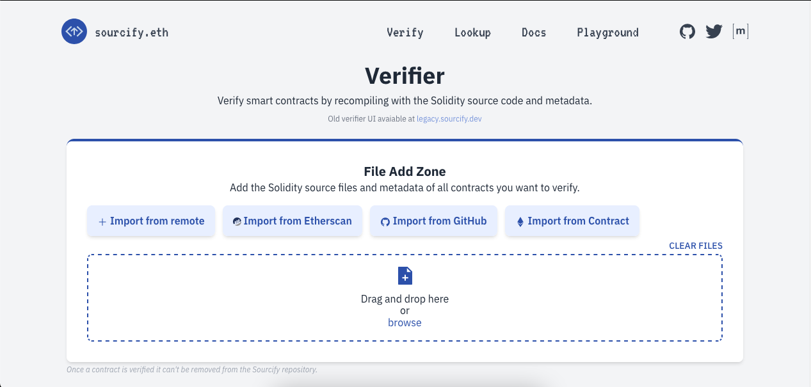

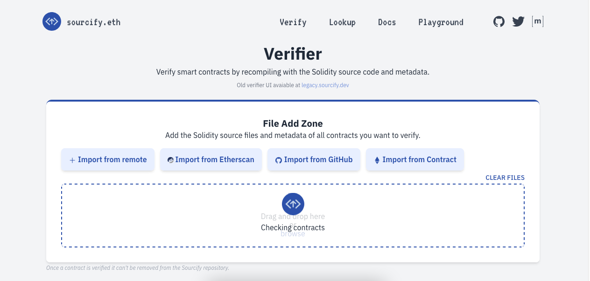

3. After the `metadata.json` file is uploaded, a verification page will appear as shown below.

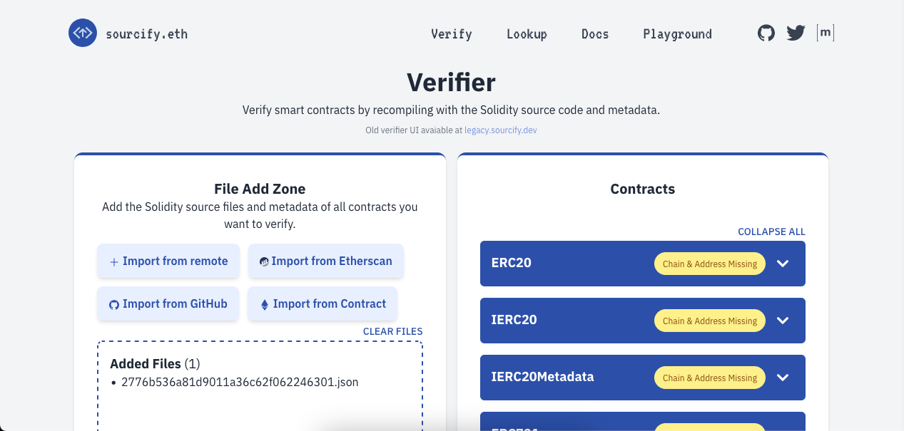

4. On the verification page, in the `contracts` section, we need to select the contract that we will verify. In this case, we will select the `LotteryClubFactory`, `LotteryClubToken`, and `LotteryClubNFT` contracts as shown below.

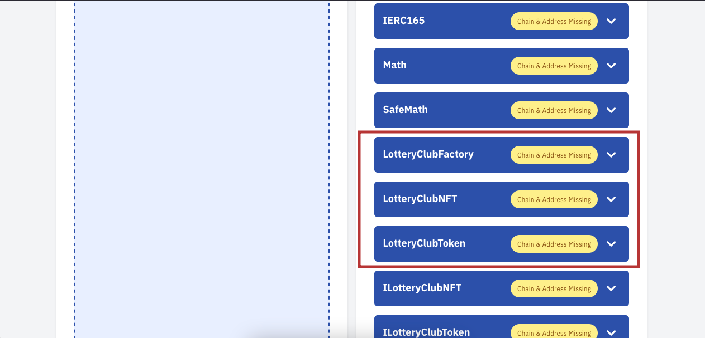

5. To complete the verification process, we must provide all the necessary information.


If the verification process is successful, it will be like the image below

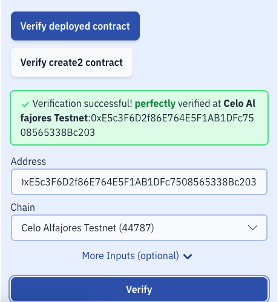

To verify the `LotteryClubFactory`, `LotteryClubToken`, and `LotteryClubNFT` contracts, follow the steps above using the temporary contract address obtained during deployment for `LotteryClubFactory`. For `LotteryClubToken` and `LotteryClubNFT`, use the contract addresses obtained from the simulation.

> **Note**: Be sure to change `Club Name` if running the simulation more than once.

## Integration with Subgraphs

### Create the Graph project

If you want to begin integrating with subgraphs, you can visit The [Graph Hosted Service](https://thegraph.com/hosted-service). First, click on Sign In with your Github account. Then, navigate to My Dashboard and select Add Subgraph to get started.

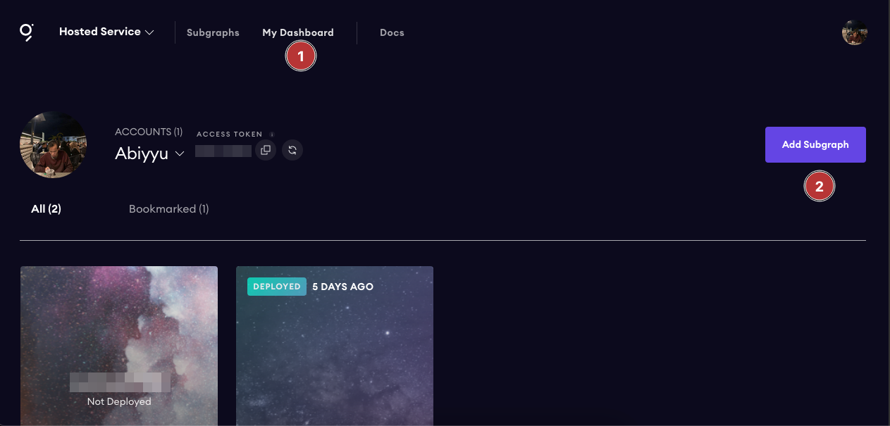

To create a subgraph, we need to specify its name, subtitle, and description. Once we have entered this information, we can click on the `Create Subgraph` button.

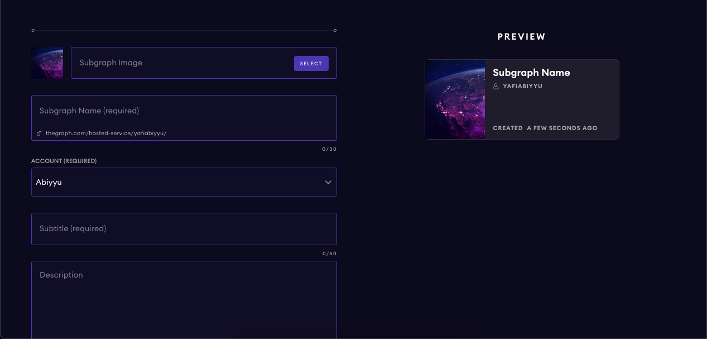

### Initialize new subgraph with Graph CLI

Next, install the Graph CLI:

```bash
npm install -g @graphprotocol/graph-cli

# or

yarn global add @graphprotocol/graph-cli
```

Once the Graph CLI has been installed, the next step is to initialize a new subgraph using the Graph CLI. To do this, execute the following command.

```bash
graph init --product hosted-service <GITHUB_USER>/<SUBGRAPH_NAME>
```

Then we need to fill in some data as follows.

```bash
✔ Protocol : ethereum
✔ Subgraph name : <GITHUB_USER>/<SUBGRAPH_NAME>
✔ Directory to create the subgraph in : lotteryclub (Or as you wish)
✔ Ethereum network : celo-alfajores
✔ Contract address : factory address contract
✔ ABI file (path) : factory abi contract
✔ Start Block : 0 (Or as you wish)
✔ Contract Name : Factory
✔ Index contract events as entities (Y/n) · true
```

Before proceeding to the next stage, we need to copy the three ABI files from the contract we created. We can obtain the ABI files from the `/artifacts/contracts` folder and then transfer them to the `/lotteryclub/abis` folder that the Graph CLI generated.

### Define Schema

Next, we need to define the GraphQL schema that we will use for the subgraphs. The GraphQL schema is a data structure used to define the data we will use in the subgraph. To define the GraphQL schema, we need to edit the `schema.graphql` file located in the `/lotteryclub` folder.

o query the contracts we have created, we need to define the entities and fields that we will use. For this case, we will define the entities `Manager`, `Winers`, and `Club` with the required fields.

```graphql
type Manager @entity {
  id: ID!
  blockNumber: BigInt!
  timestamp: BigInt!
  club: [Club!]!
}

type Winers @entity {
  id: ID!
  address: Bytes!
  club: Club!
  timestamp: BigInt!
  blockNumber: BigInt!
}

type Club @entity {
  id: ID!
  name: String!
  reward: BigInt!
  deposit: BigInt!
  membersLimit: BigInt!
  rewardAddress: Bytes!
  manager: Manager!
  type: String!
  createdAtTimestamp: BigInt!
  createdAtBlockNumber: BigInt!
  winer: [Winers!]! @derivedFrom(field: "club")
}
```

### Configure subgraphs with entities and mappings

To configure the `subgraph.yaml` file, we first need to modify the `dataSources.mapping.entities` section by adding the `Club` and `Manager` entities.

```yaml
entities:
  - Club
  - Manager
```

The entire `subgraph.yaml` file will look like this.

```yaml
specVersion: 0.0.4
schema:
  file: ./schema.graphql
dataSources:
  - kind: ethereum/contract
    name: Factory
    network: celo-alfajores
    source:
      address: "0x7d92b85cbEE92E3aA83586151Aeec8Fb75192247"
      abi: Factory
      startBlock: 16681857
    mapping:
      kind: ethereum/events
      apiVersion: 0.0.6
      language: wasm/assemblyscript
      entities:
        - Club
        - Manager
      abis:
        - name: Factory
          file: ./abis/Factory.json
      eventHandlers:
        - event: NewClub(indexed address,string,uint256,uint256,uint256,address,address,bytes32)
          handler: handleNewClub
      file: ./src/mapping.ts
```

### Added additional contracts

This tutorial utilizes the factory contract pattern, which enables a single contract to create and handle other contracts. To access the contracts we have established, we must include the `LotteryClubToken` and `LotteryClubNFT` contracts in the `subgraph.yaml` file.

```yaml
templates:
  - kind: ethereum/contract
    name: ClubToken
    network: celo-alfajores
    source:
      abi: clubToken
    mapping:
      kind: ethereum/events
      apiVersion: 0.0.6
      language: wasm/assemblyscript
      file: ./src/mapping.ts
      entities:
        - Club
        - Manager
        - Winer
      abis:
        - name: clubToken
          file: ./abis/ClubToken.json
      eventHandlers:
        - event: RewardUpdate(uint256,uint256,uint256,address)
          handler: handleRewardUpdateToken
        - event: Winer(indexed address,address)
          handler: handleWinerToken
  - kind: ethereum/contract
    name: ClubNFT
    network: celo-alfajores
    source:
      abi: clubNFT
    mapping:
      kind: ethereum/events
      apiVersion: 0.0.6
      language: wasm/assemblyscript
      file: ./src/mapping.ts
      entities:
        - Club
        - Manager
        - Winer
      abis:
        - name: clubNFT
          file: ./abis/ClubNFT.json
      eventHandlers:
        - event: RewardUpdate(indexed address,uint256,address)
          handler: handleNFTReward
        - event: LimitAndDepoUpdate(uint256,string,address)
          handler: handleLimitDepoNFTUpdate
        - event: Winer(indexed address,address)
          handler: handleWinerNFT
```

So the whole `subgraph.yaml` file will be like this.

```yaml
specVersion: 0.0.4
schema:
  file: ./schema.graphql
dataSources:
  - kind: ethereum/contract
    name: Factory
    network: celo-alfajores
    source:
      address: "0x7d92b85cbEE92E3aA83586151Aeec8Fb75192247"
      abi: Factory
      startBlock: 16681857
    mapping:
      kind: ethereum/events
      apiVersion: 0.0.6
      language: wasm/assemblyscript
      entities:
        - Club
        - Manager
      abis:
        - name: Factory
          file: ./abis/Factory.json
      eventHandlers:
        - event: NewClub(indexed address,string,uint256,uint256,uint256,address,address,bytes32)
          handler: handleNewClub
      file: ./src/mapping.ts
templates:
  - kind: ethereum/contract
    name: ClubToken
    network: celo-alfajores
    source:
      abi: clubToken
    mapping:
      kind: ethereum/events
      apiVersion: 0.0.6
      language: wasm/assemblyscript
      file: ./src/mapping.ts
      entities:
        - Club
        - Manager
        - Winer
      abis:
        - name: clubToken
          file: ./abis/ClubToken.json
      eventHandlers:
        - event: RewardUpdate(uint256,uint256,uint256,address)
          handler: handleRewardUpdateToken
        - event: Winer(indexed address,address)
          handler: handleWinerToken
  - kind: ethereum/contract
    name: ClubNFT
    network: celo-alfajores
    source:
      abi: clubNFT
    mapping:
      kind: ethereum/events
      apiVersion: 0.0.6
      language: wasm/assemblyscript
      file: ./src/mapping.ts
      entities:
        - Club
        - Manager
        - Winer
      abis:
        - name: clubNFT
          file: ./abis/ClubNFT.json
      eventHandlers:
        - event: RewardUpdate(indexed address,uint256,address)
          handler: handleNFTReward
        - event: LimitAndDepoUpdate(uint256,string,address)
          handler: handleLimitDepoNFTUpdate
        - event: Winer(indexed address,address)
          handler: handleWinerNFT
```

### Code generation

After configuring the `subgraph.yaml` file and creating the Graph schema, we need to generate code to create an `assemblyscript` that will map the events occurring on the blockchain. To achieve this, run the following command on the terminal.

```bash
graph codegen
```

Next, open `src/mappings.ts` to write the mappings we defined in our eventHandlers subgraph. Here is the code that we will use to map the events that occur on the blockchain.

```typescript
import { Club, Manager, Winers } from "../generated/schema";
import { NewClub } from "../generated/Factory/Factory";
import {
  RewardUpdate as RewardNFT,
  LimitAndDepoUpdate,
  Winer as WinerNFT,
} from "../generated/templates/ClubNFT/ClubNFT";
import {
  RewardUpdate as RewardToken,
  Winer as WinerToken,
} from "../generated/templates/ClubToken/ClubToken";
import { ClubNFT, ClubToken } from "../generated/templates";

export function handleNewClub(event: NewClub): void {
  let managerId = event.params.manager.toHexString();

  let manager = Manager.load(managerId);
  if (manager === null) {
    manager = new Manager(managerId);
    manager.blockNumber = event.block.number;
    manager.timestamp = event.block.timestamp;
    manager.club = [];
  }
  let clubList = manager.club;
  let club = new Club(event.params.club.toHexString());
  club.name = event.params.name;
  club.reward = event.params.reward;
  club.deposit = event.params.deposit;
  club.membersLimit = event.params.membersLimit;
  club.rewardAddress = event.params.rewardAddress;
  club.manager = managerId;

  if (
    event.params.typeHash.toHexString() ==
    "0x96706879d29c248edfb2a2563a8a9d571c49634c0f82013e6f5a7cde739d35d4"
  ) {
    club.type = "TOKEN";
    ClubToken.create(event.params.club);
  } else {
    club.type = "NFT";
    ClubNFT.create(event.params.club);
  }
  club.createdAtTimestamp = event.block.timestamp;
  club.createdAtBlockNumber = event.block.number;
  club.save();
  clubList.push(club.id);
  manager.club = clubList;
  manager.save();
}

export function handleWinerToken(event: WinerToken): void {
  let winerId =
    event.transaction.hash.toHexString() + "-" + event.logIndex.toString();
  let winer = new Winers(winerId);
  winer.address = event.params.winer_;
  winer.timestamp = event.block.timestamp;
  winer.blockNumber = event.block.number;

  let club = Club.load(event.params.club.toHexString());
  winer.club = club!.id;
  winer.save();
}

export function handleWinerNFT(event: WinerNFT): void {
  let winerId =
    event.transaction.hash.toHexString() + "-" + event.logIndex.toString();
  let winer = new Winers(winerId);
  winer.address = event.params.winer_;
  winer.timestamp = event.block.timestamp;
  winer.blockNumber = event.block.number;

  let club = Club.load(event.params.club_.toHexString());
  winer.club = club!.id;
  winer.save();
}

export function handleRewardUpdateToken(event: RewardToken): void {
  let club = Club.load(event.params.club.toHexString());
  club!.reward = event.params.reward_;
  club!.deposit = event.params.deposit_;
  club!.membersLimit = event.params.membersLimit_;
  club!.save();
}

export function handleNFTReward(event: RewardNFT): void {
  let club = Club.load(event.params.club_.toHexString());
  club!.reward = event.params.reward_;
  club!.rewardAddress = event.params.rewardAddress_;
  club!.save();
}

export function handleLimitDepoNFTUpdate(event: LimitAndDepoUpdate): void {
  let club = Club.load(event.params.club_.toHexString());
  if (event.params.name_ == "membersLimit") {
    club!.membersLimit = event.params.update_;
  } else {
    club!.deposit = event.params.update_;
  }
  club!.save();
}
```

### Build and Deploy

Once we have completed the code generation process, our next step is to build and deploy the subgraphs. To accomplish this, we can execute the following command in the terminal.

```bash
# Build
graph build


# Deploy
graph deploy --product hosted-service <GITHUB_USER>/<SUBGRAPH_NAME>
```

After deployment, we can access our subgraphs on the dashboard page and test our queries.

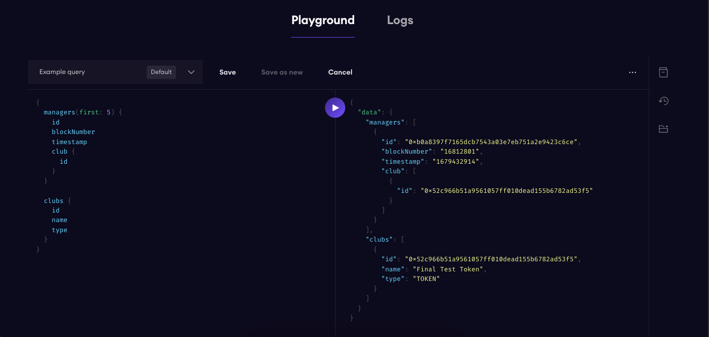

## Conclusion

In this tutorial, we have explored two blockchain technologies that can be used to create more transparent and trustworthy applications. Firstly, we learned about the Celo Randomness Contract that enables us to generate safe and fair random numbers on the Celo blockchain. This technology is particularly useful for creating lottery games and other applications that require random numbers.

Next, we delved into Subgraph, a protocol that simplifies creating interactive views and executing queries on the blockchain. With Subgraph, we can design applications that are more interactive and transparent, giving users a clearer and more comprehensive understanding of transactions and activities on the blockchain.

By combining the Celo Randomness Contract and Subgraph, we can develop blockchain applications that are more transparent, fair, and trustworthy, and offer real-time and more interactive data views. By mastering this technology, we can create safer and more sophisticated blockchain applications that users can trust. For all the code in this tutorial, you can get it via a [GitHub repository](https://github.com/yafiabiyyu/LottreyClub-CeloSage).

## Next Step

Once you understand how the Celo Randomness Contract and Subgraph work, you can develop more sophisticated applications using these two technologies. To learn more about them, visit the [Celo Randomness Contract](https://docs.celo.org/protocol/randomness) and [Subgraph](https://thegraph.com/docs/en/).

## About the Author

I am a blockchain and crypto enthusiast. I am also a software engineer. I love to learn new things and share my knowledge with others. You can find me on [GitHub](https://github.com/yafiabiyyu) and [LinkedIn](https://www.linkedin.com/in/abiyyuyafi/).
