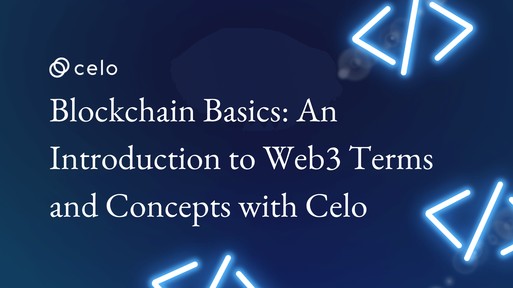

## Introduction

Oh, what the hell is this new Genz word going around, I don’t know this, Bitcoin and Ethereum all will just vanish, if these are your thoughts this article will help to clear misunderstandings,
Blockchain is just the name of a train with coaches, each coach has unique transactional data with it, and once that coach is added to the train you cannot change or remove that, and in the train, every coach has people inside in it traveling and everyone is smart so they know the number of the coaches in front of them and on the backside of them, so anyone cannot fool a coach without letting the people of other coaches know, so this makes it very difficult to rob a single coach. Wow, so exciting right? Let’s find out more

## Prerequisites

Just a little bit of knowledge of the working of the web and the general terms around that.

## Disclaimer

Thoughts can differ, We may have different opinions, but what’s stated in this article is written after combining thoughts of the minds around me and according to my understanding.

## Blockchain basics:-An introduction to web3 terms and concepts with CELO

The first thing which pops into our mind after hearing the word blockchain is Bitcoin and Ethereum and other cryptocurrencies, but I would not blame you here, because it is one of the most popular use cases of the technology, as I mentioned it is one of the use cases of Blockchain, Blockchain is technology, and the technology in its place is so amazing, it solves many of the problems which in the current world we want to solve and many of them think is that blockchain is the way to solve, some of the problems and many developers are building products to solve that problems and make our lives smooth and easier.

So first we have to know certain things before jumping into the beautiful world of Web3, and Web3 is also one of the use cases of blockchain technology.

### Let's start from the root by knowing the below-mentioned topics

1. What is Blockchain?

Blockchain is a decentralized and distributed ledger, which is used to record transactions over a network of computers. It is designed in a way to be secure and tamper-proof. If we divide the word blockchain we get the words block and chain, which means it is a chain made up of blocks.
Data is stored in the “Block” and every block has a unique hash of its own and also the hash of the previous block, and this is how the chain is created with the blocks, The stored transactions are encrypted using the SHA-256 algorithm, new blocks won’t be able to overwrite the old blocks, once a block is added it cannot be deleted or changed it will create a permanent unchangeable record of all the transactions made on that network

- Blockchain as a technology got recognition when the white paper was published Bitcoin: A Peer-to-Peer Electronic Cash System, it was under the name of Satoshi Nakamoto and an interesting fact about Satoshi Nakamoto is that no one knows who he is and where he is. In the paper, the technology Blockchain was used to enable transactions without the need for any bank or any central authority or in short without centralization. The paper laid the foundation of the cryptocurrency Bitcoin, so because of that many associate bitcoin with blockchain, but it is not true.

The paper was published in the year 2008 and the first block was mined in January 2009 which is also known as Genesis Block.

### Let's see how the blockchain works

Smart Contracts-

Ah, the word which you have heard around, the meaning is as simple as it sounds, it's a contract which is a smart contract is a computer program that runs automatically when certain conditions are met, a self-executing line of code. This can help to eliminate the need for a middleman.
Smart contract relies on the blockchain it is deployed on.
The smart contract can be written with the help of the language of the blockchains, like for Ethereum, solidity is used, and for Solana, rust, Solidity sounds interesting right want to be a smart contract developer, CELO comes to your help:- Start with this [https://docs.celo.org/blog/tutorials/solidity-from-zero-to-Hero](https://docs.celo.org/blog/tutorials/solidity-from-zero-to-Hero), for learning solidity and help yourself with other amazing blogs on the [https://docs.celo.org](https://docs.celo.org)

After knowing the smart contracts let's know about a block.
A block in a blockchain is a unit of data that contains multiple transactions. Each block contains a record of several recent transactions, and once a block is added to the blockchain, the transactions it contains are considered to be confirmed and permanent.
When a new block is added, it is broadcasted to all the computers on the networks known as “Nodes”.The majority of the nodes have to verify and confirm the legitimacy of the transaction, after it is verified it is grouped with other transactions and then added to the blockchain which is known as Consensus Mechanisms

As mentioned earlier, each block contains the unique “Hash”, that links the block to its previous block, as the hash also includes the reference of the previous block’s hash, which will make it impossible to change any previous block without affecting the whole chain.

It is transparent, which means anyone can see the transactions on the record, but it is anonymous as the identity of users is protected with the help of the “public key” and “private keys”.

> " (Just a Heads Up:-Never share your private key, make sure you use a different private key when developing so that you don’t push it on GitHub) "
There are two ways a node can arrive at the consensus, either through private blockchain or public blockchain.

Most public blockchain arrives at a consensus by “Proof of work” or “Proof of Stake”
Now let's understand what is POW-Proof of Work and POS-Proof of Stake

### POW-Proof of work

This method is used by Bitcoin and it was also used by Ethereum
In proof of work users known as “miners” use their computing power to solve complex mathematical problems which are known as “Mining”.

When a Miner successfully solves the problem it has to be validated by the nodes and then the miner is rewarded with the cryptocurrency and they are also allowed to add the new block- this is known as mining a block.

The mathematical problems which are solved are quite difficult, and saving them requires a lot of computational power. The difficulty is adjusted dynamically in bitcoin so that every 10 min a block is mined.

One of the major drawbacks of this is that it consumes very much energy, which has many major backs, that’s why “The Merge” happened,

What is merge- Ethereum Network was also on the POW and then in 2022 it shifted to POS, which is considered one of the biggest events in the world of blockchain,(Ahh that pandas and POS were the day to celebrate, (Only the one who saw the merge would understand this))

### POS-Proof of Stake

In proof of stake instead of using computational power for solving complex mathematical problems, users are chosen to validate the block based on the holdings of the token of the network, this is known as “staking”

In proof of stake, the users are known as “Validators”.

Proof of Stake is considered more energy consumable than proof of work mechanisms.

So, Now I think after this much information you are ready to know why Blockchain can revolutionize and why it is necessary in today’s world
Some of the advantages of blockchain technology, I think that these advantages will soon be a necessity, like messaging free without any tariff plans was an advantage and nowadays thanks to WhatsApp and apps like telegram and other messaging services it is now a necessity, same as that I think that some of the advantages fall into this category.

Building trust in a government- A pew research study was published stating that America's trust in government is near an all-time low. Only about one-quarter of Americans say they can trust the government in Washington to do what is right “Just about always”(2%). Only 18 percent of Americans say that they can trust the government to do what are right most of the time.

So I think the blockchain is the biggest advantage as with the help of this they would be able to build trust, by allowing participating stakeholders to see and verify data.(Credits-[https://simplilearn.com](https://simplilearn.com))

So that transparency factor helps to build strong trust, and because of that we will be able to get a more authentic approach than before

And another such advantage that I would like to discuss here is security, Because we see every there and here we hear that this data has been leaked and whatnot, big companies or governments compromised because of hackers and, it has exposed names, Social Security Numbers, birthdays, addresses, and driver’s license numbers of millions of Americans.

The Department of Homeland Security is researching blockchain approaches to data security.

So one of the major sectors which can take the advantage of the technology is the government and banking sectors, and I am in hope that these sectors take the blockchain seriously because these sectors have the maximum possibility to make the transition from the web2 tech stack to web3 tech stack smoothly for the daily users, the transition has to be so smooth that they should be even aware of that the backend part has been updated or changed because we all know the majority of daily users are not worried about the technology the app or product is using, they just want to have a smoother hassle-free experience.

After knowing these things let me tell you some of the other use cases where the blockchain is used like the below-mentioned things

1. NFT

NFT stands for Non-Fungible Token, it's much more than just ape pictures and a million-dollar rock picture. In short, it is a digital asset that represents the ownership of a unique item, NFT means that you cannot exchange that for the same item which makes them unique. They are stored on the Blockchain.
Now many of us may wonder how the prices of NFT are decided, why one NFT is worth millions of dollars while the other just gets free by minting.
In short the more rare and popular it is, the more price it has, if the NFT has its fanbase kind of thing, it will also affect the prices by a big factor.
A longer answer, it also has the same policy as any other product in the market, its price is determined by the demand and supply of that NFT, and the reputation and popularity of not only the art but of the artist also matter.
In other tan art pieces the NFTs can also be used to show the ownership of the virtual digital assets, any in-game accessories, or any weapon which can be used in any game if you have that NFT on your address, and seeing the METAverse getting all the attention more and more nowadays, this thing will be utilized in many unique and many ways then we can think of today.
Building towards that future.

There are different types of NFT, and some of them I would like to discuss are

- Art NFTS-As the name suggests they represent the ownership of unique art
- Music NFTs- they represent the ownership of unique music
And such like that there are other NFTs such as Utility NFTs, Ticket NFTs, Video NFTs, Collectible NFTs

There are two general types of NFT Static NFTs and Dynamic NFTs

Static NFT- Is a digital asset that won’t be able to change or modified in any way, Once it is created you won’t be able to change that and this makes it unique

Dynamic NFT-Whereas in a Dynamic NFT can be modified in the future, such as a game or an environment.

Static NFTs are more common to see around.

After reading these portions if you want to be the owner of a cool NFT, you can check that out on these amazing marketplaces- OpenSea, Rarible, SuperRare, and KnownOrigin

2. DAO

I am pretty sure that you must have heard of this word, DAO stands for Decentralised Autonomous Organisations, I know after hearing the word organization there will be a misconception which I would like to clear up right now, you may think this as of the organizations which we are seeing around us right now like an organization have a central authority and employees and all the hierarchy, but DAO is exactly opposite of that, it is not controlled by a central authority or some group of people, all decisions are made by the members of that DAO, decisions are made with the help of the voting, DAO has its rules encoded with the smart contract, you may ask who members in a DAO the one who holds tokens or the NFT is a member of the DAO, other DAO can have different criteria also, It can differ.
Just a tip, get into the DAO and you will learn more and more about the technology and the things around it by being an active member of the DAO.

3. DEFI

DEFI stands for decentralized finance, in simple terms it is just a financial system made on the technology of the blockchain, and you are reading this all on CELO, so let's give a little bit of space to a section where I can say that CELO aims to bring DEFI access to all the 6 billion worldwide smartphones users.
DEFI aims to bring transparency and security to the financial systems

## Ok, so now we are ready for knowing the power of Web3

While reading this portion you may feel like you have read such information, but to be honest, I have not copied from them, but rather I was influenced by them, so sure inspiration was taken, but have shared it differently, in a way which you can understand in a better manner

So before understanding Web3, we have to know what exactly is a web

Web1.0 was the first form of the web in 1989, at CERN, Tim Berners—Lee created, Web1.0 was having only static websites, and interaction with that was not possible, so it is referred to as the read-only web. The timeline followed by Web1.0 is 1990-2004

In 2004 the era of the current web, which is known as Web2.0, instead of read-only, here the users were interacting and it evolved to the read-write web, and then the social media platforms came where users were creating and consuming the content side-by-side and it has user to user interaction. It also gave birth to advertising on digital media.

According to a tweet:- Web3.0 is referred to as read-write-own, the premise was coined by Ethereum Co-founder Gavin Wood after Ethereum was launched in 2004. The web used by most of the population today relies on trusting a handful of private companies to act in the public’s best interest.

### Now let deep dive into Web3

Web3 utilizes blockchains, cryptocurrencies, and NFTs to give ownership to the users.

Web3 is decentralized as I mentioned it is backed by the technology of blockchain. It is distributed and robust again one of the benefits of Web 3.0 made on the blockchain. As it is decentralized it is permissionless as it is not controlled by any central authority or a group of people. It is crustless as you don’t have to trust anyone with your data.

In Web 3.0 there won’t be a server-client model like in Web 2.0, it will run on a blockchain, a P2P server model (Peer-to-Peer). These apps are known as dApps(decentralized apps).

Users will be here dealing in the Native currencies to protocols, just like the AWS model.

In short, when we hear Web2.0 we know that mainly it contains Frontend, Backend, and the database, replace that database with the blockchain and you have the Web3.0

### So what do I mean by Native Payments?

Native Payments is exactly the opposite of what we are using today, here you don’t have to give you any data, here we use Wallets like Valora, Metamask, etc. which will provide you with secure international payments and transactions.

Web 3.0 gives you ownership of your digital assets, so your asset’s future won’t be tied to any app or website. Also the censorship, we all know about the incident of OnlyFans, if you are unaware I will try to give it a go in short, In 2021 OnlyFans announced that it will ban sexually explicit content. This created outrage in the users, and they felt like they were cheated because the users helped the platform to be where it is right now and now the platform is going against them. Fortunately, after this, the decision got reversed which highlights the current problem of the power difference. Web 3.0 solves this problem as the reputation is tied to you.

So after this I feel like Web 3.0 is not the future, it is the present.

### Conclusion

After reading this we found out that, this emerging technology has very potential to solve the current problems and advancement of human society. We as developers try to get the masses into this by making the transition very smooth.
And also educate fellow developers to encourage them to contribute by this we can make crazy dApps.

### Next Steps

I hope this article motivated you to be a Web3.0 developer, Want to kick start your journey, CELO is here

This will be your first introductory article
After this, I would suggest you learn solidity
[https://docs.celo.org/blog/tutorials/solidity-from-zero-to-hero](https://docs.celo.org/blog/tutorials/solidity-from-zero-to-hero)

After this you can sharpen your solidity skills on cryptozombies.xyz

And after this, you can make some projects with the help of [https://solidity-by-example.org/](https://solidity-by-example.org/)

And after this try to master yourself in every aspect by participating in Hackathon, now how to do that, just check this article out [https://docs.celo.org/blog/tutorials/hackathons-101-everything-you-need-to-know-about-hackathons](https://docs.celo.org/blog/tutorials/hackathons-101-everything-you-need-to-know-about-hackathons)

And being a part of the community is the best thing- So join us at CELO discord with this link [https://discord.gg/celo] (<https://discord.gg/celo>)

You can also deep dive in the space, make a Twitter account (how to deep dive efficiently -read here [https://docs.celo.org/blog/tutorials/build-in-public-tips-for-making-an-impact])search for the folks around which you know that are active in the space, throwing some links towards you, you can start with

CeloOrg - [https://twitter.com/celoOrg](https://twitter.com/celoOrg)
EthGlobal - [https://twitter.com/ETHGlobal](https://twitter.com/ETHGlobal)
devfolio - [https://twitter.com/devfolio](https://twitter.com/devfolio)

If you learn any technologies search for the docs, it will be helpful and keep on building projects, and for technical blogs,

Biased towards this - [https://docs.celo.org/](https://docs.celo.org/)

Other sources where you will find good articles are (and I read)

- medium.com
- hashnode.com

Make sure to have a strong portfolio, keep adding your projects,keep everything neat on the GitHub

## About the Author

I am Ishan Pathak, technical writer @CELO , I am a Frontend Developer, and I am a UI/UX designer, I am still in college and also maintaining a community of my own to help all the students around me.

My GitHub:- github.com/ishanpathak1
My Linkedln:-<https://www.linkedin.com/in/ishan-pathak-96852a1b7/>
