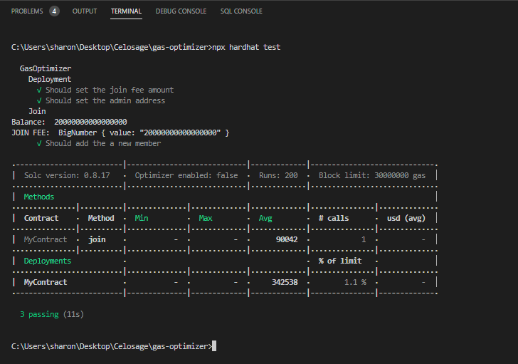
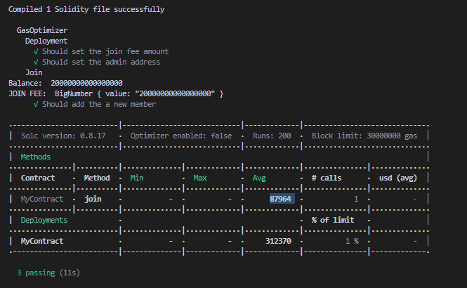
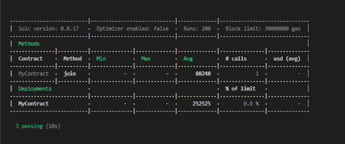

## Introduction​

Gas is the unit of currency used to pay transaction fees on the Celo blockchain. This makes optimizing gas consumption an important consideration when developing smart contracts professionally. In this tutorial, we'll explore some techniques for minimizing gas usage in Solidity smart contracts and demonstrate how to use the Hardhat gas reporter to test the efficiency of our code.

## Prerequisites​

To follow this tutorial, you will need:

- Basic knowledge of Solidity, Ethereum, and smart contracts.
- A local development environment set up with [Node.js](https://nodejs.org/en/) and [npm](https://www.npmjs.com/), as well as the [Hardhat development environment](https://hardhat.org/getting-started/) installed. You can follow the Hardhat installation instructions to get set up.

- An understanding of gas fees and how they are calculated on the Celo network. This knowledge will help us understand the optimizations we will make in this tutorial.

## Requirements

To follow along with this tutorial, you will need the following:

- Basic knowledge of Solidity programming language and Celo blockchain.

- Node.js installed on your machine.

- Hardhat development environment installed. You can install it by running the following command in your terminal:

```bash
yarn add hardhat
```

- An Integrated Development Environment (IDE) such as Visual Studio Code (VS Code) or any other text editor of your choice.

- Basic knowledge of the command line interface (CLI) and the ability to use it to run commands.

- Basic knowledge of JavaScript and familiarity with testing frameworks like Mocha and Chai.

## Setting up your environment

Before we get started, we need to set up our development environment. As we said before, we'll be using hardhat for the major development of the project.

You can clone the starter project here:

```bash
git clone https://github.com/JovanMwesigwa/gas-optimisation-in-celo-smart-contracts/tree/starter
```

Or create a new hardhat project from scratch using the following steps below:

1. Install hardhat by running:

```bash
yarn add hardhat
```

2. Scaffold a new hardhat project by running `npx hardhat`:

```bash
$ npx hardhat
888 888 888 888 888
888 888 888 888 888
888 888 888 888 888
8888888888 8888b. 888d888 .d88888 88888b. 8888b. 888888
888 888 "88b 888P" d88" 888 888 "88b "88b 888
888 888 .d888888 888 888 888 888 888 .d888888 888
888 888 888 888 888 Y88b 888 888 888 888 888 Y88b.
888 888 "Y888888 888 "Y88888 888 888 "Y888888 "Y888

👷 Welcome to Hardhat v2.9.9 👷‍

? What do you want to do? ...
❯ Create a JavaScript project
  Create a TypeScript project
  Create an empty hardhat.config.js
  Quit

```

This will install the necessary packages that we'll use for the whole project.

By default, the gas reporter plugin is disabled in the `hardhat.config.js` file. So, we need to activate it to be able to monitor the contract's gas consumption.

Open the `hardhat.config.js` file and add:

```js
require("@nomicfoundation/hardhat-toolbox");

/** @type import('hardhat/config').HardhatUserConfig */
module.exports = {
  solidity: "0.8.17",
  gasReporter: {
    enabled: true,
    currency: "USD",
  },
};
```

We set the `gasReporter` to `true` to allow hardhat to activate it and set `currency` to `USD`.

## Writing the smart contract

Let's write a very basic smart contract that is using inefficient gas-consuming practices. Then we'll work our way back to optimize it and improve it in terms of gas consumption.

Under the `contracts` folder, create a new contract file name `MyContract.sol`.

Inside the file add:

```solidity
// SPDX-License-Identifier: UNLICENSED
pragma solidity ^0.8.9;

contract MyContract {
    address public owner;
    uint256 public joinFee;

    uint256 public balances = 0;

    address[] public members;

    constructor(address adminAddress, uint256 joinFee_) {
        owner = adminAddress;
        joinFee = joinFee_;
    }

    function join() public payable {
        require(msg.value == joinFee, 'Please pay the join fee to join.');

        members.push(msg.sender);

        balances += msg.value;
    }
}
```

First, there's an `owner` address, which is set when the contract is created by passing in an `adminAddress` as an argument. The `joinFee` is also set when the contract is created, with the `joinFee_` argument.

The `join()` function is where users can join the contract. When they call this function and send in some Celo tokens (represented by `msg.value`), the function checks to make sure they've sent in exactly the right amount of tokens by comparing `msg.value` to `joinFee`. If the user has sent in the right amount, their address is added to the `members` array, and their tokens are added to the `balances` variable.

The contract is pretty simple, but it demonstrates some key concepts of smart contracts: storing and modifying data on the blockchain, and enforcing rules through code.

## Logging the gas estimation

Now that the contract is done, we can compile it.
In the terminal run, `npx hardhat compile`.

To be able to see the contract's gas logs, we need to interact with the contract itself.

To keep the tutorial simple we won't build a front end to interact with the contract. But instead, we'll write tests that will call the contract's functions directly.

Inside the `test` folder, we have a `MyContract.js` file that has a prewritten test that will help interact with the contract's functions.

Here's the code:

```js
const {
  time,
  loadFixture,
} = require("@nomicfoundation/hardhat-network-helpers");
const { anyValue } = require("@nomicfoundation/hardhat-chai-matchers/withArgs");
const { expect } = require("chai");
const { ethers } = require("hardhat");

describe("GasOptimizer", function () {
  async function deployContractFixture() {
    const [owner, otherAccount] = await ethers.getSigners();
    const JOIN_FEE = ethers.utils.parseEther("0.02");

    const MyContract = await ethers.getContractFactory("MyContract");
    const myContract = await MyContract.deploy(owner.address, JOIN_FEE);

    return { myContract, owner, otherAccount, JOIN_FEE };
  }

  describe("Deployment", function () {
    it("Should set the join fee amount", async function () {
      const { myContract, JOIN_FEE, owner } = await loadFixture(
        deployContractFixture
      );
      expect(await myContract.joinFee()).to.equal(JOIN_FEE);
    });

    it("Should set the admin address", async function () {
      const { myContract, JOIN_FEE, owner } = await loadFixture(
        deployContractFixture
      );
      const setOwner = await myContract.owner();
      expect(setOwner.toString()).to.equal(owner.address);
    });
  });

  describe("Join", function () {
    it("Should add the a new member", async function () {
      const { JOIN_FEE, otherAccount, myContract, owner } = await loadFixture(
        deployContractFixture
      );

      await myContract.join({ value: JOIN_FEE });

      const balance = await myContract.balances();

      console.log("Balance: ", balance.toString());
      console.log("JOIN FEE: ", JOIN_FEE);

      expect(balance.toString()).to.be.equal(JOIN_FEE);
    });
  });
});
```

The test function is testing the `join()` function of the `MyContract` smart contract.

Here's what it's doing:

- First, it defines a fixture function `deployContractFixture()` which deploys the `MyContract` contract with an `owner` address and a `JOIN_FEE` value on the constructor.

- Then, it defines two tests in a `Deployment` section to check if the `joinFee` and `owner` are correctly set after the contract is deployed.

- Finally, it defines a test in a `Join` section to test if a new member can join the contract and if the `balances` variable is correctly updated. It does this by calling the `join()` function on the `myContract` instance with the `JOIN_FEE` value and then checking the value of `balances`.

Overall, this test suite ensures that the `MyContract` contract is correctly deployed and that the `join()` function can add new members to the contract and update the `balances` variable.

To run the tests go to the terminal and type:

```bash
npx hardhat test
```

This will run the tests and because we activated the `gasReporter` plugin in the `hardhat.config.js` file, hardhat will print out a gas report analysis of the contract.



The test output shows that all the tests in the script passed successfully.
The first two tests in the Deployment section checked that the join fee amount and admin address were set correctly. The output shows that both tests passed.

The last test in the Join section checks that a new member is added when they join the contract by paying the joining fee. The output shows that a new member was added and the expected join fee was received by the contract.

## Explaining the gas log

The `MyContract` smart contract gas report shows that the `join()` method was called once during the execution of the test suite. The gas report shows that the `join()` method consumed `90042` gas units.

When deploying the contract, the report showed that the `MyContract` smart contract deployment consumed a total of `342538` gas units, which is `1.1%` of the gas limit of `30000000`set for the test run.

The gas usage report is useful for identifying methods that consume a lot of gas and optimizing them to reduce the gas cost of executing transactions on the smart contract.

Our goal is to improve and reduce the amount of gas consumed by calling `join()` and the overall gas consumed by the Contract.

## Optimizing the contract

1. Use `private` rather than `public` for contract state constants:
   Declaring a variable as `public` in Solidity generates an additional getter function to read its value from outside the contract. This additional getter function can make contract execution more expensive in terms of gas costs. On the other hand, declaring a variable as `private` eliminates the need for a getter function, and can save gas costs during contract execution.

2. Use `immutable` for one-time set variables:
   Declaring a variable as `immutable` means that its value is set only once during contract deployment and cannot be changed afterward. This eliminates the need for the storage slot to be writable and saves gas that would otherwise be spent on writing to storage. Additionally, making a variable private and not defining a getter function saves gas that would be spent on creating and executing a getter function.

In `MyContract.sol`, let's change the state variables to `private` as shown below:

```solidity
    address private immutable i_owner;
    uint256 private immutable i_joinFee;

    uint256 private s_balances = 0;
```

Because the `owner` and `joinFee` are not going to change, it only makes sense to make them `immutable` while `balance` will always change when new users join the contract. So it's not `immutable` by default.

Notice how we prefixed the variable names with `i_` at the beginning.
By using the `i_` prefix, it's easy to identify that the variable is both `private` and `immutable`, making the code easier to understand and maintain.
Whereas we prefixed `balances` with `s_` because it's a `storage` that will change often.

Go ahead and update all the new variable names in your functions accordingly.

Making the `i_owner`, `i_joinFee`, and `s_balances` private means we can't access them outside the contract, and yet we may want to read them at some point.

To solve this, we need to create `view` functions that return those values when called outside the contract.

In your contract add:

```solidity
    // View functions
    function getOwner() public view returns (address) {
        return i_owner;
    }

    function getJoinFee() public view returns (uint256) {
        return i_joinFee;
    }

    function getBalances() public view returns (uint256) {
        return s_balances;
    }
```

A `view` function does not modify the state of the contract and returns some value. It is used to read the state of the contract or to perform calculations based on that state. Since it only reads data and does not modify it, it is a cost-effective way of retrieving data without incurring gas costs.

Let's try and run the gas report to see the effects of our changes:

In the terminal run `npx hardhat test`



Look at that!
Our report is better than the previous which spent `90042` gas estimate on the `join()` method now it's down to `87964`.
The overall `MyContract` gas is now `312370` which is a major downgraded from `342538` we got in the first report.

Just by doing the small changes in how we're writing the smart contract, we can see a slight change in the gas report.

We can look at more ways we can improve it further.

3. Use Custom Errors instead of Revert Strings
   Custom errors are more efficient than revert strings. When a contract reverts, all state changes made in the current transaction are undone, and gas is refunded. However, when a custom error is used, the state changes made before the error are not undone, and gas is not refunded. This means that using custom errors can save gas costs compared to using revert strings.

In the `join()` function, we're using `require()` to revert when a user doesn't enter the required `joinFee`. This is not very gas efficient as explained above.

To define a custom error to handle verifying the `joinFee` amount add this line at the top of your contract:

```solidity
// SPDX-License-Identifier: UNLICENSED
pragma solidity ^0.8.9;

error Not__EnoughFeesEntered();
```

Let's replace the `require()` use a more gas-optimal way.

Inside `join()` change:

```solidity
function join() public payable {

      if (msg.value < i_joinFee) {
          revert Not__EnoughFeesEntered();
      }
```

The if block checks whether the value sent by the transaction (`msg.value`) is greater than or equal to the required `i_joinFee`. If the condition evaluates to `false` (i.e., the sent value is less than the required fee), then the function execution is reverted with an error message using the custom error `Not__EnoughFeesEntered()`.

Replacing `require()` with `revert` which defines a custom error proves to be more gas efficient.

We've optimized the error handling in `join()` using custom revert errors.

Let's continue to optimize this function further.

We're using an array to push all the members' addresses in the contract.

This is not very gas efficient because when you use an array to store data, the Solidity compiler creates a getter function that returns the entire array, which can become expensive in terms of gas costs as the size of the array grows. This is because the EVM must load the entire array into memory to read a single element, which can be a significant amount of gas. Additionally, when an element is added or removed from the middle of an array, all subsequent elements must be shifted, which also incurs additional gas costs.

The best option here is to use a `mapping`.

When you use a mapping to store data, the compiler does not create a getter function, and accessing a single element in the mapping is a constant-time operation that always costs the same amount of gas. Additionally, adding or removing an element from a mapping does not require any shifting of data, as each key-value pair in the mapping is stored separately.

To update the contract with a `mapping`, we need to add a state variable that keeps track of all the members in the contract.

```solidity
    uint256 private s_count = 0;

    mapping(uint256 => address) private members;

```

Every new user that is added to the contract will be given the current number according to `s_count` which will use as the key-value pair to access the address directly without looping through the array.

In `join()` add:

```solidity
        members[s_count] = msg.sender;

        s_balances += msg.value;
        s_count += 1;
    }
```

The members mapping is updated by assigning the sender's address `msg.sender` to the key `s_count`.

`s_balances` is then updated by adding the value of funds sent with the transaction to the current balance.

`s_count` is incremented by 1, to reflect the addition of a new member.

Finally, we can now inspect our optimized gas contract in the reporter.

In the terminal run:

```bash
npx hardhat test
```

Output:



Compared to the completely unoptimized contract, the report shows that the `join` function in the `MyContract` consumes `88,248` gas for one call.

There is a significant reduction in the gas consumption of the join function. The previous report showed that the function consumed `325,301` of gas per call, while this report shows consumption of only `88,248` gas per call.

Here's the unoptimized report:


## Conclusion

In conclusion, optimizing gas usage in Solidity smart contracts is essential for reducing transaction costs and improving contract efficiency. By using techniques such as using private instead of public for constants, using view and pure functions, declaring variables with specific data types, and avoiding expensive operations such as loops, developers can significantly reduce gas usage and optimize the contract's performance. With the ever-increasing demand for blockchain-based applications, optimizing gas usage is becoming more critical than ever before, and developers should take it seriously when designing and deploying smart contracts.

## Next Steps

After optimizing gas consumption in your Celo smart contracts with the techniques outlined in this step-by-step guide, there are several next steps you can take to continue improving the efficiency and performance of your contracts. Firstly, you can explore using the Solidity optimizer to further optimize the bytecode of your contracts. Additionally, you can consider implementing more advanced gas optimization techniques, such as using storage arrays instead of memory arrays, using structs to group related data, and leveraging the benefits of function modifiers. You can also explore using gas reporting tools and conducting regular gas audits to monitor the gas usage of your contracts over time. Finally, it's always a good idea to stay up-to-date with the latest developments in the Celo ecosystem and Solidity language to ensure you're taking advantage of the most efficient and effective techniques for optimizing gas consumption in your contracts.

## About the Author​

Created by Jovan Mwesigwa B, Blockchain, Solidity developer

Reach out:
Twitter: [@unreal_joova](http://twitter.com/unreal_joova)
Github: [JovanMwesigwa](https://github.com/JovanMwesigwa)
Linkedin: [JovanMwesigwa](https://www.linkedin.com/in/jovan-mwesigwa/)

## References​

[Hardhat docs](https://hardhat.org/hardhat-runner/docs/getting-started#quick-start) | For hardhat set-up
[Project code](https://github.com/JovanMwesigwa/gas-optimisation-in-celo-smart-contracts) | Github
