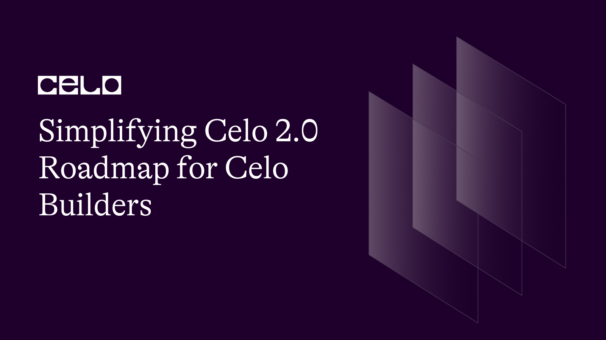

## Introduction​

Since the [Celo whitepaper](https://celo.org/papers/whitepaper) launch in 2018, the mission —to create prosperity for all by reimagining money for the greater good— remains unchanged and developments in the last 5 years have reemphasized this position. Following [the Celo Mainnet going live in May 2020](https://blog.celo.org/its-official-celo-mainnet-is-here-6a3a71763f68#:~:text=We%27re%20excited%20to%20share,April%2022%2C%20is%20officially%20Mainnet!), Celo has consistently delivered easy-to-use payments sent directly to mobile numbers, allow simple stable-value transfers, promote community currencies like Kolektivo Guilder backed by natural assets (ReFi), and provided social dividends by disbursing over $3.3M to 536,000 people across 26 emerging economies through projects like ImpactMarket and GoodDollar.

Having achieved this much, it’s incredible to discover that there is more to come from Celo. These fresh “goodies'' are what the Celo 2.0 roadmap presents to Celo builders/developers especially, as well as other stakeholders in the Celo ecosystem.

## Prerequisites​

For a good grasp of what the Celo 2.0 roadmap offers, you must first understand Celo, the platform’s journey and growth so far (Celo 1.0), how these helped to push the platform’s mission, and how Regenerative finance works on Celo. The following links will come in handy:

* [Regenerative Finance and Celo: The Process and Partnership](https://docs.celo.org/blog/tutorials/regenerative-finance-and-celo-the-process-and-partnership)
* [Celo Docs](https://docs.celo.org/general)

## Celo 2.0: Understanding the Why, How, and What

### Why Celo 2.0?

Celo 2.0 is a product of Celo’s desire to foster the widespread acceptance of Web 3.0 technology through scalability, a vibrant community, and much more. According to [the blog post announcing the Celo 2.0 launch](https://blog.celo.org/the-celoevolution-is-here-a-note-from-our-founders-6b458336303b), the Celo 2.0 roadmap is essential as “_there has never been a more essential time than now to reinvent the long-broken, traditional banking systems which have caused so much damage to vulnerable populations and the planet._”  
For Celo, it is an ever-burning desire to create and foster prosperity for all. While for Celo developers/builders, it is a more enabling Celo ecosystem that satisfies all the scalability needs required to build, market, and efficiently deliver various projects from idea to fruition.

### How Did Celo 2.0 Come to Be?

To develop Celo 2.0, Celo designed a public co-creation process that began in April 2022. This process involved over 75 sessions and lasted for over 150 hours. Most of those involved in this process were Celo stakeholders with considerable impact on the ecosystem.

In the aforementioned blog post, Celo took time to laud these stakeholders again for their contribution to the growth of the brand by facilitating true consensus for a decentralized, permissionless platform that enables broad influence and requires trust and strength.

The final output was announced in January and major developments have followed ever since. You should get on board too if you haven’t. _(More details on how to get on board are below)_

### What Does Celo 2.0 Entail Generally?

The most prominent change that followed the introduction of Celo 2.0 is the new brand design. Now, the brand’s signature interlocking circles have made way for a new block system design.

The new block system design symbolizes a foundational base to represent the ecosystem’s connection to the rest of the world. Also, it exemplifies the transformative impact this connection enables for underserved and unbanked communities as well as the environment. This description is thanks to an explanation of the new logo’s specifics.

Finally, although the fundamental colors of Prosperity Yellow remain constant, the new visual scheme is complemented by fluid typography and warm color treatment.

Aside from the design, Celo 2.0 also welcomes certain events and developments as listed below:

* **The Celo Block Party:** With the first-ever Celo Block Party happening on January 13 at 11 am ET, Celo 2.0 announces a new virtual, quarterly event. This event will celebrate the new brand, with prominent builders and provide an avenue to share ecosystem-wide updates. There will also be special guest appearances from Celo founders and partners.

* **Opera’s Integration:** Celo also announced that Opera’s Crypto Browser has integrated Mento stable asset cUSD into its Opera Mini Wallet. This latest addition is available to over 70 million users in Africa and we look forward to the launch of GoodDollar on Celo this month.

* **Evolua:** Celo users can now take part in a one-week NFT auction, “Evolua,” created in partnership with Valora and Arigallery. For this auction, Celo features eight global artists, including  Marzia Braggion (Portugal), Mercy Thokozane Minah (South Africa), and Juan Jose Giraldo Campuzano (Colombia).

* **CoinMarketCap’s Animated Video Series:** CoinMarketCap is set to release animated video series to educate users globally about the blockchain’s regenerative ecosystem and how leveraging Mento stable assets can foster real-world application.

* **Featured on Brave’s Browser:** Also, Brave Browser’s spotlight campaign featured the new Celo brand identity, on Jan. 23rd.

## Celo 2.0 for Celo Builders

Celo’s vision for the next chapter (Celo 2.0) is to provide the best platform for the efficient building, launching, and scaling of any Web3 project focused on furthering the regenerative economy. The following specifics have been headlined as features to help Celo achieve the aims of the new chapter:

1. ### Sticking to the Ethereum Script

Celo maintains full compatibility with the EVM and aligns hard fork proposals and new EIPs with the Ethereum community. The Celo and Ethereum communities already share technology and people. So, contributing back and developing together when required works seamlessly.

From inception, Celo took the Ethereum blockchain as a starting point and effected several core changes to ensure usability, mobile access, and global payments. With this application, Celo became the first major EVM-compatible Proof-of-Stake L1.

Presently, Celo delivers high transaction throughput, 5-second block times, instant finality, and zero chain reorgs ever. Also, Celo has remained a pacesetter in the Ethereum community. Regardless of these feats and more, Celo is leaving no room for complacency.

Celo hopes to get even closer to Ethereum. The platform already supports governance-approved ERC20s usage to pay for gas. Now, Celo plans to extend this to allow bridged WETH and potentially other tokens widely used on Ethereum. This change will make it much easier for Ethereum users to use apps deployed on Celo.

Overall, Celo will continue to explore opportunities to build even greater operational and economic security as well as strengthen resistance to long-range attacks by leveraging the Ethereum network.

2. ### Making Celo a Rollup-friendly Chain for Horizontal Scalability

One proven way for Celo to achieve horizontal scalability is through L2 rollups to the L1. Rollups offer flexibility while ensuring a strong security model. Celo 2.0 will see Celo become a super-responsive platform to the demands of L2s and L2 builders. The platform will also be a great testbed for enterprises and builders to make the most of rollups and side chains.

Celo 2.0 will also see the contribution of an extension to Celo’s Proof-of-Stake mechanism to enable multi-staking. Hence, any account can now register as a validator and put their stake at risk validating sub-services such as L2 sequencers or decentralized bridges. For this, it doesn't matter whether or not they’re validators on the Celo L1. Now, it’s way simpler for L2s to obtain a high-quality set of validators and lower their cost of capital considerably by permitting validators to receive rewards multiple times on their stake.

More so, recognizing that cost-effective blob storage is essential for L2s to work seamlessly on Celo, Celo 2.0 will follow Ethereum and integrate proto-dank sharding later in the year. Finally, Celo will partner with Hyperlane to research fresh interoperability opportunities that can be shared with the broader Ethereum L2 ecosystem.

3. ### Celo is On-course to Become the Fastest EVM L1

Providing swift L1 block times and high throughput is non-negotiable for every builder today, as well as future L2s. Therefore, in conjunction with Mysten Labs, Celo 2.0 will continue a program of cutting-edge distributed systems and concurrency research to deliver scale-up strategies for Celo to deliver every ounce of single-chain performance, without neglecting full EVM compatibility.

Also, Celo 2.0 is developing a proposal to facilitate throughput improvements by parallelizing transaction execution across all the cores of a server-class machine without compromising EVM compatibility.

4. ### Improving Celo Tokenomics for More Impact

The present Celo’s implementation of EIP-1559 sees the base portion of every transaction fee go to a Community Fund. Celo 2.0 now plans to have Celo burn this base automatically. That way, CELO becomes deflationary under certain conditions.

Also, Celo 2.0 will allow on-chain governance to utilize fees paid to the Community Fund in other assets to buy back CELO and burn that. That also will essentially optimize value for CELO holders.

5. ### Delivering First-class Experience for Celo Builders

Celo 2.0 will ensure that Celo builders enjoy access to a best-in-class suite of tools, services, and APIs. This new chapter will improve the existing support for Foundry, ensuring full compatibility with WalletConnect v2, and more.

To take care of EVM chains being overrun with options, Celo 2.0 will recommend tools for each job applying several use cases and application architectures — and guarantee helpful documentation, tutorials, and glue code.

6. ### Enabling Seamless Wallets and Applications Development

Celo 2.0 also provides building blocks to ensure Celo builders go further faster. This new roadmap allows asset management of larger pools of funds for real-world use cases, s for larger validator sets, and smooth on-chain governance.

Thanks to the public beta of SocialConnect, an evolution of Celo’s initial decentralized phone number mapping, wallets on the Celo network can now safely map any social identifiers to an address. At full deployment, users on any of these wallets can make transfers to each other using only a phone number.

## Impacts of Celo 2.0 on Celo’s Mission

Celo’s principal mission — to create the conditions for prosperity for everyone — is what fuels everything the Celo 2.0 roadmap highlights. With the specifics from this new chapter in Celo, this mission as well as the platform’s ReFi and mobile-first ideals are on course for more fruition.

This new roadmap ensures the achievement of this mission by delivering a more-enabled platform that encourages builders to reimagine money to meet the needs of their communities and build towards that purpose.

## Conclusion​

The Celo 2.0 roadmap is available for both builders presently in the Celo ecosystem and others willing to join. Ensure you do the following to harness the potential in this new chapter with Celo as a builder:

* Join the Celo community on [Discord](https://discord.gg/celo) and pick your role as a Developer in the “Pick your Roles” channel.

* Sign up for [the Celo Forum](https://forum.celo.org/) to stay in touch with other Celo builders and get access to information necessary for a hitch-free building.

* Follow Celo on [Twitter](https://twitter.com/CeloOrg?s=20) to not miss out on any updates.

Links to every other platform you need to be a part of to get the best from this new chapter in the Celo ecosystem are in the link below:

* [Join the Community](https://docs.celo.org/community/join-the-community)

## Next Steps​

After joining the communities and you are ready to build, ensure you go through the Celo docs through the link below to seamlessly navigate the Celo platform and the right tools.

* [Celo Docs](https://docs.celo.org/)

## About the Author​

[Israel Okunaya](https://meetisraelokunaya.curious.page/) is an ace writer with a flair for simplifying complexities and a knack for storytelling. He leverages over four years of experience to meet the most demanding writing needs in different niches, especially food and travel, blockchain, and marketing. He sees blockchain as a fascinating yet tricky affair. So, he's given to simplifying its complexities with text and video tutorials.

## References​

* [Celo Upgrades Brand and Thanks Users for their Contribution](https://cryptotvplus.com/2023/01/celo-upgrades-brand-and-thanks-users-for-their-contribution/)
* [The Celo Evolution is Here. A Note From Our Founders](https://blog.celo.org/the-celoevolution-is-here-a-note-from-our-founders-6b458336303b)
* [Introducing Celo 2.0 by cLabs](https://blog.celo.org/the-next-chapter-introducing-celo-2-0-by-clabs-b535db54a564)
