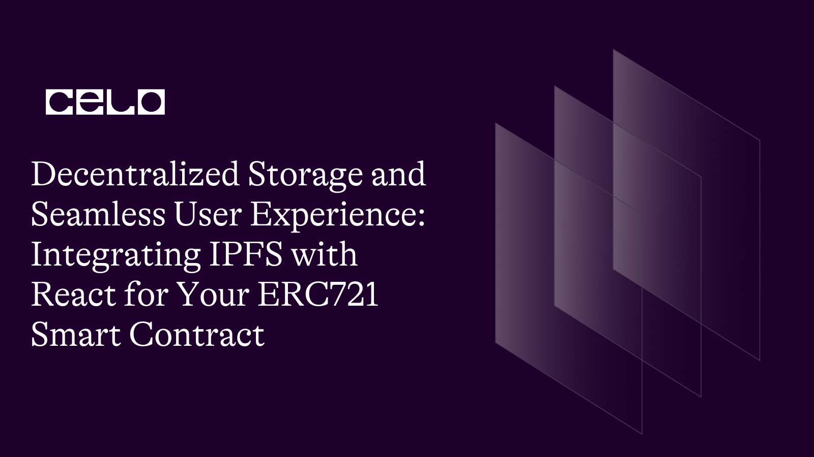
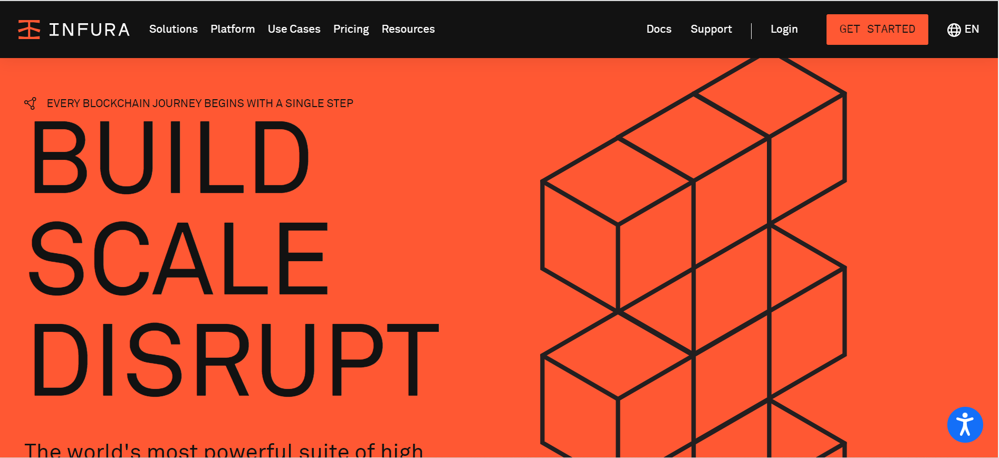
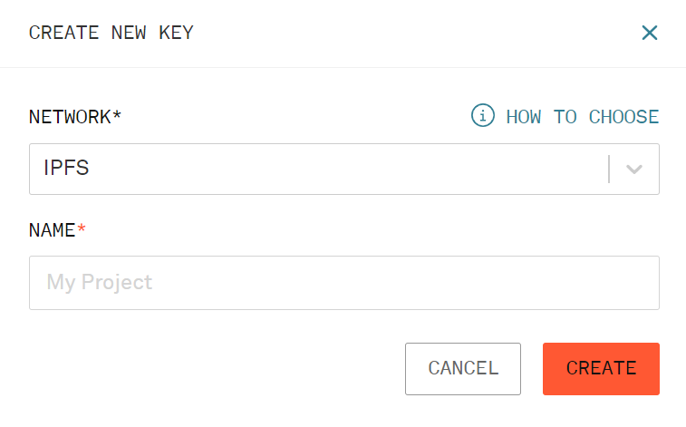

## Introduction

Welcome! Welcome!! Welcome!!! to another tutorial, This tutorial is part of a bigger NFT series and the aim of this is to help one become an expert in building NFT marketplaces as we know, NFTs are the future.
In this tutorial, we would be going through the basics of NFT and how to implement it in your react project.
We would be explaining parts of a bigger project and may leave some parts out that might not be relevant to this tutorial.

Following the project, we would need to store our images on IPFS so we could use that for the image URL as in the contract we would use for this NFT pathway.

### MyNFT.sol

```js
// SPDX-License-Identifier: MIT
pragma solidity ^0.8.0;

import "@openzeppelin/contracts/token/ERC721/ERC721.sol";
import "@openzeppelin/contracts/token/ERC721/extensions/ERC721Enumerable.sol";
import "@openzeppelin/contracts/token/ERC721/extensions/ERC721URIStorage.sol";
import "@openzeppelin/contracts/access/Ownable.sol";
import "@openzeppelin/contracts/utils/Counters.sol";

contract MyNFT is ERC721, Ownable, ERC721Enumerable, ERC721URIStorage {
    using Counters for Counters.Counter;

    Counters.Counter private _tokenIdCounter;
    address contractAddress;

    constructor(address marketplace) ERC721("Dripto Ponks", "DPT") {
        contractAddress = marketplace;
    }

    uint256 _tokenId = 0;

    function mint(string memory uri) external returns (uint256) {
        _tokenId++;
        _mint(msg.sender, _tokenId);
        _setTokenURI(_tokenId, uri);
        setApprovalForAll(contractAddress, true);
        return _tokenId;
    }

    function resaleApproval(uint256 tokenId) public {
        require(
            ownerOf(tokenId) == msg.sender,
            "You must own this NFT in order to resell it"
        );
        setApprovalForAll(contractAddress, true);
        return;
    }

    function getTokenId() external view returns (uint256) {
        return _tokenId;
    }

    // The following functions are overrides required by Solidity.

    function _beforeTokenTransfer(
        address from,
        address to,
        uint256 tokenId
    ) internal override(ERC721, ERC721Enumerable) {
        super._beforeTokenTransfer(from, to, tokenId);
    }

    function _burn(uint256 tokenId)
        internal
        override(ERC721, ERC721URIStorage)
    {
        super._burn(tokenId);
    }

    function tokenURI(uint256 tokenId)
        public
        view
        override(ERC721, ERC721URIStorage)
        returns (string memory)
    {
        return super.tokenURI(tokenId);
    }

    function supportsInterface(bytes4 interfaceId)
        public
        view
        override(ERC721, ERC721Enumerable)
        returns (bool)
    {
        return super.supportsInterface(interfaceId);
    }
}
```

### MyNFTMarket.sol

```js
// SPDX-License-Identifier: MIT
pragma solidity ^0.8.0;

import "@openzeppelin/contracts/token/ERC721/IERC721.sol";

contract MyNftMarket {
	struct Listing {
		address payable seller;
        address payable owner;
		address token;
		uint tokenId;
		uint price;
        bool sold;
	}

	uint private _listingId = 0;
	mapping(uint => Listing) private _listings;

	function listToken(address token, uint tokenId, uint price) external {
		IERC721(token).transferFrom(msg.sender, address(this), tokenId);

		Listing memory listing = Listing(
			payable(msg.sender),
            payable(address(this)),
			token,
			tokenId,
			price,
            false
		);
		_listings[_listingId] = listing;
		_listingId++;

	}

	function getListing(uint listingId) public view returns (Listing memory) {
		return _listings[listingId];
	}

    function getListingLength()public view returns (uint){
        return _listingId;
    }

	function buyToken(uint listingId) public payable {
		Listing storage listing = _listings[listingId];

		require(msg.value == listing.price, "Insufficient payment");

		IERC721(listing.token).transferFrom(listing.owner, msg.sender, listing.tokenId);
		payable(listing.seller).transfer(msg.value);

        listing.sold = true;
        listing.price = listing.price * 2;
        listing.owner = payable(msg.sender);
		listing.seller = payable(msg.sender);

	}
}
```


## Prerequisites

Building this dapp, you would need:

- Solid understanding of Javascript
- Basic grasp of solidity
- Basic Understanding of REST APIs

## Requirements

- VSCode or any other editor
- A terminal
- React
- Infura


## What Is IPFS?

The InterPlanetary File System (IPFS) is a peer-to-peer protocol and network designed to create a more resilient and decentralized web. It is a distributed system for storing and accessing files, websites, applications, and data that is designed to be more secure, faster, and more reliable than traditional centralized web protocols. IPFS is an open-source project that was first introduced by Juan Benet in 2014.

IPFS is a protocol and network for sharing and storing files. It is built on top of the BitTorrent protocol and allows users to share files and data without relying on a central server or data center. Instead, files are stored on a network of computers, called nodes, that are connected to each other in a peer-to-peer fashion. This means that files are distributed across the network, making it more resilient and less vulnerable to failures or attacks.

## How Does IPFS Work

IPFS works by using content-based addressing instead of location-based addressing. In traditional web protocols, such as HTTP, files are addressed based on their location on a server. In IPFS, files are addressed based on their content. This means that each file has a unique cryptographic hash that identifies its content. When a user requests a file, they send the hash to the network, and the network retrieves the file from the node that has it.

IPFS also uses a distributed hash table (DHT) to locate files on the network. The DHT is a database that stores information about the network's nodes and the files they have. When a user requests a file, the DHT is used to find the nodes that have the file, and the file is retrieved from those nodes. [Learn More](https://docs.ipfs.io/)

## Getting Started

Infura is a popular platform that provides API access to IPFS. In this guide, we'll walk you through the steps to get started using Infura to access IPFS.



### Step 1: Create an Infura account

The first step is to create an account on Infura. Go to the Infura website (https://infura.io/) and sign up for a free account. Once you have created an account, log in to your dashboard.

### Step 2: Create a new project

Once you have logged in to your Infura dashboard, you can create a new project by clicking on the "Create New Project" button. Give your project a name and select "IPFS" as the project type.

### Step 3: Generate an API key

To use Infura to access IPFS, you'll need to generate an API key. To do this, go to your project dashboard and click on the "Settings" tab. Under the "Keys" section, click on the "Generate New Key" button to generate a new API key.



### Step 4: Install the IPFS HTTP client

To interact with the Infura IPFS API, you can use the IPFS HTTP client. The client is available for Node.js, JavaScript, and other programming languages. In this guide, we'll be using the JavaScript client.

To install the IPFS HTTP client, open a terminal or command prompt and enter the following command:

```
npm install ipfs-http-client
```

### Step 5: Connect to the Infura IPFS API

Once you have installed the IPFS HTTP client, you can connect to the Infura IPFS API by creating an instance of the client and passing in your Infura API key.

## Implementing in React

If you're working on a React project, you will use the `dotenv` package to load your Infura API key from a `.env` file. Here's an example of how to use it:

Step 1: Install the `dotenv` package

In your React project directory, run the following command to install the `dotenv` package:

```
npm install dotenv
```

Step 2: Create a `.env` file

Create a `.env` file in your project directory and add your Infura API key to it:

```
REACT_APP_PROJECT_ID=your_infura_project_id
REACT_APP_PROJECT_SECRET=your_infura_api_key
```

Note that the variable name starts with `REACT_APP_` prefix, as this is required to make the environment variable available to your React application.

Step 3: Load the environment variables in your React app

At the top of your React app's entry point file (usually `index.js`), require the `dotenv` package and call the `config` method:

```js
import React from 'react';
import ReactDOM from 'react-dom';
import dotenv from 'dotenv';

dotenv.config();

ReactDOM.render(
  <React.StrictMode>
    <App />
  </React.StrictMode>,
  document.getElementById('root')
);
```

Step 4: Use the Infura API key in your code

You can access the Infura API key in your React code using `process.env.REACT_APP_INFURA_API_KEY`. 

## Minter.js

In the minter.js file, which would be where we implement the IPFS feature,  we would start by importing a few things.

```js
import { create } from "ipfs-http-client";
import axios from "axios";
import { BigNumber, ethers } from "ethers";
```

The three imports in the given code snippet are used to provide functionalities for a web application that interacts with IPFS and Ethereum networks. 

`ipfs-http-client` provides an HTTP client instance that allows you to interact with the IPFS network via HTTP API. You can create an instance of the client using the `create` method, which takes an options object as an argument, that can be used to specify the host, port, and protocol of the IPFS node to connect to.

`axios` provides an easy-to-use interface for making HTTP requests from your application. It can be used to fetch data from a backend API or to send data to a server.

`ethers` is a library for interacting with the Ethereum network and smart contracts. It provides a provider interface for interacting with the Ethereum network, a contract abstraction layer for working with smart contracts, and a wallet interface for managing Ethereum accounts.

Next up, you would create an HTTP client instance that is authorized to access the Infura IPFS node and can be used to interact with the IPFS network. 


```js
const authorization =
    "Basic " +
    Buffer.from(
        process.env.REACT_APP_PROJECT_ID +
        ":" +
        process.env.REACT_APP_PROJECT_SECRET
    ).toString("base64");

const client = create({ url: "https://ipfs.infura.io:5001/api/v0", headers: { authorization } });
```

The `authorization` constant is used to authenticate the client instance to access IPFS services provided by Infura.

The `Buffer.from()` method is used to create a buffer from the concatenated string of project ID and project secret that are stored as environment variables (`REACT_APP_PROJECT_ID` and `REACT_APP_PROJECT_SECRET`). The buffer is then encoded using the `toString("base64")` method to create a base64-encoded string. This string is then concatenated with the string "Basic " to create the `authorization` string that is used as a header in the HTTP client instance.

The `create` method of the `ipfs-http-client` library is then used to create an HTTP client instance that connects to the Infura IPFS node. The `url` property specifies the URL of the Infura IPFS node, and the `headers` property is an object that contains the authorization header that was created earlier.

In the `createNft` function which is an asynchronous function that takes in six arguments.

```js
export const createNft = async (
  minterContract,
  marketContract,
  performActions,
  { name, price, description, ipfsImage, attributes }
) => {
``` 

The first two arguments, `minterContract` and `marketContract`, represent smart contract instances that are used to mint the NFT token and create a market for it, respectively. 

The third argument, `performActions`, represents a function that is used to perform a series of actions within a single transaction. This function is typically provided by a higher-level component that wraps the `createNft` function.

The remaining three arguments, `name`, `price`, and `description`, represent the name, price, and description of the NFT token, respectively. The `ipfsImage` argument is the IPFS hash of the image file that is stored on the IPFS network, and `attributes` represent the attributes of the NFT token.

Inside the `createNft` function, there is an asynchronous block of code that performs the following actions:

The given code snippet is a part of an asynchronous function called `createNft`. Inside the function, there is a block of code that is wrapped in the `performActions` function. 

The `performActions` function takes in an async callback function that receives a `kit` object as an argument. The `kit` object represents the set of web3 tools that are required to interact with the Ethereum blockchain. 

Inside the async callback function, there is a conditional statement that checks whether `name`, `description`, and `ipfsImage` are not empty. If any of these values is empty, the function returns.

If all the required parameters are available, the function retrieves the default account from the `kit` object, which is used as the owner of the NFT token.

After that, the code creates a JSON object that represents the metadata of the NFT token. The object includes the `name`, `description`, `image`, `owner`, and `attributes` of the token. 

The `image` field of the metadata object is set to the `ipfsImage` argument, which is the IPFS hash of the image file that is stored on the IPFS network.

The metadata object is then converted to a JSON string and stored in the `data` variable.

Next up, The second block of code in the `createNft` function starts with a `try` block. Inside the `try` block, there are several steps that are executed.

```js
    try {
      // save NFT metadata to IPFS
      const added = await client.add(data);

      // IPFS url for uploaded metadata
      const url = `https://diac.ipfs.infura.io/ipfs/${added.path}`;

      // mint the NFT and save the IPFS url to the blockchain
      let tx = await minterContract.methods
        .mint(url)
        .send({ from: defaultAccount });
      let tokenId = BigNumber.from(tx.events.Transfer.returnValues.tokenId);

      const auctionPrice = ethers.utils.parseUnits(String(price), "ether");

      await marketContract.methods
        .listToken(MyNFTContractAddress.MyNFT, tokenId, auctionPrice)
        .send({ from: defaultAccount });
    } catch (error) {
      console.log("Error uploading file: ", error);
    }
```

First, the metadata of the NFT token that was created in the previous block of code is uploaded to the IPFS network using the `client.add` method. The `add` method takes the `data` variable as an argument and returns an object that contains the IPFS hash of the uploaded file. The `added.path` property of the returned object is used to construct the IPFS URL for the uploaded metadata.

Next, the `mint` method of the `minterContract` is called with the IPFS URL as an argument to create a new NFT token. The `mint` method returns a transaction object that is assigned to the `tx` variable.

The `tokenId` of the newly created NFT token is extracted from the transaction object using the `returnValues.tokenId` property. The `BigNumber.from` method is used to convert the `tokenId` to a `BigNumber` instance.

After that, the `parseUnits` method of the `ethers.utils` object is used to convert the `price` argument to an amount that can be used in the Ethereum blockchain. The converted price is then passed to the `listToken` method of the `marketContract` along with the `MyNFTContractAddress.MyNFT` and `tokenId` as arguments.

Finally, the `send` method is called on the `listToken` method with the `defaultAccount` as the `from` argument to execute the transaction on the blockchain.

If any errors occur during this process, they are caught in the `catch` block, and an error message is logged to the console.

The final function we would cover in this tutorial would be getting the meta details stored in IPFS from the URL which would be the `fetchNftMeta` function which is an asynchronous function that takes an IPFS URL as an argument. This function is used to fetch the metadata of an NFT from the IPFS network.

```js
export const fetchNftMeta = async (ipfsUrl) => {
  try {
    if (!ipfsUrl) return null;
    const meta = await axios.get(ipfsUrl);
    return meta;
  } catch (e) {
    console.log({ e });
  }
};
```

Inside the function, the `try` block is used to execute the following code:

Firstly, it checks whether the IPFS URL argument is null or undefined. If it is null or undefined, then the function immediately returns `null` and does not execute the rest of the code.

If the IPFS URL is not null or undefined, then the `axios.get()` method is called with the IPFS URL as an argument. This method returns a Promise object that resolves to a response object that contains the NFT metadata.

If the metadata is successfully retrieved, the function returns the `meta` object.

If an error occurs during the process of retrieving the metadata, then the `catch` block is executed. In this block, the error object is logged to the console using `console.log({ e })`. The function then returns `null`.

The `fetchNftMeta` function is a simple utility function that uses the `axios` library to retrieve NFT metadata from the IPFS network asynchronously. This function is commonly used in NFT applications to retrieve the metadata associated with an NFT token.

### Full Code

```js
import {create} from "ipfs-http-client";
import axios from "axios";
import MyNFTContractAddress from "../contracts/MyNFT-address.json";
import { BigNumber, ethers } from "ethers";

const authorization =
    "Basic " +
    Buffer.from(
        process.env.REACT_APP_PROJECT_ID +
        ":" +
        process.env.REACT_APP_PROJECT_SECRET
    ).toString("base64");

const client = create({ url: "https://ipfs.infura.io:5001/api/v0", headers: { authorization } });

export const createNft = async (
  minterContract,
  marketContract,
  performActions,
  { name, price, description, ipfsImage, attributes }
) => {
  await performActions(async (kit) => {
    if (!name || !description || !ipfsImage) return;
    const { defaultAccount } = kit;

    // convert NFT metadata to JSON format
    const data = JSON.stringify({
      name,
      description,
      image: ipfsImage,
      owner: defaultAccount,
      attributes,
    });

    try {
      // save NFT metadata to IPFS
      const added = await client.add(data);

      // IPFS url for uploaded metadata
      const url = `https://diac.ipfs.infura.io/ipfs/${added.path}`;

      // mint the NFT and save the IPFS url to the blockchain
      let tx = await minterContract.methods
        .mint(url)
        .send({ from: defaultAccount });
      let tokenId = BigNumber.from(tx.events.Transfer.returnValues.tokenId);

      const auctionPrice = ethers.utils.parseUnits(String(price), "ether");

      await marketContract.methods
        .listToken(MyNFTContractAddress.MyNFT, tokenId, auctionPrice)
        .send({ from: defaultAccount });
    } catch (error) {
      console.log("Error uploading file: ", error);
    }
  });
};


export const getNfts = async (minterContract, marketContract) => {
  try {
    const nfts = [];
    const nftsLength = await marketContract.methods.getListingLength().call();
    for (let i = 0; i < Number(nftsLength); i++) {
      const nft = new Promise(async (resolve) => {
        const listing = await marketContract.methods.getListing(i).call();
        const res = await minterContract.methods
          .tokenURI(listing.tokenId)
          .call();
        const meta = await fetchNftMeta(res);
        const owner = await fetchNftOwner(minterContract, listing.tokenId);
        resolve({
          index: i,
          contractOwner: owner,
          owner: listing.owner,
          seller: listing.seller,
          price: listing.price,
          sold: listing.sold,
          token: listing.token,
          tokenId: listing.tokenId,
          name: meta.data.name,
          image: meta.data.image,
          description: meta.data.description,
          attributes: meta.data.attributes,
        });
      });
      nfts.push(nft);
    }
    return Promise.all(nfts);
  } catch (e) {
    console.log({ e });
  }
};

export const fetchNftMeta = async (ipfsUrl) => {
  try {
    if (!ipfsUrl) return null;
    const meta = await axios.get(ipfsUrl);
    return meta;
  } catch (e) {
    console.log({ e });
  }
};

export const fetchNftOwner = async (minterContract, index) => {
  try {
    return await minterContract.methods.ownerOf(index).call();
  } catch (e) {
    console.log({ e });
  }
};

export const fetchNftContractOwner = async (minterContract) => {
  try {
    let owner = await minterContract.methods.owner().call();
    return owner;
  } catch (e) {
    console.log({ e });
  }
};

export const buyNft = async (
  minterContract,
  marketContract,
  performActions,
  index,
  tokenId
) => {
  try {
    await performActions(async (kit) => {
      try {
        console.log(marketContract, index);
        const { defaultAccount } = kit;
        const listing = await marketContract.methods.getListing(index).call();
        await marketContract.methods
          .buyToken(index)
          .send({ from: defaultAccount, value: listing.price });
        await minterContract.methods.resaleApproval(tokenId).send({from: defaultAccount})
      } catch (error) {
        console.log({ error });
      }
    });
  } catch (error) {
    console.log(error);
  }
};

```

## Conclusion

Congratulations! You have completed the tutorial that guides you through the process of creating and storing NFT metadata on the IPFS network. By following this tutorial, you have learned how to use the Infura REST API to upload files to IPFS, how to use Infura to access the IPFS network, and how to use the IPFS client library to store NFT metadata on the network.


##  Next Steps

We only covered a specific aspect of this pathway tutorial, We would cover the remainder of the minter.js file in another tutorial as they do not implement IPFS. But you can try it out yourself by using the full project [here](https://github.com/dahnny/dripto-ponks)

## About the Author

Daniel Ogbuti is a web3 developer with a passion for teaching as well as learning. I would love to connect on Twitter @daniel_ogbuti and linkedin @ Daniel Ogbuti

See you soon!


