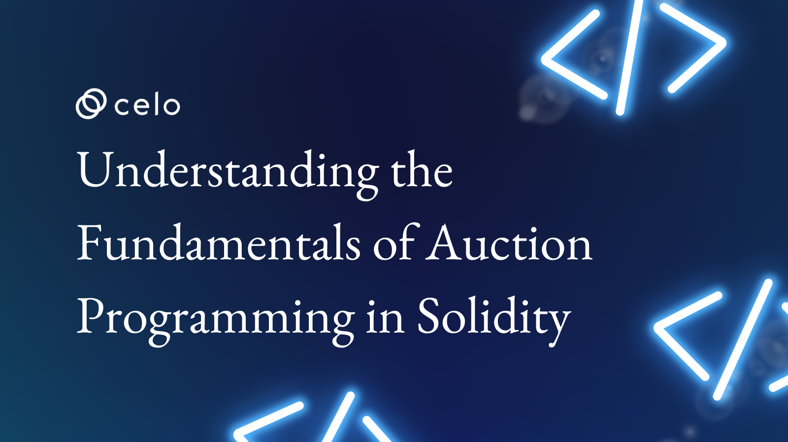

## Introduction

Auction programming is a critical component of online buying and selling. It establishes auction rules and determines the highest bidder. The auction contract is a computer program that keeps track of all bids and ensures that the process is fair. In this article, we will look at the fundamentals of auction programming and its significance in the digital world.


## Prerequisites

Understanding the fundamentals of blockchain technology and the concept of smart contracts is required to comprehend the use of auction programming in this context.

Basic knowledge of auctions: Understanding the purpose of auction programming in this context requires familiarity with the concept of auctions and how they work.


## Requirements

- Make sure you have [Remix](https://remix.ethereum.org/#optimize=false&runs=200&evmVersion=null&version=soljson-v0.8.17+commit.8df45f5f.js) 


## Auction Programming: What It Is and Why It's Important

Have you ever wondered how people use the internet to buy and sell items? Have you ever heard of the stock exchange and wondered how it works? Auction programming is a big part of that!

Auction programming allows people to buy and sell items, such as stocks, by placing bids on them. The highest bidder wins the auction and receives the item or stock on which they bid.


This procedure is carried out using a computer program known as an “auction contract”. The contract specifies the parameters of the auction, such as when it will begin and end. It also keeps track of all the bids and decides who wins.

So the next time you hear the term "auction programming," you'll know exactly what it is and why it's used.


## Auction Programming in Blockchain Technology: How it Works

Do you know what blockchain technology is? It is a safe, secure, and difficult-to-change method of storing and sharing information on the internet. It's used for a variety of things, including the creation of digital money, but did you know that auction programming is also a big part of it?


## Blockchain technology is used in auction programming to create what is known as a “smart contract.”

A smart contract is a computer program that establishes the rules for an auction and records all bids. It functions similarly to a digital auctioneer, ensuring that everything is fair and runs smoothly. When someone wins the auction, the smart contract ensures that they receive the item they won and that the seller receives payment.


## Getting to Know Solidity: An Introduction to the Solidity Language


Have you heard of the terms **“coding” or “programming”?** It is a method of instructing computers to perform tasks. There are numerous programming languages, with Solidity being one of the most important for blockchain technology.

Solidity is a programming language used on the Ethereum blockchain to create smart contracts. There are numerous programming languages, just as there are numerous human languages. Solidity was designed specifically for the Ethereum blockchain and simplifies the creation of smart contracts.

When you write a smart contract in Solidity, you use code to define the contract's rules and instructions. You can, for example, specify the starting price of an auction, the deadline for bidding, and who is eligible to participate. When someone wants to participate in the auction, they can use the Solidity code to place a bid, and the smart contract will ensure that everything goes smoothly.


## Solidity and the Ethereum Blockchain: How They Work Together


Have you heard of **Ethereum's blockchain?** It is a digital ledger that stores data and is used to create digital money and smart contracts. And, while we're on the subject of smart contracts, have you heard of Solidity?

The Ethereum blockchain is a unique and powerful technology, but it requires a programming language like Solidity to be fully realized.

**Solidity** is a language that communicates with the Ethereum blockchain in the same way that we use a language like English to communicate with one another. It sends instructions to the blockchain, which ensures that the smart contract functions properly.

Solidity and the Ethereum blockchain are two critical technologies that complement each other. Solidity is a programming language for creating smart contracts on the Ethereum blockchain, and the Ethereum blockchain ensures that smart contracts run smoothly and fairly. These two technologies are contributing to a safer and more secure world of digital money and online transactions.


## Auction Programming: What It Is and How It Works


So, what are the fundamental principles of auction programming? 

There are three major components:

- **Bidding:** This is the process by which people place bids on items they want to purchase. The computer program records the bids, and the highest bid wins.

- **Time:** Bidding has a deadline, just like in a regular auction. The computer program ensures that bidding stops after the deadline and that the winner is selected.

- **Rules:** The computer program determines the rules of the auction. This includes details such as the starting price, the deadline for bidding, and who is eligible to participate in the auction.


Here is a code snippet that explains how auction programming works in Solidity version 0.8.4:

```solidity
// SPDX-License-Identifier: GPL-3.0
pragma solidity ^0.8.4;
contract SimpleAuction {
    // Parameters of the auction. Times are either
    // absolute unix timestamps (seconds since 1970-01-01)
    // or time periods in seconds.
    address payable public beneficiary;
    uint public auctionEndTime;

    // Current state of the auction.
    address public highestBidder;
    uint public highestBid;

    // Allowed withdrawals of previous bids
    mapping(address => uint) pendingReturns;

    // Set to true at the end, disallows any change.
    // By default initialized to `false`.
    bool ended;

    // Events that will be emitted on changes.
    event HighestBidIncreased(address bidder, uint amount);
    event AuctionEnded(address winner, uint amount);

    // Errors that describe failures.

    // The triple-slash comments are so-called natspec
    // comments. They will be shown when the user
    // is asked to confirm a transaction or
    // when an error is displayed.

    /// The auction has already ended.
    error AuctionAlreadyEnded();
    /// There is already a higher or equal bid.
    error BidNotHighEnough(uint highestBid);
    /// The auction has not ended yet.
    error AuctionNotYetEnded();
    /// The function auctionEnd has already been called.
    error AuctionEndAlreadyCalled();

    /// Create a simple auction with `biddingTime`
    /// seconds bidding time on behalf of the
    /// beneficiary address `beneficiaryAddress`.
    constructor(
        uint biddingTime,
        address payable beneficiaryAddress
    ) {
        beneficiary = beneficiaryAddress;
        auctionEndTime = block.timestamp + biddingTime;
    }

    /// Bid on the auction with the value sent
    /// together with this transaction.
    /// The value will only be refunded if the
    /// auction is not won.
    function bid(uint _amount) external payable {
        // No arguments are necessary, all
        // information is already part of
        // the transaction. The keyword payable
        // is required for the function to
        // be able to receive Ether.

        // Revert the call if the bidding
        // period is over.
        if (block.timestamp > auctionEndTime)
            revert AuctionAlreadyEnded();

        // If the bid is not higher, send the
        // money back (the revert statement
        // will revert all changes in this
        // function execution including
        // it having received the money).
        if (_amount <= highestBid)
            revert BidNotHighEnough(highestBid);

        if (highestBid != 0) {
            // Sending back the money by simply using
            // highestBidder.send(highestBid) is a security risk
            // because it could execute an untrusted contract.
            // It is always safer to let the recipients
            // withdraw their money themselves.
            pendingReturns[highestBidder] += highestBid;
        }
        highestBidder = msg.sender;
        highestBid = _amount;
        emit HighestBidIncreased(msg.sender, _amount);
    }

    /// Withdraw a bid that was overbid.
    function withdraw() external returns (bool) {
        uint amount = pendingReturns[msg.sender];
        if (amount > 0) {
            // It is important to set this to zero because the recipient
            // can call this function again as part of the receiving call
            // before `send` returns.
            pendingReturns[msg.sender] = 0;

            // msg.sender is not of type `address payable` and must be
            // explicitly converted using `payable(msg.sender)` in order
            // use the member function `send()`.
            if (!payable(msg.sender).send(amount)) {
                // No need to call throw here, just reset the amount owing
                pendingReturns[msg.sender] = amount;
                return false;
            }
        }
        return true;
    }

    /// End the auction and send the highest bid
    /// to the beneficiary.
    function auctionEnd() external {
        // It is a good guideline to structure functions that interact
        // with other contracts (i.e. they call functions or send Ether)
        // into three phases:
        // 1. checking conditions
        // 2. performing actions (potentially changing conditions)
        // 3. interacting with other contracts
        // If these phases are mixed up, the other contract could call
        // back into the current contract and modify the state or cause
        // effects (ether payout) to be performed multiple times.
        // If functions called internally include interaction with external
        // contracts, they also have to be considered interaction with
        // external contracts.

        // 1. Conditions
        if (block.timestamp < auctionEndTime)
            revert AuctionNotYetEnded();
        if (ended)
            revert AuctionEndAlreadyCalled();

        // 2. Effects
        ended = true;
        emit AuctionEnded(highestBidder, highestBid);

        // 3. Interaction
        beneficiary.transfer(highestBid);
    }
}
```


This code implements a basic auction program on the Ethereum blockchain. It contains information about the auction, such as the end time and who will benefit from it, as well as the current highest bid and who made it.

People can bid on the auction by sending money, but their money will be returned if the auction has already ended or if their bid is insufficient. The highest bid will be sent to the beneficiary at the end of the auction.

The code also includes some safety precautions and error messages for situations such as attempting to withdraw money before the auction has ended or if there have been any problems.

Now head over to remix, then copy and paste the contract code above into a newly created contract file **auction.sol**

After writing the code, press **Ctrl + S** to compile it; once compiled, deploy it as shown in the image below:


- Once the contract is deployed, you can begin interacting with it


- I clicked on **“Bid”**, entered the amount I wanted to bid, which is 2, and clicked “Transact”. You can enter any amount you want and click “Transact”.  This is just an example.**


- As a result, at the end of the auction, the contract will list all of the transactions that occurred during the auction, as shown in the images below:


- This is the highest bidder


- This is the highest bid


- The address of the beneficiary


- Unix timestamp of the auction’s conclusion


## Syntax used in Solidity to implement auction programming


The **syntax** used in Solidity to implement auction programming will be discussed in this code outline. Understanding the fundamentals of this syntax will allow you to create a basic auction contract in Solidity.


### Variables:

In a Solidity contract, variables are used to store information. The following is an example of a variable declaration in Solidity:


pragma solidity ^0.8.17;

contract Auction {
    uint256 public currentBid;
}


### Functions:

In a Solidity contract, functions are used to carry out specific tasks.
 Here's an example of how to declare a function in Solidity.


pragma solidity ^0.8.17;

contract Auction {
    function placeBid() public {
        // code to place a bid goes here
    }
}


### Conditions:

Conditions are used in Solidity contracts to make decisions based on specific conditions. An example of a condition in Solidity is as follows:


pragma solidity ^0.8.17;

contract Auction {
    function placeBid(uint256 bidAmount) public {
        if (bidAmount > currentBid) {
            // code to accept the bid goes here
        }
    }
}


### Loops:

Loops are used to repeat a process several times. In Solidity, the following is an example of a loop:


pragma solidity ^0.8.17;

contract Auction {
    uint256 public endTime;

    function checkAuctionEnd() public {
        while (now < endTime) {
            // code to wait until auction ends go here
        }
        // code to pay out winning bidder goes here
    }
}

You can create a simple auction contract in Solidity by understanding and applying these basic syntax elements. Always test and validate your code before deploying it to the Ethereum blockchain.


## A step-by-step guide to implementing an auction contract in Solidity


### Specify the contract:

- Begin by specifying the Solidity compiler version with a pragma statement.

- Use the "contract" keyword to declare the contract.

- Define the variables that will be used to store the contract's state, such as the highest bidder, bid amount, and so on.


### Put the constructor into action:

- Name the constructor function the same as the contract.

- Set the variables in the constructor function to their default values.

- Configure the payable keyword to accept ethers as the bid currency.


### Put the bidding function into action:

- Create the function for accepting bids.

- Make sure the bid amount is greater than the current highest bid.

- If the bid is valid, update the highest bidder and bid amount.


### Put the auction end function into action:

- Create the function that will end the auction.

- Check the end time to ensure that the auction has ended.

- Return the ethers to the contract owner from the highest bidder.


### Put the getter functions into action:

- Define the getter functions for accessing the contract's state.

- Return the values of the contract's variables.


This is a high-level overview of how to implement an auction contract in Solidity. The actual code may differ depending on the auction's specific requirements and features.


Learning about smart contracts and blockchain technology through auction programming in Solidity can be a fun and exciting experience. With these hints, you'll be well on your way to becoming an expert in Solidity auction programming.


### Conclusion


Meanwhile, we learned about auction programming and how to use the Solidity programming language to implement it on the Ethereum blockchain. We talked about the fundamentals of auction programming and the syntax used in Solidity to make it happen. 

We also took a step-by-step approach to implement an auction contract in Solidity and coding the various auction contract functions.

To sum up, it is critical to remember the key points discussed in this article. Auction programming is a process that aids in the sale and purchase of goods and services through a bidding process. To implement auction programming, the Ethereum blockchain employs the Solidity programming language.

Always be curious, and never be afraid to ask questions!


### Next Steps


There are several things you can do next to continue learning about auction programming in Solidity:

- **Coding practice:** The best way to improve your skills is to code auction contracts in Solidity. You can begin with simple contracts and work your way up to more complex ones. [Solidity official documentation](https://solidity.readthedocs.io/en/v0.8.0/), [Solidity online compiler](https://remix.ethereum.org/)

- **Read articles and tutorials:** There are numerous articles and tutorials available online that cover various aspects of Solidity auction programming. Read as many as you can to gain a better understanding of the subject. [Solidity auction programming basics](https://blockgeeks.com/guides/solidity-auction-programming/),  [Tutorial on building an auction contract in Solidity](https://medium.com/@haydenjameslee/tutorial-building-an-auction-contract-in-solidity-30a58a4ed719), [Complete guide to auction contracts in Solidity](https://www.udemy.com/topic/solidity-auction-contracts/)

- **Participate in online communities:** Participate in online forums and communities where Solidity and blockchain technology are discussed. This will provide you with access to a wealth of information and resources, as well as opportunities to ask questions and receive feedback. [Solidity developers community on Discord](https://discord.com/invite/4VdjvZ8), [Solidity subreddit](https://www.reddit.com/r/solidity/)

- **Experiment with different projects in Solidity that use auction programming:** This will help you understand how the concepts covered in this tutorial are applied in real-world scenarios. [List of blockchain projects using Solidity](https://stateofthedapps.com/rankings/platform/ethereum/language/solidity), [Github repository with Solidity auction contracts](https://github.com/ethereum/auction-contracts)

- **Look into other blockchain platforms:** Solidity is just one of many blockchain platforms available. Investigate other platforms, such as Ethereum Classic, EOS, and TRON, to see how they compare to Ethereum and Solidity. [EOS developer resources](https://developers.eos.io/), [TRON developer resources](https://developers.tron.network/)


### Author


Maxwell Onyeka is a solutions-focused, meticulous, strategy- and results-driven manager with more than five years experience building paid and organic marketing funnels for SaaS companies and a technical writer for web3. [LinkedIn](https://www.linkedin.com/in/maxwell-onyeka-3b4b1118b/)


### References


- [Ethereum's official Solidity documentation](https://solidity.readthedocs.io/en/v0.8.2/)
- [The Solidity Programming Language](https://solidity.github.io/)
- [The Complete Solidity Guide](https://blockgeeks.com/guides/solidity/)
- [Smart Contract Development using Solidity](https://hackernoon.com/smart-contract-development-using-solidity-2f67b4f62c2b)
- [Blockchain and Ethereum Development with Solidity](https://www.udemy.com/course/blockchain-and-ethereum-development-with-solidity/)


