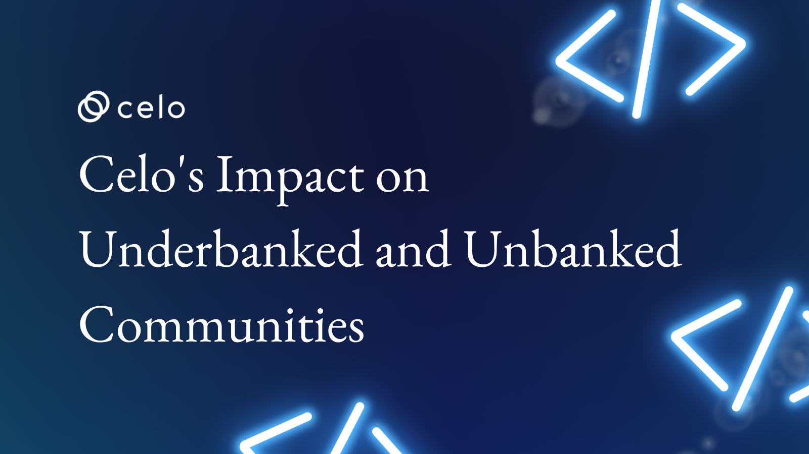

## Introduction

Do you understand the terms "underbanked" or "unbanked"? These are terms for people who do not have access to traditional banking services such as having access to a savings account or a credit card. This can make it difficult for these individuals to manage their finances, save for the future, or make important purchases.

## Prerequisites

Basic knowledge of the terms "unbanked" and "underbanked"
Awareness of the difficulties that communities without access to traditional banking services face
familiarity with the blockchain technology concept
Understanding of stablecoins and their use

**Blockchain technology** has the potential to transform how people access and manage their money. This is especially true for underbanked and unbanked communities, where traditional banking services may be challenging. In this article, we will look at how blockchain technology can help with **financial inclusion**.

## What is blockchain technology?

Blockchain technology is a secure, **digital ledger** that records **decentralized transactions**. This means that on the blockchain, there is no centralized authority controlling the flow of information or money.
Instead, all network participants have a copy of the ledger and agree on the validity of transactions.

## Partnerships for Financial Inclusion: Making the Celo Network Accessible to Everyone

- Have you heard about the **Celo network?** It's a unique system that allows people in underbanked and unbanked communities to use their smartphones to access financial services. But the Celo network cannot do it alone; it requires collaboration with organizations and initiatives that promote financial inclusion.

So, what exactly are these collaborations and initiatives? They are organizations and groups that collaborate with the Celo network to ensure that everyone has access to the financial services they require.

- The Celo network is impacting many people's lives, Many people's lives are being impacted by the Celo network. However, more than one organization is required to make this happen.

- The Celo network promotes financial inclusion and makes financial services available to all by collaborating with NGOs, and microfinance institutions, and developing mobile wallets.

Working with NGOs (Non-Governmental Organizations), is one way the Celo network accomplishes this. These organizations assist people in underbanked communities in gaining access to and understanding the Celo network. They also help to provide financial literacy education and training so that people can take advantage of the Celo network's financial services.

- Partnerships with microfinance institutions are another way the Celo network promotes financial inclusion. Microfinance institutions offer loans and other financial services to people who may be unable to obtain them from traditional banks.

The Celo network can ensure that more people have access to the financial services they require by collaborating with these institutions.

- The Celo network also provides mobile wallets like [Valora](https://valoraapp.com/), a unique app that allows people to store and use money.
  These wallets are designed to be user friendly, so that anyone can take advantage of the financial services provided by the Celo network.

- These collaborations and initiatives are significant because they help to make the Celo network more accessible to more people.
  The Celo network and these organizations can help empower people in underbanked and unbanked communities to take control of their financial future by collaborating.

## The Celo Dollar: A Stablecoin for Transactions and Payments

Do you know what a **stablecoin** is? It is a type of digital currency that is linked to the value of a physical currency, such as the US dollar. This means that the stablecoin's value remains constant regardless of the value of other types of digital currencies.

The Celo network has its stablecoin, which is known as the **“Celo Dollar.”** This unique digital currency is pegged to the value of the **US dollar**, which means it is always equal to one US dollar. As a result, the Celo Dollar is a secure and dependable currency for transactions and payments.

So, how does this affect you? living in an underbanked or unbanked community , you may not have access to traditional banking services.
This can make purchasing items or payment services difficult. However, with the Celo Dollar, you can do all of these things with your **smartphone!**

This means you have remote access to conduct transactions and make payments, without having to go to a financial institution.

The Celo Dollar is also very simple to use that supports currency exchange. All you need is a **mobile wallet app** to store and spend your Celo Dollars. This means you won't have to deal with complicated financial systems.

The Celo Dollar is a stable coin that can be used for transactions and payments. The Celo Dollar, by being pegged to the value of the US dollar, provides stability and security to people in underbanked and unbanked communities who require access to financial services. So, the next time you hear about the Celo network and the Celo Dollar, you'll know it's a fantastic way to access financial services and make transactions and payments from your smartphone!

## The Celo Network: Making Financial Services Accessible Through Your Smartphone

Have you got a smartphone? If you do, you may be able to access financial services in a novel and innovative manner via the Celo network. The Celo network was created to be accessible to anyone with a smartphone, making it ideal for communities with limited access to traditional banking services.

## The Celo Network: Partnering with NGOs and Microfinance Institutions for Greater Financial Access

Do you know what non-governmental organizations and microfinance institutions are? They are non-profit organizations that work to assist those in need, particularly those who do not have access to traditional financial services. And the Celo network is collaborating with these organizations to reach even more people with financial assistance.

The Celo network is about making financial services available to everyone, including those living in areas where traditional banking services are unavailable. To accomplish this, the Celo network collaborates with NGOs and microfinance institutions to provide access to the platform and teach people how to use it.

The Celo network collaborates with NGOs and microfinance institutions to develop mobile wallets and other tools that make it easier for people to use the platform. These organizations are also assisting the Celo network by providing education and training to people to help them understand how to use the platform and access financial services.

The Celo network is expanding its reach and making financial services more accessible to those in need by partnering with NGOs and microfinance institutions. The Celo network also helps people understand how to use the platform and take control of their financial future by providing education and training.

## Making Financial Services Easier with Mobile Wallets and Other Tools

Do you ever have the impression that financial services are overly complicated to use? The Celo network, on the other hand, is working to change that!

Developing mobile wallets and other tools is one way the Celo network is making financial services more accessible. These tools make it simple for people to use the platform and gain access to financial services, even if they are unfamiliar with traditional banking.

A **mobile wallet** is a type of app that you can use to manage your money on your phone. You can send and receive money, pay bills, and even buy things using a Celo network mobile wallet. Because the mobile wallet is linked to the Celo network, you can gain access to financial services that you might not otherwise be able to obtain.

Other tools are being developed by the Celo network to make it even easier for people to use the platform. They're working on ways to help people understand how to use the platform and access financial services, for example. This includes educating and training users, as well as ensuring the platform is user-friendly and simple to use.

With mobile wallets and other tools, the Celo network is making financial services easier and more accessible. Whether you're a seasoned financial services user or a newcomer, the Celo network is working to ensure you have everything you need to manage your money and access financial services. Download a Celo network mobile wallet today if you want to join the Celo network and start taking control of your financial future!

## Financial Education and Training for All with the Celo Network

Do you ever feel as if you don't know how to use financial services or manage your money? The Celo network is here to assist you!

One aspect that distinguishes the Celo network is its emphasis on education and training. The Celo network wishes to ensure that everyone, regardless of background or experience, understands how to use the platform and gain access to financial services.

As a result, the Celo network is developing several educational and training programs. For example, they could provide classes or workshops to teach people how to use their mobile wallets, or they could develop resources and materials that simply explain financial concepts.

The Celo network is working to make the platform itself easier to use, in addition to providing education and training. They are designing the platform to be user-friendly and intuitive, so that anyone, even those unfamiliar with financial services, can use it.

The Celo network places a high value on education and training to help people understand how to use the platform and gain access to financial services. Whether you're new to financial services or an experienced user, the Celo network is here to ensure you have the resources and support you need to take control of your financial future. So why not join the Celo network today and begin learning about money management and financial services?

### Conclusion

Finally, the Celo network represents a game changer for underbanked and unbanked communities. The network is working hard to revolutionize the way people access and manage their finances, with an emphasis on providing accessible and secure financial services.

The use of the Celo Dollar, a stablecoin pegged to the US dollar, facilitates transactions and payments. Partnerships with NGOs and microfinance institutions, as well as a focus on education and training, have aided in making the platform accessible to people who do not have access to traditional banking services.

Furthermore, the development of mobile wallets and other tools makes the platform even more accessible to users. The Celo network has the potential to increase financial inclusion and empower people to take control of their finances. Blockchain technology plays an important role in financial inclusion because it provides a secure and transparent platform for transactions and payments. Overall, the Celo network is making strides in promoting financial inclusion and providing underbanked and unbanked communities with access to financial services.

### References

[Celo's official website](https://celo.org/)

[Celo Whitepaper](https://celo.org/whitepaper)

### About the Author

Maxwell Onyeka is a solutions-focused, meticulous, strategy- and results-driven manager with more than five years of experience building paid and organic marketing funnels for SaaS companies and a technical writer for web3. [Twitter](https://twitter.com/Maxwellowy)
