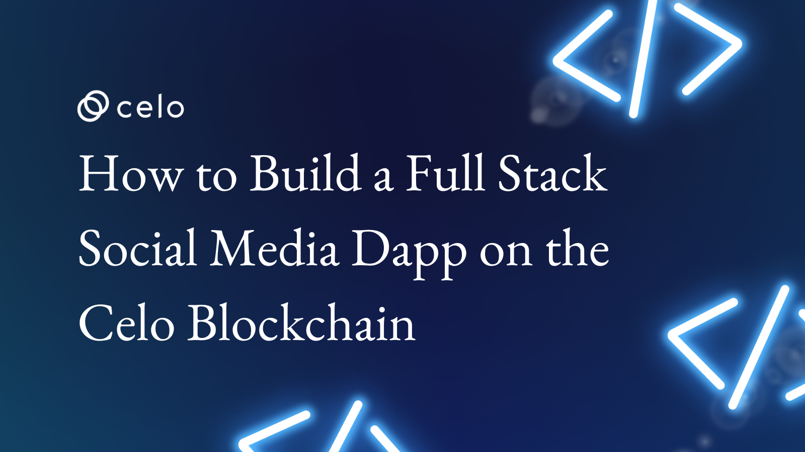

## Introduction

In this tutorial, we will be exploring a specific type of dapp - a blockchain social media dapp built on the Celo blockchain. This tutorial will introduce you to the concept of a blockchain social media dapp and demonstrate how to set up and interact with this type of application. By the end of this tutorial, you will have the knowledge and skills necessary to start building and using your own blockchain social media dapp. Let's get started!

Here’s a demo [link](https://fanciful-tartufo-92a809.netlify.app/) of what you’ll be creating.

And a screenshot.


## Prerequisites

To fully follow up with these tutorials, you should have a basic understanding of the following technologies.

Solidity, smart-contract and blockchain concepts.
React.
Basic web Development.

## Requirements

- Solidity.
- React.
- Bootstrap.
- NodeJS 12.0.1 upwards installed.
- Celo Extension Wallet.
- Remix IDE

## SmartContract
Let's begin writing our smart contract in Remix IDE

The completed code Should look like this.

```solidity
// SPDX-License-Identifier: MIT

pragma solidity >=0.7.0 <0.9.0;

interface IERC20Token {
  function transfer(address, uint256) external returns (bool);
  function approve(address, uint256) external returns (bool);
  function transferFrom(address, address, uint256) external returns (bool);
  function totalSupply() external view returns (uint256);
  function balanceOf(address) external view returns (uint256);
  function allowance(address, address) external view returns (uint256);
  event Transfer(address indexed from, address indexed to, uint256 value);
  event Approval(address indexed owner, address indexed spender, uint256 value);
}


contract Celogram{

uint private postLength = 0;
address internal cUsdTokenAddress = 0x874069Fa1Eb16D44d622F2e0Ca25eeA172369bC1;

    struct Post{
        address user;
        string image;
        string title;
        string description;
        uint likes;
    }

    struct Comment{
        address owner;
        string description;
    }


    mapping(uint => Post) internal posts;
    mapping (uint => Comment[]) internal commentsMapping;


    function newPost(
        string memory _image,
        string memory _title,
        string memory _description
         ) 
         public {
            address _user = msg.sender;
            uint _likes = 0;

            posts[postLength] = Post(
                _user,
                _image,
                _title,
                _description,
                _likes
            );
            postLength++;
    }

    function addComment(uint _index, string memory _description) public{
        commentsMapping[_index].push(Comment(msg.sender, _description));
    }

    function likePost(uint _index) public{
        posts[_index].likes++;
    }

    function getPost(uint _index) public view returns(
        address,
        string memory,
        string memory,
        string memory,
        uint,
        Comment[] memory
    ){
         Post memory post = posts[_index];
         Comment[] memory comments = commentsMapping[_index];
         return(
             post.user,
             post.image,
             post.title,
             post.description,
             post.likes,
             comments
         );
    }

    function sendTip(uint _index, uint _ammount) public payable  {
        require(
          IERC20Token(cUsdTokenAddress).transferFrom(
             msg.sender,
             posts[_index].user,
             _ammount
          ),
          "Transfer failed."
        );
    }

    function getPostsLength() public view returns(uint){
        return(postLength);
    }     

}
```

### Break down

```solidity
// SPDX-License-Identifier: MIT
pragma solidity >=0.7.0 <0.9.0;

```
First, we declared our license and the solidity version.

```solidity
interface IERC20Token {
  function transfer(address, uint256) external returns (bool);
  function approve(address, uint256) external returns (bool);
  function transferFrom(address, address, uint256) external returns (bool);
  function totalSupply() external view returns (uint256);
  function balanceOf(address) external view returns (uint256);
  function allowance(address, address) external view returns (uint256);
  event Transfer(address indexed from, address indexed to, uint256 value);
  event Approval(address indexed owner, address indexed spender, uint256 value);
}
```

Next we declare an interface for the cUSD ERC20 token. An interface is a collection of functions that define the behavior of a contract. In this case, the interface defines the functions necessary for an ERC20 token. 

The first function is the "transfer" function. This function allows a user to transfer tokens from one address to another. The function takes two parameters: an address to transfer the tokens to, and an amount of tokens to transfer. The function then returns a boolean value that indicates whether or not the transfer was successful.

The second function is the "approve" function. This function allows a user to approve another user to transfer tokens from their address. The function takes two parameters: an address to approve, and an amount of tokens to approve for transfer. The function then returns a boolean value that indicates whether or not the approval was successful.

The third function is the "transferFrom" function. This function allows a user to transfer tokens from one address to another. The function takes three parameters: an address to transfer the tokens from, an address to transfer the tokens to, and an amount of tokens to transfer. The function then returns a boolean value that indicates whether or not the transfer was successful.

The fourth function is the "totalSupply" function. This function returns the total amount of tokens in circulation. It takes no parameters and returns a uint256 value.

The fifth function is the "balanceOf" function. This function returns the balance of tokens held by a particular address. It takes one parameter, an address, and returns a uint256 value.

The sixth function is the "allowance" function. This function returns the amount of tokens that a particular address is allowed to transfer. It takes two parameters, an address to check and an address to transfer from, and returns a uint256 value.

The final two functions are events. The "Transfer" event is triggered whenever tokens are transferred from one address to another. It takes three parameters: the address from which the tokens were transferred, the address to which the tokens were transferred, and the amount of tokens that were transferred.

The "Approval" event is triggered whenever an address is approved to transfer tokens from another address. It takes three parameters: the address of the owner of the tokens, the address of the spender, and the amount of tokens that have been approved for transfer.

This code provides a basic interface for an ERC20 token. It defines the functions necessary for token transfers, approvals, and balance checks.

```solidity
contract Celogram{

uint private postLength = 0;
address internal cUsdTokenAddress = 0x874069Fa1Eb16D44d622F2e0Ca25eeA172369bC1;

    struct Post{
        address user;
        string image;
        string title;
        string description;
        uint likes;
    }

    struct Comment{
        address owner;
        string description;
    }


    mapping(uint => Post) internal posts;
    mapping (uint => Comment[]) internal commentsMapping;
}

```

In this section, we created a smart contract with the name Celogram.
Inside the smart contract, we first declare a private variable called postLength, which will store the current length of the posts in the mapping. 

Next, we declare a struct called `Post` which will be used to store information about each post. This struct contains 5 elements - an `address` for the user who created the post, a `string` for the image, a `string` for the title, a `string` for the description, and a `uint` for the number of likes.

We also declare a struct called `Comment` which will be used to store information about each comment. This struct contains 2 elements - an `address` for the user who created the comment, and a `string` for the description.

 We then declare 2 mapping variables - one called `posts`, which will map each post index to a Post `struct`, and one called `commentsMapping`, which will map each post index to an `array` of Comment `structs`. 

```solidity
function newPost(
        string memory _image,
        string memory _title,
        string memory _description
         ) 
         public {
            address _user = msg.sender;
            uint _likes = 0;
            posts[postLength] = Post(
                _user,
                _image,
                _title,
                _description,
                _likes
            );
            postLength++;
    }

```

Next, we declare the `newPost()` function, which allows users to create new posts. This function takes 3 string arguments - an `image`, a `title`, and a `description` - and uses them to populate the Post `struct`. A user `address` is also included in the Post `struct`, which is set to the `address` of the user who called the function. The likes element of the Post struct is set to 0. After that, we increase the value of the `postLength` variable by 1. 

```solidity
function addComment(uint _index, string memory _description) public{
        commentsMapping[_index].push(Comment(msg.sender, _description));
    }
```

The `addComment()` function allows users to add comments to existing posts. This function takes 2 arguments - a post index and a description - and uses them to populate a Comment `struct`. The `address` of the user who called the function is also stored in the Comment `struct`.

```solidity
function likePost(uint _index) public{
        posts[_index].likes++;
    }
```

The `likePost()` function allows users to like existing posts. This function takes a post index as an argument, and increases the `likes` element of the Post struct by 1. 

```solidity
function getPost(uint _index) public view returns(
        address,
        string memory,
        string memory,
        string memory,
        uint,
        Comment[] memory
    ){
         Post memory post = posts[_index];
         Comment[] memory comments = commentsMapping[_index];
         return(
             post.user,
             post.image,
             post.title,
             post.description,
             post.likes,
             comments
         );
    }
```

The `getPost()` function allows users to view an existing post. This function takes a post index as an argument, and returns the user `address`, `image`, `title`, `description`, and `likes` of the Post `struct`, as well as an `array` of Comment `structs` associated with the post. 

```solidity
function sendTip(uint _index, uint _ammount) public payable  {
        require(
          IERC20Token(cUsdTokenAddress).transferFrom(
             msg.sender,
             posts[_index].user,
             _ammount
          ),
          "Transfer failed."
        );
    }
```

The next function is the `sendTip()`. This function will be used to send a tip in cUSD to a specific user from a list of posts. we first added checks to make sure the transfer of funds is possible using the `IERC20Token` contract. It then uses the `transferFrom` function, which allows a third party to transfer funds on behalf of the sender, to send the tip to the specified user. It takes three parameters, the `sender`, the `user` to receive the tip, and the amount of the tip. If the transfer is successful, the code returns a success message, otherwise, it will return an error.

```solidity
    function getPostsLength() public view returns(uint){
        return(postLength);
    }   
```

Finally, the `getPostsLength()` function allows users to view the current length of the `posts array`. This function takes no arguments and returns the value of the postLength variable. 

## Deployment

To deploy our smart contract successfully, we need the celo extention wallet which can be downloaded from [here](https://chrome.google.com/webstore/detail/celoextensionwallet/kkilomkmpmkbdnfelcpgckmpcaemjcdh?hl=en)

Next, we need to fund our newly created wallet which can done using the celo alfojares faucet [Here](https://celo.org/developers/faucet) 

You can now fund your wallet and deploy your contract using the celo plugin in remix.

### Frontend

Click on [this](https://github.com/4undRaiser/celogram-tutorial) repo from your github.

- Clone the repo to your computer.
- open the project from from vscode.
- Run `npm install` command to install all the dependencies required to run the app locally.

#### App.js

The completed code should look like this.

```solidity
import "./App.css";
import Home from "./components/home";
import { Posts } from "./components/Posts";
import { useState, useEffect, useCallback } from "react";
import Web3 from "web3";
import { newKitFromWeb3 } from "@celo/contractkit";
import celogram from "./contracts/celogram.abi.json";
import IERC from "./contracts/IERC.abi.json";

const ERC20_DECIMALS = 18;
const contractAddress = "0x2d6dcdA3A131Dc4819EF572c6CE5A0c573E7175E";
const cUSDContractAddress = "0x874069Fa1Eb16D44d622F2e0Ca25eeA172369bC1";

function App() {
  const [contract, setcontract] = useState(null);
  const [address, setAddress] = useState(null);
  const [kit, setKit] = useState(null);
  const [cUSDBalance, setcUSDBalance] = useState(0);
  const [posts, setPosts] = useState([]);

  const connectToWallet = async () => {
    if (window.celo) {
      try {
        await window.celo.enable();
        const web3 = new Web3(window.celo);
        let kit = newKitFromWeb3(web3);

        const accounts = await kit.web3.eth.getAccounts();
        const user_address = accounts[0];
        kit.defaultAccount = user_address;

        await setAddress(user_address);
        await setKit(kit);
      } catch (error) {
        console.log(error);
      }
    } else {
      alert("Error Occurred");
    }
  };

  const getBalance = useCallback(async () => {
    try {
      const balance = await kit.getTotalBalance(address);
      const USDBalance = balance.cUSD.shiftedBy(-ERC20_DECIMALS).toFixed(2);

      const contract = new kit.web3.eth.Contract(celogram, contractAddress);
      setcontract(contract);
      setcUSDBalance(USDBalance);
    } catch (error) {
      console.log(error);
    }
  }, [address, kit]);

  const getPosts = useCallback(async () => {
    const postsLength = await contract.methods.getPostsLength().call();
    const posts = [];
    for (let index = 0; index < postsLength; index++) {
      let _posts = new Promise(async (resolve, reject) => {
        let post = await contract.methods.getPost(index).call();

        resolve({
          index: index,
          user: post[0],
          image: post[1],
          title: post[2],
          description: post[3],
          likes: post[4],
          comments: post[5],
        });
      });
      posts.push(_posts);
    }

    const _posts = await Promise.all(posts);
    setPosts(_posts);
  }, [contract]);

  const addPost = async (_image, _title, _description) => {
    try {
      await contract.methods
        .newPost(_image, _title, _description)
        .send({ from: address });
      getPosts();
    } catch (error) {
      alert(error);
    }
  };

  const addComment = async (_index, _description) => {
    try {
      await contract.methods
        .addComment(_index, _description)
        .send({ from: address });
      getPosts();
    } catch (error) {
      alert(error);
    }
  };

  const likePost = async (_index) => {
    try {
      await contract.methods.likePost(_index).send({ from: address });
      getPosts();
    } catch (error) {
      alert(error);
    }
  };

  const sendTip = async (_index, _ammount) => {
    try {
      const cUSDContract = new kit.web3.eth.Contract(IERC, cUSDContractAddress);

      await cUSDContract.methods
        .approve(contractAddress, _ammount)
        .send({ from: address });
      await contract.methods.sendTip(_index, _ammount).send({ from: address });
      getPosts();
      getBalance();
      alert("you have successfully sent cusd to this user");
    } catch (error) {
      alert(error);
    }
  };

  useEffect(() => {
    connectToWallet();
  }, []);

  useEffect(() => {
    if (kit && address) {
      getBalance();
    }
  }, [kit, address, getBalance]);

  useEffect(() => {
    if (contract) {
      getPosts();
    }
  }, [contract, getPosts]);

  return (
    <div className="App">
      <Home cUSDBalance={cUSDBalance} addPost={addPost} />
      <Posts
        posts={posts}
        likePost={likePost}
        addComment={addComment}
        sendTip={sendTip}
        walletAddress={address}
      />
    </div>
  );
}

export default App;

```
### Break down
Let's take a look at the `App.js` file and break it down.

To start, let's import the necessary components and libraries.

```javascript
import React from "react";
import "./App.css";
import Home from "./components/home";
import { Posts } from "./components/Posts";
import { useState, useEffect, useCallback } from "react";
import Web3 from "web3";
import { newKitFromWeb3 } from "@celo/contractkit";
import celogram from "./contracts/celogram.abi.json";
```

```javascript
const ERC20_DECIMALS = 18;
const contractAddress = "0x7A6c28ada0153b8B8b605Acf5617896660D22Bc8";
```
We then set the ERC20 decimals and the contract address of our smart contract.

```javascript
const [contract, setcontract] = useState(null);
const [address, setAddress] = useState(null);
const [kit, setKit] = useState(null);
const [cUSDBalance, setcUSDBalance] = useState(0);
const [posts, setPosts] = useState([]);
```
We use React Hooks to set the initial state for the contract, address, kit, cUSDBalance and posts.

```javascript
const connectToWallet = async () => {
    if (window.celo) {
      try {
        await window.celo.enable();
        const web3 = new Web3(window.celo);
        let kit = newKitFromWeb3(web3);

        const accounts = await kit.web3.eth.getAccounts();
        const user_address = accounts[0];
        kit.defaultAccount = user_address;

        await setAddress(user_address);
        await setKit(kit);
      } catch (error) {
        console.log(error);
      }
    } else {
      alert("Error Occurred");
    }
  };
```
Next, we created a the `connectToWallet()` function that allows the user to connect to their wallet and sets the address and kit.

```javascript
const getBalance = useCallback(async () => {
    try {
      const balance = await kit.getTotalBalance(address);
      const USDBalance = balance.cUSD.shiftedBy(-ERC20_DECIMALS).toFixed(2);
      const contract = new kit.web3.eth.Contract(celogram, contractAddress);
      setcontract(contract);
      setcUSDBalance(USDBalance);
    } catch (error) {
      console.log(error);
    }
  }, [address, kit]);
```
The `getBalance()` function allows us to get the user's cUSD balance and set the contract.

```javascript
 const getPosts = useCallback(async () => {
    const postsLength = await contract.methods.getPostsLength().call();
    const posts = [];
    for (let index = 0; index < postsLength; index++) {
      let _posts = new Promise(async (resolve, reject) => {
        let post = await contract.methods.getPost(index).call();
        resolve({
          index: index,
          user: post[0],
          image: post[1],
          title: post[2],
          description: post[3],
          likes: post[4],
          comments: post[5],
        });
      });
      posts.push(_posts);
    }

    const _posts = await Promise.all(posts);
    setPosts(_posts);
  }, [contract]);
```
The `getPosts()` function allows us to get all the posts from the contract and set them in the state.

```javascript
 const addPost = async (_image, _title, _description) => {
    try {
      await contract.methods
        .newPost(_image, _title, _description)
        .send({ from: address });
      getPosts();
    } catch (error) {
      alert(error);
    }
  };

  const addComment = async (_index, _description) => {
    try {
      await contract.methods
        .addComment(_index, _description)
        .send({ from: address });
      getPosts();
    } catch (error) {
      alert(error);
    }
  };

  const likePost = async (_index) => {
    try {
      await contract.methods.likePost(_index).send({ from: address });
      getPosts();
    } catch (error) {
      alert(error);
    }
  };

  const sendTip = async (_index, _ammount) => {
    try {
      const cUSDContract = new kit.web3.eth.Contract(IERC, cUSDContractAddress);

      await cUSDContract.methods
        .approve(contractAddress, _ammount)
        .send({ from: address });
      await contract.methods.sendTip(_index, _ammount).send({ from: address });
      getPosts();
      getBalance();
      alert("you have successfully sent cusd to this user");
    } catch (error) {
      alert(error);
    }
  };
```
Next, we create the `addPost()`, `addComment()` and `likePost()` functions that allow users to interact with the smart contract.

```javascript
useEffect(() => {
connectToWallet();
}, []);

useEffect(() => {
if (kit && address) {
getBalance();
}
}, [kit, address, getBalance]);

useEffect(() => {
if (contract) {
getPosts();
}
}, [contract, getPosts]);

```
We use useEffect to call the connectToWallet, getBalance, and getPosts functions at the appropriate times.

```javascript
return (
    <div className="App">
      <Home cUSDBalance={cUSDBalance} addPost={addPost} />
      <Posts
        posts={posts}
        likePost={likePost}
        addComment={addComment}
        sendTip={sendTip}
        walletAddress={address}
      />
    </div>
  );

export default App;
```
And finally, we render the App component and return the Home and Posts components with the necessary props.

## Next Steps

I hope you learned a lot from this tutorial. Here are some relevant links that would aid your learning further.

- <https://docs.celo.org/>
- <https://solidity-by-example.org/>
- <https://docs.soliditylang.org/en/v0.8.17/>

## About the author

I'm Jonathan Iheme, A full stack block-chain Developer from Nigeria.

Thank You!!