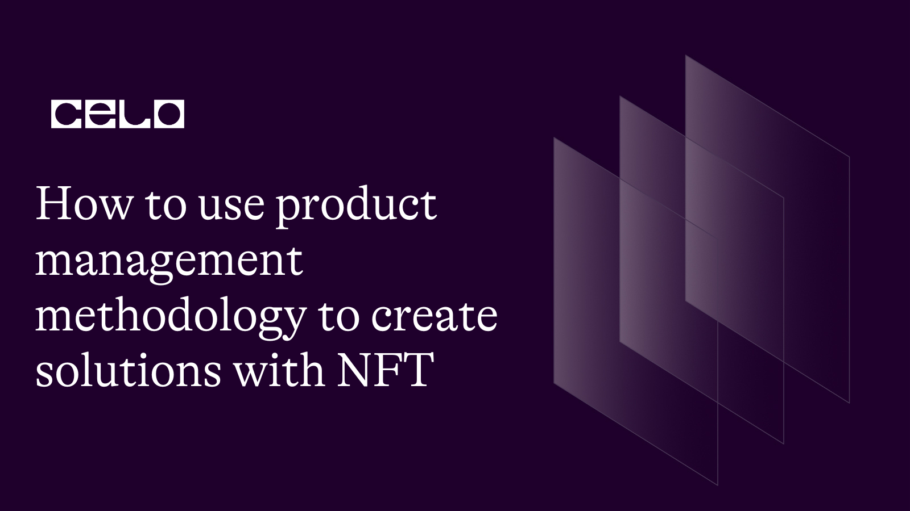

## Introdução

A criação de NFTs (non-fungible token) no blockchain Celo pode ser um desafio como qualquer outro produto, mas com a aplicação correta da metodologia de gestão de produtos, você pode garantir que o seu NFT seja relevante e competitivo no mercado. A metodologia de gestão de produtos é um conjunto de passos que ajuda a garantir que o produto esteja alinhado com as necessidades do mercado e dos clientes. Neste tutorial, vamos mostrar como aplicar a metodologia de gestão de produtos ao desenvolvimento de NFTs no blockchain Celo. Começando com a compreensão do mercado e dos clientes, passando pela definição do propósito e dos objetivos do produto, desenvolvendo o conceito do produto, desenvolvendo o produto e gerenciando e promovendo o produto. Cada passo é crucial para garantir que o seu NFT seja relevante e competitivo no mercado. Então se você está interessado em criar NFTs de sucesso no blockchain Celo, continue lendo para entender como aplicar a metodologia de gestão de produtos ao desenvolvimento de NFTs.

## Gestão de Produtos

A metodologia de gestão de produtos digitais é uma abordagem consolidada há décadas no mercado para o desenvolvimento, lançamento e gerenciamento de produtos. Ela pode ser aplicada a qualquer tipo de produto, incluindo produtos de NFT (non-fungible token) no blockchain Celo e envolve uma variedade de atividades, incluindo, por exemplo, investigação sobre o problema / oportunidade, pesquisa de mercado, desenvolvimento e lançamento de produtos, ajudando a garantir que o produto esteja alinhado com as necessidades do mercado e dos clientes, tenha objetivos de negócios claros, seja desenvolvido e promovido de maneira eficiente e eficaz, aumentando as chances de sucesso do NFT no mercado.

Usar a metodologia de gestão de produtos no desenvolvimento de produtos de NFT no blockchain Celo, ajuda a garantir que o produto esteja alinhado com as necessidades do mercado e dos clientes, tenha objetivos de negócios claros, seja desenvolvido de maneira eficiente e eficaz, e promovido de maneira eficaz, aumentando as chances de sucesso do NFT no mercado.

**Principais momentos no desenvolvimento de produtos no blockchain Celo:**

- Definição do produto

- Pesquisas de mercado

- Desenvolvimento

- Lançamento

- Monitoramento e gerenciamento

## Defina seu produto

Primeiramente, você precisará definir seu produto NFT. Que valor ele oferecerá aos seus clientes? Qual é o seu fundamento e como ele está relacionado ao propósito do blockchain Celo? Quem é o seu mercado-alvo? Como ele será diferente de outros produtos NFT no mercado?

Definir seu produto é a primeira etapa no processo de gerenciamento do produto e a mais importante de todo o processo, pois sem explorar o problema/oportunidade dificilmente você desenvolverá uma solução de valor ao mercado. Isso envolve entender o valor que seu produto NFT oferecerá a seus clientes e identificar os recursos e funcionalidades específicos que ele terá. É importante ser o mais específico possível ao definir seu produto, pois isso ajudará você a entender melhor seu mercado-alvo e a proposta de valor exclusiva de seu produto.

Para definir seu produto, você precisará realizar um processo de Discovery, considerando questões como:

- Qual é o problema que seu produto NFT vai resolver, ou a necessidade que vai atender?

- Quem é o seu mercado-alvo? Quais pontos problemáticos ou desafios específicos eles estão enfrentando que seu produto pode resolver? Dentro de seu mercado-alvo, identifique um nicho de partida com o perfil ideal de cliente para que possa modelar seu produto considerando as particularidades do público em questão.

- Quais são os recursos e funcionalidades exclusivos do seu produto? Como ele será diferente de outros produtos NFT no mercado?

- Qual é a proposta de valor do seu produto? Por que os clientes devem escolher seu produto em detrimento de outros?

Responder a essas perguntas ajudará a definir seu produto NFT de maneira clara, específica e atraente.

## Realize pesquisas de mercado

Em seguida, você precisará realizar pesquisas de mercado para entender a demanda por seu produto. Isso pode envolver a coleta de dados de várias fontes, como pesquisas com clientes, relatórios do setor e concorrentes.

A realização de pesquisas de mercado é uma etapa importante no processo de gerenciamento de produtos, pois ajuda você a entender a demanda por seu produto NFT e como ele se encaixará no mercado. Existem várias maneiras de conduzir pesquisas de mercado, incluindo:

Pesquisas com clientes: pesquisar clientes em potencial pode ajudá-lo a entender suas necessidades, preferências e disposição de pagar por seu produto NFT. Identifique as necessidades e desejos dos clientes potenciais, como, por exemplo, os tipos de NFTs que eles estão procurando, quais características eles valorizam e como eles planejam usar NFTs.

**-   Relatórios do setor:** A leitura de relatórios e artigos do setor pode fornecer informações valiosas sobre o estado atual do mercado e as tendências emergentes. Identifique as tendências e oportunidades no mercado, como novos usos para NFTs, novas tecnologias e desenvolvimentos regulatórios.

**-   Regulamentações de mercado:** Identifique quais regulamentações governamentais e industriais podem afetar o seu NFT e entenda como você pode se adaptar a elas.

**-   Análise da concorrência:** Analisar seus concorrentes (suas estratégias, sucessos e fracassos) pode ajudar a entender como seu produto NFT se compara a produtos similares no mercado e identificar áreas em que você pode se diferenciar. Busque cases no blockchain Celo.

**-   Grupos de foco:** A realização de grupos de foco com clientes em potencial pode fornecer informações valiosas sobre seus pensamentos e opiniões sobre seu produto NFT. Faça perguntas específicas sobre o que os clientes estão procurando em um NFT, quais são suas dificuldades e o que eles gostariam de ver em um NFT. Utilize essas respostas para ajustar e melhorar o seu conceito de NFT e desenvolver um produto mais alinhado ao desejo/necessidade de mercado.

**-   Comunidade Celo:** A comunidade Celo é um ótimo lugar para conhecer projetos e se inspirar.

Ao conduzir uma pesquisa de mercado, você poderá reunir os dados e as informações necessárias para tomar decisões informadas sobre seu produto NFT e garantir que ele atenda às necessidades e expectativas de seu mercado-alvo.

## Desenvolva seu produto

Após ter uma compreensão clara de seu produto e do mercado, você pode começar a desenvolvê-lo. Isso pode envolver a criação de um protótipo, testá-lo com um pequeno grupo de usuários e iterar com base no feedback.

Desenvolver seu produto NFT envolve criar um protótipo e testá-lo com um pequeno grupo de usuários para obter feedback e fazer melhorias.

**1.  Crie um protótipo:** comece criando um protótipo do seu produto NFT. Pode ser um modelo físico ou uma versão digital, dependendo da natureza do seu produto. O protótipo deve incluir todos os principais recursos e funcionalidades do seu produto NFT.

**2.  Teste seu protótipo:** Considere um pequeno grupo de usuários com o perfil mapeado durante a definição de produto para testar seu protótipo. Isso pode ajudá-lo a coletar feedback valioso e identificar áreas em que seu produto pode ser melhorado.

**3.  Repita com base no feedback:** Após testar seu protótipo, use o feedback que você coletou para fazer melhorias em seu produto NFT. Isso pode envolver alterações no design, na funcionalidade ou em outros aspectos do seu produto.

**4.  Refine seu produto:** Continue testando e refinando seu produto até que esteja pronto para lançamento. Isso pode envolver testes e iterações adicionais com base no feedback dos usuários.

Seguindo esses passos, você pode desenvolver seu produto de NFT no blockchain Celo com base nas necessidades e preferências de seu mercado-alvo, aumentando assim a probabilidade de sucesso na adoção de seu produto.

## Lance seu produto

Assim que seu produto estiver pronto, você precisará criar uma estratégia de marketing e desenvolver um plano para lançá-lo no mercado. Isso pode envolver a criação de materiais de marketing, a criação de canais de distribuição e o estabelecimento de relacionamentos com clientes em potencial.

Lançar seu produto NFT envolve trazê-lo ao mercado e disponibilizá-lo aos clientes.

**1.  Plano de lançamento:** Desenvolva um plano para lançar seu produto NFT. Isso deve incluir um cronograma para atividades-chave, como a criação de materiais comerciais, estabelecendo canais de distribuição e construindo relacionamentos com clientes em potencial.

**2.  Materiais de marketing:** Desenvolva materiais de marketing, como um site, identidade visual e de comunicação, crie presença digital para ajudar a apresentar seu produto NFT ao mercado. Certifique-se de que a mensagem de marketing esteja alinhada com as necessidades do mercado e dos clientes.

**3.  Canais de distribuição:** Determine como disponibilizará seu produto NFT aos clientes. Isso pode envolver o estabelecimento de parcerias com outras empresas, a criação de uma plataforma própria ou o uso de um marketplace.

**4.  Relacionamentos com clientes em potencial:** Alcance clientes em potencial para construir relacionamentos e gerar interesse em seu produto de NFT. Isso pode envolver networking com profissionais do setor, participação em conferências e eventos ou uso de mídias sociais e outros canais online para promover seu produto. Aproveite o momento de lançamento para reforçar o relacionamento com outros empreendedores na comunidade Celo.

**5.  Lance seu produto NFT:** Depois de ter um plano de lançamento e criar materiais de marketing e configurar canais de distribuição, você estará pronto para lançar seu produto NFT. Certifique-se de comunicar efetivamente o valor de seu produto a clientes em potencial e esteja preparado para adaptar seu plano de lançamento conforme necessário.

Seguindo estas etapas, você pode trazer com sucesso seu produto NFT para o mercado e disponibilizá-lo aos clientes.

## Monitore e gerencie seu produto

Depois que seu produto for lançado, você precisará gerenciá-lo para garantir que ele atenda às necessidades de seus clientes e alcance os resultados desejados. Isso pode envolver atualizações ou melhorias, análise de dados de clientes e monitoramento de concorrentes.

Gerenciar seu produto NFT envolve monitorar seu desempenho e fazer atualizações ou melhorias conforme necessário para garantir que ele atenda às necessidades de seus clientes e alcance os resultados desejados.

**1.  Analise os dados do cliente:** Reúna dados sobre como os clientes estão usando seu produto e use essas informações para identificar áreas em que você pode melhorar o produto ou resolver quaisquer problemas. Monitorar o desempenho do NFT no mercado para entender como ele está se saindo e identificar áreas de melhoria. Utilize ferramentas de análise de dados para coletar e analisar dados sobre o desempenho do seu produto.

**2.  Monitore os concorrentes:** Acompanhe o que seus concorrentes estão fazendo e avalie se há alguma alteração que você precise fazer em seu produto para se manter competitivo.

**3.  Faça atualizações ou melhorias:** Com base nos dados e percepções que você reuniu, faça atualizações ou melhorias em seu produto conforme necessário. Isso pode envolver adicionar novos recursos, modificar os existentes ou fazer alterações no design do produto.

**4.  Comunique-se com os clientes:** Comunique-se regularmente com seus clientes para se manter informado sobre suas experiências com seu produto e resolva quaisquer problemas ou preocupações que possam ter. Utilize o feedback dos clientes para identificar áreas de melhoria e ajustar o seu produto.

**5.  Revise e ajuste o roadmap do seu produto:** Revise e ajuste regularmente o roadmap do seu produto para garantir que ele esteja alinhado com as necessidades e preferências de seus clientes e reflita quaisquer mudanças no mercado.

Lembre-se de que a metodologia de gestão de produtos é uma abordagem iterativa, ou seja, é necessário continuar a testar e ajustar o produto ao longo do seu ciclo de vida. Além disso, é importante manter-se atualizado com as tendências e desenvolvimentos no mercado de NFTs e blockchain Celo para garantir que o seu produto seja relevante e competitivo.

Seguindo essas etapas, você pode gerenciar com eficiência seu produto NFT e garantir que ele continue atendendo às necessidades de seus clientes e alcançando os resultados desejados.

## Conclusão

A metodologia de gestão de produtos é um caminho valioso para garantir que os produtos de NFT no blockchain Celo sejam relevantes e competitivos no mercado. Ao aplicar essa metodologia, você pode garantir que o NFT esteja alinhado com as necessidades do mercado e dos clientes, tenha objetivos de negócios claros, seja desenvolvido de maneira eficiente e eficaz e promovido de maneira eficaz. Com cada passo, da compreensão do mercado e dos clientes, passando pela definição do propósito e dos objetivos do produto, desenvolvendo o conceito do produto, desenvolvendo o produto e gerenciando e promovendo o produto, você pode garantir que o NFT esteja sempre alinhado com as necessidades do mercado e dos clientes e continue a ser bem-sucedido.

## Sobre o Autor

Entrepreneur and product leader building digital products and experiences with data, technology and people.

[LinkedIn](https://www.linkedin.com/in/evelyncordeiro/)
