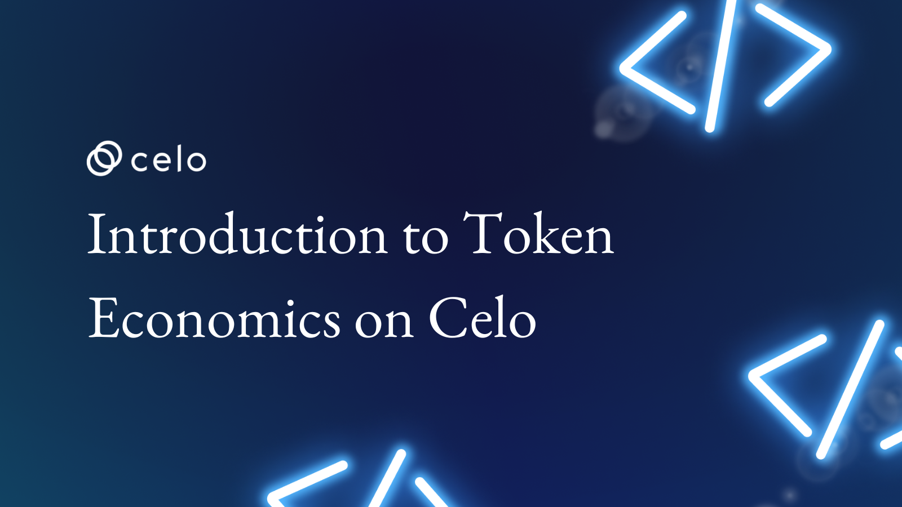

 

## Introduction

Welcome to Celo's exciting world of token economics! In this article, we'll look at the Celo network's intricacies and the roles of its various tokens, including CELO, cUSD, cEUR, and cREAL. You'll learn about token issuance and distribution, as well as how they're used in the network and the financial advantages that drive token usage.

We'll also look at the mechanisms that encourage network participation through staking and governance, as well as the importance of understanding Celo's token economics for network participation. By the end of this article, you'll have a thorough understanding of Celo's inner workings and how its tokens function.

So buckle up and prepare to embark on an exciting journey into the fascinating world of Celo's token economics!

## Prerequisites

A beginner reader should have a basic understanding of blockchain technology and cryptocurrency in order to understand the topics covered in this article. Some knowledge of economics, particularly the concept of token economics, would also be useful. In order to fully comprehend the content of the article, a basic understanding of financial instruments such as stablecoins and their role in the cryptocurrency world would be beneficial.

## Introduction to Celo's Token Economics

**Celo** is a decentralized platform that uses blockchain technology to provide a wide range of financial services to people all over the world. Celo's token economics, which defines the issuance, distribution, and use of its various tokens, are at the heart of the ecosystem.

This article will define Celo's token economics and introduce you to the key tokens that encompass the Celo network.

## Definition of Celo's Token Economics

**Celo's token economics** is the set of rules and incentives that govern the creation, distribution, and use of the company's various tokens. These tokens are intended to provide economic incentives for network participants by allowing them to earn rewards for network contributions and use the tokens for a variety of purposes.

Celo's token economics are intended to create a balanced and sustainable ecosystem, ensuring that the network is secure, decentralized, and accessible to all.

## Overview of CELO, cUSD, cEUR, and cREAL

Celo is a decentralized platform that aims to make financial stability and accessibility available to anyone, anywhere. Tokens, which play an important role in the Celo economy, are at the heart of this platform. CELO, cUSD, cEUR, and cREAL are the four primary tokens in this ecosystem. Each of these tokens serves a specific purpose, and understanding how they work is essential for participating in the Celo network.

CELO is the Celo network's native token that serves as a means of value transfer and is used to pay for fees such as transaction fees.
The cUSD, cEUR, and cREAL tokens, on the other hand, are stablecoins pegged to the value of their respective **fiat** currencies, ensuring the Celo network's stability and accessibility.

These tokens complement one another to form a dynamic and inclusive financial system. The interaction of these tokens is critical to the operation of the Celo network, and understanding their roles is essential for anyone interested in participating in the ecosystem. So join us as we delve into the world of Celo's token economics and learn about the significance of CELO, cUSD, cEUR, and cREAL.

## Issuance and Distribution of CELO, cUSD, cEUR, and cREAL

**Token issuance and distribution** are essential components of the Celo network's token economics. Understanding how **CELO, cUSD, cEUR, and cREAL** are issued and distributed is critical to understanding how the Celo ecosystem works.
CELO, the Celo network's native token, serves as the system's backbone, powering its various functions and acting as a trading medium.

The stablecoins cUSD, cEUR, and cREAL are pegged to the US dollar, the Euro, and the Brazilian real, respectively. These tokens are issued via a mechanism known as **"collateralized debt positions,"** in which users deposit an equivalent value of the pegged currency as collateral into a **smart contract.** This contributes to the stability of stablecoins and ensures that their value remains pegged to the underlying currency. A network of reserve managers and exchange partners facilitates the distribution of these tokens within the Celo network. These entities are in charge of ensuring that the supply and demand for each token are balanced, ensuring the network's stability and utility.
To summarize, the issuance and distribution of CELO, cUSD, cEUR, and cREAL are meticulously designed to meet the specific needs of the Celo ecosystem, ensuring its stability, security, and growth.

## Explanation of how CELO is issued and distributed

Celo's native token, **CELO**, is critical to the operation of the Celo network. But how is it issued and distributed to network participants?

CELO is generated through a process known as **"mining,"** in which network validators compete to solve abstract numerical puzzles in order to validate transactions and add new blocks to the blockchain. **Validators** are rewarded with newly minted CELO tokens in exchange for their efforts.

However, validators are not the only ones who can earn CELO. Celo also has a distribution system in place for CELO through its various community initiatives and programs, such as grants for developers and partnerships with organizations working to drive platform adoption.

CELO issuance and distribution are intended to be transparent and secure, with a maximum supply of **1 billion tokens** set to ensure that the token's value remains stable over time. The Celo network incentivizes a wide range of participants to play an active role in driving its growth and success by distributing CELO in this manner.

Celo is reshaping the cryptocurrency world by delivering a unified experience to mobile users everywhere. Celo's full-stack approach has transformed the traditional identity-based encryption system into an address-based encryption system, allowing users to transact and send payments more easily.

Celo has introduced a unique, lightweight identity feature that links phone numbers to wallet addresses, which eliminates the need to memorize long strings of alphanumeric characters. Users can conduct transactions with anyone on their contact list simply by mapping their phone number to a cryptographic address.

## Explanation of how tokens are used within the Celo network

Have you ever wondered how a digital economy works and how money is exchanged? The Celo network is transforming our understanding of economic systems and the role of tokens within them.

Tokens, which serve as the foundation of the Celo network's economy, are at the heart of the network. These tokens, which include CELO, cUSD, cEUR, and cREAL, each have distinct properties and functions that enable seamless network transactions and interactions.
But what exactly are these tokens, and how are they used in the Celo network? The answer lies in how they are integrated into the network's fabric, laying the groundwork for economic activity and allowing participants to transact with one another in a secure and efficient manner.

Tokens serve as a medium of exchange in the Celo network, allowing users to transfer value to one another. They also function as a unit of account, providing a standard denomination for economic transactions. Finally, they function as a store of value, allowing users to keep their wealth over time.

Understanding the role of tokens within the Celo network is critical, whether you are a participant looking to transact within the network or simply curious about the inner workings of a digital economy.

Holding CELO tokens, for example, gives users a say in network governance as well as the ability to earn rewards through staking. Using cUSD, cEUR, and cREAL as stablecoins within the network, on the other hand, allows users to transact with a stable and predictable value, making it ideal for a wide range of use cases.

But incentivizing network participation goes beyond just token rewards. Celo also incorporates a range of governance mechanisms that allow users to have a say in the direction of the network, further incentivizing their participation.

Whether it be through token staking or active involvement in the network's governance, Celo has created a system that truly empowers its users and encourages their participation in driving the success of the network.

## Explanation of staking mechanisms

**Staking** is a critical component of the Celo network's token economics. It is a mechanism that incentivizes network participants to contribute to the network's security and stability. Participants in a staking system hold and lock up their tokens in a wallet for a set periodin exchange for rewards.

This results in the creation of a pool of tokens that can be used to validate transactions and secure the network, adding an important layer of security to the entire ecosystem.

Staking not only provides a financial incentive for network participation but also improves network security by lowering the chances of malicious attacks. The more tokens staked, the more secure the network becomes and the more appealing it becomes to other participants, creating a positive feedback loop that contributes to the network's stability.

Understanding the staking mechanisms is therefore critical if you want to participate in the Celo network. You can help secure the network, earn rewards, and gain a better understanding of how token economics drives the success of the Celo ecosystem by staking.

## Discussion of governance mechanisms and their role in incentivizing network participation for each token

**Governance mechanisms** are pivotal in encouraging network participation in the Celo ecosystem. These mechanisms provide a platform for token holders to have a say in the network's direction and decision-making. Token holders can earn rewards and increase the value of their holdings by participating in these governance mechanisms.

The Celo ecosystem's various tokens, including CELO, cUSD, cEUR, and cREAL, each have their own distinct governance mechanisms that encourage and facilitate network participation.

Staking CELO tokens, for example, helps to secure the network, participate in governance, and earn rewards. This creates an economic incentive for people to hold and use CELO tokens. Similarly, the governance mechanisms for the cUSD, cEUR, and cREAL allow holders to provide liquidity, contribute to price stability, and earn rewards by participating in governance.

Individuals can make informed decisions about which tokens to hold and participate in, as well as how to maximize the benefits of their holdings, by understanding the role of governance mechanisms in incentivizing network participation. This can result in a more active, engaged, and thriving Celo ecosystem, which benefits all network members.

### Conclusion

To summarize, the cryptocurrency world is rapidly evolving, and Celo's token economics is a prime example of this innovation. Understanding the issuance and distribution mechanisms of CELO, cUSD, cEUR, and cREAL, as well as their roles within the Celo network, is essential for participating fully in the ecosystem. Token use in the Celo economy is not only functional but also incentivizes network participation via staking and governance mechanisms. Celo has the potential to revolutionize the way we interact with digital currencies due to its unique approach to token economics.

This is only the tip of the iceberg when it comes to understanding Celo's token economics. We urge you to keep exploring and learning about this fascinating new world. Whether you're a seasoned cryptocurrency trader or just getting started in the world of digital assets, there's always something new to learn and discover. The future of finance is in the hands of those who understand it best, so take the first step and learn about Celo's token economics.

### Next Steps

After delving into Celo's token economics and comprehending the intricate details of CELO, cUSD, cEUR, and cREAL, it's time to act. Here are some ideas to help you continue your participation in the Celo network:

- **More Research** Keep up to date on the latest developments and updates in the Celo network and its token economics. Keep up to date on how the network is changing and how tokens are being used.

- **Participate in Governance** Consider taking part in governance mechanisms to influence the network's direction. Vote with your tokens on important proposals and help shape the future of the Celo network.

- **Stake Your Tokens** Staking your tokens can earn you rewards while also contributing to the network's security. Explore various staking options and strategies in order to maximize your rewards and participate in the network.

- **Token Transactions** Take advantage of the benefits that come with using each token in the Celo network. The stablecoins cUSD, cEUR, and cREAL are all pegged to the US dollar, the euro, and the Brazilian real, respectively. Consider using these tokens for Celo network transactions to benefit from their stability and ease of use.

- **Connect with the Community** Be a part of the growing community of Celo fans by participating in discussions and forums. Share your thoughts and experiences, and learn from others who are also exploring the network.

By following these steps, you can continue to gain a better understanding of Celo's token economics and make the most of your network participation. Prepare for an exciting journey into the world of blockchain and decentralized finance!

### Author

**Maxwell Onyeka** is a solutions-focused, meticulous, strategy- and results-driven manager with over five years of experience building paid and organic marketing funnels for SaaS companies, as well as a Web 3 technical writer.
[LinkedIn](https://www.linkedin.com/in/maxwell-onyeka-3b4b1118b/), [Twitter](https://twitter.com/Maxwellowy)

### References

- Because you've just learned about Celo's intricate token economics, it's time to look deeper into this exciting new ecosystem. We strongly advise you to explore the following resources to further your education [Celo's official website](https://celo.org/) This is the best place to keep up with everything Celo does, including new developments and upcoming events.

- [Celo Community](https://community.celo.org/) Join the conversation with other Celo fans to stay up-to-date on the latest news and discussions in the community.

- [Technical Documentation for Celo](https://docs.celo.org/developers/overview) This is the place to start if you're a developer looking to build on the Celo platform. You'll find all of the technical information you need to get started right here.

- [Blog Celo](https://blog.celo.org/) By reading the official Celo blog, you can stay up-to-date on the latest Celo developments and trends.

- **Social Media** To stay connected with the community, follow Celo on [Twitter](https://twitter.com/CeloOrg), and join their [Telegram](https://t.me/celoorg) and [Discord](https://discord.gg/celo) channels.

You'll be well on your way to becoming an expert in Celo's token economics and participating in this exciting new network if you take advantage of these resources. So, why delay? Begin exploring the future of decentralized finance today!
