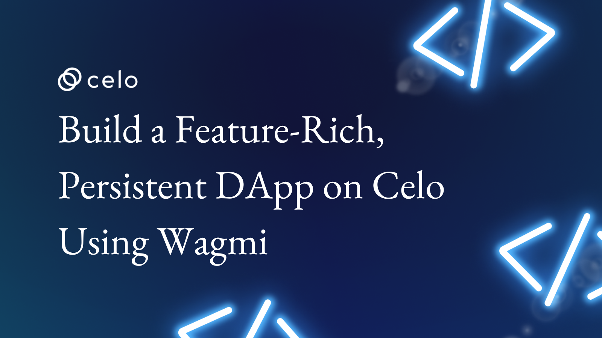
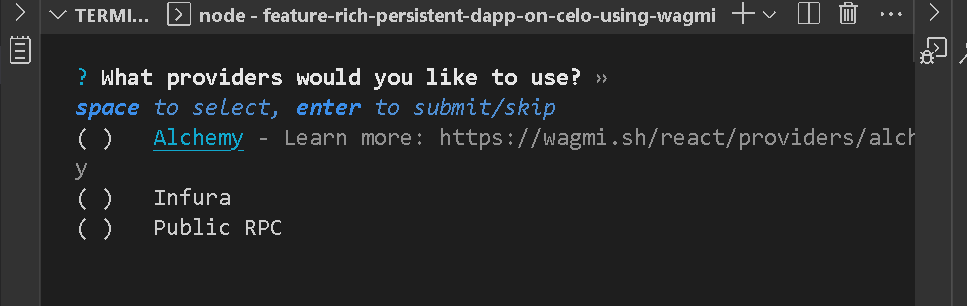
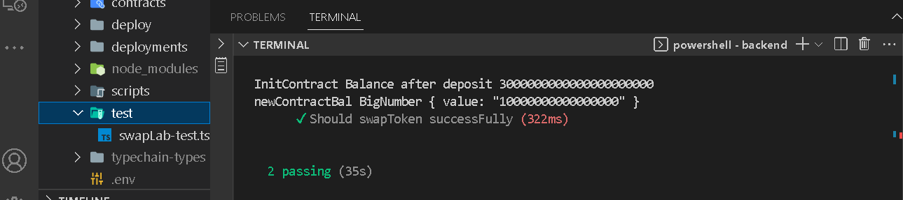

## Introduction

Building a user-centric blockchain-based application requires creating welcome experiences that make your users want to perform an action irrespective of known complexities or ones that may arise in the course of developing your product. There is a couple of libraries or provider that introduce different user experience. Here, you will learn about one of them.

## Prerequisites​

In this tutorial, I will walk you through the standard way of connecting to the Celo blockchain using web3React. You should be at least at the intermediate level in the following skill sets:

- Solidity development
- Javascript
- Knowledge of typescript may be helpful
- Learn how to use foundry for smart contract development. Please refer to **[this artile](https://docs.celo.org/blog/tutorials/build-a-generic-staking-dapp-using-foundry-and-nextjs)** for a complete tutorial. Earlier, I made a similar tutorial that uses web3Onboard library **[here]()**. Reading through the post will help you make the right choice of blockchain/web3 provider. 

## Requirements​

Before you proceed, be sure to have the following tools installed:

- For an editor. I recommend VSCode.
- NodeJs version >=14.0.0. I use version 18.12.1
- [Install foundry using this tutorial](https://docs.celo.org/blog/tutorials/build-a-generic-staking-dapp-using-foundry-and-nextjs).

**What we are building**

An extension of generic staking dApp that was previously built **[here](https://github.com/bobeu/connect-to-celo-using-web3onboard-library)**.

The dApp was built in two parts.

1. Smart contracts
2. Frontend

**Smart contracts**

We will import previous contracts that were used **[here](https://github.com/bobeu/connect-to-celo-using-web3onboard-library)**, and deploy them to Celo Alfajores. You can find the demo **[here](https://connect-to-celo-using-web3onboard-library.vercel.app/)**.

- **[Visit the repository](https://github.com/bobeu/connect-to-celo-using-web3onboard-library)**.

- Clone the project.

```bash
git clone https://github.com/bobeu/connect-to-celo-using-web3onboard-library.git
```
- Navigate into the root folder.
```bash
cd connect-to-celo-using-web3onboard-library
```
The contracts files reside in the folder named 'foundry' with its path as 'connect-to-celo-using-web3onboard-library/foundry/src'.

> Note:  Before you proceed further, be sure to have completed the steps for setting up foundry **[here](https://docs.celo.org/blog/tutorials/build-a-generic-staking-dapp-using-foundry-and-nextjs)**.

On successful installation, your file structure should look like this:


- Remove everything under the 'foundry/lib' folder. Then navigate to the foundry directory.

```bash
cd foundry
```
Run the command to install the forge standard library.

```bash
forge install --no-commit https://github.com/foundry-rs/forge-std

```

**Install Openzeppelin library**

```bash
forge install --no-commit https://github.com/OpenZeppelin/openzeppelin-contracts
```

- Without changing the current contract behavior, we will extend the 'Vault' contract to reflect a new feature we'll be adding shortly. With the new feature, $Celo holders can perform compounded Staking where current stakes are added to the previous one.

Two files will be altered. 'IVault.sol' and 'Vault.sol'.

- Find **src/interfaces/IVault.sol** file and paste the code below the last function. This is a function declaration/interface for interacting with the main application that will be implemented in the 'Vault' contract. 

```bash
function compoundStaking() external payable returns(bool);
```
_src/interfaces/IVault.sol_



**src/Vault.sol**

In this file, we need to make some adjustments.

- Replace the "_stake()" function with the following code. 
- To accommodate compounded staking, we introduced a flag `isCompounded` to differentiate whether a user is staking as usual or in compounded mode.
- We use the `speed` property to determine the reward.

```bash
> ...
  function _stake(address who, uint value, bool isCompounded) private returns(bool){
    address alc;
    uint speed = 0;
    uint stakeable = value;
    Staker memory stk = _getStakeProfile(who);
    if(value < minimumStaking) revert ZeroValue(value);
    alc = stk.account;
    if(alc == address(0)) {
        alc = address(new Account(token));
    }
    // Check for previous staking
    if(stk.celoAmount > 0 && !isCompounded) {
        _unstake(alc, stk.celoAmount, stk.depositTime);
    }

    // If compounded, increase mining speed
    if(stk.celoAmount > 0 && isCompounded) {
        stakeable = stk.celoAmount.add(value);
        speed = value.div(2);
    }
    vault[who] = Staker(_now(), stakeable, speed, alc, isCompounded);
    stakers ++;
    emit Staked(stakeable);

    return true;
  }
> ...

```

- Create a function to subscribe to compounded staking.
- An obvious difference is the boolean flag that differentiates it from the usual `stake()` function.

```bash
> ...
  ///@dev Subscribe to compounded staking
  function compoundStaking() public payable override returns(bool) {
      return _stake(msg.sender, msg.value, true);
  }
> ...
```

- Lastly, inside `unstake()` function, we add the speed to the actual amount staked. You are free to use your own computation to determine the reward for compounded staking. Our goal is to compound reward each time a user commits more $Celo to the vault using `compoundStaking` function.

```bash
  /**@dev Unstake Celo from the vault.
  */
  function unstake() public override returns(bool) {
      Staker memory stk = vault[msg.sender];
      if(stk.celoAmount == 0) revert NoStakingDetected(stk.celoAmount);
      require(stk.account != address(0), "Account anomally detected");
      _unstake(stk.account, stk.celoAmount.add(stk.miningSpeed), stk.depositTime); // <<<<<

      return true;
  }
```

The updated code is now compatible with the previous version.

**Compiling the contracts**

```bash
forge build
```
_Compile successfully_


**Testing**

Before running the test command, we should test our new function to ensure it works as expected. In `foundry/test/Vault.t.sol`, paste the following code.

```bash
  function testCompoundStaking() public {
    uint depositTime = block.timestamp;
    (bool doneStaking) = vault.compoundStaking{value: stakeAmt}();
    assertEq(doneStaking, true);

    IVault.Staker memory stk = vault.getStakeProfile();
    assertEq(stk.depositTime, depositTime);
    assertEq(stk.celoAmount, stakeAmt);
    if(stk.account == address(0)) revert ("Zero address");
    assertEq(token.balanceOf(stk.account), 0);
  }
```
Run the command, and the test should pass as expected.

```bash
forge test
```


**Deployment**

```bash Vault.sol
forge create --rpc-url https://alfajores-forno.celo-testnet.org --constructor-args 100000000000000000 --private-key <paste privake key here> src/Vault.sol:Vault
```

```bash RewardToken.sol
forge create --rpc-url https://alfajores-forno.celo-testnet.org --constructor-args 0x066F3BF47Eff52235b188c505E6C4e2aB5cbbaBf 500000000 --private-key <paste privake key here> src/reward/RewardToken.sol:RewardToken
```

## Frontend

The previous tutorial **[here](https://github.com/bobeu/stakingdapp-on-celo.git)** uses web3Onboard library. We will edit it to use web3react instead. Both libraries tend to achieve a similar goal but are different in context and one is richer in features. Move into the frontend folder.

```bash
cd stakingdapp-on-celo/frontend
```

**Install dependencies**

```bash
yarn install
```
Our focus is to have a simple user interface that can interact with our contracts. The current backend uses multiple providers and 'ethers' internally.

> Note: If you use Coinbase browser extension, the wallet pop-up experience from the injected function is handled by the Coinbase wallet popup.

**What is web3React?**

Web3React developed by 'Noah Zinnsmeister' is one of the known and popular methods of integrating wallet providers into dApps. 

Having a single provider in your dapp could amount to a single point of failure if the provider experiences downtime. One of the benefits of web3React is to provide a smooth web3 experience interacting with the blockchain. It supports varieties of wallets such as such as Metamask, Coinbase, walletConnect, etc. A fascinating side is that each of the supported wallets i.e providers can be installed as a standalone package/plugin for web3React. However, you are free to implement whichever wallet (s) best fits your need. In this guide, we are implementing three (2) providers: Metamask and WalletConnect, each of which gives us similar functionalities for interacting with the Celo network.

**Installation**

Install Web3React along with the provider packages:
- WalletConnect SDK, and
- Injected Wallet SDK

Run:

```bash
yarn add "@web3-react/core" "@web3-react/walletlink-connector" "@web3-react/walletconnect-connector" "@web3-react/injected-connector"
```

**pages/_app.tsx**

```bash
import React from 'react'
import '@/styles/globals.css';
import Head from 'next/head';
import styles from '@/styles/Home.module.css';
import type { AppProps } from 'next/app';
import { Web3ReactProvider } from '@web3-react/core';
import { Web3Provider } from '@ethersproject/providers'
import { ethers } from 'ethers';

function fetchLibrary (provider:any) {
  const lib = new Web3Provider(provider);
  lib.pollingInterval = 12000;
  return lib;
}

export default function App({ Component, pageProps }: AppProps) {
  return(
    <React.Fragment>
      <Head>
        <title>Celo staking tutorial</title>
        <meta name="description" content="generic staking dapp on Celo blockchain" />
        <meta name="viewport" content="width=device-width, initial-scale=1" />
        <link rel="icon" href="/favicon.ico" />
      </Head>
      <main className={styles.main}>
        <Web3ReactProvider getLibrary={fetchLibrary} >
          <Component {...pageProps} />
        </Web3ReactProvider>
      </main>
    </React.Fragment>
  );
}
```

- Import 'Web3ReactProvider' and use it as our top-level tag that wraps the entire application.

- The component accepts an argument - _getLibrary_ and we supply the `fetchLibrary()` which also accepts a provider of type 'any'. This is because we cannot determine the choice of provider users will make ahead of time. On initialization, the function is called and the injected wallet is parsed as the default connector, 

**pages/index.tsx**

```bash
import React from "react";
import App from "../components/App";
import LandingPage from "../components/LandingPage";
import { useWeb3React } from '@web3-react/core';
import { Web3Provider } from '@ethersproject/providers';
import { InjectedConnector } from '@web3-react/injected-connector';
import { WalletConnectConnector } from '@web3-react/walletconnect-connector';
import useApp from "../components/useApp";

const chainId :number = 44787;
const rpcUrl : string = "https://alfajores-forno.celo-testnet.org"

const Injected = new InjectedConnector({supportedChainIds: [chainId,]});
const WalletConnect = new WalletConnectConnector({
  rpc: rpcUrl,// Use infura url with Id
  qrcode: true,
  bridge: "https://bridge.wallet.org",
  chainId: chainId,
  supportedChainIds: [chainId,]
})

const connectors = Array.from([Injected, WalletConnect]);

export default function Home() {
  const { activate, active, deactivate } = useWeb3React<Web3Provider>();
  const { switchNetwork, addNativeToken } = useApp();

  async function trySwitchNetwork() {
    const switched = await switchNetwork();
    if(switched) {
      await addNativeToken();
    }
  }

  async function handleConnect(index:number) {
    if (active) return;
    try {
      console.log("Connectors", connectors);
      const selected = connectors[index];
      console.log('selected', selected);
      await activate(Injected).then(async() => {
        await trySwitchNetwork()
      }).catch(async(error) => {
        if(error) {
          await trySwitchNetwork();
        }
      })
      // library?.waitForTransaction(txnHash, 3, 10000);
      // library?.perform("", param)
    } catch (error) {
      console.log("Connect Error", error);
    }
  }

  function logout() {
    if (!active) {
      alert("User not authenticated");
      return ;
    }
    deactivate();
  }

  return <>{!active ? <LandingPage isUserAuthenticated={active} handleConnect={handleConnect} /> : <App logout={logout} />}</>;
}
```

- Import the connectors packages.
- Create new instances of the connectors with parameters correctly supplied. We supplied `44787` as the only supported chains to the constructors.
- We will ask users to select from a list of available providers.
- When users first visit your dapp, they might not be connected to your supported network. You could automate the process of switching or add the supported network to users' wallets if they trigger an action. They will be notified if they really want to complete the action. You could use the library's provider to achieve this but I prefer a custom `switchNetwork` method. 

**components/LandingPage.tsx**

```bash
// >...

// >...

export default function LandingPage(props: PageProps) {
  const [connecting, setConnecting] = React.useState<boolean>(false);
  const { handleConnect } = props;


  return (
    <React.Fragment>
      <Container maxWidth='md'>
        <div className="topDiv">
          <Stack className="divHeader" textAlign={"revert-layer"} >
            <Typography component={"main"} variant="h2">Celo StakeVerse <span style={{color: green[600]}}>V3</span></Typography>
            <Typography component={"main"} variant="h4">Stake Celo - Earn RTK Token</Typography>
            <Typography component={"main"} variant="h6">Made by <span>
              <Link color="inherit" href="https://github.com/bobeu" style={{color: green[600]}}>
                Isaac Jesse 
              </Link> a.k.a Bobelr for Celosage</span>
            </Typography>
            <Link color="inherit" href="https://github.com/bobeu/stakingdapp-on-celo" style={{color: green[600]}}>
              Source code
            </Link>
          </Stack>
          <div className="divHeader"></div>
          <div className="lowerDiv">
            <Button 
              disabled={connecting} 
              sx={styles.button} 
              variant="text" 
              onClick={() => handleClick(0)}
              className='connectButton'
            >
              Metamask
            </Button>
            <Button 
              disabled={connecting} 
              sx={styles.button} 
              variant="text" 
              onClick={() => handleClick(1)}
              className='connectButton'
            >
              WalletConnect
            </Button>
          </div>
        </div>
      </Container>
      <Footer sx={{ mt: 8, mb: 4 }} />
    </React.Fragment>
  );
}
```

- Since we added two connectors, we will need also two buttons to send the signal. The landing page now has two buttons each of which handles a connector when clicked.

**components/App.tsx**

- Import `useWeb3React` hook that provides us access to provider utilities. Remember we wrapped the whole application using Web3React provider, this is why we can access the utilities in the context of web3React.

```bash
import { useWeb3React } from '@web3-react/core';
import { Web3Provider } from "@ethersproject/providers";
```

- With the hook, we access the `account`, `library`, and `active` variables.
  - 'account': An address type that represents the user's connected account. When the user switches accounts in the wallet, web3React auto-updates the account variable.
  - the ‘library’ is otherwise the provider object that is returned when the wallet is successfully connected.
  - 'active' is the state of the provider with regards to your dapp.

  ```bash
    const { account, active, library  } = useWeb3React<Web3Provider>();
  ```

  - We run an 'async' in the useEffect function where we gave the library as an argument to the provider parameter

```bash
  React.useEffect(() => {
    const abortProcess = new AbortController();
    async function getTokenBalance() {
      if(account && library) {
        const res :TransactionResultProp = await sendtransaction({
          account: account, 
          functionName: 'balance', 
          cancelLoading: cancelLoading,
          provider: library
        });

        setReward(res.read);
      }
    }

    getTokenBalance();
    return () => abortProcess.abort();
  }, [response, account]);
```

- `handleClick()` accepts an id of type number to programmatically select the choice of connector.

```bash
  const handleClick = async(index:number) => { 
    setConnecting(true);
    await handleConnect(index).then(() => {
      setConnecting(false);
    });
  }
```

- We filter the contract methods for the ones we need using the `displayContractFunctions` function.

```bash
  const displayContractFunctions = useMemo(() => {
    let filt: any;
    if (!vaultAbi) return [];
    filt = vaultAbi.filter(method => method["type"] === "function");
    return filt.filter(
      (method: { name: string }) => method.name === "stake" ||
        method.name === "unstake" || 
          method.name === "stakeOnBehalf" ||
            method.name === "compoundStaking" || 
              method.name === "getStakeProfile" ||
                method.name === "withdraw"
        );
  }, [vaultAbi]);
```

- Inside the `handleSubmit` function, add a new case to the switch statement to handle the new feature.

```bash
case 'compoundStaking':
  result = await stake();
  break;
```

**components/api/index.tx**

- Lastly, the functionality in this file remains unchanged except that we added a new feature in the switch statement for the function we introduced in our contract.

```bash
  // >...
  case 'compoundStaking':
    const txn1 = await vault_ins.compoundStaking({value: value });
    // const txn = await vault_ins.setToken(tokenAddr);
    await txn1?.wait(2).then((rec: ContractReceipt) => {
      result.receipt = rec;
      result.view = false;
      if(cancelLoading) cancelLoading();
    });
    break;
  // >...
```

In case you need clarification with the explanation, the complete source code can be found **[here](https://github.com/bobeu/connect-and-interact-with-celo-using-web3react)**.


## Conclusion​

What we have learned so far:

- Writing, compiling, deploying, and testing smart contracts using foundry.
- How to install, set up, and use the web3React library.
- How to build a simple frontend and connect the backend.
- Manage your dApp using web3React.

## What next?
​
You can edit the code to your taste. At this point, you should be able to launch your own project as a Celo developer. If you are confused anywhere in the tutorial, I left a link to the full source code in the _references_ section. Go over it as many times as you can. In no time, you will get a good grasp. Celo is an EVM-compatible blockchain. You can leverage the various web3 tools to build your dream application. Get started with **[Celo documentation](https://docs.celo.org/tutorials)**

## About the Author​

**Isaac Jesse** , aka _Bobelr_ is a smart contract/Web3 developer. He has been in the field since 2018, worked as an ambassador with several projects like Algorand and so on as a content producer. He has also contributed to Web3 projects as a developer.

## References​

- [Celo developers resources](https://docs.celo.org/developer/)
- [Source code](https://github.com/bobeu/connect-and-interact-with-celo-using-web3react)
