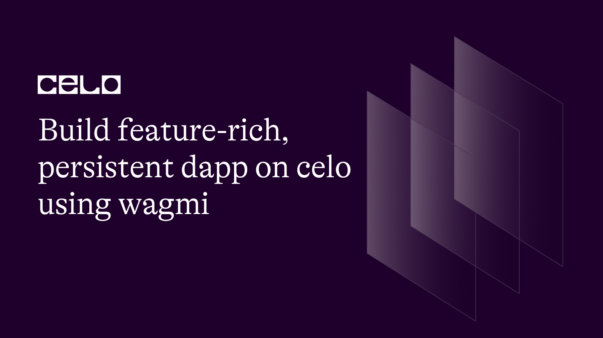
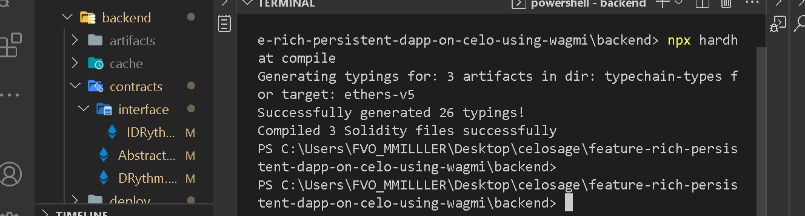
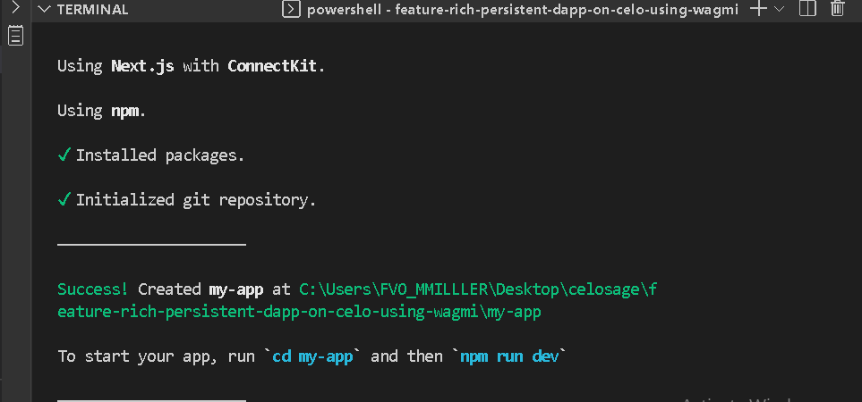
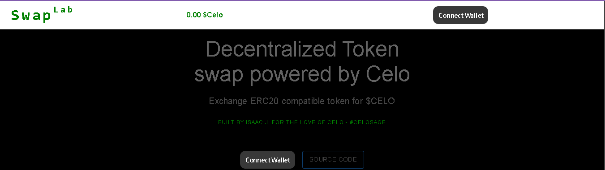
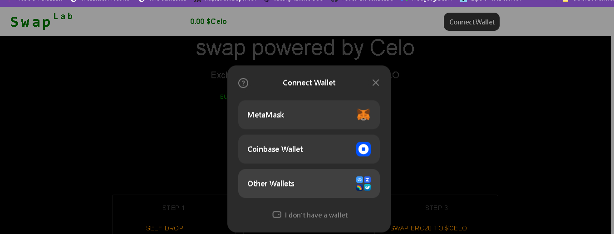

## Introduction

Since Ethereum emerged, there has been a high demand for web3 developers. Unlike traditional applications, building for blockchain requires extra effort to give the users the experience they need to keep coming back. To build a good user interface, this article will introduce you to one of the many libraries that help you get started.

## Prerequisites​

We will walk through one of the many ways to connect and interact with Dapps deployed to the Celo blockchain using wagmi. Celo blockchain is Ethereum compatible, indicating that we can use the same tools for building dapps on the Ethereum blockchain to build for Celo. This is an advanced tutorial, so you should be at least an intermediate in the following fields.

- Solidity development
- Javascript and typescript
- How to use hardhat for smart contract development. Refer to **[this](https://docs.celo.org/blog/tutorials/getting-started-on-celo-with-hardhat)** and **[this](https://docs.celo.org/blog/tutorials/advance-hardhat-configuration-on-celo-using-plugins)** to learn how to use hardhat.

## Requirements​

Install the following tools:

- For an editor. I recommend VSCode.
- NodeJs version >=14.0.0. I use version 18.12.1
- [Setup and configure hardhat](https://docs.celo.org/blog/tutorials/advance-hardhat-configuration-on-celo-using-plugins).

**What we are building**

We will create a decentralized application for swapping ERC20 tokens for $Celo. For a full description, please refer to the **[readme](https://github.com/bobeu/feature-rich-persistent-dapp-on-celo-using-wagmi/README.md)**

The dApp was built in two parts.

1. Smart contracts
2. Frontend

**Smart contracts**

- Clone project

```bash
git clone https://github.com/bobeu/feature-rich-persistent-dapp-on-celo-using-wagmi.git
```

- Navigate to the root folder

```bash
cd feature-rich-persistent-dapp-on-celo-using-wagmi/backend
```

- Install dependencies

```bash
yarn install
```

Now, let's examine the core functionalities.

**Backend file/folder structure**

- contracts
- deploy
  - 00_deploy.js
- scripts
  - deploy.ts
- test
  - swapLab-test.ts
- _gitignore_
- _hardhat.config.ts_
- _package-lock.json_
- _package.json_
- _README.md_
- _tsconfig.json_
- _yarn.lock_

**Contract folder**

- SwapLab.sol
  - For top-level ownership of the contract, we'll use openzeppellin's `Ownable.sol`.

  ```js
  import "@openzeppelin/contracts/access/Ownable.sol";
  ```

  - `IERC20.sol` to quickly create an ERC20 compatible token.
  
  ```js
  import "@openzeppelin/contracts/token/ERC20/IERC20.sol";
  ```

  - `IERC20Metadata.sol` is an interface for token metadata such as token names, symbols, and decimals.

  ```js
  import "@openzeppelin/contracts/token/ERC20/extensions/IERC20Metadata.sol";
  ```

  - To safely perform simple arithmetic calculations and avoid underflow or overflow risk in contracts, we import the `SafeMath.sol`. However, this may not be necessary for newer solidity versions since they come with built-in checks.

  ```js
  import "@openzeppelin/contracts/utils/math/SafeMath.sol";
  ```

  - We'll use `Address.sol` to limit interactions to only externally owned accounts - EOA.

  ```js
  import "@openzeppelin/contracts/utils/Address.sol";
  ```

  - Since we'll be interacting with external contract addresses, to avoid a reentrancy attack, `ReentrancyGuard.sol` will be our guard.

  ```js
  import "@openzeppelin/contracts/security/ReentrancyGuard.sol";
  ```

The SwapLab contract inherits the properties and public attributes of `Ownable.sol` and `ReentrancyGuard.sol`.

```js
contract SwapLab is Ownable, ReentrancyGuard {
  // code here
}
```

Inside the body of the `SwapLab` contract, we tell the compiler to use everything inside the SafeMath library for all uint256's operations. This means returns from any operation that evaluate to type `uint256` can invoke any function in the SafeMath library as the first argument.

```js
  using SafeMath for uint256;
  using Address for address;
```

_Example:_

```js
import "@openzeppelin/contracts/utils/math/SafeMath.sol"

contract Test {  
  using SafeMath for uint256;

  function typeUint256Operation() public pure returns(uint) {
    return type(uint256).max;
  }

  function uselibFunction() public {
    return typeUint256Operation().sub(type(uint256).min);
  }
}
```

The same applies to the way we use the 'Address' library.
Next, we declare a few custom errors.

```js
  error UnSupportedAsset(address);
  error AssetIsSupported(address);
  error InsufficientLiquidyInContract(uint balThis, uint balToRec);
  error ContractAddressNotAllowed(address);
```

For every swappable ERC20 asset, they must be supported. Not a good practice to allow users to supply contract addresses of their choice. A user with bad intent could create a malicious contract and give the address as a parameter. It could pose a serious threat resulting to devastating.

- We set custom data for supported assets and providers using the `struct` keyword. They will be used as values in mappings whose keys are of address type.

- Since mapping in solidity does not support a running loop, we use the `providersAddress` array to retain the account addresses of providers so we can perform iteration.

```js
  uint public totalLiquidity;
  uint public swapfee;
  uint public totalFeeReceived;
  uint public totalProvider;

  struct SupportedAsset {
    bool isSupported;
    uint rate;
  }

  struct Provider {
    uint amount;
    uint timeProvided;
    uint position;
    bool isExist;
  }

  address[] public providersAddress;

  mapping(address => SupportedAsset) public supportedAssets;
  mapping(address => Provider) public liqProviders;
```

**Modifiers**

- `onlyEOA()` permits only non-contract accounts to call the function it is invoked on.

- `isProvider` gives access to liquidity providers only.

```js
 modifier onlyEOA() {
    if(Address.isContract(msg.sender)) revert ContractAddressNotAllowed(msg.sender);
    _;
  }

  modifier isProvider() {
    require(liqProviders[msg.sender].amount > 0, "Not a provider");
    _;
  }
```

**The constructor**
In the constructor, we initialized the state variables.

```js
  constructor(address _supportedAsset) {
    address[] memory sAsset = new address[](1);
    uint[] memory rates = new uint[](1);
    sAsset[0] = _supportedAsset;
    rates[0] = 50 * (10 ** 18);
    swapfee = 1e14 wei;
    providersAddress.push(msg.sender);

    _setNewAsset(
      sAsset, 
      rates
    );
  }
```

In the future, we may support more pairs, therefore, we configure a function for such an event.

```js
  function _setNewAsset(
    address[] memory _supportedAssets, 
    uint[] memory rates
  ) private {
    require(
      _supportedAssets.length == rates.length, 
      "Length mismatch");
    for (uint i = 0; i < _supportedAssets.length; i++) {
      supportedAssets[_supportedAssets[i]] = SupportedAsset(
        true,
        rates[i]
      );
    }
  }

  function setNewAsset(    
    address[] memory _supportedAssets, 
    uint[] memory rates
  ) public onlyOwner {
    _setNewAsset(_supportedAssets, rates);
  }
```

**Functions**

- Swapping is only possible when the corresponding amount in Celo coin is available in the contract. Liquidity providers will call `addLiquidity()` to deposit Celo into the pool.
  - It is payable because it accepts $Celo.
  - Users must take cognizance of the swapping fee otherwise it may fail.
  - Only non-contract accounts can call.

```js
/**@dev
   * We try to be fair with those that have previous liquidity in the pool
   * by backdating the time liquidity was provided.
   */
  function addLiquidity() public payable onlyEOA {
    require(msg.value > 0,"Insufficient value");
    Provider memory prov = liqProviders[msg.sender];
    uint position = prov.position;
    if(prov.isExist == false) {
      position = providersAddress.length;
      totalProvider ++;
      providersAddress.push(msg.sender);
    } else {
      if(providersAddress[position] == address(0)) {
        providersAddress[position] = msg.sender;
      }
    }
    liqProviders[msg.sender] = Provider(
      prov.amount.add(msg.value),
      prov.timeProvided > 0 ? _now().sub(prov.timeProvided).div(2).add(prov.timeProvided) : _now(),
      position,
      true
    );

    totalLiquidity = totalLiquidity.add(msg.value);
  }
```

- Providers are free to remove liquidity any time. But the contract rewards leaving it longer.

```js
   /**@dev 
   * If the provider has no liquidity balance left in the pool, their
   * provided time is reset.
   */
  function removeLiquidity() public onlyEOA isProvider nonReentrant {
    Provider memory prov = liqProviders[msg.sender];
    liqProviders[msg.sender] = Provider(
      0, 
      0,
      prov.position,
      prov.isExist
    );
    totalProvider --;
    totalLiquidity = totalLiquidity.sub(prov.amount); 
  
    providersAddress[prov.position] = address(0);

    Address.sendValue(payable(msg.sender), prov.amount);
  }
```

- Accumulated fees from swapping are shared among the providers as a reward for keeping the system running.
  - The function is public.
  - The caller must be a provider.
  - Only externally owned accounts can call it.
  - We guard the function with the `nonReentrant` modifier to prevent reentering while the current session is yet to terminate.  

```js
   /**@dev 
   * Anyone can call this function to split fees among the providers.
   */
  function splitFee() public onlyEOA isProvider nonReentrant {
    uint availableFee = totalFeeReceived;
    require(availableFee > 0, "Fee cannot be split at this time");
    totalFeeReceived = 0;
    uint providers = providersAddress.length;
    uint each = availableFee.div(providers);
    for(uint i = 0; i < providers; i++) {
      address to = providersAddress[i];
      if(to != address(0)) {
        Address.sendValue(payable(to), each);
      }
    }
  }
```

- We will need some of the state data on the frontend, a more reason I use the `getData()` to return a couple of state data in a single call.

```js
   function getData() public view returns(
    uint _totalLiquidity,
    uint _swapfee,
    uint _totalFeeReceived,
    uint _totalProvider,
    Provider memory _provider
  ) {
    _totalLiquidity = totalLiquidity;
    _swapfee = swapfee;
    _totalFeeReceived = totalFeeReceived;
    _totalProvider = totalProvider;
    _provider = liqProviders[msg.sender];

    return(
      _totalLiquidity,
      _swapfee,
      _totalFeeReceived,
      _totalProvider,
      _provider
    );
  }
```

Lastly, the `swapERC20ForCelo` exchanges native tokens for $CELO.

```js
contract SwapLab is Ownable, ReentrancyGuard {
  //...
  function swapERC20ForCelo(address asset) payable public nonReentrant {
    SupportedAsset memory sat = supportedAssets[asset];
    if(!sat.isSupported) revert UnSupportedAsset(asset);
    uint mantissa = 10 ** IERC20Metadata(asset).decimals();
    if(Address.isContract(msg.sender)) revert ContractAddressNotAllowed(msg.sender);
    uint amountToSwap = IERC20(asset).allowance(msg.sender, address(this));
    require(amountToSwap >= sat.minimumSwapValue, "Insufficient allowance");
    uint amountCeloToReceive = amountToSwap.mul(sat.rate).div(mantissa).sub(sat.swapFee);
    uint bal = address(this).balance;
    if(amountCeloToReceive > bal) revert InsufficientFund(bal, amountCeloToReceive);
    require(IERC20(asset).transferFrom(msg.sender, owner(), amountToSwap), "Failed");
    (bool sent, ) = address(msg.sender).call{value: amountCeloToReceive}('');
    require(sent, 'Anomally detected');
  }

  function deposit() payable public {
    require(msg.value > 0,"Thank you");
  }

  function withdraw(address to, uint amount) public onlyOwner {
    require(to != address(0), 'Zero recipient');
    (bool done,) = to.call{value: amount}('');
    require(done, 'Failed');
  }
}
```

**Compile**

In the `backend` directory, run:

```bash
npx hardhat compile
```



**Test**

```bash
npx hardhat test
```


**Deploy**

```bash
yarn deploy
```

When you run the deploy command,  a folder named `deployments` is created where the deployment information is saved. There we'll import the 'Abi' and 'contract address' to the frontend where we'll need them.

## Frontend

Exit the current directory into the root folder and install the dependencies:

```bash
cd ..
cd frontend
yarn install
```

Since I have already completed the setup, it's important that I show you how to set up the frontend folder.

If we are to create a new project from scratch, let's assume we're in the root directory with `/backend` being the only folder. The recommended way to start a wagmi project is to run the following command.

```bash
npm init wagmi -- --template next-connectkit
```

Select the choice of provider.


Installation success



The command takes extra arguments `--template` and `next-connectkit` to start the project with a boilerplate that uses connectkit compatible with NextJs to display information to users on the frontend.

Follow the instructions to choose your choice. For this project, I have selected the 'default' option that uses 'NextJs'. You really do not need to do anything else. Much of the work is done for you in the background.

Before setting up wagmi, let's understand what Wagmi aims to achieve.

**What is Wagmi?**
Wagmi is a library for interacting with Ethereum-based applications. It comprises over 20 functional React hooks to perform common actions a typical Dapp needs.

- `wagmi.ts`

For wagmi to work effectively, we need to use it as a provider and top-level tag for the application or the part where we need it. The provider requires a client to be parsed as a property. So first, we will configure and export the wagmi client. Below we set the value of `getDefaultClient()` from 'connectKit' being the provider argument to the `createClient` function imported from 'wagmi'. The return value is an object parameter expected by the wagmi provider component. It works more like a plugin. The 'getDefaultClient' function internally sets up known connectors for us. No need to configure providers like Metamask, Coinbase, and Walletconnect explicitly. This is one of the advantages of using wagmi over other libraries such as web3React.

Lastly, we get the already configured `celoAlfajores` network information from the `'wagmi/chains'` module. Now, the work is a lot easier.

```ts
import { getDefaultClient } from 'connectkit'
import { createClient } from 'wagmi'
import { celoAlfajores } from 'wagmi/chains'

export const client = createClient(
  getDefaultClient({
    autoConnect: true,
    appName: 'DRythm Music-sharing dapp',
    chains: [celoAlfajores]
  })
)
```

- `_app.ts`

Import the client we configured from the previous step in 'wagmi.ts'.
Import WagmiConfig provider from 'wagmi'. We'll need this to wrap and initialize our Dapp so wagmi can effectively manage it. Thereafter, we can access wagmi hooks in child components.

Get the 'ConnectKitProvider' component from the 'connectkit' module. From the name, it manages the connection and connected interface for us.

>Note: With this version of `connectkit`, to use it anywhere in your program, it must be wrapped within the `ConnectkitProvider` as depicted below.

```ts
import '../styles/globals.css'
import React from 'react';
import NextHead from 'next/head'
import type { AppProps } from 'next/app';
import { client } from '../wagmi'
import { WagmiConfig } from 'wagmi';
import { ConnectKitProvider } from 'connectkit';

export default function App({ Component, pageProps }: AppProps) {
  const [mounted, setMounted] = React.useState(false);

  React.useEffect(() => setMounted(true), []);

  return (
    <WagmiConfig client={client}>
      <ConnectKitProvider>
        <NextHead>
          <title>SwapLab</title>
        </NextHead>
          {
            mounted &&
              <Component 
                {...pageProps} 
              />
        }
      </ConnectKitProvider>
    </WagmiConfig>
  );
}
```

- `Header/index.tsx`

In the Header component, we import and render the 'ConnectKitButton' component from 'connectkit' module. The component manages user authentication, disconnection, account, and balance display with a very nice user interface. It saves us a lot of stress, and we only need to write less code. From the `useAccount` hook, we can access properties such as the user's connected account, ENS name, provider object, and many more.

The `useBalance` hook provides useful functions and properties to manage users' balances both in native or platform assets. You can notice we call the `useBalance` hook which is run each time our Dapp is re-rendered.
It accepts a couple of mandated and optional arguments but we only parsed the ones we need.

- The `address` property could either be a user's account address or a contract address instead. It fetches the $Celo balance for such an account.

- `formatUnits` tells the hook which format you want the balance to be. The various available options are: `ether`, `wei`, `mWei`, `gwei`, `szabo`, `kwei` and `finney`.

- The `watch` property listens to changes in the balance and notifies to update the frontend.

- Alternatively, you can optionally set the 'token' property in place of 'address' to fetch the native token balance instead of $CELO's.

> Note: Wagmi's level of persistence is higher compared to some of the other libraries.

```ts
import * as React from "react";
import AppBar from "@mui/material/AppBar";
import Box from "@mui/material/Box";
import Toolbar from "@mui/material/Toolbar";
import Typography from "@mui/material/Typography";
import Container from "@mui/material/Container";
import { useAccount, useBalance } from "wagmi";
import { ConnectKitButton } from 'connectkit'

function Header() {
  const { address } = useAccount();
  const { data } = useBalance({
    address: address,
    formatUnits: 'ether',
    watch: true
  });

  return (
    <AppBar position="fixed" sx={{ background: "#fff" }} elevation={0}>
      <Container maxWidth="xl">
        <Toolbar disableGutters>
          <Typography
            variant="h6"
            noWrap
            component="a"
            href="/"
            sx={{
              mr: 2,
              display: { xs: "none", md: "flex" },
              fontFamily: "monospace",
              fontWeight: 700,
              letterSpacing: ".3rem",
              color: "purple",
              textDecoration: "none"
            }}
          >
            <span style={{ fontSize: "35px" }}>Swap</span>Lab
          </Typography>
          <Typography
            variant="h5"
            noWrap
            component="a"
            href=""
            sx={{
              mr: 2,
              display: { xs: "flex", md: "none" },
              flexGrow: 1,
              fontFamily: "monospace",
              fontWeight: 700,
              letterSpacing: ".3rem",
              color: "purple",
              textDecoration: "none"
            }}
          >
            <span style={{ fontSize: "35px" }}>D</span>Rythm
          </Typography>
          <Box sx={{ flexGrow: 1, display: "flex", justifyContent: "space-around", alignItems: 'center' }}>
            <Typography variant="body1" sx={{color: 'purple', fontWeight: 'bolder'}}>{`${data?.formatted? data.formatted : '0.00'} $Celo`}</Typography>
            <ConnectKitButton />
          </Box>
        </Toolbar>
      </Container>
    </AppBar>
  );
}

export default Header;
```

For example, I displayed the balance of the connected account in the header to showcase the usage of the `useAccount` and `useBalance` hooks through property destructuring. The 'data' property returned by 'useBalance' contains the user's account information. From the object, we accessed `data?.formatted` - an already formatted value of `data?.value` which is in bigNumber format. Much of the conversion task is done for us.

The output of the 'ConnectKitButton' is displayed at the top right side of the dapp.


Connect wallet.


- `components/App/index.tsx`
  - _loading_ determines when the 'Spinner' component should render.
  - _amount_ represents the amount to approve by the users. It will be extracted from users using the `TextField` component.
  - _value_ represents an amount user wishes to send along in a call.
  - _allowance_: We'll fetch the user's allowance and store it here.
  - _balance_: User's native asset's balance.
  - _Records error message from the most recent transaction.
  - Next, we call the 'useAccount()' hook to get the user's connected account address and the selected provider.

  >Note: The connector property is an object that represents the user's selected wallet. We accessed the provider object using `connector?.getProvider()`. We need the provider to send transaction requests to Celo Alfajores.

  ```ts
    // ...
    const [loading, setLoading] = React.useState<boolean>(false);
    const [amount, setAmount] = React.useState<number>(0);
    const [value, setValue] = React.useState<number>(0);
    const [allowance, setAllowance] = React.useState<BigNumber>(BigNumber(0));
    const [balance, setBalance] = React.useState<BigNumber>(BigNumber(0));
    const [errorMessage, setError] = React.useState<any>("");
    const [contractData, setData] = React.useState<Data>(data);

    const { testAddr } = getContractData();
    const { address, connector } = useAccount();
    // ...
  ```

  - When users want to deposit $CELO to the contract, we'll use the 'TextFielld' to get the value from them, `handleValueChange` listens to what they type, and `setValue` is called to update the state with the changes. The same applies to 'amount'.

  ```ts
    const { data, isFetched, refetch } = useBalance({
      address: address,
      token: `0x${testAddr.replace('0x', '')}`,
      formatUnits: 'ether'
    })

    const handleValueChange = (e: React.ChangeEvent<HTMLTextAreaElement | HTMLInputElement>) => {
      e.preventDefault();
      setValue(e.target.value);
    };

    const handleAmountChange = (e: React.ChangeEvent<HTMLTextAreaElement | HTMLInputElement>) => {
      e.preventDefault();
      setAmount(Number(e.target.value));
    };

    const afterTrx = (x:string, result: Result) => {
      switch (x) {
        case 'swap':
          setData(result.data);
          break;
        case 'approve':
          setAllowance(result.balanceOrAllowance);
          break;
        case 'clearAllowance':
          setAllowance(result.balanceOrAllowance);
          break;
        case 'addLiquidity':
          setData(result.data);
          break;
        case 'removeLiquidity':
          setData(result.data);
          break;
        default:
          setData(result.data);
          break;
      }      
    }

    React.useEffect(() => {
      const abortOp = new AbortController();
      const getBalance = async() => {
        var funcName = 'getBalance';
        const provider = await connector?.getProvider();
        if(provider) {
          const result = await runContractFunc({
            providerOrSigner: provider,
            functionName: funcName,
            account: address
          });
          afterTrx(funcName, result);
        }

        const bal = isFetched ? data : await (await refetch({ exact: true })).data;
        setBalance(bal?.formatted);
        console.log("Bal", bal);
      }

      getBalance();

      return () => abortOp.abort()
    }, [errorMessage, address, connector, isFetched])
    
    const handleClick = async(functionName: string, flag?:boolean) => {
      if(flag && functionName !== 'approve' && amount === 0) return alert('Please enter amount');
      if(functionName === 'addLiquidity') {
        if(value === '0') return alert('Please set value');
      }
      setLoading(true);
      const provider = await connector?.getProvider();
      
      try {
        const amt = BigNumber(amount);
        let val = ethers.utils.parseEther(value);
        if(functionName === 'swap') val = ethers.utils.parseEther('0.1');
        console.log("Val", val.toString())
        const result = await runContractFunc({
          functionName: functionName,
          providerOrSigner: provider,
          amount: ethers.utils.hexValue(ethers.utils.parseUnits(amt.toString())),
          cancelLoading: () => setLoading(false),
          account: address,
          value: val
        });
        // value: ethers.utils.hexValue(ethers.utils.parseUnits(val.toString()))

        afterTrx(functionName, result);
    
      } catch (error: any) {
        if(error) {
          const result = await runContractFunc({
            functionName: 'getData',
            providerOrSigner: provider,
          })
          afterTrx('getData', result);
          setError(error?.reason || error?.data.message || error?.message);
          setLoading(false);
          console.log("Error1", error?.reason|| error?.message || error?.data.message);
        }
      }
    }

    return (
      <ThemeProvider theme={theme}>
        <CssBaseline />
        <main>
          <Box
            sx={{
              bgcolor: '',
              pt: 8,
              pb: 6,
            }}
          >
            <Container maxWidth="sm">
              <Typography
                component="h1"
                variant="h3"
                align="center"
                color="rgb(150, 150, 150)"
                gutterBottom
                mt={2}
              >
                Decentralized Token swap powered by Celo
              </Typography>
              <Typography variant="h6" align="center" color="rgba(150, 150, 150, 0.7)" paragraph>
                Exchange ERC20 compatible token for $CELO
              </Typography>
              <Typography variant="overline" align="center" color="green" paragraph>
                Built by <span style={{color: 'rgba(170, 170, 170, 0.9)'}}><a href="https://github.com/bobeu/">Isaac J.</a></span> for the love of Celo - #celosage
              </Typography>
              <Stack
                sx={{ pt: 4 }}
                direction="row"
                spacing={2}
                justifyContent="center"
              >
                <ConnectKitButton />
                <Button variant="outlined">
                  <Link color="rgba(150, 150, 150, 0.8)" sx={{
                    '&:hover': {
                      border: 'rgba(100, 100, 100, 0.5)'
                    }
                  }} href="https://github.com/bobeu/feature-rich-persistent-dapp-on-celo-using-wagmi" underline='none'>Source code</Link> 
                </Button>
              </Stack>
            </Container>
          </Box>
          
          <Container sx={{ p: 2 }} maxWidth="md">
            <Typography variant='h5' component='button' color='orange' >Warning!</Typography>
            <Box sx={{display: 'flex', justifyContent: 'space-around', }}>
              <Typography variant='button' component='button' color='yellowgreen'>
                This sample project is for tutorial purpose and may not be suited for production.<br/>
                It runs on Celo Alfajores. Do not use real $Celo
              </Typography>
            </Box>
            <Grid container spacing={4}>
              <Grid item container xs={12} spacing={2}>
                <Grid item xs={6} sx={{color: 'rgba(150, 150, 150, 0.7)'}}>
                  <Container sx={{ p: 2 }} maxWidth="sm">
                    <Stack sx={{color: 'rgba(150, 150, 150, 0.7)'}}>
                      <Typography variant='h5' component='button' mt={4} mb={4}>Contract state</Typography>
                      <Button startIcon={'Total Liquidity'} sx={{color: green[700]}} endIcon={contractData?._totalLiquidity.toString()} variant={'text'} />
                      <Button startIcon={'Swap Fee'} sx={{color: green[700]}} endIcon={contractData?._swapfee.toString()} variant={'text'} />
                      <Button startIcon={'Generated fee'} sx={{color: green[700]}} endIcon={contractData?._totalFeeReceived.toString()} variant={'text'} />
                      <Button startIcon={'Providers'} sx={{color: green[700]}} endIcon={contractData?._totalProvider.toString()} variant={'text'} />
                    </Stack>
                  </Container> 
                </Grid>

                <Grid item xs={6} sx={{color: 'rgba(150, 150, 150, 0.7)'}}>
                  <Container sx={{ p: 2 }} maxWidth="sm">
                    <Stack>
                      <Typography variant='h5' component='button' mt={4} mb={4}>Provider profile</Typography>
                      <Button startIcon={'Amount ($CELO)'} sx={{color: green[700]}} endIcon={format(contractData?._provider.amount)} variant={'text'} />
                      <Button startIcon={'Date'} sx={{color: green[700]}} endIcon={convertFromEpoch(contractData?._provider.timeProvided)} variant={'text'} />
                      <Button startIcon={'Position'}sx={{color: green[700]}} endIcon={contractData?._provider.position.toString()} variant={'text'} />
                      <Button startIcon={'Exist ?'} sx={{color: green[700]}} endIcon={contractData?._provider.isExist? 'Yes' : 'No' } variant={'text'} />
                    </Stack>
                  </Container>
                </Grid>
              </Grid>

              <Grid item xs={12} >
                <Container sx={{ p: 2 }} maxWidth="md" color='rgba(150, 150, 150, 0.5)'>
                  <Box 
                    sx={{
                      color: 'rgba(150, 150, 150, 0.5)',
                      width: '100%',
                      display: 'flex',
                      justifyContent: 'space-around',
                      alignItems: 'center'
                    }}
                  >
                    <Typography component={'button'} >Notification:</Typography>
                    <Typography component={'button'} >{errorMessage}</Typography>
                  </Box>
                </Container>
              </Grid>
              <Grid item xs={12} md={6}>
                <CardComponent
                  step='Step 1'
                  heading='Self Drop'
                  isButton_1_display={true}
                  isButton_2_display={true}
                  isButton_3_display={true}
                  button_1_name={'Claim SelfDrop'}
                  button_2_name={'Add Liquidity'}
                  button_3_name={'Remove Liquidity'}
                  handleButton_1_Click={() => handleClick('claim')}
                  handleButton_2_Click={() => handleClick('addLiquidity')}
                  handleButton_3_Click={() => handleClick('removeLiquidity')}
                  displayChild={loading}
                  displayTextfield={true}
                  handleTextfieldChange={handleValueChange}
                  description={`Test balance: ${balance} ${data?.symbol}`}
                >
                  <Spinner color={'white'} />
                </CardComponent>
              </Grid>
            
              <Grid item xs={12} md={6}>
                <CardComponent
                  step='Step 2'
                  heading='Set Approval'
                  isButton_1_display={true}
                  isButton_2_display={true}
                  isButton_3_display={true}
                  button_1_name={'Set Allowance'}
                  button_2_name={'Swap Asset'}
                  button_3_name={'Split Fee - Providers'}
                  handleButton_1_Click={() => handleClick('approve', true)}
                  handleButton_2_Click={() => handleClick('swap')}
                  handleButton_3_Click={() => handleClick('split')}
                  displayChild={loading}
                  displayTextfield={true}
                  handleTextfieldChange={handleAmountChange}
                  description={
                    `Allowance: ${allowance.toString() > '0' ? allowance.toString() : '0.00'}`
                  }
                >
                  <Spinner color={'white'} />
                </CardComponent>
              </Grid>
            </Grid>
          </Container>
        </main>
      </ThemeProvider>
    );
  }

  const format = (x:BigNumber) => getEllipsisTxt(x.toString(), 4);

  function convertFromEpoch(onchainUnixTime:BigNumber) {
    const toNumber = onchainUnixTime? onchainUnixTime.toNumber() : 0;
    var newDate = new Date(toNumber * 1000);
    return `${newDate.toLocaleDateString("en-GB")} ${newDate.toLocaleTimeString("en-US")}`;
  }
  ```

- `components/api/contractdata.ts`
In this file, we fetch the abis for SwapLab and Token contracts, and export both abis and contract addresses. You can access other deployment information from the variables such as the **receipt**, **bytecode**, **transactionHash**, and many more. Whenever the deployment information changes, this file is automatically updated.

```ts
  import swapLab from "../../../backend/deployments/alfajores/SwapLab.json";
  import testToken from "../../../backend/deployments/alfajores/TestToken.json";

  export default function getContractData() {
    return {
      swapAbi: swapLab.abi,
      swapLabAddr: swapLab.address,
      testTokenAbi: testToken.abi,
      testAddr: testToken.address,
    }
  }
```

- `components/api/index.ts`
  
  - `contractInstances()` accepts the 'props' object and returns an object containing initialized contract instances using the 'Contract' constructor we imported from the 'ethers' library. The constructor must be invoked using the `new` keyword.

  ```ts
  import getContractData from "./contractdata";
  import { InstanceProps, ListObject, OptionProps, TransactionReceipt, transactionReceipt } from "../../interfaces";
  import { ethers, Contract, ContractReceipt} from "ethers";
  import BigNumber from "bignumber.js";

  // get contract instances
  function contractInstances(props: InstanceProps) {
    const {
      swapAbi,
      swapAddr,
      tokenAbi,
      tokenAddr,
      providerOrSigner
    } = props;
    if(!providerOrSigner) alert('Provider not ready. Please connect wallet!');
    const swapLab = new Contract(swapAddr, swapAbi, new ethers.providers.Web3Provider(providerOrSigner).getSigner());
    const swapLab_noSigner = new Contract(swapAddr, swapAbi, new ethers.providers.Web3Provider(providerOrSigner).getSigner());
    const token = new Contract(tokenAddr, tokenAbi, new ethers.providers.Web3Provider(providerOrSigner).getSigner());
    const token_noSigner = new Contract(tokenAddr, tokenAbi, new ethers.providers.Web3Provider(providerOrSigner).getSigner());

    return { swapLab, swapLab_noSigner, token, token_noSigner }
  }
  ```

  - The `sendTransaction()` expects an object of type OptionProps.
  - Get the contract instances, abis, and contract addresses.
  - We use a switch statement to run desired function.
  - The Celo blockchain requires us to connect to it using any of the available web3 providers. In our case, we use either library.

  >Note: 'ethers' is a web3 provider, and we need a wallet provider to run transactions on the Celo blockchain. So, we extract the wallet provider from the 'connector' property returned by the `useAccount` hook and give it to ethers to extract the signer. Signer is an object that contains the public key of the user and the capacity to carry out a signed transaction. This is the point where Metamask or the selected wallet pops up to ask the user for permission to submit a transaction requested by the dapp. When the user accepts, a signature is obtained and included in the signer object. `ethers` then broadcast the transaction to the Celo blockchain for execution if the signature corresponds otherwise, the wallet provider will not allow the action to pass.

  ```ts
  async function sendTransaction(options: OptionProps) {
    const { functionName, cancelLoading, providerOrSigner, value, account, amount } = options;
    const { swapAbi, swapLabAddr, testTokenAbi, testAddr } = getContractData();
    const { 
      swapLab,
      // swapLab_noSigner,
      token,
      token_noSigner
    } = contractInstances({
      swapAbi,
      swapAddr: swapLabAddr,
      tokenAbi: testTokenAbi,
      tokenAddr: testAddr,
      providerOrSigner
    });

    let result :TransactionReceipt = {
      trx: null,
      read: null
    };
    
    switch (functionName) {
      case 'swap':
        const txn = await swapLab.swapERC20ForCelo(testAddr);
        await txn?.wait(2).then((rec: ContractReceipt) => {
          result.trx = rec;
          if(cancelLoading) cancelLoading();
        });
        break;

      case 'clearAllowance':
        const txn_ = await token.decreaseAllowance(swapLabAddr, amount);
        await txn_?.wait(2).then((rec: ContractReceipt) => {
          result.trx = rec;
          if(cancelLoading) cancelLoading();
        });
        break;

      case 'deposit':
        const txn_1 = await swapLab.deposit({value: value});
        await txn_1?.wait(2).then((rec: ContractReceipt) => {
          result.trx = rec;
          if(cancelLoading) cancelLoading();
        });
        break;

      case 'claim':
        const txn_2 = await token.selfClaimDrop();
        await txn_2?.wait(2).then((rec: ContractReceipt) => {
          result.trx = rec;
          if(cancelLoading) cancelLoading();
        });
        break;

      case 'approve':
        const txn_3 = await token.approve(swapLabAddr, amount);
        await txn_3?.wait(2).then((rec: ContractReceipt) => {
          result.trx = rec;
          if(cancelLoading) cancelLoading();
        });
        break;

      default:
        const res = await token_noSigner.balanceOf(account);
        if(cancelLoading) cancelLoading();
        result.read = res;
        break;
      }
        
    return result;
  }

  export default sendTransaction;
  ```

The complete code for this tutorial can be found **[here](https://github.com/bobeu/feature-rich-persistent-dapp-on-celo-using-wagmi)**.

Visit to interact with this dapp [here](https://persistent-dapp-on-celo-using-wagmi.vercel.app/).

## Conclusion​

What we have learned so far:

- Writing, compiling, testing, and deploying smart contracts using hardhat.
- How to install, set up, and use wagmi.
- How to build a simple frontend and connect the backend.
- Manage your dApp using wagmi.

## What next?

​
Are you a developer? thinking of launching your own project on Celo blockchain? We have dozens of materials and tutorials to help you get started. Pay a visit to **[Celo documentation](https://docs.celo.org/tutorials)**

## About the Author​

**Isaac Jesse** , aka _Bobelr_ is a smart contract/Web3 developer. He has been in the field since 2018, worked as an ambassador with several projects like Algorand and so on as a content producer. He has also contributed to Web3 projects as a developer.

## References​

- [Celo developers resources](https://docs.celo.org/developer/)
- [Source code](https://github.com/bobeu/feature-rich-persistent-dapp-on-celo-using-wagmi)
- [Wagmi doc](https://wagmi.sh/)
