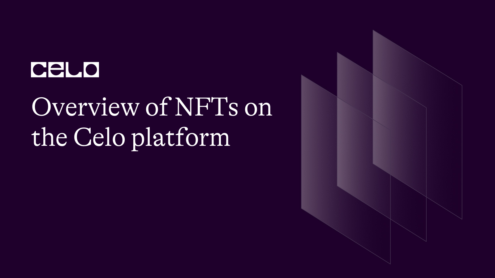

## Introduction

Over the past few years, we’ve seen NFTs become popular. At the peak of its popularity, we had NFTs like Bored Ape (#2087) selling for as high as 769 ETH (over $2 million). Another popular NFT that has sold for a high price is CryptoPunk (#7523), which sold for over $11 million to Israeli Millionaire Shalom Mackenzie. In March 2021, Mikel Winkelmann (Beeple) sold his digital art “Everydays: The First 5000 days” which is a digital collage of art he released every day for the past 5000 days since 2007. The NFT sold for $69.3 million to Vignesh Sundaresan (MetaKovan). In 2021, NFT was the most talked about trend gaining popularity among celebrities, influencers, popular athletes, and even crypto enthusiasts.  

## What are Non-Fungible Tokens and How do they work?

Non-fungible tokens are digital assets that have been converted into tokens using blockchain technology. Fungible tokens can be exchanged or traded for one another; cryptocurrency is a good example of this. Two NFTs might look much alike from the same NFT collection however they can’t be interchanged. As the name “non-fungible” implies, these tokens cannot be exchanged or traded due to their unique properties. NFTs have perceived values both based on the owner and market demand. NFts can be property rights, User IDs, digital collectibles, and more.

## How do NFTs work?

NFTs exist on the blockchain which is a distributed ledger technology. Transactions made on the blockchain are recorded on this ledger. NFTs are created by a process called “minting”, minting is done by converting a digital object which represents a real or virtual item. Some items that can be minted include music, art collections, GIFs, collectibles, images of wearables, videos, tickets, and more. Think about the digital form of a physical art collection, but in this case, instead of hanging the Monalisa painting on your wall, you have a digital file with unique and verifiable ownership on the blockchain. NFTs have unique data and can be transferred amongst owners, creators are able to store specific information like their signatures within them.

## Types of NFTs

Ethereum is currently the most popular blockchain being the highest by trading volume and transaction amount. We have the likes of Solana though far behind but slowly moving up, blockchains like Polygon are also starting to gain attention. Here are the types of NFTs being minted on the blockchain.

### Art NFTs

Artists have been experimenting with ways to make money using NFT since the mid-2010s when the idea was still relatively early and not popular. Art NFTs are unique digital artworks minted on the blockchain as NFTs. They’ve become quite popular amongst art creators being a way to sell their artworks without the need to go to an arthouse or auction house. Art NFTs since they are unique are the digital form of physical arts tokenized. Identity and ownership of Art NFTs can be verified on the blockchain.

### Collectible NFTs

Collectible NFTs have made NFTs very popular in the mainstream these past few years. Many celebrities, sport person, and fashion brands have created their own NFT collection as a way to reach a wider audience. A collectible NFT can be rare, limited, common, or unique digital items, such as virtual trading cards, artwork, or in-game items. Blockchain technology has made creating digital collections both easier and more wide-reaching. Collectibles have helped tackle some of the major issues that came with physical collectibles like wear & tear, lack of access, and long verification/authentication processes.

### Music NFTs

Music artists have complained in recent times about ownership and financial monetization of their work. Music NFTs make it possible for artists to sell their work directly to their fans and lovers of their work without the need for an intermediary, hence helping them retain the major profit. Music NFTs are unique digital files that represent music tracks, albums, or live performances. Artists are provided with a vast level of control over how their works are distributed and special packages they can include in their NFTs like tickets and a chance to meet the artist. With NFTs, it is possible for an artist to have multiple copies of music having multiple owners with control over theirs.

### Real Estate NFTs

Metaverse's popularity has made it possible to purchase properties in the form of real estate NFTs. Blockchain technology has made the tokenization of real-life assets like real estate property more secure and efficient. Real estate NFT can be useful for work environments, socializing, and also gaming assets. You can view it from two angles where one is turning a real-life property into NFTs so users can check out what they are buying by visiting the property virtually. This can involve transferring the rights of a property to another user after purchase, this NFT would carry metadata that is printed on the blockchain. The other viewing angle is buying a virtual asset on the metaverse, this is quite common on Sandbox and Decentraland.  

### Gaming NFTs

Gaming NFTs are unique virtual assets in a video game this can include characters, player skin, avatars, collectibles, weapons, and other in-game items. Gaming NFTs can vary in terms of rarity level with their prices strongly based upon their market demand. NFTs in gaming gives players full ownership and control of their gaming assets even outside the gaming environment.

### Sports NFTs

NFTs have become very popular in the sporting world; teams, leagues, players, and athletes are beginning to jump on the hype. Non-fungible tokens are a means to create unique digital collectibles sports fans can purchase, own and eventually sell if they wish. These collectibles can represent an iconic moment in that sport's history, a rare or customized jersey with a player's signature, or perhaps a ticket to a game. Both the NBA and NFL have been embracing NFTs more by creating digital experiences for fans.

### Utility NFTs

Utility NFTs are tokens that have use cases beyond just buying and selling, they can be used for diverse purposes like gaining access to a product, service, or event. NFTs can be used as digital ID since their data is exclusive and verifiable on the blockchain. Other use cases of NFTs can include promo materials, governance, exclusive content, and more. NFTs are gaining massive popularity with new utilities popping up from different angles.

## Static VS Dynamic NFTs

With NFTs increasing popularity, the “Static Vs Dynamic” NFT question is also becoming more common. NFT basics dictate they are unique tokens created on a distributed ledger technology called blockchain, they are not interchangeable with other tokens, unlike cryptocurrencies. Static NFTs are completely immutable after minting while dynamic NFTs can be updated over time. The important thing to note while creating NFTs is their use case, if you’re creating a token with stats based on the real-time activities of an athlete you’ll be creating a dynamic NFT. If you’re going to create one that is perhaps a digital collection with fixed property, then a static NFT should be your choice.

### Dynamic NFTs

Dynamic NFTs (dNFTs) are created on blockchain networks to be both interactive and dynamic. Their dynamic nature generally allows a potentially higher value and level of uniqueness in NFTs. Dynamic NFTs can be programmed to change when certain triggers are met such as a change in location or ownership, they allow creators or artists to create unique evolving pieces of art. Decentraland offers virtual land assets with dynamic properties that owners can update. Dynamic NFTs find a useful application in gaming, digital collectibles, and also sports. Some benefits of dNFTs are great immersion, increased engagement, increased virality, more accurate data, better innovation, and greater loyalty.

### Static NFTs

Static NFTs are non-fungible tokens that are immutable after minting, they are used to represent digital assets that shouldn’t be changed or exchanged like digital IDs, artworks, or even collectibles. They are more secure, efficient, and compatible when compared to dNFT. Since static NFTs can’t be altered, they are less flexible than dNFTs. Static NFTs are the more common type of NFTs since their use cases are more all-encompassing. Use cases of static NFTs include ID verification, document storage, digital collectibles, and in-game assets. Both static and dynamic NFTs excel in their use cases; however, they both have drawbacks that you should be aware of before deciding to work with either. Security and flexibility play an important role in deciding which you’ll likely have to work with. If security is preferred, then you should choose static; however, if you’re looking for some flexibility, then dNFT is better.

## Where can I get NFTs?

NFTs can be minted, bought, and traded on marketplaces. There are currently dozens of NFT marketplaces where you can get NFTs. Opensea is currently the largest NFT marketplace where you can mint and buy art, collectibles, domain names, music, photography, sports, trading cards, utility, and the metaverse. Some other top marketplaces you can get NFTs are Larva labs, NBA Top Shots, LooksRare, Rarible, SuperRare, Foundation, Nifty gateway, and Mintable. If you’re a music artist looking for a marketplace where you can mint and sell music NFTs; then you should use music NFT marketplaces like Opensea, Audius, Zora, MIntable, Rarible, and sound.xyz. Certain NFT marketplaces are blockchain dominate, for example, if you’re looking for an Ethereum NFT marketplace then you should use Opensea, Blur, LooksRare, Decentraland, or Sandbox. If you prefer Solana and would prefer a blockchain with a low mint price and gas fee then you can try Magic Eden, SolanaArt, DigitalEyes Market, Solsea, and Solana Monkey Business. There are also BNB, Polygon, Tron, and Celo NFT marketplaces to mention a few.

## The Celo Network and NFTs

Celo blockchain is a global payment provider with mobile users as the main target. Celo’s main goal is to make financial transactions available all around the world with just your phone number. Aside from being a payment platform, their blockchain also supports dApps. The Celo blockchain network has two native tokens: the Celo token, which can be held or used for voting on changes in the network, and the cUSD token, a stablecoin that mirrors the US dollar. The Celo network supports NFT minting, buying, and selling on their marketplace which is CO2-free. NFT marketplaces on the Celo blockchain are Cyberbox, Plastiks, Mintdropz, Ariswap, and Tatum.

### Cyberbox

Imagine Product Hunt and Kickstarter as a single web-based platform this is what Cyberbox is. Cyberbox is Regenerative Finance (ReFi), a marketplace built around using crypto to solve climate issues. Collections added to Cyberbox offsets carbon by about 0.5% for each transaction. Cyberbox allows users to raise an idea in the form of NFT on the Celo network, generate feedback on this idea, raise funds to implement, and then build a DAO community to scale.

### Plastiks

Plastiks is an NFT marketplace that connects individuals around the world to fight global pollution by collecting NFTs of waste plastics. Creating NFTs that show waste plastic that is not degradable but can be recycled is a possibility on the Celo network. You just upload the picture or plastic recovery data and someone buys it to clean it. This platform uses Plastic Recovery Guarantee to ensure that the plastic has been recovered someplace in the world.

### Mintdropz

Mintdropz is a decentralized social media platform that allows creators to build, grow and monetize their fanbase. On Mintdropz, creators can monetize their fanbase with subscriptions, NFTs, and crypto. Aside from the Celo blockchain, you get to launch your NFT smart contract mint page on other blockchains like Ethereum, Polygon, Solana, Cardano, Algorand, Near protocol, Avalanche, and Binance.

### Ariswap

Ariswap is an NFT marketplace built on the Celo network. You can discover, sell and collect unique art pieces on this marketplace. Ariswap allows artists to create collections and upload their works which can be video, image, audio, or 3D art. You can choose to make them static NFTs or dynamic ones with stats, properties, and unlockables.

### Tatum

Tatum allows users to mint NFTs at express speed on multiple blockchains including Celo. This is made possible using their API key, with Tatum express feature you can mint unlimited NFT at instant speed. Gas fees are deducted from your monthly payment plan on their platform.  

## Conclusion

NFTs will continue to see more adoption and even greater use cases. For now, PFP NFTs like Bored Ape and CryptoPunk get a massive shine. Artists like Beeple continue to show other artists how profitable selling their art as NFTs can be. Music, Sport, and more utility NFTs will likely increase in the near future. Celo blockchain network already hosts multiple unique marketplaces where crowdfunding and project support through NFTs are possible.

## About the Author

Fadipe Temitope is a blockchain content writer who likes to learn about new blockchain technology. He’s a content writer with over 5 years of experience writing about technology. When he is not writing, he spends most of his time reading and spending time with his family.
