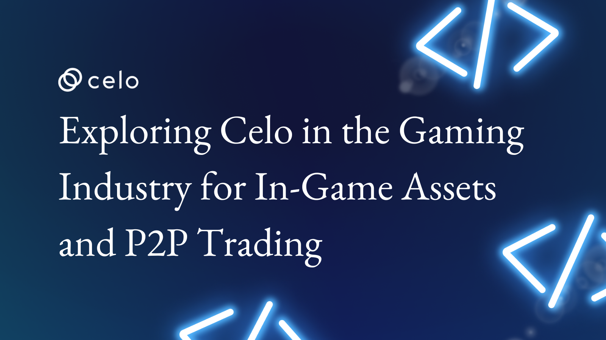

## Introduction

Welcome to our tutorial on exploring the use of Celo in the gaming industry for in-game assets and peer-to-peer (P2P) trading! The gaming industry is turning to blockchain technology to revolutionize how in-game purchases and P2P trading are handled. By tokenizing in-game assets and storing them on a secure, decentralized ledger, players can easily buy, sell, and trade them, creating new revenue streams for game developers. In addition, blockchain technology enables P2P trading, allowing players to directly trade assets and items with one another without the need for a central intermediary. This tutorial will provide a case study and discussion on the use of Celo in the gaming industry and how it is driving innovation and new opportunities in the space. Whether you are a gamer or a developer, this tutorial will provide valuable insights into the intersection of blockchain and the gaming industry.

## Prerequisites

Before continuing with this tutorial, it is important to understand blockchain technology, cryptocurrencies, and the gaming industry. It is advised that readers have at least a basic familiarity with these subjects before we get into the intricacies of employing Celo in the gaming industry.

## Requirements

As we dive into the specifics of using Celo in the gaming industry, it is essential to have an understanding of P2P trading and in-game asset management. Particularly, developers should find the Celo Developer Documentation to be a useful resource, as it provides detailed information on the Celo platform and how to use it in a development context.

## Celo and its suitability for the gaming industry

Blockchain technology has been disrupting various industries recently, including the gaming industry. The gaming industry has traditionally been a fertile ground for innovation and new technologies, and one of the ways in which blockchain technology is revolutionizing the gaming industry is through the tokenization of in-game assets and the implementation of P2P trading. The gaming industry has traditionally relied on centralized systems to manage in-game assets and P2P trading. However, these centralized systems often suffer from security issues, lack of transparency, and the extent to which players can fully own and control their assets. The Celo Blockchain technology solves these problems by enabling the tokenization of assets, which means converting them into digital tokens that can be stored on a secure, decentralized ledger.

Celo is a blockchain platform, designed to enable a new universe of financial solutions accessible, including the transfer of assets and value. Its features make it an ideal platform for the gaming industry, and many game developers are exploring ways to integrate Celo into their games. Celo is particularly well-suited for this use case, thanks to its mobile-first approach, and solid infrastructure for stablecoins, digital assets, and smart contracts. By building on Celo's blockchain, game developers can create digital in-game assets, such as weapons, armor, skins, and other in-game items, that can be bought, sold, and traded P2P on a secure and decentralized ledger. This opens up new revenue streams for game developers and allows players to truly own their in-game assets, rather than simply renting them from the game developer.

One of the key features, why game developers should explore ways to integrate Celo into their games, is because of its focus on mobile accessibility. Celo has a mobile-first approach, which means that it is designed to be used on mobile devices as well as desktop computers. This is important because mobile devices are often the primary way that people in developed and emerging markets play games, and these markets are a key focus for Celo. Other key features such as security, transparency, and decentralization allow developers to offer a more secure payment option for in-game purchases, as payments are executed through the Celo blockchain, which is immutable and tamper-proof. Transactions are also transparent, making it easier to track and manage in-game currency which ensures fair gameplay.

In the next section, we will explore a case study of METACELO, a game that utilizes Celo for in-game assets and P2P trading.

## MetaCelo as a case study

MetaCelo is the first play-to-earn metaverse NFT game built on the Celo Network, where players become monster trainers and experience their adventures in an open-world role-playing blockchain game. With its vintage design and nostalgic feeling, MetaCelo was founded to create a place for players to mingle and connect while exploring the cryptocurrency metaverse, inspired by childhood dreams of playing Pokemon on the Game Boy Advance portable game device. The goal of MetaCelo is to establish a metaverse that connects individuals in the DeFi sector, assists them in earning money via game features, and simplifies DeFi by utilizing their dapp as a one-stop-shop for all DeFi platforms.

MetaCelo has used Celo in various ways to offer a unique gaming experience for its players and is a prime example of how Celo can be used in the gaming industry for in-game assets and P2P trading. MetaCelo is integrated with two main features. DeFi features and Game features.

The DeFi features in MetaCelo, such as DEX, farming/staking, NFT, and launchpad, are all powered by Celo, allowing for easy and secure in-game asset tokenization and trading. Players can use the two biggest decentralized exchanges on the Celo Network, SushiSwap, and cLASwap, to directly purchase $cMETA, the in-game currency, without the need for intermediaries.

In addition to DeFi features, MetaCelo also has in-game features such as store, flea market, monster release, PvE, PvP, and items. Players can earn $cMETA by becoming monster trainers and progressing through the game. $cMETA can then be traded on the aforementioned decentralized exchanges, SushiSwap, and cLASwap, or through the flea market, allowing for P2P trading of in-game assets. This means that players can trade directly with each other without the need for a central intermediary, eliminating the risk of scams or loss of assets during the trading process.

Furthermore, MetaCelo allows for NFT minting and trading, adding another layer to the in-game asset ecosystem. Players can mint NFTs from other projects building on Celo Network and trade them with other players. The launchpad feature also assists players in discovering new and potential projects and investing in them, creating more opportunities for revenue streams for game developers.

MetaCelo showcases the potential of using Celo in the gaming industry for in-game assets and P2P trading. The integration of DeFi features, in-game features, and NFT minting and trading all powered by Celo provides a secure and efficient ecosystem for players and developers alike.

## Conclusion

In conclusion, Celo has significant potential in the gaming industry, providing game developers with a unique opportunity to revolutionize in-game asset management and P2P trading. The benefits of these features, such as increased transparency, ownership, and liquidity, can significantly improve the gaming experience for players and create new revenue streams for game developers. The MetaCelo game case study is a great example of how Celo can be used to offer a unique gaming experience to players. It has used Celo to integrate DeFi features and game features, allowing for easy and secure in-game asset tokenization and trading.
Whether you are a gamer or a game developer, Celo provides valuable insights into the intersection of blockchain technology and the gaming industry.

## Next Steps

If you are interested in exploring Celo's potential in the gaming industry, there are several important next steps to consider. These include further education on how Celo functions, gaining an understanding of the various token standards that can be utilized for in-game asset tokenization, becoming familiar with smart contracts and how they are implemented, and experimenting with P2P trading on Celo's Dex. It is important to explore opportunities for integrating Celo into existing or future gaming projects to fully take advantage of its benefits.

## About the Author

Oluwalana is a writer and a firm believer in fostering strong relationships to achieve impactful results. As an analog-by-birth and digital-by-nature individual, Oluwalana leverages his unique perspective to craft compelling stories and thought-provoking content.

## References

- <https://docs.celo.org/general>
- <https://metacelo.io/>
- <https://www.accesswire.com/689027/MetaCelo--The-New-Star-in-Celo-Ecosystem>
- <https://docs.metacelo.io/>
- <https://docs.metacelo.io/tokenomics>
- <https://docs.celolaunch.io/ecosystem/amm>
- <https://docs.celo.org/tutorials>
