## Introduction​

In this tutorial, we will brush up on the advantages of being a UI/UX designer to get you gingered up, all the way to covering wireframes by recreating the wireframe of celo.org's homepage using Figma. We will also find tools necessary for your UI/UX career and create a learning plan that you can follow to ensure that you don’t miss any important knowledge or get lost in a sea of contradictory material and sources.
If you are interested in the field and would like to develop a Celo decentralized app in the future, this guide will help you on your UI/UX road.

## Prerequisites​

This tutorial is targeted at junior UI/UX designers and will require no prior knowledge, just your keen interest.
Although designing a wireframe for a website may seem like a very sophisticated task, it is a very straightforward idea. Your sole objective with a wireframe is to visually map out the site's navigation and functionalities.
Being a skilled web designer is not necessary to create a wireframe with Figma (though that would certainly help). Instead, it's about being able to combine shapes and text using Figma's tools in a way that faithfully reflects the website you're picturing.

## Requirements​

✅ In this tutorial, we'll need a screenshot of the page for which the wireframe is being recreated.

✅ I am using Celo.org's homepage for this tutorial. Feel free to use any app to follow along.

## Let's jump right into

There are numerous professions in the technology business. So, why should you pick a UX/UI designer out of all of them? This question has various answers for me. Let's look at the primary motivations for becoming a UX/UI designer.

✅No programming knowledge is required.
Although understanding how the product works are beneficial for working as a UX/UI designer, deep programming abilities are not required. This can be a tremendous relief for those of you who are afraid of or don't want to learn a programming language.

✅High Income.

Whether UX/UI designers work from home or in an office, they earn a good living. The average annual wage in the United States is $85,000. This is without taking into account work experience or location. Of course, if you choose to work in California, your pay will be considerably higher.
It all depends on the setting and the firm. However, the average wage for a UX/UI designer is relatively high. Some organizations provide skilled workers with salaries of up to $500,000 per year without benefits.

✅Travel and work.

UX/UI designers frequently travel to different countries. This is not related to organizational changes. Companies, on the other hand, recognize that as a creative person, you require inspiration for your ideas. And for this, there is the option of working from any region in the world where this organization has an office by offering relocation chances. Furthermore, some businesses allow employees to work from home.

✅You'll gain more than just design knowledge.

You'll learn a lot of new abilities as you go through this procedure. These abilities include **Communication**. Most designers work as part of a team, so you'll likely interact with a variety of people, including engineers, marketing professionals, and other designers. You'll need to learn how to collaborate, share ideas, and communicate effectively.

**_After reading these facts, I hope that everyone will choose their favorite to become a UX/UI designer. I've only highlighted the most important ones, but there are plenty more reasons to start studying the UX/UI designer career right now._**

## Let's create Wireframes.

UX is an abbreviation for "user experience," and UI is an abbreviation for "user interface." They are frequently grouped because they are two closely related professions that frequently collaborate.

Now, a wireframe is a diagram or a set of diagrams that consists of simple lines and shapes representing the skeleton of a website or an application's user interface (UI) and core functionality. Get a more in-depth explanation of what UX wireframes are, what they look like, and how they can benefit your team. Before writing any code, whether a developer is writing it or you, the designer needs to know where all the information will go on the screen in simple black-and-white diagrams. Through the placement of buttons and menus on the diagrams, wireframing is a great way to learn how a user interacts with your interface.
To provide a clear visual picture of page structure, layout, information architecture, user flow, functionality, and expected behaviors, UX designers and web designers utilize wireframes. Before the interface is coded out, wireframes are provided to stakeholders, including designers, developers, researchers, and investors, to get their approval on concepts.
While you have your screenshot of the app you want to create a wireframe for, let's get to work.

**Step 1 Go to figma.com and select "New design file."**
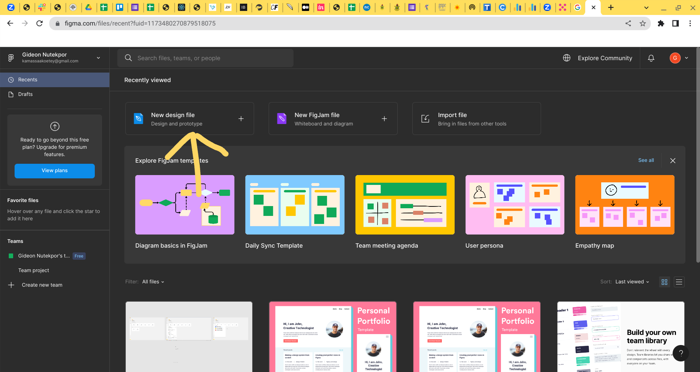

**Step 2 Let's give this page a title.**
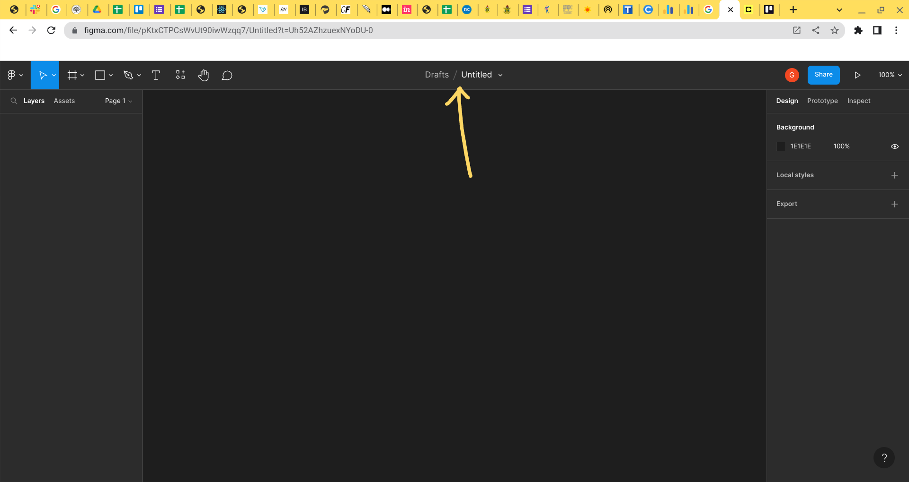

**_I named mine "Celo Wireframe" and hit return to save the title._**
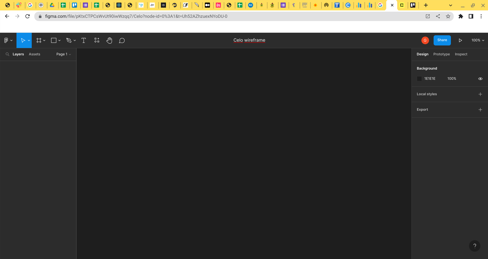

**Step 3 Now let’s drag the screenshot that we have to the canvas and release it.**
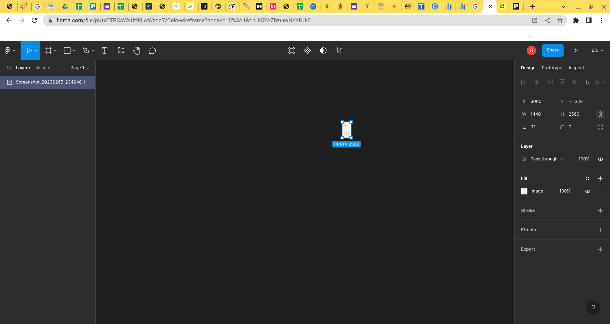

**_The screenshot we dragged to the canvas might turn out very large or very small, so please zoom in or out accordingly. (Ctrl plus + or -)_**

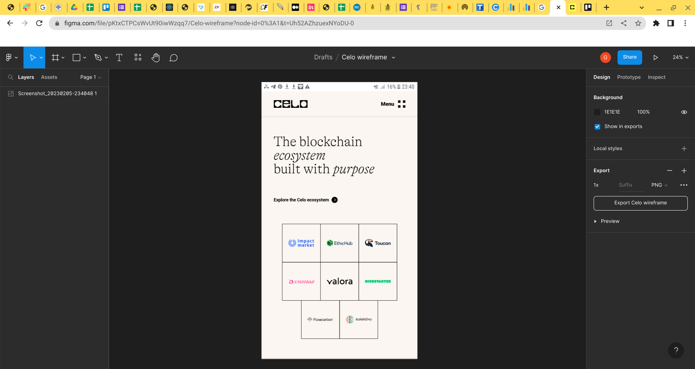

**Step 4 Let’s rename the screenshot we just added to our canvas on the left-hand side underneath the layers.**
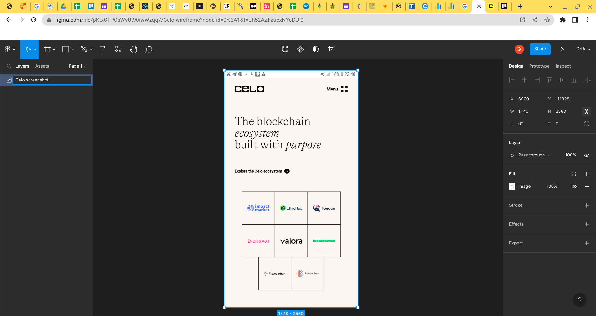

**_I named mine "Celo screenshot"_**

**Step 5** On the left-hand side, underneath the layers, are all the items that we have added to our canvas. And on the right side, we have everything we need to make changes to our layers.
And on top of that, we have everything that is needed to add a component.
**Let's add a frame (simply press f) with the same width and height coordinates as the Celo screenshot.**
W = 1440 and H = 2560 in my case.
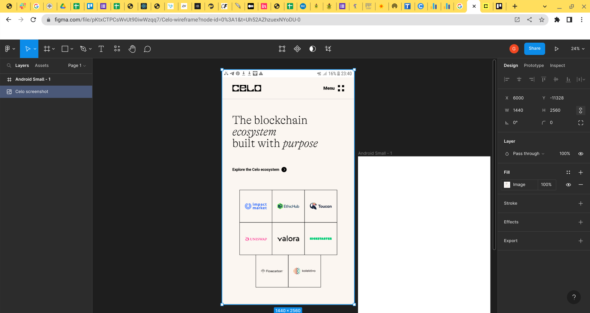

_Creating a frame is like taking out a piece of paper to draw on it. We don't want to draw directly on our table or desk, which is why we want a paper_

**Step 6 Let's place the frame right beside the screenshot, and make sure to adjust the size of the screenshot to match the size of the frame (make sure to press shift on your keyboard to maintain the ratio while adjusting the size of your image).**
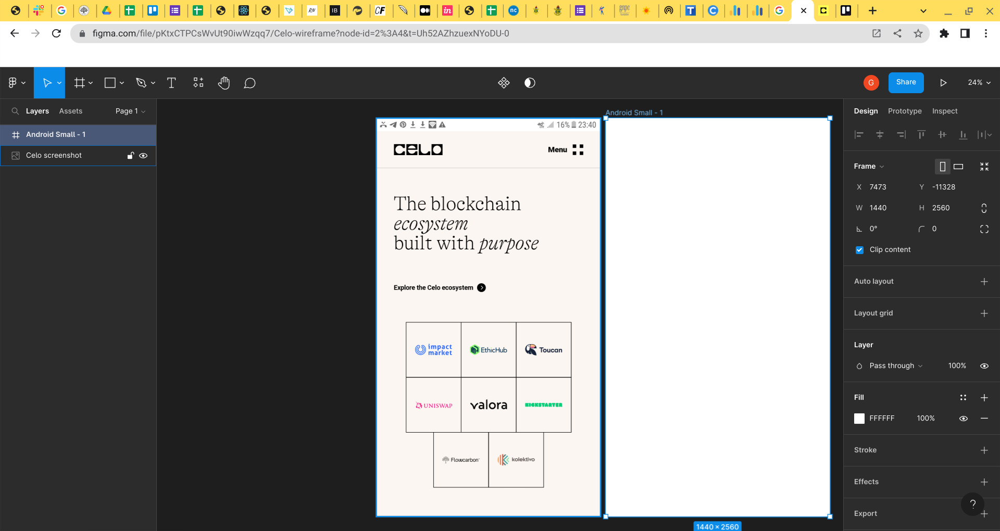

**_I renamed the frame we just created "Wireframe."_**

**Step 7** Now let's recreate the wireframe of this screenshot.
There are only two things you need to know if you want to create a wireframe:
The first is how to use text, which is the t icon, and the second is how to use a rectangle, which is the square icon.

**Let's start by adding a rectangle to the page to represent the most obvious components.**
If the size doesn't look right, you can always adjust any of the edges or angles.
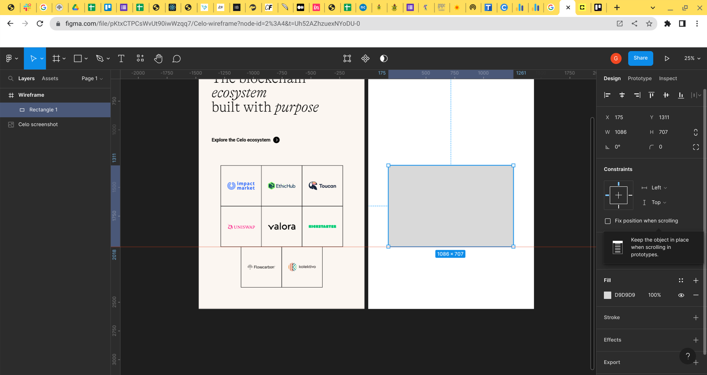

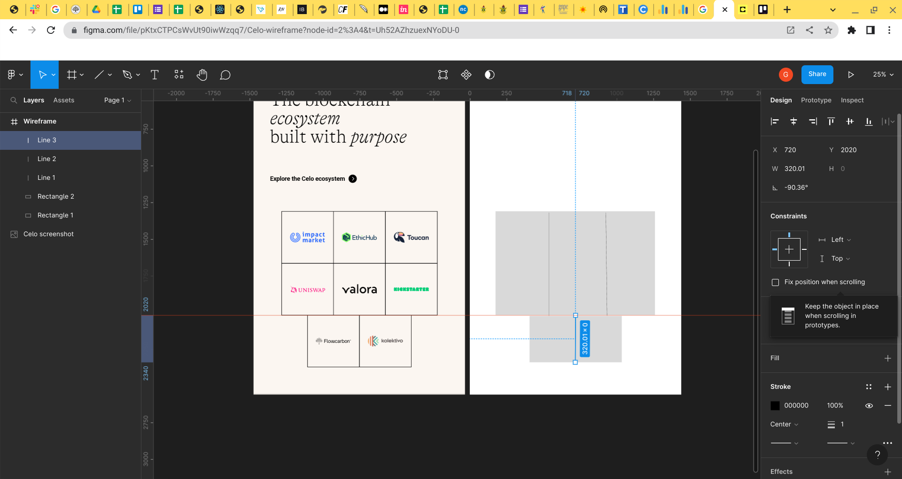

_Don't mind the spacings when wireframing._

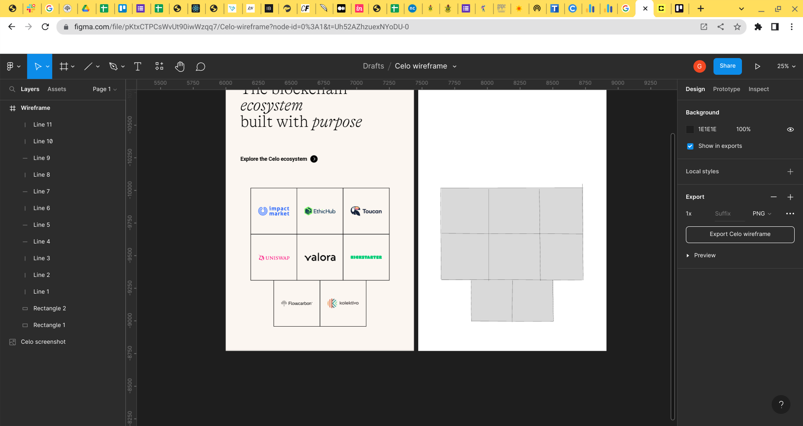

_Please take your time to represent everything on the screenshot that is not text with a rectangle._

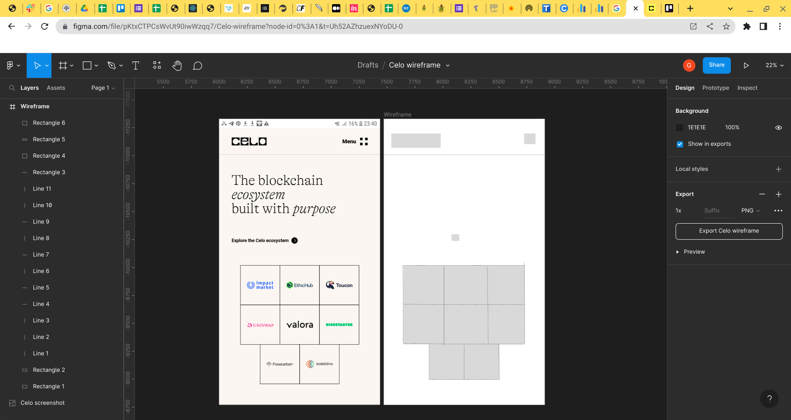

_Here, we already have everything on the page, just not the texts._

**Let's put the text that we need into our wireframe. Click the "t" icon on the top or simply hit "t" on your keyboard, then let's copy the text from our screenshot to our wireframe.**
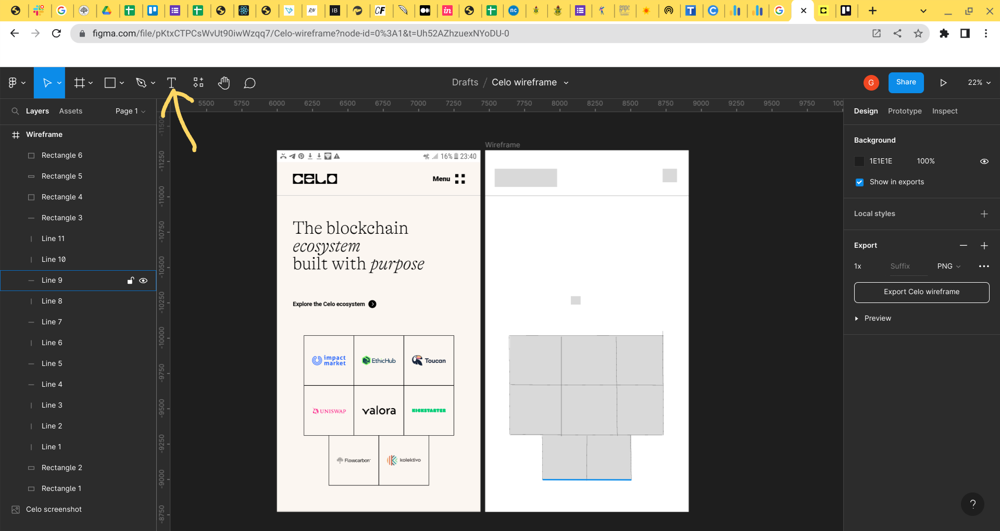

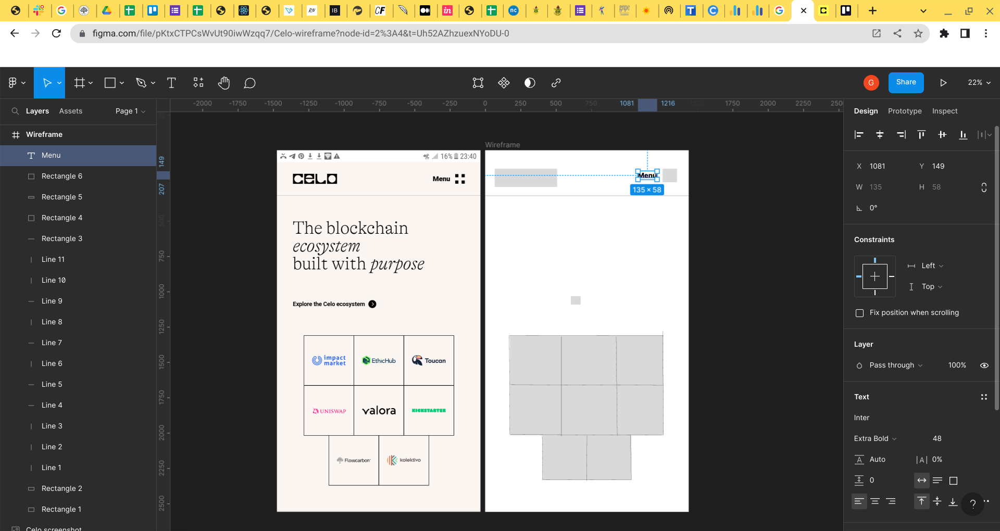

On the right-hand side, we can adjust the details of our text, such as changing the regular font to a medium font.
The idea is to make it look the same as the screenshot.
Worry less if you don't get the exact font style that was used in the screenshots; just a similar one is okay.

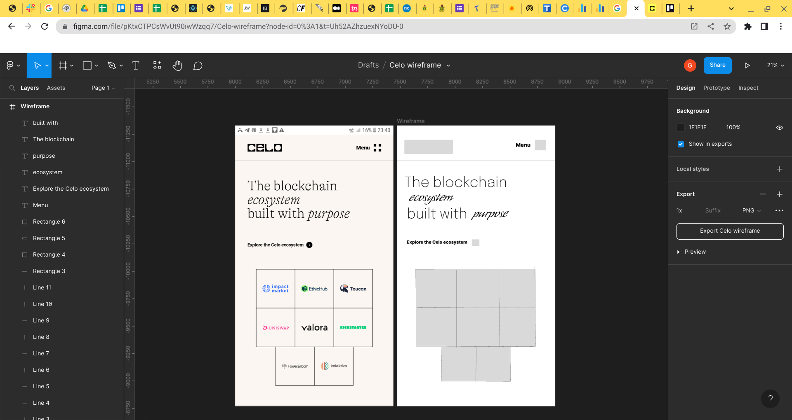

**Congratulations! You created your first wireframe.**

**Link to Figma Document.**
[link](https://www.figma.com/file/pKtxCTPCsWvUt90iwWzqq7/Celo-wireframe?node-id=0%3A1&t=hiYrbYEyhKq8CIdv-1)

## Conclusion

We were able to create wireframes and understand the concept of wireframes.
If you've made it this far, congratulations! You've learned a lot and will thrive in Web 3.

## Next Steps

**Get Inspiration:** Understanding the most recent trends and being able to differentiate between various design solutions are two of the most crucial skills for becoming a great designer. Everywhere you look, including in stores, on public transportation, and of course, online, you can find design solutions. You can find inspiration for developing original solutions or enhancing current ones by browsing the case studies and works shared by numerous designers from around the world. Behance.com is a great start to getting inspiration.

**Copy designs you love:** Just pick random websites or pages and create wireframes for them. Even if you don’t think much of them, advancements like this can inspire you more and help you succeed in your career.

**Join UI/UX design communities:** Feedback is an essential component of growth and development for all designers, novice and experienced alike. Initially, when creating a piece of work, you might be unsure of the choice of the solution, and you might spend a lot of time redoing or editing any part of the work with no apparent benefit.

**Join communities on LinkedIn, share your design work, and don’t be afraid to ask for professionals' opinions.**

**Most Importantly,** Practice: Although I can tell you have enough theoretical knowledge, theory only gets you so far toward your objective. Please keep in mind your passions and sources of inspiration as we begin to produce quality work. Adobe XD, UxPin, and Figma should be your best friends.

After the initial wireframe is created, it’s usually presented to users to gain feedback. Then, designers can make the next iteration of the product’s design, another wireframe, a prototype, or a mockup.

Continue your education by learning more about Microcopy.

**What exactly is UX Microcopy?**

UX microcopy is the little words and sentences you come across on the internet, on a website, in an app, or on a product.
It could be the tiniest error message or the navigation on a pop-up. It could be captions, buttons, loading, or error pages. Even that one message that tells you the website is using cookies
That would be the formal definition of a UX microcopy. But what makes a good microcopy what it is is its power to encourage the users, gain their trust, and empower them. A good microcopy makes a difference and has a big impact.

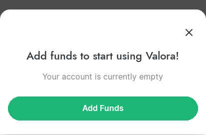

**_An example of a good microcopy_**

[link](https://dailyuxwriting.com/random-microcopy-prompt)
You might find the above website useful.

## About the Author​

Gideon Nutekpor Yaw

[Github](https://github.com/GideonNut)

[Linkdln](https://www.linkedin.com/in/gideon-nutekpor-739156256)
