import YouTube from '@components/YouTube';

# 9 Sustainable DeFi Projects Built on Celo

_Creating the world’s first carbon-neutral blockchain was just the beginning._

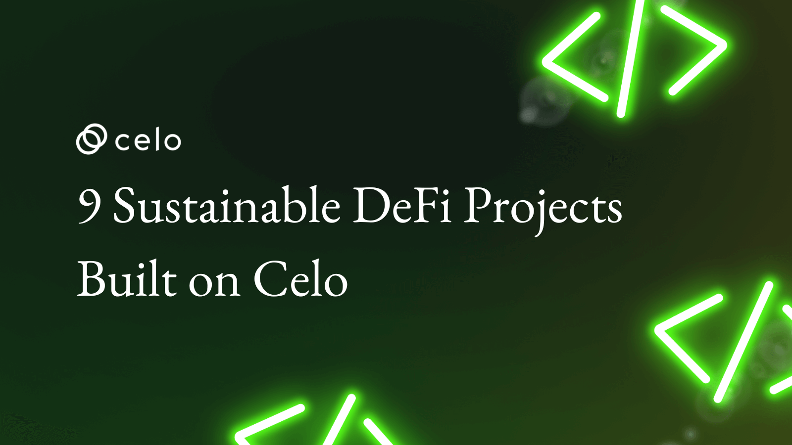

## Hello Developers 🌱

Welcome to today’s post, where we’ll break down a blockchain topic into bite-sized pieces to help you learn and apply your new skills in the real world.

Today’s topic is Sustainable DeFi projects on Celo.

**Here’s an overview of what we’ll cover 🗒**

- ✅ Introduction to Celo
- ✅ Valora
- ✅ ImpactMarket
- ✅ Ubeswap
- ✅ GoodGhosting
- ✅ Corsali
- ✅ Poof.cash
- ✅ Kotani Pay
- ✅ ReSource
- ✅ Socialstack

By the end of this post, you’ll be able to discuss some exciting sustainable DeFi projects built on Celo. Hopefully, this helps you come up with a few ideas for things you’d like to build on Celo in the future.

Let’s go! 🚀

## Introduction to Celo

[Celo](https://celo.org/) is a mobile-first blockchain that makes decentralized financial (DeFi) tools and services accessible to anyone with a mobile phone. It aims to break down barriers by bringing the powerful benefits of DeFi to the users of the 6 billion smartphones in circulation today.

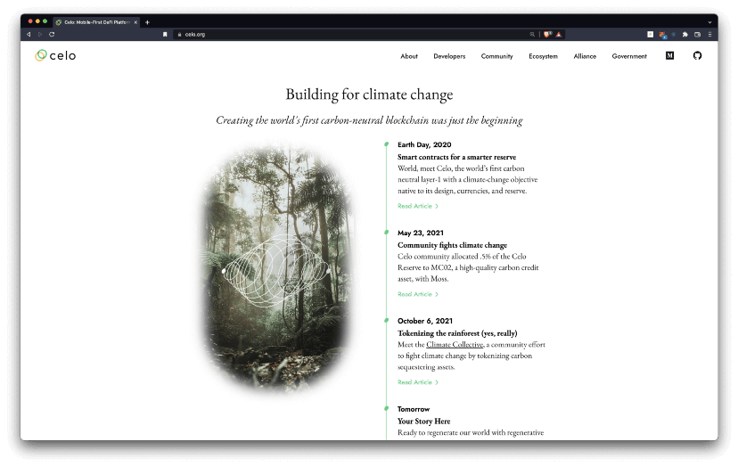

The company’s mission is to build a financial system that creates conditions of prosperity for everyone. Celo enables native and non-native digital assets–both cryptographic and Central Bank Digital Currencies (CBDCs)–to circulate freely across devices, carriers, and countries. It’s [carbon negative](https://medium.com/celoorg/a-carbon-negative-blockchain-its-here-and-it-s-celo-60228de36490), [mission-driven](https://medium.com/celoorg/50-mission-aligned-organizations-join-the-celo-alliance-for-prosperity-a3b32d15bc4c), and is leading the way toward developing [cryptocurrency for a beautiful planet](https://medium.com/celoorg/cryptocurrency-for-a-beautiful-planet-e47299dfb1c3).

Celo believes in a future where everyone has the opportunity to learn, build, and grow; and they focus on helping developers will lead the way into this exciting new world.

This post highlights 9 sustainable DeFi applications built on Celo.

## 1. Valora

[Valora](https://valoraapp.com/) is a new digital wallet that makes sending, saving, and spending digital money as easy as sending a text. Make payments, send internationally, or simply split the bill with a friend — no matter where they are in the world.

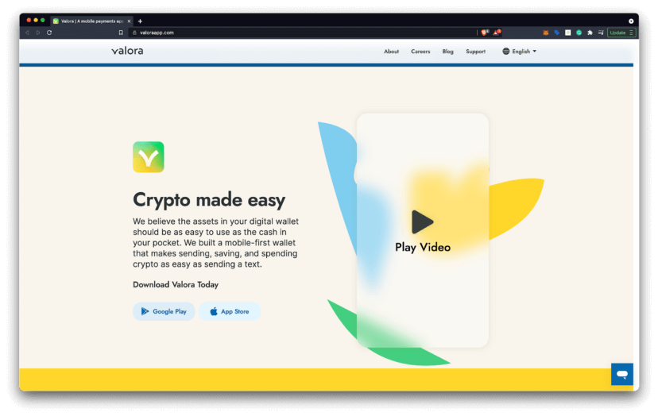

Valora is lowering the barrier to entry into crypto and DeFi. They believe in a world in which each individual has access to the wealth and opportunity created by this new global financial system, and Valora will strive to continue to provide greater access and build bridges to a better and more inclusive future.

## 2. ImpactMarket

[ImpactMarket](https://www.impactmarket.com/) is a decentralized poverty alleviation protocol that allows the creation and distribution of unconditional basic income between communities and their beneficiaries, according to their needs.

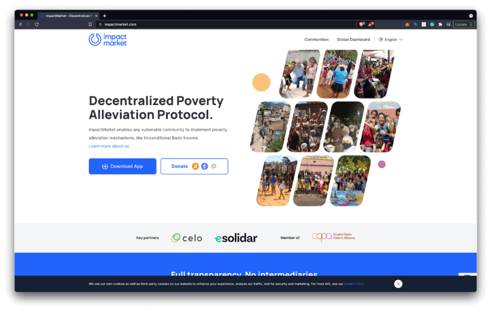

ImpactMarket enables any vulnerable community to create its own unconditional basic income system for its beneficiaries, where each one can claim a fixed amount on a regular basis and make payments for free.

## 3. Ubeswap

[Ubeswap](https://ubeswap.org/) is a decentralized exchange and automated market maker protocol for Celo assets. Ubeswap seeks to bring in liquidity from all of DeFi by harnessing the fast transaction times, high block gas limit, and stablecoin system of Celo.

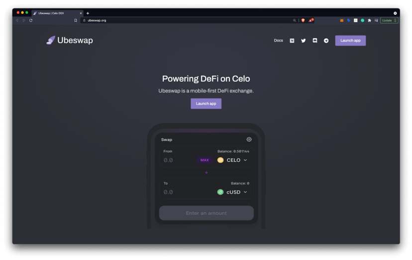

Ubeswap envisions a world where anyone can trade any asset from their phone or browser, without having to rely on decades-old clearinghouse technology or other centralized systems. This is only possible if people can invest in good assets.

## 4. GoodGhosting

[GoodGosting](https://www.goodghosting.com/) is a no-loss DeFi saving game. Users can compete with others to get higher interest rates than when they would save by themselves. We created a shared saving pool smart contract, which plugs into existing Celo DeFi projects (e.g. Moola) to generate interest for all winning players.

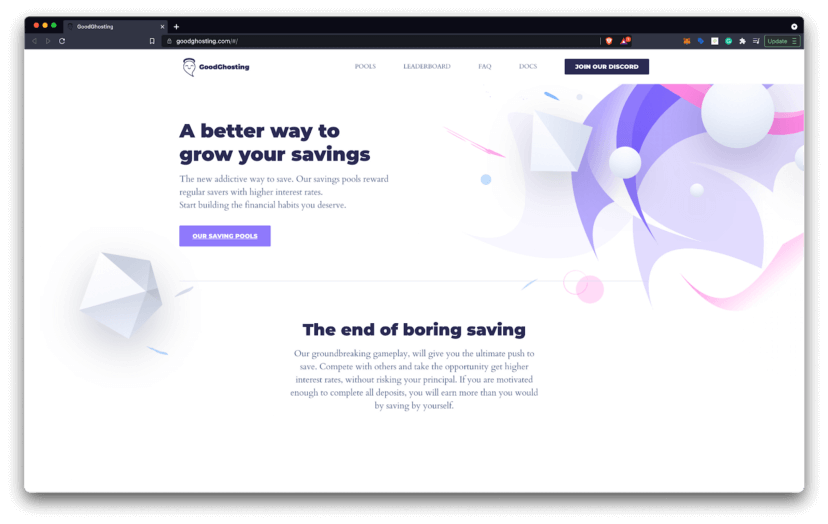

GoodGhosting aims to provide the infrastructure to customize your own goal-based saving games to play with your friends and family, as well as join games created by others. All with user safety, accessibility and decentralization in mind. Say hello to sexy saving, using the magic of DeFi and gamification!

## 5. Corsali

[Corsali](https://innovation.wfp.org/project/digital-microwork) can take any data you provide and build a custom machine learning model to analyze it instantly. Just describe the information you have and the information you want and they’ll provide a ready-to-use, optimized model, paired with an intuitive dashboard and secure API. Add a few lines of code to your application and tap into the power of your data.

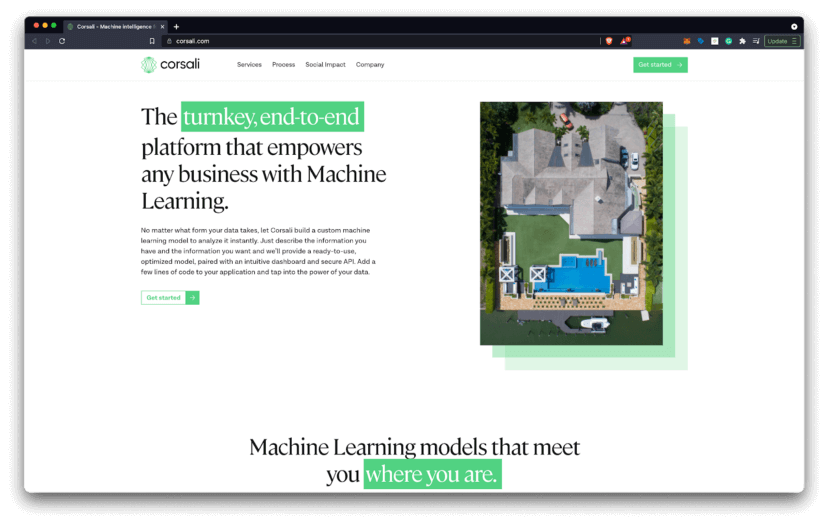

At the heart of Corsali is a global team of skilled workers. Their curated pros can complete nuanced knowledge work for virtually any industry, on an agile, flexible basis. With their support, the machine learning model APIs they create are more specific and focused on your specific use case.

## 6. Poof.cash

[Poof.cash](https://www.poof.cash/) is a decentralized protocol that keeps your financial data safe on CELO. It supports private transactions through mixing transfers in the fund pools. Play your cards close to your chest with Poof.

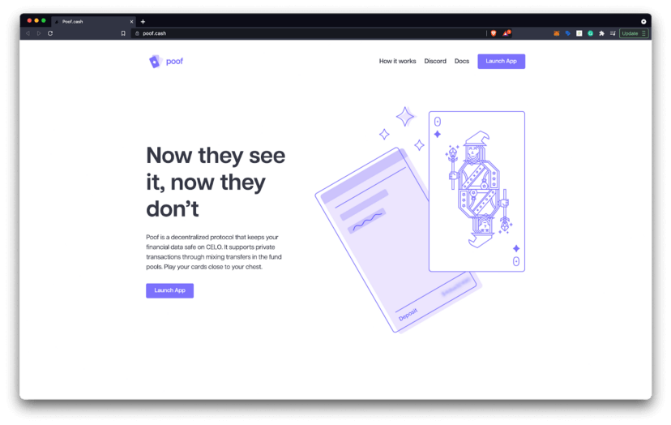

Because all transactions on the Celo blockchain are public, people can see what wallet address you paid with. Your wallet address can contain all sorts of sensitive information like your token balances and your entire transaction history. Poof.cash makes it possible to send money to any wallet without ever revealing the wallet address the funds originated from.

## 7. Kotani Pay

[Kotani Pay](https://kotanipay.com/) is Africa’s most reliable Blockchain on-ramp and off-ramp service. It’s is a technology stack that enables Blockchain protocols, dApps, and Blockchain FinTech companies to integrate seamlessly to local payment channels in Africa.

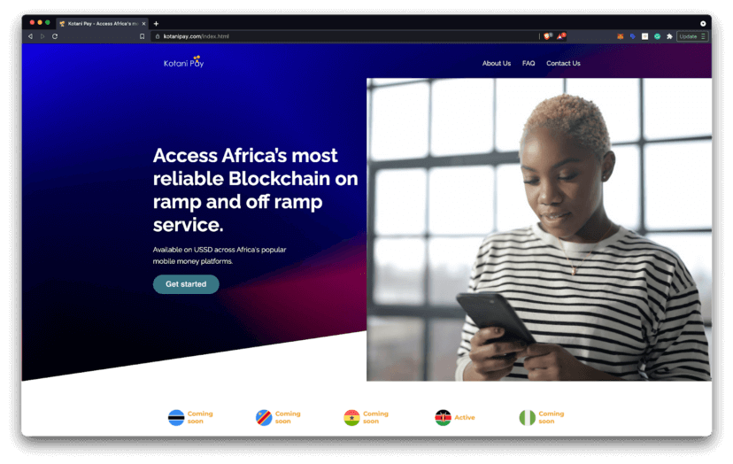

Kotani pay provides various APIs for lending and Decentralized Finance Protocols, APIs for work platforms — Gig work marketplaces, APIs for neobanks and wallets.

## 8. ReSource

[Resource](https://www.resourcenetwork.co/) serves the small businesses and freelancers that provide the backbone for the economy by providing them with fair credit and more customers. Everywhere people are seeking ways to sustain their lifestyles in ways that regenerate the earth, and create a respectful way of life for as many people as possible.

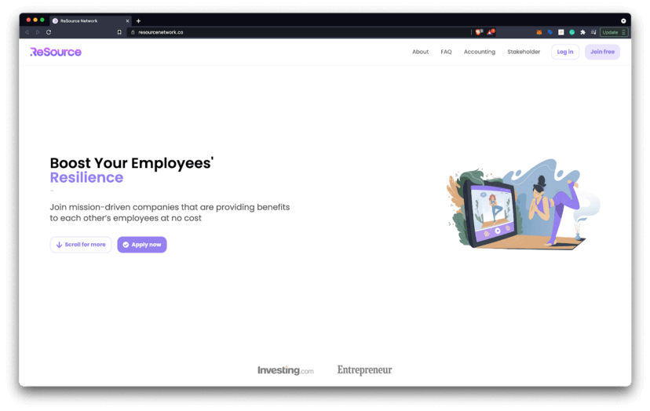

Resource chooses to honor the planet, the ecosystems that support us, and the relationships that nourish each other. Resource believes in the authentic economy, the economy that respects people who work for them, rather than see them as pawns in the profit maximization machines.

## 9. Socialstack

[Socialstack](https://www.socialstack.co/) is a platform for creators, brands, & communities to launch mission-driven social tokens. It’s a platform to mint and manage social tokens built for creators, community leaders, and changemakers on Ethereum and Celo.

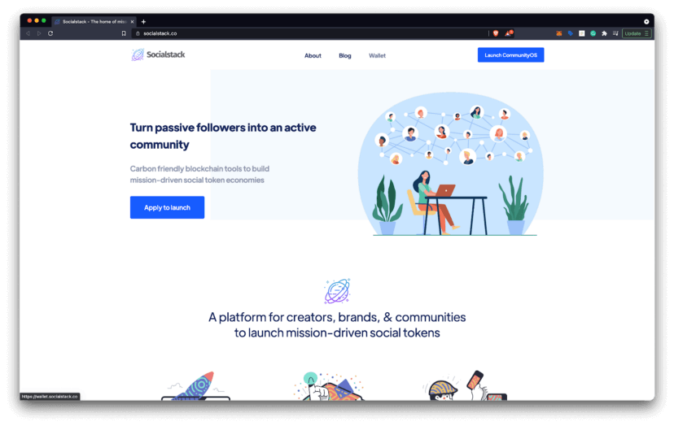

Socialstack believes social tokens should not create a world where people are traded like a stock. Social-driven economies should be founded upon gratitude, appreciation, and the co-creation of a brighter society, together.

## Creating Prosperity for All

The Celo community strives to use [beauty as its guide](https://celo.org/community#tenets), imagining a more prosperous and sustainable future for humanity and our planet. It has incorporated features throughout the technology stack to empower this dream such as Proof of Stake, the Carbon Offsetting Fund, and perhaps bounties and natural-backed currencies. cLabs hopes that this is just a starting off point that will inspire more brilliant ideas from the community.

While this post covered some of my favorite dApps built on Celo, there’s an entire community of developers building new applications every day. You can view the latest dApps at [Celohub](https://celohub.org/apps), chat with the community on [Discord](https://discord.com/invite/6yWMkgM), and learn more at [celo.org](https://celo.org/).

## Congratulations 🎉

That wraps up today’s topic on _Sustainable DeFi projects on Celo_. You can review each of the items we covered below and check that you’re ready to apply these new skills.

**Here’s a quick review of what we covered 🤔**

- ✅ Introduction to Celo
- ✅ Valora
- ✅ ImpactMarket
- ✅ Ubeswap
- ✅ GoodGhosting
- ✅ Corsali
- ✅ Poof.cash
- ✅ Kotani Pay
- ✅ ReSource
- ✅ Socialstack

Now you’re ready to go discuss some exciting _sustainable DeFi projects built on Celo_. Hopefully, you’ve also come up with a few ideas for things you’d like to build on Celo in the future.

GN! 👋
