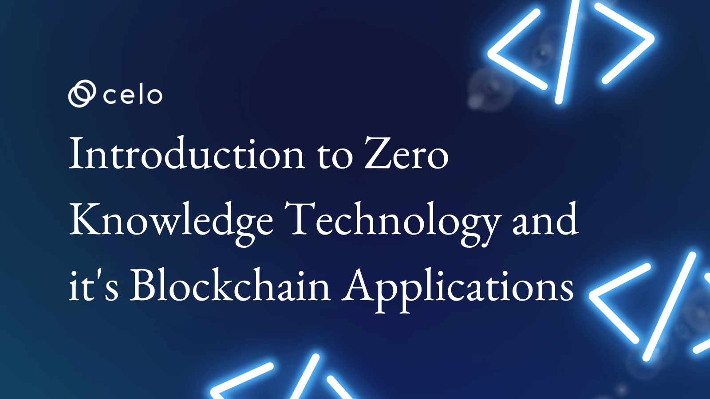

## Introduction

Zero-knowledge technology is a term used to describe a method of cryptography that allows for the sharing of information without revealing any details about the data being shared. This makes it possible for two people who have never met before to communicate securely, even if they don't know each other's identities.

The concept behind zero-knowledge technology was first developed by David Chaum in 1986 as "secret-sharing." He showed how secure communication could be achieved without giving away any information about the secret.

In 1999, Nick Szabo introduced the term "zero knowledge" (ZK) to describe this concept. ZK stands for "Zero-Knowledge," which means there is no requirement for both parties to know each other's identity or trust each other.

Zero-knowledge proofs have been used by some companies like Walmart and Visa (in their partnership with Chain) who want their customers' identities verified using these methods; however, there hasn't been much use beyond this area yet due largely because not everyone understands how zero-knowledge proof works yet!

## Zero-knowledge proofs will revolutionize the way we use blockchain technology.

Zero-knowledge proofs are a new way of providing privacy in distributed ledgers. The most important thing is that they prevent any kind of centralization in the system, so it’s not possible for someone to know what you bought or which transaction was valid at all. Everybody can be sure that the transaction you are paying for is the right one.

Zero-Knowledge Proofs have been implemented by many companies like Factom or Ciphrex who are currently working on rolling out their product line on top of Zero-Knowledge Protocols such as Zcash (ZEC). There is also an open-source project called TumbleBit which aims at making use of these technologies inside Bitcoin Core Wallet applications like Electrum or Bitcoin Core itself.

Many other projects use Zero-Knowledge Protocols for different purposes, such as Augur for Prediction Markets or Zcoin for anonymous transactions.

The reason why this technology is so important is that it allows people to transact privately while keeping the blockchain open and transparent. It also makes it possible for companies to build applications on top of Bitcoin without having any kind of centralized server or database that could be hacked or corrupted by someone with malicious intentions. This kind of privacy is something that has always been missing from Bitcoin and other cryptocurrencies in general, but now with these new protocols, we can finally say goodbye to all centralized third parties like banks who have control over your money.

## Zero-knowledge proofs are a new way of providing privacy in distributed ledgers

They're used to provide secure, private, and decentralized public key infrastructure (PKI).
Blockchains are often considered the most secure way to store data because they can be used without revealing personal information or identities. However, there is still a lot of debate over whether blockchains should be used for this purpose or not because they depend on third-party servers that have access to all their data records. 

ZKPs are an alternative solution that lets users keep their sensitive information private while still allowing them full control over their transactions and addresses by themselves without relying on these third parties services ZKPs are a type of public key cryptography that allows users to verify the authenticity of documents or data without revealing the contents. This is done by using zero-knowledge proofs to store information on a blockchain.

Zero-knowledge proofs use a method called “proving ownership of a secret" to verify that the user controls an input without revealing anything about that input. This works by using a cryptographic protocol to allow two parties (the prover and the verifier) to interact with each other in such a way that the verifier is convinced by the interaction alone of some fact about hidden information.

This technology is not only useful for keeping sensitive information private but also has a wide range of applications. For example, it can be used to prevent identity theft by ensuring that only authorized users have access to personal data. It can also be used in conjunction with other blockchain-based technologies such as smart contracts and distributed ledgers to create more secure systems for storing and transmitting sensitive data or valuable assets like money or property titles.

## The most important thing is to prevent any kind of centralization in the system.

Centralization of power is a bad thing because it can lead to excessive control and abuse by those who have it. It has many different forms:

- Centralized control over information by one person or group of people, who then use this information for their benefit (privacy risk)
- Centralized control over funds that are used for something other than what they were intended for (financial risk)
- Centralized control over resources needed for production or trade (economic risk).
- Centralized control over who can access the system and what they can do with it (security risk).

The key to preventing any of these types of centralization is to make everything as decentralized as possible.
That is why blockchains are so important. They provide a way for multiple parties to come together and transact with each other without having to trust each other or any third party.

## ZKPs can provide privacy and trust without requiring trust between entities

ZKPs can provide privacy and trust without requiring trust between entities. They use a cryptographic scheme where the sender and receiver of a message hash their input into an encrypted form, then use that result as an address for future messages. The receiver creates a new hash from this encrypted input, which he sends back to the sender who uses it as proof that they have received his message (and thus validated it). This scheme allows users to prove ownership without revealing what was being sent or received; it also provides better protection against double spending attacks than traditional digital signatures schemes because there are no private keys involved in calculating signatures on messages.

## Conclusion

The future of blockchain technology is bright and many new applications will be created using zero-knowledge proofs. The possibilities are endless, and we are just getting started.

## Next Steps

I hope you learned a lot from this tutorial. Here are some relevant links that would aid your learning further.

- <https://learn.0xparc.org/materials/circom/learning-group-1/intro-zkp/>
- <https://zkproof.org/2020/08/12/information-theoretic-proof-systems/>
- <https://medium.loopring.io/learning-cryptography-finite-fields-ced3574a53fe>

## About the author

I'm Jonathan Iheme, A full stack block-chain Developer from nigeria who is passionate about Zero-Knowledge Technology.

Thank You!!
