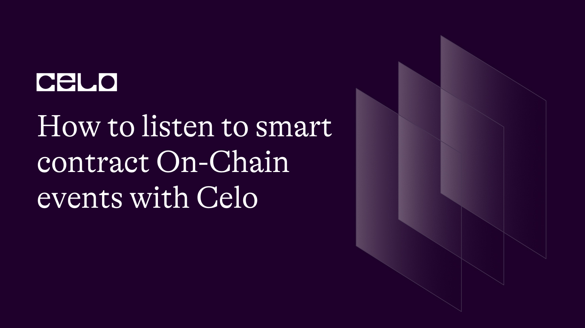

## Introduction​

Monitoring on-chain events is a critical component of creating DApps on the blockchain.
As a developer building on the Celo network, understanding how to listen to smart contract events is essential as it is redundantly needed while working as a web3 developer.

After completing this article, you will understand the concept behind listening to on-chain events using Graphs, you will be familiar with concepts like subgraphs, and other querying tools for reading live data off the blockchain. You will learn the different ways to access events with the right tools and techniques. As a developer, you will learn how to easily listen to and analyze on-chain events and make informed decisions about their dApp.

## Listening to on-chain events

On-chain events refer to the occurrence of specific activities within a blockchain network that can be monitored in real-time. A blockchain is a distributed ledger that maintains a continuously growing list of records, or blocks, that are secured using cryptographic techniques. These blocks contain information regarding various transactions, including the date, time, amount, and parties involved.
In simple terms, It’s like eavesdropping on a conversation to hear what’s being said. By Listening to on-chain events, you can keep up to date with what’s going on in the blockchain world.

By listening to on-chain events a user can observe the flow of information within the blockchain network and receive notifications as new blocks are added to the chain. This process is typically facilitated through the use is specialized software or API that enables developers and users to subscribe to a particular type of event. Examples of on-chain events include the creation of new blocks, the submission of transactions, or the completion of a smart contract. Monitoring on-chain events is an essential aspect of blockchain development and can be used to enable a wide range of use cases, including real-time notifications, analytics, and smart contract automation.

## Celo and Smart Contract Events

Celo is a blockchain platform that enables developers to build and deploy applications and services quickly and securely. It is also a platform for creating, executing, and monitoring smart contracts. With Celo, developers can take advantage of its smart contract events functionality to track and monitor events on the blockchain.

Celo provides developers with the ability to listen to events emitted by smart contracts. These events can be used to track changes in the blockchain state and trigger actions based on these changes. For example, a developer can use events to monitor when an account sends or receives funds, or when a transfer is executed.
Events can be used to monitor the status of a smart contract and its execution. By monitoring events, developers can gain insights into the behavior of their smart contracts and take action as needed.

## On-Chain Events and How They Work?

On-chain events communicate with the blockchain, allowing applications to be notified when certain predetermined conditions have been met. They are triggered by transactions and events on the blockchain, and they can be used to send notifications out to applications. By listening to on-chain events, applications can keep up with the latest blockchain state and respond accordingly.

When an application wants to listen to an on-chain event, it has to first register the event with the blockchain. This means that the application can specify what type of event it wants to listen for and what data it wants to receive when the event occurs.

Once the event has been registered, the application can then start listening for it.
When the event is triggered, the application will receive the data associated with it, allowing it to react accordingly. Celo provides tools to help developers listen to on-chain events. Celo's Celo Core provides an easy-to-use API that developers can use to register and listen to events. Celo Core also provides a flexible event system that can be used to create custom on-chain events. With Celo, developers can easily set up their applications to listen to on-chain events and react accordingly.

## Reading On-Chain Data

The process of reading on-chain data on the blockchain can be accomplished using either an API or direct access to the blockchain data. An API offers a convenient method to retrieve the information, as it provides access to the blockchain data through an endpoint that can be hosted on a public access to the blockchain data through an endpoint. This endpoint can be hosted on a public or private node.

With the data returned from the API, you can gain insight into specific accounts, transactions, and other on-chain data in the Celo blockchain.

The information can also be utilized for advanced analysis and the development of new applications on top of the celo blockchain.
In conclusion, reading on-chain data on the Celo blockchain is essential for developers and enthusiasts alike. With the ability to retrieve information through an API or direct access to  blockchain data, you can gain a deeper understanding of the network, its participants, and recorded transactions. Whether you’re using the information for analysis or application development this skill can help you maximize the potential of the Celo blockchain.

Here are a list of tools that make it easy to read on-chain data off the celo blockchain:

## The Celo API

[The Celo API](https://explorer.celo.org/mainnet/api-docs) provides access to the Celo blockchain data, allowing developers to retrieve information about accounts transactions, and other on-chain data.
Once you have access to the Celo API endpoint, you can use it to retrieve information from the Celo blockchain. For example, you can retrieve information about an account’s transaction list by sending a GET request to the following endpoint: `https://explorer.celo.org/mainnet/api?module=account&action=pendingtxlist&address={address}`
The Parameter should be replaced with the address of the account you want to retrieve information about. Here is a [link](https://explorer.celo.org/mainnet/api_docs) to get started with the Celo API.
You can also consider creating an API for your decentralized application for example to read on-chain events from the celo blockchain.

## The Graph

The Graph is an indexing and querying layer for blockchain networks like Ethereum and IPFS. In other words, the graph acts as a decentralized search engine for transactions that happen on the blockchain network. The graph makes data on the blockchain accessible by building and publishing public APIs known as subgraphs.

### What are Subgraphs

Subgraphs are decentralized networks of Ethereum-compatible nodes that are connected in a peer-to-peer fashion. Subgraphs allow developers to query data from the Ethereum blockchain efficiently and securely. This is useful for applications that require large amounts of data or that need to interact with smart contracts.

## Reading On-chain Data with the Graph

Two main features of the Graph allows you to query and read from a blockchain network:
**[The Graph Explorer](https://thegraph.com/explorer)**: The Graph Explorer is a visual explorer that allow users to explore the Ethereum blockchain and interact with smart contracts. It provides a UI for exploring and visualizing the relationships between accounts, transactions, smart contracts, and tokens.
It allows users to search and explore transactions, blocks, and accounts in the Ethereum network.
The explorer also provides a visual representation of the Ethereum network, enabling users to understand the data.

***[Subgraph Studio](https://thegraph.com/studio/)***: Subgraphs studio is an open API platform on the blockchain to allow developers to quickly build, test, and deploy subgraphs that query blockchain data, making it easier to create Dapps that interact with blockchain data.
Subgraph Studio provides tools for visualizing blockchain data, building queries, and customizing graphs. It also provides a GraphQL API that allows developers to create their custom queries.
Although both of these can be used to query on-chain data, the only difference is that Graph explorer has a user-friendly interface that has a list of queries you can select from to call data, While the subgraph studio

## Conclusion​

The process of Reading On-chain events from the Celo blockchain when creating Dapp is made quite easy for developers to explore with the available resources. Now you have the required knowledge and tools you need to get started with querying data on the Celo blockchain.

## About the Author​

Mayowa Julius Ogungbola

is a Software Engineer and Technical writer always open to working on new ideas. I enjoy working on [GitHub](https://github.com/Julius170/) and you could also find out what I tweet about and connect with me on [LinkedIn](https://www.linkedin.com/in/julius-ogungbola-a71810229/).

## References​

* [How to create an API](https://www.youtube.com/watch?v=GK4Pl-GmPHk&t=81s)
* [Building subgraphs with the Graph](https://www.youtube.com/watch?v=ct1UMSpZLgk&t=943s)
* [A guide to on-chain analysis and how it works](https://www.youtube.com/watch?v=tvW9VKJ58Lg)
* [How to deploy a subgraph for indexing smart contracts](https://www.youtube.com/watch?v=YvKIkJTDD9E)
