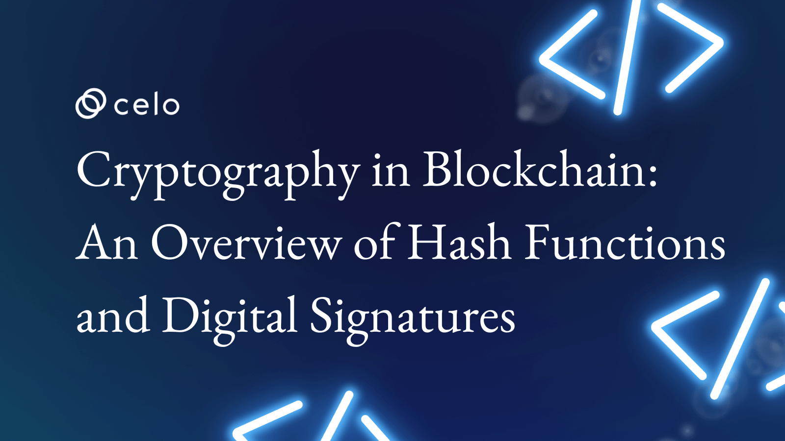

## Introduction

Cryptography plays a critical role in ensuring the security and privacy of data in the blockchain, the Distributed Ledger Technology (DLT) that has gained widespread adoption in recent years. This article overviews three critical cryptographic concepts essential to understanding how the blockchain works: hash functions, digital signatures, and zero-knowledge proofs.

## What is Blockchain and What is Its Importance in Modern Technology?

A blockchain is a distributed database consisting of interconnected data blocks. Each block contains a record of multiple transactions and gets linked to the previous block using a cryptographic hash function.

This creates a chain of blocks resistant to tampering and modification, making it an ideal platform for securely storing and transferring data.

One of the critical advantages of blockchains is their decentralized nature. Unlike traditional databases, which are controlled by a single entity, blockchains are maintained by a network of
participating nodes. This distributed structure makes them resistant to censorship and tampering, as no single point of failure can be exploited.

In addition, blockchains are transparent by design, meaning that all transactions are recorded and made available for anyone to view. This transparency helps build trust and accountability and can create more efficient and effective systems.

## Overview of Cryptography in Blockchain

Cryptography is a branch of mathematics that deals with the study of secure communication techniques. It plays a crucial role in ensuring the security and privacy of information
transmitted over the internet and is especially important in blockchain technology.

A blockchain is a decentralized, distributed database that maintains a continuously growing list of records called blocks. These blocks are linked and secured using cryptography, which
ensures that the data stored on the blockchain is secure, tamper-proof, and cannot be altered by any unauthorized party.

One of the vital cryptographic concepts used in blockchain technology is hash functions. A hash function is a mathematical algorithm that takes an input of any size and
produces a fixed-size output, known as a hash or a digest. The output of a hash function is unique, meaning that any change to the input will result in a completely different output. This
property makes hash functions ideal for use in blockchain technology, as they can be used to secure data and create a proof of work.

Digital signatures are another important cryptographic concept used in blockchain technology. A digital signature is an electronic signature that uses a private key to sign a message or document and a public key to verify the signature's authenticity. Digital signatures are used in blockchain technology to authenticate transactions and ensure that they are not tampered with.

Zero-knowledge proofs, also known as zk-SNARKs, are a type of cryptographic proof that allows one party (the prover) to prove to another party (the verifier) that they possess specific
knowledge without revealing the actual knowledge itself. This property makes zero-knowledge proofs particularly useful in blockchain technology, as they can be used to ensure privacy and scalability.

## Hash Functions

Hash functions are a fundamental concept in computer science and cryptography and play a crucial role in ensuring the security and integrity of data transmitted over the internet. Here is a mathematical algorithm that takes an input of any size and produces a fixed-size output, known as a hash or a digest. The output of a hash function is unique, meaning that any change to the input will result in a completely different output. This property makes hash functions ideal for various applications, including password hashing, data integrity checks, and cryptographic signing.

One of the critical properties of a hash function is that it is a one-way function, meaning that it is computationally infeasible to reverse the process and obtain the original input from the
hash value. This makes hash functions helpful in securing sensitive information, such as passwords. For example, when a user creates a new password, the password is passed through a hash function to produce a hash value, which is then stored in a database. When the user logs in, their password is passed through the same hash function, and the resulting hash value is compared to the one stored in the database. If the two hash values match, the user is authenticated.

Blockchain technology also uses Hash functions to secure data and create a proof of work. In a blockchain, transactions are grouped into blocks and added to the chain in a linear, chronological order. Each block contains a list of transactions and a hash of the previous block in the chain. This creates a link between the blocks and ensures that tampering with the data in a block will result in a completely different hash value. This makes it easy to detect tampering with the data, as the hash values will not match.

There are many hash functions, each with its properties and characteristics. Some examples of commonly used hash functions in blockchain technology include SHA-256 (Secure Hash Algorithm 256-bit) and Keccak (also known as SHA-3). These hash functions are designed to be computationally infeasible to reverse and are resistant to collision attacks, which are attempts to find two inputs that produce the same hash value.

## Examples of Hash Functions

- SHA-256 (Secure Hash Algorithm 256-bit)

This cryptographic hash function produces a fixed-size output (256 bits) from any input data. It is widely used in various applications, including validating transactions on the Bitcoin blockchain. The SHA-256 function takes an input of any size and produces a fixed-size output (256 bits) through a series of mathematical operations. The output is a "hash" or a "digest." The SHA-256 function is considered a secure hash function, as finding two different inputs that produce the same output (a collision) is complicated.

- Scrypt

This is a hash function that is designed to be resistant to specialized hardware attacks. Several different cryptocurrencies, including Litecoin and Dogecoin, use it. The Scrypt function is based on using a large amount of memory in the hashing process, making it more challenging to build specialized hardware (such as ASICs) that can perform the hashing process efficiently. This makes Scrypt-based cryptocurrencies more decentralized, as they are less susceptible to the influence of a small number of powerful miners.

- Ethash

This is a memory-hard hash function that is used by the Ethereum blockchain. It is designed to resist ASICs (Application Specific Integrated Circuits), specialized hardware devices used to mine specific cryptocurrencies. Ethash is a proof-of-work function, meaning miners must perform a certain amount of work (in this case, hashing) to validate transactions and add them to the blockchain. The Ethash function is designed to require a large amount of memory in the hashing process, which makes it more challenging to build ASICs that can perform the process efficiently. This helps to ensure a more decentralized mining process on the Ethereum network.

- X11

This is a combination of 11 different hash functions in a specific order. The Dash cryptocurrency uses it. The X11 function is designed to be resistant to hardware optimization, so it is challenging to build specialized hardware (such as ASICs) that can perform the hashing process efficiently. This makes X11-based cryptocurrencies more decentralized, as they are less susceptible to the influence of a small number of powerful miners.

- Crypto Night

This is a memory-bound hash function that is used by the Monero cryptocurrency. It is designed to resist ASICs, making it more difficult for specialized hardware to dominate the mining process. Like Ethash and X11, CryptoNight is designed to require a large amount of memory in the hashing process, which makes it more challenging to build ASICs that can perform the process efficiently. This helps to ensure a more decentralized mining process on the Monero network.

- Equihash

This is a proof-of-work hash function that is used by the Zcash cryptocurrency. It is based on the Generalized Birthday Problem, a mathematical concept used to analyze the probability of finding collisions in large data sets. The Equihash function is designed to be
resistant to hardware optimization, which makes it challenging to build specialized hardware (such as ASICs) that can perform the hashing process efficiently. This helps to ensure a more decentralized mining process on the Zcash network.

## Role of Hash Functions in Blockchain

- Creating Blocks

In a blockchain, transactions are grouped into blocks, which are then added to the blockchain. Each block contains a list of transactions and a unique code called a "hash" or "digest," which is produced using a hash function. The hash of a block is based on the contents of the block, and it serves as a unique identifier for that block. When a new block is added to the blockchain, the previous block's hash is included in the new block, creating a chain of blocks secured using hashes.

- Verifying Transactions

Hash functions are also used to verify the authenticity of transactions on the blockchain. When a transaction is made on the blockchain, it is broadcast to the network, where its consensus algorithm validates it. As part of this process, the transaction's hash is calculated and compared to the hash stored in the block. The transaction is considered valid and added to the blockchain if the hashes match. If the hashes do not match, the transaction is rejected.

- Providing Security

Hash functions are an essential part of the security of a blockchain. The output of a hash function (the "hash" or "digest") is a fixed-size value that is produced from an input of any size. Finding two different inputs that produce the same output (a collision) is challenging. This makes it difficult for someone to alter the data stored in a block without being detected, as any changes to the data would result in a different hash being produced.

In summary, hash functions play a crucial role in the operation of a blockchain, helping to create blocks, verify transactions, and provide security. They are an essential component of blockchain technology and help ensure the integrity and reliability of the data stored on the blockchain.

## Digital Signatures

Digital signatures are an essential part of blockchain technology, as they ensure the authenticity and integrity of transactions on the blockchain. A digital signature is a type of electronic signature used to authenticate the identity of the sender of a message or document and to ensure that the original content of the message or document has not been altered.

In blockchain technology, digital signatures are used to verify the authenticity of transactions. When a user wants to make a transaction on the blockchain, they must sign it using their private key. The private key is a unique piece of information used to create the digital signature and is known only to the user who owns it. The digital signature is then attached to the transaction and broadcast to the network.

Digital signatures are an essential part of blockchain technology because they help to ensure the security and integrity of the data stored on the blockchain. By using digital signatures, it is possible to verify that a transaction was made by the person who claims to have made it and that the transaction has not been tampered with or altered in any way.

## Role of Digital Signatures in Blockchain

- Ensuring Authenticity

Digital signatures are used to authenticate the identity of the sender of a transaction on the blockchain. When a user wants to make a transaction, they must sign it using their private key. The private key is a unique piece of information used to create the digital signature and is known only to the user who owns it. The digital signature is then attached to the transaction and is used to verify its authenticity when broadcast to the network. By using digital signatures, it is possible to verify that a transaction was made by the person who claims to have made it.

- Providing Non-repudiation

Digital signatures also provide non-repudiation, meaning that the transaction's sender cannot deny having made the transaction. Once a transaction is signed with a digital signature, it is irreversible, and the sender cannot deny having made the transaction. This helps to ensure the integrity of the data stored on the blockchain, as it is not possible for someone to alter or delete a transaction once it has been made.

- Ensuring Data Integrity

Digital signatures also help to ensure the integrity of the data stored on the blockchain. When a transaction is signed with a digital signature, it is cryptographically secure, which means altering the transaction without being detected is complicated. This helps ensure that the data stored on the blockchain is accurate and reliable and helps prevent fraud and tampering.

## Examples of Commonly Used Digital Signature Algorithms in Blockchain

- Elliptic Curve Digital Signature Algorithm (ECDSA)

This is a digital signature algorithm that is based on elliptic curve cryptography. It is widely used in blockchain technology, and it is the digital signature algorithm that is used by the Bitcoin and Ethereum networks. ECDSA is known for its security, as it is resistant to certain types of attacks, such as quantum computer attacks.

- EdDSA (Edwards-Curve Digital Signature Algorithm)

This is a digital signature algorithm that is based on the concept of twisted Edwards curves. It is known for its security, as it is resistant to certain types of attacks, such as the quantum computer attack. Several cryptocurrencies, including Monero, Zcash, and Chia, use EdDSA.

- Schnorr Signature Algorithm

This is a digital signature algorithm that is based on the concept of group signatures. It is known for its efficiency, requiring fewer resources to verify signatures than other digital signature algorithms. Several cryptocurrencies, including Bitcoin and Litecoin, use the Schnorr Signature Algorithm.

- RSA (Rivest-Shamir-Adleman) Algorithm

This is a widely-used digital signature algorithm based on the public key cryptography concept. Several different cryptocurrencies, including Ripple and Stellar, use it.

- DSA (Digital Signature Algorithm)

This is a digital signature algorithm that is based on the concept of modular arithmetic. Several different cryptocurrencies, including Nxt and Peercoin, use it.

## Conclusion

Cryptography is the security backbone of the blockchain, and understanding hash functions, which are an essential cryptographic tool, gives you a better insight into how secure the blockchain is and the possibilities that lie ahead. Hash functions ensure the integrity of data stored and transmitted; they are ideal for passwords, hashing, data integrity checks, and many other functions vital to properly running a Blockchain.

## About the Author

Oyeniyi Abiola Peace (@iamoracle) is a blockchain software and full-stack developer with over five years of experience in JavaScript, Python, PHP, and Solidity. He is currently the CTO of DFMLab and a DevRel Community Moderator at the Celo Blockchain. When not building or teaching about blockchain, he enjoys reading and spending time with loved ones. You can check my blog at [iamoracle.hashnode.dev](iamoracle.hashnode.dev).
