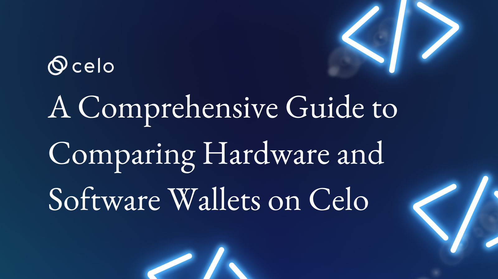

## Introduction

Over the past decade, cryptocurrencies have evolved from an undervalued asset to an exceedingly popular investment. Today, cryptocurrencies make up a significant part of the average trader's investment portfolio. Therefore, a wallet is a necessity if you must purchase, trade, or use cryptocurrencies in any other way. This article will compare hardware and software wallets in detail, highlighting the key differences between the two wallet types and their different advantages and disadvantages.

## Prerequisites

Knowing what crypto wallets are and their applications and possibilities on the Celo blockchain will come in handy for this article. Check out the [link](https://docs.celo.org/blog/tutorials/crypto-wallets-the-celo-way).

## What is a Wallet?

A cryptocurrency wallet is a tool that allows individuals to store, send, and receive digital currencies and monitor their balance. It can be a piece of software that runs on a PC, a mobile application, or a hardware device. This wallet stores your private key (a secure digital code known only to you) and public key (a digital code connected to a certain amount of currency).

A wallet can be used to track ownership, receive, or spend cryptocurrencies. They work by securely holding the private and public keys associated with a user's cryptocurrency holdings. In other words, a cryptocurrency wallet acts as a digital bank account for your cryptocurrencies, providing a secure and easy way to manage your crypto assets.

### What is a Software Wallet?

A software wallet, also known as a digital wallet, is a type of cryptocurrency wallet that stores a user's private keys on their device or in the cloud. The private key (a string of randomly generated numbers or letters that serves as a user's password) is the code that grants access to the user's cryptocurrency holdings and is necessary for transactions. Software wallets are typically easy to use and can be accessed from various devices, including smartphones, tablets, and computers.

There are different software wallets, including desktop wallets, mobile wallets, and web wallets. Desktop wallets are installed on a user's computer and provide a high level of security. Mobile wallets, as the name suggests, are designed for mobile devices and offer the added convenience of accessing your funds on the go. Web wallets, also known as cloud wallets, are accessed through a web browser (mostly as browser extensions).

They are often considered the most convenient type of software wallets, as they can be accessed from any device with an internet connection. They take the form of software programs or apps on a desktop computer, laptop, smartphone, or other digital device. You may already be familiar with various software wallets, such as MetaMask, Trust Wallet, and Celo Wallet, to name a few well-known ones.

### What is a Hardware Wallet?

A hardware wallet, or "cold wallet," is a tool that allows users to store cryptocurrency without an internet connection (totally offline). However, an internet connection is necessary to report and validate transactions on the blockchain when making payments or exchanges.

These wallets are physical devices that give extra protection to the process of keeping cryptocurrency. They function by keeping the user's private keys on the offline device, making it far more difficult for hackers to access the user's assets. Ledger Nano S and X, Trezor, and KeepKey are some of the market's most widely used hardware wallets. They provide several layers of protection, including a password, recovery seed, and PIN code. These are compact, portable pieces of hardware that are simple to store securely.

## Differences Between Software and Hardware Wallets

Both hardware and software wallets have the same goal: to securely store a user's private keys to increase the security of that user's crypto assets. A hardware wallet is kept offline, whereas a software wallet is kept locally on a computer.

Therefore, they are extremely different. Because they are protected from online hackers; as a result, Hardware Wallets are safer. This is the primary distinction between hardware and software wallets. However, software wallets are inexpensive and often free, but hardware wallets are pretty expensive.

Below are some highlighted differences:

* **Mode of Storage**

  Although both hardware and software wallets attempt to safeguard users' assets, how they are stored varies. While a software wallet keeps its contents on a computer, a hardware wallet uses a physical means to store assets offline.

  Hardware wallets isolate the private key storage from the storage used by the program, which implies the firmware that runs on such a wallet.

* **Security**

  In terms of security, as explained earlier, the hardware wallet is disconnected from the internet (as the name implies, "cold storage") when storing assets, making it very secure and resistant to hackers.

  However, you need a companion app to interact with it only when you want to perform transactions. They are considered the most secure form of storage for cryptocurrencies, as they are not susceptible to hacking attempts, viruses, or malware. Hardware wallets often come with advanced security features such as a PIN code, recovery seed, and passphrase, which make it very difficult for an attacker to steal funds from the device.

  Alternatively, software wallets, while also secure, store the private keys on the device or in the cloud, which makes them more vulnerable to hacking attempts. Even though they come with security features like two-factor authentication, they are still at risk of being hacked if the user's device is compromised or if the cloud server is breached.

* **Accessibility**

  Regarding accessibility, software wallets are generally more accessible than hardware wallets. Software wallets can be mobile apps, desktop programs, or web-based platforms, making them easily accessible to users from anywhere with an internet connection; an example of such a wallet is the Valora wallet. Users can easily access their funds, check their balances, and make transactions through their software wallet.

  On the other hand, hardware wallets are physical devices that are not always connected to the internet. This means that users need the device to access their funds, and transactions can only be made when the hardware wallet is connected to the internet to access the blockchain.

  Another aspect to consider is that hardware wallets usually have a limited set of supported cryptocurrencies, while software wallets may support a wider range of cryptocurrencies.

* **Price**

  The cost is a deciding element that most individuals consider when deciding how much money to put in. The cost of hardware wallets is higher than that of software wallets. Software wallets are free, whereas hardware wallets have a set fee.

## Pros and Cons of Hardware and Software Wallets

### Pros of Hardware Wallets

* They are regarded as the most secure option for cryptocurrency storage since the private keys are kept on a physical device that is not online.
* They frequently include high-tech security measures like a PIN, recovery seed, and password that make it incredibly challenging for an attacker to steal the device's assets.
* The recovery seed or passphrase can be used to restore access to the funds, even if the device is lost or stolen.
* They offer offline storage, which lowers the possibility of hacking attempts and other kinds of cyberattacks.

### Cons of Hardware Wallets

* Hardware wallets are tangible objects that are easily lost or stolen. If the recovery seed or password is not backed up, the assets will be permanently gone.
* Usually, only a small number of cryptocurrencies are supported.

### Pros of Software Wallets

* Software wallets are more convenient for everyday use since they can be accessed from any location with an internet connection.
* They often accept a wider range of cryptocurrencies.
* They frequently have security features like multi-sig support, seed phrase recovery, and two-factor authentication.

### Cons of Software Wallets

* Software wallets keep the private keys on the user's device or in the cloud, making them more susceptible to hacking attempts if the user's device or the cloud server are both hacked.
* The user may permanently lose access to the assets if they lose their smartphone or forget their password.
* They could be impacted by viruses, malware, and other cyberattacks.

## Conclusion

In summary, when it comes to storing cryptocurrency, both hardware and software wallets have their pros and cons. Hardware wallets provide a more secure form of storage, while software wallets are more convenient for everyday use. The choice between them will depend on an individual's specific needs and preferences and the supported coins that determine the type of wallet.

## About the Author

Boyejo Oluwafemi is a hardware product developer working at the intersection of hardware and blockchain technology. He’s working to leverage his wealth of experience working on several products ranging from smart health devices to sporting gadgets to deliver smart payment solutions for crypto for a more inclusive future. You can follow me on LinkedIn using this [link](https://www.linkedin.com/in/hardwareguy/).

## References

* [Bitcoin-Wallet](https://www.investopedia.com/terms/b/bitcoin-wallet.asp)
* [Crypto Wallet](https://www.coinbase.com/learn/crypto-basics/what-is-a-crypto-wallet)
* [Hardware vs. Software Wallet Choices](https://www.cryptopolitan.com/hardware-wallet-vs-software-wallet-crypto-wallet-choices/)
* [Differences between Hardware and Software Wallets](https://www.differencebetween.com/what-is-the-difference-between-hardware-wallets-and-software-wallets/)
* [Differences between hardware and software (MakeUseOf)](https://www.makeuseof.com/hardware-vs-software-crypto-wallets-whats-the-difference/)
* [Which wallet to use (Medium)](https://medium.com/coinbundle/hardware-vs-software-wallets-f03fb4727354)
* [Top differences between hardware and software wallets](https://techbuzzireland.com/2022/06/28/top-differences-between-the-software-and-hardware-wallets/)
