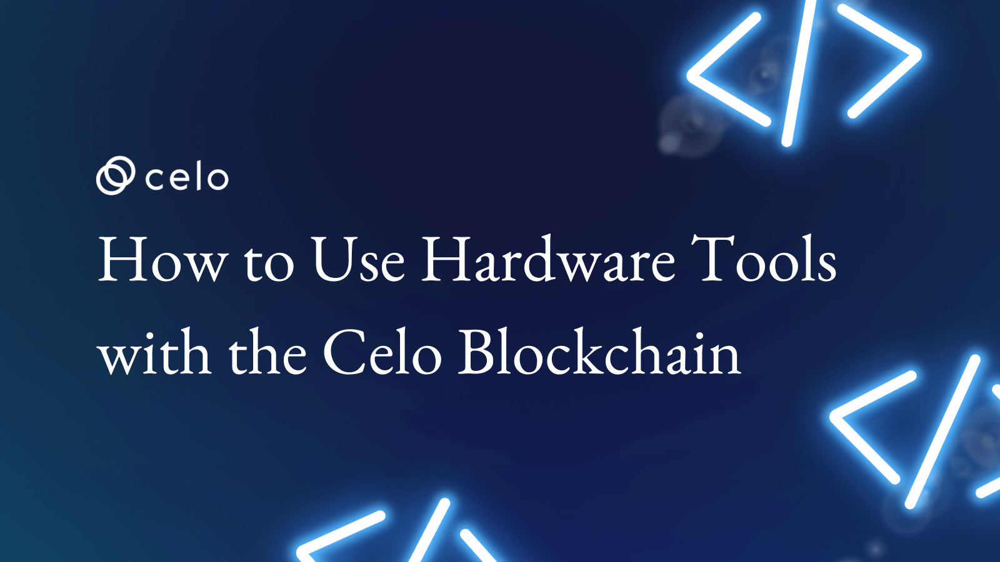

## Introduction

The application of hardware technology in the Web 3 space is rising. Specifically, the Celo blockchain has a lot to benefit from the use of hardware tools.

In this series, we explore the ways hardware is driving the adoption of the Celo blockchain through solutions such as hardware wallets, the L2 scaling protocol on mobile devices, and IoT sensors for carbon sensing with Oracles.

Also, we will discuss the hardware's role in enabling payment and driving positive climate action. Whether you are a seasoned blockchain enthusiast or new to the space, this series will provide valuable insights into the intersection of hardware and blockchain technology. In subsequent section will be discussing:

- The need for trust and security on the blockchain
- How hardware tools can potentially bring more trust and security to the Celo blockchain
- Current application of hardware on the blockchain
- Future use of blockchain on the Celo blockchain

## Prerequisites

For a proper understanding of this series, it is very important to have prior knowledge of:

- blockchain technology including concepts like Distributed Ledger Technology, Decentralization, Consensus, the Celo Blockchain, etc.
- how mobile computing devices like mobile phones, laptops, USB storage are used
- how the internet works (web 2 and 3) and
- Celo’s application of Regenerative Economics and Regenerative Finance (ReFi):

The following links will help:

- [Regenerative Finance - What it is and why it Matters](https://docs.celo.org/blog/tutorials/regenerative-finance-and-celo-the-process-and-partnership)
- [Web3.0 explained.](https://www.investopedia.com/web-20-web-30-5208698#:~:text=Web%202.0%20is%20the%20current,greater%20utility%20for%20its%20users)

## Requirements

You will need your mobile phone, any mobile crypto wallet supported by Celo, and access to the internet.
Also, you should check out an introduction to the Celo blockchain and its potential use in Africa through the link below:

- [An Introductory Guide to Celo](https://medium.com/celoorg/an-introductory-guide-to-celo-b185c62d3067)

## Introducing Hardware Technology

Hardware technology is an umbrella term for physical computing devices designed to perform a specific function. Examples of such devices and their specific use are hardware wallets for digital asset management and storage, sensor nodes for oracle services, Point of Sale (PoS) machines for payment, USB drives for data storage, etc.

The key takeaway here is that the design of these devices ensures that they perform a sole function. Also, they are physical tools.

## The Place of Hardware Technology in Blockchain

Blockchain creates a platform where several unknown users send and receive money without the presence or help of a bank or any other central trusted power. Typically, when individual X wants to send money to individual Y, X visits the bank that stores a ledger of all the previous transactions. The purpose is to verify that X has enough money to send to Y. This process is necessary not only because of the trust. Also, when a single entity keeps the ledger, it ensures that there is no double spending, which means that individual X can never send a payment more than once.

On the flip side, on the blockchain, rather than having a central ledger, numerous nodes on the network have a copy of the ledger. These nodes verify new transactions by solving complex mathematical problems using brute force. That process is the Proof of Work Technology. When one node finds the right solution, it adds a new block to the chain and uploads the updated ledger to the other nodes on the network.

***In summary, Blockchain creates a platform where multiple nodes that don't know each other can trust each other, taking out the central power required to build trust.***

Indeed, the first application of Blockchain technology might be cryptocurrencies. However, as platforms like the Celo blockchain shows us, that's just the tip of the iceberg. The idea of decentralization or distribution to be exact is applicable in several ways and hardware technology increases these possibilities.

- ### The Need for Trust and Enhanced Security on the Blockchain

Blockchain technology features a medley of numerous built-in security features like cryptography, software-mediated contracts, and identity controls. With these features, the technology provides an impressive level of data protection and integrity as it enables a distributed way to verify access, authenticate transaction records, and ensure privacy never gets compromised.

The presence of these security features, however, does not exempt the blockchain market from security challenges. Atlas VPN reports that “decentralized finance-related breaches constituted 76% of all major hacks in 2021, with over $1 billion lost in the third quarter alone.” Also, a research report from SlowMist shows that the third quarter of 2021 saw 20% more blockchain-based hacking incidents compared to the number of attacks in all of 2020.

- ### How Does Hardware Provide that Extra Trust and Security?

With hardware technology, devices used on the blockchain are designed for a specific purpose. Such devices can be optimized for security and speed thanks to their specific architecture which gets rid of loopholes common to most general-purpose systems.

Hardware devices isolate the vital computations and data into an IP core that gets separated from the rest of the system. For example, with hardware wallets, cryptographic keys can get isolated from the rest of the system into their memory. This memory can be accessed only by the cryptographic IP cores that require these keys. That upgrade is a massive security improvement as it effectively wades off most of the attacks discussed above.

So, in rare cases where the security of frontend programs or the operating system running on the processor of the main system gets compromised, the attacker still has no access to the keys. Should the IP core itself have a bug that allows a buffer overflow type of attack, the keys stay safe as they are duly isolated inside the IP core.

## Hardware and the Celo Blockchain: Current Applications

The current applications of hardware and blockchain generally (with Celo as a standard example) are beyond providing payment functionalities. Here are some of the most prominent applications of the intersection of these two technologies in our present world:

- ### Crypto Assets Management and Security

At the start, the goal of the blockchain was to provide a robust payment system void of ownership but structured to deliver on many grounds. This remains the most important use of blockchain networks. For context, the Celo blockchain aims to provide payment solutions that are seamless for all and create an avenue for prosperity for everyone.

One of the many ways they do this is by enabling the use of several, but not all hardware wallets on their blockchain to encrypt and secure your digital assets using keys. With this hardware technology application, there is more security and assurance for these assets as they are off the online space and no longer susceptible to cyberattacks. The good news is, there is an ample list of hardware wallets compatible with the Celo blockchain network

- ### Decentralized Storage

Hardware technology delivers a step up from what blockchain provides with DeFI by enabling decentralized storage. In a decentralized storage system, as opposed to storing all the data in a centralized server, data storage gets distributed into various chunks. These chunks get stored inside various nodes of a peer-to-peer (P2P) network.

One benefit of using such storage is that they provide the same benefits as a decentralized web. They are more secure, encourage privacy, are cost-effective, and maintain no single point of failure. Also, on Celo, these decentralized storages help decentralized applications (dApps) built on the network to permanently or temporarily store data.

- ### Sensor Nodes for Oracle Applications on the Blockchain

On the blockchain, oracles are entities that connect blockchains to external systems with the aid of sensor nodes. With this, they enable the execution of smart contracts based on inputs and outputs from the real world picked up by these sensor nodes. A good application of this procedure is the waste management protocol being built on the Celo blockchain, WASSET.

With oracles, the decentralized Web3 ecosystem can access existing data sources, legacy systems, and advanced computations thanks to sensor nodes. Also, decentralized oracle networks (DONs) enable the creation of hybrid smart contracts. On these smart contracts, on-chain code and off-chain infrastructure get combined to support sophisticated decentralized applications (dApps) that function off real-world events with traditional systems.

- ### Crypto PoS Payment Systems

Crypto PoS and ATMs are on the horizon in the blockchain space with an increase in adoption globally thanks to hardware technology. A crypto PoS is a system that processes crypto payments and allows you to receive crypto payments directly at the checkout. With a few clicks, payments and invoices are possible using crypto assets.

## Hardware and the Celo Blockchain: Future Potential Applications

- ### Layer 2 Scaling Solutions

When a blockchain network scales to a layer 2 chain, it can now process more transactions per second. This seamless pace is possible through something novel – they move transactions off of the heavy mainnet. Various layer 2 solutions achieve this in different ways including through certain enhancing applications of the hardware technology.

Overall, the objective never changes. They all aim to streamline the amount of information that needs to be validated by bulky underlying blockchain.

Other potential applications of the blockchain and hardware technology include but are not limited to

- Integration of Sensor Nodes and OracleS into More Blockchain Systems.
- Widespread and Low-End Blockchain Adoption Thanks to Hardware Integrations

## Conclusion

The Celo blockchain has all the prerequisites for the adoption of both existing and future applications of hardware technology in the blockchain. Some of these applications already exist while more of them get integrated now and then. The potentials of hardware technology and blockchain in the Celo ecosystem are endless and the future is even brighter.

## Next Steps

In the subsequent part of this series, I will walk you through how you can utilize the available existing applications like decentralized storage and hardware wallets.

## About the Author

Boyejo Oluwafemi is a hardware product developer working at the intersection of hardware and blockchain technology. He’s working to leverage his wealth of experience working on several products ranging from smart health devices to sporting gadgets to deliver smart payment solutions for crypto, for a more inclusive future. You can follow me on LinkedIn using the [link](https://www.linkedin.com/in/hardwareguy/).

## References

- [Layer 2 Solution Explained](https://www.ledger.com/academy/layer-2-blockchains-explained)
- [Top 5 crypto points of sales](https://nowpayments.io/blog/top-5-cryptocurrency-point-of-sale)
- [Potential Growth of blockchain and its use cases](https://docs.celo.org/blog/tutorials/potential-growth-of-blockchain-and-its-use-cases)
- [How hardware security is driving off-chain trust for enterprise blockchain adoption](https://www.networkcomputing.com/network-security/how-hardware-security-driving-chain-trust-enterprise-blockchain-adoption?ng_gateway_return=true&full=true)
