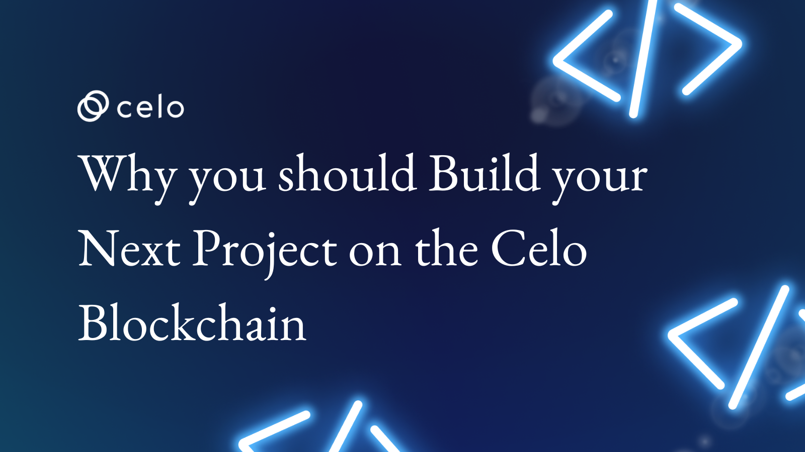

## Introduction

Are you a developer or blockchain enthusiast looking for a platform to host your next web3 project on? The Celo Blockchain is your best option. In this article, we'll show you why you should choose Celo for your next project. We'll start by exploring the different types of projects you can build on Celo, such as stablecoins, digital assets, and smart contracts. Then, we'll compare Celo to other popular blockchains, highlighting its advantages and why it's the best choice for your project. So sit tight and keep reading to discover why you should build your next project on Celo!

## Prerequisites

Before reading this article, it would be helpful to have a basic understanding of blockchain technology, and its applications, as well as the ideas of stablecoins, digital assets, and smart contracts. It would also be helpful to have some basic knowledge of decentralized exchanges (DEXs) and decentralized apps (DApps).

You can find resources to help with this on the Celo docs page through this [link](https://docs.celo.org/).

## Introducing the Celo Blockchain

Layer-1 protocol, EVM compatible, Proof-of-stake, Carbon negative, Mobile-first identity, Ultra-light clients, Localized stablecoins, Gas payable in multiple currencies, what exactly is the Celo blockchain?

The Celo blockchain is a decentralized platform that enables the creation of stablecoins, digital assets, and smart contracts. The features and properties of Celo have positioned the Celo blockchain as one of the fastest, most secure, and carbon-efficient web3 platforms for building a wide range of projects. At the core of the Celo Blockchain is its **mobile-first nature**, the platform is optimized for mobile phones, making sending payments and digital assets as easy as sending a text, to anyone with an internet connection, anywhere in the world.

## What Can You Build on Celo?

Stablecoins, digital assets, and smart contracts are the major foundations for all projects which can be built on the Celo Blockchain.

### **Stablecoins**

Stablecoins are a type of cryptocurrency with the value of the digital asset pegged to a reference asset, which is either fiat currencies, exchange-traded commodities, or another cryptocurrency. The Celo platform has its native stablecoin, the Celo Dollar (cUSD) pegged to the US dollar, and is designed to provide a stable and reliable currency for transactions on the platform. Other native stablecoins on the Celo platform are the Celo Euro (cEUR), and Celo Real (cReal) which track the value of the euro and the Brazilian real.

In addition, the Celo blockchain allows for the creation of custom stablecoins that can be pegged to any fiat currency. The use cases for Stablecoins on the Celo blockchain are endless and some include:

1. **Decentralized Applications (DApps):** Stablecoins can be utilized in DeFi applications, on the Celo blockchain, as a unit of account or as collateral to provide steady returns while lowering the risk of price fluctuation. This is particularly useful to lending and borrowing platforms, prediction markets, and decentralized exchanges.
2. **Rewards and Incentives:** Stablecoins are utilized as incentives and rewards for users that contribute to the Celo network in various ways, such as by providing liquidity or taking part in governance.
    For instance, the decentralized governance system on the Celo blockchain employs cUSD and other Celo stablecoins like cEUR and others for voting, giving token holders voting power proportional to the number of such tokens they have. This makes voting clear and safe and lessens how much market fluctuation affects decisions.
3. **Payments:** For both organizations and individuals, using stablecoins on the Celo blockchain for payments offers several advantages, including improved security, lower transaction costs, and quicker processing times. Hence on the Celo blockchain, stablecoins are utilized in a variety of ways as a form of payment such as in:
    * Cross-Border Payments.
    * Retail Payments.
    * E-commerce and online payments.
    * P2P Payments.

### **Digital Assets**

Digital assets on a blockchain refer to digital representations of value or ownership that are stored, transferred, and managed on a blockchain network. The most important use cases for digital assets on the Celo blockchain is the creation and management of stablecoins such as the cUSD as discussed above. But, that is only scratching the surface, with its fast, secure, and low-cost transactions coupled with Celo’s mobile-first approach, the Celo blockchain provides a convenient and accessible platform for people to manage and trade digital assets. Some use cases for digital assets projects that can be built on the Celo blockchain include:

1. **Custom Tokens:** The development of custom tokens, which may be used for a variety of reasons like fundraising, loyalty programs, or to symbolize ownership in a particular asset, is another use for digital assets on the Celo blockchain.

    The Celo blockchain is home to several custom token initiatives, one of which is the **Wasset Token ($WASS)** which is the custom token of the WassetDAO which is used for incentivizing members who are adding value through their waste recovery, recycling, and investment efforts. Also, it is the primary currency for staking in the WassetDAO and performing transactions on the Wasset marketplace.
2. **Digital Identity:** Digital assets on the Celo blockchain may be used for managing digital identities, enabling users to demonstrate their identities in a safe and verifiable way. This can be helpful for a variety of things, including voting or gaining access to financial services.
3. **Decentralized Exchanges (DEXes):** The Celo blockchain allows the development of decentralized exchanges, which would enable users to trade digital assets without the need for intermediaries. A good example of this is Ubeswap, a mobile-first DeFi exchange on Celo.
4. **Digital Asset Management and Custody Solutions:** Celo's secure and decentralized infrastructure enables the creation of digital asset management and custody solutions, providing investors with peace of mind and protection against theft and loss.

### **Smart Contracts**

A smart contract is a self-executing contract with the terms of the agreement between buyer and seller being directly written into lines of code. The code and the agreements contained therein exist across a distributed, decentralized blockchain network. The code controls the execution, and transactions are trackable and irreversible.

Smart contracts may be created on the Celo platform using Solidity, a high-level programming language that is frequently used to create smart contracts on Ethereum. Due to its emphasis on financial inclusion, the Celo platform also offers a stablecoin, cUSD, for use in smart contracts, providing price stability and lowering volatility.

More so; Celo runs the EVM which means that all smart contracts written for Ethereum can easily be deployed to Celo, the main difference being that you just need to connect to a Celo node instead of an Ethereum node. Some use cases for smart contracts projects that can be built on the Celo blockchain include:

1. **Decentralized Voting:** By utilizing smart contracts, decentralized voting systems may be created, allowing people to cast votes and make choices in a safe and open environment.
2. **Environment Monitoring:** Monitoring the environment allows for safe and transparent tracking of sustainability measures and environmental repercussions.
3. **Decentralized Asset Management:** Smart contracts on Celo may be used to create platforms for decentralized asset management, giving consumers secure and open options for managing their digital assets.
4. **Decentralized Gaming:** Smart contracts created on Celo can be used to build decentralized gaming platforms, enabling users to play games and trade digital assets securely and openly.

A very practical use case of a DApp(Decentralized App) project running on Smart contracts on the Celo blockchain is the impact market. Impact market is a social impact platform, that enables users to monitor the impact of their contributions to poverty alleviation initiatives and helps organizations that work in this area to raise funds more efficiently. By building on the Celo blockchain, Impactmarket has been able to ensure that the funds donated by users reach the intended recipients and are being used for the intended purpose, bringing transparency and accountability to the aid and development sector.

## Why Build on Celo?

The Celo platform, which focuses on financial inclusion, security, and accessibility, continues to draw more users and developers and is quickly emerging as a top platform for decentralized applications and smart contract projects. It has several competitive advantages over its rivals, which makes it a desirable platform for stablecoins, decentralized apps, and smart contract initiatives. Some of the key advantages of building on the Celo blockchain include:

1. **Speed:** The Celo blockchain is designed to provide fast and efficient transactions, allowing users to transfer digital assets and execute smart contracts in real time. This is due to Celo's consensus mechanism, known as Celo Proof-of-Stake (CeloPoS), which allows for quick and effective transactions, with block times of only 3-5 seconds. Additionally, Celo boasts a 1,000 transaction per second transaction throughput with a $0.00540 average transaction cost. As a result, Celo is among the most affordable blockchains. Here are the transaction costs for several blockchains for comparison's sake:
    * Ethereum – $21.41
    * Bitcoin – $1.57
    * Loopring – $0.46
    * Avalanche – $0.45
    * Binance Smart Chain – $0.35
    * Bitcoin Cash – $0.01
    * Polygon – $0.00265
    * Solana – $0.00025

2. **Carbon Efficiency:** The Celo blockchain is built with a carbon-efficient consensus process that lowers energy usage and lowers its carbon footprint. Celo has proved that Blockchain technology doesn’t have to mean being environmentally unfriendly. Celo is a carbon-negative blockchain.

    Simply said, the Proof-of-Stake (POS) consensus process employed by the Celo network inherently uses far less energy than Proof-of-Work (POW) techniques utilized by Bitcoin and Ethereum. A ton of CO2 generated by the infrastructure of the Celo network could handle up to 7 million transactions when operating at full capacity.

3. **Interoperability:** The Celo blockchain is built to operate with other blockchains, enabling easy integration with other decentralized applications and networks.

4. **Developer-friendly:** The Celo blockchain is built with a strong and scalable architecture that makes it simple for developers to create decentralized applications and smart contract projects.
5. **Community-driven:** With a decentralized governance approach that enables users to vote on proposals and transparently makes decisions, the Celo blockchain is designed to be community-driven.

6. **Scalability:** The Celo blockchain is built to scale as its user base expands, and its adaptable architecture enables smooth updates and enhancements as the platform progresses.

7. **Accessibility:** With an emphasis on financial inclusion and democratizing access to financial services, the Celo blockchain is created to be accessible to users regardless of their location or economic level.

Additionally, one of the most exciting use cases of the Celo blockchain is the creation of carbon market DApps and ReFi applications. These innovative applications can help to tackle some of the world’s most pressing environmental and financial challenges.

Carbon Market DApps on CELO for Climate Action refers to the use of decentralized applications on the Celo blockchain that can help to create a more transparent and accountable carbon market.

The [Flowcarbon](https://www.flowcarbon.com/about) project is one instance of a carbon market DApp on the Celo blockchain. Flowcarbon is a carbon market solution that aims to accelerate decarbonization and promote sustainable practices. Flowcarbon realized that one of the significant impediments to scaling carbon solutions was the opaque over-the-counter market for carbon credits and set out to bring carbon credits onto the blockchain to create a more transparent, democratic, and impactful market. By leveraging Celo’s blockchain technology, Flowcarbon aims to provide price transparency, and immutable tracking of credits, and incentivize high-impact climate change mitigation projects, thus creating a more sustainable future.

Regenerative finance aka ReFi refers to a financial system that prioritizes environmental, social, and economic sustainability. ReFi applications on the Celo blockchain can assist in addressing some of the major issues that the existing financial system has, including exorbitant costs, a lack of credit accessibility, and a lack of transparency.

The [Wildchain](https://www.wildchain.io/) project is an illustration of a ReFi application on the Celo blockchain. This endeavor is a play-to-impact mobile app that enables you to adopt endangered animals online and contribute to actual conservation efforts.

## Celo’s Mobile First Approach

At the core of the Celo Blockchain is its mobile-first nature, the platform is optimized for mobile phones and mobile phone numbers, making sending payments and digital assets as easy as sending a text, to anyone with or without an internet connection, anywhere in the world.

The rise of smartphones and mobile internet has enabled people to conduct transactions and access financial services from anywhere, at any time. This has created a huge demand for secure and accessible mobile payment systems, which Celo aims to meet.

A good use case is [Valora](https://valoraapp.com/about). Valora, a money transfer software application that enables users to send money using only a mobile number was built on the Celo blockchain to address core issues in our financial system. Valora makes money borderless, secure, and fast. Users can send money from one continent to the other in a matter of seconds with near-zero fees by leveraging the speed and efficiency of the Celo blockchain. Celo's "mobile first" approach makes it possible for Valora to provide a fast, secure, and convenient money transfer service.

Below are some reasons among many others why Celo’s Mobile First Approach is a big deal and you should take advantage of it by building your next project on Celo.

1. **Enhanced Accessibility**: By concentrating on mobile devices, Celo makes it simpler for users to connect to the network and engage with decentralized apps, independent of their location or device type.
2. **Better User Experience:** The Celo blockchain was created with a user-friendly interface that makes it simple to use for anybody, regardless of technical proficiency. For those who might not be aware of cryptocurrency or blockchain technology, this is particularly crucial
3. **Financial Inclusion:** The Celo blockchain was created with inclusivity in mind, enabling anybody with a smartphone to take part in the global economy regardless of their financial situation or location.
4. **Wider Audience Reach:** Unlike other blockchains, which are sometimes restricted to users with access to specialized hardware or an understanding of blockchain technology, Celo is mobile-first, allowing it to reach a wider audience.
5. **More Efficient Network:** Celo can be more efficient and affordable by being optimized for mobile devices, as opposed to other blockchains, which frequently need more resources to participate in the network.

Furthermore, by incorporating hardware wallets into its mobile-first design, Celo is compatible with most hardware wallets, providing consumers with a safe and convenient method to transact and manage their digital assets from any location at any time. This helps to drive the adoption of the Celo blockchain, as users will be able to easily and securely access their funds, participate in decentralized applications, and transact with others on the network.

Simply put, Celo's mobile-first strategy is a significant advantage over competing blockchains because it makes the Celo blockchain an appealing platform for developing decentralized applications and smart contract projects that are intended for users everywhere, regardless of their location, financial situation, or technical expertise.

## Conclusion

The Celo Blockchain offers an excellent platform and building blocks for programmers to create decentralized applications and financial services. This platform is an enabling option for anyone looking to start a new project in the blockchain industry thanks to its fast transaction speeds, low fees, and high security. The Celo network is unquestionably something you should take into consideration if you are looking for a safe and reliable platform to build your next project.

## Next Steps

To gain a deeper understanding of the Celo platform, you can continue learning about the Celo blockchain by exploring the various projects and initiatives that are being built on it. If you're interested in building your projects on the Celo blockchain, you can visit the official Celo developer documentation, where you can find all the information you need to get started. Additionally, you can also participate in the community by becoming a Celo validator, contributing to the development of the Celo blockchain.

## About the Author

Boyejo Oluwafemi is a hardware product developer working at the intersection of hardware and blockchain technology. He’s working to leverage his wealth of experience working on several products ranging from smart health devices to sporting gadgets to deliver smart payment solutions for crypto, for a more inclusive future. You can follow me on LinkedIn using the [link](https://www.linkedin.com/in/hardwareguy/).

## References

* [Celo ecosystem projects raise $77.3M in support of interoperability, ReFi](https://cointelegraph.com/news/celo-ecosystem-projects-raise-77-3m-in-support-of-interoperability-refi)
* [11 Celo projects that are built with Toucan carbon](https://blog.toucan.earth/11-celo-projects-building-with-carbon/)
* [What Are Smart Contracts on the Blockchain and How They Work](https://www.investopedia.com/terms/s/smart-contracts.asp)
* [17 Smart Contracts Powering the Celo Protocol](https://developers.celo.org/17-powerful-celo-protocol-core-contracts-you-need-to-know-d84c1fbc5a6)
* [Celo – Blockchain With Fast, Cheap, and Secure Transactions Altcoin Buzz](https://www.altcoinbuzz.io/reviews/altcoin-projects/celo-blockchain-with-fast-cheap-and-secure-transactions/#:~:text=Also%2C%20Celo%20has%20a%20ledger,of%201%2C000%20transactions%20per%20second.)
* [A Carbon Negative Blockchain? It’s Here and it’s Celo](https://blog.celo.org/a-carbon-negative-blockchain-its-here-and-it-s-celo-60228de36490#:~:text=And%20at%20capacity%2C%20the%20Celo,friendly%20goes%20beyond%20being%20POS.)
* [Celo for Ethereum Developers](https://docs.celo.org/developer/migrate/from-ethereum#:~:text=Celo%20runs%20the%20EVM%20which,instead%20of%20an%20Ethereum%20node.)
* [Kotani Pay](https://docs.kotanipay.com/)
* [Impact Market](https://docs.impactmarket.com/)
* [Flow Carbon](https://www.flowcarbon.com/about)
* [Wild Chain](https://www.wildchain.io/)
* [Valora App](https://valoraapp.com/about)
* [Wasset](https://wasset.io/)
