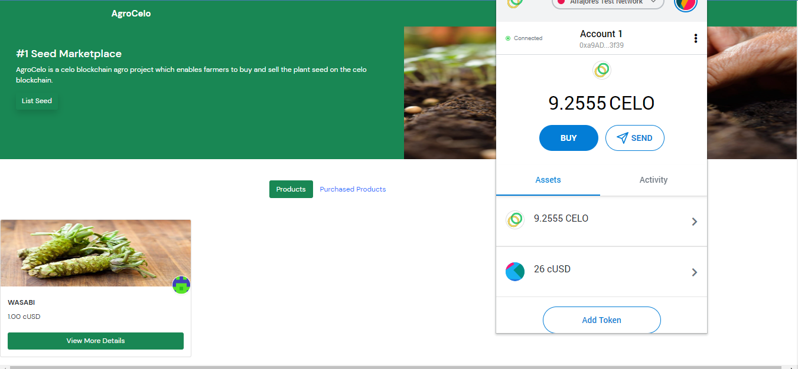

## Introduction​

The purpose of this tutorial is to know how to build and deploy a simple full stack dApp (decentralized application) on the Celo blockchain using Solidity (SmartContract) and Javascript (Frontend).

A blockchain or cryptographic network is a broad term used to describe a database maintained by a distributed set of computers that do not share a trust relationship or common ownership. This arrangement is referred to as decentralized. The content of a blockchain's database, or ledger, is authenticated using cryptographic techniques, preventing its contents from being added to, edited or removed except according to a protocol operated by the network as a whole.

Celo blockchain enables fast, secure, and low-cost financial transactions. It is built on top of the Ethereum Virtual Machine (EVM), which is a standardized environment for running smart contracts (self-executing code that can be used to facilitate, verify, and enforce the negotiation or performance of a contract).
One of the main features of Celo is its use of proof-of-stake (PoS) consensus, which means that the network is secured by a group of "validators" who stake (or pledge) a certain amount of the platform's native cryptocurrency to participate in the validation of transactions.

Ethereum applications are built using smart contracts. Smart contracts are programs written in languages like Solidity that produce bytecode for the Ethereum Virtual Machine or EVM, a runtime environment. Programs encoded in smart contracts receive messages and manipulate the blockchain ledger and are termed on-chain.

## Prerequisites​

This tutorial exposes you on how to build a simple fullstack dApp (decentralized application) on the Celo network using Solidity (SmartContract) and Javascript (Frontend). In order for us to move further, you will need to have a basic understanding of the following:

- Basic understanding of blockchain concepts. You can click [here](https://dacade.org/communities/blockchain/courses/intro-to-blockchain) to learn.
- Basic understanding of what a smart contract is.
- Basic knowledge on solidity and its concepts. you can click [here](https://dacade.org/communities/ethereum/courses/sol-101/learning-modules/dcc5e8e2-bc22-49a6-ace7-23ec7fcc81d5) to learn
- Basic knowledge of HTML and Javascript.
- Basic understanding on the command line.

## Requirements​

- Access to a computer with internet connection and a chrome web browser.
- **[NodeJS](https://nodejs.org/en/download)** from V12.or higher
- A code editor or text editor. **[VSCode](https://code.visualstudio.com/download)** is recommended
- A terminal. **[Git Bash](https://git-scm.com/downloads)** is recommended
- Remix IDE. Click **[here](https://remix.ethereum.org)** to for the web version.
- Celo Extension Wallet. Click **[here](https://chrome.google.com/webstore/detail/celoextensionwallet/kkilomkmpmkbdnfelcpgckmpcaemjcdh?hl=en)** to download.
- A github account.

## Getting Started

Below is a preview of what we are going to build.



## Smart Contract Development

Lets begin by building our first smart contract on Solidity using the Remix IDE. The Remix IDE is a web based IDE that allows developers to write, test and deploy smart contracts on the blockchain. But for this tutorial we will be deploying our smart contract on the Celo network or blockchain.

You can learn how the remix works by following the steps below:

- Head over to the link/.
- Click on featured plugins, “LEARNETH”.
- Click on Remix Basics.
- Start the tutorial and finish all lessons of Remix Basics.

Here is a preview on how to do it.


Considering you have understood how the Remix IDE works, let's build our smart contract by create a Soliidity file: called AgroCelo.sol

- Go to remix.ethereum.org,
- Create a new file,
- Name it AgroCelo.sol. You can give it any name you want but lets stick to AgroCelo.sol.
- Open that file. The .sol extension indicates that it is a Solididty file.

On the first line of your AgroCelo.sol lets include a statement that specifies the license under which the code is being released.

```solidity

// SPDX-License-Identifier: MIT
pragma solidity >=0.7.0 <0.9.0;

```

This license governs how the code can be used, and it is important to ensure that the correct license is used to avoid any legal issues. A resource such as SPDX can be used to help identify a suitable license.

Using the pragma keyword, you specify the Solidity version that you want the compiler to use. In this case, it should be higher than or seven and lower than nine. It is important to specify the version of the compiler because Solidity changes constantly.

Next up, we define an `IERC20Token` interface which enables us to interact with the celo stablecoin (cUSD).

```solidity

// SPDX-License-Identifier: MIT

pragma solidity >=0.7.0 <0.9.0;

interface IERC20Token {
  function transfer(address, uint256) external returns (bool);
  function approve(address, uint256) external returns (bool);
  function transferFrom(address, address, uint256) external returns (bool);
  function totalSupply() external view returns (uint256);
  function balanceOf(address) external view returns (uint256);
  function allowance(address, address) external view returns (uint256);

  event Transfer(address indexed from, address indexed to, uint256 value);
  event Approval(address indexed owner, address indexed spender, uint256 value);
}

```

ERC-20 tokens are a widely-used standard for creating digital assets on the Ethereum blockchain, and cUSD is one of them.

These tokens have pre-defined functions and events that can be easily used in contracts, and do not require any additional implementation. For example, you will be using the ERC-20 token's interface to interact with it, so that your contract can communicate with the token.

You can find more information on how to use these functions and events in the Celo **[documentation](https://docs.celo.org/developer-guide/celo-for-eth-devs)**. The documentation also provides more details on how to interact with ERC-20 tokens and how to use them with the Celo network.

After defining our `IERC20Token` interface`, we define our contract with the keyword contract and give it a name. which in our case we gave it AgroCelo. You can give it any name but ensure its descriptive.

```solidity

contract AgroCelo{
    uint internal listedSeedLength = 0;
    address internal cUsdTokenAddress = 0x874069Fa1Eb16D44d622F2e0Ca25eeA172369bC1;

```

In the next line, you define a state variable listedSeedLength, this is going to keep track of the number of seeds listed on the blockchain and also in storing `seedInformation`. It is of a `uint` type which means it can only store integer values. [(Learn more about data types in solidity)](https://docs.soliditylang.org/en/latest/types.html).

We also define the visibility of our variable to `internal` which means it cannot be accessed from external smart contracts or addresses and can only be modified within the smart contract. ([Learn more about visiblity](https://docs.soliditylang.org/en/latest/contracts.html#visibility-and-getters))

Next, To interact with the cUSD ERC-20 token on the Celo alfajores test network, you need to know the address of the token.

After defining the single variables used in the contract, we need to create a `model` for our seed called `SeedInformation` which you can give it your own name if you wish. This model will take the basic details about a seed to be listed on the blockchain.

```solidity

// Ceating a struct to store seed details.
    struct SeedInformation {
        address  owner;
        string seedName;
        string seedImgUrl;
        string seedDetails;
        string  seedLocation;
        uint price;
        string email;
    }

```

To do this, you would require a struct data type with the keyword `struct` and give it multiple properties. ([Learn about structs here](https://docs.soliditylang.org/en/latest/types.html#structs))

For this tutorial, these would be the variables that you would store in the struct:

1. owner - This would store the address of the owner of a particular seed. It is of the address type
2. seedName - This stores the name of the seed. it is of type string.
3. seedImgUrl - This stores the image url of the seed, it is of type string.
4. seedDetails - This stores the description of the seed, it is of type string.
5. seedLocation - This stores the location of the seeed, it is of type string.
6. price - This stores the price of the seed. It is a number so its of type uint.
7. email - This stores the email of the seller of that seed, it is of type string.

next we would create another model called PurchasedSeedInfo. This model will be used later by a map to store seeds being purchased.

```solidity

// creating a struct to store purchased seed details.
struct PurchasedSeedInfo {
        address purchasedFrom;
        string seedName;
        string seedImgUrl;
        uint256 timeStamp;
        uint price;
        string email;
    }

```

the variables used in the above struct are:

1. purchasedFrom - is of type address. It is used to store the address of the owner of that seed.
2. seedName - it is of type string, it stores the name of the seed.
3. seedImgUrl - it is of type string, it stores the image url of the seed.
4. seedDetails - it is of type string, it stores the description of the seed.
5. seedLocation - it is of type string, it stores the location of the seed.
6. price - it is of type uint since we are storing a number. It stores the price of the seed. Its a number so its of type uint.
7. email - it is of type string, it stores the email of the seller of that seed.

After creating the two models of our seed, we would create a map to store the `SeedInformation` model and also the `PurchasedSeedInfo` model.

```solidity

//map used to store listed seeds.
    mapping (uint => SeedInformation) internal listedSeeds;

    //map used to store seeds purchased.
    mapping(address => PurchasedSeedInfo[]) internal purchasedSeeds;

```

To handle multiple seeds, a mapping is needed where you can access the value of a seed through its key. Just like dictionaries in python or objects in Javascript.

To create a mapping, you use the keyword `mapping` and assign a key type to a value type. In this case, your key would be an integer and the value would be the struct `SeedInformation` we just created.

The second mapping stores the `PurchasedSeedInfo` model which is all seeds purchased by a particular buyer. This time the mapping method uses the address of the buyer as its key to store all seed purchased by that particular buyer in an array.

In the next section, you will define a function to add the seed to the smart contract called `listSeed`.

```solidity

// Function used to list a seed.

    function listSeed(string memory _seedName, string memory _seedImgUrl,
    string memory _seedDetails, string memory  _seedLocation, uint _price, string memory _email) public {

        require(bytes(_seedName).length > 0, "seedName cannot be empty");
        require(bytes(_seedImgUrl).length > 0, "seedImgUrl cannot be empty");
        require(bytes(_seedDetails).length > 0, "seedDetails cannot be empty");
        require(bytes(_seedLocation).length > 0, "seedLocation cannot be empty");
        require(bytes(_email).length > 0, "email cannot be empty");

        listedSeeds[listedSeedLength] = SeedInformation({
        owner : payable(msg.sender),
        seedName: _seedName,
        seedImgUrl: _seedImgUrl,
        seedDetails : _seedDetails,
        seedLocation: _seedLocation,
        price : _price,
        email : _email
      });
     listedSeedLength++;
}

```

The function includes parameters names and its type. We use the underscore in the name of the parameters to differentiate it from the struct value we are setting. The function has its visibilty type set to public.

Next we use the `require` method to ensure that all fields that the user will fill when listing a seed in the fronted should not be empty.

The require method which takes two parameters:

- The condition
- The error message

Next, we associate the key `listedSeedLength` with a new `SeedInformaition` structure in the `listedSeeds` mapping.

The first field of the struct is the address of the owner who can receive payments. The msg.sender function returns the address of the entity that initiated the call and is capable of receiving payments. This address will be stored as the owner's address.
You also need to assign values to the other variables using the provided parameters.

After that, we are going to increment the listedSeedLength by 1 so as to avoid listing a seed with the same id.

Up next we are going to create a function that will allow us read a listed seed when a valid index or id of that seed is passed as a parameter.

```solidity

// Function used to fetch a lised seed by its id.
    function getListedSeedById(uint _index) public view returns (
        address,
        string memory,
        string memory,
        string memory,
        string memory,
        uint price,
        string memory

    ) {

        return (
            listedSeeds[_index].owner,
            listedSeeds[_index].seedName,
            listedSeeds[_index].seedImgUrl,
            listedSeeds[_index].seedDetails,
            listedSeeds[_index].seedLocation,
            listedSeeds[_index].price,
            listedSeeds[_index].email
        );
    }

```

This function will carry a parameter of \_index to be able to get a particular seed alias. You also need to specify the variables you will return with the function. In this case, it would be a tuple corresponding to the variables declared in the struct.
The function will return the address of the owner, seedName, seedImgUrl, seedDetails, seedLocation, price and email address of the owner.

Up next, we are going to create a function called `buySeed` to enable users purchase a seed on the smart contract.

```solidity

    function buySeed(uint _index, address _owner, string memory _seedName, string memory _seedImgUrl,  uint _price, string memory _email) public payable  {
        require(_price > 0, "Price should be greater than 0");
        require(listedSeeds[_index].owner != msg.sender, "you are already an owner of this seed");
        require(
          IERC20Token(cUsdTokenAddress).transferFrom(
            msg.sender,
            listedSeeds[_index].owner,
            listedSeeds[_index].price
          ),
          "Transfer failed."
        );
        storePurchasedSeeds(_owner, _seedName, _seedImgUrl, _price, _email);
    }

```

The "buySeed" function, which is public and payable, takes the \_index, \_owner, \_seedName, seedImgUrl, \_price, \_emaiil and their respective types as parameter.

It will have three require methods.

The first require method checks if the price that is being passed is greater than 0. If the condition is true it will move to the next require method. If the condition is false, it will throw an error message: `"Price should be greater than 0"`.

The second require method ensures that the buyer of that seed should not be the same as the seller. If it is false, it trows an error saying "you are already an owner of this seed".

The third require method is to ensure that the cUSD transaction is successful. It then uses the ERC-20 token interface and the stored address to call the transferFrom method to transfer cUSD.

The first parameter is the address of the sender, accessed using the msg.sender method, the second parameter is the recipient of the transaction, which is the owner of the car at the given index, and the final parameter is the price of the seed at the given index.

If the transaction is successful, it calls the `storePurchasedSeeds` function which will be discussed later as we proceed. else it throws an error message saying "Transfer failed"

Up next we create a function called getPurchasedSeeds to fetch the list of all seeds purchased by a user.

```solidity

function getPurchasedSeeds() public view returns (PurchasedSeedInfo[] memory) {
    return purchasedSeeds[msg.sender];
}

```

The function has a visibility type of internal because we don't wnat it to be accessed outside of our contract. It also uses the view keyword since we are not modifying anything and returns an array which is the `PurchasedseedInfo`.

Next we are going to create the `storePurchasedSeeds` function which was called in the `buySeed` function. It stores the seeds purchased by a user.

```solidity

function storePurchasedSeeds(address _owner,
 string memory _seedName, string memory _seedImgUrl, uint _price, string memory _email) public {
    purchasedSeeds[msg.sender].push(PurchasedSeedInfo({purchasedFrom : _owner,
    seedName : _seedName, price : _price, email : _email, seedImgUrl : _seedImgUrl, timeStamp : block.timestamp }));
}

```

The function accepts parameters such as \_owner, \_seedName, \_seedImgUrl, \_price, \_email and their various types. It uses the address of the buyer as its key and stores the information provided in an array.

next we are going to create a public function called `getListedSeedLength` which returns an int value. The function returns the length of seeds created on the blockchain.

```solidity

function getListedSeedLength() public view returns (uint) {
        return (listedSeedLength);
    }

```

Here is the full code:

```solidity

// SPDX-License-Identifier: MIT
pragma solidity ^0.8.3;

interface IERC20Token {
  function transfer(address, uint256) external returns (bool);
  function approve(address, uint256) external returns (bool);
  function transferFrom(address, address, uint256) external returns (bool);
  function totalSupply() external view returns (uint256);
  function balanceOf(address) external view returns (uint256);
  function allowance(address, address) external view returns (uint256);
  event Transfer(address indexed from, address indexed to, uint256 value);
  event Approval(address indexed owner, address indexed spender, uint256 value);
}

import "@openzeppelin/contracts/utils/Strings.sol";

contract AgroCelo{
   // Declaring variables.
    uint internal listedSeedLength = 0;
    address internal cUsdTokenAddress = 0x874069Fa1Eb16D44d622F2e0Ca25eeA172369bC1;

    // Ceating a struct to store event details.
    struct SeedInformation {
        address  owner;
        string seedName;
        string seedImgUrl;
        string seedDetails;
        string  seedLocation;
        uint price;
        string email;
    }

    struct PurchasedSeedInfo {
        address purchasedFrom;
        string seedName;
        string seedImgUrl;
        uint256 timeStamp;
        uint price;
        string email;
    }

    //map used to store listed seeds.
    mapping (uint => SeedInformation) internal listedSeeds;

    //map used to store seeds purchased.
    mapping(address => PurchasedSeedInfo[]) internal purchasedSeeds;


    // Function used to list a seed.
    function listSeed(string memory _seedName, string memory _seedImgUrl,
    string memory _seedDetails, string memory  _seedLocation, uint _price, string memory _email) public {
        listedSeeds[listedSeedLength] = SeedInformation({
        owner : payable(msg.sender),
        seedName: _seedName,
        seedImgUrl: _seedImgUrl,
        seedDetails : _seedDetails,
        seedLocation: _seedLocation,
        price : _price,
        email : _email
      });
     listedSeedLength++;
}


// Function used to fetch a lised seed by its id.
    function getListedSeedById(uint _index) public view returns (
        address,
        string memory,
        string memory,
        string memory,
        string memory,
        uint price,
        string memory

    ) {

        return (
            listedSeeds[_index].owner,
            listedSeeds[_index].seedName,
            listedSeeds[_index].seedImgUrl,
            listedSeeds[_index].seedDetails,
            listedSeeds[_index].seedLocation,
            listedSeeds[_index].price,
            listedSeeds[_index].email
        );
    }


// function used to purchase a seed by another farmer.
function buySeed(uint _index, address _owner, string memory _seedName, string memory _seedImgUrl,  uint _price, string memory _email) public payable  {
        require(listedSeeds[_index].owner != msg.sender, "you are already an owner of this seed");
        require(
          IERC20Token(cUsdTokenAddress).transferFrom(
            msg.sender,
            listedSeeds[_index].owner,
            listedSeeds[_index].price
          ),
          "Transfer failed."
        );
        storePurchasedSeeds(_owner, _seedName, _seedImgUrl, _price, _email);
    }

// function used to fetch seeds purchased already by you.
function getPurchasedSeeds() public view returns (PurchasedSeedInfo[] memory) {
    return purchasedSeeds[msg.sender];
}


// function used to store purchase seed by a particular owner.
function storePurchasedSeeds(address _owner,
 string memory _seedName, string memory _seedImgUrl, uint _price, string memory _email) public {
    purchasedSeeds[msg.sender].push(PurchasedSeedInfo({purchasedFrom : _owner,
    seedName : _seedName, price : _price, email : _email, seedImgUrl : _seedImgUrl, timeStamp : block.timestamp }));
}


// function used to get length of lised seeds.
    function getListedSeedLength() public view returns (uint) {
        return (listedSeedLength);
    }

}

```

## Contract Deployment

To deploy the contract, we would need:

1. Install the [CeloExtensionWallet](https://chrome.google.com/webstore/detail/celoextensionwallet/kkilomkmpmkbdnfelcpgckmpcaemjcdh?hl=en) from Google Chrome store.

2. Create a wallet and ensure you store your key phrase in a very safe place when creating your wallet to avoid permanently losing your funds below is a break down on how to create a wallet:


3. Get the Celo token for the alfajores testnet [here](https://celo.org/developers/faucet) : below is a breakdown on how to do it.


4. Install the Celo remix plugin and deploy your contract. Below is the breakdown.


In the gif above, replace `marketplace.sol` with `AgroCelo.sol`

Congratulations! you have just deployed you first smart contract on the Celo blockchain.

## Frontend Development

Going futher we will be building our frontend to interact with our smart contract that is being deployed on the Celo blockchain. You need to make sure you have installed Node.js 10 or higher version.

Next we need to open a command line interface in the folder or directory where you want to build the frontend and run the code below:

```bash

git clone https://github.com/dacadeorg/celo-boilerplate-web-dapp

```

This will create a folder called celo-boilerplate-web-dapp. The folder contains neccessary setup files and folders needed to build our frontend and connect it with our smart contract. The three main folder you should watch out for is the:
`contract` folder which contains:

- erc20.abi.json file
- marketplace.abi.json file
- marketplace.sol file

`Public` folder which contain the index.html file and the `src` folder which contains the main.js file.

Next we move to our root directory on the same command line interface by run this code

```bash

cd celo-boilerplate-web-dapp

```

The code change the directory in the command line interface to the root directory inorder for us to install the dependences that comes with the boilerplate.

To install all the dependencies we type the code below and hit enter.

```bash

npm install

```

Installing of all dependencies might take a while. After the dependencies have been installed, we can start up the server by running the code:

```bash

npm run dev

```

Your project should be running here http://localhost:3000/ and a browser window should pop up showwing "hello world".

After starting the server we need to open the celo-boilerplate-web-dapp folder which is the root folder in an IDE you can use any IDE for it, but preferably you use vscode.

### The HTML part of the Dapp

In the next step of the tutorial, you will begin building the foundation of your decentralized application (DApp) using HTML.
To do this we need to go to the root directory of the folder and find the src folder, open the folder and click on the index.html file in our IDE. clear all that it written and type this:

```html
<!DOCTYPE html>
<html lang="en">
  <head>
    <!-- Required meta tags -->
    <meta charset="utf-8" />
    <meta name="viewport" content="width=device-width, initial-scale=1" />
  </head>
</html>
```

The code above declares the document type, add an HTML tag, create a head element, and add meta tags.

Next, we will be importing some external stylesheets. we will use bootstrap, a popular front-end library that allows you to create elegant responsive websites very fast. You can quickly choose from bootstrap components like buttons or cards and customize them to your needs.

```html
<!-- CSS -->
<link
  href="https://cdn.jsdelivr.net/npm/bootstrap@5.0.0-beta2/dist/css/bootstrap.min.css"
  rel="stylesheet"
  integrity="sha384-BmbxuPwQa2lc/FVzBcNJ7UAyJxM6wuqIj61tLrc4wSX0szH/Ev+nYRRuWlolflfl"
  crossorigin="anonymous"
/>

<link
  rel="stylesheet"
  href="https://cdn.jsdelivr.net/npm/bootstrap-icons@1.4.0/font/bootstrap-icons.css"
/>
```

after importing the stylesheet we will also be needing the bootstrap icons which can be imported using external import with the code below:

```html
<link rel="preconnect" href="https://fonts.gstatic.com" />
<link
  href="https://fonts.googleapis.com/css2?family=DM+Sans:wght@400;500;700&display=swap"
  rel="stylesheet"
/>
```

Up next, we would importing the font as our main font by using the style tag to style the font type and also setting the title of the page with the title tag. Here we set the title to AgroCelo but you can set it to any name you want as long as it is descriptive, and we close the head tag.

```html

<style>
    :root {
    --bs-font-sans-serif: "DM Sans", sans-serif;
    }
    </style>
    <title>AgroCelo</title>
    </head>

```

up next we would be defining our body tag where we would create our notification bar, navigation bar, hero, modals and forms. lets get started.

For the notification bar we write this code:

```html
<body>
  <!-- Displays notifications on the web page -->
  <div class="container">
    <div class="alert alert-warning fixed-top" role="alert">
      <span id="notification">⌛ Loading please wait...</span>
    </div>
  </div>
</body>
```

The div has the class `alert alert-warning` which will make text appear in an alert box. The span element has the id notification, that you will use to select the div and insert the text that you want to display in our Javascript code.

Up next is the navigation bar which is used to show our app name and the amount of cUSD we currently have. The amount of cUSD we be dynamic as the main data will be gotten from our javascript file.

```html
<!-- Navbar starts here -->
<nav class="navbar bg-success ">
  <div class="container">
    <span class="navbar-brand m-0 h4 fw-bold text-white">AgroCelo</span>
    <span class="nav-link border rounded-pill bg-light">
      <span id="balance">0</span>
      cUSD
    </span>
  </div>
</nav>
<!-- Navbar ends here -->
```

The navbar has two spans one which shows the name of our app and the secound which shows the amount of cUSD we have. The second span has an id of "balance" which will be later needed in our javascript file to render the actual celo balance a user have.

Up next we will be creating our hero where which is a background that tells the user what the app does.

```html
<!-- Hero starts here -->
<div class="row bg-success text-white">
  <div class="col-md-6 p-5">
    <h4>#1 Seed Marketplace</h4>
    <p>
      AgroCelo is a celo blockchain agro project which enables farmers to buy
      and sell the plant seed on the celo blockchain.
    </p>

    <p>
      <button
        class="btn btn-success shadow"
        data-bs-toggle="modal"
        data-bs-target="#addModal"
      >
        List Seed
      </button>
    </p>
  </div>

  <div class="col-md-6">
    
  </div>
</div>
<!--Hero ends here -->
<br />
```

The hero is divided into two columns by wrapping it with a div which has class of row. The first column contains a div with various bootstrap style which has a h4 tag that explains what the app does and a button which will pop up a modal where users can fill a form and interact with our smart contract to list a seed on the Celo blockchain. The second column contains and image tag where the source of the image is gotten from the url.

Up next we will be creating toggle buttons that will enable the users toggle the view between the general seed listed on the market and the ones they already bought.

```html
<!-- divs showing buttons used in switching views -->
<div class="row my-4">
  <div class="col-md-4"></div>
  <div class="col-md-4">
    <nav class="nav nav-pills" id="tabs">
      <a
        class="nav-link active bg-success  showProducts"
        id="productTab"
        aria-current="page"
        style="cursor : pointer;"
        >Products</a
      >
      <a
        class="nav-link showpurchased"
        id="purchasedTab"
        style="cursor : pointer;"
        >Purchased Products</a
      >
    </nav>
  </div>
  <div class="col-md-4"></div>
</div>
<!-- end of div -->
```

in our code, we used boostrap nav pills to create two buttons one with id set to "productTab" and the other set to "purchasedTab". The reason for the id's is so that we can use or target the buttons in our javascript code, to enable us add and remove styles on the web page.

Up next we will be creating a div that will show all seeds listed on the smartcontract:

```html

   <!-- Start of container showing listed seeds -->
        <main id="marketplace" class="row">
          <div class="d-flex mt-3 justify-content-center">
  <div class="spinner-border text-success spinner-border-sm" role="status">
    <span class="visually-hidden">Loading...</span>
  </div>
    <p class="mx-1">Fetching seeds...</p>
</div>
        </main>
        <main id="purchasedProduct" class="row d-none">
          <div class="d-flex mt-3 justify-content-center">
  <div class="spinner-border text-success spinner-border-sm" role="status">
    <span class="visually-hidden">Loading...</span>
  </div>
    <p class="mx-1">Fetching data ...</p>
</div>
        </main>
      </div>
<!-- End of container -->

```

The main tag contains two id's one set to "marketplace" which will be used later on in our javascript code to target and render the seeds listed on the blockchain. While the other is set to "purchasedProduct" which we would also use later in our javascript code to render seeds that is being purchased by the user.

up next is creating our first modal. This modal is used to show the full details of a particular seed when a the user clicks the `view More Details` button of a listed seed. The `modal-body` has an id of `modalHeader` the id is what we will use to render the template that will be coming from our Javascript file. Below is the code:

```html
<!-- start of modal that shows seed details -->
<div
  class="modal fade"
  id="addModal1"
  tabindex="-1"
  aria-labelledby="newProductModalLabel"
  aria-hidden="true"
  data-bs-backdrop="static"
  data-bs-keyboard="false"
>
  <div class="modal-dialog">
    <div class="modal-content">
      <div class="modal-header">
        <h5 class="modal-title" id="newProductModalLabel">Details</h5>
        <button
          type="button"
          class="btn-close"
          data-bs-dismiss="modal"
          aria-label="Close"
        ></button>
      </div>
      <div class="modal-body" id="modalHeader"></div>
    </div>
  </div>
</div>
<!-- end of modal -->
```

Up next is another modal which will be use to add or list a seed to the celo blockchain.

```html
<!-- start of modal to list a seed -->
<div
  class="modal fade"
  id="addModal"
  tabindex="-1"
  aria-labelledby="newProductModalLabel1"
  aria-hidden="true"
>
  <div class="modal-dialog">
    <div class="modal-content">
      <div class="modal-header">
        <h5 class="modal-title" id="newProductModalLabel1">New</h5>
        <button
          type="button"
          class="btn-close"
          data-bs-dismiss="modal"
          aria-label="Close"
        ></button>
      </div>
      <div class="modal-body">
        <form>
          <div class="form-row">
            <div class="col">
              <input
                type="text"
                id="seedName"
                class="form-control mb-2"
                placeholder="seed name"
              />
            </div>
            <div class="col">
              <input
                type="text"
                id="seedImgUrl"
                class="form-control mb-2"
                placeholder="seed image url"
              />
            </div>
            <div class="col">
              <input
                type="textarea"
                id="seedDetails"
                class="form-control mb-2"
                placeholder="seed details"
              />
            </div>
            <div class="col">
              <input
                type="text"
                id="seedLocation"
                class="form-control mb-2"
                placeholder="seed location"
              />
            </div>
            <div class="col">
              <input
                type="text"
                id="newPrice"
                class="form-control mb-2"
                placeholder="price"
              />
            </div>
            <div class="col">
              <input
                type="email"
                id="email"
                class="form-control mb-2"
                placeholder="email address"
              />
            </div>
          </div>
        </form>
      </div>
      <div class="modal-footer">
        <button
          type="button"
          class="btn btn-light border"
          data-bs-dismiss="modal"
        >
          Close
        </button>
        <button
          type="button"
          class="btn btn-success"
          data-bs-dismiss="modal"
          id="listSeedBtn"
        >
          List Seed
        </button>
      </div>
    </div>
  </div>
</div>
<!-- end of modal -->
```

Inside the modals are html forms, a close and a Submit button. The form will be use to fill the neccesary informations needed to list a seed on the Celo blockchain, while the Submit button will interact with our smart contract to submit the details of the form. The close button closes the modal.

Finally, we are going to add a bootstrap JS library and a library called blockies, that we are going to use to visualise blockchain addresses. Then we close the body and html tag.

```html

<script
    src="https://cdn.jsdelivr.net/npm/bootstrap@5.0.0-beta2/dist/js/bootstrap.bundle.min.js"
    integrity="sha384-b5kHyXgcpbZJO/tY9Ul7kGkf1S0CWuKcCD38l8YkeH8z8QjE0GmW1gYU5S9FOnJ0"
    crossorigin="anonymous"
    ></script>
    <script src="https://unpkg.com/ethereum-blockies@0.1.1/blockies.min.js"></script>
  </body>
</html>

```

Here is the full code for the html part:

```html

<!DOCTYPE html>
<html lang="en">
  <head>
    <!-- Required meta tags -->
    <meta charset="utf-8" />
    <meta name="viewport" content="width=device-width, initial-scale=1" />

    <!-- CSS -->
    <link
      href="https://cdn.jsdelivr.net/npm/bootstrap@5.0.0-beta2/dist/css/bootstrap.min.css"
      rel="stylesheet"
      integrity="sha384-BmbxuPwQa2lc/FVzBcNJ7UAyJxM6wuqIj61tLrc4wSX0szH/Ev+nYRRuWlolflfl"
      crossorigin="anonymous"
    />

    <link
      rel="stylesheet"
      href="https://cdn.jsdelivr.net/npm/bootstrap-icons@1.4.0/font/bootstrap-icons.css"
    />

    <link rel="preconnect" href="https://fonts.gstatic.com" />

    <link
      href="https://fonts.googleapis.com/css2?family=DM+Sans:wght@400;500;700&display=swap"
      rel="stylesheet"
    />

    <style>

      :root {
        --bs-font-sans-serif: "DM Sans", sans-serif;
        --bs-gray: #6c757d;
      }


    </style>

    <title>AgroCelo</title>
  </head>

  <body>

    <!-- Displays notifications on the web page -->
    <div class="container">
          <div class="alert alert-warning fixed-top" role="alert">
            <span id="notification">⌛ Loading please wait...</span>
          </div>
    </div>


   <!-- Navbar starts here -->
  <nav class="navbar bg-success " >
        <div class="container">
          <span class="navbar-brand m-0 h4 fw-bold text-white">AgroCelo</span>
          <span class="nav-link border rounded-pill bg-light">
            <span id="balance">0</span>
            cUSD
          </span>
        </div>
      </nav>
 <!-- Navbar ends here -->


 <!-- Hero starts here -->
 <div class="row bg-success text-white">
    <div class="col-md-6 p-5">
      <h4>#1 Seed Marketplace</h4>
      <p>
        AgroCelo is a celo blockchain agro project which enables farmers to
        buy and sell the plant seed on the celo blockchain.
        <p>
      <button class="btn btn-success shadow" data-bs-toggle="modal"
          data-bs-target="#addModal">List Seed</button>
    </div>

<div class="col-md-6">
    
  </div>
</div>
 <!--Hero ends here -->


<br />

<!-- divs showing buttons used in switching views -->
<div class="row my-4">
  <div class="col-md-4"></div>

  <div class="col-md-4">
 <nav class="nav nav-pills" id="tabs">
  <a class="nav-link active bg-success  showProducts"
  id="productTab" aria-current="page" style="cursor : pointer;">Products</a>
  <a class="nav-link showpurchased" id="purchasedTab" style="cursor : pointer;">Purchased Products</a>
</nav>
</div>
<div class="col-md-4"></div>
</div>
<!-- end of div -->

<br />


 <!-- Start of container showing listed seeds -->
        <main id="marketplace" class="row">
          <div class="d-flex mt-3 justify-content-center">
  <div class="spinner-border text-success spinner-border-sm" role="status">
    <span class="visually-hidden">Loading...</span>
  </div>
    <p class="mx-1">Fetching seeds...</p>
</div>
        </main>

        <main id="purchasedProduct" class="row d-none">
          <div class="d-flex mt-3 justify-content-center">
  <div class="spinner-border text-success spinner-border-sm" role="status">
    <span class="visually-hidden">Loading...</span>
  </div>
    <p class="mx-1">Fetching data ...</p>
</div>
        </main>


      </div>
<!-- End of container -->


<!-- start of modal that shows seed details -->
<div
      class="modal fade"
      id="addModal1"
      tabindex="-1"
      aria-labelledby="newProductModalLabel"
      aria-hidden="true"
      data-bs-backdrop="static" data-bs-keyboard="false"
    >
      <div class="modal-dialog">
        <div class="modal-content">
          <div class="modal-header">
            <h5 class="modal-title" id="newProductModalLabel">Details </h5>

            <button
              type="button"
              class="btn-close"
              data-bs-dismiss="modal"
              aria-label="Close"
            ></button>
          </div>
          <div class="modal-body" id="modalHeader">
          </div>
          </div>
          </div>
          </div>
<!-- end of modal -->


<!-- start of modal to list a seed -->
    <div
      class="modal fade"
      id="addModal"
      tabindex="-1"
      aria-labelledby="newProductModalLabel1"
      aria-hidden="true"
    >
      <div class="modal-dialog">
        <div class="modal-content">
          <div class="modal-header">
            <h5 class="modal-title" id="newProductModalLabel1">New </h5>
            <button
              type="button"
              class="btn-close"
              data-bs-dismiss="modal"
              aria-label="Close"
            ></button>
          </div>
          <div class="modal-body">
            <form>
              <div class="form-row">
                <div class="col">
                  <input
                    type="text"
                    id="seedName"
                    class="form-control mb-2"
                    placeholder="seed name"
                  />
                </div>

                <div class="col">
                  <input
                    type="text"
                    id="seedImgUrl"
                    class="form-control mb-2"
                    placeholder="seed image url"
                  />
                </div>

                <div class="col">
                  <input
                    type="textarea"
                    id="seedDetails"
                    class="form-control mb-2"
                    placeholder="seed details"
                  />
                </div>


                <div class="col">
                  <input
                    type="text"
                    id="seedLocation"
                    class="form-control mb-2"
                    placeholder="seed location"
                  />
                </div>

                <div class="col">
                  <input
                    type="text"
                    id="newPrice"
                    class="form-control mb-2"
                    placeholder="price"
                  />
                </div>


                <div class="col">
                  <input
                    type="email"
                    id="email"
                    class="form-control mb-2"
                    placeholder="email address"
                  />
                </div>

              </div>
            </form>
          </div>
          <div class="modal-footer">
            <button
              type="button"
              class="btn btn-light border"
              data-bs-dismiss="modal"
            >
              Close
            </button>
            <button
              type="button"
              class="btn btn-success"
              data-bs-dismiss="modal"
              id="listSeedBtn"
            >
              List Seed
            </button>
          </div>
        </div>
      </div>
    </div>
<!-- end of modal -->
    <script
    src="https://cdn.jsdelivr.net/npm/bootstrap@5.0.0-beta2/dist/js/bootstrap.bundle.min.js"
    integrity="sha384-b5kHyXgcpbZJO/tY9Ul7kGkf1S0CWuKcCD38l8YkeH8z8QjE0GmW1gYU5S9FOnJ0"
    crossorigin="anonymous"
    ></script>
    <script src="https://unpkg.com/ethereum-blockies@0.1.1/blockies.min.js"></script>
  </body>
</html>

```

### Reading and Writing on Our SmartContract

Before going into the main.js file, we need to be able to read and write from our smart contract in our Javascript file and to be able to do that we need to go to Remix IDE and where we already wrote our smart contract, compile it and deploy on the celo network.

in order to interact with your smart contract that is deployed in bytecode, you need an interface, the ABI (Application Binary Interface), so that the contractKit in our main.js can understand the bytecode. The ABI allows you to call functions and read data (Learn more about the ABI).

When you compile your contract in Remix, Remix also creates the ABI in the form of a JSON for your contract. Copy the JSON and save it into the marketplace.abi.json file of the contracts folder in your Celo boilerplate.

After that you need to copy the smart contract code and paste in your marketplace.js. When all this is done we can now move to our main.js but take note of the address in which your contract is being deployed to because we will need it in our main.js file to interact with the smart contract.

### Editing the DApp (main.js)

The main.js file is file that enable us interact with our smart contract from our frontend. In the beginning of the main.js file, necessary libraries and files are imported.

```js
import Web3 from "web3";
import { newKitFromWeb3 } from "@celo/contractkit";
import BigNumber from "bignumber.js";
import marketplaceAbi from "../contract/marketplace.abi.json";
import erc20Abi from "../contract/erc20.abi.json";

const ERC20_DECIMALS = 18;
const MPContractAddress = "0x93C2eFb0Bc6d5f09D37af265B9B78c95e7dC69E4"; // deployed smart contract address
const cUSDContractAddress = "0x874069Fa1Eb16D44d622F2e0Ca25eeA172369bC1"; //Erc20 contract address
```

In the above code we imported Web from web3. web3.js is a popular collection of libraries also used for ethereum, that allows you to get access to a web3 object and interact with node's JSON RPC API .

Then we import newKitFromWeb3 from the "@celo/contractkit". The contractkit library enables us to interact with the celo blockchain.

In order to interact with our smart contract that is deployed in bytecode, you need an interface, the ABI (Application Binary Interface), so that the contractKit can understand the bytecode. The ABI allows you to call functions and read data [Learn more about the ABI](https://docs.soliditylang.org/en/develop/abi-spec.html).

For us to get our Abi, we need to compile our AgroCelo.sol on Remix and click on the ABI icon to copy the Abi, then, we need to go to our `celo-boiler-plate` project, open the contract folder, open the marketplace.abi.json file clear anything in that file and paste the current Abi we just copied and save. We also need to paste our smart contract code in the `marketplace.sol` file in our boilerplate and save.

After following the steps above, we import the Abi by typing `import marketplaceAbi from "../contract/marketplace.abi.json"`.

Celo's operations often deal with numbers that are too large for Javascript to handle. To handle these numbers, we will use bignumber.js.

The erc2-Abi enables us to interact with the ERC-20 interface. The ERC-20 interface The ERC20 interface is a standard API for tokens within smart contracts. It enables make payment with the Celo stablecoin which is cUSD.

Next we will create a variable called `ERC20_DECIMALS` and set its value to 18. By default, the ERC20 interface uses 18 decimal places.

The `MPContractAddress` is the address that is shown when we deploy our smart contract on the Celo network. On Remix, after the deployment of your contract, you will find the address to that contract which you need to interact with the functionality in your smart contract.

Then we will create a variable called `cUSDContractAddress` for the cUSD contract address which gotten by default. All you have to do is to paste the address which is: `0x874069Fa1Eb16D44d622F2e0Ca25eeA172369bC1`

Going futher we will create three more global variable below:

```js
let kit; //contractkit
let contract; // contract variable
let listedSeeds = []; // array of listed seeds
```

The kit is used to store the address of a user that is conneted with his/her celo wallet. Later on we will take a look on how it works.

The contract stores an instance of the marketplace contract once a user connects their Celo wallet, so you can interact with it.

The listedSeeds array stores the seeds that we will be listed on the blockchain soon.

In order to store information in the kit and contract variables we need to create an asynchronous function called `connectCeloWallet` that allows a user to connect to the Celo Blockchain and read the balance of their account. The function will perform several checks and actions to ensure that the user has the necessary tools and permissions to interact with the Celo Blockchain.

```js
//Connects the wallet gets the account and initializes the contract
const connectCeloWallet = async function () {
  //checks if wallet is avaliable and gets the account.
  if (window.celo) {
    notification("⚠️ Please approve this DApp to use it.");
    try {
      await window.celo.enable();
      notificationOff();

      const web3 = new Web3(window.celo);
      kit = newKitFromWeb3(web3);

      const accounts = await kit.web3.eth.getAccounts();
      kit.defaultAccount = accounts[0];

      contract = new kit.web3.eth.Contract(marketplaceAbi, MPContractAddress);
    } catch (error) {
      notification(`⚠️ ${error}.`);
    }
    notificationOff();
  }
  // if wallet is not avaliable excute enable the notification
  else {
    notification("⚠️ Please install the CeloExtensionWallet.");
  }
};
```

The first step is to check if the user has the CeloExtensionWallet installed by checking if the "window.celo" object exists. If it does not exist, the function will use the console to inform the user that they need to install the wallet.

If the "window.celo" object does exist, a notification will be sent to the user in the console to approve this DApp and try the window.celo.enable() function. This will open a pop-up dialogue in the UI that asks for the user's permission to connect the DApp to the CeloExtensionWallet.

If an error is caught during this process, the user would be informed that they must approve the dialogue to use the DApp.

After the user approves the DApp, create a web3 object using the window.celo object as the provider. This web3 object can then be used to create a new kit instance, which will be saved to the kit state. This kit instance will have the functionality to interact with the Celo Blockchain.

You would then access the user's account by utilizing the web3 object and kit instance that have been created.

After creating the new kit instance, use the method kit.web3.eth.getAccounts() to get an array of the connected user's addresses. Use the first address from this array and set it as the default user address by using kit.defaultAccount. This will allow the address to be used globally in the DApp.

Next we create a function called approve which will be used later to enable us get the user approval before making a transaction on the blockchain. It takes \_price of the seed as a parameter. This function will be used later.

```js
async function approve(_price) {
  const cUSDContract = new kit.web3.eth.Contract(erc20Abi, cUSDContractAddress);

  const result = await cUSDContract.methods
    .approve(MPContractAddress, _price)
    .send({ from: kit.defaultAccount });
  return result;
}
```

In the approve function, we create a cUSD contract instance with the ABI and the contract address, cUSDContract, which enable us to call the cUSD contract method approve. You need to specify both the contract address that will be allowed to make transactions and the amount that it will be allowed to spend, i.e., the price of the seed.

Again, you also need to specify who is going to spend the cUSD token. In this case it is the address stored in kit.defaultAccount. It returns the result for error handling if there is.

Up next we create an asynchronous function called getBalance which we use in getting cUSD of the user and displaying it on the navbar we created in our html file.

```js

  // gets the balance of the connected account
const getBalance = async function () {
  const totalBalance = await kit.getTotalBalance(kit.defaultAccount)
  // gets the balance in cUSD
  const cUSDBalance = totalBalance.cUSD.shiftedBy(-ERC20_DECIMALS).toFixed(2)
  document.querySelector("#balance").textContent = cUSDBalance
}
  };

```

We start by calling the `kit.getTotalBalance(address)` method, passing in the user's address. This method returns the user's balance in the form of an object that contains the amounts of CELO and cUSD tokens. The returned balance is then stored in the `totalBalance` variable.

The next step is to extract the CELO and cUSD balance from the "totalBalance" object by using the `.CELO` and `.cUSD` properties respectively. Then it is shifted the value by -ERC20_DECIMALS which is a way to represent the balance in terms of smaller units in our case 18 decimal places, and then it is converting the value to fixed 2 decimal points. These values are stored in the `celoBalance` and `USDBalance` variables.

Up next, create a function called `getListesSeeds` that retrieves the seeds information stored on the blockchain and stores it in the global array called `listedSeeds` we create above.

```js
// an async function used to get the listed seeds.
const getListedSeeds = async function () {
  // a smartcontract call used to get listed seed length.
  const listedSeedLength = await contract.methods.getListedSeedLength().call();

  //initializing listSeed array
  const _listedSeeds = [];

  //  function that loops through all the listSeeds.
  for (let i = 0; i < listedSeedLength; i++) {
    let seed = new Promise(async (resolve, reject) => {
      // a smartcontract call used to get listed seed by id.
      let p = await contract.methods.getListedSeedById(i).call();
      resolve({
        index: i,
        owner: p[0],
        seedName: p[1],
        seedImgUrl: p[2],
        seedDetails: p[3],
        seedLocation: p[4],
        price: new BigNumber(p[5]),
        email: p[6],
      });
    });

    // push the items on the _listedSeed array
    _listedSeeds.push(seed);
  }

  // resolves all promise
  listedSeeds = await Promise.all(_listedSeeds);
  renderProductTemplate();
};
```

Before retrieving the listed seeds, we need to know the number of seeds listed already to enable us iterate over them. To do that we start by calling the `contract.methods.getSeedLength().call()` method, which returns the number of seeds that are stored in the smart contract. This value is stored in the `listedSeedLength` variable.

Next we will create an empty array called `_listedSeeds` that will be used to store the listed seed objects. Next, we loop throught each seeds, and for each seed, we create a promise by calling the `contract.methods.getListedSeedById(i).call()` to get the listed seed data. Resolve the promise with the seed data and then push the seed object to your \_listedSeeds array. Be aware that the price needs to be a bigNumber object so you can later make correct payments.

After the loop is finished, we wait for all promises in the `listedSeeds` array to be resolved by calling `await Promise.all(_listedSeeds)`, this will make sure that all the listed seeds have been retrieved before calling the renderProductTemplate function which will be created later. We use the `renderProductTemplate` function which we will create next to show the listedSeeds on the web page.

Next is to create the renderProductTemplate function. In the renderProductTemplate function we get the id of the element in which we want to render the seeds in our case `marketplace`. Firstly we need to make it empty so as to avoid multiple rendering when the function is being called more than once. next we check if there is seed in the listSeeds array if it is true, we use the foreach loop to create a new div and set the productTemplate which we will discuss next to it and then we append the new div to the `marketplace`.

```js
// function used to render a html template of listed seeds.
function renderProductTemplate() {
  document.getElementById("marketplace").innerHTML = "";
  if (listedSeeds) {
    listedSeeds.forEach((seed) => {
      const newDiv = document.createElement("div");
      newDiv.className = "col-md-3";
      newDiv.innerHTML = productTemplate(seed);
      document.getElementById("marketplace").appendChild(newDiv);
    });
  }
}
```

Next lets create the productTemplate function. The productTemplate function returns an html element and accept a parameter in our case called `seed`.

```js
// function that create a html template of listed seeds
function productTemplate(seed) {
  return `
 <div class="card mb-4">
      
  <div class="card-body text-left p-3 position-relative">
        <div class="translate-middle-y position-absolute top-0 end-0"  id="${
          seed.index
        }">
        ${identiconTemplate(seed.owner)}
        </div>
        <p class="card-title  fw-bold mt-2 text-uppercase">${seed.seedName}</p>
        <p class="mt-2 text-left fs-6">
           ${new BigNumber(seed.price)
             .shiftedBy(-ERC20_DECIMALS)
             .toFixed(2)} cUSD
        </p>
        <p class="card-text mt-4">
           <div> <a class="btn btn-md btn-success view"
           id="${seed.index}" style="width:100%;">View More Details</a></div>
          </div>
    </div>
    `;
}
```

Inside it should have a card which contains an image tag, an identiconTemplate function which collects user address and displays it as an icon in other to differentiate different users and three paragraphs. They should all receive an object value named seed.seedImgUrl seed.owner, seed.price, seed.Name. The seed.price has to be convert into beceause it uses BigNumber.

Up next we would create the identiconTemplate function. It recieves a parameter of \_address.

```js
// function  that creates an icon using the contract address of the owner
function identiconTemplate(_address) {
  const icon = blockies
    .create({
      seed: _address,
      size: 5,
      scale: 10,
    })
    .toDataURL();

  return `
  <div class="rounded-circle overflow-hidden d-inline-block border border-white border-2 shadow-sm m-0">
    <a href="https://alfajores-blockscout.celo-testnet.org/address/${_address}/transactions"
        target="_blank">
        
    </a>
  </div>
  `;
}
```

The function returns a div that has an image tag with its src set to the variable icon declared at the top inside the fuction.

Next we create two function called notification() and notificationOff(). The notification() function displays the alert element with the text in the parameter and a notificationOff stops showing the alert element. They will be used when recieving and resolving promise using the try and catch block in our code to display error or success messages.

```js
// function to create a notification bar
function notification(_text) {
  document.querySelector(".alert").style.display = "block";
  document.querySelector("#notification").textContent = _text;
}

// function to turn off notification bar based on some conditions
function notificationOff() {
  document.querySelector(".alert").style.display = "none";
}
```

Next we would be initializing some functions each time when the window load by using the function window.addEventListener(). It recieves two parameters (1) load (2) an asyn function that calls several functions.

```js
// initialization of functions when the window is loaded.
window.addEventListener("load", async () => {
  notification("⌛ Loading...");
  await connectCeloWallet();
  await getBalance();
  await getListedSeeds();
  notificationOff();
});
```

The async function calls the notification function with a loading message, display the user's balance, render all seed so the user can see them, and disable the notification div again once the DApp is loaded.

Next would be collecting the values of our forms we created in our modal. Firstly we get the id of our modal button, then we add an event listener to check when the button is being clicked. Next we store the values in an array called params and we use the try block to call the contract.methods.listedSeed() with the params passed inside it, then we use the catch block to handle any error that might occur. If all is succesful, we call the notification, notificationOff and getListedSeeds function. Below is the code:

```js
document.querySelector("#listSeedBtn").addEventListener("click", async (e) => {
  // collecting form parameters
  const params = [
    document.getElementById("seedName").value,
    document.getElementById("seedImgUrl").value,
    document.getElementById("seedDetails").value,
    document.getElementById("seedLocation").value,
    new BigNumber(document.getElementById("newPrice").value)
      .shiftedBy(ERC20_DECIMALS)
      .toString(),
    document.getElementById("email").value,
  ];
  notification(`⌛ Listing your seed on the celo blockchain...`);
  try {
    const result = await contract.methods
      .listSeed(...params)
      .send({ from: kit.defaultAccount });
  } catch (error) {
    notification(`⚠️ ${error}.`);
  }
  notification(`🎉 Listing successful`);
  notificationOff();
  getListedSeeds();
});
```

You start by creating a new BigNumber instance with the \_price argument, and then it is shifting it by ERC20_DECIMALS, this is a way to represent the price in terms of smaller units. Then it is converting the value to a string and storing it in the "price" variable.

Next we would create a querySelector that target an id of marketpalce and checks for click events. This query selector enables us to display the details of a seed in a modal when the user clicks on the view more details button:

```js

document.querySelector("#marketplace").addEventListener("click", async (e) => {
    if(e.target.className.includes("view")){
      const _id = e.target.id;
      let listedSeed;

      try {
          listedSeed = await contract.methods.getListedSeedById(_id).call();
          let myModal = new bootstrap.Modal(document.getElementById('addModal1'), {backdrop: 'static', keyboard: false});
          myModal.show();

```

We first of all check if the element clicked has a class name of `view` if it is true, we declare a variable called \_id to get the id of the button click. The value of the \_id gotten is what will be used to fetch the details of a seed by calling the contract.methods.getListedSeedById(\_id).call(); on the try block and storing the value on the local variable called listedSeed declared in the function.

On the try block also create a variable called myModal which is used to control the modal with the id `addModal1` in our html file. Through it we got the myModal.show() which is used to pop up the modal when promise is recieved.

Futher more, let create the details of the modal;

```js

document.getElementById("modalHeader").innerHTML = `
<div class="card">
  
  <div class="card-body">
    <p class="card-title fs-6 fw-bold mt-2 text-uppercase">${listedSeed[1]}</p>
    <p  style="font-size : 12px;">
      <span style="display : block;" class="text-uppercase fw-bold">Seed Description: </span>
      <span class="">${listedSeed[3]}</span>
    </p>


        <p class="card-text mt-2" style="font-size : 12px;">
          <span style="display : block;" class="text-uppercase fw-bold">Location: </span>
          <span >${listedSeed[4]}</span>
        </p>

        <p class="card-text mt-2" style="font-size : 12px;">
          <span style="display : block;" class="text-uppercase fw-bold">Email: </span>
          <span >${listedSeed[6]}</span>
        </p>

        <div class="d-grid gap-2">
          <a class="btn btn-lg text-white bg-success buyBtn fs-6 p-3"
          id=${_id}
          >
            Buy for ${new BigNumber(listedSeed[5]).shiftedBy(-ERC20_DECIMALS).toFixed(2)} cUSD
          </a>
        </div>
  </div>
</div>

  `}

```

Inside the modal we will create a div with class card and we insert the image tag with some paragraphs. the image tag contains the image of the seed while the paragraph contains the details of the seed according to their order when fetched from the smart contract. Inside the modal is a buy button that will enable us to purchase a seed. We will implement the functionality later.

Still in our query selector is the catch block that handles any error that may occur when interacting with our smart contract.

```js

 catch (error) {
      notification(`⚠️ ${error}.`)
    }
    notificationOff()
  }
})

```

After the catch block might have handle the error by displaying it as a notification on the page, we remove the notification to for other elements to be visible.

Next, we would be creating the buy functionalilty which will enable us to buy seeds from a farmer.

```js

// implements the buy functionalities on the modal
document.querySelector("#addModal1").addEventListener("click", async (e) => {
    if (e.target.className.includes("buyBtn")) {

      // declaring variables for the smartcontract parameters
      const index = e.target.id
      var _price =  new BigNumber(listedSeeds[index].price)
      var _seedName = listedSeeds[index].seedName
      var _seedImgUrl = listedSeeds[index].seedImgUrl
      var _email = listedSeeds[index].email
      var _owner = listedSeeds[index].owner

      notification("⌛ Waiting for payment approval...")


      try {
        await approve(listedSeeds[index].price)
      } catch (error) {
        notification(`⚠️ ${error}.`)
      }

```

We start by using a query selector to target the id addModal1 which is the id of the modal that shows the details of a seed. In that modal is a buy button with a class name of "buyBtn". We use the if condition to ensure that the element that we clicked on should have a class name of `buyBtn` before executing the next line of instruction.

In the next line of instruction we are going to create 6 variables. The first variable stores the id which is a numeric value of the targeted button, while the rest of the variables gets the details of that seed in the global array according to the id passed.

The next line pop a notification to tell the user that their request is being processed after which we are going to use a try block to approve the price of the seed we intend to buy by calling the approve method and passing the price of the seed as its parameter.

After payment is being approved we are going to display another notification let the user know that we are waiting for their confirmation. Then we are going to use a try block to call the buySeed function of our smart contract.

```js

notification(`⌛ Awaiting payment for "${listedSeeds[index].seedName}"...`)
      try {
        const result = await contract.methods
          .buySeed(index, _owner, _seedName, _seedImgUrl, _price, _email)
          .send({ from: kit.defaultAccount })
        notification(`🎉 You successfully bought "${listedSeeds[index].seedName}".`)
        getListedSeeds()
        getBalance()
      } catch (error) {
        notification(`⚠️ ${error}.`)
      }

      notificationOff()
    }

  })

```

The buySeed function contains parameter such as the index of the seed, owner, seed name, price and email and then it send the transaction. If it is successful, it notify the user and then call the getListedSeeds and getBalance function. If there is an error it will also alert the user the error. After everything is processed we are going to ensure that the notification is turned off by calling the notificationOff function.

Up next we are going to create a query selector that will target the tab id and checks for the button is being clicked. This buttons is what enables us to toggle between seed listed on the blockchain and seed bought buy the user.

```js

document.querySelector("#tabs").addEventListener("click", async (e) => {
      if (e.target.className.includes("showpurchased")) {
        document.getElementById("marketplace").classList.add("d-none");
        document.getElementById("purchasedProduct").classList.remove("d-none");
        document.getElementById("productTab").classList.remove("active", "bg-success");
        document.getElementById("purchasedTab").classList.add("active", "bg-success");

        var result;

        notification(`⌛ Loading please wait ...`)

```

The if condition is to check if the button click has a class of `showpurchased`. If it is true it will use the document.getElementById to add and remove class list from the element whose id is used. This will enable us to toggle the view between the seed listed and the seed purchased.

Next we are going to create a variable called result, this will be used to store the seed purchased when we call the smart contract.

The notification function gives the user the impression that something is processing and they should wait for it.

Up next we are going to create a try block that will fetch the seed purchased by that user.

```js

try {
           result = await contract.methods.getPurchasedSeeds().call();

           notificationOff()
          if (result.length) {
            document.getElementById(`purchasedProduct`).innerHTML = ``
        result.forEach((item) => {
          var timestamp= parseInt(item[3])

// converts timestamp to milliseconds.
var convertToMilliseconds = timestamp * 1000;

// create an object for it.
var date = new Date(convertToMilliseconds);

```

The try block firstly calls the getPurchasedSeeds from the smart contract and stores the promise in the result variable we created. notificationOff turns off the notification. After that we have to check if the result list is not empty. If true we get the innerHTML of the id `purchasedProduct` and set it to be empty because we are going to render some html template in it using the forEach loop later on. Before rendering, we need to convert each timestamp that is fetch into a format that can understood by the user.

Up next we create a template that will render the purchased seeds

```js

//template that shows purchased seeds
                document.getElementById(`purchasedProduct`).innerHTML +=
                `
                <div class="card col-md-12  mb-4">
                <div class="card-body row">
                <div class="col-md-4">
                

                <div class="translate-middle-y position-absolute bottom-25 start-2" >
                ${identiconTemplate(item[0])}
                </div>
                    </div>

                    <div class="col-md-8">
                    <p class="card-text mt-2 d-flex justify-content-between" style="font-size : 12px;">
                      <span style="display : block;" class="text-uppercase fw-bold">Seed Name: </span>
                      <span >${item[1]}</span>
                    </p>


                    <p class="card-text mt-2 d-flex justify-content-between" style="font-size : 12px;">
                      <span style="display : block;" class="text-uppercase fw-bold">Price: </span>
                      <span >${new BigNumber(item[4]).shiftedBy(-ERC20_DECIMALS).toFixed(2)} cUSD</span>
                    </p>

                    <p class="card-text mt-2 d-flex justify-content-between" style="font-size : 12px;">
                      <span style="display : block;" class="text-uppercase fw-bold">Date Purchased: </span>
                      <span >${date.getHours() + ":" + date.getMinutes() + ", "+ date.toDateString()}</span>
                    </p>

                    <p class="card-text mt-2 d-flex justify-content-between"
                    style="font-size : 12px;">
                      <span style="display : block;"
                      class="text-uppercase fw-bold">Email: </span>
                      <span >${item[5]}</span>
                    </p>
                      </div>
                    </div>
                  </div>`
                  ;
              })
      }

```

The template contain a card that is rendered in the purchasedProduct id. It contains various p tags with their neccessary informations, and image tag to display the image and the identiconTemplate icon that shows the address of the user purchased from in form of an icon. the item promise is being used according to how it is arranged in the smart contract.

Next we are going to handle when the result is empty after the promise is being returned.

```js

 else{
        document.getElementById(`purchasedProduct`).innerHTML = `<p class="text-center">
        you haven't purchased any seed yet</p>`;
      };

        } catch (error) {
          notification(`⚠️ ${error}.`)
        }
        notificationOff()
        getListedSeeds()

      }

```

The innerHTML of the id purchaseProduct is replaced with the text "you haven't purchased any seed yet" and a catch block is used to handle errors and display them.

After all is resolve we are going to turn off the notifications and call the getListedSeeds function.

Next we going to handle the toggle button that shows the listed seeds.

```js

// toggles the view on the web page
      else if (e.target.className.includes("showProducts")) {
        document.getElementById("marketplace").classList.remove("d-none");
        document.getElementById("purchasedProduct").classList.add("d-none");
        document.getElementById("productTab").classList.add("active", "bg-success");
        document.getElementById("purchasedTab").classList.remove("active", "bg-success");
      }
})

```

We use the else if to check if the button clicked contain the class name `showproducts`. if it contains, we are going to remove and add some styles in the web page by using the .classList.add() function for add and .classList.remove() to remove a class.

## Deployment on Github pages

Up next we will be looking at how to deploy our app on github page. Before that we need to ensure that our app is working smoothly. After that you can build your DApp in the root directory command-line interface of our `celo-boilerplate-web-dapp` with the command.

```bash

npm run build

```

After building it successfully, you should have an HTML and JS file inside the docs folder of your project.

- Upload your project to a new GitHub repository.
- Once inside your repository, click on settings and scroll down to a section called Pages.
- Select the main branch and the docs folder as the source for your GitHub pages, click on save.
- Create a custom domain name, click on save. Your domain name should appear at the top of the browser.
- Click on visit site. It might take a minute or two before the site will be ready.

## Conclusion​

Congrats 🎉, you were able to build and deploy your fullstack dApp using Solidity and Javascript on the Celo blockchain.

## Next Steps​

You can challenge yourself by adding more functions to your smart contract and implement them using Javascript. You can also look at various Celo smart contracts and see if you can build a dApp using javascript.

The source code of this project is hosted [here](https://github.com/SamsonAmos/AgroCelo1). You can use it as a source of reference to edit yours.

- [Live Demo](https://samsonamos.github.io/AgroCelo1/)

## About the Author​

Samson Amos is a web2 and a web3 developer who loves coding as well as teaching others. You can reach me out on Twitter [@SamsonAmoz](https://twitter.com/SamsonAmoz)

## References​

- Dacade Tutorial [Link](https://dacade.org/communities/celo/courses/celo-development-101)
- Decade Celo Github [boilerplate](https://github.com/dacadeorg/celo-boilerplate-web-dapp)
