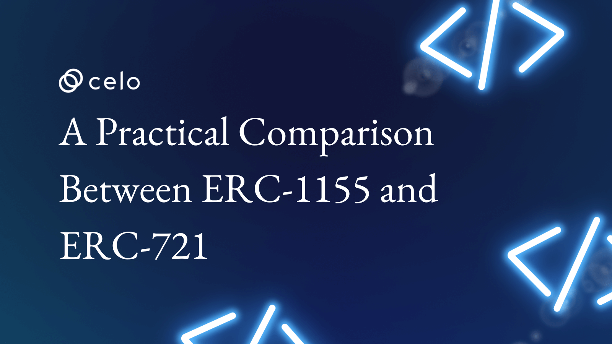

## Introduction

When it comes to Non-Fungible Tokens (NFTs), the first standard that often comes to mind is ERC-721. It's true, ERC-721 has been widely adopted and has paved the way for the explosion of NFTs in the art, collectibles, and gaming industries. But there is another player in town that is making waves, and that is ERC-1155. In this article, we will take a deep dive into the world of NFTs and compare ERC-1155 and ERC-721, two of the most popular standards in the industry. You may be surprised by the differences and similarities between these two standards, and how they can be used to create unique and innovative digital assets. So, whether you're a seasoned NFT enthusiast or just starting to explore this exciting world, buckle up and get ready to learn about ERC-1155, the lesser-known but powerful NFT standard.

## ERC-721

### Overview of ERC-721

ERC-721 also known as the NFT standard was introduced in 2018. A group of developers which includes, William Entriken, Dieter Shirley, Jacob Evans, and Nastassia Sachs, proposed this standard in 2017 to standardize the creation and management of unique on-chain assets. Nowadays, we can see a lot of projects using ERC-721 to represent things ranging from digital collectibles like Bored Ape Yacht Club or Crypto Punks to music and real estate.

### What is ERC-721?

It provides a set of standardized APIs for developers to create, manage and transfer unique digital assets on the blockchain. The ERC-721 standard ensures that each token created under it is a unique asset, with specific characteristics and ownership information. The standard also provides a way to store metadata associated with each NFT on the blockchain, making it possible to track the history and provenance of these assets.

### Use Cases of ERC-721

1. Collectibles: ERC-721 tokens can be used to represent unique digital collectibles such as rare artwork, trading cards, or in-game items.
2. Gaming: ERC-721 tokens can be used as in-game items that can be traded or sold for real-world value.
3. Domain names: ERC-721 tokens can be used to represent ownership of domain names on the blockchain, allowing for decentralized domain name registration and transfer.

## ERC-1155

### Overview of ERC-1155

The ERC-1155 token standard was developed to be an improvement over the ERC-721 standard. It was first introduced in 2018. Enjin, a platform for blockchain gaming, was the one that initially proposed it. The ERC-1155 token standard is a more flexible and time-saving alternative to the ERC-20 and ERC721 protocols since it incorporates the best features of both of those protocols into a single solution.

### What is ERC-1155

The ERC-1155 standard is a multi-token protocol that expands the functionality of the ERC-721 protocol. ERC-1155 permits the generation of both semi-fungible and non-fungible tokens, in contrast to ERC721, which specifies a set of rules and application programming interfaces for the generation, management, and transfer of one-of-a-kind digital assets. This enables the ERC-1155 standard to represent a larger variety of assets, including scarce digital collectibles and utility tokens whose values can be exchanged with those of other tokens.

### Use Cases of ERC-1155

1. Gaming: ERC-1155 tokens can be used for different in-game items, such as weapons, armor, and currency. This allows for the creation of more complex games.
2. Collectibles: ERC-1155 tokens can be used for unique collectibles, such as sports memorabilia or limited-edition art.
3. Digital Assets: ERC-1155 tokens can represent any type of digital asset, including but not limited to images, audio, and video files.

## Comparison of ERC-1155 and ERC-721

In comparison to the ERC-721 standard, which only allows for the creation of nonfungible tokens, the ERC-1155 standard offers a solution that is more flexible and less expensive for the production of both semi-fungible tokens and non-fungible tokens. This is because the ERC-1155 standard is based on the ERC-721 standard.

ERC-1155 can support an endless number of tokens within a single smart contract, whereas ERC-721 necessitates the deployment of a new smart contract for each type of token. This is another advantage of ERC-1155 over ERC721. Because of this, ERC-1155 offers a mechanism for token production that is more scalable.

Additionally, ERC-1155 enables batch transfers of tokens, which can dramatically cut down on both the costs of transactions and the amount of time they take. ERC-721, on the other hand, necessitates separate transactions for each token that is being transferred. As a result, the transfer process is both time-consuming and expensive.

## Conclusion

In conclusion, the Non-Fungible token (NFT) market has several relevant standards, including ERC-721 and ERC-1155. The first standard to open the door for NFTs in the art, collectibles, and gaming industries was ERC-721, which has since gained widespread adoption.

ERC-1155, on the other hand, offers an alternative strategy by enabling the development of both non-fungible and semi-fungible tokens. Its adaptability makes it a potent standard for developing distinctive and cutting-edge digital assets.

The decision between ERC-721 and ERC-1155 ultimately depends on the particular requirements of each project. Both ERC-721 and ERC-1155 have strengths and limitations. Whatever the case, the future of NFTs is promising, and the possibilities for digital assets are virtually limitless because of the ongoing development of both ERC-721 and ERC-1155.

## About the Author

Nikhil Bhintade is a product manager and technical writer who is always on the lookout for anything new in technology. He has a great understanding of technology and always looks for new things to learn.

When he's not busy writing compelling product stories and technical documents, you can find him tinkering on [GitHub](https://github.com/nikbhintade), where he shares his latest projects. And if you're looking to connect with a tech industry insider, you can always find him on [LinkedIn](https://linkedin.com/in/nikbhintade), where he's always happy to chat about the latest trends and developments.

## Next Step

We have learned the differences between EC-721 and ERC-1155. Other Sages have written practical tutorials on ERC-721 and ERC-115; why not give those tutorials a try?

- [Creating, Deploying, and Minting your ERC1155 Token on Celo](https://docs.celo.org/blog/tutorials/how-to-create-deploy-and-mint-your-erc1155-token-on-celo-with-hardhat)
- [How to quickly build an NFT collection on Celo](https://docs.celo.org/blog/tutorials/how-to-quickly-build-an-nft-collection-on-celo)
- [Step-by-Step Guide to Deploying your First Full-Stack Dapp on Celo](https://docs.celo.org/blog/tutorials/step-by-step-guide-to-deploying-your-first-full-stack-dapp-on-celo)

## Reference

- [ERC-721: Non-Fungible Token Standard](https://eips.ethereum.org/EIPS/eip-721)
- [ERC-1155: Multi Token Standard](https://eips.ethereum.org/EIPS/eip-1155)
