import YouTube from '@components/YouTube';

# 17 Smart Contracts Powering the Celo Protocol

_Making sense of the logic driving the Celo platform._


## Hello Developers 🌱

Welcome to today’s post, where we’ll break down a blockchain topic into bite-sized pieces to help you learn and apply your new skills in the real world.

Today’s topic is _Celo Core Contracts_.

**Here’s an overview of what we’ll cover 🗒**

- ✅ What is the Celo Protocol?
- ✅ Celo Core Contracts
- ✅ Navigating contract resources
- ✅ Core Contract Details

By the end of this post, you’ll be able to navigate many of the Celo Core Contracts and have the tools to explore the Celo protocol.

Let’s go! 🚀

## What is the Celo Protocol?

The [Celo](https://celo.org/) protocol is a fully [EVM compatible](https://medium.com/celoorg/donut-hardfork-is-live-on-celo-585e2e294dcb), [proof-of-stake](https://medium.com/celoorg/celos-proof-of-stake-mechanism-31061fbebea), [carbon-negative](https://medium.com/celoorg/a-carbon-negative-blockchain-its-here-and-it-s-celo-60228de36490), layer-1 protocol, featuring a fast ultralight client and built-in seigniorage stablecoins, collateralized by crypto and natural assets.

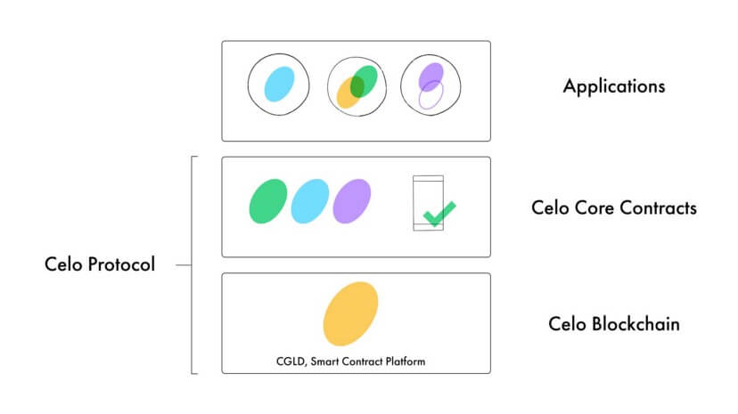

:::tip

New to Celo? [Everything you need to get started with Celo](https://medium.com/@nyzio/celo-spotlight-build-a-financial-system-that-creates-the-conditions-for-prosperity-for-everyone-7b1830efc254)

:::

## The Celo Full-Stack Solution

Celo provides a full-stack blockchain solution where each layer is designed to ensure the speed, security, and stability of every application built on the Celo platform.

The Celo Blockchain is an open cryptographic protocol that allows applications to make transactions and run smart contracts. A growing collection of Celo Core Contracts run on the Celo Blockchain defining the platform logic including ERC-20 stable currencies, identity attestations, proof-of-stake, and governance. These contracts are used by developers build Applications that take advantage of innovations in the Celo Protocol.

## Celo Core Contracts

The **Celo Core Contracts** are divided into four main groups: [common](https://github.com/celo-org/celo-monorepo/tree/7be22605e172ca536c028e408b147aab83202e4a/packages/protocol/contracts/common), [governance](https://github.com/celo-org/celo-monorepo/tree/7be22605e172ca536c028e408b147aab83202e4a/packages/protocol/contracts/governance), [identity](https://github.com/celo-org/celo-monorepo/tree/7be22605e172ca536c028e408b147aab83202e4a/packages/protocol/contracts/identity), and [stability](https://github.com/celo-org/celo-monorepo/tree/7be22605e172ca536c028e408b147aab83202e4a/packages/protocol/contracts/stability). Each has its own folder and is available in the contracts folder.

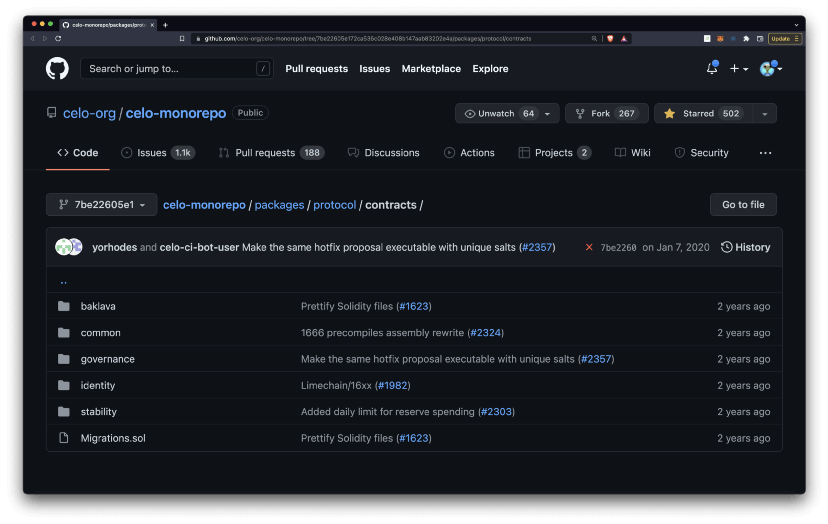

The [common](https://github.com/celo-org/celo-monorepo/tree/7be22605e172ca536c028e408b147aab83202e4a/packages/protocol/contracts/common) folder holds files used throughout the protocol including the registry, utilities, and the CELO native asset. The [governance](https://github.com/celo-org/celo-monorepo/tree/7be22605e172ca536c028e408b147aab83202e4a/packages/protocol/contracts/governance) folder handles validator elections, proposals, and rewards. The [identity](https://github.com/celo-org/celo-monorepo/tree/7be22605e172ca536c028e408b147aab83202e4a/packages/protocol/contracts/identity) folder handles functions that link accounts to cell phones or other unique identifiers. Finally, the [stability](https://github.com/celo-org/celo-monorepo/tree/7be22605e172ca536c028e408b147aab83202e4a/packages/protocol/contracts/stability) folder manages Celo stable coin functions including the reserve and on-chain exchanges.

:::tip

View code: View [Celo Core Contracts on GitHub](https://github.com/celo-org/celo-monorepo/tree/7be22605e172ca536c028e408b147aab83202e4a/packages/protocol/contracts)

:::

## Contract release process

Changes to core smart contracts are made using on-chain Governance approximately four times a year. When a release is made, all smart contracts from the release branch that differ from the deployed smart contracts are released and included in the same governance proposal.

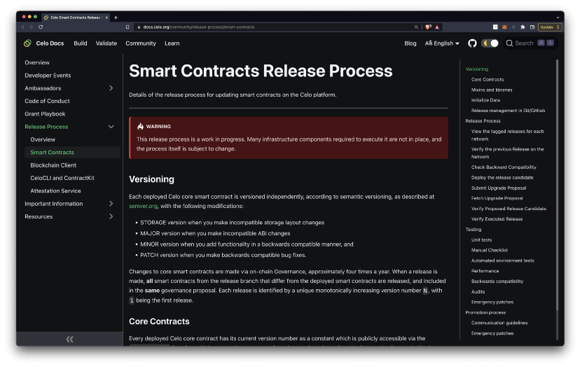

:::tip

Learn more: [Celo Core Contract Release Process](/community/release-process/smart-contracts)

:::

## Secure smart contracts with OpenZeppelin

[OpenZeppelin](https://openzeppelin.com/) provides a service to verify smart contract security by performing smart contract audits. Celo has received and implemented all feedback from the thorough audit reports provided by the OpenZeppelin engineering team to ensure the security of their contracts.

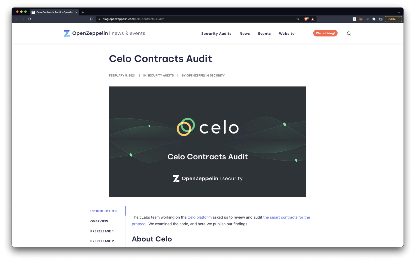

:::tip

Learn more: [OpenZeppelin Audit](https://blog.openzeppelin.com/celo-contracts-audit/) & [Audit Release 5](https://blog.openzeppelin.com/celo-contracts-audit-granda-mento/)

:::

## Navigating contract resources

The core contracts in this post include a link to the code and unit tests in [GitHub](https://github.com/), block explorer in [Blockscout](https://explorer.celo.org/), and [CLI commands](https://docs.celo.org/command-line-interface/introduction) or [documentation](https://docs.celo.org/) when available.

## Code

Read the smart contract code in GitHub to learn more about the structure and logic defined in the Celo platform.

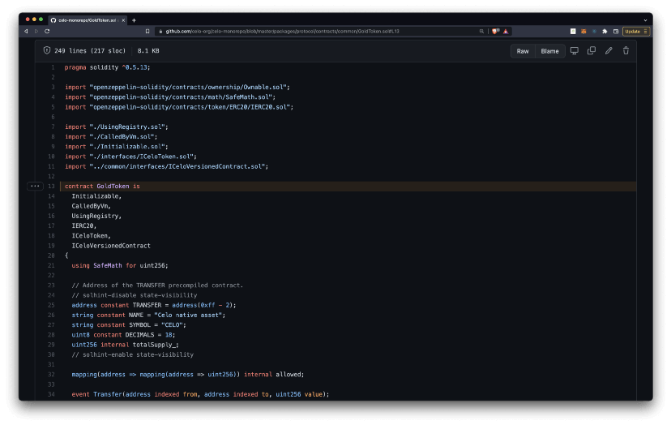

:::tip

Learn more: [Solidity smart contract programming language](https://docs.soliditylang.org/en/v0.8.11/#)

:::

## Blockscout

Navigate the contract address details in [Blockscout](https://explorer.celo.org/) to learn more about the contract usage, history, code, along with other contract details.

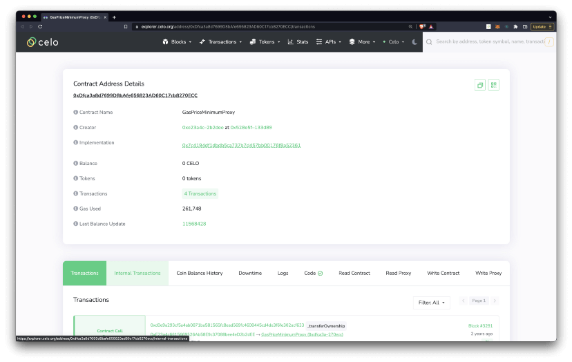

:::tip

Learn more: [Blockscout documentation](https://docs.blockscout.com/)

:::

## Unit tests

Explore the unit tests to see how each contract adheres to functional correctness and security best practices.

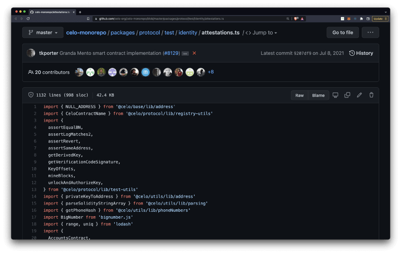

:::tip

Learn more: [Smart contract unit testing](https://betterprogramming.pub/a-few-tips-for-unit-testing-ethereum-smart-contract-in-solidity-d804062068fb)

:::

## Smart contract address

The smart contract address is the location of the deployed smart contract on the Celo blockchain.

`Address: 0xed68f8B11240249382478631bA0185473984aaf7`

## Core Contract Details

Now you can start exploring 17 of the Celo core contracts!

### Accounts

Maps an address to an account in storage.

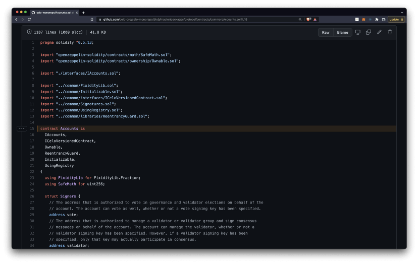

- [Code](https://github.com/celo-org/celo-monorepo/blob/master/packages/protocol/contracts/common/Accounts.sol)
- [Blockscout](https://explorer.celo.org/address/0xccF3e2a7c06A515E36F547c6eB563dc8E00d3c08/transactions)
- [Unit Tests](https://github.com/celo-org/celo-monorepo/blob/master/packages/protocol/test/common/accounts.ts)
- [CLI](https://docs.celo.org/command-line-interface/account)

```
Address: 0xccF3e2a7c06A515E36F547c6eB563dc8E00d3c08
```

## **Attestations**

Contract mapping identifiers to accounts.

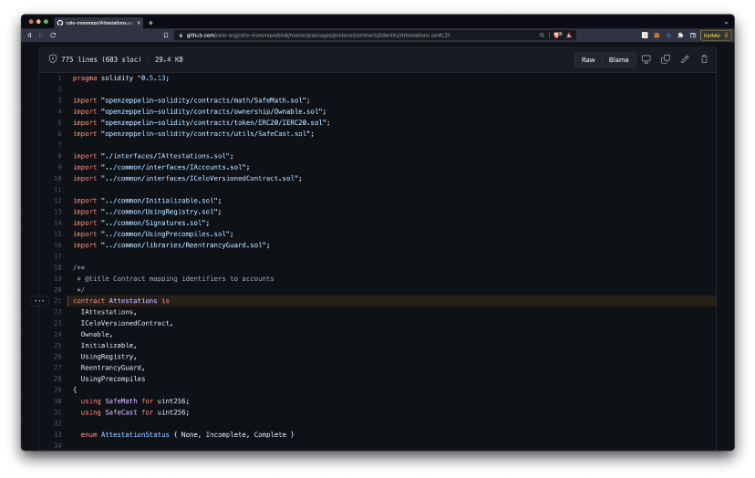

- [Code](https://github.com/celo-org/celo-monorepo/blob/master/packages/protocol/contracts/identity/Attestations.sol)
- [Blockscout](https://explorer.celo.org/address/0xD787384d91a7fFaC85d51C63EF71580df6C677B7/transactions)
- [Unit Tests](https://github.com/celo-org/celo-monorepo/blob/master/packages/protocol/test/identity/attestations.ts)
- [Docs](https://docs.celo.org/validator-guide/attestation-service#what-is-an-attestation-service)

```
Address: 0xD787384d91a7fFaC85d51C63EF71580df6C677B7
```

### Locked Gold

Allows users to lock CELO by sending it to the contract.

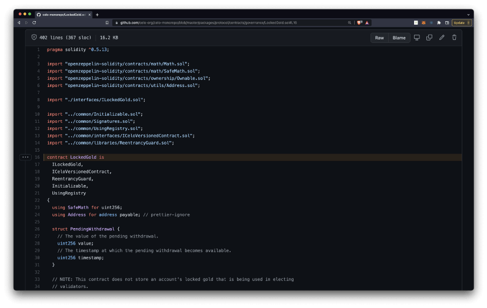

- [Code](https://github.com/celo-org/celo-monorepo/blob/master/packages/protocol/contracts/governance/LockedGold.sol)
- [Blockscout](https://explorer.celo.org/address/0xc683d91656ED9024ADDD7a40A181398E0258283F/transactions)
- [Unit Tests](https://github.com/celo-org/celo-monorepo/blob/master/packages/protocol/test/governance/voting/lockedgold.ts)
- [CLI](https://docs.celo.org/command-line-interface/lockedgold)
- [Docs](https://docs.celo.org/developer-guide/integrations/custody#lockedgold)

```
Address: 0xc683d91656ED9024ADDD7a40A181398E0258283F
```

### Escrow

Utilizes Celo’s Lightweight identity feature to allow users to send payments to other users who don’t yet have a public/private key pair or an address.

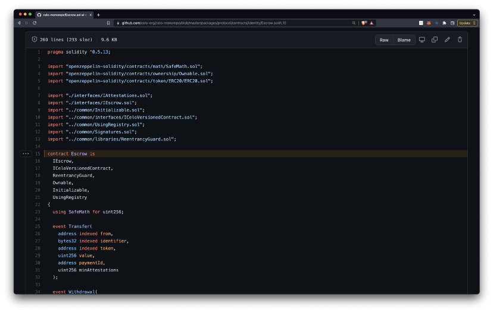

- [Code](https://github.com/celo-org/celo-monorepo/blob/master/packages/protocol/contracts/identity/Escrow.sol)
- [Blockscout](http://0xf4fa51472ca8d72af678975d9f8795a504e7ada5/)
- [Unit Tests](https://github.com/celo-org/celo-monorepo/blob/master/packages/protocol/test/identity/escrow.ts)

```
Address: 0xf4Fa51472Ca8d72AF678975D9F8795A504E7ada5
```

### Exchange

Contract that allows to exchange StableToken for GoldToken and vice versa using a Constant Product Market Maker Model.

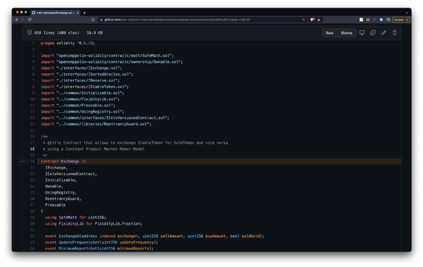

- [Code](https://github.com/celo-org/celo-monorepo/blob/master/packages/protocol/contracts/stability/Exchange.sol)
- [Blockscout](https://explorer.celo.org/address/0x67316300f17f063085Ca8bCa4bd3f7a5a3C66275/transactions)
- [Unit Tests](https://github.com/celo-org/celo-monorepo/blob/master/packages/protocol/test/common/accounts.ts)
- [CLI](https://docs.celo.org/command-line-interface/account)

```
Address: 0x67316300f17f063085Ca8bCa4bd3f7a5a3C66275
```

### FeeCurrencyWhitelist

Holds a whitelist of the ERC20+ tokens that can be used to pay for gas.

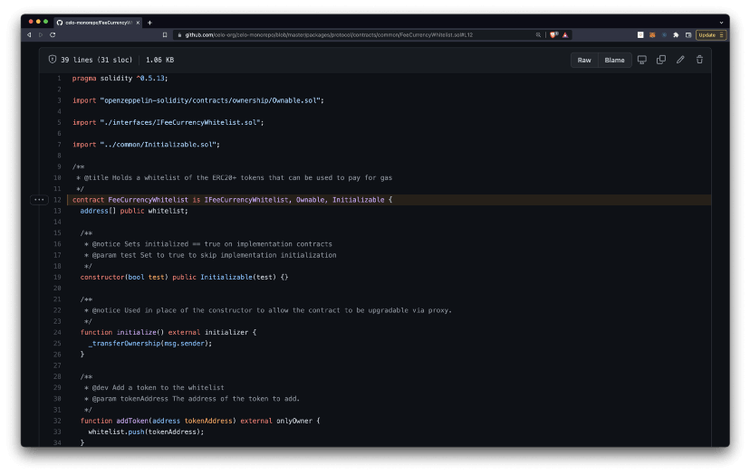

- [Code](https://github.com/celo-org/celo-monorepo/blob/master/packages/protocol/contracts/common/FeeCurrencyWhitelist.sol)
- [Blockscout](https://explorer.celo.org/address/0xBB024E9cdCB2f9E34d893630D19611B8A5381b3c/transactions)
- [Unit Tests](https://github.com/celo-org/celo-monorepo/blob/master/packages/protocol/test/common/accounts.ts)

```
Address: 0xBB024E9cdCB2f9E34d893630D19611B8A5381b3c
```

### GasPriceMinimum

Stores and provides gas price minimum for various currencies.

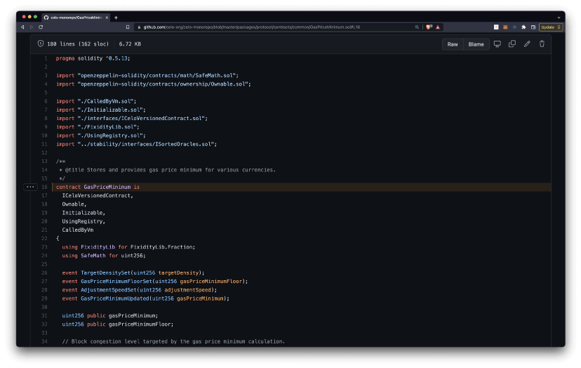

- [Code](https://github.com/celo-org/celo-monorepo/blob/master/packages/protocol/contracts/common/GasPriceMinimum.sol)
- [Blockscout](https://explorer.celo.org/address/0xDfca3a8d7699D8bAfe656823AD60C17cb8270ECC/transactions)
- [Unit Tests](https://github.com/celo-org/celo-monorepo/blob/master/packages/protocol/test/common/gaspriceminimum.ts)

```
Address: 0xDfca3a8d7699D8bAfe656823AD60C17cb8270ECC
```

### GoldToken

Specifies standards for the Celo native asset, known as CELO.


- [Code](https://github.com/celo-org/celo-monorepo/blob/master/packages/protocol/contracts/common/GoldToken.sol)
- [Unit Tests](https://github.com/celo-org/celo-monorepo/blob/master/packages/protocol/test/common/accounts.ts)
- [Blockscout](https://explorer.celo.org/address/0x471EcE3750Da237f93B8E339c536989b8978a438/transactions)

```
Address: 0x471EcE3750Da237f93B8E339c536989b8978a438
```

### Governance

A contract for making, passing, and executing on-chain governance proposals.

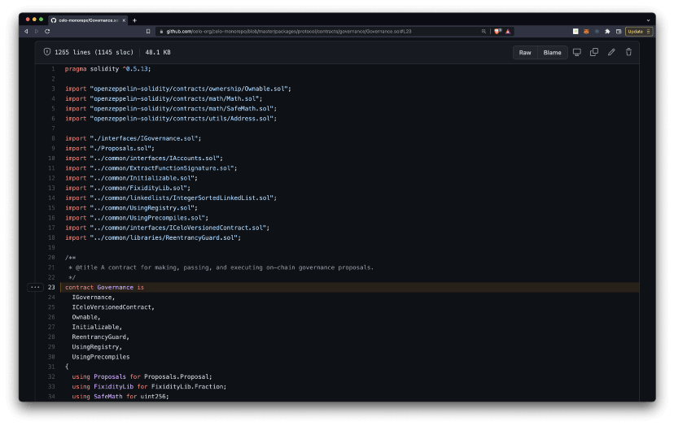

- [Code](https://github.com/celo-org/celo-monorepo/blob/master/packages/protocol/contracts/governance/Governance.sol)
- [Unit Tests](https://github.com/celo-org/celo-monorepo/blob/master/packages/protocol/test/governance/network/governance.ts)
- [Blockscout](https://explorer.celo.org/address/0xD533Ca259b330c7A88f74E000a3FaEa2d63B7972/transactions)

```
Address: 0xD533Ca259b330c7A88f74E000a3FaEa2d63B7972
```

### Granda Mento

A mechanism for exchanging large amounts of CELO for Celo stable tokens that aren’t suitable for [Mento](/protocol/stability/doto) or over-the-counter (OTC).

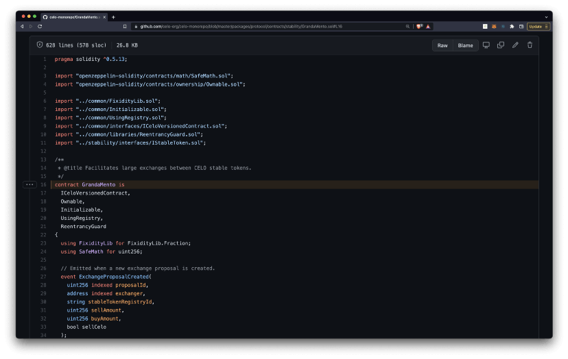

- [Code](https://github.com/celo-org/celo-monorepo/blob/master/packages/protocol/contracts/stability/GrandaMento.sol)
- [Unit Tests](https://github.com/celo-org/celo-monorepo/blob/master/packages/protocol/test/stability/grandamento.ts)
- [Blockscout](https://explorer.celo.org/address/0x03f6842B82DD2C9276931A17dd23D73C16454a49/transactions)

```
Address: 0x03f6842B82DD2C9276931A17dd23D73C16454a49
```

### MultiSig

Allows multiple parties to agree on transactions before execution.

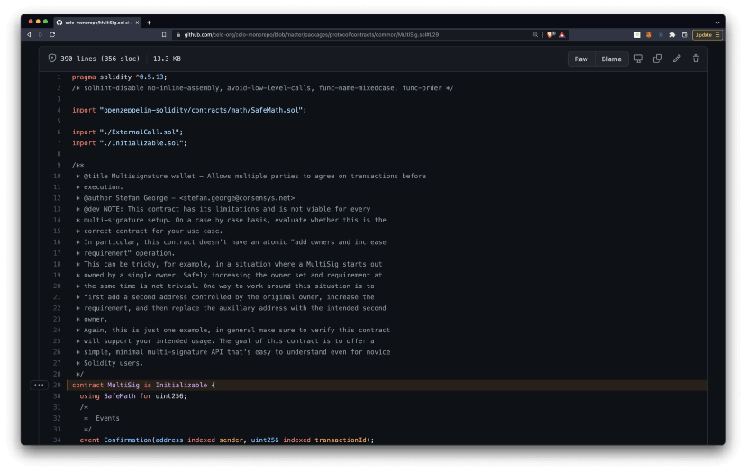

- [Code](https://github.com/celo-org/celo-monorepo/blob/master/packages/protocol/contracts/common/MultiSig.sol)
- [Unit Tests](https://github.com/celo-org/celo-monorepo/blob/master/packages/protocol/test/common/multisig.ts)
- [Blockscout](https://explorer.celo.org/address/0xed68f8B11240249382478631bA0185473984aaf7/transactions)

```
Address: 0xed68f8B11240249382478631bA0185473984aaf7
```

### Random

Provides randomness for verifier selection

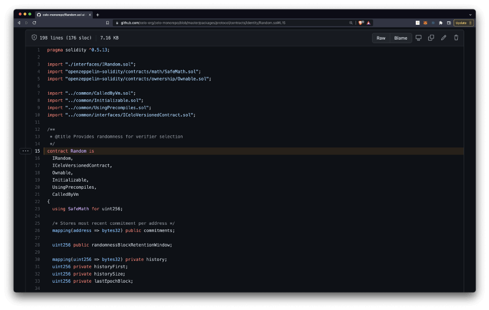

- [Code](https://github.com/celo-org/celo-monorepo/blob/master/packages/protocol/contracts/identity/Random.sol)
- [Unit Tests](https://github.com/celo-org/celo-monorepo/blob/master/packages/protocol/test/identity/random.ts)
- [Blockscout](https://explorer.celo.org/address/0xE43ea9C641a2af9959CaEEe54aDB089F65457028/transactions)

```
Address: 0xE43ea9C641a2af9959CaEEe54aDB089F65457028
```

## Registry

Routes identifiers to addresses.

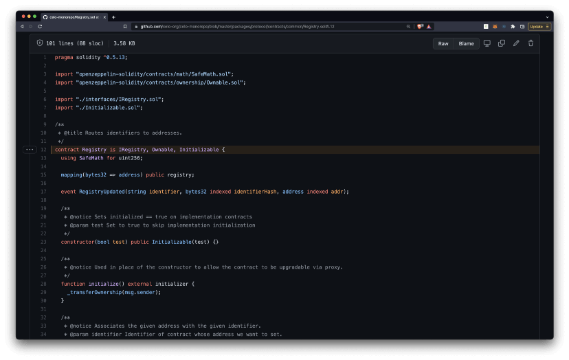

- [Code](https://github.com/celo-org/celo-monorepo/blob/master/packages/protocol/contracts/common/Registry.sol)
- [Unit Tests](https://github.com/celo-org/celo-monorepo/blob/master/packages/protocol/test/common/registry.ts)
- [Blockscout](https://explorer.celo.org/address/0xccF3e2a7c06A515E36F547c6eB563dc8E00d3c08/transactions)

```
Address: 0x203fdf86A00999107Df531fa00b4bA81d674cb66
```

### Reserve

Ensures price stability of StableTokens with respect to their pegs.

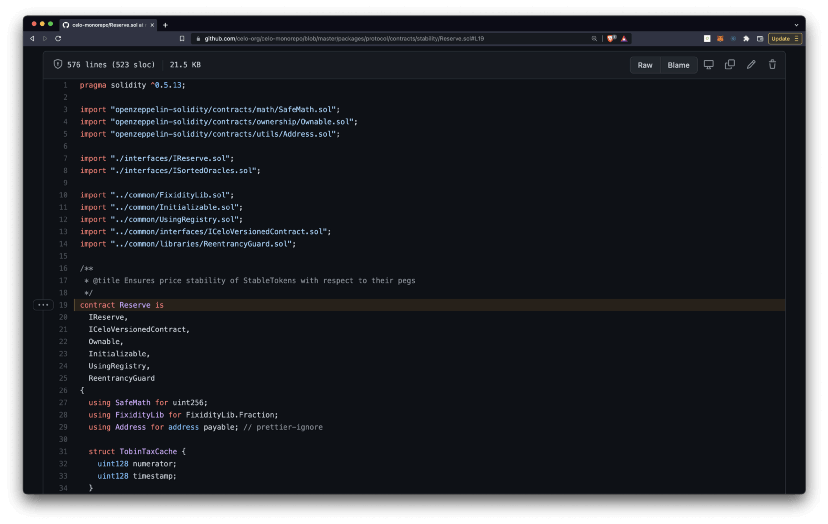

- [Code](https://github.com/celo-org/celo-monorepo/blob/master/packages/protocol/contracts/stability/Reserve.sol)
- [Unit Tests](https://github.com/celo-org/celo-monorepo/blob/master/packages/protocol/test/stability/reserve.ts)
- [Blockscout](https://explorer.celo.org/address/0xc683e6f77B58D814B31F8661331EbDf63785D607/transactions)

```
Address: 0xc683e6f77B58D814B31F8661331EbDf63785D607
```

### SortedOracles

Maintains a sorted list of oracle exchange rates between CELO and other currencies.

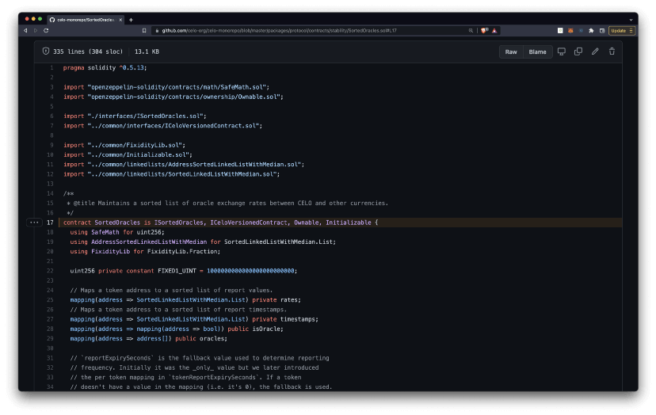

- [Code](https://github.com/celo-org/celo-monorepo/blob/master/packages/protocol/contracts/stability/SortedOracles.sol)
- [Unit Tests](https://github.com/celo-org/celo-monorepo/blob/master/packages/protocol/test/stability/sortedoracles.ts)
- [Blockscout](https://explorer.celo.org/address/0x6CEB70e9237dfE15eDC4A35aAd1598225609d171/transactions)

```
Address: 0x6CEB70e9237dfE15eDC4A35aAd1598225609d171
```

### StableToken

An ERC20 compliant token with adjustable supply.

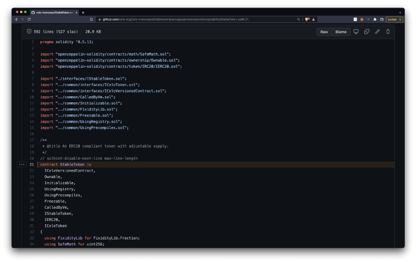

- [Code](https://github.com/celo-org/celo-monorepo/blob/master/packages/protocol/contracts/stability/StableToken.sol)
- [Unit Tests](https://github.com/celo-org/celo-monorepo/blob/master/packages/protocol/test/stability/stabletoken.ts)
- [Blockscout](https://explorer.celo.org/address/0x18E6BFDc909063F7445E410a5495264619495bCB/transactions)

```
Address: 0x18E6BFDc909063F7445E410a5495264619495bCB
```

### Validators

A contract for registering and electing Validator Groups and Validators.

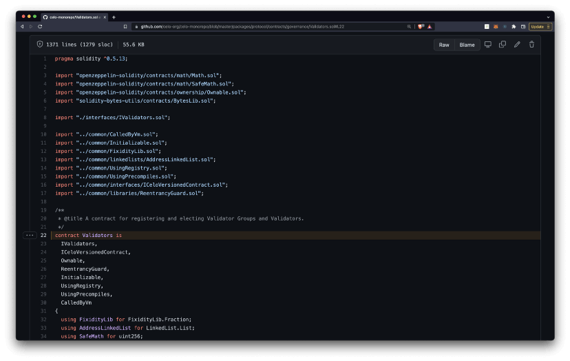

- [Code](https://github.com/celo-org/celo-monorepo/blob/master/packages/protocol/contracts/governance/Validators.sol)
- [Unit Tests](https://github.com/celo-org/celo-monorepo/blob/master/packages/protocol/test/governance/validators/validators.ts)
- [Blockscout](https://explorer.celo.org/address/0x2e3b47Cf3163dE47E852ff11D53a9ad8dFE7C68D/transactions)

```
Address: 0x2e3b47Cf3163dE47E852ff11D53a9ad8dFE7C68D
```

# Congratulations 🎉

That wraps up today’s topic on _Celo Core Contracts_. You can review each of the items we covered below and check that you’re ready to apply these new skills.

**Here’s a quick review of what we covered 🤔**

- ✅ What is the Celo Protocol?
- ✅ Celo Core Contracts
- ✅ Navigating contract resources
- ✅ Core Contract Details

Explore the code, unit tests, block explorer, documentation for any contract you find in the [contracts](https://github.com/celo-org/celo-monorepo/tree/master/packages/protocol/contracts) folder. Hopefully, you’ve learned a few things about \_Getting started with the Celo CLI \_that you can apply in the real world.

GN! 👋
