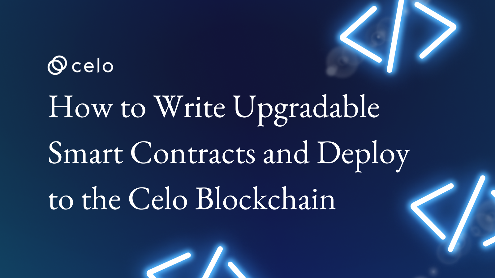

## Introduction

The concept of upgradable smart contracts is very important for blockchain technology. It allows developers to create complex and useful smart contracts that can be upgraded over time.

Upgradable smart contracts allow developers to change the functionality of a deployed smart contract after it has been published on the blockchain. This is done by separating the logic of the contract from its storage, allowing the logic to be upgraded while the storage remains intact.

There are several tools and frameworks that can be used to create upgradable smart contracts, but in this tutorial we will focus on using Hardhat with the OpenZeppelin Upgrades Plugins. Hardhat is a popular development environment for building and testing smart contracts, while the OpenZeppelin Upgrades Plugins provide a simple and secure way to create upgradable smart contracts. [click here](https://docs.openzeppelin.com/upgrades-plugins/1.x/writing-upgradeable) to learn more about openzeppelin upgradable smart contract.

[Click Here](https://github.com/4undRaiser/upgradable-smartcontract-tutorial) to get the full code from the repository

## Requirements

NodeJS 12.0.1 upwards installed.

## Prerequisites

- [Solidity](https://docs.soliditylang.org/en/v0.8.17/)
- [Hardhat](https://hardhat.org/docs)

## Create a New Hardhat Project

The first step is to install Hardhat by running the following command in your terminal:

```bash
npm install --save-dev hardhat
```

Then create a new Hardhat project by running the following command in your terminal:

```bash
npx hardhat init
```

This will create a new Hardhat project with a basic folder structure and some example code

Now that we have a new Hardhat project, the next step is to install the OpenZeppelin Upgrades Plugins. You can do this by running the following command in your terminal:

```bash
    npm install --save-dev @openzeppelin/hardhat-upgrades
```

This will install the necessary packages to use the OpenZeppelin Upgrades Plugins in your project.

### Write Your Upgradable Smart Contract

Now it's time to write your upgradable smart contract. For this tutorial, we'll create a simple smart contract that allows users to store and retrieve a message. We'll call it the MessageContract.

Create a new file called `MessageContract.sol` in the contracts folder of your Hardhat project, and add the following code:

```solidity
// SPDX-License-Identifier: MIT
pragma solidity ^0.8.0;

import "@openzeppelin/contracts-upgradeable/access/OwnableUpgradeable.sol";
import "@openzeppelin/contracts-upgradeable/proxy/utils/Initializable.sol";

contract MessageContract is Initializable, OwnableUpgradeable {

    string private message;

    function initialize() public initializer {
        __Ownable_init();
    }

    function setMessage(string memory _message) public onlyOwner {
        message = _message;
    }

    function getMessage() public view returns (string memory) {
        return message;
    }

}
```

Let's go over the code to see what's happening.

- We import the OwnableUpgradeable and Initializable contracts from the OpenZeppelin Upgrades Plugins.
- We define a new contract called `MessageContract`, which inherits from `Initializable` and `OwnableUpgradeable`. This means we can use the initialize function to set the contract owner, and the `onlyOwner` modifier to restrict access to certain functions to the contract owner.
- We declare a private string variable `message` to store the message.
- We define a function `setMessage()` that allows the contract owner to set the message. This function is restricted to the contract owner by the `onlyOwner` modifier.
- We define a function `getMessage()` that allows anyone to retrieve the message.

## Compile Your Smart Contract

Now that we have written our upgradable smart contract, the next step is to compile it using Hardhat. You can do this by running the following command in your terminal:

```bash
npx hardhat compile
```

This will compile your smart contract and generate the necessary artifacts in the artifacts folder of your Hardhat project.

## Deploy Your Upgradable Smart-Contract

The next step is to deploy your upgradable smart contract to the blockchain. To do this, we will use the OpenZeppelin Upgrades Plugins.

First, create a new file called deploy.js in the scripts folder of your Hardhat project, and add the following code:

```javascript
const { ethers, upgrades } = require("hardhat");
require("@openzeppelin/hardhat-upgrades");

async function main() {
  const MessageContract = await ethers.getContractFactory("MessageContract");
  const proxy = await upgrades.deployProxy(MessageContract, [], {
    initializer: "initialize",
  });
  await proxy.deployed();

  console.log("proxy deployed to:", proxy.address);
}

main().catch((error) => {
  console.error(error);
  process.exitCode = 1;
});
```

Let's go over the code to see what's happening.

- We import the necessary packages from Hardhat and the OpenZeppelin Upgrades Plugins.
- We define an async function called `main()` that will deploy our upgradable smart contract.
- We use `ethers.getContractFactory` to get the `MessageContract` factory.
- We use `upgrades.deployProxy` to deploy the `MessageContract` as an upgradable contract. This function takes three arguments: the contract factory, an array of constructor arguments (which we don't have in this case), and an options object that specifies the initializer function.
- We log the address of the deployed contract to the console.

Next, Open your hardhat.config file and configure it to this.

```javascript
require("dotenv").config();
require("hardhat-celo");
require("@openzeppelin/hardhat-upgrades");

/** @type import('hardhat/config').HardhatUserConfig */

module.exports = {
  solidity: "0.8.17",
  networks: {
    alfajores: {
      url: "https://alfajores-forno.celo-testnet.org",
      accounts: {
        mnemonic: process.env.MNEMONIC,
        path: "m/44'/52752'/0'/0",
      },
      chainId: 44787,
    },
  },
  etherscan: {
    apiKey: {
      alfajores: process.env.CELO_SCAN_API_KEY,
    },
  },
};
```

Go to [Celoscan](https://celoscan.io/), create an account and retrive your api key to be used for verifying our contract on the alfojares testnet.

Add this key and your mnemonic phrase to your environment variable `.env`

This will setup the celo alfajores testnet for deploying

To deploy your upgradable smart contract, run the following command in your terminal:

```bash
 npx hardhat run scripts/deploy.js --network alfajores
```

This will deploy your upgradable smart contract to the Celo Alfajores test network and get a reply like this.
`proxy deployed to: 0x836f66a89081661E2dd6371C8301aB839D8930ed`

## Verifying Your Smart Contract

Run this command below to verify your smart contract.

`npx hardhat verify <CONTRACT_ADDRESS> --network alfajores`

Replace the contract address field with your smart contract address and you should get a reply like this.

```bash
Verifying implementation: 0x09C54B4352C26192Aad999919f1ad27476c301fF
Nothing to compile
Successfully submitted source code for contract
contracts/MessageContract.sol:MessageContract at 0x09C54B4352C26192Aad999919f1ad27476c301fF
for verification on the block explorer. Waiting for verification result...

Successfully verified contract MessageContract on Etherscan.
https://alfajores.celoscan.io/address/0x09C54B4352C26192Aad999919f1ad27476c301fF#code
Verifying proxy: 0xF2CA793b2fcaF9E40D1867D39B4EE5A920ce0DAe
Contract at 0xF2CA793b2fcaF9E40D1867D39B4EE5A920ce0DAe already verified.
Linking proxy 0xF2CA793b2fcaF9E40D1867D39B4EE5A920ce0DAe with implementation
Verifying proxy admin: 0x978641EEC65BFf4C8AFF840ef4438d964c10b503
Contract at 0x978641EEC65BFf4C8AFF840ef4438d964c10b503 already verified.

Proxy fully verified.
```

## Upgrade Your Upgradable Smart Contract

Now that your upgradable smart contract is deployed, you can upgrade it by changing its logic.

To do this, create a new solidity file in contracts folder and name it `MessageContractV2.sol` and paste the code below into the file.

```solidity
// SPDX-License-Identifier: MIT
pragma solidity ^0.8.0;

import "@openzeppelin/contracts-upgradeable/access/OwnableUpgradeable.sol";
import "@openzeppelin/contracts-upgradeable/proxy/utils/Initializable.sol";

contract MessageContractV2 is Initializable, OwnableUpgradeable {


    string public message;
    string public messageTitle;


    function initialize() public initializer {
        __Ownable_init();
    }

    function setMessage(string memory _message) public onlyOwner {
        message = _message;
    }

     function setMessageTitle(string memory _messageTitle) public onlyOwner {
        messageTitle = _messageTitle;
    }

    function getMessage() public view returns (string memory) {
        return message;
    }

     function getMessageTitle() public view returns (string memory) {
        return messageTitle;
    }

}
```

The MessageContractV2 is an upgraded version of a previous contract.

We defines two public string variables: `message` and `messageTitle`. It also includes the `initialize()` function which initializes the contract with the `__Ownable_init()` function from the `OwnableUpgradeable` contract.

The `setMessage()` function sets the value of the `message` variable, and the `setMessageTitle()` function sets the value of the `messageTitle` variable. Both functions can only be called by the contract owner due to the `onlyOwner` modifier.

The `getMessage()` and `getMessageTitle()` functions retrieve the values of the `message` and `messageTitle` variables respectively. They are both public functions and can be called by anyone.

Now let's create script to upgrade our smart contract. Navigate into the scripts folder a create a new javascript file called `upgrade.js` and add the content below into it.

```javascript
const { ethers, upgrades } = require("hardhat");

// TO DO: Place the address of your proxy here!
const proxyAddress = "0x836f66a89081661E2dd6371C8301aB839D8930ed";

async function main() {
  const MessageContractV2 = await ethers.getContractFactory(
    "MessageContractV2"
  );
  const upgraded = await upgrades.upgradeProxy(proxyAddress, MessageContractV2);
  console.log("succesfully upgraded:", upgraded.address);
}

main()
  .then(() => process.exit(0))
  .catch((error) => {
    console.error(error);
    process.exit(1);
  });
```

This code uses the Hardhat framework and the ethers library to upgrade an existing smart contract on the Ethereum blockchain. It obtains a factory instance for the new version of the contract, then upgrades the existing contract to the new version using the upgrades library. If the upgrade is successful, the address of the upgraded contract is logged to the console. If an error occurs, the script exits with an error code.

Note: you have to replace the proxyAddress with the one gotten when you deployed your contract which can be gotten from your terminal.

Next Compile the modified smart contract using the `npx hardhat compile` command, and then run the following command to upgrade your deployed contract:

```bash
npx hardhat run scripts/upgrade.js --network alfajores
```

You should get a reply like this

`succesfully upgraded: 0x836f66a89081661E2dd6371C8301aB839D8930ed`

You can now scan this address on [celoscan](https://alfajores.celoscan.io/) to view your upgrade.

## Testing Your Smart Contract

Lets create a script for testing our smart contract.

Go to the test folder and create a new file called `MessageContract.js` and the following code.

```javascript
const { ethers, upgrades } = require("hardhat");
const { expect } = require("chai");

describe("MessageContractV2", function () {
  let contractV1, contractV2, owner;

  before(async function () {
    [owner] = await ethers.getSigners();

    const MessageContract = await ethers.getContractFactory("MessageContract");
    contractV1 = await upgrades.deployProxy(MessageContract, []);
    await contractV1.deployed();

    const MessageContractV2 = await ethers.getContractFactory(
      "MessageContractV2"
    );
    contractV2 = await upgrades.upgradeProxy(
      contractV1.address,
      MessageContractV2
    );
  });

  it("MessageContractV1: should set a value for the private message variable and retrieve the value", async function () {
    await contractV1.setMessage("Hello World V1");
    expect(await contractV2.getMessage()).to.equal("Hello World V1");
  });

  it("MessageContractV2: Should set a value for both the message title and message variable and retrieve the values", async function () {
    await contractV2.setMessage("Hello World V2");
    await contractV2.setMessageTitle("V2 Title");
    expect(await contractV2.getMessage()).to.equal("Hello World V2");
    expect(await contractV2.getMessageTitle()).to.equal("V2 Title");
  });
});
```

This code is a test script for our two smart contracts - MessageContract and MessageContractV2. The test script ensures that the upgrade from the first contract (V1) to the second contract (V2) was successful.

The first test case checks if the V1 contract can set a value for its message variable and if it can retrieve that value correctly.

The second test case checks if the V2 contract can set values for both its message and message title variables, and if it can retrieve those values correctly.

Then we use the expect statement in both test cases checks if the retrieved values match the expected values. If the retrieved value matches the expected value, the test case passes. If not, it fails.

Run `npx hardhat test` in your code terminal to run the test and all test should pass.

You should get a reply like this on your terminal

```bash
MessageContract Upgrade
  ✔ MessageContractV1: should set a value for the private message variable and retrieve the value (65ms)
    ✔ MessageContractV2: Should set a value for both the message title and message variable and retrieve the values (91ms)

  2 passing (3s)
```

Congrat!! You have Sucessfully upgraded your smart contracts

[Click Here](https://github.com/4undRaiser/upgradable-smartcontract-tutorial) to get the full code from the repository

## Conclusions

In this tutorial, we have gone through the steps to write, compile, deploy, upgrade, and test an upgradable Solidity smart contract using Hardhat and the OpenZeppelin Upgrades Plugins. By following these steps, you should now be able to create your own upgradable smart contracts with confidence.

## About the author

I'm Jonathan Iheme, A full stack block-chain Developer from Nigeria.

Thank You!!
