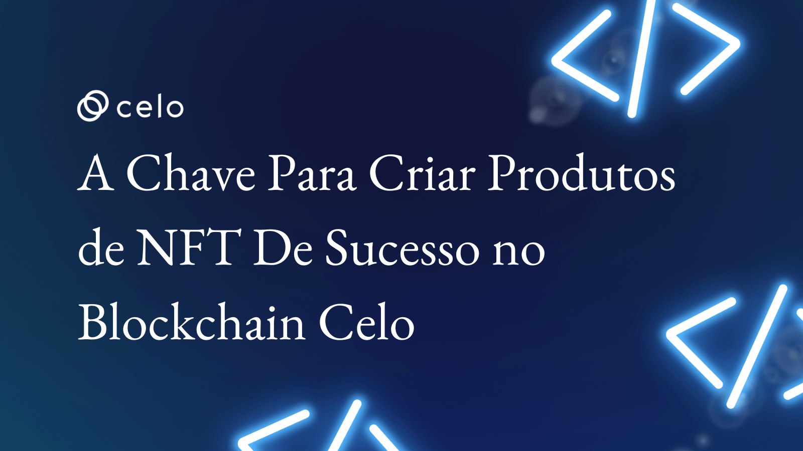

## Introdução

O mercado de blockchain está em constante expansão e crescimento, e com isso, há uma grande oportunidade para desenvolvedores e empreendedores criarem produtos e serviços baseados em NFTs. No entanto, antes de investir tempo e recursos no desenvolvimento de um produto, é importante entender as necessidades do mercado e as oportunidades de negócio disponíveis. É aí que o processo de Product Discovery pode ajudar.

Antes de avançarmos para o Product Discovery, é importante entender dois conceitos importantes relacionados ao universo de gestão de produtos: espaço do problema e espaço da solução.

**Espaço do problema**

O espaço do problema refere-se ao conjunto de problemas e desafios que os usuários enfrentam e que o produto deve resolver.

- O foco aqui é: Atacando o problema certo.

**Espaço da solução**

O espaço da solução, por outro lado, é a combinação de recursos, funcionalidades e benefícios que o produto oferece para resolver esses problemas.

- O foco aqui é: Construindo a solução certa.

Em outras palavras, o espaço do problema é o ponto de partida para o desenvolvimento do produto, uma vez que é a compreensão dos problemas e desafios dos usuários que orienta a concepção do produto. O espaço da solução, por sua vez, é o resultado do processo de design, onde o produto é criado para atender às necessidades dos usuários, resolvendo os problemas que eles enfrentam.

Por exemplo, se uma empresa está desenvolvendo um aplicativo de gerenciamento financeiro pessoal baseado no blockchain Celo, o espaço do problema pode incluir a dificuldade que as pessoas têm em controlar suas finanças, manter orçamentos e economizar dinheiro. O espaço da solução pode incluir recursos como categorização automática de transações, alertas de gastos excessivos e dicas de economia de dinheiro.

Entender o espaço do problema e o espaço da solução é essencial para o sucesso do produto. A partir da compreensão do espaço do problema, a empresa pode criar um produto que atenda às necessidades dos usuários e ofereça valor significativo. Ao entender o espaço da solução, a empresa pode garantir que o produto ofereça os recursos e funcionalidades necessários para resolver os problemas que os usuários enfrentam e proporcionar uma experiência de usuário satisfatória.

O Product Discovery é um processo que transita entre os dois espaços. Mas afinal, o que é e para que serve?

## Product Discovery

O Product discovery é um processo de pesquisa e descoberta usado para identificar as necessidades, desejos e expectativas dos usuários e, em seguida, criar um produto que atenda a essas necessidades. É um processo iterativo que envolve uma série de atividades, como análise de mercado, dados quantitativos e qualitativos, entrevistas com usuários, testes de protótipos e análise de concorrentes. O objetivo do Product Discovery é garantir que a empresa crie um produto que resolva um problema com demanda real no mercado e atenda às necessidades dos usuários.

-------

Segundo Marty Cagan, empreendedor e autor dos livros Inspired e Empowered: “Product Discovery é um conjunto de atividades usado para responder perguntas sem respostas com a intenção de mitigar riscos”.

**E quais são esses riscos mencionados por Marty Cagan?**

**Risco de valor:**
Estamos atacando um problema real? Conhecemos o problema/oportunidade?

*Tem valor para o usuário?*

**Risco de usabilidade:**

Está claro para o usuário? Ele saberá usar?

*O usuário entenderá?*

**Risco de execução:**

Nós temos o conhecimento técnico para fazer?

*Temos capacidade?*

**Risco de viabilidade:**

A solução gera risco ou valor ao negócio?

*Tem valor para o negócio?*

-------

Antes de qualquer coisa, é necessário ter em mente um problema ou oportunidade que gostaria de abordar como ponto de partida de seu discovery.

**O processo de Product Discovery possui algumas macros etapas. São elas:**

**Etapa 1: Entender o mercado**

A primeira etapa do processo de Product Discovery é entender o mercado em que se deseja operar.

O mercado de NFTs ainda é novo e em constante evolução. Pensar em produtos envolve pesquisar e entender as tendências atuais e desafios do mercado, as melhores práticas, prováveis concorrentes, os produtos e serviços existentes, e as necessidades não atendidas.

Uma forma de fazer isso é pesquisando os principais players no mercado de NFT, redes sociais, fóruns e os projetos na comunidade Celo para ver o que as pessoas estão discutindo e quais são suas preocupações e desejos.

Também é importante pesquisar plataformas e coletar dados de mercado para identificar oportunidades de negócios de NFTs. Tais oportunidades podem incluir a criação de novos tipos de tokens, o desenvolvimento de produtos complementares, ou até mesmo a entrada em novos mercados.

Ao entender o mercado nos preparamos para identificar nosso nicho, público-alvo e suas necessidades, buscando construir produtos que tratem uma dor e que permaneçam competitivos no mercado.

**Etapa 2: Definir as personas de cliente**

A próxima etapa do processo de Product Discovery é definir as personas de clientes. Uma persona de cliente é uma representação fictícia do seu cliente ideal, baseada em dados e pesquisas de mercado. Isso ajuda a entender melhor quem são seus clientes e quais são suas necessidades, desejos e preocupações com base em um nicho de atuação.

Para produtos de NFTs, as personas de cliente podem ser colecionadores de arte, investidores em criptomoedas, jogadores de videogame, fãs de esportes, entre outros. Ao entender as personas de cliente, é possível direcionar melhor o desenvolvimento do produto e garantir que ele atenda às necessidades e desejos do público-alvo.

**Os principais questionamentos aqui são:**

- Qual é o nicho de partida que meu produto vai atuar?
- Como é o perfil de cliente ideal que meu produto atenderá?

Além de características relacionadas aos perfis comportamental e emocional de seu público-alvo, considere também informações demográficas.

Com o entendimento do mercado e perfil ideal, é hora de identificar as necessidades do público-alvo.

**Etapa 3: Identificar os problemas e necessidades do cliente**

A terceira etapa do processo de Product Discovery é identificar os problemas e necessidades do público-alvo. Isso envolve fazer perguntas como:

- Quais são as dores e frustrações dos perfis mapeados na etapa anterior?
- Quais são seus objetivos e desejos?
- Quais são os problemas que eles estão tentando resolver?
- Quais são as oportunidades de negócio não atendidas no mercado?

Tais perguntas podem ser respondidas por pesquisas qualitativas, de mercado e análise de Jobs-to-be-done.

Realize também entrevistas com usuários que correspondam às personas que identificou. As entrevistas podem ajudá-lo a entender as necessidades dos usuários, bem como os problemas que eles enfrentam ao usar produtos similares. Certifique-se de fazer perguntas abertas e deixe o usuário falar sobre suas experiências.

Identifique os problemas que o seu público-alvo enfrenta no mercado de NFT atual e como o seu produto pode ajudar a resolvê-los.

A resposta dessas perguntas vai ajudar a definir as funcionalidades e características do produto.

**Etapa 4: Gerar ideias de produto**

A quarta etapa do processo de Product Discovery é gerar ideias de produto com base nas necessidades e desejos identificados na etapa anterior. Isso pode envolver a criação de novos produtos de NFTs ou a melhoria de produtos existentes.

Uma técnica simples e útil para gerar ideias de produto é a sessão de brainstorming. Nessa sessão, membros da equipe se reúnem para gerar o maior número possível de ideias sem julgá-las. Posteriormente, essas ideias são avaliadas e refinadas.

Com base nas necessidades do público-alvo e nas oportunidades identificadas no mercado, defina as funcionalidades e características da primeira versão de seu produto.

- Qual solução melhor atenderia os problemas / oportunidades mapeadas para o público identificado?
- Quais funcionalidades e características serão incluídas no produto?
- Quais serão as prioridades?

**Etapa 5: Priorizar as ideias de produto**

A quinta etapa do processo de Product Discovery é priorizar as ideias de produto geradas na etapa anterior. Basicamente, isso envolve avaliar cada ideia com base em critérios como viabilidade técnica, custo de desenvolvimento, potencial de mercado e adequação ao público-alvo mapeado anteriormente.

Uma técnica comum para priorizar ideias de produto é o método de Pontuação de Recursos. Nesse método, cada ideia é avaliada em uma escala de 1 a 10 com base em critérios como dificuldade técnica, potencial de mercado e adequação às personas de cliente. As ideias com a maior pontuação são priorizadas para o desenvolvimento.

Essa definição vai ajudar a estabelecer uma estratégia para o desenvolvimento do produto, incluindo um roadmap e um plano de ação.

**Etapa 6: Desenvolver um MVP (Minimum Viable Product)**

A sexta etapa do processo de Product Discovery é desenvolver um MVP (Minimum Viable Product). Um MVP é a versão mais simples do produto que pode ser lançada para testar sua viabilidade no mercado. Ele deve incluir apenas os recursos essenciais para resolver o problema identificado na etapa de necessidades do cliente. O MVP pode então ser refinado e expandido com base no feedback dos clientes. Isso pode ajudar a minimizar o risco e garantir que a empresa esteja criando um produto que atenda às necessidades dos usuários.

Porém, antes mesmo de lançar seu MVP, selecione um grupo de usuários que sejam representativos do seu público-alvo e peça-lhes para testar o produto. Isso vai ajudar a identificar problemas e melhorar a experiência antes de investir tempo e recursos no desenvolvimento de um produto. Os testes podem ser feitos com protótipos ou versões beta do produto.

**Diferenças entre protótipo e MVP**

Um protótipo é uma representação inicial do produto, geralmente com base em wireframes ou mockups. O objetivo de um protótipo é testar a funcionalidade e a usabilidade do produto antes de ser desenvolvido totalmente. Um protótipo pode ser interativo e permitir que os usuários testem a navegação e a funcionalidade do produto. É uma maneira eficaz de coletar feedback e iterar rapidamente antes de começar o desenvolvimento de seu MVP.

Um MVP é uma versão inicial do produto que contém o mínimo de recursos necessários para ser lançado no mercado e para testar a demanda. Geralmente, um MVP tem uma funcionalidade básica e é limitado em recursos, mas deve ser funcional e atender às necessidades dos usuários. O objetivo de um MVP é coletar feedback e validar hipóteses sobre o produto e o mercado, para que o produto possa ser aprimorado com base nessas informações.

## Conclusão

O processo de Product Discovery é uma metodologia importante para entender as necessidades do mercado e as oportunidades de negócio disponíveis para produtos de NFTs.

Lembre-se de que o processo de Product Discovery é iterativo e deve ser repetido continuamente à medida que novas informações são obtidas e novas oportunidades de negócio surgem. Com isso, você pode criar produtos de NFTs bem-sucedidos que atendam às necessidades do mercado e proporcionem uma experiência de usuário valiosa, garantindo sua competitividade.

Além disso, é importante ter em mente que o desenvolvimento de produtos de NFT no blockchain da Celo requer uma compreensão sólida dos princípios e tecnologias de blockchain, incluindo a arquitetura do Celo e suas características únicas, como a escalabilidade, a segurança e a governança. É recomendável fazer uma pesquisa aprofundada sobre esses tópicos antes de começar a desenvolver um produto de NFT no blockchain da Celo.

## Próximos passos

Sugiro ler também o artigo [Como usar a metodologia de gestão de produtos para criar soluções com NFT](https://docs.celo.org/blog/tutorials/como-usar-a-metodologia-de-gestao-de-produtos-para-criar-solucoes-com-NFT).

Aqui você pode acessar outros artigos sobre [NFT](https://docs.celo.org/tutorials?tags=nft).

## Sobre o Autor

Entrepreneur and product leader building digital products and experiences with data, technology and people.

[LinkedIn](https://www.linkedin.com/in/evelyncordeiro/)
