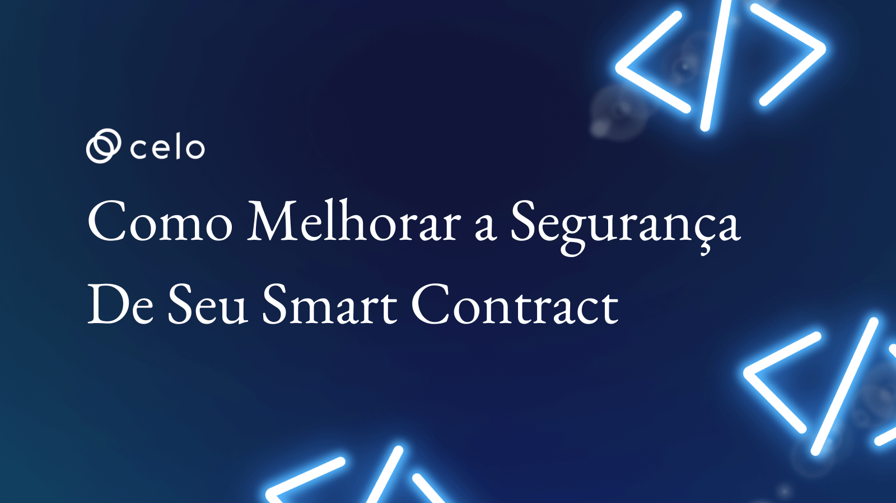
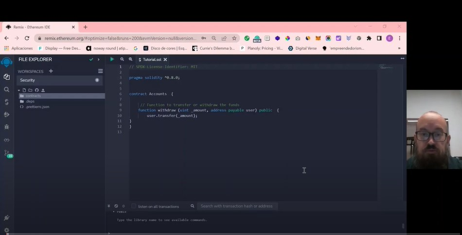

## Introdução

Bem-vindo a este video onde discutiremos várias medidas de segurança que podem ser implementadas em contratos inteligentes para garantir a segurança de seus ativos e impedir ataques maliciosos. Abordaremos uma série de tópicos, incluindo proteção contra reentrância, proteção contra overflow e underflow, mecanismo de bloqueio ou atraso de tempo para saques, lista branca, mecanismo à prova de falhas, sistema de monitoramento, ataques de phishing, front-running, ataques de replay de transação, ataques de negação de serviço, reordenação de transações e censura de transações.

Todos esses tópicos são críticos para garantir a segurança de contratos inteligentes e sistemas baseados em blockchain. Conforme exploramos cada tópico, não apenas discutiremos os conceitos subjacentes, mas também forneceremos um guia passo a passo sobre como implementar essas medidas de segurança em seus contratos inteligentes.

Para garantir que as informações sejam acessíveis criei um video como codificar cada medida de segurança. Seja você novo na tecnologia blockchain ou um desenvolvedor experiente, este video é para todos que desejam aprender mais sobre como proteger contratos inteligentes.

## Pré-requisitos

Para este tutorial não é necessário conhecimento prévio. As ferramentas utilizadas serão:

- Remix: [Remix](https://remix.ethereum.org/) é uma Integrated Development Environment (IDE) para desenvolvimento de smart contracts na blockchain Ethereum. Ele fornece uma plataforma fácil de usar para escrever, testar e depurar smart contracts escritos na linguagem Solidity. Além disso, a IDE Remix também fornece ferramentas para simular e executar smart contracts em diferentes ambientes de rede, incluindo a rede principal Ethereum e redes de teste. Ele é uma ferramenta popular entre desenvolvedores de smart contracts, pois oferece recursos avançados para facilitar o desenvolvimento e teste de contratos inteligentes.

## Tutorial

Confira no video como melhorar a segurança de seu smart contract

## Conclusão

Parabéns! Você concluiu o tutorial e agora sabe como melhorar a segurança de seu smart contract no blockchain da Celo 🎉 .

## Próximos passos

Como próximos passos sugiro a você consultar outros [videos](https://docs.celo.org/tutorials?tags=video).

Além disso, convido você a ver nossos próximos conteúdos em português.

## Sobre o Autor

Eu sou um empreendedor serial, founder da Guizo Studios e sempre disponível para ajudar o ecossistema Celo.

[LinkedIn](https://www.linkedin.com/in/ewertonlopes/)
