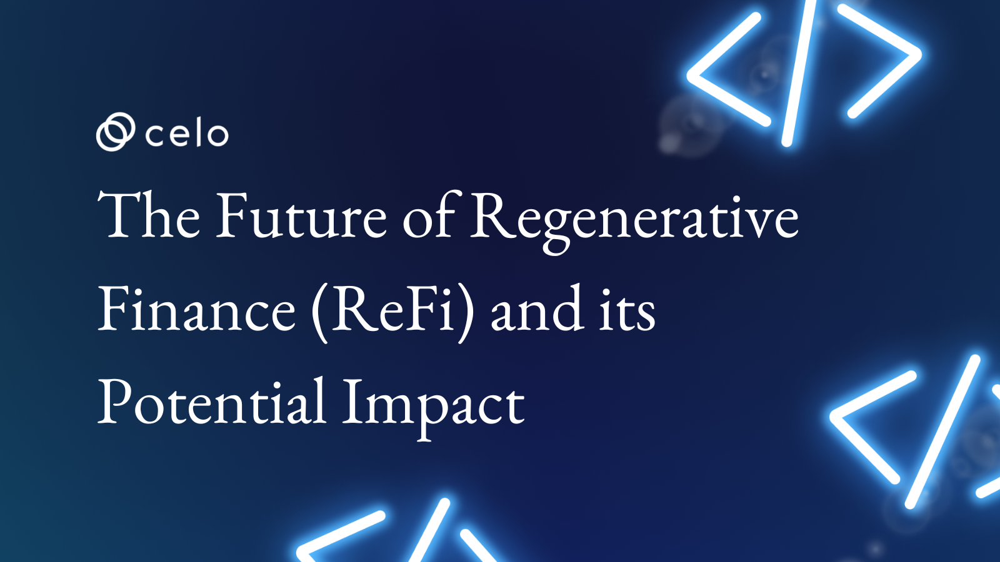
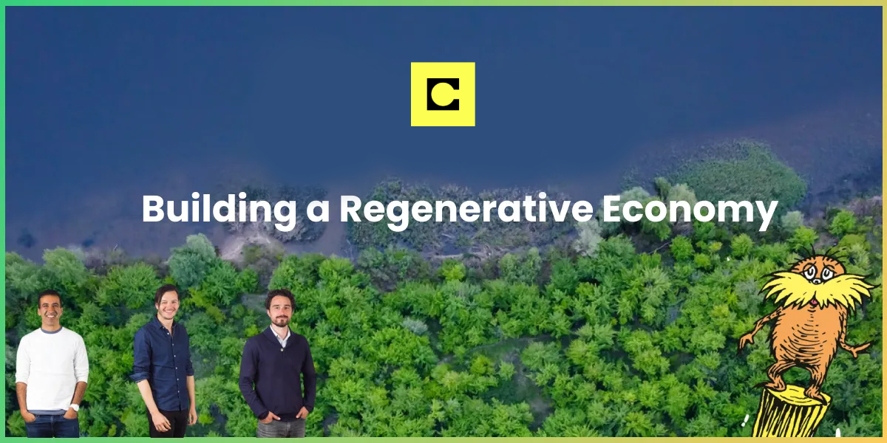
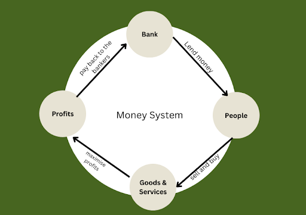
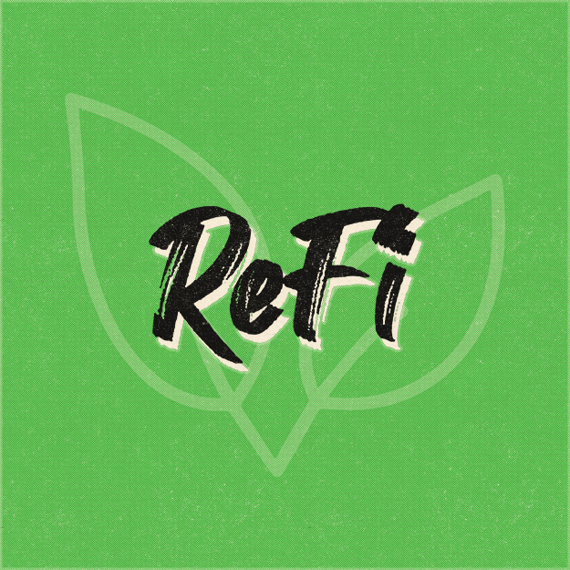
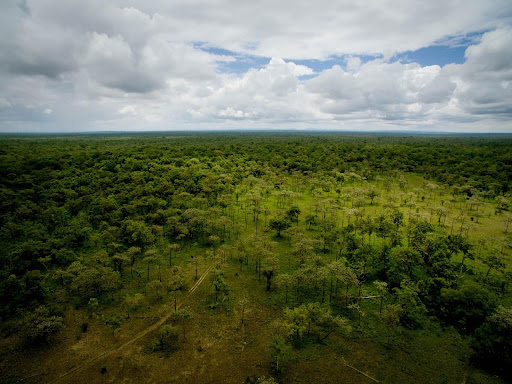

## Introduction

Regenerative finance has gained a big platform over the recent years because of its sustainable approach towards the financial industry. This has become increasingly necessary towards addressing problems associated with traditional finance and its impact on the environment and society.

In this article, we will explore Celo’s mission and how it's committed to building a regenerative world, its potential impact, and the future of ReFi. we will further explore the challenges, the potential impact of ReFi and different use cases in the Celo ecosystem.

## Celo’s Mission and ReFi

*Image Source: [notboring.co](https://bit.ly/3x2z5cS)*

Celo is a mobile-first blockchain that makes decentralised financial (DeFi) tools and services accessible to anyone with a mobile phone, anywhere in the world. It’s unique in many ways, with features like a family of stablecoins (cUSD, cEUR, and cREAL), phone number mapping, and many others.

Celo is a carbon-negative, EVM-compatible layer 1 blockchain. With its architecture, the Proof-of-Stake (POS) consensus algorithm requires a tiny fraction of the energy usage. At its capacity, the Celo network could process up to 7 million transactions per ton of CO2 emitted by its infrastructure, which is why Celo is becoming the home of regenerative finance (ReFi).

Various communities are taking shape in the ReFi sector with the same purpose in mind: to use blockchain technology to address sustainability challenges. ReFi shows a global financial system that eliminates capitalism's power in society. It creates a self-sustaining engine for the greater benefit, aligning with Celo’s mission of building a regenerative digital economy that creates conditions of prosperity for all.

The foundations of Celo’s vision are based on connectedness, unique purpose, theory of change and sacred economics that introduces us to ReFi;

### Connectedness

Celo envisions a worldwide interconnected society where people live inside a healthy and joyful whole, where they are healthier and happier, and where they are a member of a strong social collective with meaningful interactions. Celo aims to link individuals and their communities globally.

### Unique Purpose

Every individual has a distinct path and purpose, and personal fulfilment of that path is dependent on the tools and abilities to which people have access. Celo aspires to create a world in which everyone has equal access to conditions that create prosperity for everyone.

### Theory of change

We believe that short-term actions have a long-term impact on society, people, and the environment. Celo bases this mindset to guide every ecosystem project to have the greatest impact.

### Sacred Economics

The idea was first introduced in Charles Eisenstein's book Sacred Economics. If you back the money with more things you want to see in the world, you will get more of those things.

Modern approaches to the economy have contributed to scarcity, competition, and the destruction of our communities and the natural world. However, we want to use our economy for good: to create connected, ecological, and sustainable ways of living.

When you take a look at the current money systems, scarcity and growth are built into them as interest-bearing debt. Banks don't let someone who doesn't create goods and services get a share of these resources. The money goes towards those who will create more of it.

For economic growth to happen in different communities and societies, we have to find something that was once free and natural and make it a good, or was once a gift relationship and make it into a service. You have to find something that people once got for free or did for themselves for each other and take it away and sell it back to them somehow.

Money facilitates, tracks, and shapes economic activity. People produced more gold when money was backed by gold to have more money to spend on other things. If money can be created through central bank lending at an interest rate, it forces the economy to grow, to repay ever-increasing debts. Money enables humans to coordinate, communicate, and translate assets, distances, and time.

[Consider](https://www.notboring.co/p/celo-building-a-regenerative-economy?s=r) one of the natural capital assets that could be used to back a currency: rainforests. The rainforest is essentially a limited and valuable resource. It can be used as a reserve asset, supporting currencies in the same way as gold is used to back the US dollar. The difference is that gold can be melted into bars, put in a vault somewhere, and readily be recorded and counted; rainforests, on the other hand, must stay where they are to be valued and are considerably more difficult to track. This has been accomplished, however, with the use of current technology such as satellites, improved sensors, and artificial intelligence.

But how does ReFi align with this?

ReFi largely focuses on correcting the results of traditional finance, which frequently puts a higher priority on short-term profits or returns than on the impact it has on the community and does not take into account the effects of traditional finance investments. ReFi, however, focuses on supporting regenerative initiatives like sustainable infrastructure, regenerative agriculture, and renewable energy.

## Understanding ReFi

*Image Source: [HackerEarth](https://s3-ap-southeast-1.amazonaws.com/he-public-data/Build-with-Celo-Prizes-ReFi0dde910.jpg)*

Many researchers have described ReFi in many ways. According to [ReFi DAO](https://www.youtube.com/@refidao), ReFi is an exploration into how we can redesign money to be in greater harmony with the earth.
Other researchers, define ReFi as a form of using money to solve systematic problems for the good of the community. But how do you redesign money to use it for the good of the community?

When you look at the [concept of money](https://www.youtube.com/watch?v=2xo43tkr1TY&t=311s), it has its revolution that started way back in communities, tribes and societies, from barter trade systems, when farmers exchanged their harvest and crops, for example, milk from cow pastoralists.

However, this flow of value changed over time, which was observed at a human-to-human level without accounting for things we were creating with and where they came from. Money as a form of value was established and used as a mechanism of value or something you can receive, or able to get what you want and vice versa.

For example, a farmer can keep their money in summer and can spend it the next winter, without worrying about their natural assets or community resources losing value, or even worrying about exchanging chicken, even in divisible pieces, to get an exact value in form of litres of milk in a barter trade system.

Money as a form of value keeps in supply and costs the creation of new goods and services and these goods and services come from natural resources, community resources, and social resources with a cost of things that are not being accounted for in the system.

Nature and natural resources around us have been unaccounted for and excluded. For example, by cutting down a tree nearby for firewood, there is no way for you to account for or give back to the tree or the forest. A forest doesn't have money to pay for the things that they want to see taken care of.

There has been a unidimensional one-way flow of value creation i.e. from natural capital to great goods and services, where the entities responsible for the creation and distribution of money have been centralized i.e governments, government institutions, banks etc and now we are at the point where things are starting to change when you look at what’s happening through internet solutions by giving power back to the people in terms of the flow of information and other aspects like value and how its accounted for.

Web3, in particular, decentralized finance resulting from regenerative economics has provided us with tools to redesign money in a sustainable way towards our environment and account for things that may cost us in many ways towards human life.

Refi values money and wealth, which often come at the expense of people and the planet. In Refi, profits are used to replenish our planet’s ecosystems so that they can continue to support life and address our pressing social issues of justice and inequity.

Some of the challenges ReFi is tackling include climate change, biodiversity loss, resource scarcity, and the underlying socio-economic and institutional structures that exacerbate these crises in different societies.

## ReFi use cases that can lead to a beautiful world

### Tokenization of Assets & Carbon Markets

Tokenization of assets refers to the act of producing digital tokens that represent ownership of a real-world asset, e.g. land, buildings, and other types of property. These digital tokens can then be traded or transferred over a blockchain network, allowing asset buying, selling, and investment more efficient and transparent.

For example, in the context of ReFi, the tokenization of assets, can enable more flexible and accessible financing. A property owner may issue digital tokens representing ownership,  instead of obtaining a typical mortgage from a bank, which could subsequently be sold to investors seeking a new way to engage in real estate. This can benefit both property owners and investors by providing increased liquidity and quicker access to finance.

ReFi has the potential to create a thriving and liquidity carbon credit market by providing a platform for buyers and sellers to interact directly, eliminating the need for intermediaries, unlike traditional finance. In carbon markets, blockchain technology can also provide transparency, and easy traceability, and increase the inclusivity and accessibility of carbon markets.

What Web3 and blockchain technology do is, open up entirely who has access and the level of transparency and liquidity that can be brought to these credits at the deepest fundamental level.

> Carbon credits and agricultural credits are some of the best use cases for blockchain technology that should be tokenized in particular because it adds a true transparency layer into where those credits came from, where they're going, and who is using them. It also opens up access to who can control them - Phil Fogel, [FlowCarbon](https://www.youtube.com/watch?v=gSpGF2c-nHs&ab_channel=Celo)

### Universal Basic Income (UBI)

[Universal basic income](https://en.wikipedia.org/wiki/Universal_basic_income) (UBI) is a social welfare proposal in which all citizens of a given population regularly receive a guaranteed income in the form of an unconditional transfer payment (i.e., without a means test or need to work).

UBI proposes providing every person or citizen of a community or country with a regular unconditional income. The distribution can vary depending on the specific methodologies. The goal of UBI is to eradicate poverty and provide economic security. The best example use case in the Celo ecosystem is [Impact Market.](https://www.impactmarket.com/)

### Natural Capital-Backed currencies

According to Charles Eisenstein's book Sacred Economics, If you back the money with more things you want to see in the world, you will get more of those things.

### Community Currencies, or a network of local currencies

Community currencies can instantly unlock access for everyday uses like low-cost remittances and cross-border payments, global distribution of charitable aid, effortlessly payments done online, or transferring value within exchanges, particularly in markets subject to currency volatility.

The best example is a family of [stablecoins](https://docs.celo.org/learn/platform-native-stablecoins-summary#:~:text=Stable%20with%20Celo%E2%80%8B,easily%20on%20your%20mobile%20phone.) in the Celo ecosystem i.e cUSD, cEUR, cREAL and many others to come.

## How does ReFi differ from traditional finance?

The major difference between regenerative and traditional finance is in their goals and priorities.

In traditional finance, success is defined by the financial return on capital, while any positive social or environmental impacts that may occur are a by-product. Incentives in the traditional financial system are set to maximize profit and to see money as a goal rather than as a tool.

Traditional finance primarily focuses on financial returns and generating profits for investors. It also often results in investments that prioritize short-term gains over long-term sustainability and may ignore the social and environmental impacts of the investments being made.

On the other hand, the success of ReFi is to make positive change possible, with the financial return as an inevitable secondary result. The goal of ReFi is not specifically about raising profits. It is to be used as a means to create shared value and to further sustainable progress.

ReFi uses financial resources as instruments to regenerate natural environments, help communities, and overcome systemic problems.

Most financial institutions’ processes typically ignore the impact on the environment and social factors. Unlike traditional financing, ReFi considers all stakeholders' views in the decision-making process, thereby redistributing economic control to entities that have invested the most and are likely to face the outcomes.

In general, ReFi is a larger strategy that considers the impact of investments on a wide range of stakeholders, including communities, the environment, and future generations, rather than focusing primarily on financial returns, as the traditional finance industry does.

## Potential Impacts of ReFi

### Decentralization of Finance

Decentralized finance differs from traditional, centralized financial institutions and banking. In centralized finance, money is held by central banks and third parties who facilitate money movement between two parties.

Financial transactions in decentralized finance (DeFi) are handled on blockchain-based platforms that are transparent, secure, and trustless. This means that users can deal with one another without the assistance of intermediaries such as banks or payment processors hence making accountability easy and open for anyone in the ReFi space.

> Any DeFi product that is to succeed in these new conditions(regenerative economics and decentralized finance) must solve for two fundamental principles: the creation of new value and institutional use cases. ReFi is uniquely positioned to address both of these” - [FlowCarbon](https://www.flowcarbon.com/knowcarbon/regenerative-finance-is-the-future-of-web3)

### Increased access to capital

DeFi has the potential to increase and open access to capital for anyone with an internet connection without intermediaries, enable cross-border transactions, and lower fees compared to traditional services thereby serving the unbanked, underserved and excluded communities.

### Support for sustainable and regenerative practices

*Image source: [ClimatePromise](https://climatepromise.undp.org/sites/default/files/styles/large_2x/public/callout_image/thumbnail_Aerial%20view%20of%20forests%2C%20Lao%20PDR%2C%202016_Credit%20UNDP%20-%20Source%20UNDP%20EBD%20Flickr.jpg?itok=7zgyvuiG)*

ReFi supports sustainable and regenerative practices through different approaches that prioritise the environment with financial returns, for example, positive screening(identifying companies and projects that have a positive social impact on the environment), impact measurement, long-term focus(investments designed to have a positive impact over a long run), and community engagement(companies and projects actively engaging the communities where they operate to ensure friendly environmental outcomes).

By following these approaches, ReFi can shape and build a more sustainable and friendly economy for future generations to come.

### Alignment of financial and ecological goals

The 2030 Agenda is a plan of action for people, the planet and prosperity. It provides, with the SDGs, universal goals and targets or a blueprint to achieve a better and more sustainable future for all.

Generally, regenerative finance integrates financial and ecological goals by investing in initiatives and businesses that emphasize the health and resilience of both the natural environment and human communities, as well as by investing over time and using an ecosystem-based approach.

ReFi aligns with UN SDGs, in particular, those related to conserving the environment, by prioritizing and investing in companies or projects that promote and apply sustainable and regenerative practices.

ReFi recognizes [SDG Aligned Finance](https://www.oecd.org/development/financing-sustainable-development/Framework-for-SDG-Aligned-Finance-OECD-UNDP.pdf) in many ways and supports projects with practices that align with the SDGs to foster long-term quality investment. For example, Refi invests in projects that promote SDG 6, 7, 12, 13, 14 and 15 thereby contributing to the conservation of the environment, reducing greenhouse emissions and promoting a more sustainable future.

### Driving innovation

ReFi accelerates innovation in many ways through contributions to the development of new sustainable technologies, circular economy initiatives, regenerative agricultural practices, etc which are driving innovation and promoting a sustainable future. For example [carbon markets](https://climatepromise.undp.org/news-and-stories/what-are-carbon-markets-and-why-are-they-important). One tradable carbon credit equals one tonne of carbon dioxide or the equivalent amount of a different greenhouse gas reduced, sequestered or avoided.

## Challenges still facing ReFi

### Lack of understanding and awareness

The complexity of financial tools or products makes it difficult to assess the alignment with regenerative goals. This is due to a lack of awareness and understanding of what regenerative finance is, and how it differs from traditional finance.

### Regulatory barriers

Certain policies favour traditional financial models over regenerative finance models, making regenerative finance efforts more difficult to implement.

### Failure to capture widely accepted metrics

ReFi is still a new concept, and there are no defined criteria or evaluation frameworks in place to assess its impact. This has made its potential impact, evaluation, and its value of efforts to the funders and stakeholders difficult.

The problem, according to [Ben Caldecott](https://www.smithschool.ox.ac.uk/people/bcaldecott.html), Director of the Oxford Sustainable Finance Programme, is one of data capture. While other industries, such as commerce, media and even professional sports, have been transformed by big data, our understanding of how business decisions affect the environment is still out-of-date. Caldecott believes technologies such as AI and machine learning can be put in place to [develop accurate sustainability metrics](https://www.weforum.org/agenda/2018/09/data-capture-not-disclosure-is-the-way-to-meet-our-climate-goals/), steering companies toward a more sustainable future.

### Technological limitations

Technology has its own potential limits towards ReFi, i.e. technology has limited access or the ability to bridge the gap to financial capital or knowledge, algorithmic bias resulting from technological tools that are trained on past data that make financial decisions and end up reflecting systemic issues, inequalities and biases in finance

## Examples of ReFi initiatives or use cases

### FlowCarbon

[Flow Carbon](https://www.flowcarbon.com/) is accelerating decarbonization through the preservation and protection of the earth’s natural ecosystems, which are among the most immediate and cost-effective carbon sinks while investing in longer-term carbon removal and reduction projects.

Flowcarbon is creating infrastructure to tokenize carbon offset units(COUs), allowing anyone to access them and use them across the DeFi ecosystem. Tokenized carbon credits to back stablecoins are the most interesting use case.

### Climate Collective

[Climate collective](https://climatecollective.org/) is an expanding coalition of companies building at the nexus of web3 and climate action. Climate collective’s mission is to build a trusted market for high-quality, digital environmental assets that enable people and the planet to thrive. By using mass-coordination tools to solve mass-coordination problems, they are advancing planetary health and a regenerative financial system.

### Wren

[Wren](https://www.wren.co/) is an approachable on-ramp to climate action. Wren is a platform for anyone who wants to tackle the climate crisis but isn’t sure where to start.

### Moss

[Moss](http://moss.earth/) is a climate tech with a common objective to combat climate change. Moss unites companies and people with the same goal. They simplify the offsetting process and guarantee the traceability and transparency of everything using blockchain technology.

### Wasset

[Wasset](http://wasset.io/) is a blockchain protocol that incentivizes conscious waste management actions. Their efforts are to keep our planet safe and strive to solve global waste management issues from the ground up.

## The Future of ReFi

The future of ReFi is here and it looks promising as more people and organizations are starting to address the systematic issues that harm the environment, e.g. social inequalities, swamp reclamation, deforestation and financial exclusion. These issues are being addressed by making reforestation or conservation and other use cases profitable allowing anyone to invest in saving the planet and making it more expensive to pollute or degrade the environment.

ReFi is utilizing blockchain technology with its key features like transparency, security, and decentralization to facilitate peer-to-peer interactions and transactions, eliminating intermediaries and promoting financial inclusion.

ReFi use cases for example carbon credit markets, community investing, impact investing, etc are seeking to create positive social and environmental impact while also generating financial returns.

## Conclusion​

In conclusion, the future of ReFi offers a unique opportunity to combine financial returns with environmental and social objectives. ReFi encourages long-term economic growth while addressing urgent concerns like climate change, inequality, and environmental degradation.

However, as the ReFi industry evolves, there will be challenges and dangers, such as the requirement for robust measurement and accountability systems to account for investments that truly deliver on their promise of sustainability and regeneration.

Finally, the potential impact of ReFi is huge, and we must all work together to fully realize it. By promoting and investing in ReFi, we can ensure a more sustainable and just future for ourselves and future generations.

## About the Author​

A software developer, writer, and Web3 community educator.
Connect with me on [LinkedIn](https://www.linkedin.com/in/mukundebrisa/) and [GitHub](https://github.com/Brisa-Codes)

## References​

ReFi DAO, <https://www.youtube.com/@refidao>

OECD, UNDP 2020, Framework for SDG Aligned Finance.
<https://www.oecd.org/development/financing-sustainable-development/Framework-for-SDG-Aligned-Finance-OECD-UNDP.pdf>

The Future of ReFi, Celo Connect Salon at EthCC Paris
<https://www.youtube.com/watch?v=NupjIleVIeQ&ab_channel=Celo>

ReFi In Action,
<https://www.youtube.com/watch?v=gSpGF2c-nHs&ab_channel=Celo>

<https://bwnews.pr/3Ya5rhM>

<https://celo.org/vision>

<https://www.youtube.com/watch?v=-GoFzU3cRE4&t=201s&ab_channel=Re%2FCultureFilms>
<https://bit.ly/3KnSVac>

<https://www.investopedia.com/decentralized-finance-defi-5113835>

<https://www.weforum.org/agenda/2018/12/how-the-finance-industry-can-save-the-world-regenerative-capitalism/>
