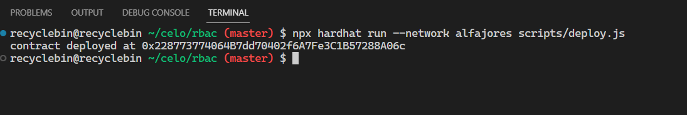

## Introduction

Smart contracts have been used to revolutionize the way transactions are performed on blockchain networks. However, with this innovation comes the need to manage access control, which is where role-based access control (RBAC) comes in. RBAC is a popular approach to managing access control in smart contracts, and it allows different parties to control who can access different parts of the contract based on requirements.

In this tutorial, we will explore the RBAC concept in smart contracts using Solidity and OpenZeppelin. We will discuss the implementation of a simple RBAC contract that manages access control to certain functions within the contract, including how to grant, revoke, and renounce roles. By the end of this tutorial, you will have a basic understanding of RBAC and how it can be implemented in smart contract and web app.

## Prerequisites

It's recommended that you have a basic understanding of Solidity, JavaScript, and React to follow this tutorial. Familiarity with Hardhat is helpful but not necessary, as the tutorial will cover the basics. Having a grasp of these technologies will make it easier to understand and follow along, but even without prior experience, you'll still learn a lot from this tutorial.

## Requirements

This tutorial requires Node.js (version >=16.0) to run and test Solidity code. To check if Node.js is installed, run this command in the terminal:

```bash
node -v
```

If Node.js isn't already installed or the version is outdated, you can download latest version from the [official website](https://nodejs.org/) and install it by following the instructions. Once Node.js is installed, you can proceed with the tutorial.

We also need to install a wallet in the browser that works with Celo, like MetaMask.

## Project Setup

In this tutorial, we are going to write and test smart contracts along with building a web app. For the smart contract, we are going to use Hardhat, and for the web app, React. Let's get started on both.

### Hardhat Setup

To begin, create a directory for this tutorial and open it in a code editor like VS Code. To set up the Hardhat project, run the following command in the terminal:

```bash
npx hardhat .
```

After the project setup is complete, remove all the files from the `contracts` and `test` directories. Create two new files, `RBAC.sol` and `RBAC.js`, in the `contracts` and `test` directories, respectively. We must also create an`.env` file to store the private key of the wallet that will be used for contract deployment.

We need to install the `dotenv` and `@openzeppelin/contracts`, which help us read the environment variables like our private key and create role-based access control respectively. To install that package, run the following command in the terminal:

```bash
yarn add dotenv @openzeppelin/contracts
```

### Frontend Setup

For the frontend, we are going to use React.js. To create a React project, run the following command in the terminal:

```bash
npx create-react-app frontend
```

We also need to install a few packages for our web app. These packages are as follows:

- `ethers`: To interact with smart contracts and wallets
- `react-toastify`: To show notifications on the web app

To install those packages, go to the `frontend` directory and run the following command:

```bash
# Change directory to `frontend`
cd frontend
# Installing ethers v5.7.2 and react-toastify
yarn add "ethers@5.7.2" react-toastify
# Change directory back to base directory
cd ..
```

We have set up our project. Let's see how our application will work in theory, and then start writing our smart contract.

## Working of the Dapp

In this tutorial, we will build a dapp that will allow users with certain role to create an entry in the contract. The role will have a role admin that controls that role and a default admin that can control all the roles.

The role admin has the ability to grant and revoke roles. The default admin will have control over everything related to roles, like changing the role admins and granting and revoking roles for any user.

## RBAC Smart Contract

To create a role-based access control (RBAC) smart contract, we start by opening the `RBAC.sol` file and pasting the following code snippet that defines the smart contract outline and necessary imports:

```solidity
// SPDX-License-Identifier: MIT
pragma solidity ^0.8.17;

import "@openzeppelin/contracts/access/AccessControl.sol";
import "@openzeppelin/contracts/utils/Counters.sol";

contract RBAC {

}
```

Our contract inherits from the `AccessControl` contract to implement RBAC functionality in our smart contract:

```solidity
contract RBAC is AccessControl {

 //roles

 //mappings and state variables

 //constructor

 //functions
}
```

### Defining Roles

In this RBAC smart contract, we will create a role called `CREATOR`. This role will have permission to create entries in the smart contract.

Each role should have a unique `bytes32` identifier that can be accessed by an external API. We can create a unique identifier for the `CREATOR` role by hashing the name of the role using the `keccak256` function and defining it as a `public constant`:

```solidity
 //roles
 bytes32 public constant CREATOR = keccak256("CREATOR");
```

### Entry Storage

We will store each entry that the creator creates in a mapping with the data submitted by the creator as the value and a counter value as the key. To implement this, we define a mapping and a counter:

```solidity
    //mappings and state variables
    using Counters for Counters.Counter;

    Counters.Counter public count;
    mapping(uint256 => bytes32) public entries;
```

### Constructor Definition

In the constructor, we set up the `DEFAULT_ADMIN_ROLE` using the `_setupRole` function:

```solidity
 constructor() {
     _setupRole(DEFAULT_ADMIN_ROLE, msg.sender);
    }
```

The `_setupRole` function should only be called from the constructor when setting up the initial roles for the system. Using this function in any other way is effectively circumventing the admin system imposed by `AccessControl`.

`DEFAULT_ADMIN_ROLE` is created in `AccessControl` so we can directly use it. It is the admin for all roles, including the `DEFAULT_ADMIN_ROLE` role. This role has permission to grant and revoke all roles. Any wallet that has this role should be stored securely as it has the ability to circumvent the entire admin system.

### Role Related Functions

We will create three functions related to roles:

- `grantCreatorRole`: the `CREATOR` role admin will be able to grant the `CREATOR` role.
- `revokeCreatorRole`: the `CREATOR` role admin will be able to revoke the `CREATOR` role.
- `renounceCreatorRole`: a address with the `CREATOR` role will be able to renounce their role.

### Grant Role

The `grantCreatorRole` function takes an address as an argument and uses the `grantRole` function from `AccessControl` to assign the `CREATOR` role to the address:

```solidity
 function grantCreatorRole(address _address) public {
     grantRole(CREATOR, _address);
    }
```

The `grantRole` function checks whether the caller is a role admin or the default admin. If the caller is either of those, then it assigns the role to the address that is passed as an argument. If the checks fail, it reverts. After assigning the role, it emits a `RoleGranted` event.

### Revoke Role

The `revokeCreatorRole` function works in the same way as the `grantCreatorRole` function, with the exception that it uses the `revokeRole` function from `AccessControl`. This function revokes the `CREATOR` role from the address provided as its argument.

```solidity
 function revokeCreatorRole(address _address) public {
     revokeRole(CREATOR, _address);
    }
```

After revoking the role, the function emits a `RoleRevoked` event.

### Renounce Role

The `renounceCreatorRole` function allows the caller to revoke their own role for any reason, such as if the user no longer wants that role or if the user suspects that their wallet has been compromised. This function uses the `renounceRole` function from `AccessControl`, which internally uses the `_revokeRole` function to revoke the role. However, this function also checks that the caller's address is the same as the address of the role being revoked.

```solidity
 function renounceCreatorRole() public {
     renounceRole(CREATOR, msg.sender);
    }
```

After renouncing the role, the function emits a `RoleRevoked` event.

### Create Entry

We are going to write the `createEntry` function, which will be restricted to the `CREATOR` role. To check if the caller has this role, we can use the `onlyRole` modifier and pass it the `bytes32` identifier of the role. If the caller does not have the role, the function reverts.

For each entry, we can get the key by calling the `current` function on `count`, and the value will be the argument passed to the function. At the end, we will increment the `count` using the `increment` function.

```solidity
 function createEntry(bytes32 data) public onlyRole(CREATOR) {
  entries[count.current()] = data;
  count.increment();
 }
```

With the completion of the smart contract, we can now move on to writing some unit tests.

## Unit Tests

It is a best practice to write unit tests for all smart contracts to ensure that they work according to our assumptions. Let’s write unit tests for our smart contract. To begin, paste the following code snippet which will import dependencies and create a `describe` block containing all the tests:

```js
const {
 loadFixture
} = require("@nomicfoundation/hardhat-network-helpers");
const { expect } = require("chai");
const { ethers } = require("hardhat");

describe("RBAC", function () {

 // fixture

 // unit tests

})
```

The first thing to do here is to write our fixture. The fixture will be called `deployFixture`, it will first create three dummy accounts for testing and then deploy the contract. All of these will be returned at the end.

```js
 // fixture
 async function deployFixture() {
  const [owner, creator, extra] = await ethers.getSigners();

  const RBAC = await ethers.getContractFactory("RBAC");
  const rbac = await RBAC.deploy();

  return { rbac, owner, creator, extra };
 }
```

In the first test, we should check whether, after deployment, the roles and variables are set correctly. The conditions to check for are as follows:

- `DEFAULT_ADMIN_ROLE` is set to the contract deployer's address.
- `count` is set to 0.

```js
 // unit tests
 describe("Deployment", async function () {
  it("Should set owner as DEFAULT_ADMIN_ROLE", async function () {
   const { rbac, owner } = await loadFixture(deployFixture);
   const DEFAULT_ADMIN_ROLE = await rbac.DEFAULT_ADMIN_ROLE();
   expect(
    await rbac.hasRole(DEFAULT_ADMIN_ROLE, owner.address)
   ).to.true;
   expect(await rbac.count()).to.be.equal(0);
  });
 });
```

Next, we will test all the functions related to granting, revoking, and renouncing roles and entry creation. To check whether `grantCreatorRole` is working correctly, we want to test it for the following conditions:

- It emits a `RoleGranted` event after assigning the role.
- It assigns the `CREATOR` role.

```js
 describe("Access Control", async function () {

  it("Should set correct role", async function () {
   const { rbac, owner, creator } = await loadFixture(deployFixture);
   const CREATOR = await rbac.CREATOR();
   expect(
    await rbac.grantCreatorRole(creator.address)
   ).to.emit(
    rbac,
    "RoleGranted"
   ).withArgs(
    CREATOR,
    creator.address,
    owner.address
   )
   expect(
    await rbac.hasRole(CREATOR, creator.address)
   ).to.be.true;
  })

  // rest of the tests should go below this line

 })
```

We will test the `revokeCreatorRole` function for the following conditions:

- It emits the `RoleRevoked` event after revoking the role.
- It removes the `CREATOR` role.

```js
 it("Should revoke the role", async function () {
  const { rbac, owner, creator } = await loadFixture(deployFixture);
  await rbac.grantCreatorRole(creator.address);
  const CREATOR = await rbac.CREATOR();

  expect(
   await rbac.revokeCreatorRole(creator.address)
  ).to.emit(
   rbac,
   "RoleRevoked"
  ).withArgs(
   CREATOR,
   creator.address,
   owner.address
  )
  expect(
   await rbac.hasRole(CREATOR, creator.address)
  ).to.be.false;
 })
```

We should also check whether the `grantCreatorRole` and `revokeCreatorRole` functions revert with the correct reason if someone other than the role admin calls them. To check the reason, we need to use a regular expression.

```js
 it("Should revert if non-role admin calls to grant or revoke role", async function () {
  const { rbac, owner, creator } = await loadFixture(deployFixture);
  await expect(
   rbac.connect(creator).grantCreatorRole(owner.address)
  ).to.be.revertedWith(
   new RegExp("AccessControl: account (0x[0-9a-f]{40}) is missing role (0x[0-9a-f]{64})")
  )
  await expect(
   rbac.connect(creator).revokeCreatorRole(owner.address)
  ).to.be.revertedWith(
   new RegExp("AccessControl: account (0x[0-9a-f]{40}) is missing role (0x[0-9a-f]{64})")
  )
 })
```

We will test the `renounceCreatorRole` function for the same conditions as `revokeCreatorRole`.

```js
 it("Should creator should be able to renounce role", async function () {
  const { rbac, owner, creator } = await loadFixture(deployFixture);
  await rbac.grantCreatorRole(creator.address);
  const CREATOR = await rbac.CREATOR();
 
  expect(
   await rbac.connect(creator).renounceCreatorRole()
  ).to.emit(
   rbac,
   "RoleRevoked"
  ).withArgs(
   CREATOR,
   creator.address,
   owner.address
  )
  expect(
   await rbac.hasRole(CREATOR, creator.address)
  ).to.be.false;
 })
```

We assume that only addresses with the `CREATOR` role can create an entry, so we will test if the stored data is the same as the data provided when creating the entry and check whether the counter increments after creating an entry.

```js
 it("Should allow creator role to create entry", async function () {
  const { rbac, creator } = await loadFixture(deployFixture);
  await rbac.grantCreatorRole(creator.address);
  expect(await rbac.count()).to.be.equal(0);
 
  const data = ethers.utils.formatBytes32String("FIRST ENTRY");
  await rbac.connect(creator).createEntry(data);
 
  expect(await rbac.entries(0)).to.be.equal(data);
  expect(await rbac.count()).to.be.equal(1);
 })
```

Finally, we will check whether `createEntry` throws an error if called by an address without the `CREATOR` role.

```js
 it("Should revert for caller without correct role", async function () {
  const { rbac, creator, extra } = await loadFixture(deployFixture);
  await rbac.grantCreatorRole(creator.address);
 
  const data = ethers.utils.formatBytes32String("FIRST ENTRY");
  await expect(
   rbac.connect(extra).createEntry(data)
  ).to.be.revertedWith(
   new RegExp("AccessControl: account (0x[0-9a-f]{40}) is missing role (0x[0-9a-f]{64})")
  )
 })
```

To run the test, execute the following command in the terminal:

```bash
npx hardhat test
```

> Note: After running `test` command if you encounter error with code `HH801` then just follow the instruction on the terminal and then run the `test` command again.

You should see the following output in the terminal:


## Creating The Web App

As we have written and tested our smart contract, we can proceed with building the web app. To create the web app, we need the contract ABI. We have generated the ABI while running the `test` command. Copy the `RBAC.json` file from the `artifacts/contracts/RBAC.sol` directory to `frontend/src`.

To start building the web app, open the `App.js` file in the `frontend/src` directory and paste the following code snippet. It creates the basic structure of the web app:

```js
import { useState } from "react";
import { ethers } from "ethers";

// handles notifications
import { ToastContainer, toast } from "react-toastify";
import 'react-toastify/dist/ReactToastify.css';

import './App.css';
import data from "./RBAC.json";

// This is dummy address. 
// We need to change it after we delpoy our contract on Alfajores.
const CONTRACTADDRESS = "0x0973b6417225Bc4b73B88912Ce64e7BCF1AB6244"

function App() {

 // store contract instance and truncated wallet address
 const [contract, setContract] = useState(undefined);
 const [address, setAddress] = useState("");

 // connect to wallet
 const connect = async () => {

 };

 // interact with role-related contract function 
 const role = async (e, type) => {

 }

 // create entry in contract
 const createEntry = async (e) => {

 }

 return (
  <div className="App">
   <div className="no-input">
    <h2>Role Based Access Control</h2>
    <button onClick={connect}>{contract ? address: "Connect"}</button>
   </div>
   <hr class="solid"></hr>
   <div className="row">
    <h2>Grant Creator Role (Admin Use Only)</h2>
    <p className="explained">"grantCreatorRole" is function used by role admin to grant role of any user</p>
    <form onSubmit={e => role(e, 0)}>
     <input placeholder="Data Type: Address" />
     <button type="submit" disabled={!contract}>Grant Role</button>
    </form>
   </div>
   <div className="row">
    <h2>Revoke Creator Role (Admin Use Only)</h2>
    <p className="explained">"revokeCreatorRole" is function used by role admin to revoke role of any user</p>
    <form onSubmit={e => role(e, 1)}>
     <input placeholder="Data Type: Address" />
     <button type="submit" disabled={!contract}>Revoke Role</button>
    </form>
   </div>
   <div className="no-input">
    <h2>Renounce Creator Role</h2>
    <form onSubmit={e => role(e, 2)}>
     <button type="submit" disabled={!contract}>Renounce Role</button>
    </form>
   </div>
   <p className="explained">"renounceCreatorRole" function is used by user who holds the creator role to renounce their role</p>
   <hr class="solid"></hr>
   <div className="row">
    <h2>Create Entry</h2>
    <form onSubmit={createEntry}>
     <input placeholder="Data Type: String" />
     <button type="submit" disabled={!contract}>Create Entry</button>
    </form>
   </div>
   <ToastContainer
    position="top-right"
    autoClose={5000}
    hideProgressBar={false}
    newestOnTop={false}
    closeButton={false}
    closeOnClick
    rtl={false}
    pauseOnFocusLoss
    draggable
    pauseOnHover
    theme="light"
   />
  </div>
 );
}

export default App;
```

For the web app, our main focus will be on the logic rather than the structure and styling.

To understand our `App` component, let's take a quick look at what it does. At the top, we have a series of imports such as `useState`, `ethers`, and `toast`. Each of these serves a specific purpose:

- `ethers`: a library used to interact with contracts and wallets
- `useState`: a React hook used to store data
- `ToastContainer`: a notification component
- `toast`: a function used to trigger notifications

We also have a variable called `CONTRACTADDRESS`, which stores the contract address. This will need to be updated once the contract is deployed to the appropriate address.

Within the `App` component, we use the `useState` hook to store the instance of the `contract` and the user's wallet address. Additionally, we have functions that handle wallet and contract interactions, including:

- `connect`: used to handle wallet interactions
- `role`: used to handle role-related wallet interactions, such as granting, revoking, and renouncing roles
- `createEntry`: used to handle entry creation on the contract

The rest of the web app consists of a simple HTML structure with forms that allow the user to input data, as well as instructions to help the user understand the various elements of the web app.

Let’s move on to writing out first function, `connect`. In this function, we are handling wallet interaction with the web app and creating a `contract` instance that we will use to interact with our contract on chain.

The `connect` function starts by checking if the user's browser has an Ethereum provider such as MetaMask enabled. If it does, the function creates a new `Web3Provider` instance using the `ethereum` object and requests the user's accounts. It then takes first account from `account` array and truncates to store it in the state using `setAddress`.

Next, the function creates an instance of `ethers.Contract` using the contract's address, ABI, and signer (the provider's signer). Finally, it sets the contract instance in the `setContract` variable for later use.

If no Ethereum provider is found, notification is pushed using `toast` saying `No wallet installed!`.

```js
// connect to wallet
const connect = async () => {
 const { ethereum } = window;
 if (ethereum) {
  const provider = new ethers.providers.Web3Provider(ethereum);
  const accounts = await provider.send("eth_requestAccounts", []);
  const account = accounts[0];
  setAddress(`${account.slice(0, 5)}...${account.slice(-5)}`)
  const signer = provider.getSigner();
  const contract = new ethers.Contract(CONTRACTADDRESS, data.abi, signer);
  setContract(contract);
 } else {
  console.error("Install any Celo wallet");
  toast.error("No wallet installed!")
 }
};
```

Let's write `role` function, it takes in two arguments: `e` and `type`.

The first thing the function does is prevent page refresh using `e.preventDefault()`. Then, it retrieves the address passed by the user from the first form field in the user interface form using `e.target[0].value`.

Next, the function uses a switch statement to determine which role-related contract function to execute based on the value of the type argument. The options for `type` are `0`, `1`, or `2`, and correspond to the functions `grantCreatorRole`, `revokeCreatorRole`, and `renounceCreatorRole` respectively.

If an error occurs while executing the contract function, it is logged to the console and an error message is displayed using `toast.error()`.

Finally, the function waits for the transaction to be executed using `txn.wait()`, and displays a toast notification to the user indicating the status of the transaction. The toast notification displays the message "transaction executing" while the transaction is being processed, and displays the message "role granted", "role revoked", or "role renounced" based on the type of transaction that was executed.

```js
// interact with role-related contract function 
 const role = async (e, type) => {
  e.preventDefault();
  let address = e.target[0].value;
  let txn, message;
  try {
   switch (type) {
   case 0:

    txn = await contract.grantCreatorRole(address);
    message = "role granted"

    break;
   case 1:

    txn = await contract.revokeCreatorRole(address);
    message = "role revoked";

    break;
   case 2:

    txn = await contract.renounceCreatorRole();
    message = "role renounced";

    break;
   default:
    break;
   }
  } catch (error) {
   console.error(error);
   toast.error(error.reason);
  }

  await toast.promise(
   txn.wait(),
   {
    pending: "transaction executing",
    success: message
   }
  );
 }
```

The `createEntry` function is responsible for creating a new entry in the contract. It takes the event `e` as an argument, which presumably contains data needed to create the entry. In this case, it looks for the input value from the target element of the event and converts it into bytes using `ethers.utils.formatBytes32String()`. It then calls the `createEntry()` function from the `contract` object and passes in the formatted data as its argument.

Similar to the `role()` function, this function also uses a try-catch block to handle errors that may arise during the creation of the entry. If an error occurs, the error message is logged to the console and displayed to the user using `toast.error()`.

Once the transaction is successful, `toast.promise()` is used to display a notification message to the user that the entry has been created.

```js
// create entry in contract
const createEntry = async (e) => {
 e.preventDefault();
 console.log(e);
 try {
  let txn = await contract.createEntry(ethers.utils.formatBytes32String(e.target[0].value));
  await toast.promise(
   txn.wait(),
   {
    pending: "transaction executing",
    success: "Entry Created!"
   }
  );
 } catch (error) {
  console.error(error);
  toast.error(error.reason);
 }
}
```

We have completed implementing the desired functionality for our web app, so now it's time to style it. To apply styles to the web app, simply copy and paste the following CSS code into the `App.css` file.

```css
.App {
   padding: 0% 10%;
}

.no-input {
 display: flex;
 align-items: center;
 justify-content: space-between;
}

hr.solid {
 border-top: 1px solid #bbb;
 margin: 10px 0px;
}

.row {
 display: flex;
 flex-direction: column;

}

form {
 display: flex;
 justify-content: space-between;
}

input {
 height: 30px;
 width: 60%;
 margin-right: 20px;
 font-size: 16px;
 transition: 0.6s;
 border: none;
 border-bottom: 1px solid #CCC;
 background-color: transparent;
}

button {
 width: 200px;
 padding: 10px;
 font-size: 16px;
 font-weight: 700;
 cursor: pointer;
 border: none;
 border-radius: 5px;
}
.explained {
   color: #CCC;
}
```

The next step is to deploy the contract.

## Contract Deployment

To deploy contract, we need a wallet with some test Celo token and add private key of that wallet to `.env` file.

```txt
PRIVATE_KEY = "YOUR_PRIVATE_KEY"
```

> You can get test token from [Alfajores Faucet](https://faucet.celo.org/).

We need to modify our `hardhat.config.js` file. The modifications that need to be done are adding Alfajores network configuration and importing the `dotenv` package so that the private key can be read from the `.env` file.

```js
require("@nomicfoundation/hardhat-toolbox");
require("dotenv").config();

/** @type import('hardhat/config').HardhatUserConfig */
module.exports = {
 solidity: "0.8.17",
 defaultNetwork: "hardhat",
   networks: {
  hardhat: {
  },
  alfajores: {
   url: "https://alfajores-forno.celo-testnet.org",
   accounts: [process.env.PRIVATE_KEY],
   chainId: 44787,
  },
  celo: {
   url: "https://forno.celo.org",
   accounts: [process.env.PRIVATE_KEY],
   chainId: 42220,
  },
   },
};
```

Final thing to do for deployment is to create a deployment script.

Open `deploy.js` file from `scripts` and remove all the code from it. Script will start with importing `hardhat` library and defines an async function `main`. The `main` function uses the `getContractFactory` method to retrieve a factory object for the `RBAC` contract. It then calls the `deploy` method on the factory object to deploy the contract to the blockchain. The `deployed` method is called to wait for the contract to be deployed, and the contract's address is logged to the console. The `main` function is called and any errors are caught and logged to the console.

```js
const hre = require('hardhat');

const main = async () => {
 const RBAC = await hre.ethers.getContractFactory("RBAC");
 const rbac = await RBAC.deploy();

 await rbac.deployed();

 console.log(
  `contract deployed at ${rbac.address}`
 )
}
main().catch(error => {
 console.error(error);
 process.exitCode = 1;
})
```

To deploy the contract, please run the following command in the terminal:

```bash
npx hardhat run scripts/deploy.js --network alfajores
```

You should see the following output in the terminal:



You can copy the address printed on the terminal and add it to `CONTRACTADDRESS` variable in the `App.js`.

### Running Web App

We are done with building everything. Please run following command to open web app on your browser:

```bash
# change directory to `frontend`
cd frontend
# run web app in development mode
yarn start
```

command should open a tab in your browser. If it does not open a new tab automatically, you can access the web app on your PC at [http://localhost:3000/](http://localhost:3000/).

Here is a screenshot of the web app:


## Demo App

You can also check a demo app that which is deployed [here](https://rbac.netlify.app/). The demo app is slightly different than web app we built here. Demo app will have ability to get a creator role by yourself so that user checking out the app can create entries.

## Conclusion

In conclusion, we have successfully developed a RBAC (role-based access control) dapp using the OpenZeppelin library, which allows us to control access to certain functions within the contract. During this tutorial, we learned about important ideas like role admins and default admins, which helped us manage the roles in the contract in a more effective way. We also gained knowledge on how to test smart contracts with the help of the Hardhat framework and the Chai testing library. Additionally, we learned how to test events with the help of regular expressions, which proved to be a valuable tool in testing smart contracts.

Moreover, we also built a web app to interact with our RBAC smart contract. We focused on the logic and functions of the web app rather than its structure and styling. The web app has an easy-to-use interface that lets users connect their wallets, make entries, and manage their roles well.

Overall, we have gained a better understanding of how RBAC smart contracts work and how to implement them using OpenZeppelin. We have also learned how to test and deploy smart contracts, as well as build a web app to interact with the smart contract. We hope that this tutorial has been helpful and provided a good introduction to RBAC in Dapps.

## Next Steps

Congratulations on completing this tutorial! You've made it to the end, which is no small feat. Share your brilliant work on Celo Discord so that everyone can admire it.

Now that you've mastered the RBAC smart contract and web app development, why not take it to the next level? Try experimenting with advanced functions like `_setRoleAdmin` to set up intricate relationships between various roles.

Alternatively, why not use the concepts you've learned to build your own project? The possibilities are endless, and the world is your oyster. Good luck on your journey to becoming a blockchain ninja!

## About Author

Nikhil Bhintade is a tech-savvy product manager and technical writer, always eager to discover the latest and greatest in the tech world. With a sharp mind for all things technical, he is constantly exploring new ideas and looking for ways to push the boundaries of what's possible with technical content and products.

When he's not crafting compelling product stories and technical documents, you can catch him tinkering on his latest projects on [GitHub](https://github.com/nikbhintade). And if you're looking for a tech industry insider to connect with, he's always up for a chat on [LinkedIn](http://linkedin.com/in/nikbhintade), where he stays on top of the latest trends and developments.

## References

- Project [Repo](https://github.com/nikbhintade/role-based-access-control-solidity/tree/tutorial)
- [Access Control](https://docs.openzeppelin.com/contracts/4.x/api/access#AccessControl) by OpenZeppelin
- [Hardhat](https://hardhat.org/)
- [React Toastify](https://www.npmjs.com/package/react-toastify)
