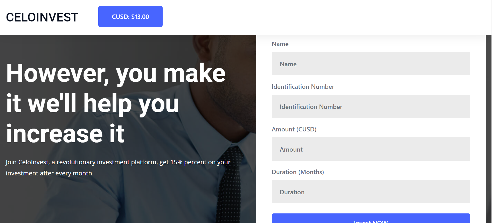
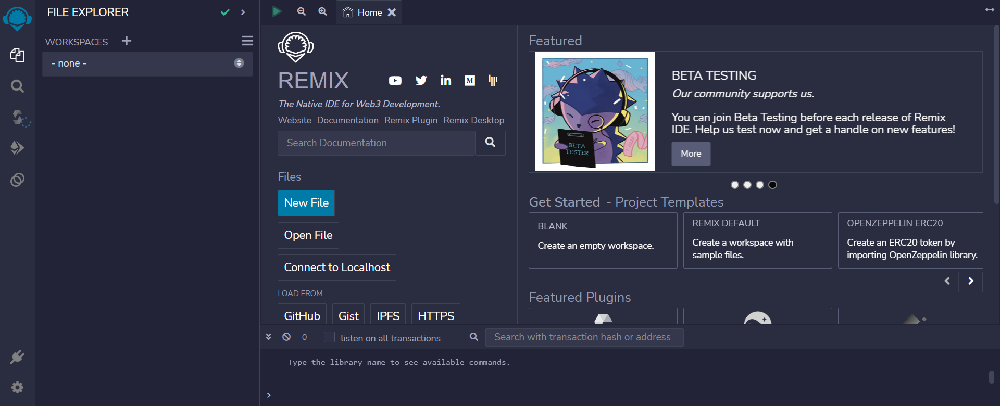

## Introduction
Welcome to another tutorial on the celo blockchain. In this tutorial, we would build a mock investment platform that returns a 10% profit. This would be build on the celo blockchain. 

### What is  Celo 
Celo is a blockchain platform that focuses on enabling mobile-first financial services. It is built using the Ethereum codebase and employs a proof-of-stake consensus mechanism for transaction validation. One unique aspect of Celo is its focus on usability and accessibility, aiming to create a more inclusive and decentralized financial system.

## Prerequisites

- Prior knowledge of javascript
- Familiarity with the command line
- Basic understanding of blockchain concepts
- Have some knowledge of solidity and its concepts
- Have a basic understanding of **[React](https://react.org)**. Knowledge of JSX, props, state, and hooks.

## Requirements
- **[NodeJS](https://nodejs.org/en/download)** from V12.or higher
- A code editor or text editor. **[VSCode](https://code.visualstudio.com/download)** is recommended
- A terminal. **[Git Bash](https://git-scm.com/downloads)** is recommended
- An Internet Browser and a good internet connection
- **[Remix](https://remix.ethereum.org)**
- **[Celo Extension Wallet](https://chrome.google.com/webstore/detail/celoextensionwallet/kkilomkmpmkbdnfelcpgckmpcaemjcdh?hl=en)**.


Screenshot: 


## Smart Contract Development
If you have seen any of my previous tutorials, you would realize I am fan of remix for writing smart contracts. Remix is a web-based IDE that allows developers to write, test and deploy smart contracts on the Celo blockchain. 

Here is a preview of the Remix IDE:


On Remix, We would create a new workspace and then a new file which we would name `invest.sol`

Starting in the first line, you include a statement that specifies the license under which the code is being released.

```js
// SPDX-License-Identifier: MIT
pragma solidity >=0.7.0 <0.9.0;
```

The first line is a SPDX license identifier and a Solidity version pragma.

SPDX (Software Package Data Exchange) is a specification that provides a standard way to declare the license of open source software packages. The SPDX-License-Identifier is a header that specifies the license of a given source code file.
The Solidity version pragma specifies the version of the Solidity programming language used to write the smart contract code. The version range specified is greater than or equal to 0.7.0 and less than 0.9.0, meaning that the code should be compiled with a Solidity compiler version between 0.7.0 and 0.8.x.


Following that, we define an `IERC20Token` interface which enables us to interact with the celo stablecoin (cUSD). 

```solidity
// SPDX-License-Identifier: MIT

pragma solidity >=0.7.0 <0.9.0;

interface IERC20Token {
  function transfer(address, uint256) external returns (bool);
  function approve(address, uint256) external returns (bool);
  function transferFrom(address, address, uint256) external returns (bool);
  function totalSupply() external view returns (uint256);
  function balanceOf(address) external view returns (uint256);
  function allowance(address, address) external view returns (uint256);

  event Transfer(address indexed from, address indexed to, uint256 value);
  event Approval(address indexed owner, address indexed spender, uint256 value);
}
```

ERC-20 tokens are a widely-used standard for creating digital assets on the Ethereum blockchain, and cUSD is one of them.

These tokens have pre-defined functions and events that can be easily used in contracts and do not require any additional implementation. For example, you will be using the ERC-20 token's interface to interact with it, so that your contract can communicate with the token.

You can find more information on how to use these functions and events in the Celo **[documentation](https://docs.celo.org/developer-guide/celo-for-eth-devs)**. The documentation also provides more details on how to interact with ERC-20 tokens and how to use them with the Celo network.

Next up, you would need to create a contract(in this case you name the contract `celoinvest`) and then define a way for investments to be tracked on the blockchain, including who made the investment, how much they invested, and when the investment matures and is paid back.

```solidity
contract celoinvest{
    struct Investment{
        address payable investor;
        string name;
        string identificationNumber;
        uint amount;
        uint duration;
        bool isMature;
        bool isPaid;
        uint timestamp;
    }
```

Inside the contract, there is a data structure defined called "Investment". The Investment structure has several properties, including:

- `investor`: This is the Ethereum address of the investor who is making the investment. The address is marked as payable, which means that funds can be sent to this address.
- `name`: This is a string that represents the name of the investor.
- `identificationNumber`: This is a string that represents a unique identification number for the investor.
- `amount`: This is a uint (unsigned integer) that represents the amount of ether (the cryptocurrency used on the Ethereum blockchain) that the investor is investing.
- `duration`: This is a uint that represents the duration of the investment in some units of time (e.g. seconds).
- `isMature`: This is a boolean value that will be set to true once the investment has reached maturity (i.e. the duration has passed).
- `isPaid`: This is a boolean value that will be set to true once the investor has been paid back their investment.
- `timestamp`: This is a uint that represents the timestamp (in seconds since the Unix epoch) at which the investment was made.
  
After this, we would declare some variables with various data types. If you would like to learn more about this dat-types, I gave a simple explanation to some data types in my previous tutorial. View it [here](https://docs.celo.org/blog/tutorials/how-to-build-car-marketplace-dapp-with-react)

```solidity
    uint internal taxFee = 1000000000000000000;
    mapping (uint => Investment) internal investments;
        uint internal investmentLength = 0;

    address internal cUsdTokenAddress = 0x874069Fa1Eb16D44d622F2e0Ca25eeA172369bC1;
```

The first line declares a variable named `taxFee` and assigns it a value of `1000000000000000000`. , which is the smallest unit of ether (the native cryptocurrency of the Ethereum blockchain) representing 1cUSD.

The second line declares a mapping data structure called "investments" that associates unsigned integer keys with "Investment" objects. This mapping is marked as "internal", which means it can only be accessed from within the current contract.

The third line declares a variable named `cUsdTokenAddress` and assigns it a value of 0x874069Fa1Eb16D44d622F2e0Ca25eeA172369bC1. This is the address of a smart contract that represents `cUSD`

You are then going to declare the modifiers. Modifiers are like functions that can modify the behaviour of other functions or methods they are applied to.

```solidity
    modifier isAdmin(uint _id){
         require(msg.sender == address(this),"Accessible only to the admin");
        _;
    }
    
    modifier isOwner(uint _index) {
        require(msg.sender == investments[_index].investor,"Accessible only to the owner");
        _;
    }
    
```
The first modifier `isAdmin` takes an input parameter `id` of type `uint` and checks if the sender of the current message (i.e., the user who is interacting with the smart contract) is the same as the smart contract itself. If the sender is not the contract, then the function call will fail and display an error message "Accessible only to the admin". If the sender is the contract, then the function call will proceed and the _ placeholder will be replaced with the code of the function being modified.

The second modifier `isOwner` takes an input parameter `_index` of type `uint` and checks if the sender of the current message is the same as the address stored in the `investor` property of the `Investment` struct associated with the given `index` in the `investments` mapping. If the sender is not the owner of that investment, then the function call will fail and display an error message "Accessible only to the owner". If the sender is the owner, then the function call will proceed and the _ placeholder will be replaced with the code of the function being modified.

_Please note that the isAdmin variable can take any address as this address would be in charge of receiving the funds and also making other changes in the smart contract_

Following the previous declarations, you would then write the `invest` function which is a public function, meaning that it can be called by anyone who has access to the smart contract.

```solidity
function invest(
        string memory _name,
        string memory _identification,
        uint _amount,
        uint _duration
    )public{
        require(
              IERC20Token(cUsdTokenAddress).transferFrom(
                msg.sender,
                address(this),
                _amount
              ),    
              "This transaction could not be performed"
        );
        investments[investmentLength] = Investment(
            payable(msg.sender),
            _name,
            _identification,
            _amount,
            _duration,
            false,
            false,
            block.timestamp
        );
        
        investmentLength++
    }
```

The function takes in four input parameters of type `string`, `string`, `uint`, and `uint`, respectively. These input parameters are used to create a new `Investment` object in the `investments` mapping.

The first thing that the function does is to check if the smart contract can transfer the specified amount of `cUSD` from the sender's address (i.e., the address that called this function) to the smart contract's address. If the transfer fails for any reason, an error message "This transaction could not be performed" will be displayed.

If the transfer is successful, then a new `Investment` object is created in the "investments" mapping. This object contains various properties, such as the investor's address, the investment amount, the investment duration, and a few flags indicating the status of the investment. The function then increments the `investmentLength` variable, which is used to keep track of the number of investments in the mapping.


The next function would be called `getInvestments` which retrieves the details of an investment based on its index in the `investments` array.

```solidity
    function getInvestments(uint _index) public view isAdmin(_index) returns(
        address payable,
        string memory,
        string memory,
        uint,
        uint,
        bool,
        bool,
        uint
    ){
        Investment storage _investments = investments[_index];
        return(
            _investments.investor,
            _investments.name,
            _investments.identificationNumber,
            _investments.amount,
            _investments.duration,
            _investments.isMature,
            _investments.isPaid,
            _investments.timestamp
        );
    }
```

The function takes one parameter, `_index`, which represents the index of the investment in the array. The `isAdmin` modifier is used to ensure that only the contract owner can call this function which we created earlier.

The function returns several pieces of information about the investment, including the investor's address, name, identification number, investment amount, duration, maturity status, payment status, and timestamp.
To learn more about solidity timestamps, click [here](https://soliditytips.com/articles/solidity-dates-time-operations/)

The investment details are retrieved from the `investments` array using the specified index, and then returned as a tuple. The `memory` keyword is used to indicate that the string variables are stored in `memory` rather than `storage`.


After you are done with this, you create a function to check if an investment is mature. 

```solidity
    function isInvestmentMature(uint _index)public view isAdmin(_index)returns(bool) {
        if(block.timestamp > (investments[_index].timestamp + 2 minutes)){
            return true;
        }
        return false;
    }
```

In this tutorial we used a fixed time of two minutes, for a full fledged dapp, you would most likely pass in a dynamic number of investment days instead of a hardcoded one. 

This function checks whether the current block timestamp (measured in seconds since the Unix epoch) is greater than 2 minutes(_this could be 2 days, 2 hours as required_) after the timestamp of the investment specified by the `_index` parameter. If it is, the function returns `true`, indicating that the investment is mature. Otherwise, it returns `false`.

You are then going to create the `payInvestor` and `isUserAdmin` functions. The `payInvestor` function would be used to pay the investor while the `isUserAdmin` function would be used to make sure the address inputed is the admin address.

```solidity
    function payInvestor(uint _index) public isAdmin(_index){
        require(
              IERC20Token(cUsdTokenAddress).transfer(
                investments[_index].investor,
                investments[_index].amount+investments[_index].duration * 15/100
              ),    
              "This transaction could not be performed"
        );
        investments[_index].isPaid = true;
    }
    // function to check if the user is an admin
    function isUserAdmin(address _address) public view returns (bool){
        if(_address == address(this)){
            return true;
        }
        return false;
    }
```
The `payInvestor` function has a parameter `_index`, which is used to identify the investment to be paid out. It uses the `isAdmin` modifier, which checks if the caller of the function is an admin, before executing the function. The `require` statement checks if the transfer of tokens from the contract's `cUsdTokenAddress` to the investor's address was successful. If successful, the `isPaid` variable of the investment at the given index is set to `true`. The amount paid out to the investor is the sum of the investment amount and 15% of the investment duration.

The `isUserAdmin` function checks if the given address is the same as the contract's address. If it is, the function returns `true`, indicating that the address is an admin. If not, it returns `false`. You can use this function to check the admin status of an address before calling functions that require admin privileges, such as the `payInvestor` function.


Your final function would be the `getInvestmentLength()` which is marked with the `public` and `view` visibility modifiers. This function provides a way for external parties to read the value of the `investmentLength` state variable without modifying the state of the contract.

```solidity
    function getInvestmentLength() public view returns (uint){
        return investmentLength;
    }
```

The `public` modifier means that the function can be called externally by anyone who has access to the contract. The `view` modifier indicates that the function does not modify the contract state and only returns some data.

The function returns a value of type `uint`, which is an unsigned integer. This value represents the length of an investment, and is retrieved from a state variable called `investmentLength`.


Here is the full code:

```solidity
// SPDX-License-Identifier: MIT

pragma solidity >=0.7.0 <0.9.0;

interface IERC20Token {
    function transfer(address, uint256) external returns (bool);

    function approve(address, uint256) external returns (bool);

    function transferFrom(
        address,
        address,
        uint256
    ) external returns (bool);

    function totalSupply() external view returns (uint256);

    function balanceOf(address) external view returns (uint256);

    function allowance(address, address) external view returns (uint256);

    event Transfer(address indexed from, address indexed to, uint256 value);
    event Approval(
        address indexed owner,
        address indexed spender,
        uint256 value
    );
}

contract celoinvest{
    struct Investment{
        address payable investor;
        string name;
        string identificationNumber;
        uint amount;
        uint duration;
        bool isMature;
        bool isPaid;
        uint timestamp;
    }
    
    uint internal investmentLength = 0;
    uint internal taxFee = 1000000000000000000;
    mapping (uint => Investment) internal investments;
    
    address internal cUsdTokenAddress = 0x874069Fa1Eb16D44d622F2e0Ca25eeA172369bC1;
    
    modifier isAdmin(uint _id){
         require(msg.sender == address(this),"Accessible only to the admin");
        _;
    }
    
    modifier isOwner(uint _index) {
        require(msg.sender == investments[_index].investor,"Accessible only to the owner");
        _;
    }
    
    function invest(
        string memory _name,
        string memory _identification,
        uint _amount,
        uint _duration
    )public{
        require(
              IERC20Token(cUsdTokenAddress).transferFrom(
                msg.sender,
                address(this),
                _amount
              ),    
              "This transaction could not be performed"
        );
        investments[investmentLength] = Investment(
            payable(msg.sender),
            _name,
            _identification,
            _amount,
            _duration,
            false,
            false,
            block.timestamp
        );
        
        investmentLength++;
    }
    
    function getInvestments(uint _index) public view isAdmin(_index) returns(
        address payable,
        string memory,
        string memory,
        uint,
        uint,
        bool,
        bool,
        uint
    ){
        Investment storage _investments = investments[_index];
        return(
            _investments.investor,
            _investments.name,
            _investments.identificationNumber,
            _investments.amount,
            _investments.duration,
            _investments.isMature,
            _investments.isPaid,
            _investments.timestamp
        );
    }
    // function to check if the loan is mature we use a test period of 2 minutes
    function isInvestmentMature(uint _index)public view isAdmin(_index)returns(bool) {
        if(block.timestamp > (investments[_index].timestamp + 2 minutes)){
            return true;
        }
        return false;
    }
    
    function payInvestor(uint _index) public isAdmin(_index){
        require(
              IERC20Token(cUsdTokenAddress).transfer(
                investments[_index].investor,
                investments[_index].amount+investments[_index].duration * 15/100
              ),    
              "This transaction could not be performed"
        );
        investments[_index].isPaid = true;
    }
    // function to check if the user is an admin
    function isUserAdmin(address _address) public view returns (bool){
        if(_address == address(this)){
            return true;
        }
        return false;
    }
    
    function getInvestmentLength() public view returns (uint){
        return investmentLength;
    }
}
```

## Contract Deployment

To deploy the contract, we would need:
1. [CeloExtensionWallet]((https://chrome.google.com/webstore/detail/celoextensionwallet/kkilomkmpmkbdnfelcpgckmpcaemjcdh?hl=en))
2. [ Celo Faucet](https://celo.org/developers/faucet) 
3. Celo Remix Plugin

Download the Celo Extension Wallet from the Google chrome store using the link above. After doing that, create a wallet, and store your key phrase in a very safe place to avoid permanently losing your funds.

After downloading and creating your wallet, you will need to fund it using the Celo Faucet. Copy the address to your wallet, click the link to the faucet above and paste the address into the text field, and confirm.

Next up, on remix, download and activate the celo plugin from the plugin manager. Connect your wallet and deploy your contract.


## Frontend Development.
I would advise that you click here to setup your vscode for your frontend by clicking this [link](https://docs.celo.org/blog/tutorials/how-to-build-car-marketplace-dapp-with-react). This is a link to my previous tutorial where I outlined the steps in the frontend development section.


## The HTML Part of the Dapp
In the next step of the tutorial, you will begin building the foundation of your decentralized application (DApp) using HTML.

First off, you would add the following folder name `assets` to the public folder. This has some CSS properties and images that would be used to enable you to build your dapp swiftly. ([Download it here](https://github.com/dahnny/celoinvest/tree/main/public/assets))

Open the index.html file located in the public folder of your project, and let's begin.

```html
<!DOCTYPE html>
<html lang="en">

<head>
  <meta charset="utf-8" />
  <link rel="icon" href="%PUBLIC_URL%/favicon.ico" />
  <meta name="viewport" content="width=device-width, initial-scale=1" />
  <meta name="theme-color" content="#000000" />
  <meta name="description" content="Web site created using create-react-app" />
  <link rel="apple-touch-icon" href="%PUBLIC_URL%/logo192.png" />
  <!--
      manifest.json provides metadata used when your web app is installed on a
      user's mobile device or desktop. See https://developers.google.com/web/fundamentals/web-app-manifest/
    -->
  <link rel="manifest" href="%PUBLIC_URL%/manifest.json" />
  <!-- Bootstrap CSS -->
  <link rel="stylesheet" href="assets/css/bootstrap.min.css">
  <!-- Animate CSS -->
  <link rel="stylesheet" href="assets/css/animate.min.css">
  <!-- Meanmenu CSS -->
  <link rel="stylesheet" href="assets/css/meanmenu.css">
  <!-- Boxicons CSS -->
  <link rel="stylesheet" href="assets/css/boxicons.min.css">
  <!-- Flaticon CSS -->
  <link rel="stylesheet" href="assets/css/flaticon.css">
  <!-- Nice Select CSS -->
  <link rel="stylesheet" href="assets/css/nice-select.min.css">
  <!-- Owl Carousel CSS -->
  <link rel="stylesheet" href="assets/css/owl.carousel.min.css">
  <!-- Owl Carousel Default CSS -->
  <link rel="stylesheet" href="assets/css/owl.theme.default.min.css">
  <!-- Odometer CSS -->
  <link rel="stylesheet" href="assets/css/odometer.min.css">
  <!-- Magnific Popup CSS -->
  <link rel="stylesheet" href="assets/css/magnific-popup.min.css">
  <!-- Style CSS -->
  <link rel="stylesheet" href="assets/css/style.css">
  <!-- Responsive CSS -->
  <link rel="stylesheet" href="assets/css/responsive.css">

  <!--
      Notice the use of %PUBLIC_URL% in the tags above.
      It will be replaced with the URL of the `public` folder during the build.
      Only files inside the `public` folder can be referenced from the HTML.
      Unlike "/favicon.ico" or "favicon.ico", "%PUBLIC_URL%/favicon.ico" will
      work correctly both with client-side routing and a non-root public URL.
      Learn how to configure a non-root public URL by running `npm run build`.
    -->
  <title>React App</title>
</head>

<body>
  <noscript>You need to enable JavaScript to run this app.</noscript>
  <div id="root"></div>
  <!--
      This HTML file is a template.
      If you open it directly in the browser, you will see an empty page.
      You can add webfonts, meta tags, or analytics to this file.
      The build step will place the bundled scripts into the <body> tag.
      To begin the development, run `npm start` or `yarn start`.
      To create a production bundle, use `npm run build` or `yarn build`.
    -->
  <!-- Start Go Top Area -->
  <div class="go-top">
    <i class='bx bx-up-arrow-alt'></i>
  </div>
  <!-- End Go Top Area -->
</body>
  <!-- Jquery Slim JS -->
  <script src="assets/js/jquery.min.js"></script>
  <!-- Popper JS -->
  <script src="assets/js/popper.min.js"></script>
  <!-- Bootstrap JS -->
  <script src="assets/js/bootstrap.min.js"></script>
  <!-- Meanmenu JS -->
  <script src="assets/js/jquery.meanmenu.js"></script>
  <!-- Nice Select JS -->
  <script src="assets/js/jquery.nice-select.min.js"></script>
  <!-- Owl Carousel JS -->
  <script src="assets/js/owl.carousel.min.js"></script>
  <!-- Magnific Popup JS -->
  <script src="assets/js/jquery.magnific-popup.min.js"></script>
  <!-- Odometer JS -->
  <script src="assets/js/odometer.min.js"></script>
  <!-- Jquery Appear JS -->
  <script src="assets/js/jquery.appear.min.js"></script>
  <!-- Ajaxchimp JS -->
  <script src="assets/js/jquery.ajaxchimp.min.js"></script>
  <!-- Form Validator JS -->
  <script src="assets/js/form-validator.min.js"></script>
  <!-- Contact JS -->
  <script src="assets/js/contact-form-script.js"></script>
  <!-- Wow JS -->
  <script src="assets/js/wow.min.js"></script>
  <!-- Custom JS -->
  <script src="assets/js/main.js"></script>


</html>
```

Copy this code into the `index.html` file. 
_Disclaimer: This method of importing css files is not recommended for building large-scale applications and is only used here to keep this tutorial simple and concise._

## App.js
In a React application, the App.js file serves as the entry point for the frontend. Its main responsibility is to define the layout and structure of other components. The App component serves as the top-level container that holds all other components.
The beginning of the App.js file typically consists of imports for necessary libraries, components, and hooks.

```js
import React, { useEffect, useState } from "react";
import "./App.css";
import Banner from "./components/Banner";
import MyAdmin from "./components/MyAdmin";
import MyInvestments from "./components/MyInvesments";
import Navbar from "./components/Navbar";
import { BrowserRouter as Router, Route, Switch } from "react-router-dom";
import Web3 from "web3";
import { newKitFromWeb3 } from "@celo/contractkit";
import BigNumber from "bignumber.js";
import abi from "./components/contracts/abi.abi.json";
import IERC20 from "./components/contracts/IERC20.abi.json";
function App() {
  const ERC20_DECIMALS = 18;

  const contractAddress = "0x678289796f4336E7044EE73fA9916D587eafa156";
  const cUSDContractAddress = "0x874069Fa1Eb16D44d622F2e0Ca25eeA172369bC1";

  const [usdBalance, setUsdBalance] = useState(0);
  const [contract, setContract] = useState(null);
  const [address, setAddress] = useState(null);
  const [kit, setKit] = useState(null);
  const [investments, setInvestments] = useState([]);
  const [userInvestments, setUserInvestments] = useState([]);
  const [isAdmin, setIsAdmin] = useState(false);

  const connection = async () => {
    if (window.celo) {
      try {
        await window.celo.enable();
        // notificationOff()
        const web3 = new Web3(window.celo);
        let kit = newKitFromWeb3(web3);

        const accounts = await kit.web3.eth.getAccounts();
        const user_address = accounts[0];
        console.log(user_address);

        kit.defaultAccount = user_address;

        await setAddress(user_address);
        await setKit(kit);
      } catch (error) {
        console.log("There is an error");
        console.log({ error });
      }
    } else {
      console.log("please install the extension");
    }
  };

  const getUSDBalance = async () => {
    try {
      const balance = await kit.getTotalBalance(address);
      const USDBalance = balance.cUSD.shiftedBy(-ERC20_DECIMALS).toFixed(2);
      const contract = new kit.web3.eth.Contract(abi, contractAddress);
      setContract(contract);
      setUsdBalance(USDBalance);
    } catch (error) {
      console.log(error);
    }
  };

  const listOfInvestments = async (props) => {
    try {
      const investmentLength = await contract.methods
        .getInvestmentLength()
        .call();
      const _investments = [];

      for (let index = 0; index < investmentLength; index++) {
        let _investment = new Promise(async (resolve, reject) => {
          try {
            let investment = await contract.methods
              .getInvestments(index)
              .call();
            resolve({
              index: index,
              investor: investment[0],
              name: investment[1],
              identificationNumber: investment[2],
              amount: investment[3],
              duration: investment[4],
              isMature: investment[5],
              isPaid: investment[6],
              timestamp: investment[7],
            });
          } catch (error) {
            console.log(error);
          }
        });
        _investments.push(_investment);
      }
      const investments = await Promise.all(_investments);
      const _newInvestments = investments.filter(
        (investment) => investment.investor === address
      );
      setInvestments(investments);
      setUserInvestments(_newInvestments);
    } catch (error) {
      console.log(error);
    }
  };

  const isUserAdmin = async () => {
    try {
      console.log(address);
      const admin = await contract.methods.isUserAdmin(address).call();
      setIsAdmin(admin);
    } catch (error) {
      console.log(error);
    }
  };

  const invest = async (_name, _identification, _amount, _duration) => {
    const cUSDContract = new kit.web3.eth.Contract(IERC20, cUSDContractAddress);
    try {
      const amount = new BigNumber(_amount)
        .shiftedBy(ERC20_DECIMALS)
        .toString();
      await cUSDContract.methods
        .approve(contractAddress, amount)
        .send({ from: address });
      await contract.methods
        .invest(_name, _identification, _amount, _duration)
        .send({ from: address });
      listOfInvestments();
    } catch (error) {
      console.log(error);
    }
  };

  const matureHandler = async (index) => {
    console.log(index);
    try {
      await contract.methods.isInvestmentMature(index).send({ from: address });
      listOfInvestments();
    } catch (error) {
      console.log(error);
    }
  };

  const payInvestment = async (investment) => {
    console.log("Pay");
    try {
      const cUSDContract = new kit.web3.eth.Contract(
        IERC20,
        cUSDContractAddress
      );
      const amount = new BigNumber(15/100 + investment.amount * investment.amount)
        .shiftedBy(ERC20_DECIMALS)
        .toString();
      await cUSDContract.methods
        .approve(contractAddress, amount)
        .send({ from: address });
      await contract.methods
        .payInvestor(investment.index)
        .send({ from: address });
      listOfInvestments();
    } catch (error) {
      console.log(error);
    }
  };
```

You would start this by importing several modules and components, including `React`, `react-router-dom`, `Web3`, `contractkit`, `BigNumber`, and several JSON files that contain ABI definitions for smart contracts which are within the `contracts` folder.

You then define several constants, including `ERC20_DECIMALS`, which is set to 18, the `contractAddress`, which is the address of the smart contract that manages investments, and `cUSDContractAddress`, which is the address of the Celo stablecoin.

After that you define several state variables, including `usdBalance`, which holds the user's balance of cUSD, contract, which holds a reference to the smart contract instance, `address`, which holds the user's address, `kit`, which holds a reference to the Celo contract kit, `investments`, which holds an array of all investments, `userInvestments`, which holds an array of the user's investments, and `isAdmin`, which is a boolean that indicates whether the user is an admin or not.

You then move to the definition of functions
- `connection()`: This function is called when the component mounts. It checks if the Celo wallet extension is installed in the user's browser. If it is installed, it enables the wallet, creates a Web3 instance, and gets the user's account address. The function sets the address and kit states using the `setAddress()` and `setKit()` functions respectively.
- `getUSDBalance()`: This function gets the user's cUSD balance using the ContractKit's `getTotalBalance()` function. It converts the balance from wei to cUSD and updates the usdBalance state using the `setUsdBalance()` function. It also creates a new contract instance using the ABI and contract address, and updates the contract state using the `setContract()` function.
- `listOfInvestments()`: This function gets a list of all the investments made on the smart contract using the `getInvestmentLength()` and `getInvestments()` functions. It creates an array of Promises for each investment using a for loop and the Promise constructor. Once all the Promises are resolved, it filters the array to only include investments made by the current user's address. It updates the `investments` and `userInvestments` states using the `setInvestments()` and `setUserInvestments()` functions respectively.
- `isUserAdmin()`: This function checks if the current user is an admin using the `isUserAdmin()` function from the smart contract. It updates the `isAdmin` state using the `setIsAdmin()` function.
- `invest()`: This function is called when the user makes an investment. It approves the contract to spend cUSD on the user's behalf using the `approve()` function from the cUSD contract. It then calls the `invest()` function from the smart contract with the investment details such as the name, identification number, amount, and duration. Once the transaction is confirmed, it calls the `listOfInvestments()` function to update the list of investments.
- `matureHandler()`: This function is called when the user wants to mark an investment as matured. It calls the `isInvestmentMature()` function from the smart contract with the investment `index`. Once the transaction is confirmed, it calls the `listOfInvestments()` function to update the list of investments.
- `payInvestment()`: This function is called when the user wants to pay an investor. It approves the contract to spend cUSD on the user's behalf using the `approve()` function from the cUSD contract. It then calls the `payInvestor()` function from the smart contract with the investment index. Once the transaction is confirmed, it calls the `listOfInvestments()` function to update the list of investments. The function also calculates the amount to pay the investor based on the investment amount and a fixed percentage.

After the definition of functions, we then call some of these functions using the `useEffect()` prop that would enable it be called when the app first runs

```js
useEffect(() => {
    connection();
  }, []);

  useEffect(() => {
    if (kit && address) {
      getUSDBalance();
    } else {
      console.log("no kit or address");
    }
  }, [kit, address]);

  useEffect(() => {
    if (contract) {
      listOfInvestments();
      isUserAdmin();
    }
  }, [contract]);


  return (
    <Router>
      <Navbar balance={usdBalance} isAdmin={isAdmin} />
      <Switch>
        <Route exact path="/">
          <Banner invest={invest} />
        </Route>
        <Route path="/admin">
          {isAdmin && (
            <MyAdmin
              investments={investments}
              matureHandler={matureHandler}
              payInvestment={payInvestment}
            />
          )}
        </Route>
      </Switch>
      <MyInvestments investments={userInvestments} />
      {/* <Banner /> */}
    </Router>
  );
}

export default App;
```

The first `useEffect` hook runs only once, when the component mounts, and calls the `connection()` function.

The second useEffect hook runs whenever the kit or address variables change. If both variables are truthy, the `getUSDBalance()` function is called. Otherwise, a message is logged to the console.

The third useEffect hook runs whenever the contract variable changes. If the contract variable is truthy, the `listOfInvestments(`) and `isUserAdmin()` functions are called.

The JSX code in the return statement includes a Router component from the react-router-dom library, a Navbar component with `usdBalance` and `isAdmin` props, a `Switch` component with two Route components. The first Route component is for the home page and renders a Banner component with an invest prop. The second Route component is for the `/admin` path and renders a `MyAdmin` component with investments, matureHandler, and payInvestment props, but only if the `isAdmin` prop is truthy. Additionally, there is a `MyInvestments` component that renders a list of `userInvestments`.


## Banner.js
This would be located in the `components` folder in the `src`folder.
Copy the following code.

```js
import { useState } from "react";

const Banner = (props) => {
  const [name, setName] = useState("");
  const [identification, setIdentification] = useState("");
  const [amount, setAmount] = useState(0);
  const [duration, setDuration] = useState(0);
  const submitHandler = (event) => {
    event.preventDefault();
    props.invest(name, identification, amount, duration);
  };

  return (
    <div className="main-banner">
      <div className="main-banner-item banner-item-two">
        <div className="container">
          <div className="row align-items-center">
            <div className="col-lg-6">
              <div className="main-banner-content">
                <h1>However, you make it we'll help you increase it</h1>
                <p>
                  Join CeloInvest, a revolutionary investment platform, get 15%
                  percent on your investment after every month.
                </p>
              </div>
            </div>
            <div className="col-lg-6">
              <div className="main-banner-form">
                <div className="content">
                  <h3>Investment Form</h3>
                </div>
                <form onSubmit={submitHandler}>
                  <div className="row">
                    <div className="col-lg-12 col-sm-12">
                      <div className="form-group">
                        <label>Name</label>
                        <input
                          onChange={(e) => setName(e.target.value)}
                          type="text"
                          className="form-control"
                          placeholder="Name"
                        />
                      </div>
                    </div>
                    <div className="col-lg-12 col-sm-12">
                      <div className="form-group">
                        <label>Identification Number</label>
                        <input
                          onChange={(e) => setIdentification(e.target.value)}
                          type="text"
                          className="form-control"
                          placeholder="Identification Number"
                        />
                      </div>
                    </div>
                    <div className="col-lg-12 col-sm-12">
                      <div className="form-group">
                        <label>Amount (CUSD)</label>
                        <input
                          onChange={(e) => setAmount(e.target.value)}
                          type="text"
                          className="form-control"
                          placeholder="Amount"
                        />
                      </div>
                    </div>
                    <div className="col-lg-12 col-sm-12">
                      <div className="form-group">
                        <label>Duration (Months)</label>
                        <input
                          onChange={(e) => setDuration(e.target.value)}
                          type="text"
                          className="form-control"
                          placeholder="Duration"
                        />
                      </div>
                    </div>

                    <div className="col-md-12">
                      <div className="banner-form-btn">
                        <button type="submit" className="default-btn">
                          Invest NOW
                        </button>
                      </div>
                    </div>
                  </div>
                </form>
              </div>
            </div>
          </div>
        </div>
      </div>
    </div>
  );
};

export default Banner;
```

## MyAdmin.js

```js
const MyAdmin = (props) => {
  const matureHandler = (index) =>{
    props.matureHandler(index);
  }
  const payInvestment = (investment)=>{
    props.payInvestment(investment)
  }
  return (
    <section className="pricing-area pt-100 pb-70">
     <div className="container">
        <div className="container">
          <div className="tab pricing-list-tab">
            <div className="tab_content">
              <div className="tabs_item">
                <div className="row">
                  {props.investments.map(investment=><div className="col-lg-4 col-md-6">                  
                    <div className="single-pricing-box">
                      <div className="pricing-header">
                        <h3>{investment.name}</h3>
                      </div>
                      <div className="price">
                        ${investment.amount}
                      </div>
                      {!investment.isPaid ? <div className="pricing-btn">
                        <a onClick={investment.isMature? ()=>payInvestment(investment):()=>matureHandler(investment.index)} className="default-btn">
                          {investment.isMature ? "Pay Off" : "Check if mature"} 
                          <span />
                        </a>
                      </div> : <p>Paid</p>} 
                      
                    </div>
                  </div>)}
                  
                </div>
              </div>

            </div>
          </div>
        </div>
      </div>
    </section>
  );
};

export default MyAdmin;
```

## MyInvestments

```js
const MyInvestments = (props) => {
  return (
    <section className="pricing-area pt-100 pb-70">
      <div className="container">
        <div className="container">
        <h2>My Investments</h2>
          <div className="tab pricing-list-tab">
            <div className="tab_content">
              <div className="tabs_item">
                <div className="row">
                  {props.investments.map((investment) => (
                    <div className="col-lg-4 col-md-6">
                      <div className="single-pricing-box">
                        <div className="pricing-header">
                        {console.log(investment.isPaid)}
                          <p>{investment.investor}</p>
                        </div>
                        <div className="price">
                          ${investment.amount}
                        </div>
                        <div className="pricing-header">
                          Name: {investment.name}
                        </div>
                        <div className="pricing-header">
                          Duration: {investment.duration} month(s)
                        </div>
                        {investment.isPaid && <div className="pricing-header">
                         Retrieved
                        </div>}
                      </div>
                    </div>
                  ))}
                </div>
              </div>
            </div>
          </div>
        </div>
      </div>
    </section>
  );
};

export default MyInvestments;
```

## Navbar.js

```js
const MyInvestments = (props) => {
  return (
    <section className="pricing-area pt-100 pb-70">
      <div className="container">
        <div className="container">
        <h2>My Investments</h2>
          <div className="tab pricing-list-tab">
            <div className="tab_content">
              <div className="tabs_item">
                <div className="row">
                  {props.investments.map((investment) => (
                    <div className="col-lg-4 col-md-6">
                      <div className="single-pricing-box">
                        <div className="pricing-header">
                        {console.log(investment.isPaid)}
                          <p>{investment.investor}</p>
                        </div>
                        <div className="price">
                          ${investment.amount}
                        </div>
                        <div className="pricing-header">
                          Name: {investment.name}
                        </div>
                        <div className="pricing-header">
                          Duration: {investment.duration} month(s)
                        </div>
                        {investment.isPaid && <div className="pricing-header">
                         Retrieved
                        </div>}
                      </div>
                    </div>
                  ))}
                </div>
              </div>
            </div>
          </div>
        </div>
      </div>
    </section>
  );
};

export default MyInvestments;
```

After completing the development of your React DApp, you should attempt to compile it to ensure that it is functioning correctly. If everything appears to be working correctly, you can then deploy your DApp on platforms such as Github Pages or Netlify. For reference, you can use the project available at <https://github.com/dahnny/celoinvest> as an example and obtain necessary files and images to edit your own project.

## Conclusion
Congratulations 🎉, you now know what you need to build an investment platform on the celo blockchain. Great JOB!!

## Next steps
You can challenge yourself by using more dynamic timestamp functions and implementing them in the frontend

## About the Author
Daniel Ogbuti is a web3 developer with a passion for teaching as well as learning. I would love to connect on Twitter @daniel_ogbuti

See you soon!

